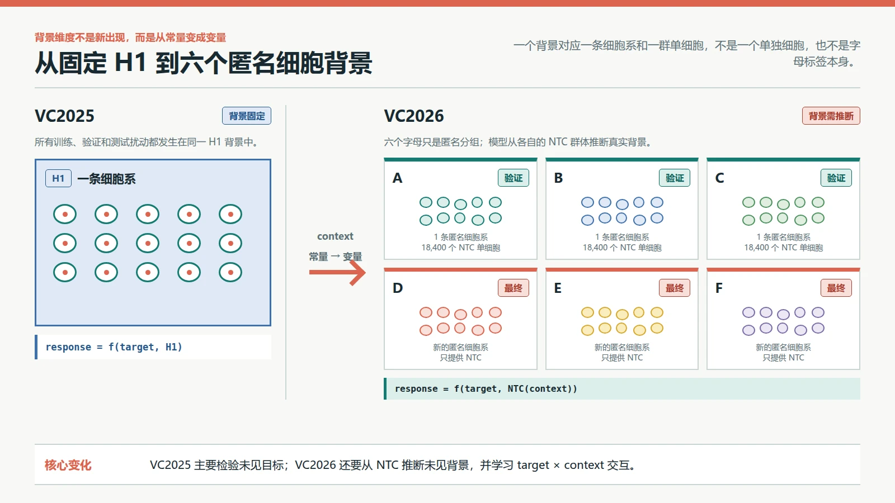
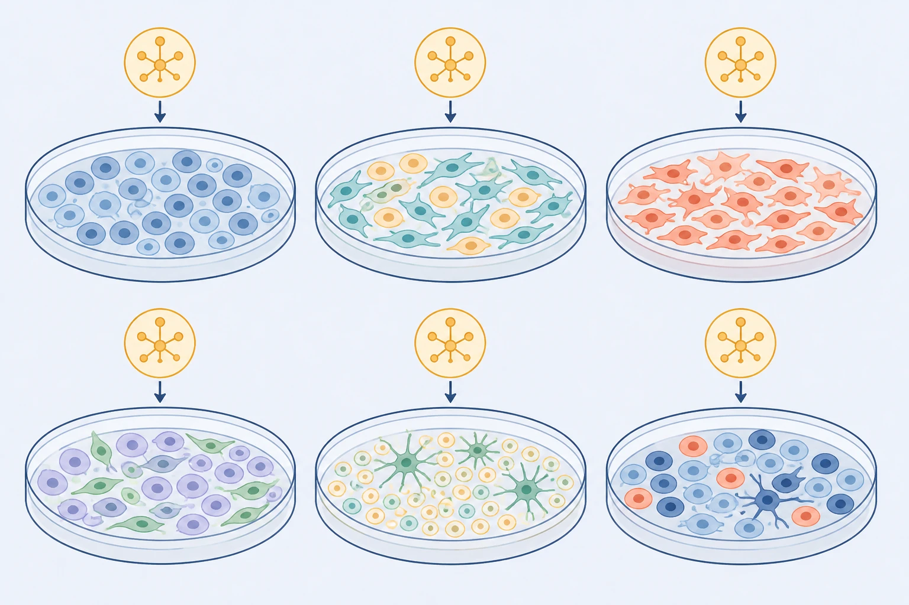
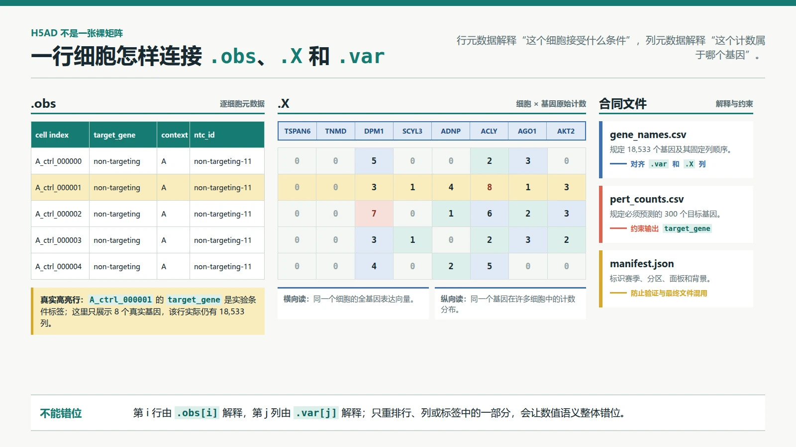
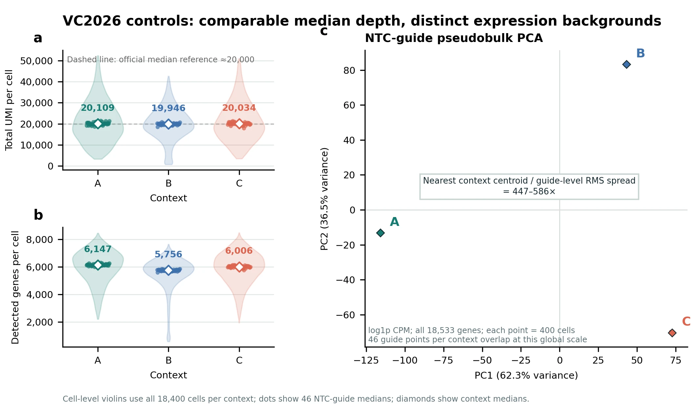

# VC2026 学习指南：数据合同、真实数据审计与首个基线

> 编写日期：2026-08-30
>
> 前置学习：[VC2025 学习指南](00-VC2025学习指南.md)
>
> 本文目标：把 VC2026 的官方文件、单细胞测量含义、真实 A/B/C controls、Python 审计、提交约束和首个基线连成一条完整链路。只阅读这一份文件即可完成当前阶段学习；完整分析代码见 [`scripts/vc2026_control_audit.py`](../../scripts/vc2026_control_audit.py)。

## 0. 学完本课应该能做什么

学完后，你应该能够：

1. 说清楚主办方提供的六个文件分别解决什么问题；
2. 解释为什么 VC2025 的背景是固定常量，而 VC2026 的六个匿名背景是需要从 NTC 推断的变量；
3. 区分单个细胞、细胞类型、细胞系和细胞背景；
4. 从 `.X`、`.obs` 和 `.var` 解释一个 AnnData 文件；
5. 解释原始 UMI 计数为什么有大量零，以及为什么提交不能使用 `log1p` 数值；
6. 解释 46 个 NTC guide 的作用，以及 NTC 为什么不是某个扰动细胞的配对“扰动前状态”；
7. 算出一次完整提交的行数、列数和稠密矩阵规模；
8. 用 Python 分块计算真实每细胞 UMI、检测基因数和 guide 级伪批量 PCA；
9. 说明 NTC 零效应基线保留了什么、故意不预测什么，并根据官方合同检查一个 H5AD 是否具备进入 `vcc prep` 的条件。

本文使用真实 validation controls 讲解输入数据，但不开始训练扰动模型。能够从真实数据核验的数字均来自 A/B/C；官方隐藏的目标扰动真值不会用虚构数字代替。

### 0.1 建议阅读方式

这份文档是自包含教程，不要求你记住其他课程中的所有术语。建议分三个因果单元阅读：

1. **第 1–3 节：实验为什么这样设计。**重点掌握目标基因、guide、CRISPRi、细胞背景和 NTC 的关系；这是本课最重要的部分。
2. **第 4–5 节：实验怎样变成数字。**重点掌握 cell barcode、UMI、原始计数、零值和稀疏矩阵。
3. **第 6–9 节：数字怎样进入比赛流水线。**重点掌握零效应基线、真实 Python 审计、输出合同和验收标准。

不要把记住文件名当作学会。每遇到一个概念，都要能回答四件事：输入是什么、发生了什么操作、输出是什么、它解决了哪个问题。

## 1. 从 VC2025 跨到 VC2026

### 1.1 输入发生了什么变化

VC2025 在已知的 H1 人胚胎干细胞背景中公开了 150 个扰动结果。模型既看过 H1 的 NTC，也看过同一 H1 背景下的许多扰动，因此可以学习这个背景中的扰动规律。

VC2026 不提供挑战赛专用的扰动训练集。验证阶段只公开三个匿名背景 A、B、C 的 NTC；最终阶段再公开三个新的匿名背景 D、E、F 的 NTC。模型不能看到这六个背景中任何目标基因的扰动后真值。[S1]

```text
公开输入
  背景 A/B/C 的 NTC 单细胞原始计数
  + 需要预测的 300 个目标基因
  + 允许合法使用的外部数据和模型
                    |
                    v
模型必须推断
  背景当前是什么状态
  + 目标基因被 CRISPRi 后会产生什么可迁移效应
  + 该效应怎样受当前背景调节
                    |
                    v
提交输出
  3 个背景 x 300 个目标 x 400 个细胞
  = 360,000 个扰动后虚拟细胞
```

**已验证事实**：验证轮每个背景提供 18,400 个 NTC 细胞，来自 46 个 NTC guide，每个 guide 400 个细胞；三个背景共享同一组 300 个待预测目标。[S1]

**工程解释**：模型面对的是两个同时发生的外推：

- **目标外推**：把其他数据中学到的基因扰动效应迁移到当前目标；
- **背景外推**：仅凭匿名背景的 NTC 表达，判断这个背景会怎样改变目标效应。

因此，不能只给每个目标保存一个固定的“扰动向量”，也不能只识别 A、B、C 像哪条已知细胞系。真正需要估计的是 `target × context` 的交互。

#### 1.1.1 “VC2026 多了背景这一维”怎样说才准确

这个理解方向正确，但需要补一个边界：**细胞背景不是到 VC2026 才在生物学上出现。VC2025 也有背景，只是所有数据都来自 H1，所以背景是固定常量。VC2026 才把背景变成模型必须处理的可变输入。**

```text
VC2025
  response = f(target, context = H1)
  context 始终是 H1，因此任务主要检验未见目标泛化

VC2026
  response = f(target, context inferred from NTC)
  context 会从 A/B/C 换到 D/E/F，因此还要检验未见背景泛化
```

所以，VC2026 不是简单地给特征表增加一列 `context=A`。A、B、C 只是匿名编号，编号本身不携带组织、细胞系或生物状态信息。模型必须读取该背景的 NTC 细胞群，才能推断背景。

更准确的变化是：

1. VC2025 学习“固定 H1 背景中，目标变化会怎样改变响应”；
2. VC2026 学习“目标和背景共同变化时，响应怎样变化”；
3. 同一目标在不同背景中的效应不一定相同，因此需要 `target × context` 交互；
4. 新背景内没有扰动真值可供微调，所以这不是普通的多分类条件输入，而是跨背景零样本泛化。

原始计数要求、提交规模和六项评分指标也是 VC2026 的变化，但它们与“背景从常量变成变量”是并列变化，不能全部归因于多了背景维度。



*图 1｜背景从常量变成变量。VC2025 的所有扰动共享 H1；VC2026 的 A–F 分别对应匿名细胞系，一个背景由一群单细胞而不是一个细胞表示。本图使用 HTML/CSS 按官方数字确定性绘制。*

### 1.2 先认清实验里的四个角色

在解释 NTC 前，必须先把目标基因、guide RNA、CRISPRi 执行器和细胞背景分开。它们在数据里经常同时出现，但不是同一种东西。

#### 1.2.1 目标基因：实验想压低谁

**目标基因（target gene）**是实验者希望用 CRISPRi 降低其转录水平的基因。例如目标为 `ADNP`，表示实验者希望 ADNP RNA 相对对照减少。这里的**基因表达（gene expression）**主要用测到的 RNA 数量近似表示；RNA 是基因被转录后产生的分子信息载体，但 RNA 数量不等于最终蛋白数量或功能。

`target_gene = ADNP` 描述的是这个细胞接受的实验条件，不是说这一行只测 ADNP。测序仍会输出全部 18,533 个基因：

```text
一行 ADNP 扰动细胞

target_gene = ADNP                 <- 实验条件标签
.X = [SAMD11=0, NOC2L=3, ...,      <- 全部 18,533 个基因的表达
      ADNP=1, ..., 下游基因=若干]
```

模型既要预测 ADNP 自身是否下降，也要预测它通过调控网络、蛋白复合体或细胞状态产生的下游变化。

#### 1.2.2 guide RNA：把执行器带到哪里

**guide RNA（引导 RNA）**可以拆成两部分理解：

- 一段可变的 spacer 序列负责识别目标 DNA 附近的互补序列；
- 一段相对固定的 scaffold 结构负责结合 Cas9 蛋白。

软件类比上，spacer 像地址，scaffold 像调用执行器所需的固定接口。类比的边界是：分子结合不是精确的软件寻址；染色质可接近性、序列相似性和分子浓度都会影响是否结合。

目标 guide 被设计为把执行器带到目标基因转录起始位点附近。NTC guide 也有完整的 spacer 和 scaffold，也会在细胞中表达，但它的 spacer 不被设计去命中某个人类目标基因。

#### 1.2.3 dCas9-KRAB：执行转录抑制

**CRISPR interference（CRISPRi，CRISPR 干扰）**使用 **dCas9** 和转录抑制结构域降低目标基因的转录。dCas9 是失去 DNA 切割活性的 Cas9；它仍能在 guide 引导下结合 DNA，但不会像基因编辑剪刀那样把 DNA 切断。与它连接的 **KRAB** 抑制结构域会招募使附近染色质更不利于转录的因子。[S5]

目标 CRISPRi 的简化因果链是：

```text
目标 guide 识别目标 DNA 附近序列
              |
              v
把 dCas9-KRAB 带到该位置
              |
              v
目标基因更难被转录
              |
              v
目标 RNA 通常下降，但不保证变成零
              |
              v
目标蛋白和下游网络可能随后改变
```

这里是**敲低（knockdown）**，不是删除基因。guide 被送进细胞也不保证一定强效：落点、细胞状态、染色质、等待时间和 guide 序列都会影响结果。

#### 1.2.4 细胞背景：同一扰动发生在哪个系统中

**细胞背景（cellular context）**不是单一变量，而是会影响表达和扰动响应的一组条件，包括：

- **细胞系（cell line）**：能够在实验室持续培养的一群细胞及其遗传背景；
- **组织来源**：这条细胞系最初来自身体的哪个组织；
- **基础表达状态**：扰动前哪些基因正在高表达或低表达；
- **细胞状态组成**：细胞周期、应激、代谢等状态在群体中的比例；
- **实验状态**：培养条件、批次和测序深度等非目标差异。

这里必须区分四个层级：

| 术语 | 它指什么 | 在 VC2026 中的对应物 |
|---|---|---|
| 单个细胞（cell） | 一个具体细胞，有自己的表达向量 | H5AD 中的一行 |
| 细胞类型（cell type） | 按生物功能和身份划分的类别，例如神经元或肝细胞 | 官方没有公开 A–F 的具体类型，不能从字母直接得出 |
| 细胞系（cell line） | 从某个来源建立、能在实验室持续培养的细胞群及其遗传背景 | 六个背景分别对应六条匿名细胞系 |
| 细胞背景（cellular context） | 细胞系身份加上当前表达状态、群体组成和实验状态 | 模型从该背景的 NTC 群体中实际观察到的条件 |

因此，“VC2026 有六种细胞”在口语上可以帮助建立直觉，但不够精确。最准确的说法是：

> VC2026 有六个匿名细胞背景，分别对应六条不同组织来源的细胞系；每个背景中又包含大量单细胞。

以验证背景 A 为例：[S1]

```text
背景 A
  = 1 条匿名细胞系
  = 46 个 NTC guide 条件
  = 每个 guide 条件 400 个单细胞
  = 18,400 个 NTC 单细胞
  = context_A.h5ad 中的 18,400 行
```

所以六个背景不是六个单独细胞，也不能在官方身份未公开时直接说成六个已知细胞类型。一个背景中的 18,400 个细胞共享细胞系来源，但并非完全相同：它们可能处于不同细胞周期、应激或代谢状态，观测 UMI 深度也会不同。

细胞系不等于组织本身，也不等于一种纯粹的细胞类型。长期培养的细胞系会保留部分来源特征，也可能积累新的遗传和状态变化。比赛中的 `context` 又比“细胞系名称”更宽，因为它还包含当前群体状态和实验测量条件。

同一目标在不同背景中的结果可能不同。例如某基因在背景 A 中几乎不表达，压低它可能只能产生很弱的可测响应；在背景 B 中它高表达且处于关键调控位置，敲低后可能影响许多下游基因。这个例子只说明背景依赖的机制，不表示比赛中的任何具体匿名背景具有这些性质。

VC2026 用 A、B、C 或 D、E、F 隐去细胞系身份。字母本身没有生物含义，真正的背景信息藏在 NTC 群体的表达、测序深度、稀疏性和状态组成中。

以下说法需要避免：

- “A、B、C 是三个单细胞”：错误；每个背景各有 18,400 个公开 NTC 单细胞。
- “A、B、C 是三个已经知道的细胞类型”：错误；官方隐藏了细胞系身份，字母也不是类型名称。
- “同一背景中的细胞完全相同”：错误；它们共享背景，但仍有自然状态和测量差异。
- “把 A/B/C 当作 one-hot 特征就获得了背景信息”：错误；匿名标签只能分组，真正的信息在相应 NTC 分布中。



*图 2｜`target × context` 的视觉直觉。六个相同的黄色目标符号进入六个不同细胞群，提醒我们同一目标的响应可能依赖背景。本图由 GPT Image 参考项目科学信息图风格生成并经人工核对；培养皿中的颜色和形态不代表 A–F 的真实细胞系、组织身份、表达数值或形态学响应，也不是实验机制证据。*

还要区分**生物差异**与**技术差异**。前者来自细胞真正不同的遗传或状态，后者来自实验操作。例如同一细胞系在不同日期、试剂批次、设备或处理人员下测量，可能出现系统性表达偏移；这种与研究问题无关、却按实验批次成组出现的差异叫**批次效应（batch effect）**。NTC 同时含有生物状态和技术过程的结果，模型不能只凭一个表达差异就自动判断其来源。

#### 1.2.5 Perturb-seq：把扰动身份和全转录组绑到一起

**Perturb-seq**把成池 CRISPR 扰动与单细胞 RNA 表达测量结合。它要同时恢复两类信息：

1. **这个细胞接受了哪个 guide 条件？**输出为目标基因或 NTC guide 身份；
2. **这个细胞的全部被测基因表达怎样？**输出为一行全转录组计数。

简化流程是：

```text
携带不同 guide 的许多细胞混合培养
              |
              v
对每个细胞读取 guide 身份与 RNA 表达
              |
              v
一行数据 = 扰动条件标签 + 全基因表达向量
```

如果只能测表达却不知道 guide，就无法判断这一行属于哪个扰动；如果只知道 guide 却不测全转录组，就看不到下游响应。Perturb-seq 的关键正是把两者在单细胞层面关联起来。VC2026 对参赛者隐藏目标扰动行，只公开 NTC 行，但保留真值仍由同类扰动实验产生。[S1]

### 1.4 为什么先研究数据合同

这里的**数据合同（data contract）**是文件生产者和消费者对结构、字段、顺序、类型与约束的共同约定。它类似 API contract，但合同承载的是实验测量矩阵。

这个软件类比的边界是：API 字段错误通常是工程问题；单细胞矩阵即使格式完全合法，也可能包含批次效应、测序深度差异或生物噪声。通过格式校验不等于预测在生物学上正确。

VC2026 的输出很大，且最终阶段只有 14 天。若等模型训练完成后才第一次测试 H5AD 和 `.vcc`，格式、内存或磁盘问题可能直接吞掉最终窗口。因此第一条流水线必须先于复杂模型存在。

## 2. 官方数据包里有什么

验证阶段的 `controls.zip` 约 630 MB，解包后包含三个控制文件和三个共享合同文件。[S1]

| 文件 | 输入 | 保存的内容 | 它解决的问题 |
|---|---|---|---|
| `context_A.h5ad` | 背景 A 的 NTC 细胞 | 18,400 个细胞 × 18,533 个基因的原始计数及元数据 | 告诉模型背景 A 当前的表达状态和测量分布 |
| `context_B.h5ad` | 背景 B 的 NTC 细胞 | 与 A 相同的结构 | 告诉模型背景 B 的状态 |
| `context_C.h5ad` | 背景 C 的 NTC 细胞 | 与 A 相同的结构 | 告诉模型背景 C 的状态 |
| `gene_names.csv` | 官方基因列表 | `gene_name` 表头下的 18,533 个基因符号及固定顺序 | 规定输入和输出矩阵每一列的含义 |
| `pert_counts.csv` | 官方扰动面板 | 300 个目标基因 | 规定每个背景必须预测哪些目标 |
| `manifest.json` | 数据包元数据 | 赛季、分区、面板、背景和细胞数 | 识别数据包身份，防止混用验证轮和最终轮文件 |

这六个文件不是可以独立解释的六份数据。三个 H5AD 的列必须与同一份 `gene_names.csv` 完全一致；输出的目标集合必须来自同一份 `pert_counts.csv`；`manifest.json` 则说明这些文件属于哪一轮。

**实际文件核验**：2026-08-30 下载的 validation 数据中，`gene_names.csv` 有一列表头 `gene_name` 和 18,533 个数据行，`pert_counts.csv` 有一列表头 `target_gene` 和 300 个数据行。读取时应按表头取列，不能用 `header=None` 把表头误当成第一个基因或目标。

### 2.1 H5AD 和 AnnData 是什么

**AnnData** 是单细胞分析中常见的带标签矩阵容器，H5AD 是它基于 HDF5 的磁盘文件格式。最重要的三个部分是：

```text
                     基因 1   基因 2   ...   基因 18,533
细胞 1                  0        7                  1
细胞 2                  2        0                  0    <- .X
...

每一行的说明：.obs
  target_gene, context, ntc_id

每一列的说明：.var
  基因符号，且顺序必须与 gene_names.csv 一致
```

- **`.X`**：细胞 × 基因表达矩阵。VC2026 控制文件中保存原始计数。
- **`.obs`**：逐细胞元数据；行数必须与 `.X` 相同。
- **`.var`**：逐基因元数据；行数必须与 `.X` 的列数相同。

软件上可以把 `.X` 类比为带行列主键的大型事实表，把 `.obs` 和 `.var` 类比为行维表与列维表。类比的边界是：表达矩阵不是确定性的业务记录；同一实验条件下的两个细胞也会因为生物状态和测量过程而不同。



*图 3｜AnnData 数据合同。`.obs` 的第 i 行解释 `.X` 的第 i 行，`.var` 的第 j 行解释 `.X` 的第 j 列；`gene_names.csv`、`pert_counts.csv` 和 `manifest.json` 分别约束基因顺序、目标集合与数据包身份。图中使用 `context_A.h5ad` 的真实前 5 个 cell ID、`ntc_id` 和 8 个真实基因计数；为了可读性只显示 18,533 列中的一小部分。*

#### 2.1.1 用 `context_A` 的真实前两行对齐三部分

从真实 H5AD 选择前两个细胞和 8 个基因，`.X` 子矩阵为：

```text
                 TSPAN6  TNMD  DPM1  SCYL3  ADNP  ACLY  AGO1  AKT2
A_ctrl_000000        0      0     5      0     0     2     3     0
A_ctrl_000001        0      0     3      1     4     8     1     3
```

与它对齐的 `.obs` 是：

| cell index | target_gene | context | ntc_id |
|---|---|---|---|
| `A_ctrl_000000` | `non-targeting` | `A` | `non-targeting-11` |
| `A_ctrl_000001` | `non-targeting` | `A` | `non-targeting-11` |

与列对齐的 `.var` 是：

| column position | gene name |
|---:|---|
| 0 | `TSPAN6` |
| 1 | `TNMD` |
| 2 | `DPM1` |
| 3 | `SCYL3` |
| 4 | `ADNP` |
| 5 | `ACLY` |
| 6 | `AGO1` |
| 7 | `AKT2` |

由此可读出：`A_ctrl_000001` 来自背景 A、携带 `non-targeting-11`，ADNP 的观测 UMI 计数为 4，ACLY 为 8。不能从这一行推出 ADNP 或 ACLY 被扰动，因为实验条件要读 `.obs["target_gene"]`；该值为 `non-targeting`。这里展示的 8 列只是可读切片，真实行仍包含全部 18,533 个基因。

#### 2.1.2 行列对齐为什么不能事后猜

`.X` 的第 $i$ 行永远由 `.obs` 的第 $i$ 行解释；第 $j$ 列永远由 `.var` 的第 $j$ 行解释。单独复制或排序其中一部分会破坏语义：

- 只重排 `.obs`，会把表达谱贴到错误细胞条件上；
- 只重排 `.var`，会把计数贴到错误基因上；
- 拼接多个背景时忘记同步拼接 `.obs`，会让 `context` 标签与表达矩阵错位。

H5AD 只是容器格式，不自动保证内容正确。它可以保存原始计数，也可以保存归一化值；必须结合数据来源、数值检查和官方说明判断 `.X` 的语义。

### 2.2 控制文件的 `.obs`

每个控制细胞至少有以下三个字段：[S1]

| 字段 | 背景 A 中的值 | 含义 |
|---|---|---|
| `target_gene` | 全部为 `non-targeting` | 没有 guide 被设计去抑制某个人类目标基因 |
| `context` | 全部为 `A` | 该细胞属于匿名背景 A |
| `ntc_id` | 如 `non-targeting-11` | 该细胞携带的具体 NTC guide 身份 |

这里有三个不能混淆的身份：

1. `target_gene` 描述实验条件；
2. `context` 描述细胞背景；
3. `ntc_id` 描述具体使用了哪条非靶向 guide。

三个控制 H5AD 中的 `target_gene` 都是 `non-targeting`，但它们不是同一个细胞群。A、B、C 的组织来源、遗传背景和表达状态不同，只是主办方没有公开真实细胞系名称。

特别注意：`ntc_id = non-targeting-11` 不是说第 11 个基因被扰动，也不是一个细胞类型。它只是 NTC guide 库中某条具体 guide 的实验身份。多个细胞可以共享同一个 `ntc_id`，因为它们接受了相同 guide 条件；每一行仍代表一个不同的细胞。

### 2.3 为什么基因顺序是合同的一部分

矩阵本身只保存数值。第 100 列究竟是哪个基因，要由 `.var` 和 `gene_names.csv` 决定。

实际 `gene_names.csv` 的前三个基因是：

```text
[TSPAN6, TNMD, DPM1]
```

若代码错误地把同一批列改成：

```text
[DPM1, TNMD, TSPAN6]
```

即使集合、形状和数值类型都正确，原本属于 TSPAN6 的第一列也会被解释成 DPM1。这不是轻微偏差，而是整列语义错位。因此基因集合相同但顺序不同，仍然违反合同。

## 3. NTC 到底控制了什么

### 3.1 先理解“对照”为什么存在

假设实验后看到 ADNP 扰动组中某些基因发生变化，不能立刻断定“这些变化都是 ADNP 敲低造成的”。因为细胞还经历了许多其他事情：

- 被培养和处理；
- 接触 guide 载体和 CRISPRi 系统；
- 等待一段时间；
- 被固定、通透化和探针检测；
- 被扩增、测序和计算处理；
- 经历细胞自身随机变化和群体抽样。

**对照（control）**的作用，是建立一个除了研究因素外尽量相似的比较条件。研究因素在这里是“guide 是否特异地把 dCas9-KRAB 带到某个目标基因附近”。

一个理想比较是：

```text
目标扰动组经历的共同流程
- 培养
- CRISPRi 系统
- guide 表达
- 等待
- 固定与测序
+ guide 特异地指向 ADNP

NTC 组经历的共同流程
- 培养
- CRISPRi 系统
- guide 表达
- 等待
- 固定与测序
+ guide 不被设计去指向某个人类目标基因
```

两组的差异被尽量集中到最后一项，才有可能把群体表达差异解释为目标扰动效应。这里说“尽量”，是因为现实实验不可能让两组在所有非目标因素上绝对相同。

### 3.2 NTC 的完整定义

**NTC（non-targeting control，非靶向对照）**是一种负对照条件。细胞携带并表达一条完整 guide，但这条 guide 的可变识别序列不被设计去匹配某个人类目标基因，因此不应主动把 dCas9-KRAB 引导到某个研究目标的转录起始区域。

定义中的每个词都有作用：

- **non-targeting**：没有预期的人类基因靶点；不等于分子对细胞绝对零影响；
- **control**：它用来建立比较基线，不是比赛要求模型预测的一个普通目标；
- **guide 仍然存在**：NTC 不是“什么都没做”的细胞，也不是没有 guide 的空白细胞；
- **实验流程仍然存在**：NTC 细胞仍经历 CRISPRi 和单细胞测量相关流程。

它要回答的问题是：

> 在这个细胞背景接受相同实验系统、但没有特定目标基因被设计为敲低对象时，细胞群体的表达和测量分布是什么？

### 3.3 NTC、未处理细胞和目标扰动细胞的区别

| 条件 | 是否有 guide | guide 是否有预期人类靶点 | 是否预计发生特定基因敲低 | 主要用途 |
|---|---|---|---|---|
| 未处理细胞 | 通常没有 | 不适用 | 否 | 观察未进入扰动系统时的状态 |
| NTC 细胞 | 有 | 没有预期靶点 | 否 | 控制 guide、CRISPRi 和共同实验流程，建立比较基线 |
| 目标扰动细胞 | 有 | 有，例如 `ADNP` | 是，但强度不是 100% 保证 | 测量目标敲低及下游响应 |

这个表描述概念差别，不表示 VC2026 会把三类数据都交给参赛者。挑战赛只向参赛者提供匿名背景中的 NTC 表达；目标扰动真值由主办方保留评分。[S1]

为什么不用未处理细胞直接当基线？因为未处理细胞没有经历 guide 表达等共同过程。若目标扰动组与未处理组不同，我们无法判断差异来自目标敲低，还是来自进入 CRISPRi 实验系统的共同影响。NTC 更接近目标扰动组的实验条件。

### 3.4 一个 NTC 细胞是怎样产生和记录的

以下是用于理解数据的因果流程，不是逐项复现实验室 protocol：

1. **输入：一个细胞背景。**例如匿名背景 A 中的一群细胞。这些细胞在遗传背景、基础表达和培养状态上属于同一实验背景，但单个细胞之间仍有差异。
2. **分配 NTC guide。**让细胞携带某条 NTC guide。guide 具有正常的 scaffold 和一段不以人类目标基因为预期靶点的识别序列。
3. **经历 CRISPRi 条件。**细胞处于能够执行 CRISPRi 的系统中；由于 NTC 没有预期靶点，不应发生设计中的特定基因转录抑制。
4. **等待和培养。**NTC 与目标扰动细胞经过可比较的处理时间，使共同的培养、载体和系统影响也进入对照。
5. **固定并测量。**细胞进入相同类型的 10x Flex 单细胞表达测量流程，得到全转录组 UMI 计数。
6. **输出一行数据。**`.X` 保存该细胞的 18,533 个基因计数；`.obs` 保存 `target_gene = non-targeting`、背景标签和具体 `ntc_id`。

所以一个 NTC 细胞同时包含两类信息：

- **生物信息**：这个背景中的细胞本来处于什么表达状态；
- **测量信息**：这个实验流程产生怎样的 UMI 深度、零比例和随机波动。

两类信息混在同一观测中。模型不能自动知道某个差异来自生物状态还是技术过程，必须依靠多背景、多 guide、外部数据和验证协议进一步分解。

### 3.5 `ntc_id` 是什么

`target_gene = non-targeting` 只说明这行属于 NTC 条件，仍没有说明使用了哪条 NTC guide。`ntc_id` 保存的是这条具体 guide 的身份。

例如：

| cell index | target_gene | context | ntc_id |
|---|---|---|---|
| `A_ctrl_000000` | `non-targeting` | `A` | `non-targeting-11` |
| `A_ctrl_000001` | `non-targeting` | `A` | `non-targeting-11` |
| `A_ctrl_000400` | `non-targeting` | `A` | `non-targeting-27` |

前两行是两个不同细胞，只是共享同一 NTC guide；第三行使用另一条 NTC guide。`ntc_id` 不是基因名，不对应 `.X` 的某一列，也不是细胞类型。

### 3.6 为什么每个背景有 46 条 NTC guide

**已验证事实**：每个背景有 46 个 `ntc_id`，每个 `ntc_id` 有 400 个细胞，因此共有：

$$
46\ \text{条 NTC guide}
\times 400\ \text{个细胞}
= 18{,}400\ \text{个 NTC 细胞}
$$

这是 A、B、C 每个控制 H5AD 的行数。[S1]

**实验与工程解释**：使用多条不同 NTC，而不是只使用一条，有几个价值：

1. **避免把一条 NTC 的偶然特性当作整个背景。**某条 guide 的表达量、稳定性或非预期结合可能异常。
2. **观察 guide 间变异。**可以比较 46 组的 UMI 深度、基因均值和状态组成，判断 NTC 条件是否存在分组结构。
3. **扩大对照群体。**18,400 个细胞比 400 个细胞更能覆盖细胞周期、应激和其他自然状态。
4. **估计实验噪声。**同一背景、同为 NTC 的不同 guide 组之间若仍存在差异，说明“没有目标敲低”也不意味着所有群体完全相同。

不能从 `ntc_id` 差异直接推出某条 NTC 产生了真实生物调控。差异还可能来自培养板位置、处理批次、细胞抽样或测序深度。反过来，也不能看到差异就立即删除该 guide，因为比赛真实测量本身也包含实验变异。

### 3.7 NTC 能控制什么，不能控制什么

“控制”不等于把噪声消除，而是让某些影响在比较两组时尽量共同存在。

| 因素 | NTC 是否能帮助控制 | 原因与边界 |
|---|---|---|
| 背景的基础表达 | 能提供基线 | NTC 直接测量当前背景，但仍受采样和测序影响 |
| guide 表达和 CRISPRi 系统的共同影响 | 可以部分控制 | NTC 也携带 guide、经历系统；具体序列仍不同 |
| 固定、探针、扩增和测序流程 | 可以部分控制 | 若实验处理可比，这些影响会共同存在；不同批次仍可能不一致 |
| 自然细胞间异质性 | 能观测其对照分布 | 只能观测采到的群体，不能保证覆盖扰动后出现的新状态 |
| 目标基因直接敲低 | 不能 | NTC 没有该目标，必须由目标扰动数据或可迁移模型学习 |
| 目标 guide 的特异脱靶 | 不能完全控制 | NTC 与目标 guide 序列不同 |
| 敲低导致的死亡或选择 | 不能 | NTC 不经历目标依赖的生存压力 |
| 目标与背景的交互 | 不能直接给出 | NTC 只展示背景，没有展示该目标在此背景中的响应 |

因此，“扰动组减去 NTC”仍不等于无误差的纯因果效应。它是最重要的实验比较起点，但结果仍混有 guide 特异性、抽样、批次和测量误差。

### 3.8 NTC 不是配对的“扰动前细胞”

**单细胞 RNA 测序（single-cell RNA sequencing, scRNA-seq）**为每个细胞分别读取 RNA 表达，但测量会消耗被测材料。一个细胞一旦被固定、处理并测序，就不能再回到过去接受另一种扰动。因此控制文件中的某个 A 背景 NTC 细胞，并不是某个 ADNP 扰动细胞在扰动前的同一个细胞。

真实数据关系是两个群体：

```text
背景 A 的 NTC 群体                  背景 A 的 ADNP 扰动群体
细胞 a1, a2, a3, ...                细胞 p1, p2, p3, ...
          |                                    |
          +---------- 比较群体分布 ------------+
```

不存在 `a1 -> p1`、`a2 -> p2` 的真实配对。模型可以为了计算方便把某个 NTC 细胞映射成一个预测细胞，但这只是模型内部构造，不能解释为实验上追踪了同一个细胞。

### 3.9 为什么这里不能展示 A/B/C 的真实扰动对照

当前下载包只包含 A/B/C 的 NTC。ADNP、ACLY 等 300 个目标的扰动后细胞由 Arc 保留评分，不向参赛者公开。因此本文可以用真实数据展示：

- NTC 中 ADNP、ACLY 等基因实际测到多少；
- A/B/C 的基础表达、UMI、稀疏性和背景差异；
- 不同 `ntc_id` 组之间的变异。

但不能用 validation 真值展示“ADNP 扰动后从多少降到多少”或“下游基因改变多少”。若在这里填入一张看似具体的扰动响应表，那只能是虚构数字，会把教学示例伪装成比赛证据。

真实扰动效应必须等到后续引入有公开真值的 VC2025 或公共 Perturb-seq 数据后再演示；A/B/C 当前只能用于输入审计和生成待评分预测。

### 3.10 模型能从 NTC 学到什么

VC2026 把 NTC 作为匿名背景的唯一挑战赛输入，因此它非常重要。模型可以从中估计：

1. **基础表达**：哪些基因在当前背景中高表达、低表达或几乎不可检测；
2. **状态组成**：细胞周期、应激和其他表达状态大致占多少；
3. **共表达结构**：哪些基因在该群体中一起升降；共表达是统计关联，不自动等于调控因果；
4. **测量分布**：每细胞 UMI、非零基因数、稀疏性和计数方差；
5. **NTC guide 变异**：不同 `ntc_id` 组是否存在系统差别。

但 NTC 本身没有告诉模型：

- 某个目标会被压低多少；
- 哪些下游基因会改变；
- 扰动会不会杀死某类细胞；
- 同一目标在这个背景中的效应与其他背景有何不同。

这些缺失部分必须从外部 Perturb-seq、目标和蛋白信息、基因网络，以及严格的跨背景验证中学习。不能把“充分理解 NTC”误写成“仅凭 NTC 就足以知道所有扰动结果”。

### 3.11 六个常见误区

1. **“NTC 就是没有 guide。”**错误。NTC 有 guide，只是没有预期的人类目标。
2. **“non-targeting 就是绝对没有影响。”**错误。它表示没有设计中的目标效应，不排除共同流程、随机或非预期影响。
3. **“46 个 NTC 是 46 个待预测扰动。”**错误。它们是 46 条对照 guide；待预测的是 `pert_counts.csv` 中的 300 个目标基因。
4. **“一个 NTC 细胞就是一个扰动细胞的扰动前状态。”**错误。两者来自不同细胞群，没有逐细胞配对。
5. **“把 NTC 一行复制后改成 ADNP 标签，就预测了 ADNP。”**错误。这只得到格式合法的零效应基线，没有目标敲低和下游响应。
6. **“评分中的 0 就是 NTC。”**错误。NTC 是实验对照细胞；排行榜的 0 是按保留数据定义的 context-mean 计算参考，两者属于不同层级。[S2]

## 4. 原始计数从哪里来

### 4.1 先分清 cell barcode、UMI 和基因身份

单细胞测量必须同时回答三个问题：

| 标识 | 中文 | 它回答什么 | 同一细胞内是否相同 |
|---|---|---|---|
| cell barcode | 细胞条形码 | 这条测序信息来自哪个细胞？ | 同一细胞的产物共享同一 cell barcode |
| UMI | 唯一分子标识符 | 多条扩增读段是否可能来自同一个原始检测事件？ | 不同原始事件通常获得不同 UMI |
| probe/gene identity | 探针或基因身份 | 这个信号对应哪个基因？ | 取决于检测到的目标基因 |

假设同一细胞中，ADNP 的某个检测事件被扩增并测到 20 次。如果这 20 条读段带有相同的 cell barcode、基因身份和 UMI，计数流程会尽量把它们合并为 1 个事件，而不是记成 20 个 RNA。

当前 controls 只提供 UMI 去重后的 H5AD，不提供原始 FASTQ 读段，因此无法用这批文件展示一个真实分子被扩增成多少条读段；这里的 20 次只解释 UMI 去重机制，不是 A/B/C 的观测统计。

UMI 不是对每个真实 RNA 的完美身份证。不同事件可能偶然获得同一 UMI，测序错误也可能改变 UMI；并且只有成功进入检测链路的事件才有机会被计数。它的作用是显著减小 PCR 扩增副本造成的重复计数，不是消除全部测量误差。

官方所说的“每细胞中位数约 20,000 UMI”表示：把该细胞所有基因的去重计数相加，中位细胞约得到 20,000。它不表示检测到 20,000 个不同基因，也不表示只产生了 20,000 条测序读段。一个基因可以贡献许多 UMI，大量基因仍然为零。[S1]

### 4.2 从 RNA 到矩阵单元格

VC2026 使用 10x Genomics GEM-X Flex。Flex 是面向固定细胞的成对探针检测流程，不能把它悄悄替换成传统 3' scRNA-seq 的“捕获带 poly(A) 尾 RNA 后逆转录”流程。以下只解释形成计数所需的信息链；具体试剂体积、温度和时间以 10x 的正式用户指南为准。[S4][S6]

1. **输入：固定并通透化的细胞。**固定尽量保存当时的 RNA 状态，通透化让检测探针进入细胞；输出仍是保留细胞边界的样本，而不是已经混在一起的 RNA 池。
2. **成对探针杂交。**每个被检测基因对应能够结合目标 RNA 相邻区域的探针对。只有目标序列存在且两侧探针正确结合时，才形成可继续处理的相邻探针对；这一步把“哪个基因”编码进后续产物。
3. **探针连接。**相邻探针被连接成可扩增的产物。未正确配对的探针不应产生同样的有效连接信号，因此连接提高了检测特异性；输出是代表被探测 RNA 的连接产物，不是完整 RNA 的逐字拷贝。
4. **单细胞分隔与条形码。**来自不同细胞的连接产物在分隔后获得细胞条形码和 UMI。细胞条形码回答“来自哪个细胞”，UMI 帮助判断扩增后的多条读段是否来自同一个原始检测事件。
5. **扩增和测序。**连接产物被复制成足以测序的文库，仪器再读取条形码、UMI 和探针相关序列。扩增会制造很多副本，因此读段数不能直接当成原始分子数。
6. **映射、去重和计数。**软件根据探针序列确定基因，根据细胞条形码确定细胞，再合并同一细胞、同一基因中被判断来自同一 UMI 的重复读段，形成 `.X[cell, gene]`。

输出的 UMI count 是对成功形成并测到的探针连接事件的近似计数，不是细胞内真实 RNA 总量的无误差读数。没有成功保存、杂交、连接、扩增或测到的信号不会进入矩阵。

### 4.3 一个零值可能表示什么

`.X[cell, gene] == 0` 至少可能来自：

- 该细胞当时确实几乎没有这个基因的 RNA；
- RNA 存在，但没有被捕获或测到；
- 该基因表达很低，有限测序深度下恰好没有读到；
- 扰动降低了表达，使观察到零的概率升高。

因此，不能把单个细胞中的零直接解释成基因关闭，也不能只靠目标基因是否为零判断 CRISPRi 是否成功。需要比较许多扰动细胞和匹配 NTC 的群体分布。

### 4.4 为什么训练可变换，提交必须回到 count space

训练时常使用 **library-size normalization（文库大小归一化）**，把不同细胞缩放到相同总量，以减小总 UMI 差异；随后常用 `log1p(x) = log(1 + x)` 压缩大计数，同时让零仍保持为零。标准化或潜在表示还会继续改变坐标。这些都是模型内部表示，不再是原始 UMI 计数。

VC2026 评分在原始计数空间进行。提交值必须是有限、非负整数，每个细胞的总计数不得超过 1,000,000；不能把 `normalize_total` 或 `log1p` 后的矩阵直接提交。[S2]

真实细胞 `A_ctrl_000001` 的 ACLY 原始计数为 `8`，经过 `log1p` 后约为 `2.197`。把它四舍五入成 `2` 并不是“近似恢复计数”，而是把压缩后的坐标误当成分子计数。模型若在变换空间预测，必须有一个经过验证的生成或反变换过程，恢复合理的整数计数、测序深度和稀疏性。

#### 4.4.1 测序深度为什么会混进原始计数

从背景 A 中选择总 UMI 最接近第 25 和第 75 百分位数的两个真实细胞：

```text
cell_id        ntc_id            总 UMI   检测基因数   ADNP  ACLY  AGO1  AKT2
A_ctrl_012066  non-targeting-71   13,987      5,302       1     3     1     1
A_ctrl_001898  non-targeting-17   27,233      6,747       0     6     2    11
```

第二个细胞的总 UMI 约为第一个的 1.95 倍，也检测到更多基因；但这不表示每个基因都会按 1.95 倍变化，例如 ADNP 反而从 1 变成 0。单细胞的真实生物状态、随机捕获和测序深度同时影响这些数值，不能用一个全局倍数完整解释。

`normalize_total` 会把两个细胞缩放到相同总量，`log1p` 再压缩大数值。这有助于比较相对表达，却丢失原始总计数尺度，而且不会让两个真实细胞变成相同状态。VC2026 要求生成原始计数，因此模型最终还必须决定：

- 一个预测细胞应有多少总 UMI；
- 这些 UMI 分配给哪些基因；
- 哪些基因为零；
- 400 个细胞之间怎样变化。

只预测一个归一化平均向量，尚未完成这些决定。

## 5. 为什么必须使用稀疏矩阵

### 5.1 先算完整形状

一轮需要：

$$
3\ \text{个背景}
\times 300\ \text{个目标}
\times 400\ \text{个细胞}
= 360{,}000\ \text{行}
$$

基因数为 18,533，因此完整矩阵有：

$$
360{,}000 \times 18{,}533
= 6{,}671{,}880{,}000\ \text{个位置}
$$

仅用 4 字节保存每个位置，稠密数值区也需要约 26.7 GB（约 24.9 GiB），还没有计算 AnnData、行列标签和程序运行时的其他内存。

### 5.2 稀疏不只是压缩文件

官方限制统计的是矩阵实际存储的值，不是最终文件的压缩字节数。完整提交最多允许约 47.5 亿个存储项；稠密数组会存储全部 66.7 亿个位置，因此无论压缩后的 H5AD 看起来多小，都超过限制。[S2]

实际测量数据平均每个细胞约有 5,800 个非零基因。稀疏矩阵只保存这些值和它们的列位置，可以避开大量零值。

最常见的 CSR（Compressed Sparse Row，压缩稀疏行）用三个数组保存矩阵：

- `data`：非零计数；
- `indices`：每个计数属于哪一列；
- `indptr`：每一行在前两个数组中的起止位置。

它适合按细胞取行和分块生成。类比上像只保存日志中真正出现的字段；边界是 CSR 还必须保存列索引，不能只按非零计数数量估算内存。

### 5.3 显式零值仍然有成本

某些计算会让稀疏矩阵的 `data` 中残留值为 0 的条目。它们在数学上等于零，但在存储结构里仍占一个位置，并计入官方上限。

因此生成完成后需要清除显式零值，例如在 SciPy CSR 中调用 `eliminate_zeros()`。还要独立检查：

- `X.nnz` 或等价存储项数量；
- `X.data` 中实际为零的数量；
- 每个细胞的非零基因数分布；
- 每个细胞的总 UMI 分布。

## 6. 两种“能跑通”的输出不能混为一谈

### 6.1 官方随机样例

官方 CLI 提供 `vcc sample`，可以根据官方基因和扰动文件生成形状合法的随机计数，用来测试上传与评分通路。[S3]

它回答的是：

> 我的认证、文件合同、打包和上传链路是否工作？

它不使用真实 NTC，也不试图保留背景表达，因而不是有生物学意义的预测基线。

### 6.2 本课的 NTC 零效应基线

本课定义一个更有解释力的**零效应基线（null-effect baseline）**：对每个背景，从真实 NTC 中选择同一组 400 个细胞，并把这组表达谱复制给该背景的全部 300 个目标。复制后的行使用新的唯一 cell index，并正确标注目标基因和背景。

```text
背景 A 的 18,400 个 NTC
          |
          | 固定随机种子，抽取同一组 400 个细胞
          v
     A 的 NTC 模板
          |
          +--> 标为 ABCD1，400 个细胞
          +--> 标为 ACLY， 400 个细胞
          +--> 标为 ADNP， 400 个细胞
          +--> ... 共 300 个目标
```

对 B 和 C 分别重复该过程，但不能把 A 的模板用于 B 或 C。

### 6.3 为什么同一背景内复用同一组 400 个细胞

**伪批量（pseudobulk）**是把同一条件下许多单细胞的每个基因取和或平均，得到一个群体表达谱。它能降低单细胞随机波动，但会隐藏细胞间差异。

**差异表达基因（differentially expressed gene, DEG）**是比较扰动组和对照组后，被统计方法判断为表达发生可信变化的基因。一个基因是否成为 DEG，不只取决于均值差，还受细胞数、方差、零值和统计阈值影响。

如果为每个目标独立随机抽取 400 个 NTC，即使都来自同一个总体，不同样本也会碰巧包含不同的细胞状态和计数。于是目标之间可能出现不同的伪批量均值，甚至产生偶然的 DEG。这些差异不是模型预测的扰动效应，而是有限随机抽样产生的 **Monte Carlo 噪声**。

同一背景内复用同一模板，会让所有目标拥有完全相同的经验分布。这样模型明确表达：

> 我暂时只知道这个背景长什么样，还没有预测任何目标特异效应。

不同背景使用各自模板，则保留 A、B、C 在测序深度、零比例、基因均值、协方差和细胞异质性上的观测差异。

### 6.4 它保留了什么，又缺失什么

| 层面 | NTC 零效应基线 |
|---|---|
| 背景特异的基础表达 | 保留 |
| 背景特异的 UMI 深度和稀疏性 | 保留 |
| NTC 中已有的细胞间异质性 | 保留 |
| 目标基因自身敲低 | 完全缺失 |
| 下游响应基因 | 完全缺失 |
| `target × context` 交互 | 完全缺失 |
| 新的扰动后异质性 | 完全缺失 |

**工程预期，不是官方承诺**：它应接近“无法区分不同扰动”的参考水平，但不保证排行榜总分精确等于 0。官方的 0 参考由保留数据中的 context mean 定义，而有限细胞重采样、指标实现和参考缩放仍可能产生差异。[S2]

这里的 **context mean** 是一个计算参考：在某个背景中，不区分目标，对所有扰动都给出相同的背景平均预测。它表示模型只知道“这是背景 A”，却不知道“这是 A 中的 ADNP 还是 ACLY”。排行榜把这种无扰动区分能力的参考位置标为 0。它不是一个额外提供的实验细胞组，也不等于 `target_gene = non-targeting` 的 NTC 标签。

这个基线的价值不是竞争力，而是把后续模型的收益拆清楚。以后每个模型至少要回答：它相对该基线新增了哪种目标特异信息？

## 7. 用真实 A/B/C 数据做 Python 审计与可视化

下载后不要立刻画 UMAP 或训练网络。我们先用全部 55,200 个 NTC 单细胞回答三个问题：

1. 三个 H5AD 是否真的是官方承诺的原始稀疏计数？
2. A/B/C 的测序深度和观测复杂度是否相近？
3. 即使总 UMI 相近，三个背景的全转录组状态是否仍能区分？

完整可复现代码是 [`scripts/vc2026_control_audit.py`](../../scripts/vc2026_control_audit.py)。脚本使用全部细胞、全部 46 个 NTC guide 和全部 18,533 个基因，没有为了画图抽样或过滤。

### 7.1 用 backed 模式打开真实 H5AD

三个控制文件各约 200 MB，`.X` 各包含约一亿个稀疏存储值。AnnData 的 `backed="r"` 让大型 `.X` 保持在磁盘，只在切片时读取需要的行；`"r"` 表示只读，不会修改官方数据。

```python
from pathlib import Path

import anndata as ad

controls_dir = Path("data/vcc2026-validation/controls")
adata = ad.read_h5ad(controls_dir / "context_A.h5ad", backed="r")

print(adata.shape)
print(type(adata.X).__name__, adata.X.dtype)
```

真实输出为：

```text
(18400, 18533)
_CSRDataset float32
```

`_CSRDataset` 表示磁盘上的 CSR 稀疏矩阵。`float32` 不表示数据已经归一化：完整分块扫描确认所有存储值都是有限、非负的整数值。这里的“原始计数”描述数值语义，不要求底层 dtype 必须是整数类型。

真实 `gene_names.csv` 带 `gene_name` 表头，因此按列名读取：

```python
import pandas as pd

gene_frame = pd.read_csv(controls_dir / "gene_names.csv")
pert_frame = pd.read_csv(controls_dir / "pert_counts.csv")

genes = gene_frame["gene_name"].astype(str).tolist()
targets = pert_frame["target_gene"].astype(str).tolist()

assert len(genes) == 18_533
assert len(targets) == 300
assert adata.var_names.astype(str).tolist() == genes
```

不能使用 `header=None`，否则 `gene_name` 会被误当成第一个基因，制造假性顺序错误。

### 7.2 真实文件的合同核验结果

| 检查项 | A | B | C |
|---|---:|---:|---:|
| 细胞数 | 18,400 | 18,400 | 18,400 |
| 基因数 | 18,533 | 18,533 | 18,533 |
| `ntc_id` 数 | 46 | 46 | 46 |
| 每个 `ntc_id` 的细胞数 | 400 | 400 | 400 |
| `target_gene` | `non-targeting` | `non-targeting` | `non-targeting` |
| 基因顺序匹配 | 是 | 是 | 是 |
| 有限、非负、整数值 | 是 | 是 | 是 |
| 稀疏结构中的显式零 | 0 | 0 | 0 |

这一步证明结构和计数语义正确，不证明任何背景机制或扰动效应。

### 7.3 从稀疏矩阵计算细胞级指标

对细胞 $i$，每细胞总 UMI 为：

$$
L_i = \sum_{g=1}^{18{,}533} X_{ig}
$$

$L_i$ 混合了细胞内 RNA 丰度、捕获效率和测序深度，不能被解释为纯粹的细胞大小。

每细胞检测基因数为：

$$
D_i = \sum_{g=1}^{18{,}533} \mathbf{1}(X_{ig} > 0)
$$

$D_i$ 回答有多少基因至少检测到 1 个 UMI，反映观测表达复杂度，但仍受深度和表达分布影响。

脚本每次读取 512 行：

```python
for start in range(0, adata.n_obs, 512):
    stop = min(start + 512, adata.n_obs)
    block = adata.X[start:stop].tocsr()

    total_umi = block.sum(axis=1).A1
    detected_genes = block.indptr[1:] - block.indptr[:-1]
```

因为实际矩阵没有显式零，CSR 每行存储项数正好等于检测基因数。一般数据不能盲目依赖这个等式，应先检查或清除显式零。

### 7.4 真实描述性统计

单细胞计数分布不对称，所以用中位数描述中心，用第 25–75 百分位数，即四分位距（interquartile range, IQR）描述主体范围：

| 背景 | 总 UMI 中位数 | 总 UMI IQR | 检测基因中位数 | 检测基因 IQR | 矩阵非零比例 |
|---|---:|---:|---:|---:|---:|
| A | 20,109 | 13,986–27,234.5 | 6,147 | 5,296–6,842 | 32.23% |
| B | 19,946 | 15,721.5–24,708.75 | 5,756 | 5,197–6,241 | 29.78% |
| C | 20,034 | 14,414–26,741.5 | 6,006 | 5,182–6,720 | 31.73% |

三个总 UMI 中位数都接近官方给出的约 20,000，说明没有某个背景整体深一倍的明显失衡。但 B 的检测基因中位数比 A 少 391 个、比 C 少 250 个。**总 UMI 接近，不等于计数分配到基因上的方式相同。**

差异可能同时来自真实背景表达、细胞状态组成、探针效率或实验批次，仅凭这张表不能唯一归因。

### 7.5 用一张 Python 图建立证据链



*图 4｜VC2026 validation controls 的真实数据审计。a，每个背景 18,400 个细胞的总 UMI 分布；彩色小点为 46 个 `ntc_id` 各自的中位数，白色菱形为背景中位数，虚线为官方约 20,000 UMI 参照。b，相同细胞的检测基因数。c，每个 `context × ntc_id` 将 400 个细胞求和，转成 log1p CPM 后，使用全部 18,533 个基因做 PCA；每个背景 46 个点在全局尺度上高度重叠。图中没有抽样、过滤或显著性检验。*

面板 a 和 b 的半透明形状是**小提琴图（violin plot）**：

- 纵轴是指标值；
- 某个高度越宽，表示越多细胞落在该数值附近；
- 宽度表示密度，不是绝对细胞数；
- 彩色小点是 46 个 `ntc_id` 各自的中位数，不是单细胞；
- 白色菱形是整个背景的中位数。

面板 a 中，guide 中位数都聚集在约 20,000 附近，支持 NTC guide 组的总体深度相近，但不能证明每个基因表达都一样。面板 b 中，B 的检测基因数整体更低，说明模型不能只匹配总 UMI。

同时画小提琴、小点和菱形，是为了保留三个层级：全部细胞分布、guide 组中心和整个背景中心。只画其中一种会丢失另外两层信息。

### 7.6 从 400 个细胞到 guide 级伪批量 PCA

每个背景有 46 个 NTC guide，每个 guide 恰好 400 个细胞。对同一 `context × ntc_id` 的 400 行逐基因求和：

$$
P_{cg} = \sum_{i \in (c,\,ntc\_id)} X_{ig}
$$

得到 138 个样本 × 18,533 个基因。为减小伪批量总 UMI 的轻微差异，先转 CPM：

$$
CPM_{cg} = \frac{P_{cg}}{\sum_g P_{cg}} \times 10^6
$$

再计算 $Z_{cg}=\log(1+CPM_{cg})$。这个变换只用于探索结构，不是提交格式。

PCA（principal component analysis，主成分分析）从 18,533 个基因中寻找解释样本间最大变化的线性方向。它类似从大量相关监控指标中提取主要变化模式；但 PC1、PC2 是数学方向，不自动对应某条通路或机制。

本分析使用全部 138 个伪批量样本和全部 18,533 个基因，不选择高变基因：

```python
library_sizes = pseudobulk.sum(axis=1)
log_cpm = np.log1p(pseudobulk / library_sizes[:, None] * 1_000_000)
centered = log_cpm - log_cpm.mean(axis=0, keepdims=True)

u, singular_values, _ = np.linalg.svd(centered, full_matrices=False)
scores = u[:, :2] * singular_values[:2]
```

实际结果：

- PC1 解释 62.3% 的样本间方差；
- PC2 解释 36.5%；
- 两者合计约 98.8%；
- 每个背景 46 个 guide 点在全局尺度上几乎重叠；
- 最近背景中心距离是 guide 级 RMS 组内扩散的 447–586 倍。

所以在这个预处理和二维 PCA 中，背景间差异远大于同背景 NTC guide 间差异。这支持模型从 NTC 表达中提取背景信息，但不能推出：

- A/B/C 分别是哪条细胞系；
- 分离全部来自生物差异而不是批次；
- PCA 距离等于扰动响应距离；
- PC1 或 PC2 对应单一生物过程；
- 447–586 倍是可推广到其他数据的生物常数。

PCA 轴正负号可以整体翻转，应该解释相对距离，而不是“A 一定在左边”。

### 7.7 当前证据能回答什么

| 判断 | 当前证据是否支持 | 原因 |
|---|---|---|
| 三个背景总 UMI 数量级相近 | 支持 | 中位数均约 20,000 |
| 三个背景检测基因复杂度完全相同 | 不支持 | 中位数和分布不同 |
| NTC 表达包含强背景信号 | 支持 | guide 级伪批量 PCA 清晰分离 |
| 46 个 NTC guide 在所有基因上完全无差异 | 不支持 | 只证明组内变异远小于背景间变异 |
| 可以识别 A/B/C 的真实细胞系 | 不支持 | PCA 显示差异，不提供身份 |
| 可以据此预测任意目标扰动 | 不支持 | NTC 没有扰动真值 |
| PCA 分离证明纯生物因果差异 | 不支持 | 生物背景和技术批次仍可能混合 |

### 7.8 复现脚本与图表 QA

脚本带 PEP 723 内联依赖，不需要修改项目 `pyproject.toml`：

```bash
uv run scripts/vc2026_control_audit.py
```

默认读取 `data/vcc2026-validation/controls/`，输出到被 Git 忽略的 `output/vc2026-control-audit/`：

| 文件 | 内容 |
|---|---|
| `cell-qc.csv` | 55,200 行逐细胞 UMI 和检测基因数 |
| `ntc-guide-summary.csv` | 138 行 guide 级中位数和 IQR |
| `pseudobulk-pca.csv` | 138 行 PCA 坐标 |
| `audit-summary.json` | 合同、完整性、分位数和 PCA 口径 |
| `validation-control-audit.svg` | 可编辑文字的主图 |
| `validation-control-audit.pdf` | PDF 字号审计输入 |
| `validation-control-audit.png` | 300 dpi 预览图 |

图中面板 a、b 的 `n=18,400` 个细胞/背景；46 个点各来自 400 个细胞；没有假设检验。面板 c 的 `n=138` 个伪批量样本；447–586 倍只在 PC1/PC2 二维坐标中计算。Python figure source QA 为 18 项通过、0 项失败；PDF 最小文字 5.8 pt。SVG/PDF 是可编辑主输出，教程 WebP 是 300 dpi PNG 的压缩阅读副本。

## 8. 输出合同与本地预检

### 8.1 一个合法预测 H5AD

预测文件只包含扰动细胞，不包含 NTC。它应满足：[S1]

| 部分 | 要求 |
|---|---|
| `.X` | `360,000 × 18,533` 的原始、有限、非负整数计数；稀疏存储 |
| `.obs["target_gene"]` | `pert_counts.csv` 中每个目标在每个背景恰好出现 400 次 |
| `.obs["context"]` | 正确使用 A、B、C，不能交换或重命名 |
| `.var_names` | 与 `gene_names.csv` 完全相同且顺序一致 |
| NTC 行 | 必须为 0 行 |
| 单细胞总计数 | 不超过 1,000,000 |
| 存储项 | 整个矩阵不超过约 47.5 亿项；显式零值也计算在内 |

建议让 `.obs_names` 唯一。表达谱可以重复，但每一行仍应有独立的行标识，便于审计和定位错误。

### 8.2 CLI 安装、认证和下载

官方 CLI 包名为 `vcc-cli`，命令名为 `vcc`：[S3]

```bash
uv tool install vcc-cli
vcc --version
```

认证需要先在竞赛网站的 Account → Credentials 生成 API key，再通过隐藏输入登录：

```bash
vcc login --token-stdin
vcc whoami
```

不要把 token 写进脚本、Markdown、命令历史示例或 Git。无系统 keyring 的远程环境可临时使用进程环境变量 `VCC_TOKEN`；仍不能把真实值写入仓库 `.env.example`。

列出并下载控制数据：

```bash
vcc datasets list
vcc datasets download controls -d data/vcc2026-validation
unzip -o -j data/vcc2026-validation/vcc_2026_controls.zip \
  -d data/vcc2026-validation/controls
```

下载命令取得并校验 ZIP，但不会替你解释或审计其中的 H5AD；这里显式解压到独立的 `controls/` 子目录。`data/` 已被本仓库的 `.gitignore` 排除。下载完成后仍应确认实际文件名、路径和大小，再开始分析。

### 8.3 先 dry-run，再生成 `.vcc`

假设预测 H5AD 和合同文件位于以下路径：

```bash
vcc prep output/submissions/ntc-baseline.h5ad \
  -g data/vcc2026-validation/controls/gene_names.csv \
  --perts data/vcc2026-validation/controls/pert_counts.csv \
  -o output/submissions/ntc-baseline.vcc \
  --dry-run
```

`--dry-run` 只检查，不写出 `.vcc`。通过后移除该参数，才真正打包：

```bash
vcc prep output/submissions/ntc-baseline.h5ad \
  -g data/vcc2026-validation/controls/gene_names.csv \
  --perts data/vcc2026-validation/controls/pert_counts.csv \
  -o output/submissions/ntc-baseline.vcc
```

`vcc prep` 会检查基因、背景、目标、细胞数、计数和密度合同，但它不会证明预测具有真实扰动效应。

## 9. 当前实现状态与首个基线验收标准

真实数据审计已经完成：A/B/C 合同、逐细胞 QC、guide 汇总、PCA、SVG/PDF/PNG 导出和图表 QA 都可由同一脚本复现。首个 NTC 零效应基线仍应按以下证据验收：

1. 复用已经生成的 JSON 数据审计报告，不另写一套不一致的读取逻辑；
2. 固定随机种子，能够重复选择每个背景的 400 个 NTC 模板细胞；
3. 同一背景内所有目标复用同一模板，不把独立抽样噪声伪装成扰动效应；
4. 输出行标签、背景标签、目标数量和基因顺序全部来自官方文件，不在代码中手写；
5. 输出采用 CSR 或等价稀疏结构，清除显式零值，并报告存储项数量；
6. 用小型合成 H5AD 做自动化测试，不需要每次测试都生成完整大文件；
7. 用真实 A/B/C 数据生成完整 H5AD，并通过 `vcc prep --dry-run`；
8. 记录运行时间、峰值内存、H5AD 大小和 `.vcc` 大小，为最终轮容量规划提供依据。

到这里，我们建立的还不是扰动预测模型，而是一个可信的实验台：输入合同清楚、真实背景信号已经验证、基线含义明确、失败可以定位。后续才进入六项评分指标和公开扰动真值，区分“表达像这个背景”与“真的预测对了这个扰动”。

## 10. 诊断题

如果 A/B/C 的总 UMI 中位数几乎相同，但检测基因数和伪批量 PCA 明显不同，为什么不能得出“测序深度已经完全校正，所以 PCA 分离一定是纯生物差异”？这又为什么说明零效应基线必须分别使用 A、B、C 自己的 NTC？

<details>
<summary>答题要点：先自行作答，再展开</summary>

总 UMI 相近只排除了明显的整体深度失衡，不能排除基因特异探针效率、培养与处理批次、状态组成或其他技术差异；CPM、`log1p` 和 PCA 也不会自动删除批次效应。因此 PCA 证明 NTC 中存在稳定的背景相关信号，但该信号可能同时包含生物背景与技术过程。正因为三个 NTC 分布真实不同，零效应基线必须保留各自背景，不能把 A 的细胞复制给 B/C；同一背景内则应复用同一模板，避免用独立抽样噪声伪造目标效应。

</details>

## 11. 来源与陈述边界

- [S1] [VC2026 官方 About the Data 本地保存页](../Official-website/About-the-Data.md)：数据规模、文件结构、字段、提交形状和计数约束。
- [S2] [VC2026 官方 FAQ 本地保存页](../Official-website/FAQs.md)：日期、原始计数、稀疏存储限制、评分参考尺度和 `cell-eval2`。
- [S3] [VCC CLI 官方指南](https://vcc-cli-wiki.virtualcellchallenge.org/)：CLI 安装、认证、数据下载、随机样例、预检和打包命令；访问日期 2026-08-30。
- [S4] [10x Genomics Single Cell Gene Expression Flex](https://www.10xgenomics.com/products/single-cell-gene-expression-flex)：固定样本、成对探针检测与条形码信息链；访问日期 2026-08-30。具体实验操作以对应试剂版本的正式用户指南为准。
- [S5] [Arc：Behind the Data of the Virtual Cell Challenge](https://arcinstitute.org/news/behind-the-data-virtual-cell-challenge)：CRISPRi、guide 设计、Perturb-seq 数据质量和挑战数据生成背景；访问日期 2026-08-30。
- [S6] [Abay et al., *Transcript-specific enrichment enables profiling rare cell states via scRNA-seq*](https://doi.org/10.1101/2024.03.27.587039)：bioRxiv v1 原文的 assay rationale 明确描述 Flex 通过全转录组探针对的相邻杂交和随后连接检测固定细胞中的转录本；用于核验检测信息链，不作为 VC2026 实验参数来源；访问日期 2026-08-30。
- [真实数据审计脚本](../../scripts/vc2026_control_audit.py)：全量读取 55,200 个 validation NTC 细胞，生成合同检查、逐细胞 QC、guide 级伪批量 PCA 与图 4；Python/matplotlib，分析日期 2026-08-30。

本文中关于官方数据和格式的数字为已验证事实；A/B/C 的 UMI、检测基因数、矩阵密度和 PCA 数字来自实际下载文件的全量计算。`target × context` 分解、NTC 模板复用方式及其预期分数仍属于工程解释或本项目基线约定，必须通过后续公开扰动真值和排行榜结果验证。
