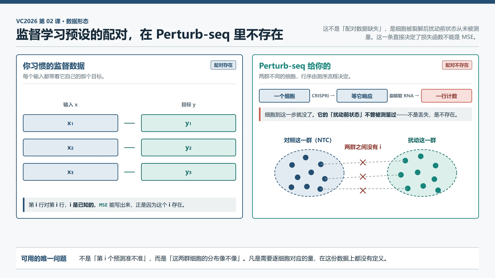
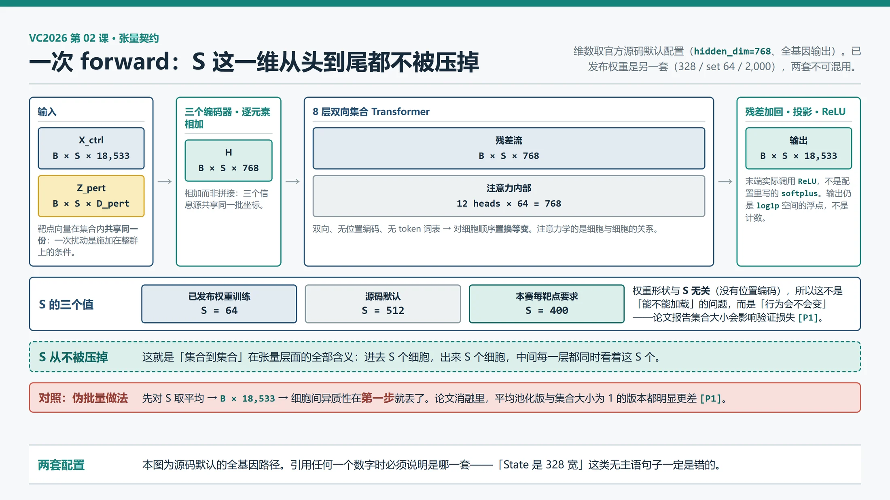
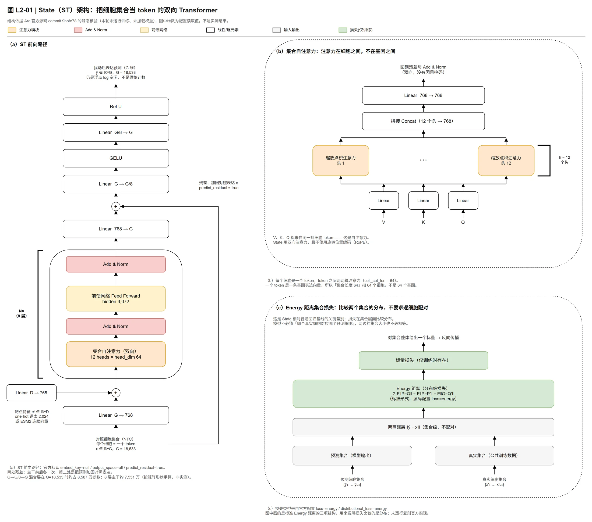
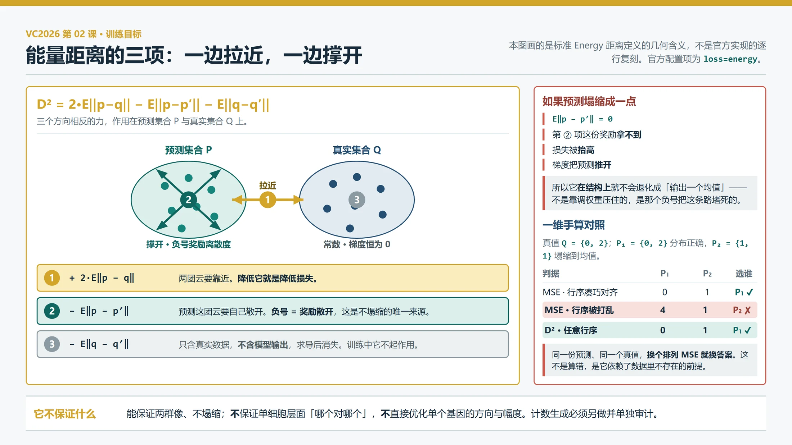

# 02｜State 模型拆解：把扰动预测写成集合到集合

> **本课回答**：State 为什么长成这样——它赌什么、`forward()` 里每个模块在解决哪个问题、训练目标为什么不能换成 MSE。
>
> **前置**：[00 VC2025 学习指南](00-VC2025学习指南.md)、[01 数据合同与首个基线](01-数据合同与首个基线.md)。这两课读完就够，不需要别的。
>
> **下一课**：03《State 上手：微调、原始计数输出与算力预算》。
>
> 核验日期：2026-09-18。面向熟悉软件开发与机器学习、生物学正在补课的读者。
>
> **本课的证据性质**：全部结构、维度和代码路径取自固定 commit 的官方仓库与已发布权重的配置文件，属于**静态核验**——本机未安装 `arc-state`、未下载权重、未运行训练。论文结论一律标 `[P1]`，**未在本项目复现**。因此本课不给出任何实测显存或速度数字。
>

---

## 0. 接上一课：你现在手里有什么

01 结束时，你手里有一个能通过官方预检的 `.vcc`。它的内容是**零效应基线**：从背景 A 的 18,400 个 NTC 里固定抽 400 个细胞，把这一组表达谱原样复制给 A 的全部 300 个靶点（01 §6.2）。

```text
01 结束时的链路

  背景 A 的 18,400 个 NTC ──抽 400 个──→ 复制 300 份 ──→ 120,000 行 ──→ .vcc
                                            ▲
                                    这个位置上没有模型
```

这条链路完整、合法、可提交，唯一的问题是中间那一格是空的。它对 300 个靶点说的话完全一样，所以它「无法区分不同扰动」——01 §6.4 已经把这件事说死了。

本课只做一件事：**看懂别人往那一格里放了什么。**

```text
本课之后你能读懂的链路

  背景 A 的 18,400 个 NTC ──抽 S 个──→ ┌──────────┐ ──→ S 个扰动后细胞
                                        │  State   │
        靶点名字（例如 ADNP）───────→  └──────────┘
```

> **一个贯穿全课的例子。** 下面全程用**背景 A、靶点 `ADNP`**。这个基因名来自 01 §6.2 的示意，只当占位符用，本课不对它做任何生物学断言。每讲一个张量、一个模块，都会回到「A 和 ADNP 现在走到哪了」。

---

## 1. 一句话：它把问题写成了集合到集合

**State 把「扰动预测」写成了一个集合到集合的学习问题——给它一组同背景的对照细胞和一次扰动的标签，它输出同样数量的一群扰动后细胞；训练时不要求哪个预测细胞对应哪个真实细胞，只要求两群细胞的分布一致。**

这个「不要配对」的决定，是它后面**所有**设计选择的根源。本课剩下的部分基本上都在展开这一句。

### 1.1 一个细胞 = 一个 token

这是理解整个模型的钥匙，也是最容易被软件背景的人一眼扫过去的一句话。它的字面意思就是字面意思：

```text
  语言模型                          State
  ──────────────────────           ─────────────────────────────────
  一句话    = 一串 token            一个集合   = 一堆 token
  一个 token = 一个词                一个 token = 一个细胞
                                                （一个 18,533 维的表达向量）
  token 有顺序，顺序携带信息         细胞没有顺序，顺序不携带信息
```

所以那个 Transformer 不是在读句子，它是在读**一群细胞**，问的是「这群细胞里谁和谁像、这群细胞整体处在什么状态」。

> **类比的边界。** 「细胞就是 token」在「都是一个待注意的向量」这一层成立，在「顺序」这一层必须立刻断开。语言模型花很大力气保住顺序（位置编码、因果掩码），State 花同样大的力气**销毁**顺序——具体怎么销毁的在 §4.2。如果你带着语言模型的直觉去读它的注意力配置，会觉得那些设置全是 bug。

### 1.2 够用版：这一课里怎么判断「好」

官方六项指标在[第 04 课](04-你怎么知道改进是真的.md)讲透。这里只需要一个够用的判据，来自 README §5 的三条成绩线：

| 成绩线 | 它检查什么 | 本课会用它来判断什么 |
|---|---|---|
| **生物效应线** | 下游基因变化的方向与幅度是否合理 | 模型有没有对不同靶点说不同的话 |
| **群体分布线** | 400 个细胞的总 UMI、方差、零比例、状态组成像不像真实群体 | 模型有没有把 400 个细胞压成同一个细胞 |
| **工程合同线** | 基因顺序、行数、计数类型是否正确 | 输出能不能被正确评分 |

**本课最关键的是第二条。** 你会看到 State 的损失函数是专门为了守住这一条而设计的——而最自然的那个替代品（MSE）会当场把它毁掉。完整的六项指标口径见[第 04 课](04-你怎么知道改进是真的.md)。

---

## 2. 不配对：这个赌注从哪来

### 2.1 先讲机制，不讲名词

**Perturb-seq** 的一次测量是这样完成的：把细胞裂解开，让细胞膜破掉，把里面的 mRNA 释放出来，抓到微珠或微孔上，做逆转录、扩增、测序。

关键在第一步：**细胞被裂解了。** 它不再是一个活细胞，也不可能再被测第二次。

```text
  一个细胞 ──施加 CRISPRi──→ 等它响应 ──裂解取 RNA──→ 一行计数
                                            ▲
                                    细胞到这里就没了
                                    不存在「扰动前的那一次测量」
```

所以一个被扰动细胞的「扰动前状态」在数据里**根本不存在**——不是没记录、不是丢了，是物理上不曾被测量过。

> **对照组补的是什么。** 01 §3.8 已经讲过：NTC 不是「配对的扰动前细胞」。它补的是**群体层面**的参照——「同一个背景里，没被有效扰动的细胞群长什么样」。群体对得上，个体对不上。

### 2.2 于是你的训练数据长这样



*图 1｜监督学习预设的配对数据（左）与 Perturb-seq 实际给出的两群细胞（右）。右侧两群之间没有任何行与行的对应关系，行序由测序流程决定，是任意的。本图为概念示意，不含实测数值。*

```text
  你习惯的监督数据              Perturb-seq 给你的
  ──────────────────           ────────────────────────
  (x₁, y₁)                     对照这一群：{c₁, c₂, …, c_S}
  (x₂, y₂)                     扰动这一群：{t₁, t₂, …, t_S}
  (x₃, y₃)
     ▲                              ▲
  第 i 行对第 i 行              两群之间没有 i
```

### 2.3 你可能会这样想

> **想法：** 那我按细胞 barcode 对齐不就行了？每个细胞不是都有唯一 ID 吗？

**为什么错。** cell barcode 确实唯一（01 §4.1），但它标识的是「哪个微滴」，不是「哪个细胞在扰动前后的同一身份」。对照细胞和扰动细胞是**两批不同的细胞**，barcode 在它们之间没有可比性。对齐 barcode 等于把两个不相干的编号硬凑成一对。

**正确的图景**：这里唯一有意义的问题是「这两群细胞的分布像不像」。任何需要「第 i 个对第 i 个」的东西都用不了——这一条会在 §5 直接决定损失函数长什么样。

### 2.4 State 押的三个赌

| 赌 | 具体内容 | 赌错了会怎样 |
|---|---|---|
| **赌集合比均值信息多** | 扰动响应不是一个均值向量能描述的；同一批细胞里有细胞周期、状态比例、扰动效率造成的**残余异质性**，必须让细胞之间互相看见才能建模 | 直接对伪批量均值建模就够了，8 层自注意力白花钱 |
| **赌规模与多样性** | 1.67 亿观察性细胞 + 超过 1 亿扰动细胞的规模，足以让「跨背景」从数据里涌现，不需要显式的背景特征工程 | 跨背景迁移的上限被数据的背景多样性封顶，加数据无效 |
| **赌不必配对** | 可以用集合级的分布距离当训练目标，绕开「同一个细胞扰动前后各测一次」这件做不到的事 | 训练信号被离散度项主导，单细胞精度学不到 |

论文为第一和第三个赌给了消融证据：在 Tahoe-100M 上，**增大集合规模会显著改善验证损失，直到一个最优点**（256 个细胞最优）；把自注意力换成平均池化（伪批量版）或把集合大小设成 1（单细胞版）都明显更差；移除自注意力性能下降。`[P1]`

---

## 3. 输入输出契约：四个张量

### 3.1 一次 forward 里流动的是什么

回到 A 和 ADNP。你要喂给模型的东西只有两样：**一组 A 的 NTC 细胞**，和**「这次扰动是 ADNP」这个标签**。

```text
  A 的 NTC 里抽 S 个细胞 ──→ X_ctrl
  「靶点是 ADNP」        ──→ Z_pert  ← 这一个向量，S 个细胞全都用同一份
                             ↓
                        [ State ]
                             ↓
                     S 个扰动后细胞
```

论文把输入写成四个张量（`[P1]` 式 12），源码里对应 `state_transition.py` 的 `forward()` 取 `batch["pert_emb"]`、`batch["ctrl_cell_emb"]`、`batch["batch"]`，监督目标取 `batch["pert_cell_emb"]`（`[S1]`）：

| 张量 | 形状 | 含义 |
|---|---|---|
| `X_ctrl` | `B × S × G` | 对照（NTC）细胞集合，每个细胞一个 `G` 维表达向量 |
| `Z_pert` | `B × S × D_pert` | 扰动嵌入；**同一集合内所有细胞共享同一个** |
| `Z_batch` | `B × S × D_batch` | 可选的批次嵌入（本赛没有这一列） |
| `X_target` | `B × S × G` | 监督目标：同背景同靶点的真实扰动细胞集合 |

`B` 是**集合的个数**，不是细胞数；`S` 是每个集合里的细胞数（配置项 `cell_set_len`）；`G` 是基因数。



*图 2｜一个集合从输入到输出的形状流转。`S` 这一维在整条链路上从不被压掉，这是「集合到集合」在张量层面的全部含义。维数取官方源码默认配置（`hidden_dim=768`、全基因输出），与已发布权重的那一套不可混用（见 §3.3）。*

**`Z_pert` 为什么在集合内共享？** 因为扰动是施加在**整个集合**上的条件，不是每个细胞各自的特征。「这 400 个细胞都被敲低了 ADNP」——这句话里只有一个 ADNP。模型要学的是「这一个条件会把这一群细胞整体推到哪去」。

### 3.2 一个反直觉的细节：注意力宽度 ≠ hidden

`hidden_dim=328` 的那套配置里，`num_attention_heads=12`、`head_dim=64`，于是 `q/k/v` 把 328 投影到 `12 × 64 = 768`，`o_proj` 再降回 328。**注意力内部宽度是 768，主干残差流是 328。**

这直接给出一条操作规则：**不要为了「能整除」擅自把 head 数改成能整除 328 的值。** 投影后的宽度由配置决定，不是由 `hidden_dim / heads` 推出来的。复制父配置的真实结构，比套用一般 Transformer 的经验规则可靠（`[S2]`）。

### 3.3 两套配置，绝不能合并成一句话

⚠️ 官方同时存在**已发布权重**和**源码默认**两套数字，它们**不是同一个模型**。完整对照表在 §9 快查区。这里只要记住下面这三句话都是错的：

- 「State 是 328 宽的」
- 「State 每个集合 64 个细胞」
- 「State 输出 2,000 个基因」

每一句都缺主语。正确的说法必须带上「在哪一套配置下」。这是本项目最容易犯的引用错误。

### 3.4 和比赛合同的四处对不上

这四处是[第 03 课](03-State上手.md)的全部工作量，这里只列出来让你知道它们存在：

1. **基因轴**：那两套是 2,000 或 18,533，本赛要 18,533 —— 两端的线性层要动。
2. **集合长度**：训练用 64 或 512，本赛每靶点要 400 个细胞。
3. **输出类型**：模型输出 `log1p` 空间的浮点，本赛合同要**原始整数计数**（01 §4.4）。
4. **靶点表示**：one-hot 只覆盖预训练见过的靶点，本赛 300 个靶点是**未见**的。

每一条要改哪一层、哪些权重能迁移、哪些必须重训，**完整版见[第 03 课](03-State上手.md)**。

---

## 4. 架构：每个模块在解决哪个问题



*图 3｜State Transition（ST）的结构。维数取自官方源码默认配置与已发布权重两套，两套不能混用（§3.3）；图内每个数字的来源与证据等级见 `docs/style/prompts/L2-01-state-architecture-facts.md`。*

`forward()` 的完整路径（`[S1]`，对应 commit `9bbfe78` 的 `state_transition.py`）：

```text
pert  ── pert_encoder (MLP) ──────┐
ctrl  ── basal_encoder (Linear) ──┼─→ 逐元素相加 ─→ 8 层双向集合 Transformer ─→ 残差加回 ─→ project_out ─→ [ReLU]
batch ── batch_encoder (Emb.) ────┘
```

下面逐段说每一格在解决什么问题。

### 4.1 三个编码器：把三种信息压到同一个向量空间

| 编码器 | 做什么 | 要注意的 |
|---|---|---|
| `basal_encoder` | 对照细胞 `G → d_h` | **默认配置下它是单层 `Linear`，不是 MLP**——`n_encoder_layers=1` 时 `build_mlp` 只返回 `nn.Linear`（`[S1]`）。论文写的是「四层 GELU MLP」`[P1]`，这是论文与已发布配置的一处**真实差异** |
| `pert_encoder` | 靶点 `D_pert → d_h` 的 MLP | `2,024 → 328` 是 6 倍压缩。one-hot 只有一位是 1，所以第一层实际上是在给每个靶点学一个 328 维的「查表」 |
| `batch_encoder` | `nn.Embedding(D_batch, d_h)` | 仅在 `batch_encoder=true` 时创建。已发布权重是 `true`，源码默认是 `false` |

**为什么是相加而不是拼接？** 论文式 (16) 给出 `H = H_cell + H_pert + H_batch`（`[P1]`）。相加把三个信息源放进同一个向量空间等权叠加，模型必须自己学会把「我是哪个批次」「我被怎么扰动」「我现在什么状态」分开编码。

```text
  拼接：  [细胞 d_h][靶点 d_h][批次 d_h]  → 宽度 3·d_h，三者互不挤占
  相加：  细胞 + 靶点 + 批次              → 宽度 d_h，三者共享同一批坐标
                                              ▲
                              D_pert = 2,024 而 d_h = 328 时，
                              靶点信息的容量被这个共享预算直接封顶
```

### 4.2 8 层双向集合 Transformer：整个模型的核心

三个决定，每一个都是为了同一件事——**这是一个集合，不是一个序列**：

| 决定 | 源码怎么实现的 | 不这么做会怎样 |
|---|---|---|
| **双向注意力** | `LlamaBidirectionalModel` 覆写 `_update_causal_mask` 返回 `None`，并把 `config.is_causal` 和每层 `self_attn.is_causal` 都置 `False` | 用因果掩码的话，第 `i` 个细胞只能看见前 `i−1` 个，输出会依赖一个人为排出来的细胞顺序 |
| **无位置编码** | `rotary_dim=0` / `use_rotary_embeddings=false`，并由 `NoRoPE` 把 `cos` 全置 1、`sin` 全置 0 | 位置编码会给「第 3 个细胞」一个固定身份，而集合里这个身份没有意义 |
| **没有 token 词表** | `get_transformer_backbone` 把 llama 的 `embed_tokens` **权重置零并冻结**，模型只通过 `inputs_embeds` 接收输入 | 说明它真的只是拿 Transformer 当集合处理器用，不是语言模型 |

这三条合起来的结果，是 §1.1 那个类比必须断开的地方：

```text
  打乱集合里细胞的顺序 ──→ 输出以完全相同的方式被打乱 ──→ 集合整体的内容不变
                                    ▲
                      这叫「对细胞顺序置换等变」
                      是「不配对」这个赌注在架构层的落地
```

**自注意力在这里到底在学什么？** 不是「基因和基因的关系」（基因已经被压进 token 特征里了），而是**细胞与细胞之间的关系**：哪些细胞处在相似状态、这个集合的状态组成是什么、扰动应该把哪些细胞推得更远。论文的消融显示移除自注意力会显著掉点 `[P1]`。

前馈部分是标准 Llama 的 SwiGLU（`intermediate_size=3,072`），State 没有改它。

### 4.3 残差加回：让模型只学「变化量」

配置是 `predict_residual=true`，但**两条路径的实现不同**，这是最容易读错的地方（`[S1]` `forward()` 502–511 行）：

```python
if self.predict_residual and self.output_space == "all":
    out_pred = self.project_out(res_pred) + basal      # 在基因空间加回原始对照表达
    out_pred = self.final_down_then_up(out_pred)       # G → G//8 → GELU → G
elif self.predict_residual:
    out_pred = self.project_out(res_pred + control_cells)  # 在隐空间加回对照嵌入
else:
    out_pred = self.project_out(res_pred)
```

- **HVG 路径**：先把对照细胞的**隐空间嵌入**加回 Transformer 输出，再一起投影回基因空间。
- **全基因路径**：先投影回基因空间，再加回**原始对照表达** `basal`，然后过 `final_down_then_up`。

**为什么要残差？** 一个细胞有近两万个基因的值，一次扰动通常只改动其中一小部分。

```text
  不用残差：Transformer 要先学会「重建一个 18,533 维表达谱」，再学会「改变它」
  用了残差：Transformer 只需要学「其中变化的那部分」
```

> **类比的边界。** 软件里这很像 diff/patch：只传变化量。但生物上并没有同一个细胞的「扰动前后两次快照」（§2.1）——这个 delta 是**统计意义**上的，不是对象意义上的。patch 能精确还原到某个文件，这里的 delta 只能还原到某个**分布**。

### 4.4 两个按源码才能读对的点

**第一，末端激活是 `ReLU`，不是配置里写的 `softplus`。** `softplus: true` 在该路径未生效（`[S1]` 514–516 行），判断条件是 `embed_key == "X_hvg"` 或 `embed_key is None`。**按 YAML 读代码会读错激活函数。**

**第二，换基因轴真正贵在哪。** 下面是**工程假设**（按矩阵形状手算，未在初始化时打印确认）：768 那套配置里，`final_down_then_up` 约 8,587 万参数，比整个 8 层主干（约 7,559 万）还大。

```text
  final_down_then_up = Linear(G → G/8) + Linear(G/8 → G)
                            ▲                    ▲
                     两头都挂着 G = 18,533，参数量随 G² 走
                            ↓
              这就是「换基因轴必须重训」的真正成本所在
```

完整参数量分解在 §9 快查区。**它们都是手算值，不是实例化实测。**

---

## 5. 训练目标：为什么不能换成 MSE

你已经知道模型吐出什么了：一批 `S` 个细胞的预测表达。现在要给它打分。

在你熟悉的监督学习里这一步几乎不用想——算 MSE 就完了。但这里不行，而且不是「效果差一点」，是**这个损失函数所要求的东西在数据里根本不存在**。

```text
  你熟悉的监督学习              这里的问题
  ──────────────────           ──────────────────
  预测 x̂   ←比→   真值 x        预测的一群 P  ←比→  真实的一群 Q
    一个   对   一个               400 个   对   400 个
    谁对谁：已知                   谁对谁：不存在
```

§2 讲过为什么不存在：细胞测一次就没了。所以监督信号只能是「这两群像不像」，不能是「第 17 个预测准不准」。损失函数必须跟着改。

### 5.1 它实际用的是什么

论文说的是 **最大均值差异（Maximum Mean Discrepancy, MMD）**，**核函数（kernel）** 取 `k(u,v) = −‖u−v‖₂`，用 `geomloss` 实现 `[P1]`。源码里对应的是一行 `SamplesLoss(loss="energy", blur=0.05)`（`[S1]`）。

这两个说法是同一个东西：**带 energy 核的 MMD 就是能量距离（Energy distance）**。它的闭式形式是：

```text
D²(P, Q) = 2·E‖p − q‖ − E‖p − p′‖ − E‖q − q′‖
```

`p, p′` 是从预测集合 `P` 里独立取的两个细胞，`q, q′` 是从真实集合 `Q` 里独立取的两个。

> **证据边界。** 上面这个闭式是**教科书定义**，本项目没有逐行核验官方实现与它完全等价。能确认的是配置项 `loss=energy` / `distributional_loss=energy` 和那行 `SamplesLoss` 构造（`[S1]`）。

### 5.2 三项分别在干什么

别把它当公式背，把它当三个方向相反的力：



*图 4｜能量距离三项的作用方向。①把两团云拉近，②把预测这团云自己撑开，③只含真实数据、对模型参数梯度恒为 0。图为标准 Energy 距离定义的几何示意，非官方实现的逐行复刻。*

```text
D² =  2·E‖p−q‖   −   E‖p−p′‖   −   E‖q−q′‖
      ──────────      ─────────      ─────────
         ①               ②              ③
    两团云要靠近     P 自己要散开     与预测无关
    （降低它）      （它越大损失越小     （对模型参数
                      ＝奖励散开）        梯度恒为 0）
```

**第 ③ 项是常数。** 它只含真实数据，不含模型的任何输出，求导之后它消失。真正在训练里起作用的只有前两项——这一点公式本身不会告诉你，但它决定了你该怎么理解这个损失：**一边拉近，一边撑开。**

第 ② 项前面那个负号就是整件事的关窍：

```text
预测塌缩成一点 ─→ E‖p−p′‖ = 0 ─→ ②这份奖励拿不到 ─→ 损失被抬高 ─→ 梯度把预测推开
```

所以它**在结构上**就不会退化成「输出一个均值」。不是靠调权重压住的，是那个负号把这条路堵死的。

> **类比，以及它的边界。** 这有点像比较两堆沙子的形状：看整堆堆成什么样，不问哪一粒对哪一粒。
> 边界在于：沙堆类比会让你以为它只在比「轮廓」，其实它比的是**分布的全部矩**——均值、离散度、形状都算在内。但它确实**不比对应关系**，这既是它能用的原因，也是它的代价（见 §5.5）。

### 5.3 一个可以手算的例子

把基因数压到 1 维（真实的 `G` 是 18,533，这里只为了让手算看得见）。真实集合 `Q = {0, 2}`，两个候选预测：

- `P₁ = {0, 2}` —— 分布完全正确
- `P₂ = {1, 1}` —— 塌缩到均值

```text
真值 Q = {0, 2}        P₁ = {0, 2}（对）      P₂ = {1, 1}（塌缩）

行序凑巧对齐   →  MSE:  P₁ = 0  <  P₂ = 1     选 P₁  ✔
行序被打乱     →  MSE:  P₁ = 4  >  P₂ = 1     选 P₂  ✘
任意行序       →  D² :  P₁ = 0  <  P₂ = 1     选 P₁  ✔
                                                ▲
                            同一份预测、同一个真值，换个排列就换答案
```

打乱那一行是这么来的：`P₁` 被配成 `(0↔2, 2↔0)`，`MSE = ((0−2)² + (2−0)²)/2 = 4`；而 `P₂` 怎么配都是 `((1−0)² + (1−2)²)/2 = 1`。

能量距离在两种情形下都一样，因为三项都是对**所有配对**取期望：

| 量 | `P₁` vs `Q` | `P₂` vs `Q` |
|---|---|---|
| ① `E‖p−q‖` 跨集合 | `(0+2+2+0)/4 = 1` | `(1+1+1+1)/4 = 1` |
| ② `E‖p−p′‖` 预测内部 | `(0+2+2+0)/4 = 1` | `0` |
| ③ `E‖q−q′‖` 真实内部 | `1` | `1` |
| `D² = 2·① − ② − ③` | `2−1−1 = `**`0`** | `2−0−1 = `**`1`** |

差别全在第 ② 行：`P₂` 把自己的内部离散度做成了 0，该拿的奖励没拿到，于是被罚。

**注意 MSE 在两种情形之间翻转了结论。** 这不是「MSE 算错了」——它算得没错，它只是依赖了一个数据里不存在的前提。Perturb-seq 给你的两群细胞之间行序是任意的，所以「MSE 偏好哪个」这个问题在这里没有确定答案。

### 5.4 你可能会这样想

> **想法：** 那我先用匈牙利算法或最优传输把两群细胞配上，配好之后再算 MSE，不就有配对了吗？

**为什么不对。** 配是能配上的，但你配出来的不是「真实的对应关系」——那个东西不存在，不是缺失、是不存在。你配出来的是「在当前预测下最省力的对应关系」。于是你优化的量变成了「最优配对下的距离」，它会随着预测本身移动，是另一个目标函数，不是被补全的 MSE。

**正确的图景**：这条路官方其实给了入口。源码的 `loss` 可选 `energy`（默认）/ `mse` / `sinkhorn` / `se`，其中 `se` 是 `CombinedLoss = 0.001 × sinkhorn + 1.0 × energy`（`[S1]`）。`sinkhorn` 就是正则化的最优传输。请注意两件事：

1. **默认路径是纯 energy，不是组合损失。**
2. 即便在 `se` 里，最优传输项的权重是 `0.001`——它是配料，不是主菜。

### 5.5 它保证什么，不保证什么

这一节的话要说死，因为[第 03 课](03-State上手.md)整个计数生成模块的存在理由就在这里。

- 它**能**保证：两群细胞在分布上接近，且不会塌缩成均值。
- 它**不能**保证单细胞层面的协变结构正确——「哪个细胞对应哪个」根本不在它的目标里。基因之间的联动可以整体对，具体到一个细胞身上可以是错的。
- 它**不能**直接优化「某个基因被调高还是调低」。那是逐基因的方向与幅度，能量距离是集合级的量，不对单个基因的符号负责。
- 它**不能**免费用大集合。每个集合要算 `S × S` 对距离：`S=64` 是 4,096 对，`S=512` 是 262,144 对。源码的 `mmd_num_chunks` 是沿**特征维**切块（`[S1]`），不改变这个二次代价（**工程假设**：二次代价的具体常数本项目未实测）。

### 5.6 够用版：这跟比赛评分对不对得上

完整的六项指标在[第 04 课](04-你怎么知道改进是真的.md)讲透，这里只要一个结论：

官方 `cell-eval2` 的 vcc2026 指标算在**伪批量层面**和**差异表达基因层面**，也就是说**官方评分本身也不要求逐细胞配对**。

```text
  State 的训练目标：集合级、不要配对
  官方评分口径　 ：伪批量 + DEG 级、不要配对
                          └──→ 这一条上是对齐的
```

分歧在另外两处，都留到后面：

1. 官方要**原始整数计数**，State 输出的是 `log1p` 空间的浮点 → [第 03 课](03-State上手.md)。
2. 官方的 DEG 指标会检查**单个基因**的方向与幅度，而能量距离作为集合损失不直接优化它 → [第 04 课](04-你怎么知道改进是真的.md)。

---

## 6. 数据与规模：它凭什么敢这么赌

| 模块 | 训练数据 | 规模 | 证据 |
|---|---|---|---|
| **SE**（State Embedding） | 多个大型观察性单细胞资源库（scBaseCount、Tahoe-100M 等） | **1.67 亿人类细胞** | `[P1]` |
| **ST**（State Transition） | 化学与遗传扰动筛选（Tahoe-100M、Parse-PBMC、Replogle-Nadig） | **超过 1 亿个扰动细胞** | `[P1]` |

Replogle-Nadig 是四个细胞系（K562、RPE1、HepG2、Jurkat）上的 **2,024 个遗传扰动**（已过滤低效扰动）`[P1]`——这正是已发布权重里 `pert_dim=2,024` 的来历（`[S2]`）。ST 总计在 **70 多种细胞情境**上训练与评估 `[P1]`。

### 6.1 论文的「零样本」比本赛的「零样本」宽松

这是直接引用它的数字时最大的陷阱。论文的划分策略是：

- Tahoe-100M：留出 5 个细胞系，训练期间完全不见；
- Parse-PBMC：留出 4 名供体，**并额外把留出情境中 30% 的扰动移入训练**；
- Replogle-Nadig：迭代留出一个细胞系，同时**把该测试细胞系 30% 的扰动放进训练集**。`[P1]`

```text
  论文的「零样本跨情境」：新背景 + 该背景 30% 的靶点真值可见
  VC2026 的「零样本」   ：新背景 + 0 个靶点真值，只有 NTC
                                ▲
                      两者不是同一个难度，数字不能直接搬
```

怎么搭一个和本赛同难度的离线验证协议（leave-one-context-out），在[第 03 课](03-State上手.md)。

### 6.2 另一个必须记住的边界

论文自己报告：在遗传扰动数据（与本赛最接近的那一类）上，**某些基线在个别指标上偶尔优于 State**——线性模型在 DE 基因重叠上高出 20%，情境均值基线在倍数变化预测上高出 10% `[P1]`。

State 的优势是**跨指标的一致性**，不是单项第一。这一点直接决定了：**平凡基线在本赛里不是走过场**，它们是你判断「改进是不是真的」的参照系（[第 04 课](04-你怎么知道改进是真的.md)）。

**使用条款**：官方 FAQ 的说明是——非商业参赛者可使用预训练 checkpoint，商业参赛者使用预训练权重需相应商业许可 `[S3]`。这不是法律意见，具体团队身份与适用条款仍需自行核对。

---

## 7. 官方代码在哪、本机能运行到哪一步

### 7.1 本地副本与入口

| 内容 | 路径 |
|---|---|
| 官方仓库浅克隆（固定 commit `9bbfe78`） | `references/state/` |
| ST 的唯一实现 | `references/state/src/state/tx/models/state_transition.py` |
| 主干构造（双向、无 RoPE、冻结词表） | `references/state/src/state/tx/models/utils.py` |
| 源码默认配置 | `references/state/src/state/configs/model/state.yaml` |
| 另两档配置 | `state_sm.yaml`（672 / set 128 / 4 层）、`state_lg.yaml`（1488 / set 512 / 6 层） |
| 已发布权重的配置快照 | `notebook/assets/state/hvg_jurkat_{config,hparams}.yaml`、`full_k562_*.yaml` |

复现本课引用的维度，最少只要两条命令：

```bash
git -C references/state log -1 --format='%H %s'          # 应输出 9bbfe78 开头
python - <<'PY'
import yaml, pathlib
for p in ["references/state/src/state/configs/model/state.yaml",
          "notebook/assets/state/hvg_jurkat_config.yaml"]:
    d = yaml.safe_load(pathlib.Path(p).read_text(encoding="utf-8"))
    k = d["model"]["kwargs"]
    print(p, "->", k["hidden_dim"], k["cell_set_len"],
          k["transformer_backbone_kwargs"]["num_hidden_layers"],
          k["transformer_backbone_kwargs"]["num_attention_heads"])
PY
```

### 7.2 本机跑不了正式训练，原因要写清楚

本机（RTX 3070 Ti Laptop，8 GiB 显存，仓库学习环境 Python 3.13）**不能**运行官方 State，有三条各自独立的阻塞：

1. **依赖**：`arc-state` 要求 Python `>=3.11,<3.13`，且需要 PyTorch + CUDA；仓库的学习 notebook 环境按设计**不安装** `arc-state` 或 PyTorch（见 `notebook/README.md`）。
2. **算力**：8 GiB 显存不承担正式训练或全基因推理（README §6 的算力裁决）。
3. **资产**：权重与训练数据未下载。

`state tx train` / `state tx infer` 的完整命令、TOML 划分、环境安装在[第 03 课](03-State上手.md)——**runbook 只有一个权威位置，本课不复述。**

### 7.3 本机真正能做的事

配套 notebook：[`notebook/06_state_anatomy.ipynb`](../../notebook/06_state_anatomy.ipynb)。它在**纯 NumPy** 里重建 State 的三个关键机制，不需要 GPU、`arc-state` 或权重。

| 单元 | 内容 | 本机实测输出（`SEED=20260917`） |
|---|---|---|
| 一 | 把细胞当 token：手写一个集合自注意力层 | 双向 `‖Y[perm]−Y_perm‖∞ < 1e-12`；因果掩码 `> 1e-6` |
| 二 | Energy 距离 vs MSE | 60 次重复：MSE 选中塌缩解 **100%**，Energy 选中塌缩解 **0%** |
| 三 | 残差加回 | 起始损失 9.03 vs 0.002；降到 5e-3 需 12 步 vs 0 步 |
| 四 | 参数量计算器 | 3,432 万 vs 1.92 亿（即 §9 快查区那张表） |

**单元二就是 §5.3 那个手算例子的大规模版本。** 如果你只跑一个单元，跑它。

---

## 8. 它什么时候一定会输，以及到 VC2026 的适配缺口

### 8.1 三种结构性失败

这三条都不是调参能救的：

1. **目标背景里唯一可用的信息是 NTC。** 本赛给 A/B/C 的只有非靶向对照和靶基因名字。如果某靶点从未出现在预训练的 one-hot 词表里，它的靶点嵌入就是「没学过的位置」——模型能接收它，不代表模型知道它在该背景里的作用。
2. **真实效应小于噪声地板。** 集合自注意力是个高容量模块，当待学信号小于抽样噪声时，它会非常乐意去拟合噪声。
3. **它必须区分三种「零」**：未测、测得零、生物学关闭（01 §4.3）。State 在 `log1p` 空间训练、末端走 `ReLU`，这条链路上「零」的语义是被压过的，本赛的稀疏计数合同要求你在输出端重新处理它（[第 03 课](03-State上手.md)）。

> **够用版：什么是噪声地板。** 同一份真实数据重复抽样，分数本身就会抖动；这个抖动的幅度就是地板。**改动前后分数差不超过地板，就不算改进。** 它怎么测、本机实测是多少，在[第 04 课](04-你怎么知道改进是真的.md)。

### 8.2 到 VC2026 的适配缺口

| # | 缺口 | 要改什么 | 预训练权重 |
|---|---|---|---|
| 1 | 基因轴 2,000 → 18,533 | 换 `basal_encoder` 与 `project_out`；全基因路径还要处理 `final_down_then_up` | **主干可迁移，两端必须重训** |
| 2 | `hidden_dim` 328 → 768 | 若要用源码默认宽度，主干无法从 328 权重继承 | **不可迁移**（形状冲突） |
| 3 | 集合长度 64 → 400 | 推理多组拼 + 尾组处理；权重形状与 `S` 无关 | **可迁移，但行为改变**（论文报告集合大小影响损失） |
| 4 | 靶点 one-hot 2,024 → 连续表示 | 换 `pert_encoder` 输入层；若新特征维数**恰好也是 2,024**，必须先排除旧 `pert_encoder` 权重——原生 shape 检查看不出「同维异义」 | `pert_encoder` **必须重训**，主干不变 |
| 5 | 批次 56 → 无 | 关闭 `batch_encoder` 或置为单一批次 | **不可迁移** |
| 6 | 输出 `log1p` 浮点 → 原始整数计数 | 另加计数生成器 | 与 ST 权重无关 |
| 7 | 未见背景 + 未见靶点 | 无真值可微调，只能靠 NTC 条件化 + 连续靶点表示 | 这是本赛的核心赌注，不是工程项 |

第 1、4、7 项是真正的工作量。**落地命令和步骤在[第 03 课](03-State上手.md)，本课只负责说明「为什么必须改这几处」。**

---

## 9. 这一课你手里多出来的东西

### 9.1 模型深潜八步覆盖

| 步 | 本课在哪里讲 |
|---|---|
| 它赌什么 | §2.4 三个赌 + §1 那句话 |
| 输入输出契约 | §3 四个张量、§3.4 四处对不上 |
| 架构 | §4 逐模块 |
| 训练目标 | §5 全节 |
| 数据 | §6，含 §6.1「零样本」口径差 |
| 官方代码怎么跑 | §7 |
| 适配缺口 | §8.2 |
| 诊断题 | §10 |

### 9.2 请填的表（本课的产物）

| 项 | 你填的 | 依据 |
|---|---|---|
| 我打算复用哪一套配置（328 还是 768） | | §9.3 |
| 该配置下 `G_in / G_out / S / d_h` 分别是多少 | | §9.3 |
| 换基因轴时哪两层必须重训 | | §8.2 第 1 项 |
| 我的靶点表示是什么维度，是否会撞上 2,024 | | §8.2 第 4 项 |
| 如果训练损失下降但预测塌缩成均值，我该怀疑哪一项 | | §5.2 第 ② 项 |

### 9.3 快查区：两套配置

| 量 | 已发布权重 `ST-HVG-Replogle/zeroshot/jurkat` | 当前源码默认 `model=state` | 本赛 2026 合同 |
|---|---|---|---|
| 输入基因 `G_in` | 2,000（`X_hvg`） | 全基因（18,533） | 18,533 |
| 输出基因 `G_out` | 2,000 | 18,533（`output_space=all`） | **18,533 原始整数计数** |
| 集合大小 `S` | 64 | 512 | 每靶点 400 个细胞 |
| `hidden_dim` `d_h` | 328 | 768 | — |
| 层数 | 8 | 8 | — |
| heads / `head_dim` | 12 / 64 | 12 / 64 | — |
| FFN `intermediate_size` | 3,072 | 3,072 | — |
| 靶点维 `D_pert` | 2,024（one-hot） | 由数据词表决定 | 300 个本次靶点，且**未见** |
| 批次维 `D_batch` | 56（`gem_group`） | `batch_encoder=false` | 官方未给批次列 |
| 输出空间 | `log1p` 浮点（HVG） | `log1p` 浮点（全基因） | **非负整数 counts** |

左两列都是官方事实（`[S1]`、`[S2]`），但**不是同一个模型**。

### 9.4 快查区：参数量（手算，非实测）

| 配置 | 主干 8 层 | `final_down_then_up` | 三个编码器 | `project_out` | 合计可训练 |
|---|---|---|---|---|---|
| 328 / `G=2,000`（已发布） | ≈ 3,232 万 | 不存在 | ≈ 134 万 | ≈ 66 万 | **≈ 3,432 万** |
| 768 / `G=18,533`（源码默认） | ≈ 7,559 万 | ≈ 8,587 万 | ≈ 1,579 万 | ≈ 1,425 万 | **≈ 1.92 亿** |

三点提醒：

1. 768 那套里 `final_down_then_up` 比整个主干还大，因为它随 `G²` 走（§4.4）。
2. 本表与 `docs/style/prompts/L2-01-state-architecture-facts.md` 的手算值（主干 7,551 万 / 瓶颈 8,587 万）同量级，差异来自是否计入归一化参数。**两者都是手算，都不是实例化实测。**
3. Llama 主干的 `embed_tokens`（默认 vocab 32,000 ⇒ 328 档约 1,050 万、768 档约 2,458 万）**会被分配但被置零并冻结**，不参与训练，上表未计入。

实例化后请以打印出来的可训练参数为准。notebook 06 单元四就是这张表的计算器。

---

## 10. 诊断题

### 10.1 题一：换损失之后

你把 ST 的损失从 `energy` 换成逐细胞 MSE（`loss=mse`，其他不变）。训练后观察到：训练损失比之前更低，但生成的 400 个细胞彼此几乎相同。

1. 为什么 MSE 会更低？
2. 为什么这在本赛指标上会更差？
3. 这说明能量距离里的哪一项在起作用？

<details>
<summary>答题要点：先自行作答，再展开</summary>

1. **MSE 的最小值在预测等于条件期望处取到。** 真实细胞围绕均值分散，预测均值会同时减小所有行的平方误差；只要真实方差大于「模型能解释的方差」，塌缩解就是 MSE 的最优解。训练损失更低是**预期的，不是 bug**。
2. README §5 的**群体分布线**直接检查总 UMI、检测基因数、方差、零比例、状态组成和基因间协同。塌缩解把方差做成 0，分布线全灭；DEG 线也会因为「没有细胞间变异就没有可检验的差异」而受损。
3. **第 ② 项 `− E‖p − p′‖`。** 它是负号，奖励预测集合自己散得开。塌缩解把它变成 0，失去这份奖励因而被罚（§5.2）。

**额外一层**：即便你想「既用 MSE 又保留方差」，也绕不开配对这个前提——Perturb-seq 不存在逐细胞对应关系，行配对本身是无意义的（§2.3）。
</details>

### 10.2 题二：一句话里的两个错

有人说：「State 是 hidden 328、每个集合 64 个细胞、输出 2,000 个基因的模型。」给出**两个**这句话会出错的具体场景。

<details>
<summary>答题要点：先自行作答，再展开</summary>

场景一：**你用的是当前源码默认配置**（`model=state`）。它是 `hidden_dim=768`、`cell_set_len=512`、`output_space=all`，输出全基因 18,533。三个数字全错。

场景二：你用的是 `st-x-replogle-full/k562_0.99` 那组权重。它 hidden 是 328、set 是 64，但**输入/输出是 6,546 而不是 2,000**。「2,000」只属于 `ST-HVG-Replogle` 的 HVG 版本。

还有第三个更隐蔽的错：**「每个集合 64 个细胞」描述的是训练配置，不是推理时的硬约束。** 推理可以用不同分组凑出 400 行，权重形状根本不依赖 `S`（没有位置编码，§4.2）。把它当成硬约束，会让你误以为必须重训才能输出 400 个细胞。

**根因**：这三件事分属「模型结构 / 训练超参 / 数据轴」三个层面，被压进一句话就一定会丢主语。
</details>

### 10.3 题三：残差学习与噪声地板

`predict_residual=true` 让模型只学 delta。假设某靶点在某背景里的真实效应幅度**小于**噪声地板。这时残差学习会怎样？这对「要不要微调」意味着什么？

<details>
<summary>答题要点：先自行作答，再展开</summary>

模型会把噪声当信号去拟合。残差分支是高容量模块，而监督目标（真实 delta）里信号部分小于噪声部分时，**拟合噪声是训练损失下降最快的方向**。表现通常是：训练/验证损失稳定下降，但指标不动甚至变差；不同随机种子给出方向不一致的 delta。

对微调的含义：**先量效应幅度，再决定要不要微调。** 判据是「改动前后分数差不超过地板就不算改进」（§8.1）。这也给出一条更便宜的顺序：先用平凡基线估计「这个靶点在这个背景里到底有没有可测效应」，只对幅度显著超过地板的子集做微调。把全部 300 个靶点一起丢进微调，等于用大规模算力去买一个无法判定的结论。
</details>

---

## 11. 来源与证据边界

### 11.1 来源

- **`[S1]`** Arc Institute，STATE 官方仓库固定 commit [`9bbfe78`](https://github.com/ArcInstitute/state/tree/9bbfe78a434a55205e4de834e1ea99f85f7a3add)：`src/state/tx/models/state_transition.py`、`utils.py`、`configs/model/state.yaml`（2026-09-17 **静态核验**：读源码与配置，未安装依赖、未下载权重、未运行训练）。
- **`[S2]`** 已发布权重 `arcinstitute/ST-HVG-Replogle` 的 `config.yaml` / `hparams.yaml` 本地快照（固定 revision，SHA-256 与 URL 见 `notebook/assets/state/sources.json`）：`hidden_dim=328`、`cell_set_len=64`、`input_dim=output_dim=2,000`、`pert_dim=2,024`、`batch_dim=56`、`embed_key=X_hvg`、`output_space=gene`。
- **`[S3]`** Arc Institute Virtual Cell Challenge 官方 FAQ（`docs/Official-website/`）：预训练 checkpoint 的参赛使用条款。
- **`[P1]`** STATE 论文。**本项目未复现其任何实验**，所有 `[P1]` 结论按「作者自报」对待。

### 11.2 三级证据在本课的用法

| 标记 | 含义 | 本课出现在哪 |
|---|---|---|
| `[S#]` | 官方事实：源码、配置、官方文档可直接查证 | 架构、维度、代码路径、使用条款 |
| `[P1]` | 论文主张，**本项目未复现** | 训练规模、消融结论、基线对比 |
| **工程假设** | 本项目按公式或形状推算，未实测 | 参数量（§9.4）、能量距离的二次代价常数（§5.5） |

### 11.3 本课不承担的内容

不画 ≠ 不存在，只是本课不负责这些：

- **SE（State Embedding）分支**：SE 负责把表达变成紧凑表示，ST 才是扰动预测器，本课只讲 ST。
- 训练超参（`lr=1e-4`、Adam 而非 AdamW、`clip=10`、无内置 LR schedule、默认未启用 bf16）→ [第 03 课](03-State上手.md)。
- 数据划分、对照匹配、缺测基因 mask、CP10K 与 log1p 尺度 → [第 03 课](03-State上手.md)的数据处理合同。
- 六项官方指标的定义与离线实现 → [第 04 课](04-你怎么知道改进是真的.md)。
- 噪声地板的测量方法与本机实测值 → [第 04 课](04-你怎么知道改进是真的.md)。
