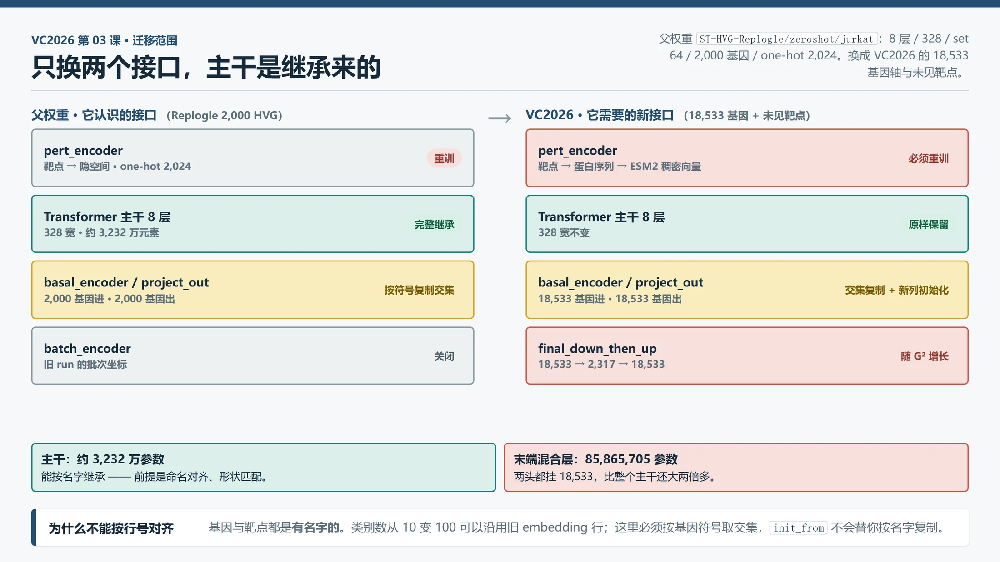
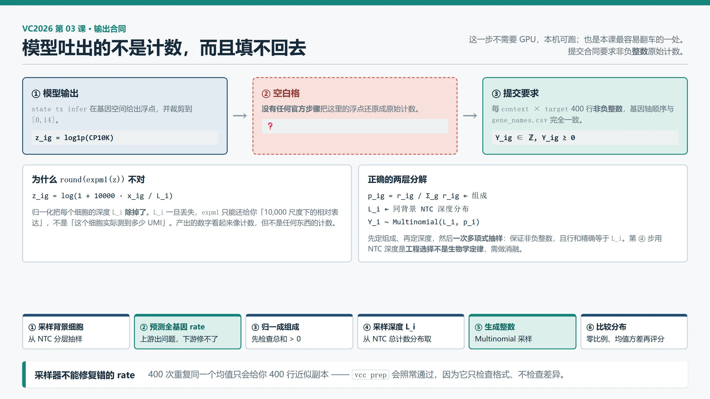
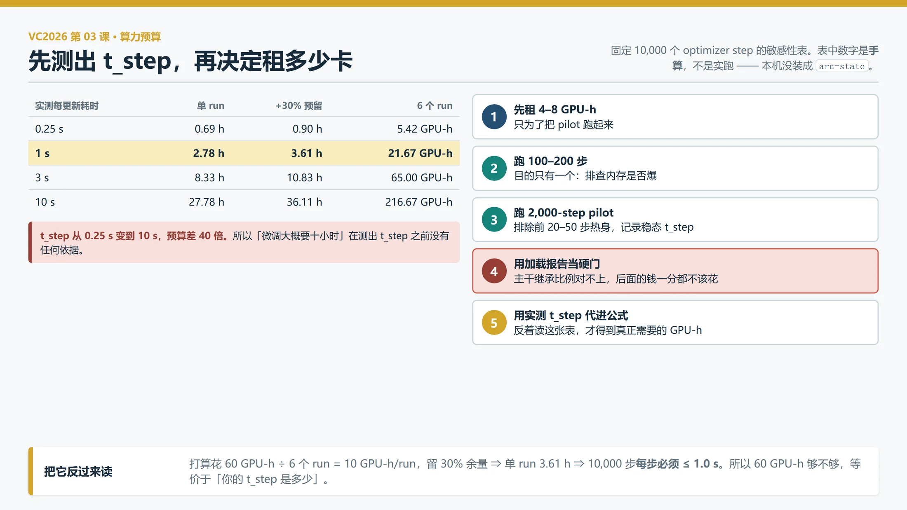

# 03｜State 上手：微调、原始计数输出与算力预算

> **本课回答**：手里有了 02 拆出来的那台机器，现在我具体要动哪几个零件、按什么顺序动、动完怎么知道自己没白花钱。
>
> **前置**：[00 VC2025 学习指南](00-VC2025学习指南.md)、[01 数据合同与首个基线](01-数据合同与首个基线.md)、[02 State 模型拆解](02-State模型拆解.md)。这三课读完就够。
>
> **下一课**：04《你怎么知道改进是真的：噪声地板、完整六指标与消融》。
>
> 核验日期：2026-09-18。面向熟悉软件开发与机器学习、生物学正在补课的读者。
>
> **本课的证据性质**：这一课分两半，两半的证据等级**不同**，请分开对待。
>
> - **本地可跑的一半**（计数生成、输出合同预检、预算计算）：`[S#]` 官方合同 + **本机实测**。
> - **必须租卡的一半**（微调、全基因迁移、H1 评分）：本课**只给命令与预期值**。`arc-state` 本机装不了（02 §7.2 已列三条阻塞），因此**本课不给出任何实测显存或时长数字**——凡涉及显存、吞吐、GPU 小时的地方，一律写明「预期值（论文或官方文档声称，本机未验证）」或留白待租卡后补。
>
> 论文结论一律 `[P1]`，**未在本项目复现**。
>

## 0. 接上一课：你现在手里有什么

02 结束时，你手里有**一台读懂的机器**和**一份它为什么长这样的解释**：你知道 State 内部每个模块在解决什么问题，但你没让它跑过一次，也不知道要花多少钱。

```text
  02 结束时的链路

  A 的 NTC 集合 ──→ ┌──────────┐ ──→ S 个扰动后细胞（log1p 浮点）
  靶点名字      ──→ │  State   │
                    └──────────┘
                          ▲
              你知道了里面每个模块在解决什么问题，
              但你没让它跑过一次，也不知道要花多少钱
```

这条链路上还插着**四根断头线**——02 §3.4 列过，现在要把它们接上：

```text
  02 说「这四处对不上」           03 要做的四件事

  ① 基因轴 2,000 → 18,533    ──→  换两端线性层，主干保留
  ② 集合长度 64 → 400        ──→  多组推理 + 尾组处理（其实不用重训）
  ③ log1p 浮点 → 原始整数计数 ──→  另加一个计数生成器
  ④ one-hot → 未见靶点       ──→  换成连续表示（ESM2）
                                        +
                              + 怎么知道自己没白花钱（算力预算）
                              + 怎么知道这个「知道」是真的（验证划分）
```

本课就是把这四根线接上，再加上**钱**和**可信度**两个兜底问题。

> **一个贯穿全课的例子。** 全程用**背景 A、靶点 `ADNP`、权重 `ST-HVG-Replogle/zeroshot/jurkat`**。`ADNP` 是 01 §6.2 的示意占位符，本课不对它做任何生物学断言；权重名是真实存在的官方资产 `[S2]`。每讲一个命令、一个预算数字，都会回到「A 和 ADNP 现在走到哪了」。

## 1. 一句话：本课要把「能读懂」变成「能跑、能算得起、能判断跑得对不对」

**微调 State 到 VC2026 的过程，是在一台已经会做这件事的机器上，只替换「它不认识的两个接口」，再用一套不会被自己的预训练污染过的验证协议确认改进是真的。**

这句话里有三个部分，本课按这个顺序展开：

```text
  ① 换哪两个接口        → §3（靶点表示）、§5（基因轴与输出合同）
  ② 换完怎么跑          → §4（数据）、§6（环境）、§7（微调命令）、§8（推理）
  ③ 怎么知道没白花钱    → §2（验证划分）、§9（预算）、§10（判断标准）
```

### 1.1 为什么有公共训练数据，还叫「零样本」

这是最容易混淆的一处，先把话说死。

**细胞背景（cell context）**是细胞类型、遗传状态、培养环境与实验条件共同决定的生物与测量环境。同一个基因被压低，在不同背景里后果不同：某条生存通路在一种细胞里必不可少，在另一种细胞里可能有备用通路。

「零样本」限制的是**目标背景中的扰动监督**，它**不禁止**你在其他背景上训练或微调：

```text
  阶段                  模型能看到什么                     要预测什么
  ─────────────────    ─────────────────────────────     ─────────────────
  公共数据预训练/微调   K562/RPE1/HepG2/Jurkat 的         学「哪些响应能跨背景迁移」
                       NTC + 扰动标签 + 扰动后表达
                                                          ↓
  2026 验证轮  A/B/C   只有 NTC + 300 个靶点名字          每背景每靶点 400 个扰动细胞
  2026 最终轮  D/E/F   只有 NTC + 另一组靶点名字          按冻结流程预测，无真值
                                        ▲
                        这 300 个靶点里，有一些在公共数据里见过，
                        有一些没见过 —— 这两种情况必须**分开报告**

  「零样本」≠「没用过任何数据」
  「零样本」=「A/B/C 这三个背景的扰动真值，一个都没给过你」
```

### 1.2 够用版：验证划分为什么不能随便拆

完整的验证方法论在[第 04 课](04-你怎么知道改进是真的.md)。这里只需要一个判据：

**如果你按细胞随机拆训练/验证，你的分数会虚高，而且虚高得看不出来。**

```text
  随机拆单细胞                        按背景留出（LOCO）
  ──────────────────────             ─────────────────────────
  同一个 context×target×guide        整个背景被移出训练
  的近似重复样本跨过边界
         ↓                                    ↓
  验证集里有训练集的「近亲」           验证集是真正的陌生背景
         ↓                                    ↓
  分数虚高，且无法诊断                 分数对应本赛真实难度
```

原因是：同一 `context × target × guide × batch` 下的细胞是近重复。随机拆开它们，等于考试时把答案的近似副本留在考场上。

**本课用的是 LOCO（leave-one-context-out，逐背景留出）** —— 它最接近本赛的设置：公共扰动数据可用，但目标背景只给 NTC。

```text
  LOCO 每折的规则（这是权威定义，第 04 课只回指这里）

  训练可见：其他背景的 NTC + 扰动细胞
  验证输入：留出背景的 NTC + 待预测靶点
  验证隐藏：留出背景的全部靶点扰动细胞
```

> ⚠️ **一个反直觉的前提：微调集里没有某背景，不代表模型没见过它。** 假设父权重已经在 Jurkat 上训练过，之后你只用 K562 微调、再在 Jurkat 上测试——这**不能**叫「Jurkat 从未见过」。预训练权重已经携带了那个背景的信息。所以每个实验要记**两个**清单：父 checkpoint 的训练暴露、本次微调的数据暴露。完整判据在[第 04 课](04-你怎么知道改进是真的.md)。

## 2. 换个接口而已：为什么微调不是从头训练

State 有两个模块（02 §6）：**SE**（State Embedding，把表达变成紧凑表示）和 **ST**（State Transition，接收对照状态与扰动表示、预测扰动后状态）。**只有 SE 权重不能得到一个扰动预测器**——本课微调的是 **ST**。

### 2.1 先把「哪部分能留」讲清楚

02 §8.2 给过那张「七处适配缺口」的表。现在把它压缩成决策：

```text
  接口                             形状变了吗？   权重能留吗？
  ────────────────────────────     ──────────     ──────────
  Transformer 主干 8 层            通常不变        ✅ 完整继承（约 3,232 万元素）
  basal_encoder（对照 → 隐空间）    G 变了          ⚠️ 按基因符号复制交集列
  project_out（隐空间 → 基因）      G 变了          ⚠️ 按基因符号复制交集行
  pert_encoder（靶点 → 隐空间）     含义变了        ❌ 必须重训
  final_down_then_up               G → G//8 → G    ⚠️ 全基因路径才存在，且随 G² 变
  batch_encoder                    没有批次列      ❌ 关闭
```



图里左右两条链是同一个模型的两套接口。左边是父权重认识的世界（2,000 HVG、one-hot 靶点），右边是 VC2026 要求的世界（18,533 基因、ESM2 靶点）。**绿色的两格可以原样搬过去，红黄两格必须动。**

> **类比的边界。** 这很像给一个训练好的网络换掉输入输出层再微调——软件里你可能做过很多次。边界在于：这里的「输入输出」不是类别数从 10 变 100，而是**基因轴从 2,000 变成 18,533，且靶点表示的语义整个换了**。类别数变化时可以沿用原来的 embedding 行；这里不行，因为基因身份、靶点身份都是**有名字的**，必须按名字对齐，不能按行号对齐。`init_from` 只复用它认可的同形键，**不会替你按基因名称复制交集参数**。

### 2.2 两段推进，不要一步到位

```text
  第一段：保留 2,000 HVG 表达接口
    ├─ 目的：验证「能加载、能继承、能产生有限损失、能存能恢复」
    ├─ 靶点表示：可以先用父 run 的 one-hot（只覆盖它见过的靶点）
    └─ 产物：一个能跑的 pilot，用来测吞吐和显存

  第二段：从旧基因轴走到 18,533
    ├─ 目的：接上本赛输出合同
    ├─ 前提：第一段的加载报告显示主干确实继承了
    └─ 产物：全基因输出 + 计数生成器
```

**为什么先做第一段？** 因为第二段很贵。如果第一段的加载报告显示 Transformer 大部分没继承（比如 hidden 从 328 误改成 768），你会在第二段花掉几倍的钱之后才发现问题。§7.3 给的就是那个加载报告。

## 3. 换第一个接口：靶点表示

### 3.1 one-hot 为什么在这里不能用

**one-hot（独热编码）**把靶点表示成「某一位置是 1、其余是 0」的向量。它在训练时见过的靶点上工作良好，对没见过的靶点**没有任何表示能力**：

```text
  one-hot 的几何

  靶点 A = [1, 0, 0, 0]      见过的靶点各占一个正交方向
  靶点 X = [0, 0, 0, 0]  ← 没见过的靶点只能落到原点，或者压根进不来
               ▲
     「A 和 B 有多像」这个问题，one-hot 回答不了
     任意两个不同靶点的距离都一样 —— 没有相似度概念
```

本赛 300 个靶点里有**未见**的。所以必须换成**连续表示**：一个能表达「靶点 X 和靶点 Y 相似」的向量空间。

### 3.2 换成什么：用蛋白序列的表示

**ESM2** 是蛋白质语言模型，能从蛋白序列学出一个向量表示。官方 starter 已经用了它 `[S4]`——**加 ESM2 本身不是我们的新贡献**，是本赛的标准做法。

```text
  one-hot                          ESM2
  ────────────────────────────     ─────────────────────────────────
  靶点 → 查表 → 一个位置为 1       靶点 → 蛋白序列 → ESM2 → 一个稠密向量
  未见靶点：没有坐标               未见靶点：有坐标，且与相似蛋白的接近
  相似度：不表达                   相似度：由序列距离隐式给出
```

> ⚠️ **关键的边界，不要越读。** ESM2 给未见靶点一个向量，表示「这是一个能进模型的输入」。它**不**表示「模型知道这个基因敲低后在背景 A 里会发生什么」。那个知识只能来自别的背景里的相似靶点响应，或者根本没有。这是本赛的**核心赌注**，不是一个工程项（02 §8.2 第 7 项）。

### 3.3 一个会让人白跑一天的坑：同维异义

如果新特征维数**恰好也是 2,024**（旧的 one-hot 维数），`init_from` 的 shape 检查会**看不出问题**——形状一样，它就把旧 `pert_encoder` 权重原样加载进去。

```text
  旧 pert_encoder：输入 2,024 维 one-hot       形状匹配 ✅
  新 pert_encoder：输入 2,024 维 ESM2 特征     形状匹配 ✅
                      ▲
        但第 7 维在旧向量里是「第 7 号靶点」，
        在新向量里是「某个序列特征」—— 语义完全不同
        ⟹ 训练照跑、loss 照降，但靶点表示是乱的
```

**处理方式**：换 ESM2 时，**先显式排除旧 `pert_encoder` 权重**，再加载。`init_from` 不会替你判断「同维异义」。这也是 §7.3 加载报告必须逐项核对 `loaded / reinitialized / unexpected keys` 的原因。

### 3.4 无法取得蛋白序列的靶点怎么办

有些靶点不是蛋白编码基因（没有可喂给 ESM2 的序列）。三种合法处置：

```text
  ① 有来源的备用表示    （明确的、可追溯的另一种特征）
  ② 显式缺失编码        （一个专门的「未知」向量，且**单独评估**）
  ③ 提前拒绝            （列表报错，不让它静默通过）

  绝对不能做：让 loader 静默补零。
  源码当前行为：loader 缺失特征补零向量，infer 未知靶点退回对照表示 [S4][S5]
        ↓
  你没覆盖的靶点 ──→ 模型收到「零向量 / 对照」──→ 输出 = 预测 NTC
        ↓
  表面上有 400 行，实际上什么都没预测，而且日志不报错
```

所以项目入口必须**提前拒绝未覆盖目标并输出清单**。宁可报错，不要静默产出 NTC。

## 4. 换完接口要喂什么：数据与合同

### 4.1 第一批：四背景 CRISPRi 核心数据

需要的是「同一靶点在不同背景中的响应」。四个背景，两个来源：

| 背景 | 来源 | 作用 |
|---|---|---|
| K562 | Replogle 2022 | 核心训练背景 |
| RPE1 | Replogle 2022 | 核心训练/留出背景 |
| HepG2 | Nadig 2024 | 增加背景差异 |
| Jurkat | Nadig 2024 | 增加背景差异；配合 Jurkat 留出实验 |

优先下载 scPerturb 整理的压缩 H5AD，而不是近百 GB 的未压缩作者副本 `[S8]`。四背景核心合计 **4.928 GB**（十进制），加 K562 GWPS 后 **13.733 GB**。

```bash
mkdir -p /data/vcc2026/raw/scperturb
curl --fail --location --continue-at - \
  'https://zenodo.org/records/13350497/files/NadigOConner2024_hepg2.h5ad?download=1' \
  --output /data/vcc2026/raw/scperturb/NadigOConner2024_hepg2.h5ad
md5sum /data/vcc2026/raw/scperturb/NadigOConner2024_hepg2.h5ad
```

只下载一个文件；正式操作对下载单逐项执行，并核对大小与校验和。各文件在 Zenodo 发布的 MD5 `[S8]`：K562 essential `d8cba17576d1a8afc0f7d71b79cad0f7`、RPE1 `cc7f1ec50aeb3a3e1b4a6cfa713d80fa`、HepG2 `af2be47f7477cf32fa6e4bec1c6a4868`、Jurkat `d8b05d00bfbd686d37ffdd4293bc6c8c`、K562 GWPS `13db594f8f1d2ccb88fec44a13e414dc`。

> **别把两份副本当两份数据。** scPerturb 是作者数据的整理副本；不要把它和对应的作者原件同时当作独立训练数据。Nadig 文件名里的 `2024` 是整理版本命名，对应正式论文是 2025 年 `[S7]`——**不能据文件名拆成两项独立证据**。

### 4.2 权重：只下载一个 run 的必要文件

**不要用覆盖整个模型仓库的下载模式。** 发布树里含 `adata_real.h5ad`、真实 DE 等**评估答案**，既浪费空间，也可能进入训练路径造成泄漏 `[S5]`。

```python
from huggingface_hub import snapshot_download
run = "zeroshot/jurkat"
files = ["config.yaml", "version_0/hparams.yaml", "checkpoints/best.ckpt",
         "pert_onehot_map.pt", "batch_onehot_map.pkl",
         "cell_type_onehot_map.pkl", "var_dims.pkl", "data_module.torch"]
snapshot_download(
    repo_id="arcinstitute/ST-HVG-Replogle",
    revision="bb6a9562cbbf1fd152df14cc53b4cc7517c77175",
    allow_patterns=[f"{run}/{name}" for name in files],
    local_dir="/data/vcc2026/pretrained/ST-HVG-Replogle",
)
```

`data_module.torch` 主要存配置和作者本机路径，**不是训练数据**。`best.ckpt` 是 471,699,039 bytes（约 0.45 GiB）`[S5]`。

### 4.3 三个配置别混成一个：权重选择题

02 §3.3 说过「两套配置不能合并成一句话」。那张表在这里变成**选择题**：

| 候选 | 结构 | 什么时候用它 | 适配要点 |
|---|---|---|---|
| `ST-HVG-Replogle/zeroshot/jurkat` | 8 层；328；set 64；**2,000**；one-hot 2,024 | **推荐起点**：最小的加载与微调验证 | 保留原 HVG 轴；未见靶点；全基因输出；核实预训练暴露 |
| `st-x-replogle-full/k562_0.99` | 8 层；328；set 64；**6,546**；one-hot 2,024 | 表达空间迁移的另一候选 | `full` **仍不是 18,533**；训练划分不能从文件名猜 |
| 当前源码 `model=state` 默认 | 8 层；**768**；set **512**；全基因输出 | 随机初始化对照，或后续扩模 | **不能**直接接 328 权重再声称完整复用（形状冲突） |

```text
  三句话，每句都缺主语 —— 都是错的

  「State 是 328 宽的」              ← 源码默认是 768
  「State 每个集合 64 个细胞」        ← 源码默认是 512
  「State 输出 2,000 个基因」         ← full 版是 6,546；源码默认全基因
                    ▲
        正确的说法必须带上「在哪一套配置下」（02 §3.3 已立规矩）
```

## 5. 换第二个接口：基因轴与输出合同

### 5.1 一个细胞一个 token，集合长度不是硬约束

**先破一个会误导人重训整晚的直觉。**

```text
  你可能会这样想：模型训练时每组 64 个细胞，本赛要 400 个，
                  所以必须把 cell_set_len 改成 400 再重训。

  为什么错：模型**没有位置编码**（02 §4.2）。
            「第 3 个细胞」这个概念在它内部不存在。
            权重形状根本不含 S 这一维。
```

所以 400 个细胞的正确做法是**推理时多组拼接**，不是重训：

```text
  要 400 个细胞，S = 64

  ┌─ 第 1 组 64 个 ─┐ ┌─ 第 2 组 64 个 ─┐      ┌─ 第 6 组 64 个 ─┐
  └──────────────┘ └──────────────┘  …   └──────────────┘
        64 + 64 + 64 + 64 + 64 + 64 = 384
                                        └─ 尾组 16 个 ─┘
                                              400 ✓
                              ▲
                尾组的 16 个怎么处理，是推理脚本的活，不是模型的事
```

> **一个经验规则，两处都成立**：State 的 `cell_set_len` 与 Stack 的窗口长度都**不影响权重形状**。改集合长度改变的是模型看到的群体信息量（论文报告集合大小会影响损失 `[P1]`），是**行为改变**，不是**形状约束**。这个区分会在 05 课再次出现。

### 5.2 换基因轴真正贵在哪

设旧轴 $G_{old}$、新轴 $G_{new}$，隐藏维度仍是 328。

| 模块 | 基因数变化的影响 | 迁移方法 |
|---|---|---|
| Transformer | 主干形状通常不变 | 完整继承，核对键与元素比例 |
| `basal_encoder` | 输入列数变化 | 按基因**符号**复制交集列；新列初始化 |
| `pert_encoder` | one-hot → ESM2 改变含义与维数 | 新建并训练；不能按形状相同就保留 |
| `project_out` | 输出行数变化 | 按基因**符号**复制交集行与 bias；新行初始化 |
| `final_down_then_up` | `all` 路径有 $G \to G/8 \to G$ | 形状变化时专门迁移或重建；**中间隐维没有天然基因对应** |
| batch embedding | 新 batch ID 没有旧坐标 | 显式移除或重新设计 |

**贵的是最后那一行。** 全基因路径末端有一个 `final_down_then_up`，两头都挂着 $G = 18{,}533$，参数量随 $G^2$ 走：

```text
  final_down_then_up = Linear(G → G/8) + Linear(G/8 → G)
                            ▲                  ▲
                      两头都是 18,533      参数量 ∝ G²
                            ↓
                  G = 18,533 时这一层组 = 85,865,705 个参数  [S4][S5]
                            ↓
        比整个 8 层主干（328 档约 3,232 万）还大两倍多
                            ↓
        这就是「换基因轴必须重训」的真正成本所在（02 §4.4 的结论，这里给出具体数）
```

源码里这个数是按矩阵形状**精确计算**的，不是估计；但它**只是这一个模块**，不是完整参数量（§9.2 会给出完整下界的算法）。

### 5.3 输出合同：模型吐出的不是能提交的东西

**这是本课最容易翻车的一处。** `state tx infer` 在基因空间输出**浮点**，并裁剪到 `[0,14]`。这不是计数的取值限制，是它的表达预测处理 `[S4]`。



图中间的虚线框是**空的**——没有任何官方步骤把它填上。原因在左下角：归一化时丢掉的每细胞总量（library size）$L_i$ 不能从归一化后的值恢复。

```text
  z_ig = log(1 + 10000 · x_ig / L_i)       ← 归一化把 L_i 除掉了
                        ▲
                  这个 L_i 一旦丢掉，
        expm1(z) 只能还给你「10000 尺度下的相对表达」，
        不是「这个细胞实际测到了多少 UMI」
```

所以 `round(expm1(z))` 是把任意 10,000 尺度当成实验深度——**它产出的数字看起来像计数，但不是任何东西的计数。**

### 5.4 够用版：原始计数合同的最小判据

完整合同在 01 课 §4.4 与 §2.3，这里只要**判断「我这份输出能不能提交」的那几条**：

| 检查 | 要求 | 失败时不报错会怎样 |
|---|---|---|
| 行数 | 每 `context × target` 恰好 400 行 | 官方预检拒绝 |
| 基因轴 | 18,533 个基因，**顺序**与 `gene_names.csv` 完全相同 | 列错位，分数全废 |
| 数值类型 | 有限、非负、**整数** | `prep` 拒绝 |
| 单细胞总量 | $\le 1{,}000{,}000$ | 官方上限 |
| 稀疏存储 | 无显式零；存储项 $\le 4{,}750{,}000{,}000$ | 官方上限，**显式零也计入** |

```text
  ⚠️ 基因顺序是合同的一部分，不是「顺便对齐一下」

  [gene A, gene B, gene C]  提交顺序
  [gene B, gene A, gene C]  你的顺序
             ▲
     每个细胞的计数都没错，但整份提交全错
     而且**不会有任何报错** —— 它是一份合法的、错的提交
```

## 6. 环境：为什么训练环境和评分环境要分开

固定源码要求 Python `>=3.11,<3.13`，建议单独用 Python 3.12 `[S4]`。

**关键的一条**：训练依赖旧的 `cell-eval`，H1 评分用 `cell-eval2` 的固定版本。**包名相似不代表评估协议相同** `[S10]`。所以两个环境分开建。

```bash
mkdir -p /data/vcc2026/src /data/vcc2026/envs
git clone https://github.com/ArcInstitute/state.git /data/vcc2026/src/state
git -C /data/vcc2026/src/state checkout 9bbfe78a434a55205e4de834e1ea99f85f7a3add
uv venv --python 3.12 /data/vcc2026/envs/state
source /data/vcc2026/envs/state/bin/activate
uv pip install -e /data/vcc2026/src/state
uv pip install 'cell-load @ git+https://github.com/ArcInstitute/cell-load.git@9ba45e59f6f8117bb7a21371ad38d67175586d53'
uv pip check && state tx --help
python -c 'import torch; print(torch.__version__, torch.cuda.is_available())'
```

> **注意**：以上是**安装示例，本项目未执行**（本机装不了，02 §7.2）。源码固定**不自动锁定**传递依赖。首次装成功后要保存完整依赖解析、Python/CUDA/驱动版本——后续机器按这个锁定结果恢复，**不要边训练边更新** `transformers`、Lightning 或 `cell-load`。

工作目录建议按「东西放哪」分工，这样泄漏和重复都能靠路径看出来：

```text
  /data/vcc2026/
    raw/           原始输入，保留来源与校验和
    pretrained/    官方 checkpoint 和配套配置
    manifests/     数据、基因、靶点、预训练暴露清单
    aligned/       分块对齐后的 H5AD
    features/      ESM2、名称映射、覆盖报告
    splits/        每个实验的 TOML 与实际样本清单
    runs/          每个实验独立目录
    predictions/   按背景与靶点分片的输出
    evaluation/    独立评分资产和结果
```

## 7. 跑一次：`init_from` 微调

### 7.1 三种操作别混：从头训练 / `init_from` / resume

| 操作 | 权重来源 | 优化器与训练步 | 用在什么时候 |
|---|---|---|---|
| 从头训练 | 随机初始化 | 新建 | 消融对照，或没有合适父权重 |
| `init_from=...` | 加载同名且形状匹配的张量 | **新建**优化过程 | 迁移到新数据、改学习率、换输入输出层 |
| 同 run 的 `last.ckpt` resume | 恢复该 run 的 checkpoint | **恢复**训练状态 | 中断后继续同一实验 |

**源码的一个行为必须记住**：输出目录已有 `checkpoints/last.ckpt` 时**优先 resume**；只有它不存在才处理 `init_from` `[S5]`。

```text
  你可能遇到的坑

  你改了 init_from 指向新权重，重跑同一条命令，但 loss 曲线和上次一模一样
        ▲
     因为输出目录里的 last.ckpt 还在，它走了 resume，init_from 从头到尾没被读到
        ↓
  规则：每个新微调实验用**新的 name**，不要把父 run 当作输出目录
```

### 7.2 第一段命令：保留 2,000 HVG 接口

下面是一条**原生 CLI 字段组成的迁移 pilot 示例**。前提是 §4 已完成：各来源的 `X_hvg` 对应父权重的同一组 2,000 个基因、同一顺序，监督轴一致，且每个来源确实测过这些基因。

```bash
state tx train \
  model=state \
  model.kwargs.init_from=/data/vcc2026/pretrained/ST-HVG-Replogle/zeroshot/jurkat/checkpoints/best.ckpt \
  model.kwargs.hidden_dim=328 \
  model.kwargs.cell_set_len=64 \
  data.kwargs.toml_config_path=/data/vcc2026/splits/hvg_pilot.toml \
  data.kwargs.embed_key=X_hvg \
  data.kwargs.output_space=gene \
  training.batch_size=4 \
  training.gradient_accumulation_steps=4 \
  training.lr=0.00001 \
  training.max_steps=2000 \
  training.val_freq=2000 \
  output_dir=/data/vcc2026/runs \
  name=st_hvg_esm2_pilot_001
```

**主干形状必须逐字段显式对齐**，否则会静默走源码默认（768 / 512）：

```text
  model.kwargs.transformer_backbone_kwargs.hidden_size=328
  model.kwargs.transformer_backbone_kwargs.intermediate_size=3072
  model.kwargs.transformer_backbone_kwargs.num_hidden_layers=8
  model.kwargs.transformer_backbone_kwargs.num_attention_heads=12
  model.kwargs.transformer_backbone_kwargs.num_key_value_heads=12
  model.kwargs.transformer_backbone_kwargs.head_dim=64
  model.kwargs.n_encoder_layers=1        model.kwargs.n_decoder_layers=1
  model.kwargs.batch_encoder=false       model.kwargs.use_batch_token=false
  model.kwargs.freeze_pert_backbone=false
  model.kwargs.lora.enable=false         +model.kwargs.gene_decoder_bool=false
  model.kwargs.log1p_from_raw_counts=false
```

**数据侧字段**（决定「喂进去的是什么」）：

```text
  data.kwargs.pert_col=target_gene          data.kwargs.cell_type_key=context_id
  data.kwargs.batch_col=batch_id            data.kwargs.basal_mapping_strategy=batch
  data.kwargs.control_pert=non-targeting
  data.kwargs.perturbation_features_file=/data/vcc2026/features/esm2_all_targets.pt
  data.kwargs.num_workers=4                 +data.kwargs.is_log1p=false
```

训练开关：`training.train_seed=42`、`training.devices=1`、`use_wandb=false`、`training.wandb_track=false`。

这条命令里有**五处不看源码就会误解的地方**：

| 字段 | 看起来像什么 | 实际是什么 |
|---|---|---|
| `batch_size=4` × `grad_accum=4` | 每步 16 个细胞 | 每步 **16 个集合** = `16 × 64 = 1,024` 个细胞位置；且采样会重复使用细胞，**不是 1,024 个新独立样本** |
| `val_freq=2000` | 每 2,000 步验证一次 | 传给 Lightning 的 `val_check_interval`，按**训练 batch** 计数 ⇒ 约 500 次优化器更新验证一次 |
| `max_steps=2000` | 跑 2,000 个 microbatch | **优化器更新步数** —— 不是 microstep |
| `+is_log1p=false` 与 `log1p_from_raw_counts=false` | 两个开关重复了 | 描述**不同对象**：前者说 `.X` 不是 log1p（已备好 raw counts），后者说主路径不读 raw counts 做内部变换 |
| `freeze_pert_backbone=false` | 想冻结就设 true | 设 true 会冻结 Transformer **和 `project_out`** ⇒ 新初始化的输出层**完全不学习** |

> ⚠️ **一个源码 bug，正式选模前必须修。** `training.ckpt_every_n_steps` 虽在 YAML 里出现，但当前 callback **没有使用它**，而是把 `val_freq` 同时当作 checkpoint 的 optimizer-step 间隔 `[S5]`。后果：验证每约 500 更新一次，checkpoint 却每 2,000 更新触发一次——**不能保证保存了所有验证点中的最佳模型**。pilot 阶段可以另存 `final.ckpt` 做接口检查；正式选模前要改 callback，让每次验证后按本次 `val_loss` 选 best。

### 7.3 加载后的第一次检查：这张报告决定要不要继续花钱

**这是全课最重要的一次检查。** 在正式 GPU 微调前，先用 CPU 读取 checkpoint，输出这份报告：

```text
  parent checkpoint / revision / SHA-256
  input/output gene names and order
  old target feature mapping and dimensions
  hidden / layers / heads / head_dim / FFN / set length
  preprocessing scale and measured-gene mask
  loaded / reinitialized / unexpected keys
  loaded parameter elements / expected reusable parameter elements
  trainable parameters by module
  pretraining and fine-tuning exposure manifest
```

**为什么要按「参数元素数」而不是「键数量」算继承比例：**

```text
  按键数算比例：                      按元素数算比例：
  主干 100 个键，继承 95 个 = 95%      主干约 3,232 万个元素，继承多少万个
              ▲                                    ▲
     一个 norm 的键和一个 FFN 的键，      这个数才反映「主要计算路径继承了没有」
     权重量差 1000 倍，但都算 1
```

> **一个反直觉的事实**：`load_state_dict` 成功执行**只说明某些张量被接受了**。它不说明注意力、MLP、归一化层按预期继承。所以必须看**分模块**的继承比例。

然后在原接口上做小批推理，检查四件事：

```text
  ✓ 数值有限
  ✓ 基因顺序正确
  ✓ 不同靶点输出**不完全相同**        ← 若相同：靶点表示坏了或塌缩了
  ✓ 改变 NTC 背景会影响预测            ← 若不影响：对照输入没接进去
```

这四条**只是接口与敏感性检查**。此处的小样本数值**不是性能结论**——别拿它当分数。

**如果这份报告显示 Transformer 大部分没继承，先修迁移，不要继续花钱训练。**

### 7.4 冻结范围与学习率：为什么要分两段

| 阶段 | 训练哪些参数 | 工程起始范围 | 观察什么 |
|---|---|---|---|
| 新接口热身 | 新 ESM2 输入层、改过的表达层/输出层；**Transformer 固定** | 500–2,000 更新；新层 LR `1e-4` | 新接口能否把输入送进旧主干并形成有效输出 |
| 联合微调 | 新层 **+** Transformer | 5k–20k 更新；主干 LR `1e-5`，新层 `1e-4`，验证早停 | 迁移增益能否稳定；旧能力是否遗忘 |

```text
  为什么先热身再联合？

  一起放开：新接口随机初始化 → 梯度很大 → 把主干已经学好的东西冲掉
             你要花更多步把它学回来，甚至学不回来

  先热身：  新接口先学会「把 ESM2 送进旧主干的坐标系」
            主干没动，仍是一个会做这件事的模型
                ↓
            再小学习率联合微调，才是在「保持能力」的前提下「适应新任务」
```

**原生优化器的两个限制**（要么接受，要么改代码并保存 diff）`[S4][S5]`：它是**单学习率**的 **Adam**；配置里的 `weight_decay` **没有**被传给该优化器。

所以上表的「新层 `1e-4` / 主干 `1e-5`」是**需要在项目训练器里显式实现**的分组学习率，不是原生就能填的字段。

### 7.5 首轮不要开 LoRA

**LoRA（low-rank adaptation，低秩适配）**通过训练附加的小矩阵减少主干更新参数。它降低优化器状态开销，但**不解决**本课的两个主要问题（大输出头、缺测基因），而且会引入一个具体的加载故障：

```text
  固定源码：在加载 init_from **之前** 注入 LoRA
                ↓
            PEFT 包装会改变部分权重键名
                ↓
   未带 LoRA 的父 checkpoint 可能**无法按原键名继承**
                ↓
   你会看到一个「加载成功但效果像随机初始化」的模型
```

正确做法是先完整加载基础权重再注入 LoRA，或实现并验证重映射。**首轮保持 `lora.enable=false`**；以后与全量微调做同协议比较。

### 7.6 精度：不要假设加个字段就生效

当前 ST Trainer **没有自动传入 bf16 precision**。不能只加一个 YAML 字段就假设它生效 `[S4]`。若要用混合精度，需要把验证过的 `precision="bf16-mixed"` 接入 Lightning Trainer，并确认硬件支持。

```text
  ⚠️ 一条给 04 课的纪律

  「T4 应该用 bf16 省显存」这种说法在本项目里**没有依据**。
  能源码核验、能实测的东西才有依据；
  能源码核验的是「有没有传」，不能推出「省多少」。
```

**最先降低 microbatch**，配合梯度累积维持更新组数。改变 set 长度会同时改变模型看到的群体信息——从 64 改 32 不只是省显存，**要在结果表里标注**。

## 8. 推理与输出：从浮点到一个可提交的文件

### 8.1 先生成一个背景、一个靶点

用 `ADNP` 走通一遍。State 原生 infer 的 TSV 与官方 `pert_counts.csv` 格式**不同**——TSV 列为 `perturbation`、`num_cells`：

```text
perturbation	num_cells
ADNP	400
```

```bash
state tx infer \
  --model-dir /data/vcc2026/runs/st_fullgene_transfer_001 \
  --checkpoint /data/vcc2026/runs/st_fullgene_transfer_001/checkpoints/best.ckpt \
  --adata /data/vcc2026/aligned/infer/A_controls_raw.h5ad \
  --pert-col target_gene \
  --celltype-col context_id \
  --control-pert non-targeting \
  --tsv /data/vcc2026/aligned/infer/A_targets_shard_001.tsv \
  --max-set-len 64 \
  --seed 42 \
  --output /data/vcc2026/predictions/A_log_expression_shard_001.h5ad
```

两个必须知道的边界：原生 infer 会**保留并模拟输入对照行**，正式导出时只保留当轮目标对应的预测行；**不要用 `--all-perts`**，保存的特征词表可能远大于比赛面板。

```text
  分片推进，不要一次喂 360,000 行

  1 个靶点  ──→  5–10 个靶点  ──→  遍历 A/B/C 三个背景
       ▲              ▲                    ▲
   走通链路       确认内存可控        分片大小由 CPU RSS
                                      与 GPU 峰值决定
              固定源码会 dense 化输入并持有预测副本 [S4][S5]
```

### 8.2 计数生成：本机可跑的那一半

先明确这是**工程基线**，不是 State 官方验证过的 VC2026 方案。

```text
  六步，从模型输出到 400 行原始计数

  ① 采样背景细胞    从 A 的 NTC 分层抽样，46 个 ntc_id 均衡
  ② 预测全基因 rate  全基因模型直接给；HVG 模型加全基因适配器
  ③ 归一成组成概率   p_ig = r_ig / Σ_g r_ig，先检查总和 > 0 且有限
  ④ 采样 library size 首版从同背景 NTC 的总计数分布取 L_i
  ⑤ 生成整数        Y_i ~ Multinomial(L_i, p_i)
  ⑥ 比较分布        总计数、检测基因数、零比例、逐基因均值/方差、
                    状态比例、协同变化 —— 然后才进评分
```

**第 ④ 步的边界要写清楚**：用 NTC 深度**不是生物学定律**。扰动可能改变细胞大小、总 RNA、存活率或测量质量。NTC 也已经含检测噪声，直接当 rate 再采一次可能**叠加噪声**，所以需要平滑/收缩和生成器消融。

下面是一个可独立复用的整数采样函数。它**不负责**训练 rate/depth，也不负责补全缺失基因——输入 rate 必须已经是完整、有序的全基因输出：

```python
import numpy as np
from scipy import sparse

def sample_counts(rate, library_sizes, seed):
    rate = np.asarray(rate, dtype=np.float64)
    depth = np.asarray(library_sizes)
    if rate.ndim != 2 or depth.shape != (rate.shape[0],):
        raise ValueError("Expected rate[N,G] and library_sizes[N]")
    if not np.isfinite(rate).all() or (rate < 0).any():
        raise ValueError("Rates must be finite and nonnegative")
    if (not np.isfinite(depth).all() or (depth < 1).any()
            or (depth > 1_000_000).any()
            or not np.equal(depth, np.floor(depth)).all()):
        raise ValueError("Library sizes must be integers in [1, 1000000]")
    mass = rate.sum(axis=1)
    if not np.isfinite(mass).all() or (mass <= 0).any():
        raise ValueError("Every cell needs positive finite rate mass")
    rng = np.random.default_rng(seed)
    rows = [
        sparse.csr_matrix(
            rng.multinomial(int(n), r / total).astype(np.int32)[None, :]
        )
        for r, total, n in zip(rate, mass, depth)
    ]
    counts = sparse.vstack(rows, format="csr")
    counts.eliminate_zeros()
    return counts
```

**三个设计决定，每个都有理由：**

```text
  ✓ 用 Multinomial 而不是独立 Poisson
      一次抽样把 L_i 个计数分给各基因 ⇒ 保证非负整数 + **精确行和**
      对偶：一个基因多分到，其他基因就被挤占（组成约束）

  ✓ 每次只传一个靶点的 400 行，立即写盘
      固定源码会 dense 化；攒着做会 OOM

  ✓ 种子按 context × target × replicate 稳定派生
      **不要用 Python 默认 hash()** —— 它随进程变化，无法复现
```

> **一句必须说死的话**：这个函数生成不同细胞的前提，是**输入 rate/depth 能表达差异**。400 次重复同一个均值不能代替学会真实的细胞异质性——它只会给你 400 行几乎相同的数（§11.1 的题一就在问这个）。

### 8.3 本地预检：提交前的最后一关

```bash
vcc prep /data/vcc2026/predictions/prediction.h5ad \
  -g /data/vcc2026/raw/controls/gene_names.csv \
  --perts /data/vcc2026/raw/controls/pert_counts.csv \
  --contexts A,B,C --dry-run

vcc prep /data/vcc2026/predictions/prediction.h5ad \
  -g /data/vcc2026/raw/controls/gene_names.csv \
  --perts /data/vcc2026/raw/controls/pert_counts.csv \
  --contexts A,B,C \
  -o /data/vcc2026/predictions/prediction.vcc
```

```text
  `prep` 通过  ⟹  格式合格
  `prep` 通过  ⇏  生物预测准确
              ▲
     它只证明「这份文件能被正确评分」，
     不证明「这份文件里的预测是对的」
```

## 9. 算力预算：钱花在哪里

### 9.1 硬件分档

**下表是采购/排期的工程预留，不是经 GPU 实跑证明的最低配置。** 本机没跑过任何一档。

| 档位 | GPU | CPU / 主机 RAM | 工作盘 | 预算 | 适合的任务 |
|---|---|---|---|---|---|
| 当前本机 | RTX 3070 Ti Laptop，8 GiB | i7-12700H，20 逻辑 CPU，约 15 GiB | 约 757 GiB 可用 | 本地准备 | metadata、分块 ETL、代码调试、小批加载、H1 CPU 评分 |
| **微调起步** | **单张 24 GB（L4 / RTX 4090）** | **8–16 vCPU / 64 GB** | **300 GB SSD** | **先 4–8 GPU-h 试跑** | 328 主干、set 64、HVG 微调、轻量适配 |
| 全基因稳妥档 | 单张 48 GB；或 A100 40/80 GB | 16–32 vCPU / 128 GB | 500 GB SSD | 先单次 pilot | 全基因主路径、新输出层、mask、多折多种子 |

> ⚠️ **不要按显存比例换算耗时。** 24 GB 卡之间、24 GB 与 A100 之间，**不能**用显存大小推时间。

### 9.2 显存不是 checkpoint 文件大小

全参数 FP32 Adam 的粗略常驻张量**下界**：

$$M_{param} \approx \underbrace{4P}_{\text{权重}} + \underbrace{4P}_{\text{梯度}} + \underbrace{8P}_{\text{Adam 一二阶状态}} = 16P\ \text{bytes}$$

**这个式子不含**：激活、attention 与集合距离中间量、CUDA workspace、混合精度副本、分配器缓存。所以它是**下界**，不是估计值。

```text
  为什么「checkpoint 才 450 MB，显存肯定够」是错的

  checkpoint 文件里是               训练常驻要的是
  ──────────────────────            ──────────────────────
  state_dict（一份权重）             权重 + 梯度 + 优化器状态 + 激活
                                        ▲
                              16P 只算前三项，激活还没进来
                              而集合注意力 + 集合距离的中间量
                              恰恰随 S² 增长
```

还有四个容易漏的：

- set 长度增大会提高 attention 与集合距离成本；microbatch 也会放大激活。
- 全基因末端混合层约 **8,587 万参数**（§5.2），只是**这一个模块**。
- 基类在默认配置下可能创建额外 `gene_decoder`；batch 含 `pert_cell_counts` 时还会算辅助损失。本课 pilot 显式关掉它。
- 原生 `init_from` 会把 checkpoint 加载到 CUDA；若其中带旧 optimizer 状态，**加载峰值可能高于只装 `state_dict`**。

> **一条纪律**：训练启动日志**必须**给出按模块的参数数目与**实际峰值**。不能沿用只统计主 forward 路径的估算。

### 9.3 先测出自己的单步耗时

**不知道实际 step 时间时，「微调大概要十小时」没有任何依据。** 先跑 100–200 个 optimizer steps 排查内存，再跑 2,000-step pilot 看趋势。排除前 20–50 步的初始化、文件缓存与内核热身后记录：

| 字段 | 为什么记 |
|---|---|
| GPU 型号、显存、精度、依赖锁 | 确定实测适用范围 |
| loaded/trainable 参数；microbatch、set length、accumulation | 确定实际模型与更新规模 |
| 稳态 seconds/optimizer-step | **避免用 microstep 错算训练时间** |
| 每次验证耗时及间隔 | 全流程可能由验证而非训练支配 |
| CUDA peak allocated/reserved、CPU max RSS | 决定卡和内存要不要升级 |
| 数据加载等待、GPU 利用率、checkpoint 写入时间 | 判断瓶颈在计算还是 I/O |
| 推理 seconds/target、分片大小、生成 nnz | 预测完整轮容量 |

### 9.4 用手算表估计总工时

$$T_{run}=\frac{S\,t_{step} + N_{val}\,t_{val} + t_{load} + t_{save}}{3600}\ \text{小时}$$



图左是固定 **10,000 optimizer steps**、只看训练的敏感性表。**手算第一行**验证一下：$10{,}000 \times 0.25 / 3600 = 0.694$ h；加 30% ⇒ $0.694 \times 1.3 = 0.903$ h；6 个 run ⇒ $0.903 \times 6 = 5.42$ GPU-h。其余三行同法。

```text
  这张表的作用：把它反过来读

  你打算花 60 GPU-h
        ↓
  6 个 run 的话，每 run 10 GPU-h
        ↓
  单 run 限 3.61 GPU-h（含 30% 余量）
        ↓
  10,000 步 ⇒ 每步必须 ≤ 约 1.0 s
        ↓
  所以 pilot 的第一件事是**测出 t_step**，
  然后才知道 60 GPU-h 够不够 —— 而不是先买 60 GPU-h
```

费用：若租卡单价 $r$ 元/GPU-h，则 `GPU 费用 = GPU-hours × r`。例如 60 GPU-h，10 元/h 是 600 元，25 元/h 是 1,500 元。**这只是算术示例，不是当前市场报价。**

> **一条历史数据，注意它的边界**：作者 VC2025 T4 Colab 曾记录约 **1.25 step/s**，40k 步可外推约 9 小时 `[S3][S9]`。但那是历史模型、集合/批次、代码和数据，**不能据此保证发布 328 权重的全基因迁移也只需 9 小时**。论文 SE 的 32 H100 预训练**不是**本教程 ST 微调的采购要求。

### 9.5 磁盘与主机内存

300 GB 起步盘的分工，**若同时取各档上界，300 GB 已偏紧，应升级 500 GB**：

| 用途 | 预留 GB |
|---|---:|
| 五个公共文件 + H1 train + controls + 一个父权重/特征 | 约 30–33 |
| 对齐数据、HVG、mask、分块缓存 | 40–80 |
| 训练环境、包缓存、评估数据 | 15–30 |
| 选中的 best/last/checkpoint 与日志 | 20–50 |
| 预测分片、合并 H5AD、打包及临时副本 | 40–70 |
| 剩余缓冲 | 按实际总量留 30–50 |

**一个必须现在就算的体积问题**：

```text
  完整提交的 dense float32 单矩阵  ≈ 24.85 GiB
  两个副本                        ≈ 49.71 GiB     ← 还没算其他对象

  若约 5,800 非零/细胞，全轮约 20.88 亿 nnz
  CSR 数组（int32 data + int32 indices + int64 indptr）≈ 15.56 GiB
                              ▲
        某些拼接/库操作会把 indices 升成 int64，成本更高
        达到 47.5 亿上限时，尤其不能默认整套 CSR 能用 32 位索引偏移
```

```text
  ⟹ 采用「按背景/靶点写片 + 磁盘拼接或流式 CSR 写出」
  ⟹ 先做完整 360,000 行预演，再决定机器
```

主机内存的另一面：H1 普通评分**可以在 CPU 分块运行**。**64 GB 是起步主机的工程推荐**——不能把某个 GPU 评分示例的 40/80 GB 显存误认为 H1 评分的强制条件 `[S10]`。

## 10. 这一课你手里多出来的东西

### 10.1 因果单元八步覆盖

| 步 | 本课在哪里讲 |
|---|---|
| 直觉解释 | §1（零样本的真实含义）、§5.1（集合长度不是硬约束） |
| 机制或数学对象 | §2.1（哪部分能留）、§5.2（$G^2$ 成本）、§8.2（两层分解） |
| 实验或数据流程 | §4（数据与权重）、§6（环境）、§7（微调）、§8（推理） |
| 失败与噪声 | §3.3（同维异义）、§7.1（resume 吃掉 init_from）、§7.6、§9.2 |
| 与 VC2026 的关系 | §1.1（零样本边界）、§5.3–5.4（输出合同） |
| 对模型的影响 | §2.1（换哪两层）、§3（靶点表示）、§5.2（末端混合层） |
| 可复现实践 | §7.2–7.3（命令与加载报告）、§8.2（采样函数）、§8.3（预检） |
| 诊断题 | §11 |

### 10.2 请填的表（本课的产物）

动手材料在 [`notebook/02_state_model_and_transfer.ipynb`](../../notebook/02_state_model_and_transfer.ipynb)（读固定官方 YAML 核对两套配置、按基因名称迁移的权重错位实验）与 [`notebook/03_finetuning_counts_and_budget.ipynb`](../../notebook/03_finetuning_counts_and_budget.ipynb)（教学计数生成、H5AD 写入/读回、400-cell 合同检查、可拖动的预算计算器）。两个都是纯 NumPy，**不装 `arc-state`、不跑训练**——§6 已说明本机装不了。

| 项 | 你填的 | 依据 |
|---|---|---|
| 我选哪一组父权重，它的基因轴是多少 | | §4.3 |
| 我的靶点特征是什么来源、什么维度，是否会撞上 2,024 | | §3.2、§3.3 |
| 我的验证是 LOCO 还是随机拆？父权重暴露核验了吗 | | §1.2 |
| 换基因轴时，按基因符号复制交集参数的模块有哪几个 | | §5.2 |
| 我的 pilot 在哪个阶段（热身 / 联合），两段学习率分别是多少 | | §7.4 |
| 我实测的 seconds/optimizer-step 是多少，据此预算多少 GPU-h | | §9.3、§9.4 |
| 我的计数生成器在哪一层可能与「复制均值」无法区分 | | §8.2、§11.1 |

### 10.3 快查区：四处适配缺口的落地位置

| # | 缺口（02 §3.4） | 本课在哪落地 | 权重策略 |
|---|---|---|---|
| 1 | 基因轴 2,000 → 18,533 | §5.2、§7.2 第二段 | 主干可迁移，两端必须重训 |
| 2 | 集合长度 64 → 400 | §5.1（**推理时多组拼 + 尾组**） | 可迁移，不需要重训 |
| 3 | `log1p` 浮点 → 原始整数计数 | §5.3、§8.2（**另加生成器**） | 与 ST 权重无关 |
| 4 | one-hot → 未见靶点 | §3（**换 ESM2**） | `pert_encoder` 必须重训 |

### 10.4 快查区：四条容易踩的命令级陷阱

| 陷阱 | 现象 | 处置 |
|---|---|---|
| 输出目录已有 `last.ckpt` | 改了 `init_from` 却像没生效 | 每个实验用新 `name`（§7.1） |
| `val_freq` 兼作 ckpt 间隔 | 保存的不是最佳模型 | 正式选模前改 callback（§7.2） |
| `freeze_pert_backbone=true` | 新输出头完全不学习 | 用分组学习率实现「只训新头」（§7.4） |
| `init_from` 先加载后注入 LoRA | 形似随机初始化 | 首轮关 LoRA；或先加载再注入（§7.5） |

### 10.5 快查区：证据等级一览

| 标记 | 含义 | 本课出现在哪 |
|---|---|---|
| `[S#]` | 官方事实：规则、源码、文件元信息 | 合同约束、CLI 字段语义、源码行为、Zenodo MD5 |
| `[P1]` | 论文主张，**本项目未复现** | 预训练规模、集合大小影响损失 |
| **工程假设 / 手算** | 本项目推算，**未实测** | 参数量 8,587 万、显存 $16P$ 下界、工时表、体积表 |
| **预期值（未验证）** | 来自论文或官方文档，本机未跑 | 硬件分档、24 GB 起步建议、1.25 step/s 历史吞吐 |

## 11. 诊断题

### 11.1 题一：生成器通过了格式检查，但 DE 很差

你第一次跑通全流程：计数生成器的输出**通过了 `vcc prep --dry-run`**，行数、基因轴、整数、非负全对。但 H1 评分出来，六项指标里 DE 相关的三项明显偏低，`pds` 也接近随机。

你查了 rate 的来源：它确实是模型算出来的，没有全零。你还查了 400 行的 library size，分布和 A 的 NTC 一致。

**最可能的根因是什么？下一步该看哪个数？**

<details>
<summary>答题要点：先自行作答，再展开</summary>

**最可能的根因：400 行彼此几乎相同**（预测塌缩 + 采样没有展开差异）。

推理链：

1. `prep` 通过只证明**格式**合格（§8.3）。它对「400 行是否相同」没有任何检查——一份把同一行复制 400 次的文件是**完全合法**的提交。
2. `pds` 接近随机说明**不同靶点区分不开**，而 DE 三项偏低说明**组内没有可检验的差异**。这两个症状同时出现，指向同一个原因：模型的输出集中在条件均值附近。
3. library size 与 NTC 一致**不能排除**这个问题——§8.2 第 ④ 步本来就是从 NTC 取的，它保证的是行和，不是行内的差异。

**下一步该看哪个数**：看 **rate 矩阵自己的行间方差**，而不是看采样结果。

```text
  判据：如果 rate 在 400 行之间的变异 ≈ 0，
        那么无论采样器多好，输出都是 400 个近似副本。
        Multinomial 只在「输入 rate 有差异」时才产生不同细胞（§8.2）。
```

**额外一层**：即便 rate 有差异，如果它体现的只是 library size 这一个全局因子，而不是基因组成的差异，DE 仍然做不出来——因为 DE 比较的是组成。

**正确图景**：采样器不能修复错的 rate。§8.2 的六步里，第 ② 步（预测全基因 rate）是**上游**，第 ⑤ 步（生成整数）是**下游**；下游永远只能包装上游。判断「改进有没有用」需要先有一个噪声地板（[第 04 课](04-你怎么知道改进是真的.md)）。

</details>

### 11.2 题二：加载报告说「成功」，但可能什么都没继承

你的加载报告显示：

```text
  loaded keys:              412
  unexpected keys:            0
  reinitialized keys:         6
  trainable parameter elements:  191,223,845
```

你据此认为「主干完整继承了」，继续花钱训练。**这句话里有几处不能这么推？**

<details>
<summary>答题要点：先自行作答，再展开</summary>

**三处。**

1. **`unexpected keys: 0` 不等于「都继承了」。** 它只说「checkpoint 里的键，模型都认」。如果**模型少了一个模块**（比如你没开启 `final_down_then_up`），那是「模型多余」而不是「checkpoint 多余」——报告里不会以 `unexpected` 的形式出现。要同时看**有没有 `missing keys`**。

2. **键数量不能当继承比例。** §7.3 已经立过规矩：必须按**参数元素数**算。412 个键里，主干那 100 个键占 3,232 万个元素，而某些 norm 的键几乎不占；按键数看是「412 分之 100」，按元素数看才是真实比例。

3. **`trainable parameter elements` 不能证明「继承了多少」。** 它是**可训练**的参数总量，不是**继承自父权重**的量。同形异义的 `pert_encoder`（§3.3）会**出现在 trainable 里**，而且会被算成「成功加载」——但它加载的是**语义错误**的权重。

**最隐蔽的一处**：`trainable = 191,223,845`（约 1.91 亿）这个数**恰好是 02 §9.4 那张表里「768 全基因配置」的合计**。而本次实验用的是 **328 主干**。这两个数**不可能同时为真**：

```text
  328 主干 + 2,000 基因轴  → 02 §9.4：合计约 3,432 万可训练
  768 主干 + 18,533 基因轴 → 02 §9.4：合计约 1.92 亿可训练
                    ▲
        报告说 1.91 亿，但你的命令写的是 hidden_dim=328
                    ↓
        说明实际建出来的模型**不是你以为的那个**
        （最可能：某个 hidden 字段漏改，或走了源码默认配置）
```

**正确图景**：加载报告的价值不在「成功/失败」这个二值，而在**分模块的元素级比例**是否与命令里的配置**互相印证**。这份报告与配置对不上时，先停下来查配置，不要训练。

</details>

### 11.3 题三：先租 4 小时还是先租 60 小时

你要做 6 个同规格的微调 run，每个 10,000 个 optimizer step。你的队友建议直接租 60 GPU-h，理由是「§9.4 那张表中间档就是 65 GPU-h」。

**这个理由哪里错了？你真正应该先做什么？**

<details>
<summary>答题要点：先自行作答，再展开</summary>

**错在把「预留」当成了「需求」。** §9.4 那张表是**敏感性表**：它的作用是让你看到「t_step 从 0.25 s 变到 10 s，总预算差 40 倍」，**不是**让你从里面挑一个数去采购。

- 反着读才对（§9.4 的第二个框）：60 GPU-h ÷ 6 run ≈ 10 GPU-h/run；留 30% 余量 ⇒ 单 run 训练预算 3.61 h；对应 10,000 步 ⇒ **每步必须 ≤ 约 1.0 s**。
- 所以「60 GPU-h 够不够」等价于「**你的 t_step 是不是 ≤ 1.0 s**」——而**这个数你现在不知道**。

**真正应该先做的**：

```text
  ① 先租 4–8 GPU-h（§9.1 的「微调起步」档）
  ② 跑 100–200 个 optimizer steps —— 目的只是排查内存是否爆
  ③ 再跑 2,000-step pilot —— 排除前 20–50 步的热身，记录稳态 t_step
  ④ 用实测 t_step 代进公式，才算出真正需要的 GPU-h
  ⑤ 同时看 §7.3 的加载报告：主干继承比例对不对
                ▲
        第 ⑤ 步是硬门 —— 继承比例不对的话，
        后面的钱一分都不该花（§7.3）
```

**额外一层，也是最贵的一层**：如果 pilot 的 t_step 是 10 s，那么 60 GPU-h 只够 **1 个** run（27.78 h + 余量），不是 6 个。这不是「预算紧了 6 倍」，而是**方案本身需要改**——要么降 microbatch / 换全基因适配策略，要么接受只做 1 个 run 并放弃多种子。**这个判断必须在租卡之前做出来。**

</details>

## 12. 来源与证据边界

### 12.1 来源

- **`[S1]`** Arc Institute，VC2026 官方保存页：[About the Data](../Official-website/About-the-Data.md)、[FAQs](../Official-website/FAQs.md)（2026-09-18 核验）：400 cells/靶点、360,000 行、18,533 基因、原始计数、行总量上限、稀疏存储上限、六项参考缩放指标。
- **`[S2]`** 赛事规则与 CLI：[Rules](https://virtualcellchallenge.org/rules)、[官方 CLI 文档](https://vcc-cli-wiki.virtualcellchallenge.org/cli-reference)、[提交合同核对](../research/submission-contract-check.md)（2026-09-18 核验）。**使用预训练权重的具体许可须按 FAQ 逐项核对**——FAQ 区分比赛代码使用与商业参赛者的预训练权重使用条件，**公开可下载不等于任何用途授权**。
- **`[S3]`** STATE 论文（Adduri et al.）：[正式版 Cell DOI](https://doi.org/10.1016/j.cell.2026.07.052)、[预印本 v2](https://www.biorxiv.org/content/10.1101/2025.06.26.661135v2)。**本项目未复现其任何实验**，所有 `[P1]` 结论按「作者自报」对待。
- **`[S4]`** STATE 官方实现固定 commit [`9bbfe78`](https://github.com/ArcInstitute/state/tree/9bbfe78a434a55205e4de834e1ea99f85f7a3add) 与 [`cell-load` 固定 commit](https://github.com/ArcInstitute/cell-load/tree/9ba45e59f6f8117bb7a21371ad38d67175586d53)（**静态核验**：读源码与配置，**未安装依赖、未下载权重、未运行训练**）。
- **`[S5]`** 已发布权重与检查点审计：`arcinstitute/ST-HVG-Replogle` 固定 revision `bb6a9562…` / `st-x-replogle-full` 固定 revision `48ad5f70…`；本地审计见 [State 发布检查点如何真正微调](../research/state-checkpoint-finetuning-audit.md)（保留参数、键名、微调入口、冻结/LoRA/批次行为与逐项源码位置）。
- **`[S6]`** Replogle et al. 2022：[Cell DOI](https://doi.org/10.1016/j.cell.2022.05.013)。
- **`[S7]`** Nadig et al. 2025：[Nature Genetics DOI](https://doi.org/10.1038/s41588-025-02169-3)、[GEO GSE264667](https://www.ncbi.nlm.nih.gov/geo/query/acc.cgi?acc=GSE264667)。
- **`[S8]`** scPerturb 整理副本：[Zenodo record 13350497](https://zenodo.org/records/13350497)、[API](https://zenodo.org/api/records/13350497)（2026-09-14 直接重读 API 得到文件名、精确 bytes、MD5 与记录许可 CC BY 4.0；**未下载矩阵**）。
- **`[S9]`** 数据容量与 H1 轴：[容量来源核验](../research/data-compute-capacity-sources.md)、[Arc Atlas VCC README](https://github.com/ArcInstitute/arc-virtual-cell-atlas/blob/main/virtual-cell-challenge/README.md)。
- **`[S10]`** H1 benchmark 固定 [v0.2.0](https://github.com/forrestsheldon/vcc2026-h1-benchmark/tree/d28dd0496cc9fbf1d0088ce171208c0deb54a268)、本地审计 [h1-benchmark-audit](../research/h1-benchmark-audit.md)。**它是社区工具，不是官方隐藏榜单真值**；作者报告值不等同于本次真实评分结果。
- **`[P1]`** 论文章节（同 `[S3]`）。

### 12.2 四级证据在本课的用法

| 标记 | 含义 | 本课出现在哪 |
|---|---|---|
| `[S#]` | 官方事实：规则、源码、CLI、文件元信息可直接查证 | 输出合同、CLI 字段语义、源码行为（resume 优先、`val_freq` 兼作 ckpt 间隔、LoRA 注入顺序）、Zenodo MD5 |
| `[P1]` | 论文主张，**本项目未复现** | 预训练规模、集合大小影响损失、ReCoRD 级基线对比 |
| **工程假设 / 手算** | 本项目按公式或形状推算，**未实测** | 末端混合层 8,587 万参数、显存 $16P$ 下界、工时敏感性表、CSR 体积表、磁盘分工 |
| **预期值（未验证）** | 论文或官方文档声称，**本机未跑** | 硬件分档与 GPU-h 建议、1.25 step/s 历史吞吐 |

```text
  ⚠️ 本课最容易犯的证据错误

  把「预期值」当「实测值」写进自己的实验记录
              ↓
  表现：预算表里写着「微调需 8 GPU-h」，
        但查不到这个数对应哪台机器、哪个 t_step
              ↓
  正确做法：预期值与实测值**分开两列**，
            且预期值必须标注来源（谁的声称、什么硬件）
```

### 12.3 本课不承担的内容

不写 ≠ 不存在，只是本课不负责这些：

- **六项完整指标的定义、口径与离线实现** → [第 04 课](04-你怎么知道改进是真的.md)。
- **噪声地板的测量方法与本机实测值** → [第 04 课](04-你怎么知道改进是真的.md)。本课 §11.1 的题一故意留了这个缺口：判断「改进是否为真」需要它。
- **验证划分的完整方法**（LOTO、双重留出、七处泄漏点清单） → [第 04 课](04-你怎么知道改进是真的.md)。本课只给 LOCO 的定义与「预训练暴露也要算」这一条纪律。
- **B0–B3 平凡基线与效应迁移族** → [第 04 课](04-你怎么知道改进是真的.md)（B0–B3 的完整推导留在备选架构附录并回指）。
- **Stack 的架构、上下文机制与 ICL 取舍** → [第 05 课](05-Stack推理时把无标签细胞当示例.md)。
- **基础模型三条路线与五种赌注** → [第 06 课](06-其余路线全景.md)。
- **最终轮的冻结清单、集成策略与提交 runbook** → [第 07 课](07-最终轮冻结集成与提交.md)。
- **State 为什么这样设计**（损失为什么是 Energy 距离、两套配置为什么不能混用） → [02 课](02-State模型拆解.md) §4、§3.3。**本课不复述，只回指。**
- **数据合同 / AnnData / 稀疏存储的完整解释** → [01 课](01-数据合同与首个基线.md) §4、§5。本课 §5.4 只给「能不能提交」的最小判据。
