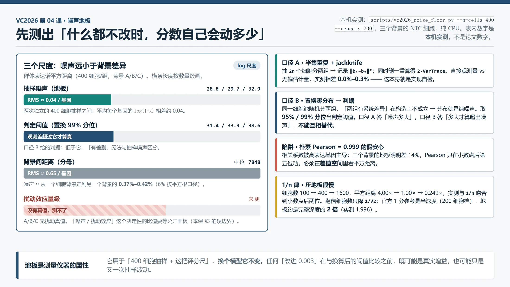
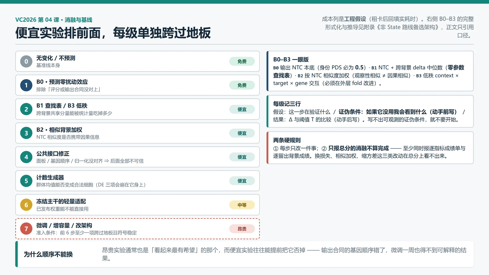

# 04｜你怎么知道改进是真的：噪声地板、完整六指标与消融

> **本课回答**：03 结束时你已经能跑通一次微调并提交。现在有人（通常是你自己）说「我改了一处，分数涨了 0.0071」——这一课给你一套机械工具，判断这句话能不能成立：一个本机实测的**噪声地板**、六项指标的**完整口径**、一份**消融顺序表**和一份**证伪清单**，外加最便宜的四条对照基线 B0–B3。
>
> **前置**：[01 数据合同与首个基线](01-数据合同与首个基线.md)、[02 State 模型拆解](02-State模型拆解.md)、[03 State 上手](03-State上手.md)。其中 03 的 LOCO 协议与计数生成器会被直接引用。
>
> **下一课**：[05 Stack：推理时把无标签细胞当示例](05-Stack推理时把无标签细胞当示例.md)。
>
> 核验日期：2026-09-18。面向熟悉软件开发与机器学习、生物学正在补课的读者。
>
> **本课的证据性质**：四层并存，别混。**本机实测**（§3 的地板数字，`scripts/vc2026_noise_floor.py` 产出）；**官方事实** `[S#]`（评分规则、参考点、提交合同）；**论文结论** `[P#]`（未在本项目复现，且留出轴与本赛不同）；**参赛者自报**（单独一级，只指方向不作量化依据）；**工程假设**（消融顺序表、证伪清单、B0–B3 的形式与阈值都是本项目的构造）。
>
> **改写进度**：本课由旧课 `L1-02`、`L2-05`、`L3-01` 与 `L2-04` 的 B0–B3 部分合并重写，四门旧课已删除或瘦身（`L2-04` 的效应迁移族部分保留待第 06 课吸收）。

## 0. 接上一课：你现在手里有什么

03 结束时，你手里有**一条能跑通的链路**和**它的价格标签**：

```text
  03 结束时的链路

  A 的 NTC + 权重 ──→ 微调 ──→ 推理 ──→ 计数生成 ──→ 3×300×400 行合法提交
                                    │
                        你还知道：LOCO 怎么留出背景、
                        预算怎么从 t_step 反推、加载报告怎么当硬门
                                      │
              缺的这一块：分数回来之后，「涨了」两个字凭什么相信？
```

这条链路上最后一块空白是**判定器**：两个版本的 `avg_score` 摆在桌上，你没有任何工具说「这个差异是真的」。本课补齐它，并且顺带把 02 留下的三处「完整版见第 04 课」的欠条一次还清（三条成绩线的完整口径、噪声地板的测法与数字、平凡基线为什么不能跳过）。

> **贯穿全课的例子。** 用**背景 A、靶点 `ADNP`**（`ADNP` 是 01 §6.2 的示意占位符，本课不做生物学断言 `[S4]`）和一组反复出现的观测：

```text
  版本 A（基线）  avg_score = -0.0412
  版本 B（加模块）avg_score = -0.0341     Δ = +0.0071
```

## 1. 直觉：为什么「分数涨了」不是证据

`Δ = 0.0071` 可能来自三种完全不同的东西：

| 可能 | 含义 | 后果 |
|---|---|---|
| 真实提升 | B 确实学到了 A 没学到的东西 | 应该采用 |
| 抽样噪声 | 两边用了不同的种子、不同的细胞抽样 | 换种子就翻转 |
| 评分噪声 | 指标本身在这批数据上的分辨力就这么粗 | 换划分就翻转 |

把后两种当成第一种，是这类比赛里最常见的自我欺骗——**你总有动机相信自己的改动有效，因为你花了两天写它**。软件基准测试可以靠多次重跑取中位数压噪声，因为每次跑的是同一个确定性程序；这里的类比边界必须说死：**真值本身就是一次抽样**，重跑模型一万次也压不掉真值的抽样噪声。这是生物学测量和软件基准最根本的差别。

### 1.1 证据基线：基准文献已经知道了什么

在动手测之前，先看这个领域已经站住的结论。**每条都带证据等级和边界**——最常见的错误不是记错数字，而是把一条有边界的结论当无边界的结论用。

| 结论 | 证据 | 留出轴 | 能外推到本赛吗 |
|---|---|---|---|
| 深度模型在「未见扰动」上常打不过简单线性基线（无变化/均值/加性/低秩） | 同行评议 `[P5]` | 细胞系内留出目标，L2/Pearson 类指标 | 否，需同协议重跑 |
| 训练集均值优于两个基础模型；带 GO/文本特征的随机森林更好；**扰动间方差偏低会放大 benchmark 误读** | 同行评议 `[P6]` | 同上 | 否，需重跑 |
| 没有一种架构在所有数据上占优；要用 rank 指标诊断 mode collapse | 预印本 `[P7]` | cross-covariate（仍能看到目标背景的其他扰动） | 否，需重跑 |
| 效应可分解为全局/目标/背景/交互四分量；**纯零样本拿不到 `背景×扰动` 交互**，加约 30% 目标背景真值才改善 | 预印本 `[P8]` | 跨细胞系 | 定性可用 |
| State 报告**相反方向**：在自己的跨情境协议下超过线性基线 | 正式发表 `[P9]` | 跨细胞情境，CELL-EVAL 多指标 | 协议不同，需同协议比较 |

两条最该记住的：**「扰动间方差偏低」是均值基线强的机制解释**——如果所有扰动的响应长得都像，预测均值就能吃掉大部分可解释方差，复杂模型多拟合的部分多半是噪声；**P5 与 P9 不是谁对谁错**，它们回答的是不同问题，必须在同一协议下重跑才能比较——这正是 03 的 LOCO 协议存在的理由。

参赛者自报的锚点（**未复核，只作方向**）：效应跨类型一致性 ≈0.016–0.037 `[P1]`、同一细胞系内双 guide「只适度一致」`[P1]`（转述 Ward 2026 `[P21]`）、采样对照细胞负基线 −0.304 / DE 方向保真度 −1.721 `[P4]`。双 guide 那条与本课直接相关：**同一基因的两个独立 guide 都只适度一致，说明被当成金标准的那一次测量本身带着巨大噪声**——这就是「噪声地板」在这个任务上的来源。使用前必须回原始 screen 重算，本课只用它们的定性方向。

## 2. 数学对象：六项指标完整版——两条路线

> 本节是**六项指标的权威位置**。02 的三条成绩线、01 的输出合同在这里接到完整的评分口径上。评分器先把单细胞预测整理成两种中间结果——**群体表达谱**（一组细胞的总体表达）与**差异表达表**（哪些基因变了多少）——六项指标只是在这两种结果上问六个不同问题。

### 2.1 两条路线总览

```text
  预测的单细胞原始计数（18,533 基因 × 400 细胞）
    │
    ├─ 路线 A：整组先汇总 ──→ 群体表达谱 b ──→ ① 扰动身份 PDS
    │                                        └─ ② 全表达谱误差
    │
    └─ 路线 B：保留每个细胞 ──→ 逐基因比「扰动组 vs NTC」
                                             ──→ 差异表达表
                                             ──→ ③ 方向保真度 ④ 方向深度
                                                 ⑤ 显著集合    ⑥ 幅度误差
```

评分对象始终是**两组细胞的对比**：目标扰动组（预测侧、真值侧各一份）与**非靶向对照**（non-targeting control，NTC，guide 不命中任何人类基因、走完全部实验流程的细胞）。两组不是同一批细胞的前后照片——scRNA-seq 消耗细胞，它们是从两个群体分别抽的样本。

### 2.2 路线 A 手算：从计数到群体表达谱

用 2 个 NTC 细胞 + 2 个 ADNP 扰动细胞 + 3 个基因演示（真实为 18,533 基因，此处数字只为手算）：

| 细胞 | 分组 | G1 | G2 | G3 | 行和 |
|---|---|---:|---:|---:|---:|
| N1/N2 | NTC | 10+0 | 0+10 | 10+10 | 40 |
| P1/P2 | 扰动 | 5+5 | 0+0 | 15+15 | 40 |

三步得到**群体表达谱**（population expression profile）`[S3]`：

1. 按基因**竖向求和** → 伪批量计数（pseudobulk）：NTC `[10,10,20]`，扰动 `[10,0,30]`；
2. 归一化到固定总量（官方 50,000）：扰动组 → `[25, 0, 75]`（总和 100 口径）；
3. 取 `log(1+x)` 压缩高表达基因的主导 → 群体表达谱 `b`。

最后减去同背景实测 NTC 谱得到**扰动效应向量**：`δ = b(扰动) − b(NTC)`。预测效应 `δ̂` 与真值效应 `δ` 用同一份 NTC 作原点。伪批量是求和后的原始向量，群体表达谱是归一化加对数后的向量——两个词不再混用。

### 2.3 路线 B 手算：从计数到差异表达表

路线 B 不先加和，对每个基因保留「两组细胞各自的值」，五步：

1. **每个细胞换算 CPM**（counts per million）：`CPM = 计数 / 该细胞总计数 × 10⁶`，消掉测序深度差异。CPM 只是评分器内部尺度，**不改变提交必须是非负整数原始计数的合同**；
2. **低表达过滤**：只保留「NTC 平均 CPM > 5」的基因（先逐细胞 CPM、再算术平均）`[S3]`。被过滤 ≠ 没有生物学信息；
3. **Wilcoxon 秩和检验**（Wilcoxon rank-sum test，即 Mann–Whitney U）：把两组细胞的值混在一起排序，问某一组是否系统地排得更高。NTC `[0,10,10,20]` vs 扰动 `[30,40,40,50]`——所有扰动细胞排在所有 NTC 之上，这是强信号。p 值小只说明「无系统差别」假设下难出现，**不说明变化大**；
4. **BH 校正**（Benjamini–Hochberg，控制错误发现率）：一次检验几千个基因必然撞出偶然小 p 值。玩具 4 基因原始 p `0.001/0.010/0.040/0.200` → 校正后 `0.004/0.020/0.053/0.200`——第三名的 0.040 过了 0.05 线，校正后 0.053 没过。校正在每个扰动内部进行，校正后 p < 0.05 记为「显著变化」`[S1][S3]`；
5. **LFC 给方向与幅度**：`LFC_g = log2((扰动组平均 CPM + ε)/(NTC 平均 CPM + ε))`，`ε=10⁻⁹`。例：40/10 → LFC = 2（约 4 倍）。

两张差异表达表——「预测扰动 vs 实测 NTC」与「实测扰动 vs 实测 NTC」——在后四项指标里互为对照。

### 2.4 六项逐个说人话


*图 1｜六项指标共用两条前处理路线：前两项用群体表达谱，后四项用差异表达表。右侧表示不同人为错误不会让六项分数以完全相同的方式变化，不代表新的生物机制。*

**① 扰动身份区分分数**（Perturbation Discrimination Score，PDS，源码名 `pds_cosine`）。把 ADNP 的预测效应向量与全部 300 个真实目标的效应向量比余弦距离，看真实 ADNP 排第几：排第 1 得 1，排最后得 0，没有身份信息时平均约 0.5 `[P10]`。所有目标输出同一个响应时 PDS 恰为 0.5；输出全零时因距离并列也是 0.5 `[S3]`。**它故意不回答**：每个基因的量与幅度是否准确。比较时统一移除整张面板 300 个目标基因列，防止模型改写已公布的目标列走捷径。

**② 全表达谱误差**（源码名 `expr_mse_unbiased_capped_norm`）。主体是「预测谱 vs 实测谱」的平方距离，除以「实测扰动相对 NTC 本来有多大」：0 = 完全命中，把 NTC 当预测时期望约 1，过差可超过 1 `[S3]`。名字里三段各有含义：`unbiased` 用 delete-one jackknife（删一法）估计「只因抽到哪些细胞」的距离并扣除——**这正是 §3 要测的那块地板，官方把它当要扣的误差，本课把它当要测的地板，同一个量两种用法**；`capped` 限制预测侧不能靠制造巨幅细胞波动把系统误差当抽样噪声抵扣；`norm` 指分母归一。

**③ 方向保真度**（`de_wilcoxon_direction_fidelity_yield_raw`）。真值 10 个显著基因、模型报 6 个、其中 5 个方向对：得分不是 5/6，而是 `5 / max(6,10) = 0.5`。`yield` 同时惩罚少报（只报有把握的）与多报（扩大分母）。**不回答**：变化 1.1 倍还是 10 倍。

**④ 方向深度**（`de_wilcoxon_direction_reach_raw`）。只取真值显著基因，按模型自己的信心排序，找「前缀方向正确率 ≥ 90%」能维持到的最深位置，除以真值显著基因总数。不是遇到第一个错就停——前缀正确率可以恢复 `[S3]`。**不回答**：模型能否自己从全部基因里发现响应集合。

**⑤ 显著基因集合重合度**（Jaccard index，`de_wilcoxon_sig_jaccard`）。真值 `{G1,G2,G3,G4}` vs 预测 `{G2,G3,G5}`：交集 2 / 并集 5 = 0.4。同时惩罚漏报与多报；两边皆空集按 1 处理。**不回答**：方向与幅度——把所有 LFC 翻转符号，Jaccard 不变。

**⑥ 幅度误差**（normalized mean absolute error，NMAE，`de_wilcoxon_lfc_nmae`）。只在真值显著且 LFC 有限的基因上算：真值 `+1/−2`、预测 `+0.5/−1` → `(0.5+1)/(1+2) = 0.5`。完美为 0，全预测零变化为 1，过放大可超 1；官方只评至少 10 个合格真值显著基因的扰动 `[S3]`。**不回答**：模型自己找对了多少响应基因（评分集合由真值决定）。

六项**都不评当前扰动的目标基因本身**——预测「ADNP 下降」只是在复述 CRISPRi 的直接目标，不是推断下游响应 `[S3]`。这六项各自封死一条捷径，任何单项刷高都会被其他项拉住：

| 指标 | 封死的捷径 |
|---|---|
| PDS | 输出对所有目标都一样的「通用平均扰动谱」 |
| 全谱误差 | 只在少数基因上做对、其余不管 |
| 保真度 + 深度 | 只报少数有把握的基因拉高准确率 |
| Jaccard | 用显著性阈值调参刷分 |
| NMAE | 把效应幅度整体放大或缩小 |


*图 2｜多角度评分的直觉插画（生成式解释插画，不是机制证据）。方向、集合、尺度与距离的意象只表示「从不同方面检查同一预测」，不逐一对应公式。*

### 2.5 raw 与 scaled：原始值不能直接平均

六项原始值方向不同（②⑥越低越好，其余越高越好），一个原始误差 500 不能与 PDS 0.8 相加——就像 500 毫秒不能与 0.8 米取平均。官方先把每项放到同一参考尺度 `[S1]`：

```text
  对每个「指标 × 细胞背景」，官方先算两个实测参考点：

  b（0 分参考）：该背景的平均扰动响应，分配给所有目标
                —— 它知道「这个背景通常如何响应」，但不能区分具体目标
  r（1 分参考）：每个真值扰动与 NTC 拆成两个不重叠半集，互相比
                共 5 次固定随机拆分取平均 —— 半深度真实重复之间的一致性

  缩放分  s = (u − b) / (r − b)      u = 你的原始值
```

**特别注意：0 分参考不是 NTC，也不是全零矩阵。**两个玩具例子：「越高越好」项 `b=0.5, r=0.8, u=0.65` → `s = 0.5`；「越低越好」项 `b=1.0, r=0.04, u=0.52` → `s = (0.52−1.0)/(0.04−1.0) = 0.5`——分母为负，公式自动处理误差类指标。汇总：每个背景内六项缩放分等权平均，再三背景等权平均；分数不是百分比，不乘 100；截断只有两处（全谱误差缩放分限 `[0,1]`、NMAE 坏侧下限 −6）`[S1][S3]`。

| 缩放值 | 正确解读 | 不正确解读 |
|---:|---|---|
| 0 | 与平均扰动响应基线相当 | 缺失值或「什么都没有」 |
| 1 | 与两个半深度真实重复的一致性相当 | 100% 准确或理论满分 |
| < 0 | 比平均响应基线还差 | 评分器出错 |
| > 1 | 比半深度重复参考更接近保留真值 | 必然超过完整生物实验 |

### 2.6 怎样读一张六指标成绩单

不要从总分开始猜，按这个顺序读：

```text
  ① 扰动身份：模型是否对不同目标产生了不同响应（还是通用平均谱）？
  ② 整体数值：图案对了之后，表达量是否过强/过弱？
  ③ 显著集合：有没有找到与实验相同的响应基因？
  ④ 方向与排序：上调还是下调？高信心基因是否真的更可靠？
  ⑤ 幅度：响应大小是否校准？
```

| 成绩模式 | 首先怀疑 | 不能直接得出 |
|---|---|---|
| PDS 高，全谱误差与 NMAE 差 | 效应方向图案有用，但整体尺度过强/过弱 | 模型已准确重建表达量 |
| Jaccard 高，保真度低 | 名单大致对，但方向可能翻转 | 名单对就代表机制对 |
| 群体两项好，DE 四项差 | 细胞间波动、零比例或生成分布不对 | 一定只是目标表示太差 |
| 保真度尚可，Jaccard 很低 | 只报少数有把握基因，或显著性校准不对 | 方向头完成了整个任务 |

六项不是六个独立分数，而是**互不替代的故障探针**：全谱误差差指向标定，Jaccard 低指向显著性校准，保真度低指向符号。看错一格就会去修一个本来没坏的模块——本项目里最贵的一类返工。务实的选择法：先给六项设最低门槛排除明显失真的模型，再在过门槛者里比总分。

### 2.7 先校准评分台：H1 离线回路

六项指标的全部判断都默认「评分器没坏」。校准它不需要 GPU：用 VC2025 的 H1 公开扰动真值（同为 CRISPRi、同为 10x Flex、有同背景 NTC `[S2]`）搭离线回路。固定输入与版本（数据集版本、`cell-eval2` 版本、rule 版本、seed、基因与靶点列表及顺序、cells_per_target=400），先跑**三个校验臂**：

1. **真实半集对另一半**：每个目标和 NTC 拆成不重叠两半，一半当预测、一半当真值 → 应接近本地自建的 1 分参考；
2. **同一平均扰动响应分给所有目标** → 应接近 0 分参考，PDS 原始值 ≈ 0.5；
3. **把 NTC 当作所有目标的零效应预测** → PDS ≈ 0.5，NMAE 原始值接近 1。

三臂过了再做**人为破坏实验**——下表是**按指标定义得到的实验前预期，不是已观测结果**（本机尚未在 `cell-eval2` 上实跑，缺 H1 真值与专用环境）：

| 人为破坏 | 预期最敏感的指标 | 检查什么 |
|---|---|---|
| 随机打乱 `target_gene` 标签 | PDS 与多数项应变差 | 标签是否真的参与评分、有无泄漏 |
| 效应空间统一缩小 | 全谱误差与 NMAE 变差，PDS 可能近似不变 | 方向图案与幅度是否被分开检查 |
| 翻转 LFC 符号、保留显著名单 | 方向两项明显变差，Jaccard 可能不变 | 集合指标没被当成方向指标 |
| 400 个细胞几乎相同但保持群体谱 | 群体项变化小，差异表与抽样校正变化 | 能否感受分布坍缩 |

```bash
uvx --from 'cell-eval2==0.15.0' cell-eval2 run \
  -ap predictions/repeat_half.h5ad -ar truth/holdout_half.h5ad \
  --preset vcc2026 --pert-col target_gene -o results/repeat_half
```

成绩单至少保存：数据版本、`cell-eval2` 版本、规则版本、种子、背景、面板哈希、六项原始值与缩放值、有效扰动数、运行日志、代码提交号。**本地自建尺度只能用于同一数据集内比较，不能冒充 A/B/C 官方缩放分。**

## 3. 实验流程：本机噪声地板怎么测

> 本节是**噪声地板的权威位置**，推导完整保留。它产出整条链路上**第一个必须由本机产出的数字**——在它之前，任何「我的方法高了 0.03」都无法判断是提升还是运气。

### 3.1 地板的两个方向，别弄反

「噪声地板」在本课指**两个不同方向的数**：**下地板**是「无信号预测得多少分」（控制基线的落点，换个基线就变）；**上地板**是「真实重复之间差多少」（测量仪器的属性，换个模型不变）。本课测的是**上地板**——任何模型与真值的差距不可能稳定小于它，因为**真值本身也只是一次 400 细胞抽样**。

### 3.2 噪声从哪来，本机能测到哪一个

| 来源 | 是什么 | 本机能测吗 |
|---|---|---|
| 分子抽样 | 测序只抽到每个细胞的一部分分子，低丰度 RNA 容易漏 | **能**（本课测的主体） |
| 细胞抽样 | 400 个细胞是从更大群体里抽的 | **能**，与上者不可分，一起被测到 |
| 细胞异质性 | 细胞周期、应激造成的真实差异——这是**信号**不是噪声 | 不能直接分离 |
| 批次 / guide 效率 | 不同 NTC guide、孔位、测序批次 | **不能**（A/B/C 只有 NTC 且 guide 身份未标注） |

重要区分：把细胞异质性也压平，会得到一个「很稳定」但生物学错误的预测——这正是把 400 个细胞预测成同一行会得 −0.81 的原因 `[P1]`（参赛者自报）。前两项合起来叫**抽样噪声**，就是本课的地板。

### 3.3 地板的公式：delete-one jackknife

先钉死空间：所有距离都在 §2.2 的群体表达谱空间里算（长度 18,533，平方欧氏距离），与官方全表达谱误差同空间同单位。问题是：**再抽一组同样的 400 个细胞，两组的群体谱会差多远？**答案是 `2·Var(b̂)` 的迹。用删一法估计：令 `b(-c)` 是删掉第 c 个细胞后重算的谱，`b̄` 是 400 个 `b(-c)` 的均值：

```text
  VarTrace = (n−1)/n · Σ_c ‖b(-c) − b̄‖²          （n = 400）
  E‖b̂₁ − b̂₂‖² = 2 · VarTrace                     （两组独立抽样的期望平方距离）
```

一条可以直接验算的推论：`VarTrace ∝ 1/n`——细胞数翻倍，方差减半，距离（平方根）只降到 `1/√2`。**靠加深抽样压地板收益很慢**：从 400 加到 1600（4 倍）只把距离压到一半，§3.5 会实测验证。

裸的平方距离没有单位，300 是大是小没人知道。本课的分母用**背景间距离**：`D_AB = ‖b_A−b_B‖² − VarTrace(b_A) − VarTrace(b_B)`——A/B/C 三个背景是已知的、量级远大于噪声的真实生物差异，是这批数据里唯一能拿到的尺子。于是地板写成 `ρ = 2·VarTrace(400) / D(三对中位数)`，读法：**「两个独立的 400 细胞对照样本之间的距离，相当于从一个背景走到另一个背景的百分之多少。」**

这条分母有一个必须写死的边界：**背景间距离 ≠ 扰动效应量级**。CRISPRi 扰动造成的表达变化通常远小于两个细胞系的差异，所以 ρ 小**不能**推出「噪声相对于扰动效应也小」——那个决定性的比值需要公开扰动真值，本机至今没测出来（§7 的欠账清单第一条）。

### 3.4 测量流程：两种口径 + 一个陷阱

脚本：[`scripts/vc2026_noise_floor.py`](../../scripts/vc2026_noise_floor.py)，输入是 `data/vcc2026-validation/controls/` 三个背景的 NTC 细胞（每背景 18,400 细胞 × 18,533 基因），全程 CPU。

```text
  口径 A（重采样/半集重复）——答「噪声有多大」
    重复 R 次：抽 2n=800 个不相交细胞 → 分两组 → 各算 b → 记录 ‖b₁−b₂‖²
    同时对一组做删一法 → 2·VarTrace
    半集距离 = 直接观测量；jackknife = 无偏估计量。两者应接近——
    不接近说明实现有问题。它们的吻合本身就是一次自检。

  口径 B（置换零分布）——答「多大的差异才算超出噪声」
    同一细胞池随机分两组：「两组有系统差异」在构造上不成立
    → 这个分布就是纯抽样噪声 → 取 95% / 99% 分位当判定阈值
```

两种口径在本实现里用同一种抽样操作，所以**均值应当一致**——实测背景 A 为 28.81 与 28.74（差 0.2%）、背景 C 为 32.88 与 32.43（差 1.4%），这是预期行为，也是又一道正确性检查。口径 B 的价值**不在均值，在分位数**。

**陷阱：朴素 Pearson 相关。**第一直觉会想用「两组谱的相关系数」当地板：实测 0.99905 / 0.99902 / 0.99890，接近 1，看似极好——**这是假的**。两个谱都被同一批高表达基因主导，相关系数几乎完全由「哪些基因表达量高」决定，而这件事两组完全一样；三个背景的地板明明差 14%，Pearson 只在小数点后第五位动。必须在**差值空间**里看平方距离。这条教训反复出现：**在被均值主导的空间里，任何相似度指标都会虚高**——六项指标里有四项因此建立在「减去 NTC 之后的差异表」上而不是原始谱上。

### 3.5 本机实测结果

> 以下数字由 `python scripts/vc2026_noise_floor.py --n-cells 400 --repeats 200` 在本机 CPU 实测产生，不是从任何论文抄来的。**测量条件写在表里，超出条件不可外推。**

| 背景 | 半集平方距离 均值±sd | jackknife 2·Var 均值 | 置换 95% 分位 | 置换 99% 分位 | 朴素 Pearson | 地板 RMS/基因 |
|---|---|---|---|---|---|---|
| A | 28.81 ± 1.35 | 28.84 | 30.62 | 31.36 | 0.99905 | 0.0394 |
| B | 29.74 ± 1.62 | 29.70 | 32.84 | 33.86 | 0.99902 | 0.0400 |
| C | 32.88 ± 2.38 | 32.88 | 36.87 | 38.62 | 0.99890 | 0.0421 |

一次直接读出来的自检：三个背景的「半集均值」与「jackknife 均值」相差 0.0% / 0.1% / 0.0%——无偏估计量与直接观测量吻合，实现是对的。**「地板 RMS/基因」是最直观的一个数：两个独立的 400 细胞样本，平均每个基因的 `log(1+x)` 相差约 0.04。**

分母（背景间距离）：A–B `7848.65`、A–C `9471.20`、B–C `6246.78`（无偏校正后中位数 **7848.01**），RMS ≈ 0.65/基因。**抽样噪声比背景差异小一个数量级以上**——但再说一遍 §3.3 的边界：这不代表它比扰动效应小一个数量级。

`2·VarTrace` 随每组细胞数的缩放（每格 40 次重复）：

| 每组细胞数 | 背景 A | 背景 B | 背景 C | 相对 400 倍数（A） | 理想 1/n |
|---:|---:|---:|---:|---:|---:|
| 100 | 115.94 | 117.31 | 129.10 | 4.00 | 4.00 |
| 200 | 57.81 | 59.21 | 65.87 | 2.00 | 2.00 |
| 400 | 28.96 | 29.76 | 32.98 | 1.00 | 1.00 |
| 800 | 14.45 | 14.75 | 16.76 | 0.499 | 0.500 |
| 1600 | 7.20 | 7.41 | 8.39 | 0.249 | 0.250 |

**1/n 律在这批数据上成立到小数点后两位。**由此两条可直接用的结论：官方「把 400 拆成两个 200」的半深度参考，其地板平方距离约为完整深度的两倍（实测 200 细胞档是 400 细胞档的 **1.996 倍**，理论 2.00）；**加深抽样压地板很慢**——每压一半都要再来 4 倍细胞。



*图 3｜噪声地板的三个尺度与测量机。数字全部来自本节实测表；「扰动效应」一栏的虚线表示它没有被测量、也不能被本节的地板代表。*

### 3.6 本机地板数字（本课核心产物）

> **本机噪声地板（每组 400 细胞，群体表达谱平方距离）：**
>
> | 背景 | 地板（平方距离） | 判定阈值（置换 99% 分位） | 地板 / 背景间距离 |
> |---|---:|---:|---:|
> | A | **28.8** | 31.4 | 0.37% |
> | B | **29.7** | 33.9 | 0.38% |
> | C | **32.9** | 38.6 | 0.42% |
>
> 直观说法：**两个独立的 400 细胞对照样本，平均每个基因的 `log(1+x)` 相差约 0.04；相当于从一个细胞背景走到另一个背景的 6% 左右**（平方根口径：A 6.06%、B 6.15%、C 6.47%）。

**这个数字适用于**：A/B/C 的 NTC 对照细胞、每组 400 细胞、群体表达谱空间（归一化 50,000 后 `log(1+x)`）、平方欧氏距离。**它不适用于（超出即不可外推）**：任何扰动效应（本赛 D/E/F 与 A/B/C 都没有扰动真值，「噪声/扰动效应」是另一个比值，需公开 screen）；任何单项指标（六项各有各的噪声放大方式，DE 类过 Wilcoxon + BH 会非线性放大——把 400→200 的结论直接套到 DE 指标上是错的）；其他细胞数（用缩放曲线换算，不要线性外推）；其他背景（D/E/F 深度与细胞组成未知）。

## 4. 失败与噪声：三类自欺从哪来

地板只解决「差异够不够大」，不解决「**这个差异是不是这个改动带来的**」。后者是因果链问题，而三类自欺专门制造并不存在的改进。

**第一类：随机种子自欺。**同一份代码不同种子跑两次，`Δ_seed = s₁ − s₂ ≠ 0`——初始化、打乱、dropout、生成采样全含随机性。最常见的形态：基线用种子 1（−0.0412），改动用种子 2（−0.0341），这个对比**什么都不能说明**。正确做法是固定种子，或两版本各跑多种子看分布。**一个容易被忽略的环节**：换种子测的是**模型侧**方差，而地板主要来自**真值侧**抽样——测模型方差测不到真值方差，这是 §8 诊断题三的考点。

**第二类：划分泄漏。**训练与验证之间存在信息通路，验证分数被系统性抬高。本赛合同下至少三条通路：同一背景的细胞分裂进训练/验证（同背景细胞高度相关）；复用的预训练权重见过验证集扰动（不是零样本）；用靶基因自己的敲低强度当特征（比赛 D/E/F 不提供）。泄漏的可怕之处：**它不会以「不稳定」的形式暴露自己**——它给你一个非常稳定的高分，只有换划分才现形。典型剧情：同背景内留出领先 0.03，改成 LOCO 后优势掉进地板。完整泄漏清单在 03 §2。

**第三类：多重比较（选择偏差）。**在 k 个候选里选最大值——即使所有候选真实效果完全相同，最大值的期望也高于均值。这是三类里最隐蔽的：**不需要随机性错误、也不需要泄漏**，公式本身就够。某量真实恒为 0，每次测量噪声 σ，取 k 个独立测量的最大值（正态近似，**工程假设**，notebook 单元 2 可复核）：

| 候选数 k | 最大值的期望（单位 σ） |
|---:|---:|
| 1 | 0.00 |
| 3 | 0.85 |
| 6 | 1.27 |
| 12 | 1.63 |
| 30 | 2.04 |

6 个候选就送你 +1.27σ 的虚高——若地板换算到分数上 σ≈0.005，**仅仅因为扫了 6 个点你就可能看到 0.006 的「真实改进」**。因此一条硬规则：**扫描取最大值的那个数字，不能直接与单点改动的数字比较**；扫描必须配一个独立确认集，在最优点上重新测一次。

最后是**地板本身的误读清单**（每条都真踩过）：

| 误读 | 为什么错 | 正确做法 |
|---|---|---|
| 把地板当「某个模型的误差」 | 地板是测量的属性，换模型不变 | 地板判「改进真不真」，模型误差判「模型好不好」 |
| 朴素 Pearson 当地板 | 被高表达基因主导，虚高 | 差值空间的平方距离（§3.4） |
| 「噪声只有背景差异的 0.4%，可忽略」 | 分母是背景差异，不是扰动效应 | 「噪声/扰动效应」需公开真值，未测 |
| 多跑几次模型压地板 | 真值是一次抽样，重跑不改变它 | 只能加深抽样压低，且 1/√n 很慢 |
| 400 vs 400 的地板套官方 1 分参考 | 官方是半深度（两个 200 互比） | 按 §3.5 换算：平方距离 ×2 |
| 自报双 guide 一致性当本项目地板 | 别的数据集、guide 层噪声、未复核 | 标待复核；本机地板只覆盖分子+细胞抽样 |
| 压平细胞间变异降地板 | 把信号当噪声删，DE 三项崩塌（−0.81 `[P1]`） | 保留并校准变异，见 03 §8 的分布验收 |

## 5. 与 VC2026 的关系：官方 0/1 参考点就是一次地板测量

这是本课最关键的一处连接。**官方的参考缩放点就是在做噪声地板测量** `[S1]`：

| 官方概念 | 本课的对应物 | 含义 |
|---|---|---|
| 1 分参考 | 半集重复距离 | 「真实实验自己跟自己能差多少」→ **上地板** |
| 0 分参考 | 平均扰动响应基线 | 「不知道是哪个扰动时最好能到哪」→ 下地板的上界 |
| 缩放分 s | 原始值除以两个参考的距离 | 把「误差」换算成「多少个重复噪声」 |

于是缩放分的读法更精确：`s=1` 意味着**你的预测与真值的差距，和真值的一次半深度独立重复与它的差距一样大**；`s>1` 不是「超过生物实验」——半深度重复每边只有一半细胞，仍含抽样噪声，完整深度的重复会更好。由此得到本赛最重要的一条实用判据：**缩放分 0 到 1 之间，是「你还没做到真实实验的可重复性」的区间；在这段区间里，任何不到 0.5 个重复噪声的改进，在测出本地板之前不能声称为真。**

本机数字怎么接官方尺度：本机测的是 400 vs 400（完整深度），官方 1 分参考是半深度（两个 200 互比），按 1/n 律换算——半深度的平方距离约是完整深度的 2 倍（距离约 √2 ≈ 1.41 倍），且这条换算已实测验证（1.996）。**注意换算只覆盖分子**：官方缩放的分母 `r−b` 用同一批真值的半集重复，本机分母是背景间距离——两者不同，所以本机地板**不能**直接换算成官方缩放分。

执行时序上还有一条：A/B/C 有真值，可以跑本课全部诊断；**最终轮 D/E/F 只给 NTC（2026-10-22 发布，2026-11-05 23:59 UTC 截止，中间 14 天 `[S1][S2]`），届时没有任何改动可以被验证**。两轮使用不同背景、面板与参考点，绝对分数不可比。在 A/B/C 上没用完的诊断额度，最终轮不会补给你。

## 6. 对模型的影响：把地板变成判据、消融阶梯与 B0–B3 对照底

### 6.1 判定流程：三个判据，顺序不能换

测出地板不是为了一个漂亮数字，是为了改**决策规则**。三个判据各挡一类假象：

```text
  待检验的改动 Δ = u₁ − u₀
    │
    ├─ 判据一（地板阈值）   |Δ| > T ?           否 → 不判定（≠ 证明无改进，
    │                                          │     只是现有证据不足）
    │                                          ▼
    ├─ 判据二（确认集）     数字来自扫描？       是 → 在独立确认集复测一次
    │                                          │
    │                                          ▼
    └─ 判据三（真值侧重抽） 固定划分、只重抽真值侧 N ≥ 20 次，Δ 符号稳定？
                                               否 → 不判定
                                               是 → 写进决策记录
```

判据三的具体操作：对每个留出背景的真实扰动组做 bootstrap 重采样（或按 §3.4 半集方式做不相交拆分），每次得到一组「新真值」，在同一份预测上重新评分。**为什么必须重抽真值侧**：换模型种子测的是模型侧方差，回答不了「这个改动是真的吗」——改动的收益不随模型种子变。**顺序不能换**：先做判据三会在一个本来就低于地板的差异上浪费 20 次重抽；跳过判据二会把选择偏差当成真实增益，让地板阈值形同虚设。

它怎么改具体决策：

| 场景 | 没有地板时会怎么做 | 有地板之后 |
|---|---|---|
| 换种子重跑，分数变 0.02 | 挑高的那个用 | 先比 0.02 与 T；低于就固定种子并记录「本分辨率下不可判定」 |
| 加辅助损失，分数涨了 | 保留 | 同上，且只在同一次划分内比较 |
| 集成两个模型，分数涨了 | 保留 | 集成天然降方差，**增益最容易落在地板之下**，需多 seed 验证 |

第三条特别值得记：集成的主要作用是降方差，而降方差的增益恰恰与噪声地板同源——「集成涨了 0.01」是最需要地板来检验的一类改动。

### 6.2 消融顺序表与证伪清单

设计目标：**用最小的总成本，把最大的不确定性先消掉。**消融的成本差异极大——换聚合统计量是秒级 CPU；B0–B3 对照、核函数、缩放系数是分钟级；小批推理与轻量适配要租卡几小时；微调/改架构要数天。**把昂贵实验排在便宜实验前面，是本项目最容易犯的流程错误**：昂贵实验通常也是「看起来最有希望」的那个，而便宜实验往往能提前把它否掉——输出合同的基因顺序错了，微调一周也不会得到可解释的结果。

| 步 | 消融什么 | 成本 | 它在排除什么 | 若失败（增益 ≤ 地板）说明什么 |
|---:|---|---|---|---|
| 0 | 无变化 / 不预测 | 免费 | — | 基准线本身 |
| 1 | 均值基线（B0） | 免费 | 「模型有没有超额能力」 | 拿不到正分 → 问题在评分或输出合同，不在模型 |
| 2 | 加性 / 低秩（B1/B3） | 便宜 | 「共享分量能被统计量吃掉多少」 | 复杂模型不必再试容量——它连查找表都赢不了 |
| 3 | 相似背景加权（B2） | 便宜 | 「背景相似度是否携带因果信息」 | 相似度只是代理变量 |
| 4 | 公共接口修正 | 便宜 | 「分数是否来自接口错配」 | 面板/基因顺序/归一化没对齐 → 后续全部不可信 |
| 5 | 计数生成器 | 便宜 | 「群体均值能否变成合法细胞」 | DE 三项崩塌，与群体预测能力无关 |
| 6 | 冻结主干的轻量适配 | 中等 | 「已发布权重能不能直接用」 | 权重与合同的接口不可达，需换路线 |
| 7 | 微调 / 增容量 / 改架构 | 昂贵 | 「真实增益还差多少容量」 | **到这步还没跨过地板，就不该继续往上堆** |

三条原则藏在表里：**先排除「测量错了」，再排除「模型不行」**（0–4 步几乎零成本，却能把「模型不行」和「评分没对上」分开）；**每一步只改一件事**（B1 与 B2 必须分开跑——同时加两项涨了 0.006，你不知道是谁的功劳，而两者的信息需求完全不同）；**昂贵步骤的准入条件是「前 6 步至少一项跨过地板且符号稳定」**——一项都没有，说明瓶颈不在容量。



*图 4｜消融阶梯。成本列是工程假设（租卡后回填实耗时）；第 7 级的虚线框表示它有显式准入条件，不是默认下一步。*

每一步记三行，**第二行是关键**——必须是一个可观测的量：

```text
  假设：    <这一步在验证什么>
  证伪条件：<如果假设错，我会看到什么>     ← 动手之前写
  结果：    <观测差 Δ 与阈值 T 的比较>     ← 动手之后写
```

配套的**证伪清单**覆盖 02–06 课的主要改动，每条一个可观测失败信号（完整 13 条见 §7.4 速查区）。三条最容易被漏掉，因为**它们在总分上看不出来**：

- **换损失**（Energy → MSE，02 §4）：总分几乎不变甚至微涨，但分布类指标在退化——`avg_score` 是多项平均，分布指标的损失被幅度指标的收益掩盖。只看总分，你会带着一个分布已经坏了的模型进最终轮。
- **相似背景加权**（B2）：平均分上涨，但留出背景上的最差一格在变差——自报数据里 B2 在跨实验室背景输 0.054，赢到的只有 0.003–0.004 `[P4]`。平均值是这类改动最好的伪装。
- **缩小细胞间方差**：总分涨、DE 三项跌——组内变异变小让 Wilcoxon 更容易显著，人为放大预测显著基因集合，同时污染 Jaccard 与保真度的分母；压到 0 得 −0.81 `[P1]`（参赛者自报）。

所以第二条硬规则：**任何只报告总分的消融，都不算完成消融**——至少同时报 (a) 逐指标成绩单，(b) 逐留出背景成绩。用法上：动手前从清单抄下对应行的证伪条件（改动不在清单上就自己补一行，写不出可观测条件就不要开始）；动手后**先看证伪条件是否触发，再看分数，顺序不能反**——先看分数会让你不自觉地去找解释。

### 6.3 B0–B3：最便宜的对照底

「平凡基线在本赛不是走过场」——02 §7 已引用论文的自认：State 的优势是跨指标一致性，不是单项第一，某些基线在个别指标上偶尔赢它 `[P9]`。B0–B3 就是这套对照的机械版本。它们的形式化定义与完整推导的权威位置在附录[《非 State 路线备选架构》](appendix/非State路线备选架构.md)（**口径只引用不重写**），本节给对号入座与手算。

| 级别 | 形式 | 新增能力 | 通过条件 |
|---|---|---|---|
| B0 | `μ̂ = μ(NTC)`（目标背景 NTC 群体均值） | 无——定义最低验收线 | 不适用，它是别人的门槛 |
| B1 | `μ̂ = μ(NTC) + median_d Δ(d,t)` | 跨背景全局目标 delta | 多数 fold 的扰动相关指标上超过 B0 |
| B2 | `Δ̂ = Σ_d w(c,d)·Δ(d,t)`，softmax 加权 | 相似背景加权 | 稳定超过 B1，否则回退 B1 |
| B3 | `Δ ≈ Δ̄(t) + Σ_r a(c,r)b(t,r)q(g,r)` | 低秩交互 | 在**外层 fold** 改进，而非只降训练误差 |

三个边界：**B0 不是「随便猜」，也不等于官方 0 分参考**——它保留留出背景的真实基础表达与计数分布，只是故意预测零扰动效应；**B1 是零参数查找表**——`median` 是统计量不是拟合参数，没有优化目标就没有过拟合，「B1 很强」的机械依据就在这；**B2 的相似是观察性相似不是因果相似**——`w` 只由 NTC 算出，NTC 像只说明基线状态像，不保证干预响应方向一致。目标在所有捐献背景零覆盖时 B1 必须回退 B0（`np.median([])` 是 `nan`），**不能拿名字相似的基因顶替**——本赛的匿名背景会让这条路径真实触发。

B1 手算（4 基因示意，归一化 `log(1+x)` 空间，**工程假设/手算，非实测**）：

```text
  背景 d1:  NTC [0.10, 2.00, 0.50, 1.00]   扰动 [0.30, 1.20, 0.50, 1.00]
            Δ(d1,t) = [0.20, -0.80, 0.00, 0.00]
  背景 d2:  NTC [0.20, 1.00, 0.30, 2.00]   扰动 [0.50, 0.40, 0.30, 2.00]
            Δ(d2,t) = [0.30, -0.60, 0.00, 0.00]
  背景 d3 未测 t  →  D_t = {d1, d2}

  B1 的 delta（逐基因中位数）= [0.25, -0.70, 0.00, 0.00]
  目标背景 c（NTC [0.15, 1.50, 0.40, 1.60]）的预测：
    B1 = [0.40, 0.80, 0.40, 1.60]        B0 = [0.15, 1.50, 0.40, 1.60]（不依赖 t）
```

注意 2 个数取中位数等于取均值——退化情形；真实面板背景 ≥3 时中位数才真正稳健（notebook 单元 2 用 5 背景 + 1 异常背景演示）。`Δ̄(t)` 在所有目标背景下是同一个向量——**B1 的全部信息就是这一张表**。

B0–B3 与六项指标的错位：**B0 在各项上的原始值不是「0 分」，而是各有各的固定落点**——PDS 必为 0.5（300 个目标输出全同，距离并列）、NMAE 接近 1（所有 LFC 预测为 0）、全谱误差反而不差（它保留了正确的基线表达）。把 B0 当「零分参考」是错的（§2.5 的 0 分是平均扰动响应）。

实测路径——「B0 到底得多少分」可以从引用变成实测：本仓库登记的 [`references/vcc2026-h1-benchmark/`](../../references/vcc2026-h1-benchmark/) 是带真值的本地基准（H1 训练集重采样、126 靶点 × 400 细胞、`cell-eval2==0.16.0`），其 `score-control-baseline` 从真实 H1 对照池为目标抽等量对照细胞——**与 B0 的定义逐字一致**，报告值 `avg_score ≈ -0.045230687652238` `[R1]`。三个限定必须带上：它是**确定性重采样基准，不是隐藏真值或官方榜单分**，不能当作 D/E/F 的预测；它**不是 B1**（generic-response 零分参考是另一个东西）；数字来自 README 正文，本机未复跑（需 15.48 GB 下载）。

```bash
uv tool install git+https://github.com/forrestsheldon/vcc2026-h1-benchmark.git@v0.2.0
vcc-h1 setup                      # 下载 15.48 GB，抽 537 MB 对照文件
vcc-h1 score-control-baseline --output control-baseline/
cat control-baseline/scores.csv   # 对照 README 的 -0.045230687652238
```

一个本机环境坑先记下：**h5py 在 UNC 路径（9p 挂载）上拿不到文件锁**，报 `unable to lock file, errno = 0`——先把文件复制到本地临时目录再读，或用 `--h1 /path/to/adata_Training.h5ad` 指定本地文件。这是工具环境限制，不是分析结论。B1–B3 需要公开扰动面板（`Δ(d,t)` 需要「同背景同靶点」的扰动细胞，本赛 A/B/C 只有 NTC），面板配置登记在 [`references/perturbation-decomposition/configs/datasets.yaml`](../../references/perturbation-decomposition/configs/datasets.yaml) `[R2]`；**本机目前没有任何实测的 B1–B3 分数，本课也不编一个**。

用哪一级的决策规则：目标零覆盖 → B0；共享分量主导（`beta_frac` 高）→ B1 就够；中间 → 先 B1 再试 B2/B3（要外层 fold 证据）；背景特异分量主导 → 才轮到高容量路线。`beta_frac` 分档阈值是第 06 课（原 `L2-03` §6.4）的工程假设，此处只回指不重写。判据仍然是 §6.1 的地板：**改动前后分数差不超过换算后的阈值，就不算改进。**

## 7. 可复现实践：这一课你手里多出来的东西

本课不产出模型，产出**四份可复用的工具**：一个你自己测的地板数字、一张六指标速查表、一份消融顺序表、一份证伪清单。

### 7.1 样板槽位覆盖表

| 槽位 | 本课的位置 |
|---|---|
| 直觉解释 | §1（三种来路 + 证据基线） |
| 机制或数学对象 | §2（两条路线与六项指标）、§3.3（jackknife 公式） |
| 实验或数据流程 | §2.2–2.3（手算）、§3.4–3.5（测量与实测）、§2.7（校准评分台） |
| 失败与噪声 | §4（三类自欺与误读清单） |
| 与 VC2026 的关系 | §5（0/1 参考点）、§2.5（缩放分） |
| 对模型的影响 | §6（判据、消融、B0–B3） |
| 可复现实践 | §7（本节） |
| 诊断题 | §8 |

### 7.2 动手材料与产物

配套四份 notebook（全部纯 NumPy / 离线，不装 `arc-state`、不跑正式评分）：

- [`notebook/05_noise_floor.ipynb`](../../notebook/05_noise_floor.ipynb)：口径 A/B 的分布画出来，改细胞数看地板怎么移动；
- [`notebook/11_ablation_and_falsification.ipynb`](../../notebook/11_ablation_and_falsification.ipynb)：三类自欺的机制演示——种子噪声、k 选最大、地板判定、**真值侧重抽 vs 模型侧重抽**（单元 4 是核心）、「总分涨 DE 跌」的构造、成本模型、清单自检；
- [`notebook/09_simple_baselines.ipynb`](../../notebook/09_simple_baselines.ipynb)：B0/B1 手算逐位对表、中位数稳健性、LOCO 骨架、B2 权重集中、「B1 优于 B0」接到地板的机械判定；
- [`notebook/04_arc_colab_h1_benchmark.ipynb`](../../notebook/04_arc_colab_h1_benchmark.ipynb)：官方 Colab 固定副本哈希校验、150→126 靶点筛选、三方 SHA-256 比对——校验的是**评分输入合同没有走样**，不是指标数值。

地板测量命令与产物：`python scripts/vc2026_noise_floor.py --n-cells 400 --repeats 200` → `output/noise-floor/` 下 `noise_floor_results.json`（完整结果与配置）、`noise_floor_table.csv`、`noise_floor_scale.csv`、`noise_floor_scaling.csv`。**填一张你自己的表**（不要抄课文数字——你的数据版本、细胞数、重复次数都可能不同）：数据版本与 manifest 哈希、每组细胞数、重复次数、半集均值±sd、jackknife 均值、置换 99% 分位、背景间距离中位数、地板/背景间距离。**自检**：半集均值与 jackknife 相差超过两个数量级，先查代码，不要写结论。

### 7.3 课末速查区

六项指标速查（定义细节回 §2.4）：

| 指标 | 源码名 | 路线 | 方向 | 它故意不回答 |
|---|---|---|---|---|
| 扰动身份 PDS | `pds_cosine` | A | 高好 | 量与幅度准不准 |
| 全谱误差 | `expr_mse_unbiased_capped_norm` | A | 低好 | 单细胞分布形状 |
| 方向保真度 | `de_wilcoxon_direction_fidelity_yield_raw` | B | 高好 | 幅度大小 |
| 方向深度 | `de_wilcoxon_direction_reach_raw` | B | 高好 | 自己发现响应集合 |
| 显著集合 | `de_wilcoxon_sig_jaccard` | B | 高好 | 方向与幅度 |
| 幅度误差 | `de_wilcoxon_lfc_nmae` | B | 低好 | 自己找对多少基因 |

地板速查（400 细胞档，群体表达谱平方距离；换算规则见 §3.5–3.6）：地板 `28.8 / 29.7 / 32.9`；置换 99% 阈值 `31.4 / 33.9 / 38.6`；背景间距离中位 `7848`；半深度档 = 平方距离 ×2。

证伪清单速查（**工程假设**；观测手段标 ★ 的表示必须逐指标/逐背景分解才看得见）：

| # | 改动 | 证伪条件（可观测） |
|---:|---|---|
| 1 | Energy 换 MSE ★ | 分布指标变差而 nmae 变化 < 地板 |
| 2 | 去掉残差加回 | 预测与 NTC 的逐基因相关下降 |
| 3 | Stack 上下文放更多示例细胞 | 显存超 8 GiB 或 batch=1，单次可比性丧失 |
| 4 | 上下文放「同类」而非随机细胞 | LOCO 增益 < 同背景增益 |
| 5 | scGPT 嵌入替换随机靶点嵌入 | 与随机初始化差距 ≤ 地板 |
| 6 | 离散 perturbation ID | 零覆盖靶点上与 B0 无差异 |
| 7 | 加辅助损失 | 只在同划分涨，换划分消失 |
| 8 | mean 换 median | 差异集中在有异常值的背景 ★ |
| 9 | 相似背景加权（B2） | 跨实验室/平台背景上变差 ★ |
| 10 | 低秩交互用 ID embedding | 零覆盖靶点上与 B1 无差异 |
| 11 | 缩小细胞间方差 ★ | 总分涨、DE 三项跌 |
| 12 | 集成多模型 | 增益 ≤ 地板（降方差与噪声同源） |
| 13 | 扫超参取最优 | 独立确认集上优势消失 |

## 8. 诊断题

**题一：缩放扫描与方差压缩。**同事把 target-effect 输出做全局幅度缩放扫描 `{0.25, 0.5, 0.75, 1.0, 1.5, 2.0}`，最优 1.25，总分 −0.0412 → −0.0341（**涨 0.0071**），准备冻结；顺手把 400 个细胞的方差缩到 0.8 倍，又涨 0.0009，也留着。(1) 在知道本机地板之前，「涨了 0.0071」能支持什么、不能支持什么？(2) 方差 ×0.8 最可能的问题是什么？(3) 只让同事补做一个实验，做什么？

<details>
<summary>参考答案（先自己写，再展开）</summary>

**(1)** 能支持的：在这次划分、这个种子下，1.25 比 1.0 观测分高。不能支持的：「模型更好了」——0.0071 是观测差，与换算后的阈值比较之前既可能是真实增益也可能是噪声；「1.25 是最优」——6 个点取最大本身就是选择偏差（§4 表：+1.27σ），即使 6 个系数真实效果完全相同，最大值也系统性高于均值；「缩放是真实效应」——最优点随真值那次抽样移动。

**(2)** 它动的是**细胞间变异**——三项 DE 指标（保真度、深度、Jaccard）的直接输入。这些指标建立在「预测扰动 vs 实测 NTC」的 Wilcoxon 检验上，检验需要组内变异；缩方差 → 更容易显著 → 预测显著集合被人为放大，同时污染 Jaccard 的分母与保真度的 `max(n_pred, n_real)` 分母。0.0009 更可能来自校准偏移而非真实改进；极端情况方差压到 0 得 −0.81 `[P1]`（参赛者自报）。**总分看不出问题、DE 三项能看出问题的改动，是最危险的一类**（§6.2 三条之一）。

**(3)** 固定划分、固定系数 1.25，**只重抽真值侧**（对真值扰动组 bootstrap，或两个不相交半集各评一次），N ≥ 20，记录总分分布。判据：0.0071 大于这 N 次的波动范围（如置换零分布 99% 分位对应的差值）才判真实增益；落在范围内则「现有证据不足以判定」，改回 1.0 并记入决策记录。**为什么是重抽真值侧而不是重跑模型**：只有重抽真值侧直接估计「评分对真值抽样的敏感度」——这正是地板定义的量；换模型种子测的是模型侧方差，测不到它。这是最容易选错的实验。
</details>

**题二：一张六指标成绩单。**某模型相对上一版：PDS 明显上升；保真度与深度基本不变；Jaccard 略降；全谱误差与 NMAE 明显变差。团队说「PDS 变好说明模型更懂机制，直接采用」。判断有什么问题？只做一个实验，最值得做什么？

<details>
<summary>参考答案（先自己写，再展开）</summary>

PDS 上升只说明不同目标的响应在余弦方向上更可区分，不保证全谱或幅度更准。两种幅度相关误差同时变差而方向项不变，与「**响应被统一放大或缩小**」相容——这是一个待验证的工程解释，不能上升为「学到了更好机制」（§2.6 第二行成绩模式）。

最有信息量的单个实验：**固定效应方向，扫描一组全局缩放系数 `{0.25,…,2.0}`，每次重新生成合法原始计数，画六项分数随系数的曲线**。若 PDS 近似不变而两种幅度误差在某个系数处最好 → 主要是尺度校准问题；若 PDS 也明显变化 → 检查从效应空间返回原始计数时的对数变换、非负裁剪、重归一化或采样是否同时改变了方向图案。
</details>

**题三：为什么「重跑模型」测不到你要测的东西。**团队固定划分、固定种子得 Δ = 0.0054，然后用 **20 个不同模型种子**重跑改动版，Δ 的标准差 0.0006，因为 0.0054 ≫ 0.0006 宣布「改进确认」。成立吗？

<details>
<summary>参考答案（先自己写，再展开）</summary>

**不成立——他们测的是模型侧方差，而地板主要来自真值侧抽样。**两条方差来源不同：模型侧（初始化/dropout/生成采样）随模型种子变，测到了（0.0006）；真值侧（那 400 个细胞是哪一次抽样）换种子完全不动，**没测到**。地板的定义（§3.3）就是真值侧抽样方差——用模型侧标准差比 Δ，比较对象不是同一个量。

具体失败场景：若真值侧 sd 是 0.004，Δ=0.0054 只是其 1.35 倍——N=1 的观测远不足以判符号，而他们的实验结构上发现不了这一点。正确做法（§6.1 判据三）：固定模型种子，只重抽真值侧 N ≥ 20，看 Δ 的 99% 区间是否跨 0。顺带一个判断：若真值侧 sd 远大于模型侧（本赛很可能，因为每组只有 400 细胞），**20 个种子的算力几乎全部浪费**——近似 20 次测量同一个量。动手前先问：我要估的是哪一侧的方差？
</details>

## 9. 来源与证据边界

### 9.1 来源清单

| 标记 | 来源 | 用于 |
|---|---|---|
| `[S1]` | Arc Institute，[VC2026 FAQ：评分](../Official-website/FAQs.md#评分) | 0/1 参考点、半集构造、5 次固定拆分、缩放公式、截断、跨轮不可比 |
| `[S2]` | Arc Institute，[About the Data](../Official-website/About-the-Data.md) | 数据规模、CRISPRi、10x Flex、H1 与今年测序化学一致 |
| `[S3]` | [cell-eval2 vcc2026 指标规范](https://github.com/ArcInstitute/cell-eval2/blob/5e64833518a6603a0301cbe28185d49c30f4a986/docs/vcc2026_metrics/vcc2026-metrics-brief.md)（commit `5e648335`）及 [README](https://github.com/ArcInstitute/cell-eval2/blob/5e64833518a6603a0301cbe28185d49c30f4a986/README.md)、[preset](https://github.com/ArcInstitute/cell-eval2/blob/5e64833518a6603a0301cbe28185d49c30f4a986/src/cell_eval2/configs/vcc2026.yaml) | 六项定义、50,000 归一化、5 CPM 过滤、BH、删一校正与 capped、目标基因排除、PDS 并列 0.5、NMAE≈1 |
| `[S4]` | HGNC [ADNP 记录](https://www.genenames.org/data/gene-symbol-report/#!/hgnc_id/HGNC:15766) | 示例基因符号 |
| `[S5]` | 官方提交合同（[Official-website](../Official-website/) 各页） | 18,533 基因、400 细胞/靶点、非负整数原始计数、总计数 ≤ 1,000,000 |
| `[P5]` | Ahlmann-Eltze, Huber & Anders，Nature Methods 22, 1657-1661 (2025)，[DOI](https://doi.org/10.1038/s41592-025-02772-6) | 深度模型不敌线性基线；扰动表示（非容量）带来收益 |
| `[P6]` | Csendes et al.，BMC Genomics 26, 393 (2025)，[DOI](https://doi.org/10.1186/s12864-025-11600-2) | 均值优于基础模型；扰动间方差偏低 |
| `[P7]` | Wu et al., PerturBench，[arXiv:2408.10609v4](https://arxiv.org/abs/2408.10609v4) | 无架构全面占优；rank/mode-collapse 诊断 |
| `[P8]` | Molina & Zhang，bioRxiv (2026-07-27)，[DOI](https://doi.org/10.64898/2026.07.24.740459) | 四分量分解；零样本拿不到交互 |
| `[P9]` | Adduri, Gautam, Bevilacqua et al., State，[Cell DOI](https://doi.org/10.1016/j.cell.2026.07.052) | 跨情境协议下超过线性基线；基线偶尔单项赢 |
| `[P10]` | Liu et al., [arXiv:2511.16954](https://arxiv.org/abs/2511.16954)，[本地阅读版](../references/liu-et-al-2025-pds-scaling-v1/liu-et-al-2025-pds-scaling-v1.md) | PDS 的距离与尺度性质 |
| `[P1]` | Ilyes Baali，[The Virtual Cell Challenge](../blogs/ilyes-baali-2026-09-01-the-virtual-cell-challenge.md)（**参赛者自报**，机器转换非原文） | 效应一致性 0.016–0.037、双 guide 一致性、0.10 log2、零方差 −0.81 |
| `[P4]` | Forrest Sheldon，[VC2026 系列](../blogs/README.md)（**参赛者自报**） | 采样对照 −0.304 / DE 保真度 −1.721；B2 跨实验室退化剧情 |
| `[P21]` | Ward, L., [Figshare DOI](https://doi.org/10.6084/m9.figshare.33273600.v1)（**博客转述，未下载矩阵**） | 双 guide 一致性的原始出处 |
| `[R1]` | [`references/vcc2026-h1-benchmark/`](../../references/vcc2026-h1-benchmark/)（第三方仓库，等级低于源码核验） | B0 基准值 −0.045230687652238；126 靶点；重采样基准声明 |
| `[R2]` | [`references/perturbation-decomposition/`](../../references/perturbation-decomposition/) | 公开面板配置；四分量分解与 `beta_frac` 定义 |

### 9.2 证据等级的使用规则

**本机实测**：§3 全部数字由 `scripts/vc2026_noise_floor.py` 产生，条件在表内、超条件不可外推。**官方事实**：参考点定义与半集构造来自 `[S1]`——但「1 分参考等价于上地板」是本课的解释性推论，不是官方原话。**论文结论**：`[P5]`–`[P10]` 未在本项目复现，留出轴与本赛不同，不能直接外推为排名。**参赛者自报**：`[P1]/[P4]/[P21]` 只用于指出方向与待复核对象，不作为量化依据。**工程假设**：以背景间距离作分母、置换 99% 分位作阈值、「<0.5 个重复噪声不判改进」的经验线、消融顺序表成本列、证伪清单 13 条、B0–B3 的形式与通过条件、§4 的 k-最大值表——都是本项目构造，有用但不是已验证事实。玩具数字（3 基因、4 细胞、归一化到 100）只为手算设计，不是竞赛数据。

### 9.3 尚未完成与明确没做的事

1. **「噪声 / 扰动效应」这个决定性比值没测**——需要公开扰动真值，本机只有背景间距离这把尺子；
2. **本机没有 `avg_score` 尺度的地板数值**——它必须由 §2.7 的评估回路在真值上产出置换零分布，不能从群体谱地板线性换算，本课也不编；
3. **参赛者自报的双 guide 一致性未复核**（需下载 Ward 2026 原始数据重算）；
4. **H1 破坏实验未实跑**（§2.7 表是实验前预期）；B0 基准值未复跑（15.48 GB）；B1–B3 无任何实测分数；
5. **地板只在群体表达谱这一个量上成立**，六项指标各自的可分辨力尚未测量。

### 9.4 本课不承担的内容

| 主题 | 权威位置 |
|---|---|
| LOCO/LOTO 划分、预训练暴露与泄漏的完整清单 | 第 03 课 §2 |
| 计数生成器的六步与分布验收 | 第 03 课 §8 |
| Energy 距离 vs MSE、State 的训练目标 | 第 02 课 §4 |
| 数据合同、H5AD、真实数据审计 | 第 01 课 |
| 效应迁移族（C/T/L 各族）、`beta_frac` 分档推导 | 第 06 课；B0–B3 形式化的数学权威在[附录](appendix/非State路线备选架构.md) |
| 最终轮的方案冻结、集成与彩排 | 第 07 课 |
