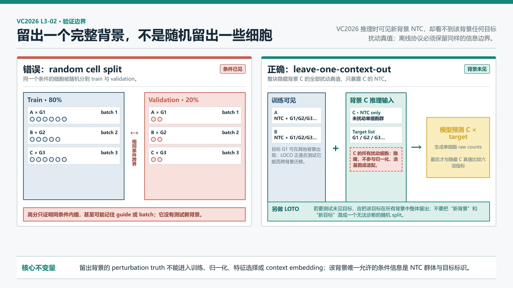
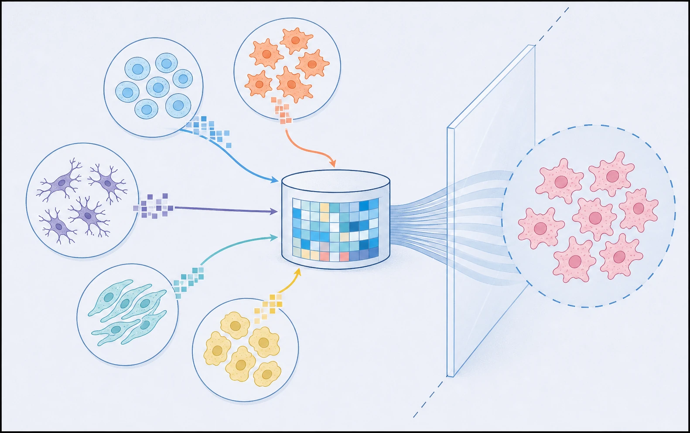

# VC2026 学习指南：公开扰动数据与跨背景验证

> 前置课程：[VC2026 六项评分指标与离线评估](03-评分指标与离线评估.md)  
> 下一课：[VC2026 跨背景统计基线](05-跨背景统计基线.md)

一句话结论：**公开 Perturb-seq 数据不是越多越好。先把每份数据的扰动方式、细胞背景、基因面板、测序化学和批次写进合同，再把一个完整背景的扰动真值全部留出、只给模型该背景的 NTC，才能近似检验 VC2026 真正要求的跨背景零样本能力。**

## 0. 学完本课应该能做什么

学完后，你应该能够：

1. 解释为什么“多个数据集拼在一起随机分细胞”不能评估 VC2026；
2. 判断 VC2025 H1、Replogle K562/RPE1、Nadig HepG2/Jurkat 和 Jiang 六细胞系各自适合承担什么角色；
3. 区分 leave-one-context-out、leave-target-out 和双重留出分别在测什么；
4. 建立一份可审计的数据 manifest，并完成基因、目标、对照、原始计数和批次的对齐；
5. 先用一个最小可行子集跑通跨背景评估，再决定是否引入更多数据。

后文的数据集规模和简述只采用 Arc 官方候选页已经写明的内容；官方短描述没有说明的 CRISPR 形式、测序化学、时间点、批次字段和许可证细节均标为**待核验**。本课设计的是实践合同，不声称这些数据已经下载、清洗或运行完毕。

## 1. 先理解 VC2026 究竟要“泛化”什么

**Out-of-distribution（OOD，分布外）泛化**指模型在训练分布没有完整覆盖的新条件上仍能工作。VC2026 的新条件不是一个随机新细胞，而是一个新的匿名细胞背景：模型看得到该背景的 NTC 群体，却看不到该背景任何目标扰动后的表达。[S1]

直觉上，模型要完成两步迁移：

```text
其他背景里学到：某个目标通常会推动哪些表达程序
                        +
新背景 NTC 告诉它：这里原本有哪些程序、处于什么状态
                        |
                        v
预测：该目标在新背景里会产生怎样的特异响应
```

**细胞背景（cellular context）**在这里至少包含细胞系遗传背景、基础表达状态、细胞状态组成和实验环境。它不是一个可随意打散的标签。同一背景、同一目标的细胞共享 guide、培养、处理和测序过程；随机把这些细胞分到训练与验证，模型只需认出已经见过的条件，不需要推断新背景。



*图 1｜错误与正确的验证边界。左侧随机 cell split 把同一背景、同一目标甚至同一批次的同条件观测细胞放到两侧，验证集并未离开训练条件；右侧 leave-one-context-out 将一个背景的全部扰动细胞锁在验证侧，模型只可读取该背景 NTC。目标在其他背景中出现并不构成该协议的泄漏，因为它正是在测跨背景迁移；若要测未见目标，应另做 leave-target-out。*

软件类比上，随机 cell split 像把同一请求的重试日志分到 train/test；整背景留出更像把一个从未部署过的新客户环境作为测试。类比的边界是：细胞不是重复日志，单细胞间确有生物差异；问题在于这些差异不足以代表新的实验条件。

## 2. 先把两个“化学”概念分开

中文讨论里“化学平台”容易混淆两个完全不同的问题。

### 2.1 扰动方式：遗传扰动与化学扰动

**CRISPR interference（CRISPRi，CRISPR 干扰）**用 guide 把 dCas9-KRAB 等转录抑制执行器带到目标基因附近，降低其转录。标签 `ADNP` 表示实验意图是压低 ADNP，虽然实际效率和下游效应仍会变化。

**Chemical perturbation（化学扰动）**给细胞加入某种化合物。药物可能同时结合多个蛋白，效应依赖剂量、时间和代谢状态；不能把一个药物简单等同为“敲低一个基因”。Arc 官方页列出的 Tahoe-100M 和 sci-Plex 很有价值，但它们主要是药物/化合物扰动，不应在第一版中被当成与 CRISPRi 同标签空间的监督数据。[S1]

### 2.2 测量方式：单细胞测序化学

**Assay chemistry（测定化学/测序化学）**描述 RNA 怎样被捕获、加条形码并形成计数。VC2026 使用 10x Flex；官方明确说 VC2025 H1 使用与 2026 相同的 10x Flex。[S1] 即使两个数据集都做 CRISPRi，若一个用 Flex 探针对、另一个用不同的 3' 捕获流程，基因覆盖、零比例和 UMI 深度也可能系统不同。

所以“扰动相同”不等于“观测分布相同”。模型需要区分：

```text
生物信号：细胞背景 × 目标基因造成的真实响应
技术信号：guide设计、处理批次、测序化学、深度和预处理造成的变化
```

若训练集里“K562 永远来自平台 X，H1 永远来自平台 Y”，细胞系与平台完全绑定，模型无法仅靠数据自动判断差异来自哪一边。这叫 **confounding（混杂）**：两个因素总是一起变化，因而难以分离其作用。

## 3. 四组核心候选数据

Arc 官方数据页把下面数据列为可能有用的公共扰动资源，但“被推荐查看”不等于“已与比赛完全同分布”。[S1]

| 候选 | 官方已确认 | 对 VC2026 的价值 | 当前必须保留的未知 |
|---|---|---|---|
| VC2025 H1 hESC | H1 人胚胎干细胞；CRISPRi；深细胞覆盖、深测序、高敲低效率；10x Flex；含训练、验证和保留测试数据 | 与 2026 扰动形式和测序化学最接近；适合先跑合同、六指标和未见目标实验 | 公开文件版本、各 split 可用真值、批次/guide 字段与许可条款需随实际下载记录 |
| Replogle 2022 K562/RPE1 | K562 与 RPE1；CRISPRi；全基因组规模；超过 250 万细胞；K562 与 Arc VCC 目标大范围重合 | 提供两个背景和广目标覆盖，是首个 LOCO 候选；也能测试同一目标跨背景迁移 | 官方短页未注明测序化学、时间点、批次键和具体可用 raw 层；下载链接含不同处理版本，不能凭文件名猜 |
| Nadig 2025 HepG2/Jurkat | HepG2、Jurkat；针对 DepMap common essential genes（常见必需基因）的单细胞 CRISPR 筛选 | 增加肝癌与 T 细胞相关背景；目标面板有明确生物选择逻辑 | 官方短页只写“CRISPR 筛选”，未明确到 CRISPRi/CRISPR knockout；测序化学、guide 结构、批次与面板明细待核验 |
| Jiang 2025 六细胞系 | A549、MCF7、HT29、HAP1、BxPC3、K562 六个不同组织来源癌细胞系上的 Perturb-seq | 背景数多，适合检验 context 多样性和 K562 跨研究复现 | 官方短页未写具体 CRISPR 模式、目标面板、测序化学、时间点与 batch schema，使用前须回到数据说明核对 |

术语补充：

- **H1 hESC（H1 human embryonic stem cell，人胚胎干细胞系）**来自早期胚胎干细胞建立的可培养细胞系，基础状态与癌细胞系很不同；
- **K562、RPE1、HepG2、Jurkat**等是不同来源和遗传背景的实验室细胞系。细胞系不是原组织本身，也不等同于一种纯粹细胞类型；长期培养会形成自己的稳定与异常特征；
- **common essential gene（常见必需基因）**是在许多细胞系中维持生存或增殖所必需的基因。压低它们常产生强响应，但这种面板会偏向基础生命过程，不代表随机基因的完整分布。

### 3.1 候选优先级不是按细胞数排序

适配优先级应按下面顺序判断：

1. **扰动语义**：是否确为单基因 CRISPRi，而不是 knockout、CRISPRa 或药物；
2. **可用真值**：是否能得到逐细胞原始计数、目标标签和匹配 NTC；
3. **背景数量**：能否整背景留出，而不是只有一个背景；
4. **目标交集**：同一目标是否在多个背景实测，足以评价效应迁移；
5. **测序化学**：与 Flex 的差距是否可记录、建模并做消融；
6. **批次可识别性**：是否有 run、replicate、guide、时间点等字段，能防止泄漏；
7. **许可与版本**：是否允许当前用途，并能固定下载版本与校验和。

千万不要先下载几十 GB 再问这些问题。manifest 的元数据闸门若不能通过，该数据先进入 `candidate`，而不是直接进入训练集。



*图 2｜公开数据与整背景留出的概念插画。左侧不同形态和颜色只表示来源不同的数据背景；右侧整体留出的群体表示“验证时只暴露该背景 NTC，隐藏其扰动真值”。它不表示真实细胞系形态、组织身份、批次距离或具体数据规模。本图使用 GPT Image 参考项目科学信息图风格生成，并经人工核对。*

## 4. 可比性：相同与不同都要显式建模

### 4.1 扰动形式

CRISPRi 是首选直接监督。CRISPR knockout（基因敲除）通常通过 DNA 切割破坏基因，残余 RNA、蛋白消耗时间和细胞应答可能与转录抑制不同；CRISPRa（CRISPR 激活）方向相反；药物则可能多靶点。把它们合并成同一个 `target_gene` 标签，会让模型把不同干预机制平均掉。

工程上可保留这些数据做预训练或辅助任务，但 manifest 必须有 `perturbation_modality`，模型输入也要能区分 modality；第一版跨背景基线只纳入已经核实的 CRISPRi。

### 4.2 基因面板

**Gene panel（基因面板）**有两个容易混淆的含义：一是实验扰动了哪些目标，二是表达矩阵测了哪些基因。两者要分开保存为 `target_panel` 与 `feature_panel`。

- Replogle 的全基因组扰动覆盖面大，适合寻找多个背景共有目标；
- Nadig 的 common-essential 面板可能响应强，但对弱效应目标代表性有限；
- VC2025 H1 的扰动面板比全基因组筛选窄，却与比赛化学更接近；
- 不同表达 feature panel 会改变细胞总计数和归一化分母，不能简单补零后假装完全可比。

最稳妥的首轮评估使用“已核实、在训练和留出背景均有真值的共同目标”，同时报告目标数量和选择规则。后续再做不要求目标交集的 leave-target-out 或目标嵌入模型。

### 4.3 测序化学与深度

同一 RNA 状态经过不同 assay 可能得到不同计数分布。需要至少记录：平台/试剂版本、feature panel、每细胞 UMI、检测基因数、是否固定、原始读取到矩阵的处理版本。不要先对所有数据做强行 batch correction（批次校正）再拆分，因为校正模型若看过验证扰动真值，也会泄漏。

适合的做法是：

- 训练 split 内拟合归一化、基因筛选和任何批次参数；
- 对留出背景只允许用其 NTC 拟合背景适配参数；
- 原始计数始终保留，模型内部变换与最终计数生成分开；
- 按 assay 分层报告成绩，确认提升不是只来自最相近平台。

### 4.4 批次与 guide

**Batch effect（批次效应）**是与研究问题无关、却按实验批次成组出现的系统差异。guide 效率则是同一目标不同 guide 抑制强度不同。若数据提供这些字段，应保留：

```text
dataset -> study batch -> sequencing run -> replicate
        -> cell context -> target gene -> guide -> cell
```

随机按 cell 拆分会让同一个 `context × target × guide × batch` 同时出现在训练和验证。模型即使只记住批次均值也能高分。对没有 batch 字段的数据，不能默认“只有一个批次”；应记为 `unknown`，并降低证据等级。

## 5. 基因与目标怎样对齐

先把表里会出现的对象讲清楚：**genome build（参考基因组版本）**规定人类 DNA 序列和坐标使用哪一版；**annotation（基因注释）**再说明哪些坐标属于哪个基因并分配 ID；**transcript（转录本）**是同一基因可能产生的不同 RNA 版本；**probe（探针）**是实验中用于识别特定 RNA 序列的分子片段。版本不同会让 ID、坐标或可检测转录本不同，所以不能只凭显示名称合并列。

### 5.1 输入、操作、输出、原因

| 步骤 | 输入 | 操作 | 输出 | 为什么需要 |
|---|---|---|---|---|
| 物种与版本检查 | 数据说明、基因注释版本 | 只保留人类数据；记录 genome build/annotation | 可比较的数据集清单 | 同名基因在物种和版本间不一定等价 |
| ID 规范化 | Ensembl ID、gene symbol、旧名 | 用固定版本映射表解析；去掉 Ensembl version suffix 时保留原值 | `canonical_gene_id` + 原始 ID | 避免同一基因被当成两个特征 |
| 重复处理 | 多个 probe/transcript 映射同一基因 | 对 raw counts 按 canonical ID 求和；记录合并数量 | 唯一基因轴 | 直接保留重复列会重复计权 |
| feature 对齐 | 各数据表达列 | 计算交集、覆盖率与缺失；按固定顺序重排 | 训练轴与 VC2026 输出映射 | 防止列错位和虚假零值 |
| target 对齐 | guide/target 注释 | 单独解析目标 ID；保留 NTC 与失败 guide | canonical target 表 | 目标标签与表达 feature 是两套合同 |
| 面板冻结 | 清洗后的目标集合 | 对实验版本求 hash 并保存列表 | 可复现 target panel | PDS 排名会随面板变化 |

### 5.2 交集与并集的取舍

首个统计基线优先使用 feature 交集，因为每个输入维度在所有背景都有实测含义。代价是丢失数据集特有基因。更复杂模型可在并集上训练并加 missing mask（缺失掩码），但缺失不能填成生物学零表达；“没有测到这个基因”和“测了但计数为零”不是一回事。

最终 VC2026 输出仍必须回到官方 18,533 基因及固定顺序。离线公共数据只有共同子集时，六指标只是该子集上的研发指标，不能宣称与排行榜绝对可比。

## 6. 三种验证问题不能混在一起

### 6.1 Leave-one-context-out：留出整个背景

**Leave-one-context-out（LOCO，逐背景留出）**的每折规则是：

```text
训练可见：其他背景的 NTC + 扰动细胞
验证输入：留出背景的 NTC + 待预测目标
验证隐藏：留出背景的全部目标扰动细胞
```

目标 $g$ 可以在其他背景出现。这不是泄漏，而是该协议刻意测试的问题：已知 $g$ 在别处的效应，能否迁移到新背景？它最接近 VC2026 允许使用公共扰动数据、但 A–F 只给 NTC 的设置。[S1]

### 6.2 Leave-target-out：留出整个目标

**Leave-target-out（LOTO，逐目标留出）**把某组目标在所有背景的扰动细胞都移出训练，但背景仍可通过其他目标被模型见到。它回答：模型能否根据基因表示、网络或相似目标外推到未见基因？

这与 LOCO 正交：

| 协议 | 新背景？ | 新目标？ | 主要能力 |
|---|---:|---:|---|
| 随机 cell split | 否 | 否 | 同条件内插，通常过于乐观 |
| LOCO | 是 | 不一定 | 跨背景迁移 |
| LOTO | 否 | 是 | 跨目标迁移 |
| context × target 双留出 | 是 | 是 | 组合 OOD，最难 |

### 6.3 双重留出与 VC2026 的关系

VC2026 对新背景是严格零样本；某个目标是否在公共数据其他背景出现则因目标而异。因此主成绩应是 LOCO，并按“目标在训练背景中见过/没见过”再分层报告。双重留出是压力测试，不应取代主协议，否则会把背景迁移和基因知识外推混成一个无法诊断的数字。

## 7. 泄漏通常发生在哪里

1. **随机 cell split**：同一 `context × target × guide × batch` 穿过边界。
2. **先全数据选高变基因或 DE 基因**：验证扰动真值参与了 feature selection。
3. **先全数据做批次校正**：验证扰动表达参与了映射或邻居图。
4. **用留出背景扰动细胞计算 context embedding**：VC2026 推理时只有 NTC；context encoder 也只能读 NTC。
5. **按行拆 pseudobulk**：同一组细胞聚合结果的副本跨越两侧。
6. **公开模型预训练已见验证数据却未记录**：这不一定违反比赛规则，但会改变“零样本”结论；必须标为 external exposure。
7. **超参数反复看同一 LOCO 折**：验证背景逐渐变成训练信号；应保留最终 untouched contexts 或做嵌套选择。

一个强制不变量是：

```python
assert set(train.context).isdisjoint(set(test_perturbed.context))
assert set(test_context_perturbed_cells) == set(hidden_truth_cells)
assert context_encoder_inputs[test_context].source.eq("ntc_only").all()
```

真实代码应检查 context ID、cell ID、原始文件 checksum 和上游 sample/batch ID，而不只检查 DataFrame 当前列名。

## 8. 数据 manifest：先写合同，再写 loader

每个下载版本一条记录，建议至少包含：

```yaml
dataset_id: replogle_2022_k562_example
status: candidate               # candidate | accepted | excluded
source_url: "..."
source_version: "待核验"
retrieved_at: "待执行"
license: "待核验"
checksums: {}
organism: Homo sapiens
context:
  cell_line: K562
  tissue_origin: "待核验"
perturbation:
  modality: CRISPRi
  effector: "待核验"
  target_id_namespace: "待核验"
  guide_column: "待核验"
  control_labels: []
  timepoint: "待核验"
assay:
  chemistry: "待核验"
  feature_panel: "待核验"
matrix:
  layer: "待核验"
  is_raw_counts: "待核验"
  gene_id_namespace: "待核验"
batch_columns: []
split_policy: leave_one_context_out
external_exposure: []
notes: "官方页确认 CRISPRi、K562/RPE1、全基因组规模；其余不猜测"
```

`待核验` 不是文档缺陷，而是阻止默认值悄悄变成事实。只有下面检查全部通过，状态才从 `candidate` 改为 `accepted`：

- 来源、版本、许可和 checksum 完整；
- `.X`/layer 的 raw count 语义有数据说明或数值审计支持；
- target、NTC、context、guide、batch 字段能够解释；
- canonical gene 映射无未处理重复；
- 目标与 feature 覆盖率已量化；
- LOCO split 在 cell、guide、batch 和上游文件层面无交叉。

## 9. 完整数据流程：每一步解决什么问题

### 9.1 获取与冻结

**输入**：官方链接和数据版本。  
**操作**：下载到 Git 忽略目录，记录 URL、时间、许可文本版本、大小和 SHA-256；不把数十 GB 原始文件提交 Git。  
**输出**：只读原始文件与 manifest。  
**为何需要**：同一链接未来可能替换文件；没有 checksum 就无法复现实验。

### 9.2 结构审计

**输入**：原始 H5AD/矩阵与元数据。  
**操作**：检查形状、稀疏性、整数性、每细胞总 UMI、基因 ID、target/NTC、context、guide 和 batch；先只读小切片，不立刻全量加载。  
**输出**：数据合同报告和阻断项。  
**为何需要**：文件名里的 `raw` 或 `processed` 不能替代层级语义核验。

### 9.3 规范化 schema

**输入**：每项研究不同的字段。  
**操作**：映射为统一列 `dataset_id, context_id, target_gene, control_type, guide_id, batch_id, cell_id`，保留所有原始列。  
**输出**：统一 `.obs` 与映射表。  
**为何需要**：训练代码应依赖明确合同，不应在模型中散落研究特例。

### 9.4 基因对齐

**输入**：各自 feature axis。  
**操作**：按第 5 节规范 ID、解决重复、冻结共同轴；另存 VC2026 18,533 列输出映射。  
**输出**：对齐矩阵与 coverage report。  
**为何需要**：避免列错位、假零和归一化分母漂移。

### 9.5 质控但不越界

**输入**：对齐 raw counts。  
**操作**：在训练 split 内决定 cell/guide 质控阈值；对验证侧只应用冻结规则。按背景和批次报告细胞数、UMI、非零基因、目标表达与 NTC 差异。  
**输出**：保留/排除清单。  
**为何需要**：若用验证真值选择阈值，评估会乐观。

### 9.6 生成 split

**输入**：已冻结的 context、target、guide、batch。  
**操作**：每折整块留出 context 的所有 perturbation；仅暴露该 context 的 NTC。再生成 LOTO 与双留出压力测试。  
**输出**：不可变 `splits.parquet` 和 hash。  
**为何需要**：让所有模型在同一问题上比较，避免实验中途移动门柱。

### 9.7 训练、生成与评分

**输入**：训练背景扰动、留出背景 NTC、目标列表。  
**操作**：模型生成每个 `context × target` 的 400 个 raw-count 细胞；用上一课六项 raw 指标评分，并在每个公共数据折上自建相同原则的 0/1 anchor。  
**输出**：逐背景、逐目标、逐 assay 的成绩单。  
**为何需要**：总平均只能告诉我们“总体怎样”，分层结果才能区分背景失败、目标失败和平台失配。

## 10. 最小可行子集：先证明评估闭环成立

### 10.1 MVP-1

建议第一版只使用：

- VC2025 H1：一个与比赛同为 CRISPRi + 10x Flex 的背景；
- Replogle K562 与 RPE1：两个官方确认的 CRISPRi 背景；
- 三者中**实际核验后**共有、且每个背景有足够细胞与匹配 NTC 的目标交集；
- 三者共同且映射无歧义的表达基因轴。

选择理由不是它们一定最强，而是三种背景已经足以轮流做 LOCO，H1 又能锚定最接近比赛的 assay。Replogle 的测序化学是否不同，以及核实后发现的任何差异，都必须作为显式 domain 标签和不确定性，不能悄悄抹平。

建议把“至少 30 个共同目标、每目标至少 100 个合格细胞”作为**启动阈值假设**，运行 manifest 审计后再决定；这两个数字不是官方要求，也不是论文结论。如果交集不足，不应降低到随机 cell split，而应改成稀疏 `context × target` 矩阵协议，并只在有真值的组合上评分。

### 10.2 MVP-2 与扩展

MVP-1 跑通后，再依次加入：

1. Nadig HepG2/Jurkat，但先核实具体 CRISPR modality 和 raw layer；
2. Jiang 六细胞系，用于增加背景多样性和跨研究 K562 对照；
3. 化学扰动数据只进入独立辅助实验，除非模型显式建模 modality，绝不直接混成 `target_gene` 监督。

每加一项数据，必须运行三组消融：旧数据、旧数据 + 新数据、只用新数据。若总分上升却最接近 Flex 的 H1 留出折下降，应考虑平台负迁移，而不是只报平均提升。

### 10.3 MVP 验收标准

- 三个背景都能轮流作为完全留出的 perturbation truth；
- 验证背景 context encoder 只读取 NTC；
- `splits.parquet` 在 cell/guide/batch/source file 层面没有交叉；
- 至少运行 NTC/no-effect、官方口径的 mean-response、跨背景 target-delta 三个基线；前两者不同：前者给所有目标 NTC 零效应，后者给所有目标同一个跨扰动平均响应；
- 保存六项 raw 与自建 scaled，并按背景/目标/assay 分层；
- 随机 cell split 只作为“乐观上界/泄漏演示”，不得作为模型选择主分数；
- 未核实字段仍留在 manifest 中，不用经验常识补成事实。

## 11. 噪声、失败与模型影响

| 观察 | 可能原因 | 对模型/实验的影响 |
|---|---|---|
| 随机 split 很高、LOCO 很低 | 记住 context-target 或 batch；缺少背景迁移能力 | 先修 split 和背景条件化，不急着扩大模型 |
| H1 好、其他背景差 | Flex/深度特化，或 H1 生物状态特化 | assay-stratified 训练；增加跨平台校准消融 |
| K562 在两项研究间也互相迁移差 | 批次、guide、处理或测序差异强 | “同名细胞系”也不能当同 context；先做跨研究复现诊断 |
| common-essential targets 好、宽面板差 | 训练面板偏向强效应和基础过程 | 按效应强度分层，避免把面板偏差当泛化 |
| PDS 尚可、MSE/NMAE 差 | 方向可迁移，幅度随背景/平台失配 | 分离共享方向与 context-specific scale |
| bulk 指标好、DE 指标差 | 单细胞方差、零比例或细胞状态混合错误 | 改计数生成与异质性，不只拟合伪批量 |

最重要的因果边界是：公共数据能显示某种方法在这些已知背景间迁移，但不能证明它会在匿名 D/E/F 上同样成功。LOCO 是更接近比赛的证据，不是最终背景的替代实验。

## 12. 可复现实践：本课应交付什么

建立一个实验目录，但暂不把大数据纳入 Git：

```text
data/perturb-public/              # Git ignored
  raw/
  harmonized/
experiments/cross-context-v1/
  datasets.yaml                   # 可提交，不含密钥和机器路径
  gene-map.tsv
  target-panel.txt
  splits.parquet
  audit.md
  scores.csv
  run-config.yaml
```

执行顺序：

1. 只为四组候选填写 manifest，不下载全量矩阵；未知项保持待核验；
2. 先下载每项最小元数据或小文件，确认 schema、许可和 raw layer；
3. 通过闸门后下载 H1、K562、RPE1 所需子集，记录 checksum 与体积；
4. 生成 canonical gene map、共同目标清单和 LOCO split；
5. 用上一课的六项指标运行三个朴素基线；
6. 画每背景雷达图或六列成绩表，同时报告目标数和有效 DE cohort；
7. 写 `audit.md`：已验证事实、工程选择、失败记录、仍未知字段和下一次只改变的一个因素。

本课完成的标志不是“把所有公开数据塞进模型”，而是任何新模型都能在固定 LOCO 协议下得到可解释、可重复、无明显泄漏的六指标成绩单。

## 13. 一道诊断题

你把 H1、K562 和 RPE1 合并后随机按细胞做 80/20 划分，模型六项指标都很好；改成留出整个 RPE1 后，分数接近 NTC/no-effect baseline。队友建议先把模型参数扩大十倍。

在扩大模型之前，你最应该核查和建立哪一个证据？为什么？

## 14. 答案

先核查两种 split 的条件交叉，并建立固定 LOCO 基线证据：证明随机 split 中同一 `context × target × guide × batch/source file` 是否跨越 train/test，同时确认 RPE1 验证时模型只读取 RPE1 NTC、没有读取任何 RPE1 perturbation 表达。

随机 split 高只能说明模型会在已经见过的条件内插，甚至可能记住批次；LOCO 接近 baseline 才暴露出它没有可靠跨背景迁移。此时扩大参数很可能只是更强地拟合已有背景。下一步应先比较三个简单模型：RPE1 NTC 零效应、训练背景平均响应、同目标跨背景 delta 迁移。若复杂模型连这些基线都没有超过，优先修数据、对齐和背景条件化；若超过后仍有明确容量瓶颈，再谈扩大模型。

## 15. 来源与陈述边界

### 15.1 来源

- [S1] Arc Institute，[About the Data](../Official-website/About-the-Data.md)。用于 VC2026 零样本任务、2025 H1、Replogle、Nadig、Jiang、Tahoe-100M 与 sci-Plex 的官方候选描述。
- [S2] Arc Institute，[VC2026 FAQ](../Official-website/FAQs.md)。用于六个匿名背景、原始计数、相同处理原则和验证/最终轮不可直接比较。
- [P1] Roohani et al., *Virtual Cell Challenge: Toward a Turing Test for the Virtual Cell*, Cell (2025)，见[项目索引](../references/INDEX.md#virtual-cell-challenge-toward-a-turing-test-for-the-virtual-cell)。用于挑战的跨情境预测定位；具体数据合同仍以官方页面为准。
- [P2] Adduri et al., *STATE: Predicting Cellular Responses to Perturbation across Diverse Contexts*, bioRxiv (2025)，见[项目索引](../references/INDEX.md#state-predicting-cellular-responses-to-perturbation-across-diverse-contexts)。仅用于说明跨 context 状态转移是已被研究的建模问题；本课没有引用其 benchmark 数值，也未据此证明某种 split 最优。

### 15.2 陈述边界

- **官方事实**：四组候选的细胞系、官方短描述中明确的规模/面板/CRISPRi/10x Flex 信息，均来自 Arc 数据页。
- **待核验事实**：表中明确标记的具体 CRISPR 形式、assay chemistry、raw layer、guide、批次、时间点和许可，不能因领域常识或文件名而补齐。
- **工程假设**：LOCO 主协议、MVP 顺序、共同目标启动阈值和三阶段扩展是为 VC2026 设计的可证伪工程方案，不是官方规则或论文结论。
- **尚未完成**：本课没有下载这些大型数据、没有计算真实目标交集、没有生成 manifest/checksum，也没有跑出 LOCO 六指标。实际执行后必须记录失败和缺口，不能把本课候选表改写成“已完成数据集”。
