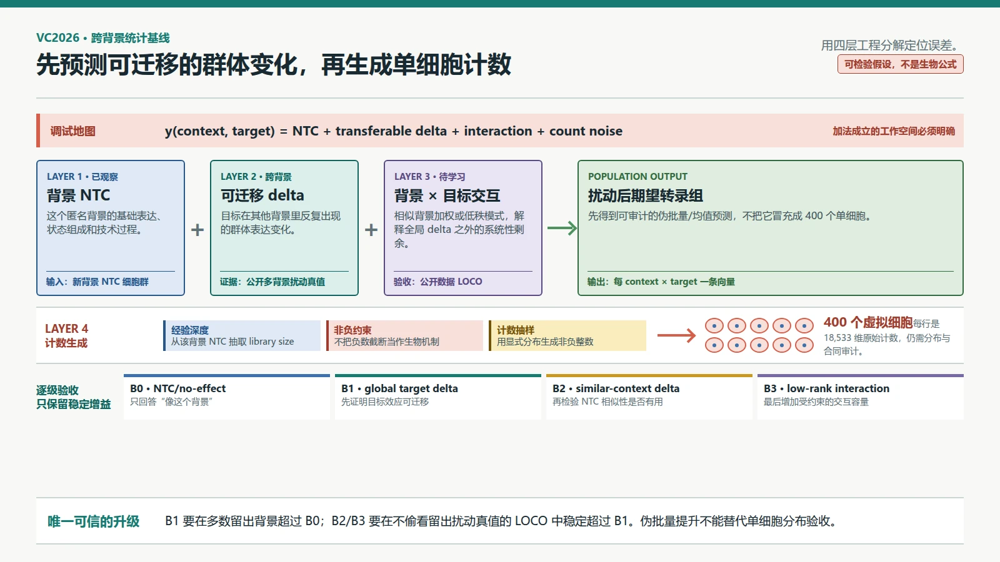
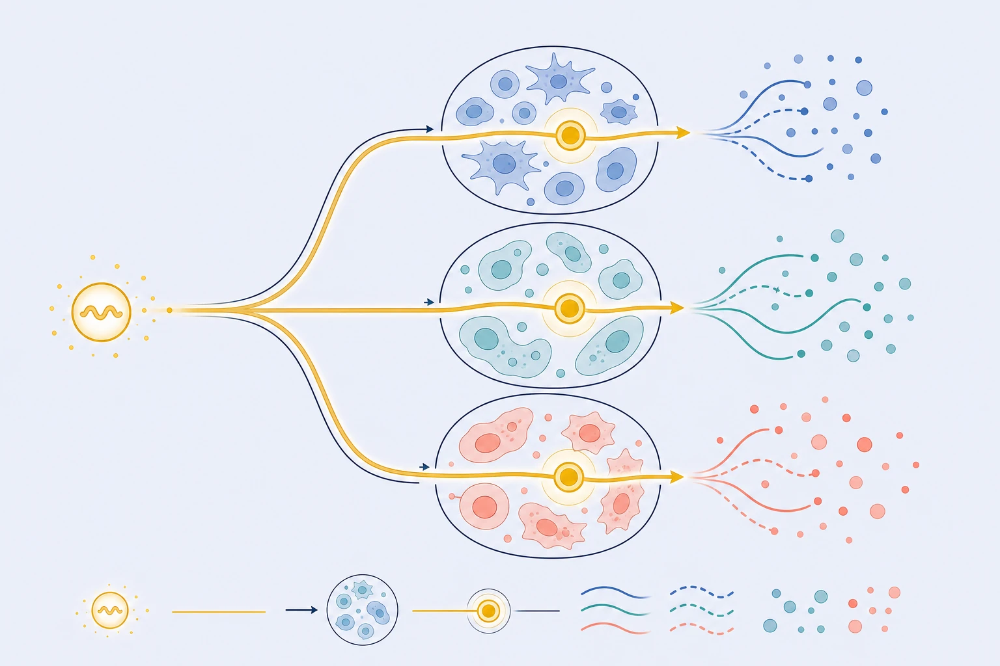

# VC2026 学习指南：跨背景统计基线

> 编写日期：2026-08-30
>
> 前置学习：[VC2026 公开扰动数据与跨背景验证](04-公开扰动数据与跨背景验证.md)  
> 下一课：[VC2026 用 NTC 表示背景，用生物信息表示目标](06-背景与目标表示.md)
>
> 本课目标：在进入深度模型前，把“其他背景中观测到的扰动效应，怎样迁移到新背景”拆成一组可复现、可反驳的统计基线。

## 0. 学完本课能做什么

学完后，你应该能够：

1. 解释下面的四项分解为什么是**工程假设**，而不是细胞真实运作的生物公式；
2. 区分 `NTC/no-effect`、跨背景全局 `target delta`、相似背景加权 `delta` 和低秩 `context × target × gene` 四级基线；
3. 从公开多背景 Perturb-seq 数据计算扰动伪批量，并正确理解它丢失了哪些单细胞信息；
4. 设计 **leave-one-context-out（LOCO，整个细胞背景留出）**验证，不用随机拆细胞制造虚假泛化；
5. 对目标基因自身敲低、非负原始计数和测序深度做显式处理；
6. 用一张基线成绩单回答：改进来自“目标效应可迁移”，还是只来自更贴近留出背景的平均表达。

## 1. 先把问题拆开：一个可检验的工程分解

先不写公式。把一次预测想成一张四层“调试地图”：

| 层 | 直觉 | 在数据中怎样看 |
|---|---|---|
| `NTC(context)` | 这个背景原本处于什么状态 | 该背景一群 NTC 细胞的表达分布 |
| `transferable delta(target)` | 某目标在多个背景中重复出现的变化 | 其他背景中“目标扰动伪批量 − 对照伪批量”的共同部分 |
| `interaction(context,target)` | 同一目标在这个背景中特别强、特别弱或改变方向的部分 | 某背景下的 `delta` 减去该目标全局 `delta` 后的剩余结构 |
| `count noise` | 从 RNA 分子到最终 UMI 计数的抽样与测量波动 | 同一条件下单细胞总 UMI、零值和基因计数的分散 |

**这不是细胞真实运作方式。**真实的调控网络有非线性、阈值、反馈、时间延迟和细胞状态转换。四层地图只是让我们能够逐层问：“不预测扰动时有多好？”“加上跨背景共性后提升多少？”“再加背景交互是否真的有用？”

现在再把四层压成一行记号：

$$
y(\text{context},\text{target})
= \operatorname{NTC}(\text{context})
+ \Delta_{\text{transfer}}(\text{target})
+ \Gamma(\text{context},\text{target})
+ \varepsilon_{\text{count}}.
$$

这个加法也不能不加说明地直接用在原始计数上。原始 UMI 计数受每个细胞测序深度影响，而且不能小于零。实践中，通常先在固定的归一化空间，例如 `log1p(CPM)` 中学 `delta`，然后再单独转回原始计数分布。这个转换不会自动保真，所以必须另行验收。



*图 1｜跨背景统计基线的分层地图。前三层估计背景均值和扰动效应，最后一层才生成非负整数计数。箭头表示工程数据流，不表示已证实的分子通路；整个加法分解是可验证的建模假设，不是生物学定律。本图使用 HTML/CSS 确定性绘制。*



*图 2｜跨背景迁移的直觉插画。金色主线象征待检验的可迁移部分，三条不同颜色的输出只表示背景可能改变响应；它不是分子通路、真实细胞形态、效应方向或 B0–B3 的实验结果。本图使用 GPT Image 参考项目科学信息图风格生成，并经人工核对。*

## 2. 为什么这四层在生物上说得通

### 2.1 NTC 告诉我们“系统现在在哪”

**NTC（non-targeting control，非靶向对照）**是携带完整 CRISPRi 实验流程、但 guide 不被设计去命中人类目标基因的细胞。它不是“什么都没发生”，而是尽量保留 guide 导入、培养、固定、检测和测序等共同流程，用来估计没有特定目标敲低时的群体分布。

同一目标的效应不能脱离这个起点解释。如果目标 RNA 在背景 A 的 NTC 中几乎检测不到，对它强制减去很大数值没有物理意义；如果它在背景 B 中高表达并参与当前活跃的调控程序，就可能有更大的下游响应。这只是机制示例，不是对比赛匿名 A/B 身份或效应的事实断言。

### 2.2 “可迁移 delta”是重复出现的群体差异

**Perturbation delta（扰动差值）**是扰动组与匹配对照组在某个预定表达空间中的差。例如，对背景 $c$、目标 $t$、基因 $g$：

$$
\Delta_{c,t,g}
= \overline{x}^{\,\text{pert}}_{c,t,g}
- \overline{x}^{\,\text{NTC}}_{c,g}.
$$

如果目标基因自身在许多背景中都下降，某些下游基因也反复同方向变化，这些重复部分就是可迁移的候选。但“在已见背景中平均一致”不等于“在任何背景中必然一致”。它是需要在留出背景上检验的统计规律。

### 2.3 交互项表示“这个背景改变了效应”

**Interaction（交互）**的含义不是背景向量与目标向量在生物上真的做了乘法，而是：仅知道背景的平均状态和目标的全局平均效应，仍然无法解释的系统性剩余。它可能来自：

- 目标基因在该背景的基础表达不同；
- 与目标相互作用的蛋白或通路是否活跃；
- 细胞周期、应激或分化状态组成不同；
- guide 效率、实验时间和测量平台差异。

最后一项是技术差异，不是生物调控。如果数据集与细胞背景完全绑定，模型可能把“哪个实验室做的”当成“这种细胞如何响应”。所以交互项越灵活，越需要严格的跨数据集 LOCO 验证。

### 2.4 不存在“这个细胞扰动前”的真值行

scRNA-seq 检测会消耗被测细胞。因此，一行 NTC 细胞和一行扰动细胞不是同一个细胞在前后两个时刻的照片。它们是来自两个群体的独立样本。

所以，不能将两组细胞按行号、最近邻或随机顺序一一相减，再把得到的“单细胞 delta”当成真实个体反应。除非额外实验提供系谱、时序或分子追踪信息，否则可直接估计的是**群体分布之差**，不是个体配对因果效应。

## 3. 四级基线：每加一层，都要证明值得

### 3.1 B0：`NTC/no-effect`，只回答“像这个背景”

**NTC/no-effect baseline（NTC 零效应基线）**忽略目标，对该背景的所有目标都返回 NTC 群体均值或 NTC 模板细胞。它不同于官方 scaled=0 使用的 **mean-response baseline（平均扰动响应基线）**：后者会从真实扰动面板计算一个跨目标平均响应，而 B0 完全不加入扰动效应。

$$
\widehat{\mu}^{B0}_{c,t,g}=\mu^{\mathrm{NTC}}_{c,g}.
$$

- **输入**：留出背景的 NTC 细胞。
- **操作**：按基因求群体均值，或固定种子抽取 400 个 NTC 模板。
- **输出**：不随目标改变的预测。
- **为何需要**：它是最低验收线。如果复杂模型不能稳定超过它，就还没有证据说模型学会了扰动。

`null` 不是“随便猜”。它保留了留出背景的基础表达、状态混合和计数分布，只是故意预测零扰动效应。

### 3.2 B1：跨背景全局 `target delta`

假设目标 $t$ 在多个公开背景中有扰动真值。先在每个捐献背景 $d$ 内部计算 $\Delta_{d,t}$，再跨背景取稳健均值：

$$
\overline{\Delta}_{t,g}
= \operatorname{median}_{d\in \mathcal D_t}\Delta_{d,t,g},
\qquad
\widehat{\mu}^{B1}_{c,t,g}
=\mu^{\mathrm{NTC}}_{c,g}+\overline{\Delta}_{t,g}.
$$

中位数不是唯一选择；也可用按细胞数或估计方差加权的均值。但不能让一个细胞数极多、协议特殊的数据集在没有审计时支配结果。

- **输入**：多个已知背景的 NTC 和目标 $t$ 扰动细胞。
- **操作**：背景内做差，再跨背景聚合；绝不先把所有细胞混在一起求差。
- **输出**：每个目标一条全基因 `delta` 向量。
- **为何需要**：它直接检验“目标效应有多少能跨背景复用”，而不先引入高容量模型。

如果目标在所有训练背景都没出现，B1 就没有该目标的干预证据。合理回退是 B0，而不是把名字相似的基因当成已知目标。用蛋白、通路或网络表示外推到全局未见目标，属于下一课的表示学习问题。

### 3.3 B2：相似背景加权 `delta`

全局中位数把所有捐献背景当得一样重要。B2 先仅用 NTC 比较留出背景 $c$ 与每个捐献背景 $d$ 的基础状态，再让更相似的背景贡献更大权重：

$$
w_{c,d}=\frac{\exp(s(z_c,z_d)/\tau)}
{\sum_{d'}\exp(s(z_c,z_{d'})/\tau)},
\qquad
\widehat{\Delta}^{B2}_{c,t}
=\sum_{d\in\mathcal D_t}w_{c,d}\Delta_{d,t}.
$$

$z_c$ 是由 NTC 得到的背景摘要，$s$ 可以是余弦相似度，$\tau$ 是控制权重集中程度的温度。第一版可以用高变基因的 NTC `log1p(CPM)` 伪批量作为 $z$，并用内层验证选择基因集、距离和 $\tau$。

这里有一条必须反复提醒的边界：

> NTC 表达相似只是观察性相似，不保证两个背景对某一干预的因果响应也相似。

因此，“相似背景加权”是一个需要用 LOCO 验证的假设，不是一条生物学定理。VC2025 第三名 `TransPert` 的 Arc 官方摘要中包含按相似性聚合多细胞系扰动效应的做法，这说明它值得作为基线；不证明它在 VC2026 的新背景中必然有效。[S3]

### 3.4 B3：低秩 `context × target × gene` 交互

将所有已见的 $\Delta_{c,t,g}$ 放在一个“背景 × 目标 × 输出基因”三维张量中。**低秩（low rank）**假设这个巨大张量主要由少数几种重复模式组成，例如“增殖变慢”、“应激增强”或“某类转录程序下调”。一个最小的分解是：

$$
\Delta_{c,t,g}
\approx \overline{\Delta}_{t,g}
+\sum_{r=1}^{R}a_{c,r}\,b_{t,r}\,q_{g,r}.
$$

$a_{c,r}$ 表示背景含有多少第 $r$ 种模式，$b_{t,r}$ 表示目标会激活多少，$q_{g,r}$ 则说明该模式对各输出基因的影响。第一版可以用容易审计的线性拟合：先固定背景与目标因子，更新基因模式；再固定另外两组，轮流更新，直到训练误差不再明显下降。具体张量分解算法不是本课重点，不能让术语掩盖低秩假设本身。

低秩的好处是可以在数据稀疏时共享信息；风险是它会把真实但稀有的背景特异响应抚平。$R$ 越大，拟合训练背景越容易，也越容易记住批次。$R$ 和正则强度只能由训练背景内部的嵌套 LOCO 选择，不能看当前留出背景的扰动真值。

还有一个关键限制：如果 $a_c$ 只是每个训练背景的自由 ID 向量，那它不会自动适用新背景。要做 LOCO，必须用 NTC 摘要 $z_c$ 通过一个可外推函数得到 $a_c$。同理，如果 $b_t$ 只是目标 ID，它也不能外推到全局未见目标。

## 4. 两条必须独立处理的输出约束

### 4.1 目标基因自身敲低：是软约束，不是把一列归零

CRISPRi 的直接目标是降低目标基因的转录，所以当目标在 NTC 中可检测时，预测的群体平均通常应该有下降倾向。可将这一列写成有界收缩：

$$
\widehat{\mu}_{c,t,t}
= (1-\kappa_{c,t})\mu^{\mathrm{NTC}}_{c,t},
\qquad 0\leq\kappa_{c,t}\leq 1.
$$

但不能默认 $\kappa=1$，也不能强迫每个预测细胞的目标计数为零：

- CRISPRi 是敲低，不是 DNA 删除；
- guide 效率和作用时间会变化；
- 低表达基因在 NTC 中已有大量零，零计数不能证明强敲低；
- RNA 下降的大小不能直接推出所有下游效应。

实践中应把“自身敲低修正”当作一个独立消融：不加、加固定收缩、根据公开训练数据估计收缩，然后在 LOCO 上比较。

### 4.2 非负与测序深度：负数截断不等于计数生成

VC2026 提交要求原始、有限、非负整数计数，每个细胞总计数不得超过 1,000,000。[S1][S2] 如果在归一化空间中预测得到 $\hat x$，简单做 `round(clip(expm1(x), 0, inf))` 会有三个问题：

1. `expm1` 后的数是深度归一化的相对量，不是已有真实 library size 的 UMI；
2. 将所有负值截成零会系统改变基因均值和总量；
3. 确定性四舍五入会让 400 个细胞过于相同，没有合理的计数分散。

最小可审计方案是：从该背景 NTC 细胞的经验分布抽取 400 个 library size，把预测的非负相对表达归一化成概率，再用多项分布或更合适的过度分散计数模型生成整数。这仍是一个工程生成器，不等于真实分子机制；后续“从伪批量 delta 到单细胞原始计数”课程会专门比较 Poisson、负二项和模板重采样。

## 5. 实际数据流程：每一步的输入、操作、输出和理由

| 步骤 | 输入 | 发生的操作 | 输出 | 为何需要 |
|---|---|---|---|---|
| 1. 建数据清单 | 公开 Perturb-seq 数据及元数据 | 核对物种、细胞背景、CRISPRi/其他扰动、时间、平台、批次、目标和 NTC | 带来源的数据集登记表 | 不同扰动模态不能默认同分布 |
| 2. 统一基因轴 | 各数据集的基因 ID | 映射稳定 ID/符号，记录重复、别名和缺失，取明确交集或带 mask 并集 | 顺序固定的基因矩阵 | 避免把列错位当成扰动效应 |
| 3. 构造群体 | 单细胞计数和 `context/target/batch` | 在同数据集、同背景、同批次内分别聚合 NTC 与扰动组 | 每个组的伪批量和 QC | 批次内做差可减少把数据集差异直接写入 `delta` |
| 4. 选工作空间 | 伪批量原始和 | 保留原始和供审计；另算 CPM 与 `log1p` 供差值建模 | 原始计数版和归一化版 | 不把供建模的小数误交为原始计数 |
| 5. 整背景留出 | 可用的多背景真值 | 每次将一个背景的全部扰动真值隐藏，只向模型提供它的 NTC | LOCO folds | 模拟 VC2026 “新背景只有 NTC”的核心约束 |
| 6. 拟合 B0–B3 | 训练背景与留出 NTC | 仅用内层 fold 选距离、温度、秩和正则 | 留出背景的伪批量预测 | 防止调参窃看留出扰动真值 |
| 7. 独立生成计数 | 预测均值、NTC 深度与分散 | 约束非负，生成每目标 400 个整数细胞 | H5AD 候选 | 均值正确不代表单细胞分布正确 |
| 8. 双重评估 | 预测与留出真值 | 同时评估伪批量扰动、单细胞分布和格式合同 | fold 级成绩单 | 定位失败来自效应、分布还是文件生成 |

### 5.1 什么是伪批量，什么不是

**Pseudobulk（伪批量）**是将同一实验条件下多个单细胞的计数按基因求和或求均值，得到一条群体摘要。

```text
400 个 target=T 细胞 × 18,533 基因
              |
              | 每列求和，保留条件与批次边界
              v
1 条 target=T 伪批量 × 18,533 基因
```

它能提高弱信号的稳定性，却会隐藏子群消失、方差变化、零比例和多峰分布。**伪批量不是一个“平均细胞”，更不是可以复制 400 次就冒充单细胞的真实生成结果。**

## 6. 主要噪声、失败模式与对策

| 失败模式 | 看起来像什么 | 实际可能发生了什么 | 最小对策 |
|---|---|---|---|
| 随机拆细胞 | 验证分数很高 | 同一背景和批次同时进入训练/验证，模型识别了实验指纹 | 整背景 LOCO，必要时整数据集外部验证 |
| 对 NTC/扰动细胞强行配对 | 得到大量“单细胞 delta” | 把两群独立细胞的自然差异写成个体反应 | 在群体/分布层面建模，明确无配对设计 |
| 公开数据混杂 | 某个捐献背景权重最高 | 模型追随测序协议、批次或实验时间 | 批次内做差；记录协议；做 dataset-holdout |
| 目标敲低失败 | 目标下游没效应 | guide 未命中、基础表达低或检测漏失 | 按 guide 审计自身敲低，不把所有标签当同质真值 |
| 低秩过度平滑 | 平均指标尚可，强特异效应消失 | 小秩只保留常见变化模式 | 按效应强度分层报告，检查最大 `delta` 与稀有通路 |
| 深度处理错误 | 表达方向大致对，原始计数指标差 | 归一化空间预测被直接当成 UMI | 分开均值预测与 count decoder，审计总 UMI/零比例/方差 |
| 相似性幻觉 | NTC 很近，但扰动方向不一致 | 共表达相似不能确定干预响应 | 对比 B1/B2；只在 LOCO 稳定改进时接受 B2 |

## 7. 与 VC2026 的关系，以及它对模型设计的影响

**官方事实**：VC2026 在验证轮只公开 A/B/C 的 NTC，最终轮只公开 D/E/F 的 NTC；比赛不给出这些背景中的目标扰动训练真值。一轮需为 3 个背景、300 个目标、每组 400 个细胞生成原始计数。[S1][S2]

**工程含义**：

1. 公开多背景扰动数据用于学习可迁移效应，A–F 的 NTC 只用于提供当前背景条件；
2. 任何基于公开真值的模型选择必须在公开数据上做 LOCO，不能用隐藏真值调参；
3. 先证明 B1 能超过 B0，才有证据学到跨背景目标信号；
4. 再证明 B2/B3 能超过 B1，才有证据说 NTC 背景表示能预测交互；
5. 伪批量上的提升只能验收前三层，不能替代 400 个单细胞计数的分布验收。

VC2025 前三名的 Arc 官方摘要提供了三个有用但有边界的线索：第一名把伪批量、经典统计特征、蛋白嵌入和评分相关损失结合；第二名用全连接网络预测相对对照的残差 `delta`；第三名则主要依赖伪批量、Wilcoxon 摘要和跨细胞系相似性。[S3] 这些是 2025 H1 任务的赛后方法摘要，不是已经在 VC2026 匿名背景上复现的结果。

STATE 将未扰动细胞集合和扰动标签作为条件，在分布层面预测扰动群体；X-Cell 的索引摘要描述了在大规模 CRISPRi 数据上融合多模态先验的路线；GEARS 和 TxPert 使用基因关系知识辅助分布外预测。[P1][P2][P3][P4] 这些方法值得在统计基线之后比较，却不能替代 B0–B3：没有同一 LOCO 协议下的结果，我们无法知道更复杂的表示和生成器到底增加了什么。

## 8. 可复现实践：做一张 LOCO 基线成绩单

### 8.1 数据接口

本练习假定上一课已将公开多背景 Perturb-seq 数据整理为：

```text
counts[cell, gene]        原始非负整数 UMI
obs.context               生物背景，不是每行唯一 ID
obs.target_gene           目标基因或 non-targeting
obs.dataset / obs.batch   数据集与实验批次
var.gene_id               稳定且顺序已核对的基因轴
```

如果一个数据集没有可识别的 NTC，或扰动组与 NTC 来自完全不同且无法校正的批次，不能为了填表而构造 `delta`；应将该数据标为不适用或单独分析。

### 8.2 先生成伪批量差值

```python
import numpy as np

def log_cpm(pseudobulk_counts: np.ndarray) -> np.ndarray:
    depth = pseudobulk_counts.sum(axis=-1, keepdims=True)
    return np.log1p(pseudobulk_counts / np.maximum(depth, 1) * 1_000_000)

# 具体 groupby 写法取决于 AnnData 大小；关键是分组边界。
group_keys = ["dataset", "batch", "context", "target_gene"]
# pseudobulk[key] = counts[cells_in_key].sum(axis=0)
# delta[(dataset, batch, context, target)] =
#     log_cpm(pseudobulk[pert_key]) - log_cpm(pseudobulk[matched_ntc_key])
```

先按 `dataset + batch + context + target` 求和，然后与同 `dataset + batch + context` 的 NTC 相减。对多个批次可先保留独立 `delta`，最后用稳健聚合合并；这样能看见批次间方向是否一致。

### 8.3 外层只负责模拟新背景

```python
contexts = sorted(delta_table["context"].unique())

for held_context in contexts:
    train = delta_table[delta_table.context != held_context]
    truth = delta_table[delta_table.context == held_context]
    held_ntc = ntc_table[ntc_table.context == held_context]

    pred_b0 = predict_ntc_no_effect(held_ntc, truth.target_gene)
    pred_b1 = predict_global_target_delta(train, held_ntc, truth.target_gene)
    pred_b2 = predict_similarity_weighted_delta(
        train, ntc_table, held_ntc, truth.target_gene,
        hyperparams=select_on_inner_loco(train),
    )
    pred_b3 = predict_low_rank_delta(
        train, ntc_table, held_ntc, truth.target_gene,
        hyperparams=select_on_inner_loco(train),
    )
```

上面的函数名是接口合同，不是隐藏完整实现的黑箱库。每个函数都应导出：用了哪些捐献背景、每个权重是多少、目标是否在训练背景出现、自身敲低修正是否触发，以及有多少值被非负处理改变。

### 8.4 成绩单和验收规则

| fold | 模型 | 伪批量全基因误差 | `delta` 方向/相关 | 差异基因集合 | 目标自身敲低（内部 QC） | 单细胞分布 | 备注 |
|---|---|---:|---:|---:|---:|---:|---|
| context-1 | B0 |  |  |  |  |  |  |
| context-1 | B1 |  |  |  |  |  |  |
| context-1 | B2 |  |  |  |  |  |  |
| context-1 | B3 |  |  |  |  |  |  |

不要只看所有背景的一个平均数。至少同时报告每个 fold、中位数、最差 fold，并按扰动强弱分层。建议的接受规则是：

1. B1 必须在多数 fold 的扰动相关指标上超过 B0，不能只靠一个背景拉高平均；
2. B2 必须稳定超过 B1，否则保留全局 `delta`，不引入未被支持的相似性假设；
3. B3 必须在外层 fold 改进，而不只是内层训练误差更低；
4. 加入自身敲低约束后，目标列变好时不应大幅损害全转录组；官方六项指标排除当前目标基因，所以这只是一项内部生物 QC，不直接贡献六项分数；
5. 计数生成器必须单独通过总 UMI、检测基因数、零比例、方差和格式合同审计。

## 9. 诊断题

在多个公开背景的 LOCO 中，B2“相似背景加权 `delta`”比 B1“全局 `target delta`”的平均分数更高，但改进几乎全来自一个与某训练数据集同平台、同实验室的留出背景；换到另一个数据集时 B2 还更差。能否宣布“NTC 相似性能预测跨背景因果响应”？下一步最值得做的对照是什么？

<details>
<summary>答案：先自行作答，再展开</summary>

不能宣布。现有结果与“NTC 距离主要捕捉了平台或实验室指纹，而不是会改变扰动响应的生物状态”完全相容。一个 fold 的改进也不能证明稳定泛化。

优先做两个对照：第一，将外层拆分升级为整数据集/平台留出，不让同实验指纹同时出现在捐献与留出端；第二，将真实 NTC 距离与只使用批次/平台标签的负对照比较。如果 B2 仅在共享技术条件时有效，就应回退 B1，并把这一结果记录为“相似性假设未通过跨数据集验证”。

</details>

## 10. 来源与陈述边界

- [S1] [VC2026 官方 About the Data 本地保存页](../Official-website/About-the-Data.md)：公开 NTC、背景、目标面板、输出形状和原始计数合同。
- [S2] [VC2026 官方 FAQ 本地保存页](../Official-website/FAQs.md)：匿名背景、外部数据原则、评分与提交约束。
- [S3] [Arc, *Virtual Cell Challenge 2025 Wrap-Up: Winners and Reflections*](https://arcinstitute.org/news/virtual-cell-challenge-2025-wrap-up)：前三名方法摘要；本课只用其提取基线思路，不将 2025 排名外推为 2026 性能。
- [P1] [Adduri et al., *Predicting Cellular Responses to Perturbation across Diverse Contexts with STATE*](https://doi.org/10.1101/2025.06.26.661135)：bioRxiv 预印本；用于“未扰动细胞集合 -> 扰动群体”和跨背景分布建模思路，未由本项目复现。
- [P2] [X-Cell 本地阅读材料](<../references/X-Cell：通过扩散语言模型扩展跨多样细胞情境的因果扰动预测.md>)：用于大规模跨情境扰动数据与多模态先验的方法线索；`INDEX.md` 标注其原文链接、DOI 和版本待核验，因此不作性能事实依据。
- [P3] [Roohani et al., *Predicting Transcriptional Outcomes of Novel Multigene Perturbations with GEARS*](https://doi.org/10.1038/s41587-023-01905-6)：知识图增强的扰动预测方法；其核心问题包含组合扰动，与 VC2026 的单基因匿名背景任务不等同。
- [P4] [TxPert 概念 DOI 记录](https://doi.org/10.5281/zenodo.15348745)：索引将其作为跨细胞系 OOD 与基因关系网的候选线索；本地未保存原文，且与 VC2025 第三名 `TransPert` 不是同一方法。
- [论文索引](../references/INDEX.md)：本课使用的 STATE、X-Cell、GEARS、TxPert 和 VC2025 线索均已登记；索引摘要是候选导航，不替代原文与代码核验。

本课中，VC2026 公开输入和提交合同属于**官方事实**；VC2025 前三名方法为**官方赛后摘要**；STATE、GEARS 的方法与结果是**论文作者的陈述**；X-Cell 和 TxPert 只用作**待核验方法线索**。四层加法分解、B0–B3 具体形式、相似度、低秩秩数、敲低修正和验收阈值都是**本项目的工程假设**，必须依靠公开多背景真值的 LOCO 实验取舍；在 A–F 隐藏扰动真值上的表现仍然未知。
