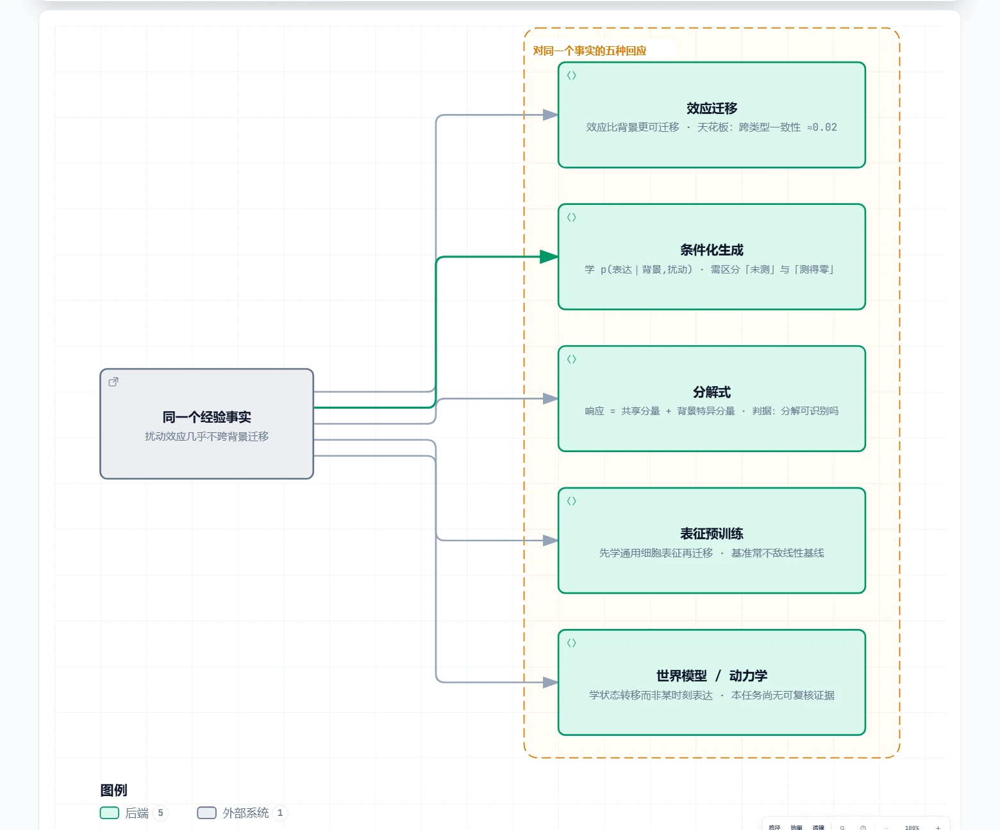
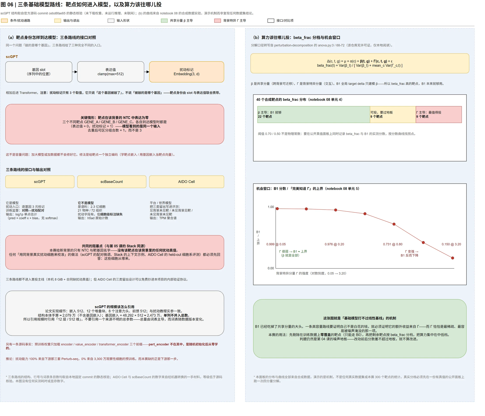
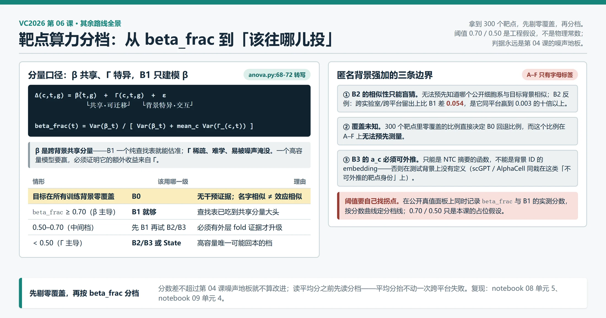

# 06｜其余路线全景：效应迁移 / 基础模型 / 分解式 / 世界模型

> **本课回答**：State（第 02–03 课）与 Stack（第 05 课）之外，这个领域还有哪几套解法？每一套在赌什么、天花板判据是什么、在本赛「新背景只给 NTC」的合同下还剩什么可用。读完你能做一件事：拿到一篇没读过的扰动预测论文，定位它的赌注、说出它的天花板判据、判断它在本赛上能不能用——并给「算力该往哪个靶点投」写出可执行的决策规则。
>
> **前置**：[第 02 课 State 模型拆解](02-State模型拆解.md)（条件化生成这条注的主线模型已在那里拆透）、[第 04 课 你怎么知道改进是真的](04-你怎么知道改进是真的.md)（B0–B3 的定义与手算、噪声地板判据）、[第 05 课 Stack](05-Stack推理时把无标签细胞当示例.md)（表征预训练注里的 ICL 路线）。[第 03 课](03-State上手.md) 的 LOCO 协议与计数生成器只回指。
>
> **配套 notebook**：[`notebook/08_foundation_model_routes.ipynb`](../../notebook/08_foundation_model_routes.ipynb)、[`notebook/09_simple_baselines.ipynb`](../../notebook/09_simple_baselines.ipynb)（09 与第 04 课共用，B0–B3 的权威手算在第 04 课 §6.3）
>
> **下一课**：第 07 课 消融、集成与最终轮（吸收改写中，现行内容见 [`L3-05` 消融、集成与最终轮](L3-05-消融集成与最终轮.md)）。分解式 / 生成式 / 世界模型的一页纸模型卡在[附录：六张模型卡](appendix/L2-06-模型卡.md)。
>
> 课程索引与主题归属：[README.md](README.md)
>
> 核验日期：2026-09-18。面向熟悉软件开发和机器学习、正在补齐单细胞生物学的读者。
>
> **本课的证据性质**：本文是源码、论文与官方技术报告对照阅读的结果。scGPT 的结构取自固定 commit 的官方仓库（静态核验 `[S3]`）；scBaseCount 与 AIDO Cell 的数字经 MinerU 机器转换（`[R1]`/`[R2]`，涉及数字处须回 PDF 复核）；论文结论一律标 `[P#]`，**未在本项目复现**；效应一致性与两个控制基线负分是**参赛者自报**（单独一级，只指方向不作量化依据）；B0–B3 的具体形式、LOCO 协议与 `beta_frac` 分档阈值是**工程假设**。本机**未下载任何权重、未运行任何模型**，因此没有实测耗时或显存数字；效应迁移族的 B1–B3 也没有任何本机实测分数。
>
> **改写进度**：本课由旧课 `L1-01`（五种赌注地图）、`L2-03`（基础模型三路线）与 `L2-04`（效应迁移族剩余部分）合并重写，三门旧课已删除。B0–B3 的逐级定义、架构与手算已在第 04 课 §6.3；Stack 的架构与 ICL 取舍在第 05 课；分解式 / 世界模型的六张模型卡权威仍在[附录：六张模型卡](appendix/L2-06-模型卡.md)，本课 §1.5 只做导读回指，不往主线复写。

**一句话概括：这个领域的五套思想是对同一个经验事实——「扰动效应几乎不跨背景迁移」——的五种回应。本课把其余路线在本赛合同下的剩余价值算清楚：效应迁移只能当对照门（B1 已经很强，而且它的强度可解释——共享分量 β 被一个纯查找表就吃掉了大头）；基础模型三路线在「新背景只给 NTC」下全部不成立，但它们的失败模式值钱——靶点身份被绑在不可外推的对象上；分解式与世界模型的交互分量那一半在合同层面就不可得，所以只留模型卡不占课时。**

---

## 0. 接上一课：你现在手里有什么

05 结束时，桌上摆着两台能用的机器和一台判定器：

```text
05 结束时的路线图

  State 微调 ──── 实施主线（第 02–03 课：接口迁移 + 计数生成 + 算力预算）
  Stack  ICL ──── 备选（第 05 课：上下文里必须有已扰动细胞才可用）
  判定器 ──────── 噪声地板 + 六指标 + 消融顺序 + B0–B3（第 04 课）
                          │
           还剩三块没看：效应迁移的判据到底怎么用？
           基础模型为什么常输给线性基线？其余路线还剩什么？
```

贯穿案例不变：你手里是**背景 A（匿名）** 的 18,400 个 NTC 细胞和靶点名字 **`ADNP`**，要产出 `ADNP` 被敲低后 400 个细胞的原始计数。State 和 Stack 之外的所有路，本课把它们摆上同一张桌：每条路先问三个问题——**它赌什么、天花板判据在哪、目标背景的信息从哪来**。第三个问题最能筛人：本赛 D/E/F 对目标背景只给 NTC，一格扰动真值都没有。

---

## 1. 它赌什么：一个经验事实，五种回应

### 1.1 先说那个经验事实

五种赌注不是凭空的分类，它们都是对下面这个事实的回应：

> **扰动效应几乎不跨细胞背景迁移。** 参赛者 Ilyes Baali 报告：同一细胞类型、不同状态之间的效应一致性在 **0.25–0.33** 量级；不同细胞类型之间塌到 **0.016–0.037**。`[P1]`，**参赛者自报，尚未复核**——数字来自他对若干公开 CRISPRi screen 的二次分析，本仓库没有复现。

把它当**定性**工作假设用，理由是它与多条独立证据方向一致（§4.3 的三组基准工作、§1.4 的零样本边界）：同一扰动在不同细胞里造成的响应只有很小一部分共享，剩下绝大部分是背景特异的，而这部分目前没有方法能从对照细胞可靠推出。官方评分恰恰奖励特异分量——只预测共享效应，等于在评分表上主动放弃大头。

### 1.2 关键区分：这个任务要的到底是什么

| 目标 | 问题 | 谁在做 |
|---|---|---|
| **目标发现** | 这个基因被压低后，哪些基因显著变了？ | 差异表达分析、生物学家的日常 |
| **幅度预测** | 这个扰动会把表达拉低多少？ | 幅度建模、效应表路线 |
| **分布生成** | 给出背景 + 靶点，400 个细胞的**计数矩阵**长什么样？ | **本赛要求的那一种** |

第三种包含前两种，但额外要求细胞间变异结构——这正是「把 400 个细胞预测成完全相同的一行」会拿到约 −0.81 的原因（`[P1]` 参赛者自报）。只服务前两种目标的方法，在本赛上都只是半成品。

### 1.3 五种赌注



*图 1：五种赌注都是对同一个经验事实的回应。图源规格见 `docs/style/sources/L1-01-five-bets.architecture.json`（archify 已于 2026-09-17 卸载，规格保留作重建依据）。*

逐个展开。**① 效应迁移**：赌效应本身比背景更可迁移——把多个公开 screen 的效应加权平均成一张「效应表」，乘到目标背景对照细胞上。代表是参赛者的两步流水线（作者自己说明这**不是细胞模型**）`[P1]`；响应幅度方向有独立证据：线性/树模型优于 MLP 编码器 `[P16]`。成本五种里最低（CPU）。天花板由 §1.1 直接封顶：可迁移的只有那么多，**失败模式不是拟合不足，而是信息不存在**。正确位置是基线，不是主模型。

**② 条件化生成**：不假设效应可迁移，直接学条件分布 `p(表达 | 背景, 扰动)`，让模型自己决定哪部分共享、哪部分特异。**State 是这一注的主线**（第 02 课已拆透）；同类还有 X-Cell `[P10]` 与 MORPH `[P15]`。成本高。天花板判据是能否区分三种「零」：

| 情形 | 含义 | 模型该怎么处理 |
|---|---|---|
| 未测 | 这个基因没被测到 | 当缺失 |
| 测得零 | 测到了，计数就是 0 | 当真实的低表达 |
| 生物学关闭 | 基因真的不表达 | 当信息 |

把前两者混为一谈，模型学到「零就是零」的平凡规律，稀疏矩阵上指标好看但什么都没学到。缺口在输出端：合同要 18,533 基因原始整数计数，多数条件生成模型在 `log1p` 或 HVG 子空间训练（第 03 课的计数生成补这一段）。

**③ 分解式**：赌响应可以拆成共享 / 扰动特异 / 背景特异 / 交互四个分量，分别建模分别验证。代表：perturbation-decomposition `[P6]`、AdaPert `[P13]`、C3TL `[P14]`。成本中。天花板判据按顺序问三个问题：分解可识别吗？可证伪吗？**目标背景的交互分量从哪来？**——第三问是决定性的：纯零样本方法无法恢复 `细胞系 × 扰动` 交互，只有把目标背景约 30% 真实扰动加进训练后才改善 `[P6]`。本赛 D/E/F 一格都没有，交互那一半**在合同层面不可得**。

**④ 表征预训练**：先在海量观察性单细胞上学通用表征，再迁移到扰动任务。代表：scGPT、Stack、scBaseCount、AIDO Cell。天花板判据是本课 §4 的主题：**同构设置下，大规模预训练表征的收益经常是负的**。Stack 的 ICL 形态第 05 课已拆；scGPT / scBaseCount / AIDO Cell 三条路线 §2–§6 拆。

**⑤ 世界模型 / 动力学**：赌该学的是状态转移本身（`P(x_{t+Δ} | x_t, 干预)`），原则上可迭代、可处理连续干预。代表：AlphaCell `[P11]`、Lingshu-Cell `[P12]`、VCWM 概念框架 `[P17]`。成本最高、成熟度最低：AlphaCell 用离散的已学习 perturbation ID，**不能预测训练中未见的靶点**；Lingshu 的 H1 实验是同背景 150 个监督扰动；本任务上**没有可复核的正收益证据**。

速查表（背下这一张，新论文先对号入座）：

| 赌注 | 一句话假设 | 成本 | 天花板判据 | 本赛可用性 |
|---|---|---|---|---|
| 效应迁移 | 效应比背景更可迁移 | 极低（CPU） | 跨类型一致性 ≈0.02，信息本身不足 | 可作基线，不可作主模型 |
| 条件化生成 | 直接学 `p(表达 \| 背景, 扰动)` | 高 | 能否区分「未测」与「测得零」 | **主线**（State），输出端需适配 |
| 分解式 | 响应可拆成可分别建模的分量 | 中 | 交互分量在 NTC-only 合同下不可得 | 部分可用，交互那一半封死 |
| 表征预训练 | 通用细胞表征可迁移到扰动任务 | 高 | 基准显示常不敌线性基线 | 需专门消融才能证明价值 |
| 世界模型 | 学状态转移而非某时刻表达 | 最高 | 本任务上尚无可复核证据 | 观察，不投入 |

### 1.4 三条比「选哪条路线」更要紧的判断

**一、三个「控制基线」负分的口径不同，不可互换。** 公开材料里反复出现三个数字，定义完全不同：

| 报告者 | 基线定义 | 分数 |
|---|---|---|
| Ilyes Baali `[P1]` | 输出 400 个**完全相同**的细胞，均值正确 | 约 **−0.81** |
| Forrest Sheldon `[P2]` | 直接采样对照细胞 | 总分 **−0.304**，其中 DE 方向保真度 **−1.721** |
| 本项目登记的 H1 基准 `[R3]` | 官方 control baseline（≈B0） | 约 **−0.04523**（报告值，未复跑） |

三者任务、背景、评分版本都不同，**并列比较是错的**。但它们共同指向一件事：**本地必须先建立自己的噪声地板，否则无法判断任何改进是真是假**——那是第 04 课 §3 的任务。

**二、「零样本」这个条件比看起来更严。** Molina 与 Zhang 发现纯零样本方法无法恢复交互分量、给目标背景 30% 真实扰动后才改善 `[P6]`；AdaPert 的跨细胞系实验里，直接跨细胞系 Perturb Mean 在 Pearson-delta 上仍强于该模型 `[P13]`。合起来：**交互分量是背景特异的、可测量的、但目前没有免费的估计方式**。任何声称「零样本解决了交互」的方法，先问一句「你的目标背景扰动数据从哪来」。反过来它也界定合理期望：NTC-only 条件下能可靠拿到的只有「共享分量 + 由 NTC 推得的背景模板」，声称远超此范围的分数，先怀疑泄漏，再怀疑口径。

**三、平凡基线为什么常常赢——消融顺序从第一步就走对。** 当信号的方差主要来自共享分量时，把共享分量估准的简单模型就会赢；未见扰动设定下扰动间方差本身偏低，均值基线已吃掉大部分可解释方差，复杂模型额外拟合的多半是噪声 `[P4]`。PerturBench 的 rank 指标专门诊断这件事：多个不同扰动被预测成几乎相同的响应（**均值塌缩**，mode collapse）时，平均误差还行、rank 立刻暴露。由此得到本项目的消融阶梯（第 04 课 §6.2 的骨架）：

```text
无变化 → 均值 → 加性 / 低秩线性 → 跨背景 target-effect → 复杂模型
                                                     │
        每一步都要证明自己超过了【紧邻的】前一步，
        而不是「超过了无变化」——否则消融从第一步就走错。
```

### 1.5 分解式与世界模型：导读回指附录

这两注**不占课时**（Q1=B 裁决）：在 NTC-only + 限期的条件下可用部分太窄，而理解它们所需的时间可以从别处更便宜地获得。覆盖面由[附录：六张模型卡](appendix/L2-06-模型卡.md)保住：分解式三张（perturbation-decomposition / AdaPert / C3TL）、生成式两张（X-Cell / Lingshu-Cell）、世界模型一张（AlphaCell），每张卡字段固定、可执行程度单独成列。**附录是模型卡的权威位置**，本课不复写卡片内容；读法：先看卡片的「训练目标在惩罚什么」与「适配缺口能不能满足」两列，最后才轮到性能数字。附录 §2.2 的诊断题（AlphaCell 与 scGPT 同栽在靶点身份不可外推）是五注地图最好的自测。

---

## 2. 输入输出契约：四族路线过同一道合同题

### 2.1 效应迁移族（B0–B3）的契约

四级的输入输出契约完全一致，差别只在**内部怎么构造 delta**——这正是它们能公平对比的原因：

| 项 | 内容 |
|---|---|
| **输入** | 目标背景 $c$ 的 NTC 细胞矩阵（本赛 18,400 细胞 × 18,533 基因，原始计数）；待扰动靶点名字 $t$ |
| **训练侧输入** | 若干**捐献背景** $d$ 的 NTC + 该背景内已测的扰动细胞（用于算 $\Delta_{d,t}$） |
| **输出** | 400 个细胞的**原始非负整数计数**，总计数 ≤ 1,000,000，恰好 18,533 基因 |
| **输出前端** | B0–B3 在**群体表达谱**空间给出 $\widehat{\mu}$，末端必须接计数生成器（权威位置：[第 03 课](03-State上手.md)） |

「简单基线」的简单只在**均值估计**这一步——末端那一段契约与 State 完全相同，不能拿「我们不做计数生成」当差异。

### 2.2 四族契约对照

| | B0–B3（§2.1） | State（第 02 课） | Stack（第 05 课） | scGPT（§3.1） |
|---|---|---|---|---|
| 建模单位 | 群体均值 → 计数生成 | 集合 → 集合 | 集合 + 上下文 → 集合 | **单细胞 → 单细胞** |
| 靶点身份怎么进入 | 名字查表（B1–B3） | 靶点 one-hot 词表 | 上下文里的示例细胞 | **逐基因 3 元标记** |
| 基因顺序 | 不适用 | 无序集合 | 可学习位置嵌入 | **无序（位置编码定义了但没接线）** |
| 输出形态 | 群体 $\widehat{\mu}$ → 计数生成 | 分布（能量距离） | 负二项参数 | **`log1p` 单点标量（仿射解码器）** |
| 训练需要扰动真值吗 | B0 否；B1–B3 是 | 否 | 否（自蒸馏） | **是（对照 ↔ 扰动配对）** |
| 每靶点的参数 | **0**（B1 是纯查找表） | 共享 | 共享 | 共享 |

两格是重点。**「每靶点参数 = 0」**：B1 不学习任何东西，所以它不会过拟合、也不会因为数据少而崩——这是「B1 很强」的机械依据。**「需要配对真值 = 是」**（scGPT 那格）：本赛没有该背景该靶点的任何扰动细胞，这是 scGPT 最硬的阻塞点，且是接口级的（§4.3 第三层）。

### 2.3 scGPT：一个细胞是一句「基因句子」

scGPT 把每个细胞当成一句由基因 token 组成的句子，输入嵌入是三项**相加**：

```text
h(i) = emb_g(基因 id)  +  value_encoder(表达值)  +  pert_encoder(扰动标记)
        └ 基因身份 ┘      └ log1p 值, clamp 512 ┘   └ Embedding(3, d) ┘
                                                  只有 3 个取值：0 / 1 / pad
```

三件事值得停一下（全部来自固定 commit `cebd6fae65` 的静态核验 `[S3]`）：

1. **扰动信息是一个 3 元词表。** `self.pert_encoder = nn.Embedding(3, d_model)`。模型对「这个基因被扰动了吗」的全部知识来自一个 3 取值的离散标记；「被扰动的是哪个基因」由该基因自身的位置与表达值携带。所以当靶点在该背景里**表达为零**时，模型看到「零值 + 标记 1」，无法从值里读出靶点身份——这是接口级边界，加大模型修不好。
2. **位置编码定义了但没接线。** `model.py:736` 定义了 `PositionalEncoding`，但两个 Transformer 类里都没有实例化——scGPT 对基因顺序结构上不变。与 Stack 对照：Stack 用显式的可学习 `gene_pos_embedding`。两条路线对「基因有没有顺序」给出了相反的答案。
3. **扰动微调是「对照 → 扰动」的配对监督。** 论文把对照细胞与扰动细胞随机配对，输入用对照值、目标用扰动值 `[P9]`。这个监督信号在本赛**不存在**。

scBaseCount 没有模型接口——它的「契约」是**数据格式**（统一流程重建的 h5ad 原始计数，§5.4），接口问题变成字段与可比性问题。AIDO Cell 的接口是「持久细胞状态 + 连续扰动」，表达读出单位是 **TPM**，不是原始计数 `[R2]`——两者都要在末端接计数生成器。

---

## 3. 架构：两条已拆，三条在这里拆

State 与 Stack 的逐层解剖分别是第 02、05 课的权威内容，本课不重复。这里拆剩下三条。

### 3.1 scGPT：标准 Encoder + 三个头

| 模块 | 形状/参数 | 它解决什么问题 |
|---|---|---|
| `GeneEncoder` | `Embedding(ntoken, d_model)` + LayerNorm | 基因 id → 向量；LayerNorm 让不同词表尺度可比 |
| `ContinuousValueEncoder` | `Linear(1,d) → ReLU → Linear(d,d) → LayerNorm` | 标量表达值提升到 d 维；`clamp(max=512)` 截断极端值 |
| `pert_encoder` | `Embedding(3, d_model)` | 逐基因的扰动开关（§2.3 的接口边界） |
| `TransformerEncoder` | nlayers 层，全对全注意力，无掩码 | 基因之间的自注意力 |
| `AffineExprDecoder` | 两个 `ExprDecoder`：`Linear(d,d)→LeakyReLU×2→Linear(d,1)` | 输出系数与偏置，最终 `pred = coeff × values + bias` |

**仿射解码器要单独说**：每个基因的预测是**它自己的输入表达值**乘系数再加偏置——模型学的是「相对自己调整多少」。输入的 NTC 表达值会直接乘进预测里，输出不天然落在整数上。论文实现细节（嵌入 512、12 块、8 头、前馈 512、最大长度 1,200）与扰动教程一致 `[S3]` `[P9]`；注意源码里 `d_model / nhead / d_hid / nlayers` 是**必填无默认**参数，「默认超参」只存在于教程脚本里——配置和结构要分开看（第 05 课同款教训）。

**参数量：仓库没给总数，这是有意的读法。** 本地解析词表 `default_gene_vocab.json` 得 **48,292 条** `[S3]`；结构本体手算约 2,079 万（不含基因嵌入，**工程假设**），基因嵌入 = 48,292 × 512 ≈ 2,473 万。**引用 scGPT 规模时引用「12 层 / 512 维」，不要引用一个来源不明的总参数**——工程实现还会叠加特殊 token、分类头与开关项，合并总数会让「数字从哪来」变成查不到的事。

### 3.2 scBaseCount 与 AIDO Cell：一个不是模型，一个没给权重

scBaseCount 的「架构」是一条**重建流程**：SRAgent（检索 SRA 条目、抽元数据）→ scRecounter（Nextflow，`fasterq-dump` 下载后用 STARsolo **重新比对**，不用作者提供的矩阵）→ h5ad `[R1]`。流程的架构意义：把「不同研究之间的处理差异」显式当成要消除的变量——而它自己也承认没完全达到（§5.4）。

AIDO Cell 是**平台 / 世界模型**主张：持久细胞状态、连续扰动、多尺度多模态读出，v1.0 只发布 K-562 与 Hep-G2 两个原型，本项目**未核到公开权重入口** `[R2]`。它真正值得借的是评测设计：把三类留出（见细胞系未见药 / 未见细胞系见药 / 未见细胞系未见药）写进 benchmark——第 (iii) 类加「未见靶点」就是本赛的最终轮形态（§5.4 的边界也要读）。

### 3.3 效应迁移族的形态：从查找表到低秩交互

B0–B3 的逐级公式与手算在第 04 课 §6.3（权威位置，不重写）。这里保留两条与**效应迁移赌注**直接相关的结构事实：

- **B1 没有任何按靶点训练的参数**——它是跨背景中位数查找表，对没见过的目标零信息，此时回退 B0（§7.1 的回退规则）。B0–B2 的全部「训练」就是算均值和中位数，CPU 秒级；与 State / Stack 的 8 GiB 边界形成鲜明对照。
- **B3 的两个致命限制**（推导口径见 `appendix/非State路线备选架构.md` §2，只引用不重写）：若 $a_c$ 只是训练背景的自由 ID 向量、$b_t$ 只是目标 ID，它们**在测试背景 / 测试目标上没有定义**——必须由 NTC 摘要经**可外推函数**得到，且正则强度由嵌套 LOCO 选择、「在外层 fold 改进」才算通过。附录 §2.2 把这一条与 scGPT、AlphaCell 归为同一个陷阱：**靶点身份绑在不可外推的对象上**。

---

## 4. 训练目标：为什么基础模型常打不过线性基线

### 4.1 B0–B3 没有损失函数

B0–B3 不是「训练」出来的模型，而是**估计量**：背景均值、跨背景稳健中位数、闭式加权、低秩分解——没有梯度下降这一步。后果有二：**不能拿「训练 loss 下降」判断它们变好**；B3 尤其危险——正则调大必然降低训练误差，但那可能是在记批次，所以 B3 的判据只能是外层 fold。B0 在六项指标上的落点也不是「零分」：PDS 并列 0.5、LFC 幅度 NMAE 接近 1、表达 MSE 不差——**B0 是另一个参考点，不是 generic-response 参考**（官方缩放体系的权威位置：第 04 课 §2、§6.3）。

### 4.2 scGPT 的逐基因 MSE，与两个对手

scGPT 预训练是生成式掩码（基因提示 + 细胞提示两步损失），微调有五个目标（GEP / GEPC / perturb-GEP / ECS / DAR）`[P9]`。关键在 GEP 与 perturb-GEP 用**逐基因 MSE**：模型把「同条件不同细胞之间的表达差异」全部当噪声平均掉——与 State 恰好相反（State 用分布距离，把细胞间离散度当要建模的信号）：

| 路线 | 训练目标 | 与六项指标的错位 | 后果 |
|---|---|---|---|
| State | 集合间分布距离 | 小（同为分布视角） | 输出仍需转计数 |
| Stack | 负二项似然 + 自蒸馏 | 小（显式建模计数离散） | 目标自身被官方指标排除 |
| **scGPT** | **逐基因 MSE** | **大** | **MSE 最优解是条件均值，天然抹平单细胞离散度** |

### 4.3 三层解释：协议、口径、接口

「基础模型打不过线性基线」这句流行结论必须拆成三层，混在一起就会得出错误结论。

```text
第一层 协议：打不过有时是评估方式的产物
第二层 口径：双方预测的都是 Δ，而 Δ 的大头本来就被 B1 吃掉
第三层 接口：有的模型把靶点身份绑在不可外推的对象上
```

**协议层。** Csendes 等在 Adamson / Norman / Replogle 上比较 scGPT、scFoundation 与均值、Elastic Net、kNN、Random Forest：其未见扰动 + Pearson-delta 协议下**训练集均值优于两个基础模型**，且常用数据的扰动间方差偏低会放大 benchmark 误读 `[P4]`；Ahlmann-Eltze 等独立得到相近结论，并发现**用另一细胞系 Perturb-seq 学得的扰动表示可以提高线性模型，而观察性预训练表示的收益有限** `[P3]`；PerturBench 在六个数据集上报告没有一种架构全面占优、数据增大时简单模型更稳 `[P5]`。**关键限定：这些实验留出的是同细胞系内的扰动、用的是论文自定指标，不是本赛的跨背景六指标**——正确的表述是「在这些协议下均值很难被打败」，不是「基础模型在本赛上没用」。

**口径层。** 双方预测的其实是同一个东西 $\Delta_{c,t,g}$，按分解口径拆开：

```text
Δ(c,t,g) =  β̄(t,g)（跨背景共享） + Γ(c,t,g)（背景特异交互） + ε
                ↑                        ↑
        B1 一个查找表就能估准      稀疏、难学、易被噪声淹没
```

均值基线在几乎所有数据集上已吃掉共享分量的大头；高容量模型要赢，必须证明额外收益来自 $\Gamma$。`perturbation-decomposition` 把这句话变成可计算的比值（本项目对 `anova.py:68-72` 的转写，`[S4]`）：

$$
\text{beta\_frac}(t) = \frac{\operatorname{Var}(\beta_t)}{\operatorname{Var}(\beta_t) + \operatorname{mean}_c \operatorname{Var}(\gamma_{c,t})}
$$

`beta_frac` 高 ⇒ B1 就够用；`beta_frac` 低 ⇒ 才轮到高容量模型。notebook 08 在合成数据上测过机会窗口：Γ 从 0.05 增到 3.20 时，「B1 分数 / 完美知道 Γ 的上界」从 0.998 掉到 0.150（**合成数据，演示机制非实测**）。本赛 300 个靶点应当先按这个比值分档，再决定算力投向（§7.1）。

**接口层。** 即使抛开前两层，scGPT 的扰动接口在本赛也很难发挥作用：`Embedding(3, d)` 只能表达「某基因是否被扰动」，靶点身份靠该基因的位置与表达值携带（§2.3）；靶点表达为零时不可区分。这是**接口级阻塞，不是容量级问题**——加大模型不会修好它。修法是给靶点一个独立编码（学靶点嵌入 / 用基因自身嵌入当靶点向量，§7.3 决策二）。



*图 2：**(a)** 同一个问题「敲的是哪个基因」，三条路线给了三种入口；共同阻塞点与本赛合同冲突——新背景只给 NTC。**(b)** `beta_frac` 分档与机会窗口：只有「Γ 主导」那一档才值得投高容量模型。图上数字都不是实测性能，面板 (b) 全部为合成数据；逐项来源见 `docs/style/prompts/L2-03-foundation-routes-facts.md`（图内 kicker 已随第 06 课更新，文件名保留旧课号）。*

---

## 5. 数据：每条路线见过什么，缺什么

### 5.1 本赛给的数据：只有 NTC，没有扰动真值

| 数据 | 内容 | 能算什么 |
|---|---|---|
| `data/vcc2026-validation/controls/context_{A,B,C}.h5ad` | **仅 NTC**：每背景 18,400 细胞 × 18,533 基因，原始计数 `[S1]` | B0 ✅ ｜ B1–B3 ❌ |
| `manifest.json` | 公告每背景 300 个扰动、每个 400 细胞真值（**未提供**）`[S1]` | 只用于确认规模 |
| `pert_counts.csv` | 300 个靶点名字 | 仅靶点名单 |

**结论：本赛公开数据不足以在本地计算 B1–B3。** $\Delta_{d,t}$ 需要「同背景、同靶点」的扰动细胞，而 A/B/C 只给了 NTC。这不是数据没下全，是合同如此。

### 5.2 所以 B1 的 delta 要从公开扰动面板来

要测 B1–B3，必须引入本仓库登记过的公开扰动面板（配置在 `references/perturbation-decomposition/configs/datasets.yaml`，`[S4]`）：

| 面板 | 来源 | 细胞系 | 用途 |
|---|---|---|---|
| `replogle_k562` | Replogle et al. 2022 | K562 | 算 $\Delta_{d,t}$ 的主力 |
| `replogle_rpe1` | Replogle et al. 2022 | RPE1 | **跨背景**的第二背景 |
| `nadig_jurkat` | Nadig et al. 2024（GSE264667） | Jurkat | 第三背景 |
| `nadig_hepg2` | Nadig et al. 2024（GSE264667） | HepG2 | 第四背景 |
| `norman` | Norman et al. 2019 | K562 | 含双基因扰动 |

这四个细胞系就是 B1–B3 的「捐献背景」$\mathcal{D}$；有了它们 LOCO（留一个背景当目标，用其余三个算 $\overline{\Delta}$）才成立：

```text
LOCO：四个捐献背景轮流当「假想新背景」

  留出 K562 ──→ 用 RPE1 + Jurkat + HepG2 算 Δ̄(t,g) ──→ 到 K562 上评分
  留出 RPE1 ──→ 用 K562 + Jurkat + HepG2 算 Δ̄(t,g) ──→ 到 RPE1 上评分
  ……（Jurkat / HepG2 同理）
  本赛的 D/E/F 比这更狠：目标背景连一个「已测扰动」都没有
```

协议骨架的权威位置在第 03 课。

### 5.3 scGPT：3,300 万观察性细胞 + 三套小扰动集

scGPT whole-human 预训练语料是**超过 3,300 万个正常人的观察性细胞** `[S3]`；扰动能力来自下游微调的三套 Perturb-seq——Adamson 87 个单基因、Replogle 1,823 个、Norman 236 个组合 `[P9]`。也就是说 **scGPT 的扰动预测实力不由预训练语料决定，而由这三套小数据集决定**；本赛 300 个靶点有多少落在这三套的覆盖内，是一个按基因名做集合运算就能查的问题（notebook 08 单元 4）。

源码侧还有一条最有教学价值的证据：扰动教程里 `load_param_prefixs = ["encoder", "value_encoder", "transformer_encoder"]`——**`pert_encoder` 不在加载列表里**，即扰动标记嵌入随机初始化后从零学 `[S3]`。由此可得一条推论（推论，不是官方声明）：**scGPT 的扰动知识来自下游微调，而不是 3,300 万细胞的预训练**——预训练提供的是基因与细胞状态的表征，对下游小样本微调有帮助，但「有帮助」不等于「提供扰动知识」。本赛缺的恰恰是下游那一步。

### 5.4 scBaseCount 与 AIDO Cell 的语料与边界

scBaseCount：**超过 2.3 亿细胞**、平均每细胞 7,614 UMI、21 物种 72 组织 `[R1]`（**MinerU 机器转换，数字须回原文 PDF 复核**）。两处最该警惕的：摘要说元数据含「扰动」字段，讨论部分明确承认**细胞级注释（施加的扰动、供体）无法从 SRA 元数据获得、必须手动整合** `[R1]`——不能指望直接拿到「哪些细胞被敲了哪个基因」；作者报告统一流程使单细胞 vs 单核的 PC1 解释方差从 15% 降到 11%，即**约 4% 的变异可归因于处理差异** `[R1]`——因果方向要读准：这是作者对**自己流程**的自我评价，不能读成「scBaseCount 比 CELLxGENE 更接近生物学真值」。

AIDO Cell：报告**未给出预训练语料规模** `[R2]`（缺口本身是信息）。它的 Tahoe-100M 实验是 42 个训练细胞系 + 3 个留出细胞系、301 个训练化合物 + 75 个留出化合物——这是**化学扰动**，有分子结构先验；本赛是 **CRISPRi 遗传扰动**，没有等价的可计算先验。**把 AIDO 的化学外推结论迁移到 CRISPRi 上是未经检验的。**

---

## 6. 官方代码怎么跑：能核验到哪一步就写到哪一步

### 6.1 可执行程度总览

```text
scGPT        读源码 ✓   前向形状核验 ✓   微调 ✗（需下载权重 + gears 依赖；8 GiB 不够）
scBaseCount  不可跑（2.3 亿细胞量级远超本机磁盘与显存）
AIDO Cell    不可跑（未核到公开权重入口）
B0–B3        vcc-h1 基准可跑（第 04 课 §6.3 的命令）；B1–B3 需先下载 §5.2 的面板
```

三条基础模型路线都跑不了完整训练，本课**不编造实测数字**——能静态核验的就静态核验，核验不了就明写（第 05 课同款纪律）。

### 6.2 scGPT 的最小可核验路径（三步，全部静态）

1. **读结构**：`references/scGPT/scgpt/model/generation_model.py` 的 `TransformerGenerator`（27 行起）与 `model.py` 的 `TransformerModel`（21 行起）。
2. **查词表**：`scgpt/tokenizer/default_gene_vocab.json`，本地解析 48,292 条（§3.1）。
3. **读扰动教程**：`tutorials/Tutorial_Perturbation.ipynb` 的模型实参与 `load_param_prefixs`——`pert_encoder` 不在加载列表（§5.3）。

### 6.3 B1–B3 的预测文件怎么构造

B1 需要自己构造预测 h5ad，契约严格：**恰好 50,400 细胞（3 背景 × 300 靶点 × 400 细胞）、每靶点恰好 400、基因轴与官方逐位一致**；B2/B3 需先从 GEO/Figshare 下载 §5.2 登记的面板。**在写下任何「我的方法比 B0 好」之前，先把第 04 课 §6.3 那条命令跑通**（`vcc-h1 score-control-baseline`，B0 报告值 −0.045230687652238 `[R3]`）。注意 h5py 在 UNC 路径上的文件锁坑（第 04 课 §6.3）。

### 6.4 notebook 08 / 09：五加五个单元

两份 notebook 全部纯 NumPy、离线、秒级。[notebook 08](../../notebook/08_foundation_model_routes.ipynb)：① 复算 scGPT 分层参数量与「为什么不合并总数」；② 从 3 元词表构造「靶点零表达」输入，验证端侧可区分信息量为 0；③ 合成数据四分量 ANOVA，重现「B1 吃掉共享分量、Γ 被噪声淹没」；④ scGPT 三套扰动覆盖与靶点可查性对照表（按基因名集合运算）；⑤ 实现 `beta_frac` 并分档，观察 B1 与「完美知道 Γ」的差距。[notebook 09](../../notebook/09_simple_baselines.ipynb)（与第 04 课共用）：手算复现 B0/B1、中位数 vs 均值稳健性、LOCO 协议骨架、B1 vs B2 相似度加权、把达标判定接到噪声地板上。

**本课明确没做的事**：没有下载任何权重、没有运行任何模型；没有复现 `[P3]`/`[P4]` 的任何数值；没有本机实测的 B1–B3 分数（`[R3]` 的 −0.04523 是 B0 报告值）；没有下载任何公开面板，LOCO 只给了骨架；`beta_frac` 分档阈值 0.70/0.50 是工程假设，需在公开真值面板上按分数曲线找拐点后才可固化。

---

## 7. 在 VC2026 上的适配缺口：决策规则

### 7.1 四级基线 × 靶点分档的决策规则

把 `beta_frac` 分档与零覆盖检查合起来，得到可直接执行的规则：

| 情形 | 该用哪一级 | 理由 |
|---|---|---|
| 目标在**所有**训练背景都零覆盖 | **B0** | B1 无该目标的干预证据，不能拿名字相似的基因顶替——基因名相似（同家族、同通路命名）与扰动效应相似是两件事 |
| `beta_frac` 高（β 主导，阈值 0.70） | **B1 就够** | 共享分量是大头，高容量模型没有发挥空间 |
| `beta_frac` 中（0.50–0.70） | **先 B1，再试 B2/B3** | 必须有外层 fold 证据才升级 |
| `beta_frac` 低（Γ 主导，< 0.50） | **B2/B3 或 State** | 这才是高容量路线唯一可能回本的地方 |

阈值 0.70 / 0.50 是**工程假设**，需在公开真值面板上按分数曲线找拐点后固化。**判据仍然是第 04 课的噪声地板：改动前后分数差不超过地板，就不算改进。**

```text
拿到 300 个靶点后的顺序

  第一步 剔零覆盖 ──→ 只能走 B0（或猜），不进分档
  第二步 算 beta_frac ──→ 高档：B1 直接用
                          中档：先 B1，有外层证据再试 B2/B3
                          低档：才轮到高容量 / State
  全程判据 ──────→ 第 04 课噪声地板；读平均分之前先读分档
```

### 7.2 三条边界（匿名背景带来的）

1. **匿名背景 ⇒ B2 的相似性无从检查。** A–F 是字母标签，无法预先知道哪个公开细胞系与它相似；B2 的权重只能靠 NTC 相似度盲猜——§9.3 的反例专门拆这条假设怎么崩。
2. **目标面板 300 个，跨背景覆盖未知。** 零覆盖靶点的比例直接决定 B0 回退的比例，而这个比例在 A–F 上无法预先测量。
3. **B3 的 $a_c$ 必须可外推。** 匿名背景下 $a_c$ 只能是 NTC 摘要的函数，不能是背景 ID 的 embedding——这一条把「B3 用什么形式」基本锁死（§3.3）。

### 7.3 基础模型三路线的缺口汇总与三个决策

| 缺口 | scGPT | scBaseCount | AIDO Cell |
|---|---|---|---|
| 能给本赛什么 | 预训练权重 + 微调头 | 观察性语料 | 评测设计参考（**无权重**） |
| 靶点如何进入 | 逐基因 3 元标记（零表达靶点不可区分） | 不适用 | 报告称支持连续扰动 `[R2]` |
| 训练监督 | **需要该背景的扰动真值 ← 本赛没有** | 不适用 | 同 |
| 输出形态 | `log1p` 单点 → 需接计数生成器 | 已是原始计数（但无扰动标签） | TPM → 需接计数生成器 |
| 本机算力 | 微调不可行 | 不可行 | 不可行 |

**决策一：三条路线都不进入首投主线。** 理由是算力（8 GiB）与合同（需要扰动真值）双重约束，不是对模型优劣的判断。
**决策二：scGPT 的基因嵌入可以作为 B3 靶点编码的对照臂**（替代 one-hot / 随机初始化）。前提是补控制实验：`scGPT 嵌入 → 靶点向量` vs `随机初始化靶点嵌入`，差距不超过第 04 课的地板则收益不可判定，不采用——这条把「基础模型的表征有价值」变成可证伪的陈述。
**决策三：把 §4.3 的三层分解写进任何「基础模型对比」报告。** 报告必须分别说明协议（留出轴 + 指标）、分量占比（`beta_frac`）、接口（能否表达未见靶点）；缺任一项，结论不成立。AIDO Cell 的三类留出设计应当**免费抄进**本项目的内部验证协议。



*图 3：把 §7.1 的决策规则画成流程——先剔零覆盖，再按 `beta_frac` 分档；三条边界是匿名背景强加的。阈值为工程假设；判据永远是第 04 课的噪声地板。*

---

## 8. 可复现实践：这课你手里多出来的东西

### 8.1 一张你自己的赌注判断表（零算力）

本课最重要的产物不是读完，而是**能对号入座**。对下面每篇材料填一行：属于哪种赌注 / 核心假设 / 天花板判据 / 目标背景信息从哪来 / 本赛可用性：

| 材料 | 赌注 | 核心假设 | 天花板判据 | 本赛可用性 |
|---|---|---|---|---|
| State（Cell 2026）/ X-Cell / perturbation-decomposition / AdaPert / C3TL / Stack / scGPT / AlphaCell / Lingshu-Cell / Ahlmann-Eltze 等 / Csendes 等 / PerturBench | | | | |

**「本赛可用性」一列不许写「高/中/低」**，必须写成条件句（例：「可用为基线，前提是它能生成单细胞计数」「不可用，因为它需要目标背景的已测扰动」）。写不出条件句，说明判据还没有真正进入你的判断。材料原文与本地阅读副本的位置见 `docs/references/INDEX.md` 与 `docs/references/REPOS.md`。

### 8.2 notebook 08 / 09（§6.4 的两表）

本课的可执行产物集中在 [notebook 08](../../notebook/08_foundation_model_routes.ipynb)（scGPT 参数量、零表达靶点可区分性、四分量 ANOVA、靶点覆盖对照、`beta_frac` 机会窗口）与 [notebook 09](../../notebook/09_simple_baselines.ipynb)（B0/B1 手算、LOCO 骨架、B2 加权、地板判定；与第 04 课共用）。映射登记见 `notebook/README.md`。

---

## 9. 诊断题

### 9.1 题一：给一篇新论文定位（检验 §1 的全部判据）

你读到一篇新论文，摘要如下（**构造的教学情景，不是某篇具体论文**）：

> 我们提出 PertX，一个基于（此处省略架构细节）的模型。我们在 Replogle K562 上训练，在 RPE1 上评估跨细胞系泛化，取得了比 State 更好的 Pearson-delta。为模拟真实零样本场景，我们在评估时**用目标细胞系的 5% 扰动数据做了 few-shot 适配**。此外我们在 HepG2 和 Jurkat 上也报告了一致的改进。

请回答：(1) 它属于哪种赌注？依据是哪一句？(2) 它能不能直接用到本赛？缺的是什么？(3) 即使能用，你还需要额外知道哪两件事才能判断它真的超过了现有方案？

<details>
<summary>参考答案（先自己写，再展开）</summary>

**(1)** 它**自称**条件化生成（与 State 比、谈跨细胞系泛化），但**实际做法**混合了分解式成分：用目标细胞系的扰动数据做 few-shot 适配，本质是在估计「背景特异 + 交互」那一部分。**论文的定位是它的营销，目标背景信息来源才是它的实质。**

**(2)** 不能直接用。判据句是「**用目标细胞系的 5% 扰动数据做了 few-shot 适配**」——本赛 D/E/F 只有 NTC，这一步在合同层面无法执行（§1.4 第二条判据的实例化）。可以保留的是不含该步骤的部分，但那时它报告的改进幅度已不适用。

**(3)** 任答两点即可，关键是意识到「比 State 好」本身不构成证据：**协议是否干净**（跨背景评估有没有把留出背景的扰动泄漏进训练或调参，第 03 课）；**指标口径**（Pearson-delta 是一个指标，本赛有六项且三项依赖 DE 集合）；**噪声地板**（0.01 量级的改进没测过地板无法判断，第 04 课）；**输出空间**（HVG / `log1p` 上的结果不能外推到 18,533 基因原始计数）。
</details>

### 9.2 题二：一行代码的后果

你打算用 scGPT 预训练权重初始化微调模型，期望「3,300 万细胞学到的知识提升扰动预测」。你在扰动教程里看到：

```python
load_param_prefixs = ["encoder", "value_encoder", "transformer_encoder"]
```

问：`pert_encoder` 会是什么状态？这对「预训练给了扰动能力」意味着什么？

<details>
<summary>参考答案</summary>

`pert_encoder` 不在前缀列表里，**不被预训练权重覆盖，保持随机初始化**，微调阶段从零学 `[S3]`。结论：**预训练权重里不包含任何扰动信息**，scGPT 的扰动预测能力全部来自下游三套 Perturb-seq（Adamson 87 / Replogle 1,823 / Norman 236）`[P9]`。本赛的问题——没有该背景的扰动真值——**恰恰打在这个模型唯一有扰动知识的地方**。边界：这不等于预训练没用（编码器提供的共表达结构对下游小样本微调有帮助），但「有帮助」与「提供扰动知识」是两个来源。
</details>

### 9.3 题三：B2 为什么可能骗人

某实验用 LOCO 比较 B1 与 B2（NTC 相似度 softmax 加权），B2 平均更高。逐背景看：

| 留出背景 | B1 | B2 | B2 的 NTC 最近邻 |
|---|---:|---:|---|
| K562 | 0.412 | 0.415 | RPE1（同实验室，同平台） |
| RPE1 | 0.398 | 0.402 | K562（同实验室，同平台） |
| Jurkat | 0.355 | **0.301** | K562（跨实验室，跨平台） |

B2 平均更高。能宣布「NTC 相似度可以预测跨背景因果响应」吗？下一步最值得做的对照是什么？

<details>
<summary>参考答案：不能。</summary>

看第三行——**B2 在跨实验室/跨平台的留出背景上比 B1 差 0.054，比它在 K562/RPE1 上赢到的 0.003–0.004 大一个数量级**。平均分被两个「同实验室同平台」的近邻背景抬高，掩盖了它在新条件上的失败。

**根因**：B2 的权重只用 NTC 表达相似度；同实验室同平台的细胞系在 NTC 上必然更像（共享批次指纹）——**B2 实际在利用技术相似性，不是生物相似性**。

**下一步对照（按优先级）**：① 把外层拆分升级为整数据集 / 平台留出，不让同一实验指纹同时出现在捐献端与留出端；② 加负对照——只用批次/平台标签（不用 NTC 表达）构造权重，若同样提升则收益来自技术信号；③ 若成立，回退 B1，记录「相似性假设未通过跨数据集验证」。

考点：**不要读平均分**。外层留出上退化的方法，平均分再高也不该采用——与 B3 的「外层 fold 改进才算通过」是同一条纪律。
</details>

---

## 10. 来源、核验范围与证据边界

### 10.1 来源

| 标记 | 内容 | 位置 |
|---|---|---|
| `[S1]` | VC2026 提交合同与数据公告（18,533 基因、400 细胞/靶点、NTC 18,400/背景、总计数 ≤ 1,000,000） | `docs/Official-website/` |
| `[S2]` | 官方 FAQ（State 与 Stack 的比赛用途与许可说明） | `docs/Official-website/FAQs.md` |
| `[S3]` | `bowang-lab/scGPT` 固定 commit `cebd6fae65`：`model.py`、`generation_model.py`、扰动教程的 `load_param_prefixs`、词表 48,292 条（本地解析）——全部静态核验，未运行 | `references/scGPT` |
| `[S4]` | `xinyizhanglab/perturbation-decomposition` 固定 commit `a152147806`：`decomposition/anova.py:3,68-72`（四分量分解与 `beta_frac`）、`configs/datasets.yaml`（面板配置）。**该仓库无许可证文件**，本地阅读可，复制代码前须先确认授权 | `references/perturbation-decomposition` |
| `[P1]` | Ilyes Baali 博客（一致性 0.25–0.33 / 0.016–0.037、−0.81、两步流水线）。**参赛者自报** | `docs/blogs/` |
| `[P2]` | Forrest Sheldon 系列四篇（−0.304 / DE 方向 −1.721）。**参赛者自报** | `docs/blogs/` |
| `[P3]` | Ahlmann-Eltze, Huber & Anders, *…does not yet outperform simple linear baselines*, Nature Methods 22, 2025 | DOI 10.1038/s41592-025-02772-6 |
| `[P4]` | Csendes et al., *Benchmarking foundation cell models…*, BMC Genomics 26, 393, 2025 | DOI 10.1186/s12864-025-11600-2 |
| `[P5]` | Wu et al., *PerturBench*, arXiv:2408.10609v4 | arXiv |
| `[P6]` | Molina & Zhang, *Perturbation response decomposition…*, bioRxiv 2026-07-27（30% 结论出处） | DOI 10.64898/2026.07.24.740459 |
| `[P7]` | Adduri, Gautam, Bevilacqua et al., *State*, Cell, 2026 | DOI 10.1016/j.cell.2026.07.052 |
| `[P8]` | Dong et al., *Stack: In-Context Learning of Single-Cell Biology*, bioRxiv 2026 | DOI 10.64898/2026.01.09.698608 |
| `[P9]` | Cui et al., *scGPT*, Nature Methods 2024（实现细节与微调目标；本地机器转述材料 `docs/references/scGPT.md` 不替代原文，正式版 DOI 待核验） | `docs/references/scGPT.md` |
| `[P10]` | Wang et al., *X-Cell*, bioRxiv 2026-03-20 | DOI 10.64898/2026.03.18.712807 |
| `[P11]` | Wang et al., *AlphaCell*, bioRxiv 2026-03-05 | DOI 10.64898/2026.03.02.709176 |
| `[P12]` | Zhang et al., *Lingshu-Cell*, arXiv:2603.25240v1 | arXiv |
| `[P13]` | Piao et al., *AdaPert*, ICML 2026, arXiv:2602.18885v2 | arXiv |
| `[P14]` | Scholkemper & Mukherjee, *C3TL*, arXiv:2603.13051v1 | arXiv |
| `[P15]` | He et al., *MORPH*, bioRxiv 2025-07-02 | DOI 10.1101/2025.06.27.661992 |
| `[P16]` | Shoeibi & Yousefi, *Response Magnitude as a Dominant Signal…*, arXiv:2608.00152v1 | arXiv |
| `[P17]` | Yu et al., *What Makes a Virtual Cell a World Model?*, Research Square 2026-07-21 | DOI 10.21203/rs.3.rs-10404367/v1 |
| `[R1]` | scBaseCount 论文的机器转换材料（2.3 亿 / 7,614 / 15%→11% / 4% 等数字**须回原文 PDF 复核**） | `docs/references/scBaseCount.md` |
| `[R2]` | *AIDO Cell V1 Technical Report* 机器转换材料（TPM 读出、三类留出、Tahoe-100M 设计；等级低于源码核验） | `docs/references/aido-cell-v1/aido-cell-v1.md` |
| `[R3]` | H1 开发基准登记（221,273 细胞、126 靶点；B0 = −0.045230687652238，README 报告值，本机未复跑） | `references/vcc2026-h1-benchmark/` |
| 工程假设 | B0–B3 的形式与通过条件、LOCO/LOTO 协议、$s(\cdot,\cdot)$ 与 $\tau$、`beta_frac` 分档阈值 0.70/0.50、scGPT 结构本体参数量手算与成本量级估计 | 推导口径见 `appendix/非State路线备选架构.md` §2 |

### 10.2 证据等级的说明

- `[S3]`/`[S4]` 是固定 commit 的官方源码，可定位到行，等级最高，但只证明「代码此刻长这样」。
- `[R1]`/`[R2]` 是 MinerU 机器转换材料，数字有转换出错风险，复核完成前**不得写进决策**。
- **参赛者自报**（`[P1]`/`[P2]`）单独一级：效应一致性数字与两个负分都未在本仓库复现，只指方向不作量化依据。
- 「scGPT 扰动知识 100% 来自下游」是**本项目从 `[S3]` + `[P9]` 得出的推论**，不是官方声明；引用时保留推论身份。
- 完整条目与采用/备选/排除理由见 `docs/references/INDEX.md`；上游仓库的固定 commit 与许可状态见 `docs/references/REPOS.md`。

### 10.3 尚未完成 / 明确没做的事

1. 未下载任何预训练权重、未运行任何模型——本课没有一个实测耗时或显存数字。
2. 未复现 `[P3]`/`[P4]`/`[P5]` 的任何数值；「均值优于基础模型」是原文结论的转述。
3. 未核 AIDO Cell 的权重可得性（「未核到公开入口」是本项目检索范围内的结论，不等于官方未发布）。
4. `[R1]`/`[R2]` 的数字未回原文 PDF 复核；scGPT 正式版 DOI 待核验。
5. 没有本机实测的 B1–B3 分数，没跑通 `vcc-h1 setup`（15.48 GB 下载），没下载任何公开面板。
6. §1.1 的效应一致性数字未复核；§1.4 的 −0.04523 未复现。

### 10.4 主题边界（本课不承担的内容）

| 主题 | 权威位置 | 本课的角色 |
|---|---|---|
| **五种赌注与天花板判据** | **本课 §1**（自 `L1-01` 并入） | 各课 §1「它赌什么」只回指对应赌注 |
| State / Stack 的架构与训练目标 | [第 02 课](02-State模型拆解.md) / [第 05 课](05-Stack推理时把无标签细胞当示例.md) | 只作横向对照，不重复拆架构 |
| B0–B3 的逐级解释、手算与实测 | [第 04 课](04-你怎么知道改进是真的.md) §6.3 | 只回指；本课保留效应迁移族的判据、决策规则与 B2 反例 |
| scGPT / scBaseCount / AIDO Cell 三路线横向对照 | **本课 §3、§7.3**（自 `L2-03` 并入） | [notebook 08](../../notebook/08_foundation_model_routes.ipynb) 是它的动手材料 |
| `beta_frac` 与靶点算力分档 | **本课 §4.3、§7.1**（自 `L2-03` §6.4 并入） | 分解口径来自 `appendix/非State路线备选架构.md`（只引用不重写）；B0–B3 实测归第 04 课 |
| 六项指标、噪声地板、计数生成、LOCO 协议 | [第 04 课](04-你怎么知道改进是真的.md) / [第 03 课](03-State上手.md) | 只用作判据与回指 |
| 分解式 / 生成式 / 世界模型的六张模型卡 | [附录：六张模型卡](appendix/L2-06-模型卡.md) | §1.5 只做导读回指，不在主线复写卡片内容 |
