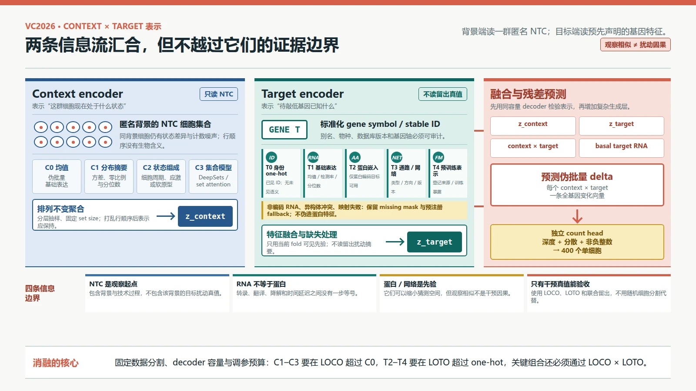
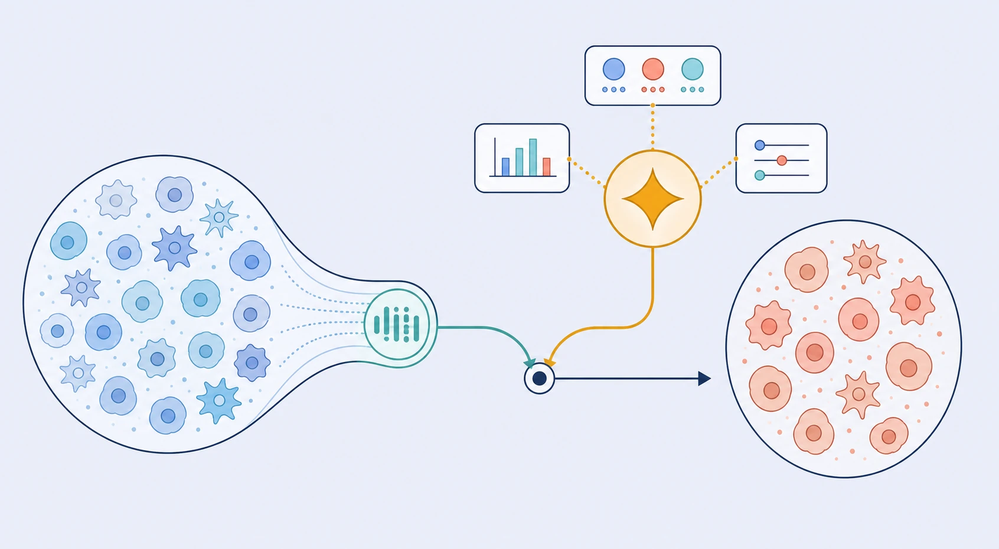

# VC2026 学习指南：用 NTC 表示背景，用生物信息表示目标

> 编写日期：2026-08-30
>
> 前置学习：[VC2026 跨背景统计基线](05-跨背景统计基线.md)
> 下一课：[VC2026 从伪批量 Delta 到 400 个单细胞原始计数](07-单细胞原始计数生成.md)
>
> 本课目标：学会把“一群匿名 NTC 细胞”和“一个待扰动基因”分别编码，再通过可解释的消融确认哪类信息真的帮助了跨背景、跨目标泛化。

## 0. 学完本课能做什么

学完后，你应该能够：

1. 解释为什么 VC2026 的背景输入是一个**细胞集合**，而不是字母 `A` 或某一行平均数；
2. 从伪批量均值、方差/分位数、状态组成，逐步走到 DeepSets 或 set encoder；
3. 从 gene symbol one-hot、目标基础表达，逐步增加蛋白嵌入、通路和网络先验；
4. 说清“基因 -> RNA -> 蛋白质”之间哪些信息相关，哪些不能等同；
5. 处理非编码 RNA、基因符号别名、多蛋白异构体和网络缺失，不在预处理时悄悄丢掉目标；
6. 设计一个 `context encoder × target encoder` 消融矩阵，用 LOCO 与目标留出区分表示能力、身份记忆和批次泄漏。

## 1. 直觉：匿名背景是一组运行中的样本，目标是一个待执行的干预

对一个软件服务，只知道“环境 A”这个名字并不会告诉你当前 CPU 负载、内存、队列和请求组成；你需要一组运行时观测。VC2026 的字母 A–F 也只是分组标签，真正的背景信息在该背景的 NTC 细胞群中。

这个软件类比只用于建立直觉。细胞不是可完全观测的机器：RNA 只是当前状态的一类读出，且与染色质、蛋白、代谢、形态以及历史状态之间没有一一对应。

对模型来说，一次预测有两类输入：

```text
背景端：该背景的 NTC 细胞集合
          -> context encoder -> z_context

目标端：目标基因的名称、基础表达和合法外部先验
          -> target encoder  -> z_target

两者融合：(z_context, z_target)
          -> 预测该背景下的 perturbation delta
```

这里的**表示（representation）**是将高维输入压缩成一组供后续模型使用的数字特征。表示中含有某个信息，不代表它已经学会该信息的因果后果。一个能准确识别细胞类型的嵌入，仍然可能无法预测敲低某基因后会发生什么。



*图 1｜背景编码器与目标编码器的信息边界。NTC set encoder 只观察新背景的未靶向细胞；target encoder 只读取训练时预先声明的基因信息。两者融合后先预测群体 `delta`，再由独立的计数生成层输出单细胞。图中模块是建模设计，不是已证实的分子机制；本图使用 HTML/CSS 确定性绘制。*



*图 2｜背景与目标两路信息的概念插画。左侧细胞形态、上方小图标和右侧群体都只是抽象符号，不代表真实 A–F 身份、蛋白结构、通路或预测结果；两路信息汇合也不表示观察性先验已经证明干预因果。本图使用 GPT Image 参考项目科学信息图风格生成，并经人工核对。*

## 2. 先理解背景端：为什么要读一群 NTC

### 2.1 一个背景中的细胞不会完全相同

同一条细胞系中，单细胞仍然可能处于不同细胞周期阶段、应激强度或代谢状态。一些差异是生物学状态，另一些则来自 RNA 分子抽样、探针效率、细胞总 UMI 和批次。所以，“背景”不只是细胞系名字，而是这次实验中可观察到的群体分布。

VC2026 每个公开背景包含 46 个 NTC guide，每个 guide 400 个细胞，合计 18,400 个 NTC 细胞。[S1] 这个集合足以让我们估计均值和部分分布结构，但不能自动区分生物背景与技术批次，也不含该背景的目标扰动真值。

### 2.2 C0：伪批量均值

最简单的背景表示是每个基因的平均归一化表达：

$$
z_c^{\mathrm{mean}}
=\frac{1}{n_c}\sum_{i=1}^{n_c}x_{c,i}.
$$

- **输入**：$n_c$ 个 NTC 细胞，每个是一条基因计数向量。
- **操作**：在预定的归一化空间中按基因求均值；或先在 guide/批次内求伪批量，再稳健聚合。
- **输出**：一条固定长度的背景向量。
- **解决的问题**：提供这个背景中哪些 RNA 整体更多、哪些更少的稳定起点。

均值是最好的第一个特征，因为它容易解释、容易复现，且很多扰动评估最终会检查群体平均变化。但它会把两个完全不同的群体压成同一行。例如，“所有细胞都中等表达基因 G”与“一半高表达、一半不表达”可能有相同均值，却对扰动有不同响应。

### 2.3 C1：方差、零比例与分位数

第二级表示保留每个基因的分布摘要：

- **方差（variance）**：细胞之间分散多大；
- **检测率/零比例**：多少细胞检测到该基因；
- **分位数（quantile）**：例如 10%、50%、90% 位置上的表达值；
- **细胞级 QC**：总 UMI、检测基因数的中位数与 IQR。

输入仍然是 NTC 集合，操作是每个基因独立统计，输出是比均值更长的向量。它能区分“中等同质”和“高低混合”，但仍然不知道多个基因是否在同一个细胞中共同变化。对万级基因直接拼接所有统计也很高维，应先使用预注册的基因集、PCA 或带正则的线性层压缩，不能根据留出真值事后挑特征。

### 2.4 C2：状态组成

**状态组成（state composition）**是一个背景内不同表达状态各占多少。这里的“状态”可以是细胞周期、应激程序或从表达中学到的软聚类，不必强行声称它是一种新细胞类型。

一条实用流程是：

1. **输入**：所有训练背景的 NTC 细胞；
2. **操作**：用训练数据拟合共享的低维空间和 $K$ 个状态原型；
3. **新背景推理**：将其 NTC 细胞分配到这些原型，最好保留软概率而不是强制硬标签；
4. **输出**：$K$ 维状态比例，可再加各状态内部的平均表达；
5. **为何需要**：同一个扰动可能对增殖中和静息细胞作用不同，均值不能说明两者比例。

最大风险是把批次聚类当成生物状态。应查看每个状态是否几乎由一个数据集、一个 guide 或一个深度区间独占，并将这些技术共变量纳入负对照。

### 2.5 C3：DeepSets 与 set encoder

**DeepSets**是一类对输入顺序不敏感的集合模型。对 NTC 细胞集合 $X_c=\{x_1,\ldots,x_n\}$，最小形式是：

$$
z_c=\rho\!\left(\operatorname{pool}_{i=1}^{n}\phi(x_i)\right).
$$

$\phi$ 先将每个细胞变成紧凑向量，`pool` 对所有细胞求均值、求和或做受控注意力聚合，$\rho$ 再生成背景表示。交换任意两个 NTC 细胞的输入顺序，$z_c$ 应保持不变；否则模型在学没有生物含义的行顺序。

**Set encoder（集合编码器）**是更宽的名称，可以用 DeepSets、Set Transformer 或其他保证/近似保证排列不变的架构。自注意力能表示“哪些状态一起出现”，但显存和计算往往随集合大小快速增长。实践中应固定每个训练 set 的细胞数，从 18,400 个 NTC 中重复抽样多个 set，并用 guide 分层防止一个 guide 独占。

STATE 的作者把对照细胞作为集合输入，用集合层面的状态转移预测扰动群体；Stack 的索引摘要则把推理时的无标签上下文细胞视为适配背景的样例。[P1][P2] 它们支持“集合是合理的模型输入单位”这个方法方向，但不保证某个预训练权重不经适配就能输出 VC2026 要求的原始计数。

## 3. 再理解目标端：一个基因到底能用什么表示

### 3.1 先补齐生物信息链：基因、RNA 和蛋白不是同一层

**Gene（基因）**是 DNA 上能产生功能性 RNA 或编码蛋白质产物的遗传区域。对于蛋白编码基因，一条简化链路是：

```text
DNA 上的基因
   |
   | 转录：细胞用 DNA 模板合成 RNA
   v
RNA 转录本
   |
   | 翻译：核糖体按编码信息合成氨基酸链
   v
蛋白质，后续还可折叠、修饰、转运和降解
```

CRISPRi 通常通过 guide 将 dCas9-KRAB 带到转录起始位点附近，使目标更难被转录。比赛 scRNA-seq 主要观测 RNA 计数，不直接测量蛋白数量或活性。因此：

- 目标 RNA 下降不意味着蛋白立刻同比例下降；
- 蛋白半衰期、翻译效率和修饰会改变时间延迟；
- 某些基因产生功能性非编码 RNA，根本没有对应蛋白序列；
- 同一基因可能有多个转录本和蛋白异构体，一个固定蛋白嵌入会丢失这种差异。

这就是为什么蛋白嵌入是有用的外部先验，但不是目标扰动效应的完整真值。

### 3.2 T0：Gene symbol one-hot

**One-hot**用长度为目标词表大小的向量表示基因：目标对应位置为 1，其余为 0。

- **输入**：经过标准化的 gene symbol 或稳定 ID。
- **操作**：查表得到可训练的目标向量。
- **输出**：模型能分辨已见目标身份。
- **为何需要**：它是一个强的身份基线，能说明外部先验是否真的超过了“记住这个名字”。

它的能力边界很清楚：两个基因的 one-hot 距离都一样，不包含通路、蛋白功能或表达相似性。对训练中从未出现的目标，没有一个已学会的专属向量可供外推。

### 3.3 T1：目标在当前 NTC 中的基础表达

对目标 $t$，从背景表示中单独取出：平均表达、检测率、方差和分位数。这是一个显式的 `context × target` 特征：它回答“在这个背景中，目标 RNA 原本是多少、在多少细胞中被检测”。

它与自身敲低上限密切相关，却不是目标生物重要性：

- 高表达不意味着敲低后一定有强下游效应；
- 低计数可能是真的低表达，也可能是当前检测效率低；
- 低表达调控因子仍可能处在关键网络位置；
- RNA 表达的共变不能单独确定扰动因果方向。

### 3.4 T2：蛋白序列嵌入

**Protein embedding（蛋白嵌入）**将氨基酸序列输入预训练蛋白模型，得到一条紧凑向量。序列相似或具有相关结构/功能的蛋白可能在表示空间中更近。VC2025 前两名的 Arc 官方摘要都提到了蛋白嵌入，因此它是值得消融的候选。[S3]

但从 gene symbol 到蛋白嵌入必须带一张可审计映射表：

| 情况 | 处理原则 |
|---|---|
| 标准蛋白编码基因 | 记录使用的数据库版本、数据库预先指定的代表性蛋白版本（canonical isoform）和序列校验和 |
| 多个蛋白异构体 | 预先固定 canonical 规则，或使用带 mask 的多异构体聚合；不按验证分数挑异构体 |
| 非编码 RNA 基因 | 蛋白特征设为缺失，保留独立缺失 mask；不伪造序列 |
| 符号无法映射或过期别名 | 先用版本化别名表核对；仍失败则记为未映射，回退其他特征 |

对缺失特征全填零却不给 mask，会让模型无法区分“没有蛋白”、“映射失败”和“真实嵌入恰好接近零”。

### 3.5 T3 与 T4：通路/网络先验和预训练基因表示

**Pathway（通路）**是一组参与某个生物过程的分子及其关系；**gene network（基因网络）**用节点表示基因，用边表示共表达、调控、蛋白互作用或其他类型的已知关系。

本课把通路与网络先验记为 T3，把大规模数据中学到的预训练基因表示记为 T4。两者来源不同，必须分开消融；T4 的维度更高不代表证据等级天然高于 T3。可用的目标特征包括：

- 通路成员的 multi-hot 向量；multi-hot 表示一个基因可以同时属于多条通路，对应多个位置同时为 1；
- 网络邻居、度、社区和图嵌入；“度”是一个节点的直接邻居数，“社区”是网络中彼此连接更密集的一组节点；
- 从大规模观察性单细胞数据学到的基因嵌入；
- 从干预数据学到、但在当前 fold 中严格排除留出真值的目标特征。

GEARS 将基因关系知识图用于新的单基因和组合扰动预测；scGPT 在大规模观察性细胞上学习基因和细胞表示，并通过微调用于包括扰动预测在内的任务；X-Cell 的本地索引摘要描述了融合文本、蛋白、网络、依赖性与形态先验的路线。[P3][P4][P5] 这些是设计先验的方法样例，不能合并成“用的模态越多，因果预测就越准”的结论。

最重要的边界是：

> 共表达、语义相似、通路共现和蛋白互作用都是因果效应的候选线索，但不能单独确定“用 CRISPRi 降低基因 T 后，基因 G 会上升多少”。

因为观察性数据中，T 和 G 可能同时被第三个过程驱动；网络边也可能没有方向、没有时间和背景信息。真正的扰动响应仍需要干预数据训练或验证。

## 4. 两个编码器怎样汇合成一个预测

第一版架构应先预测群体 `delta`，而不是一步直接生成 18,533 维的 400 个整数细胞：

$$
z_c=E_c(X_c^{\mathrm{NTC}}),
\qquad
z_t=E_t(f_t),
$$

$$
\widehat{\Delta}_{c,t}
=D\!\left[z_c,\ z_t,\ z_c\odot z_t,\ e_{c,t}^{\mathrm{basal}}\right],
\qquad
\widehat{\mu}_{c,t}=\mu_c^{\mathrm{NTC}}+\widehat{\Delta}_{c,t}.
$$

$E_c$ 是背景编码器，$E_t$ 是目标编码器，$D$ 是受正则约束的残差预测器，$e_{c,t}^{\mathrm{basal}}$ 是目标在当前 NTC 中的基础表达特征。$\odot$ 是一种工程交互特征，不宣称对应某个分子反应。

为什么先预测 `delta`？因为 NTC 已经告诉我们新背景的大部分基础表达。模型只需要学习扰动带来的变化，误差更容易按“背景估计错”、“目标效应错”和“交互错”定位。但 `delta` 依然取决于选择的归一化空间，必须与原始计数生成层分开验收。

## 5. 实际数据流程：从文件到可消融的表示

| 步骤 | 输入 | 操作 | 输出 | 为何需要 |
|---|---|---|---|---|
| 1. 锁定外层分割 | 多背景公开扰动数据 | 先定 LOCO 和目标留出，再拟合任何特征处理 | 不可更改的 fold 清单 | PCA、聚类和词表也可以泄漏 |
| 2. 审计 NTC | 每背景原始计数与 guide/批次 | 检查总 UMI、检测基因、guide 差异和异常细胞 | 带 QC 的 NTC set | 防止 encoder 主要读取质量问题 |
| 3. 建背景特征 | 只用训练 NTC 拟合的变换 | 生成 C0–C3；对 set 做分层抽样和顺序打乱 | $z_c$ 与抽样稳定性报告 | 背景表示应对细胞顺序不敏感 |
| 4. 建目标映射 | 比赛目标、训练目标和外部资源 | 固定 ID、版本、异构体、缺失 mask 与特征缓存 | 一目标一行的 T0–T4 特征表 | 避免不同运行时的映射漂移 |
| 5. 训练残差头 | 训练 context 的 NTC、target 特征和真实伪批量 `delta` | 固定输出空间，用同一 decoder 做编码器消融 | $\widehat{\Delta}_{c,t}$ | 不让更大 decoder 容量冒充更好表示 |
| 6. 仅用 NTC 推理留出背景 | 留出 context NTC 和目标特征 | 生成 $z_c,z_t$，不读留出扰动行 | 留出 `delta` 预测 | 真正模拟 VC2026 信息边界 |
| 7. 分开评估 | 留出预测与真值 | 比较 context-only、target-only、融合及计数头 | 消融成绩单 | 知道提升来自哪类信息 |

## 6. 噪声、失败模式与信息边界

### 6.1 背景编码器容易学到什么假信号

- **测序深度指纹**：如果每个数据集的总 UMI 不同，encoder 可能仅凭深度识别来源。应将深度作为显式 QC/共变量，并做深度匹配对照。
- **guide 指纹**：若训练 set 总由某一 NTC guide 组成，模型可能记住 guide 的微弱技术差异。应跨 guide 分层抽样并比较 leave-one-NTC-guide-out。
- **细胞数指纹**：求和 pooling 会把 set 大小直接编码进向量。固定大小或使用合理的均值 pooling，再单独提供已审计的细胞数。
- **行顺序**：如果打乱 NTC 行会改变预测，架构违反了集合输入的基本对称性。
- **状态组成偏差**：质控过滤可能对某种状态更严，从而改变群体比例。应按过滤前后审计状态组成。

### 6.2 目标编码器容易学到什么假信号

- **目标泄漏**：从完整扰动数据计算的 DEG 频率、效应均值或网络若包含留出 target/context 真值，就不再是先验。
- **名字错配**：过期 symbol、同名别称、大小写和物种映射错误可将目标指向另一个基因。
- **蛋白缺失非随机**：非编码基因和研究较少的基因更容易缺特征，模型可能学会“缺失 = 弱效应”。要按缺失类型分层报告。
- **网络知识偏差**：研究多的基因有更多边，高度可能反映文献热度，不只是生物中心性。
- **观察性快捷方式**：模型可能根据共表达猜中相关基因，却在真实敲低时猜错方向。必须用干预真值的 leave-target-out（LOTO，整目标留出）验证。

scGPT 论文的本地阅读材料也明确提醒，预训练本身不会自动消除批次效应。[P4] 2026 单细胞基础模型综述将表示学习、扰动建模、分布对齐和原始计数生成分成不同能力，并总结了现有 scFM 的设计与开放问题。[P6] 综述可以帮我们建候选表，具体模型在 VC2026 上的能力仍需返回原文、代码和本项目的消融验证。

## 7. 与 VC2026 的关系，以及对模型选择的影响

**官方事实**：VC2026 不公开 A–F 的细胞系身份；模型在每一轮只得到相应新背景的 NTC 和待预测目标列表，得不到这些背景的目标扰动训练真值。[S1][S2]

这给模型留下了非常具体的信息边界：

1. `A`、`B` 等字母只能用于分组和装配输出，不能承担背景语义；`context encoder` 必须从该组 NTC 推理；
2. 新背景中没有一个扰动样本可供微调，因此 encoder 必须能对 NTC 重采样保持稳定，并在整背景留出时外推；
3. 目标列表中的 gene symbol 只提供身份，不自动提供功能；未见目标能力必须来自预先登记的基础表达、蛋白、通路、网络或预训练表示；
4. NTC 表示和目标先验都不等于扰动真值，所以二者融合后的 `delta` 必须在公开多背景干预数据上验收；
5. 比赛最终需要原始单细胞计数，但表示消融应先固定一个简单 decoder，避免计数生成质量掩盖 encoder 是否真的有用。

因此，模型复杂度的增加顺序应是：先证明 C0 + T0 能超过上一课 B0 的 NTC/no-effect 基线；再分别证明更丰富的背景表示和目标先验有增益；最后才训练二者的高容量交互以及单细胞 count head。这个顺序不是比赛官方规定，而是为了让每一次升级都能被归因和回退。

## 8. `context encoder × target encoder` 消融矩阵

消融实验的原则是：**每次只改一类信息，训练数据、分割、decoder 容量、随机种子数、损失和调参预算保持一致。**

### 8.1 建议的两维网格

| 背景表示 | T0 symbol one-hot | T1 + 基础表达 | T2 + 蛋白嵌入 | T3 + 通路/网络 | T4 + 预训练基因嵌入 |
|---|---:|---:|---:|---:|---:|
| C0 伪批量均值 | 必做 | 必做 | 必做 | 必做 | 必做 |
| C1 + 方差/分位数 | 必做 | 建议 | 建议 | 候选 | 候选 |
| C2 + 状态组成 | 必做 | 建议 | 建议 | 候选 | 候选 |
| C3 DeepSets/set encoder | 必做 | 必做 | 必做 | 建议 | 建议 |

不必一开始就跑满 20 个实验。先做两条路径：

1. 固定 T0，比较 C0 -> C1 -> C2 -> C3，问“更丰富的 NTC 分布信息是否有用”；
2. 固定 C0，比较 T0 -> T1/T2/T3/T4，问“哪类目标先验真能外推”。

只有某一轴出现稳定改进后，才跑关键交叉组合。这能避免在预算不变时，同时改架构、特征和训练时长，最后无法归因。

### 8.2 分割必须同时检查两种外推

| 外层测试 | 隐藏什么 | 提供什么 | 回答的问题 |
|---|---|---|---|
| LOCO | 一个 context 的全部扰动真值 | 留出 context 的 NTC、已见 target 特征 | 背景 encoder 能否从 NTC 外推 |
| LOTO | 一组 target 在所有训练 context 的扰动真值 | 留出 target 的预先特征 | target encoder 能否超越 ID 记忆 |
| LOCO × LOTO | 新 context 中的新 target 组合，且 target 全局未见 | 新 context NTC + 目标先验 | 两个 encoder 是否能联合零样本外推 |

随机留出单细胞无法回答上述任何一个问题，因为同 context、同 target、同批次的其他细胞已经出现在训练中。也不要在 LOCO 中把留出 context 的一小部分扰动当调参集；这与 VC2026 “该背景只提供 NTC”的信息合同不符。

## 9. 可复现实践：先证明表示有用，再增加生成模型

### 9.1 固定实验合同

将每次运行写成一行配置：

```yaml
split: loco_x_loto_v1
context_features: mean                 # mean | moments | composition | deepsets
target_features: symbol                # symbol | basal | protein | network | pretrained
gene_axis_version: vcc2026_18533_v1
normalization: log1p_cpm
set_size: 256
set_sampling: stratified_by_ntc_guide
decoder: residual_mlp_2x512
loss: pseudobulk_delta_mse
seeds: [11, 29, 47]
```

同一列消融使用同一 decoder、同一参数量级别和调参预算。如果 DeepSets 版本不得不增加参数，应加一个参数量匹配的 MLP 对照，否则无法区分“集合归纳偏置”与“模型更大”。

### 9.2 抽样一个排列不变的 NTC set

```python
import numpy as np

def sample_ntc_set(cell_ids_by_guide, set_size, rng):
    guides = sorted(cell_ids_by_guide)
    chosen = []
    while len(chosen) < set_size:
        for guide in guides:
            ids = cell_ids_by_guide[guide]
            chosen.append(rng.choice(ids))
            if len(chosen) == set_size:
                break
    rng.shuffle(chosen)
    return np.asarray(chosen)
```

**输入**是某 context 按 NTC guide 分组的细胞 ID；**操作**是轮流从 guide 中抽样并打乱顺序；**输出**是固定大小的 set。这样做是为了降低一个 guide 因细胞更多而主导背景表示的风险。若公开训练数据没有 NTC guide 层级，应在数据合同中明确记录，不能虚构。

对同一 context 重复抽取多个 set，得到 $z_c^{(1)},\ldots,z_c^{(m)}$。报告这些表示与预测的方差。如果只换一批 NTC 细胞就让预测方向反转，模型不适合直接进入最终轮。

### 9.3 对目标特征做覆盖审计

```text
target_gene | stable_id | symbol_ok | protein_ok | isoform_rule
            | pathway_ok | network_ok | pretrained_ok | fallback
```

对每类特征报告 300 个比赛目标的覆盖率，并分开蛋白编码、非编码、别名映射和真正缺失。在外层 LOTO 分割前固定映射规则；特征本身可以是外部预训练的，但不能使用留出扰动结果事后选版本。

### 9.4 消融成绩单

| run | context encoder | target encoder | LOCO 中位数 | 最差 context | LOTO | LOCO × LOTO | 缺特征子集 | 预测稳定性 |
|---|---|---|---:|---:|---:|---:|---:|---:|
| C0-T0 | mean | symbol |  |  |  |  |  |  |
| C1-T0 | moments | symbol |  |  |  |  |  |  |
| C2-T0 | composition | symbol |  |  |  |  |  |  |
| C3-T0 | DeepSets | symbol |  |  |  |  |  |  |
| C0-T2 | mean | protein |  |  |  |  |  |  |
| C0-T3 | mean | pathway/network |  |  |  |  |  |  |

建议的验收顺序：

1. 先确认所有模型都超过上一课 B0，否则还没预测到扰动；
2. C1/C2/C3 必须在 LOCO 上超过 C0，才能说明均值之外的背景分布有用；
3. T2/T3/T4 必须在 LOTO 上超过 T0，才能说明先验帮助未见目标；
4. 最终候选必须在 LOCO × LOTO 上仍有改进，不能只在单轴外推上成立；
5. 所有结果必须按特征覆盖/缺失分层，并报告多随机种子和 NTC 重采样的波动。

## 10. 诊断题

某个 `DeepSets context encoder + protein embedding target encoder` 在随机留出细胞时远好于“伪批量均值 + one-hot”，但在 `LOCO × LOTO` 上没有任何改进。这个结果能证明模型已学会匿名背景与未见目标的联合泛化吗？你会优先查哪三件事？

<details>
<summary>答案：先自行作答，再展开</summary>

不能证明。随机留出细胞时，同一 context、target 和批次的其他细胞仍在训练集，复杂模型可能只是更准确地识别已见身份和技术指纹。联合留出不改进正是对这种解释的警告。

优先检查：

1. **分割和特征泄漏**：PCA/聚类、目标词表、DEG 摘要、网络或预处理是否看过外层扰动真值；
2. **身份与技术快捷方式**：打乱 NTC 顺序、匹配测序深度、整数据集留出，并检查 encoder 是否主要预测批次/guide；
3. **先验的真正外推能力**：按蛋白映射成功、非编码、异构体和网络缺失分层，并将 T2 与同参数量的随机固定嵌入对照比较。

如果复杂编码器只在随机细胞分割上领先，应保留简单基线作为当前可信方案，而不是用模型复杂度代替跨背景证据。

</details>

## 11. 来源与陈述边界

- [S1] [VC2026 官方 About the Data 本地保存页](../Official-website/About-the-Data.md)：匿名背景、46 个 NTC guide、每 guide 400 个细胞及数据合同。
- [S2] [VC2026 官方 FAQ 本地保存页](../Official-website/FAQs.md)：匿名背景信息边界、外部数据与模型使用原则。
- [S3] [Arc, *Virtual Cell Challenge 2025 Wrap-Up: Winners and Reflections*](https://arcinstitute.org/news/virtual-cell-challenge-2025-wrap-up)：前两名方法使用蛋白嵌入的官方赛后摘要；不代表本项目已复现该组件增益。
- [P1] [Adduri et al., *Predicting Cellular Responses to Perturbation across Diverse Contexts with STATE*](https://doi.org/10.1101/2025.06.26.661135)：bioRxiv 预印本；用于细胞集合层面的状态转移架构和群体分布建模思路。
- [P2] [Stack 本地阅读材料](<../references/Stack_ In-Context Learning of Single-Cell Biology.md>)：用于推理时无标签上下文细胞的方法线索；`INDEX.md` 标注原文链接、DOI 和版本待核验，本课不引用其性能数字。
- [P3] [Roohani et al., *Predicting Transcriptional Outcomes of Novel Multigene Perturbations with GEARS*](https://doi.org/10.1038/s41587-023-01905-6)：用于基因关系知识图和未见扰动的方法思路；其组合扰动任务与 VC2026 不完全相同。
- [P4] [scGPT 本地阅读材料](../references/scGPT.md)：用于观察性预训练中的基因/细胞表示、扰动微调与批次边界；本地索引仍标注其规范出处待核验。
- [P5] [X-Cell 本地阅读材料](<../references/X-Cell：通过扩散语言模型扩展跨多样细胞情境的因果扰动预测.md>)：用于多模态目标先验的方法线索；原文链接、DOI 和版本待核验，不作独立性能证据。
- [P6] [Jiang et al., *The Landscape of Single-Cell Foundation Models: Design Principles, Applications, and Open Challenges*](https://doi.org/10.20944/preprints202608.1166.v1)：2026 预印本综述，用于 scFM 表示、建模目标和开放问题的候选导航；具体模型结论应回到原始论文。
- [论文索引](../references/INDEX.md)：STATE、Stack、scGPT、GEARS、X-Cell 和 scFM 综述均已登记为采用、备选或待核验线索。

本课中，A–F 匿名背景、NTC 数量与输入限制属于**官方事实**；STATE、GEARS、scGPT 的架构或实验性描述是**作者陈述**；Stack、X-Cell 目前在本仓库中只作**出处待完整核验的方法材料**；scFM 综述是**二手导航**。C0–C3、T0–T4、融合函数、set size、特征缺失策略和消融验收规则都是**本项目的工程假设**。在公开干预真值上通过 LOCO 和 LOTO，仍然不能保证对 VC2026 隐藏 A–F 的效果，只能提供比随机细胞分割更接近任务的工程证据。
