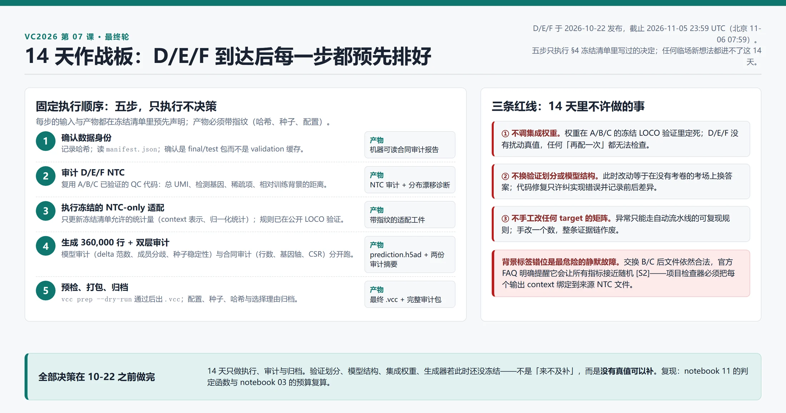

# 07｜最终轮：冻结、集成与提交

> **本课回答**：验证做完之后，怎样把方法收敛成一个可复现的最终系统，并在 D/E/F 只有 NTC、没有扰动真值的条件下完成适配、生成、审计和提交。读完你能做一件事：写出冻结清单、定好集成规则、跑完一次完整容量演练，并留下足以复现最终提交的归档。
>
> **前置**：[[第 03 课](03-State上手.md) State 上手](03-State上手.md)（LOCO 协议、预算复算与容量预演在这里）、[[第 04 课](04-你怎么知道改进是真的.md) 你怎么知道改进是真的](04-你怎么知道改进是真的.md)（噪声地板当阈值、稳定性优先于单次最高分——本课全部判据的地基）、[[第 06 课](06-其余路线全景.md) 其余路线全景](06-其余路线全景.md)（候选从哪来：B0–B3 分档与决策规则在 §7.1）。 [第 05 课](05-Stack推理时把无标签细胞当示例.md) 的 ICL 候选若进入集成，其窗口代价按该课 §4 计，本课不重复。
>
> 本课是主线（00–07）的最后一课；下一站是竞赛执行本身（`docs/research/first-submission-plan.md` 的 S0→S1→S2）。
>
> 核验日期：2026-09-18。面向熟悉软件开发和机器学习、正在补齐单细胞生物学的读者。
>
> **本课的证据性质**：数据规模、格式与提交规则来自官方资料 `[S#]`；冻结策略、集成规则、执行顺序与故障演练是**项目工程规程**（工程假设），不是 Arc 官方指定做法。论文结论 `[P#]` 未在本项目复现。


## 0. 接上一课：你现在手里有什么

到本课为止，主线的证据链是完整的：

```text
00 上届做了什么，本届差在哪
01 数据合同与首个基线        官方给了什么，什么算合法输出
02 State 模型拆解            主线模型为什么长成这样
03 State 上手                权重、LOCO、计数生成、预算
04 你怎么知道改进是真的      地板数字、六指标、消融证伪
05 Stack                    推理时示例：一条备选路线
06 其余路线全景              五种赌注、三条路线、分档决策
        |
        v
07 本课：把它们收敛成一次提交
```

本课不再引入新模型。它回答的是一个工程问题：**在看不到 D/E/F 扰动真值的条件下，怎样让已经验证过的方法对新 NTC 正确适配，并确保生成物确实来自预先选定的系统。**

## 1. 直觉解释：最终轮是一次受约束的生产发布

软件上可以把最终轮类比为生产发布：训练代码像构建流程，模型权重像发布制品，D/E/F NTC 像上线时才出现的环境输入，`.vcc` 像最终发布包。**类比的边界**：生产配置通常有确定答案，而新细胞背景的生物状态具有真实变异——即使程序完全正确，预测也可能在生物学上失败。

官方已明确三条规则 [S1][S2]：

- 最终排名只看最终测试集；
- 验证轮和最终轮使用不同细胞系、不同扰动面板和各自的参考缩放，分数不能按绝对数值直接比较；
- 最终只能选择一份作品参与奖项评选。


*图 1：最终轮证据链。D/E/F 只进入预先声明的 NTC 条件化、生成和合同审计；模型家族、LOCO 选择规则和集成权重应在最终数据进入模型前冻结。下方红色区域列出高风险做法，不表示官方额外禁止条款。图由 HTML/CSS 按数据合同确定性绘制。*


*图 2：最终轮控制室的工程直觉。雪花、检查面板和封装盒分别象征冻结候选、质量审计和归档提交，不是官方界面、评分实现或生物机制；左侧三种抽象细胞也不代表 D/E/F 的真实身份或形态。本图使用 GPT Image 参考项目科学信息图风格生成，并按单一问题定向修订后人工核对。*

最终轮中仍可以修复程序错误，但若此时才决定验证划分、模型结构或集成权重，就会在没有真值的 D/E/F 上做无法检查的选择。

## 2. 与 VC2026 的关系：不对称决策与 14 天窗口

本课这套流程之所以必要，根子在 VC2026 的**发布节奏**：A/B/C 与 D/E/F 分两批到达，而只有前者带扰动真值。

| | A/B/C（验证轮） | D/E/F（最终轮） |
|---|---|---|
| 细胞背景 | 有 | 有 |
| NTC 对照 | 有 | 有 |
| 扰动真值 | **有** | **没有** |
| 你能做的判断 | 六项指标逐项分解、逐背景分解、消融、模型选择 | 只剩 NTC 合同的正确性与生成的稳定性 |
| 能改的东西 | 架构、损失、集成权重、划分 | 只有预先声明的 NTC-only 适配 |

**这张表决定了本课的性质**：最终轮不是「再调一次模型」，而是一次**在无法验证的条件下执行已冻结决策**的过程。§4.1 的冻结清单之所以那么细，是因为它取代了真值，成为你在最终轮唯一的参照。

时间约束必须记住：D/E/F 在 **2026-10-22** 发布，截止 **2026-11-05 23:59 UTC**（北京 11-06 07:59），中间只有 **14 天**。这 14 天里没有余量去发现「验证划分其实有泄漏」或「集成权重还没有离线证据」。

**这也是[第 04 课](04-你怎么知道改进是真的.md)排在本课之前的原因。** [第 04 课](04-你怎么知道改进是真的.md) §6 的三个判据（地板阈值、确认集、真值侧重抽）都是**只能在有真值时执行**的判据；到了最终轮，它们全部失效，只剩下本课 §3.3 讲的稳定性。先学会在前一批数据上把证据做实，才能在后一批数据上正确地什么都不做。

## 3. 机制或数学对象：消融、集成与不确定性

> **配套 notebook**：[`11_ablation_and_falsification.ipynb`](../../notebook/11_ablation_and_falsification.ipynb) 与 [`03_finetuning_counts_and_budget.ipynb`](../../notebook/03_finetuning_counts_and_budget.ipynb)。§3.1「消融回答更窄的问题」与 §3.3「用稳定性而不是单次最高分选模型」的机械部分在 `11`：它把「地板当阈值」写成可调用的判定函数，并演示扫 k=6 个候选取最大值会虚高约 +1.27σ——这正是「单次最高分不可信」的量化根据。冻结清单里的输出合同与预算复算落在 `03`。
>
> **边界写清**：`11` 用的是**合成数据**，它演示判据的**机械正确性**，不是本项目的真实 LOCO 分数。「多个留出背景的稳定性」的真实数字**本机尚未产出**——它需要先跑到[第 03 课](03-State上手.md)的微调与评分环节。

### 3.1 消融回答因果上更窄的问题

**消融实验（ablation study）**是在其他条件尽量不变时，移除或替换一个组件，检查这个组件是否带来稳定增益。每一步只增加一个主要信息来源：

```text
相似背景加权 delta
        |
        + target 基础表达
        |
        + target 蛋白嵌入
        |
        + NTC set encoder
        |
        + 单细胞生成器
```

若同时替换数据、模型、损失和计数生成器，即使分数提高，也无法知道哪一部分有效——这与[第 04 课](04-你怎么知道改进是真的.md) §6 的消融 8 步表是同一条纪律，本课不重复那张表。

每个候选至少按以下切面报告，一张总分表不够：

| 切面 | 要回答的问题 |
|---|---|
| 留出背景 | 增益是否只出现在某一条细胞系？ |
| 留出目标 | 模型是记住目标 ID，还是能外推新目标？ |
| 六项指标 | 改善来自表达校准、方向、显著集合还是扰动区分？ |
| 目标效应强度 | 弱扰动是否被全部预测成零？强扰动是否幅度爆炸？ |
| 计数 QC | 总 UMI、检测基因、方差、零比例是否被破坏？ |
| 资源 | 增益是否值得训练时间、推理时间和内存成本？ |

论文可能报告某个组件在其数据上有效。例如 X-Cell 报告了架构和损失消融，也描述了只使用 NTC 的测试时适配；这些是作者在其数据与实现上的论文结论，不能直接证明同一设置会提高本项目的 VC2026 分数。[P1]

### 3.2 集成到底合并什么

**集成（ensemble）**是把多个模型的预测按预先定义的规则组合。它可能减少单模型方差，但不会自动修复共同偏差。三个可选合并层：

```text
成员 A (delta) ──┐
成员 B (delta) ──┼─[扰动 delta 层]── 加权平均 delta ──→ 共用计数生成器 ──→ 400 细胞
成员 C (delta) ──┘
成员 A (参数) ──┐
成员 B (参数) ──┼─[生成参数层]──── 合并均值/离散度 ──→ 采样 ──→ 400 细胞
成员 C (参数) ──┘
成员 A (细胞) ──┐
成员 B (细胞) ──┼─[预测细胞层]──── 各取一部分 ──→ 拼成 400 细胞
成员 C (细胞) ──┘
```

| 合并层 | 优点 | 主要风险 |
|---|---|---|
| 扰动 delta | 容易控制幅度和非负修正；所有成员共用计数生成器 | 会抹平成员预测的不同状态组成 |
| 生成参数 | 能让成员共同决定分布 | 不同模型参数语义可能并不兼容 |
| 预测细胞 | 简单，保留成员内部异质性 | 可能制造不真实的混合群体；成员库大小和稀疏度不一致 |

不建议把整数 count 矩阵逐元素平均后再四舍五入作为默认方案：这会改变零比例、方差和基因协同，「四舍五入后合法」不等于生成机制合理。

权重必须从公开真值中得到。设成员 delta 为 Δ₁, Δ₂, Δ₃，凸组合为 Δ_ens = w₁Δ₁ + w₂Δ₂ + w₃Δ₃，w_m ≥ 0 且 Σw_m = 1。权重在冻结的 LOCO 验证中选择，并检查不同留出背景是否给出相近结论；若某组权重只在一个背景最好，不应把它解释为普遍规律。

**多模型一致不等于正确**：如果成员使用相同训练数据、相同 target embedding 和相似损失，它们可能共同遗漏同一条生物通路。集成能降低独立噪声，却不能消除共同偏差。

### 3.3 用稳定性而不是单次最高分选模型

一个实用的候选选择规则：

1. 在所有预先定义的留出背景上运行相同协议；
2. 每个背景分别保存六项指标和 QC，而不是先求平均；
3. 剔除合同失败、数值不稳定或某一背景灾难性退化的候选；
4. 比较中位表现、最差背景和背景间波动；
5. 只在差异超过[第 04 课](04-你怎么知道改进是真的.md) §3 的地板阈值时，才用平均分决定排序。

「最差背景」不是机械优化最小值，而是防止平均数掩盖零样本泛化崩溃：若模型在五个背景略升、一个背景大幅为负，最终遇到类似第六个背景时风险很高。

```text
全部候选 ──→ 每个 LOCO 留出背景各跑一遍 ──→ 每背景六指标分开记录（不求平均）
                 │
                 ├─ 合同失败 / 数值不稳 / 单背景灾难性为负 ──→ 直接剔除
                 v
幸存候选 ──→ 比中位表现 · 最差背景 · 背景间波动
                 │
                 ├─ 差异 ≤ 噪声地板（第 04 课 §3）──→ 视为打平，选更简单的那个
                 └─ 差异 > 地板 ──→ 才允许按平均分排序
```

## 4. 实验或数据流程：冻结清单、完整彩排与提交 runbook



*图 3：D/E/F 到达后的固定执行顺序与禁区。每步的产物要求带指纹（哈希、种子、配置）；三条红线对应 §4.1 冻结清单的三个「不许再动」。图源 `docs/style/sources/07-final-figures.html`，HTML/CSS 确定性绘制。*

### 4.1 冻结清单：哪些东西必须在最终数据进入模型前定死

「冻结」不是把整个仓库设成只读，而是把会影响科学结论的选择写清楚：

| 对象 | 冻结内容 | 为什么 |
|---|---|---|
| 数据 | 采用的数据集、版本、许可、过滤规则、基因映射 | 防止看到新背景后临时选择更像 D/E/F 的训练来源 |
| 验证 | LOCO 划分、目标留出、六指标聚合、失败判据 | 防止换一套更偏爱当前模型的考试题 |
| 模型 | 结构、损失、权重检查点、随机种子集合 | 确认最终生成物对应已经验证的候选 |
| 表示 | context encoder、target encoder、缺失映射处理 | 防止靠猜测匿名身份手工替换表示 |
| 适配 | 哪些参数可由 NTC 更新、步数、学习率、停止规则 | D/E/F 没有扰动真值，不能现场凭成绩调参 |
| 生成 | 400 细胞的生成器、库大小抽样、稀疏阈值 | 计数层变化也会改变评分，不只是文件后处理 |
| 集成 | 成员、权重、在哪一层合并 | 避免根据最终提交反馈追逐偶然波动 |

候选从哪来：把[第 06 课](06-其余路线全景.md) §7.1 的分档决策规则跑在 A/B/C 上，产出若干通过证据门的候选与一个回退候选（通常是 B0/B1 级）。代码修复仍然允许，但必须记录修复前后差异，并证明它只纠正实现合同或已定义算法，而不是引入一个没有离线证据的新方法。

### 4.2 最终数据到达前的完整彩排

把 A/B/C 暂时当作一套「新到数据」，**不要用已缓存的中间结果**，从官方 ZIP 或解包目录重新走完整流程：

```text
controls 数据包
  -> manifest / CSV / H5AD 合同检查
  -> NTC QC 与 context 表示
  -> 预先声明的 NTC-only 适配
  -> 300 target x 3 context x 400 cells
  -> H5AD 审计
  -> vcc prep --dry-run
  -> .vcc 打包
  -> 哈希、日志、配置归档
```

彩排不是为了重新提高 A/B/C 排行榜，而是测量整条流水线的运行时间、峰值内存、临时磁盘、最终文件大小和人工操作点——预算复算用 notebook 03 的计算器对照[第 03 课](03-State上手.md)的预算方法。

### 4.3 D/E/F 到达后的固定执行顺序

到达后按五步执行（图 3）：**① 确认数据身份**（记录哈希、读 manifest、确认是 final/test 包）→ **② 审计 D/E/F NTC**（复用 A/B/C 已验证的 QC 代码）→ **③ 执行冻结的 NTC-only 适配**（只更新冻结清单允许的统计量或参数）→ **④ 生成候选并做双层审计** → **⑤ 预检、打包与归档**。

第四步的双层审计必须分开跑：

```text
模型审计（逐 target x context）
    delta 范数是否在合理区间
    目标自身表达是否被破坏
    极端基因与成员分歧
    种子稳定性（同配置换种子重跑）
                |
                v
合同审计（整包）
    360,000 行 / 18,533 列 / 每组恰好 400 行
    无 NTC / 原始非负整数 / 总计数上限
    CSR 稀疏项 / 官方基因顺序        [S1][S2]
```

输出必须来自自动流水线。人工可以审阅异常报告，但不能在表格里手改某个 target 的矩阵而不留下可复现规则。

第五步先跑预检再打包：

```bash
vcc prep prediction.h5ad \
  -g gene_names.csv \
  --perts pert_counts.csv \
  -o prediction.vcc \
  --dry-run
```

通过后再生成 `.vcc`。归档至少包括：Git commit 与 dirty-worktree 说明、数据 manifest 和输入文件哈希、模型检查点哈希、完整配置和随机种子、运行命令与起止时间、硬件和峰值资源、H5AD 与 `.vcc` 哈希、QC 摘要和 `vcc prep` 结果、最终选中作品的选择理由。官方 FAQ 说明，入围决赛者必须提交并公开如何创建获奖作品的说明 [S2]——这份归档就是方法说明的原料。

## 5. 失败与噪声：八种会毁掉一次提交的方式

彩排时要**主动注入**下列故障，确认检查器会在上传前拦截它们：

```text
[1] 交换 B/C 背景标签        -> 文件仍合法，所有指标接近随机 [S2]
[2] 使用旧轮 pert_counts.csv -> 靶点面板对不上
[3] 把 gene_names.csv 排序后写出 -> 基因轴错位
[4] 多放一行 NTC             -> 行数合同失败
[5] 把 log1p 浮点数当原始计数 -> dtype 与数值合同双失败
[6] 用 dense 数组或留大量显式零 -> 稀疏项检查失败
[7] 每个目标只生成 399 个细胞 -> 行数检查失败
[8] 失败重跑时换随机种子却沿用旧文件名 -> 归档指纹与产物不符
```

其中背景标签互换尤其危险：文件仍可能合法，官方 FAQ 明确提醒它会让所有指标接近随机，却看起来像普通模型性能差 [S2]。因此项目检查器还必须把每个输出 context 与其来源 NTC 文件和 manifest 绑定。

不确定性信号（成员间 delta 分歧、context embedding 到训练背景的最近距离、目标覆盖缺失、NTC 子样本波动、生成重复间的伪批量波动）回答的是「模型之间或输入子样本之间是否稳定」，**不是「出错概率是多少」**。若没有校准实验，不能把成员标准差 0.2 写成 20% 错误概率。它的主要用途是诊断，不是手工修改个别最终目标的借口。

## 6. 对模型的影响：何时应该退回简单模型

出现下面任一情况时，应退回最近一个通过证据门的候选：

- 复杂模型在不同留出背景的收益方向不一致；
- context 适配降低 NTC 重建损失，却恶化公开扰动预测；
- 单细胞生成器改善方差，却显著破坏六项群体指标；
- 集成只在一个背景超过最佳单模型；
- 完整生成无法在资源预算内稳定复现；
- 无法从最终 H5AD 追溯到唯一配置和检查点。

```text
出现信号 ──→ 收益方向在背景间不一致？──是──→ 回退到最近通过证据门的候选
    │否
    ├─ 适配降 NTC 重建，却恶化公开扰动预测？──是──→ 回退
    │否
    ├─ 集成只在单背景赢过最佳单模型？──是──→ 回退
    │否
    └─ 复现或追溯失败？──是──→ 回退
                            否 ↓
                按冻结清单生成并提交，异常报告进归档
```

简单、可复现且经过跨背景验证的模型，比一个只能解释训练损失、无法稳定生成完整提交的大模型更适合最终轮。这是工程风险判断，不表示简单模型在生物预测上天然更强——哪一档值得投算力，仍然由[第 06 课](06-其余路线全景.md) §7.1 的分档规则说了算。

## 7. 可复现实践：两张检查表与四件产物

### 7.1 冻结前

- [ ] 所有候选使用相同的公开数据版本和 LOCO 划分；
- [ ] 六项指标、每背景结果、QC 和资源成本齐全；
- [ ] 模型、表示、生成器和集成分别有消融；
- [ ] 最终候选与回退候选各自可从零复现；
- [ ] NTC-only 适配规则已在公开留出背景验证；
- [ ] 完整 360,000 行彩排通过；
- [ ] §5 的八种故障能被检查器发现。

### 7.2 D/E/F 到达后

- [ ] final manifest、context 和 panel 已确认；
- [ ] D/E/F NTC 合同与 QC 已完成；
- [ ] 没有猜测或硬编码匿名细胞系身份；
- [ ] 只执行冻结的 NTC-only 适配；
- [ ] 每个 `target × context` 恰好 400 个细胞；
- [ ] 基因轴、原始计数、稀疏项和总 UMI 合法；
- [ ] 模型异常与合同异常分别审计；
- [ ] `vcc prep --dry-run` 通过；
- [ ] H5AD、VCC、配置、日志和哈希一起归档；
- [ ] 上传后记录平台返回结果与最终参赛作品选择。

### 7.3 本课的四件产物

| 产物 | 在哪一节 | 形态 |
|---|---|---|
| 冻结清单 | §4.1 | 七行对象表 + 回退候选声明 |
| 候选集成策略 | §3.2–§3.3 | 合并层选择 + 凸组合权重来源 + 稳定性规则 |
| 完整容量演练 | §4.2 | 彩排流程的运行时间 / 峰值内存 / 磁盘记录 |
| 提交 runbook | §4.3 + §7.2 | 五步执行链 + 到达后检查表 + 归档清单 |

配套动手材料：notebook 11（消融判定函数、k 选最大虚高、稳定性优先的机械演示）与 notebook 03（输出合同、预算复算）。两者的边界见 §3 开头的注。

## 8. 诊断题

**题**：假设模型 M 在六个公开 LOCO 背景中的平均分高于模型 S，但 M 在其中一个背景上大幅为负；S 的平均分略低，却在所有背景都稳定为正。D/E/F 到达后，M 的 context embedding 看起来离训练背景更近。你是否应该因此直接选择 M，并用 D/E/F NTC 继续调 M 的集成权重？

<details>
<summary>先停下来回答，再看解释</summary>

不应该仅凭这些信息直接选择 M，也不应在没有扰动真值的 D/E/F 上重新调集成权重。

M 的平均分说明它在部分已知背景可能更强，但单背景灾难性失败暴露了零样本尾部风险；embedding 距离只是表示空间中的相似度，不是扰动响应正确性的证明。应按冻结前声明的选择规则（§3.3）综合平均、最差背景、指标结构和资源稳定性决定 M 或 S。若预先规则选择 M，也只能执行已经在公开 LOCO 中验证的 NTC-only 适配和固定集成；若风险规则选择 S，就不应因为 D/E/F「看起来更像」而临时翻转。模型距离可进入不确定性报告（§5），但不能代替真值。

</details>

## 9. 来源与陈述边界

### 官方与一手资料

- [S1] Arc Institute，仓库保存的 [About the Data](../Official-website/About-the-Data.md)：D/E/F 发布方式、每轮形状、H5AD 和原始计数合同；核验日期 2026-08-30。
- [S2] Arc Institute，仓库保存的 [FAQs](../Official-website/FAQs.md)：提交规则、验证与最终分数不可直接比较、背景标签错位风险、稀疏项限制和方法说明要求；核验日期 2026-08-30。

### 论文材料

- [P1] X-Cell: Scaling Causal Perturbation Prediction across Diverse Cellular Contexts，[本地阅读材料](../references/X-Cell：通过扩散语言模型扩展跨多样细胞情境的因果扰动预测.md)；用于理解作者报告的消融、留出验证和 NTC 测试时适配。具体收益是论文结论，不是本项目复现结果；规范出处状态见 [论文索引](../references/INDEX.md)。

### 主题边界

- **消融方法与证伪判据**的权威位置是[第 04 课](04-你怎么知道改进是真的.md) §4–§6，本课 §3.1 只保留「最终轮视角」的切面表。
- **候选从哪来、该投哪一档**的权威位置是[第 06 课](06-其余路线全景.md) §7.1，本课只引用其结论。
- **预算与容量**的权威位置是[第 03 课](03-State上手.md)与 notebook 03，本课只声明彩排要测量什么。
- 本文的冻结表、候选选择、集成层、不确定性诊断、故障注入和归档清单属于**项目工程规程**。它们旨在让最终提交可复现、可审计，不能保证获得特定排行榜分数。D/E/F 的真实扰动结果仍由主办方保留；任何基于 NTC 的背景距离、身份猜测或模型一致性都不能替代真实扰动验证。
