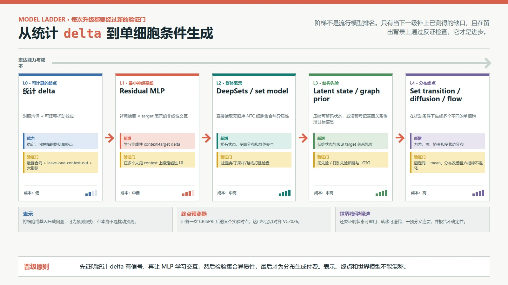
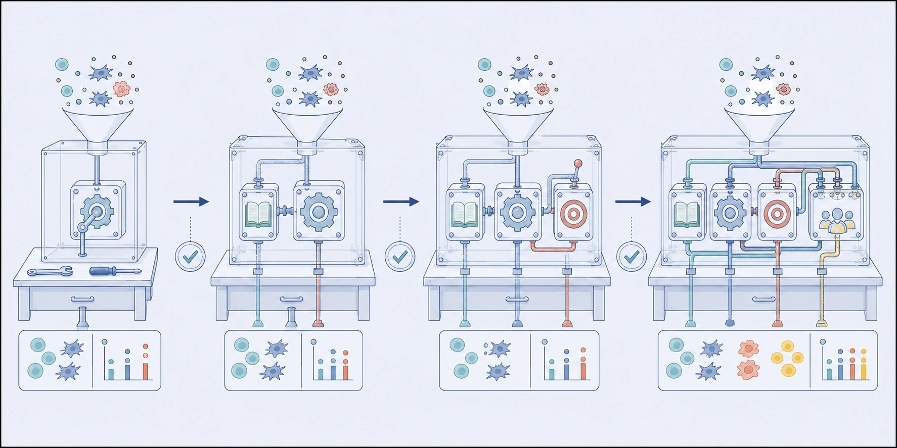

# VC2026 学习指南：神经扰动模型与能力升级门

> 编写日期：2026-08-30
>
> 前置学习：[VC2026 单细胞原始计数生成](07-单细胞原始计数生成.md)
> 下一课：[VC2026 消融、集成与最终轮运行手册](09-消融集成与最终轮.md)
>
> 本课的立场：模型名字不是学习路线。每次升级只允许增加一种必要能力，并在严格留出的细胞背景上证明这种能力值得它的数据、显存和调试成本。

## 0. 学完本课能做什么

学完后，你应该能够：

1. 区分细胞表示、扰动终点预测器和可迭代世界模型；
2. 实现一个 residual MLP（残差多层感知机）作为最小神经基线，并知道它相对统计 delta 多了什么；
3. 解释 DeepSets / set encoder 为什么适合读取无固定顺序的 NTC 细胞群；
4. 解释自编码器、CPA 式潜变量、GEARS 图先验、STATE 集合状态转移和 diffusion / flow 各自增加的能力与新的失败方式；
5. 设计一个以 `context × target` 为单位、不泄漏留出背景的消融实验；
6. 用明确的升级门决定是否需要集合模型、图先验、生成模型或大型预训练表示，而不是凭参数量选型。

本文将三类陈述分开：`[S#]` 是 Arc 官方任务与评分事实；`[P#]` 是已在 `docs/references/INDEX.md` 登记的论文或技术报告结论，不代表本项目已复现；模型阶梯、升级门和消融顺序是本项目的工程方案。



*图 1｜模型升级阶梯。每一级都必须说清新增了什么可检验能力，并用对应的留出实验过门；模型更大不是自动升级。本图为 HTML/CSS 确定性教程图，不展示任何论文的实验分数。*



*图 2｜模型工作台的工程直觉。四台装置只象征“逐级增加能力并验收”，不逐一对应某篇论文架构、真实分子机器或已经验证的性能；末级中的抽象符号也不代表具体细胞身份。本图使用 GPT Image 参考项目科学信息图风格生成，并经人工核对。*

## 1. 先分清三种对象：表示、终点预测与世界模型

### 1.1 表示不是预测

**表示（representation）**是把高维输入压成一个便于比较或下游学习的向量。例如，把 400 个 NTC 细胞压成背景向量 $z_c$，或把目标基因的蛋白序列和网络信息压成 $e_p$。

好表示可能包含细胞类型、状态或基因功能信息，但这不代表它已经学会“对这个基因做 CRISPRi 后会怎样”。VCWM roadmap 的诊断实验正是提醒：当前状态可分的表示，不必然包含未来动力学。[P8]

### 1.2 终点预测器回答一次性问题

**终点预测器（endpoint predictor）**学习：

$$
\hat X_{c,p}^{post}=f(X_c^{NTC},p),
$$

即给定当前 NTC 群体和一个目标，直接输出某个实验时点的扰动后表达。统计 delta、residual MLP、很多自编码器以及大部分比赛模型都属于这一类。它们可以是很好的 VC2026 解法。

但输出 $\hat X^{post}$ 不代表可以把这个结果当作新状态，再可靠地施加第二个扰动或向前模拟时间。

### 1.3 世界模型需要可调用、可重用的转移

**细胞世界模型（virtual cell world model, VCWM）**至少要维护可重用的细胞状态 $S_t$，并显式提供带干预的转移：

$$
S_{t+\Delta t}=T_{\Delta t}(S_t,a_t,c),
$$

其中 $a_t$ 是基因、化学或环境干预，$c$ 是生物背景。它还要在改变干预时产生连贯不同的未来，并声明不确定性或适用边界。[P8]

这个定义对本比赛的实际意义是：**VC2026 只评估一次 CRISPRi 后的单时点转录组终点。**一个专用终点预测器可能比完整世界模型更简单、更容易验证且分数更高。把所有条件生成器都称为“世界模型”，会混淆已经测试与尚未测试的能力。

## 2. 第一级：Residual MLP 是最小神经基线

### 2.1 直觉：不重建整个细胞，只学未解释的部分

**MLP（multilayer perceptron，多层感知机）**是由线性层和非线性激活组成的前馈神经网络。**Residual（残差）**表示模型不直接预测绝对表达，而是预测扰动相对 NTC 的变化：

$$
\hat\Delta_{c,p}=W_{out}\,\mathrm{MLP}([z_c;e_p;q_c]),
\qquad
\hat\mu_{c,p}=\mu_c^{NTC}+\hat\Delta_{c,p}.
$$

- $z_c$：背景摘要，起步可用 NTC 伪批量、高变基因 PCA 和状态比例；
- $e_p$：目标表示，起步可用可训练 embedding，再测试蛋白或网络先验；
- $q_c$：观测质量特征，例如 library size 分布和检测基因数；
- $\hat\Delta$：18,533 个基因的扰动残差。

软件类比上，统计 delta 像一张固定规则表，residual MLP 像用多个输入条件学一个非线性路由器。类比的边界是，神经网络的隐层不等于真实基因调控通路，它只是一个从训练数据拟合的函数。

### 2.2 生物与数学机制

残差参数化利用一个强先验：多数基因相对当前背景 NTC 不会发生巨大变化，真正需学的是目标自身和下游网络产生的稀疏或结构化变化。它不声称生物学严格可加，只是让模型的默认答案靠近当前背景，从而将容量用在扰动特异部分。

可以在 `log1p(CPM)` 或其他训练空间学 delta，但输出最终要通过上一课的 count generator 回到非负整数。“训练空间线性可加”和“原始计数可直接相加”不是同一件事。

### 2.3 训练流程：每一步的输入、操作、输出和理由

1. **输入：多背景公开 Perturb-seq。**操作：统一基因轴、目标名称和 count/log 变换，保留 study、batch、context、target。输出：来源可追溯的条件表。理由：不让基因错位或批次标签泄漏变成模型信号。
2. **输入：完整的 context 和 target 组。**操作：外层留出整个 context，内层再留出 target 调参；同一实验的细胞不跨边界。输出：接近 VC2026 的训练/验证/测试划分。理由：随机留出细胞只检验了同背景插值。
3. **输入：每个条件的 NTC 和扰动细胞。**操作：先以独立生物或实验单位做伪批量，计算 delta。输出：一行一个 `study × context × target`。理由：避免把同条件的数千个细胞当成数千次独立实验。
4. **输入：$z_c$、$e_p$与真实 delta。**操作：先用加权 MSE / Huber 学习残差，再增加方向、DE 或排序辅助损失；每次只增一项。输出：预测 delta。理由：先确认网络真正超过统计基线，再调复合损失。
5. **输入：留出 context 的 NTC 和 target。**操作：预测 delta，再用冻结的计数生成器产生单细胞。输出：合法 H5AD 与分层评估报告。理由：不让每个端点模型同时换一套生成器，从而失去可比性。

### 2.4 最小网络应该有多小

一个双层 MLP、层归一化、GELU、dropout 和线性输出层就足以当基线。先扫描 2–3 个隐层宽度，不要先扫描深度、注意力头、不同预训练模型和十几个损失权重。如果 residual MLP 无法在留出 context 上稳定超过低秩/相似背景 delta，问题更可能在数据对齐、目标表示或评估设计，而不是缺一个更大 Transformer。

## 3. 第二级：DeepSets / set encoder 让模型真正读取 NTC 群体

### 3.1 为什么 NTC 是集合而不是序列

**集合编码器（set encoder）**接收一组顺序不重要的对象。对 VC2026 而言，NTC 细胞的文件行号没有生物顺序；把行重排后，背景表示不应变。

**DeepSets** 的最小形式是：

$$
z_c=\rho\!\left(\frac{1}{n}\sum_{i=1}^{n}\phi(x_i)\right).
$$

$\phi$ 先将每个细胞编码，对所有细胞求和或平均，$\rho$ 再整合群体。这个结构天然对置换不变。Set Transformer 进一步让细胞之间相互注意，可表达“两个少数状态同时出现”这类不只是均值的信息。

### 3.2 它相对 residual MLP 真正增加了什么

residual MLP 若只读取伪批量和手工统计，其背景输入已经被人工压缩。Set encoder 可从多个单细胞学习压缩方式，理论上能使用：

- 稀有状态是否存在；
- 细胞周期、应激等群体比例；
- 同均值下不同的离散和多峰分布；
- 目标表示 $e_p$ 与背景状态之间的交互。

但“可以表达”不等于“实际使用了”。升级门必须包含三个检查：随机重排细胞后输出不变；对 NTC 子采样稳定；打乱 context 的单细胞结构但保留伪批量时，模型优势应该消失。否则更复杂的编码器可能只学了均值或批次 ID。

### 3.3 STATE 为什么比一个 set encoder 再多一步

STATE 论文的状态转移模块（State Transition, ST）以对照细胞集合和扰动标签为输入，用细胞间自注意力输出扰动后细胞集合，并使用 MMD（maximum mean discrepancy，最大均值差异）比较预测与真实群体分布。它可直接在表达空间工作，也可先用状态嵌入模块编码、再解码回基因表达。[P1]

MMD 可以先直观理解为“选一组非线性探针，让两群样本在这些探针下的平均响应接近”。它比只对伪批量均值更能感受分布差异，但结果取决于核函数、集合大小和训练数据。STATE 的论文自报性能不是它已适配 VC2026 原始计数合同的证据，必须另做数据、权重、许可和输出 QA。

## 4. 第三级：潜变量模型、图先验与分布生成

### 4.1 Autoencoder / CPA 式潜变量：先学一个低维细胞状态

**自编码器（autoencoder, AE）**用编码器 $E$ 将表达 $x$ 压到潜状态 $z$，再用解码器 $D$ 重建：

$$
z=E(x),\qquad \hat x=D(z).
$$

CPA 式思路再将基础状态、扰动、剂量和协变量的潜在效应组合后解码。在本课中，“CPA 式”只指这种组合式潜变量设计；`INDEX.md` 尚未为 CPA 登记独立一手条目，因此不在这里引用其具体数值结论。STATE 阅读材料仅记录它作为论文中的自编码器基线之一。[P1]

**新增能力**：将高维计数压到较平滑状态空间，可在潜空间分解扰动与协变量，再用 NB 等计数似然解码。

**代价与失败**：潜因子不可识别，“扰动分量”可能吸收批次信号；强解码器可能忽略潜变量；组合式可加是架构偏置，不是已知生物定律。对 VC2026，需检查输出能否稳定回到 18,533 个原始计数，而不只是潜空间距离更好看。

### 4.2 GEARS：把基因关系图当作目标先验

**基因关系图（gene relation graph）**把基因当作节点，把共表达、通路、蛋白互作用或其他证据当作边。GEARS 将这类图先验与深度模型结合，目标是将已观测基因的知识传到未观测单基因或多基因扰动。其正式论文的主问题强调新的多基因扰动和遗传互作，与 VC2026 的单基因、新背景任务只部分重合。[P2]

**新增能力**：对训练中未见目标，不再只依赖一个孤立 ID embedding，可从邻近基因传播信息。

**代价与失败**：图会混合多种证据和细胞背景，通用关系不代表在当前匿名背景中活跃；图的稠密度、方向和数据时间都可能导入偏差。必须与随机度保持图、打乱基因图和无图目标表示做消融，并且只在未见 target 与未见 context 的交集上判断价值。

VCWM roadmap 还对 GEARS 做了一个状态空间闭包诊断：将一次预测当作新输入再施加第二个扰动，表现差于直接预测组合扰动。这个结果支持“优秀终点预测不自动是可迭代世界模型”，但它是该 roadmap 的特定诊断设定，不是对 GEARS 所有用途的否定。[P8]

### 4.3 Diffusion 与 flow：学整个条件分布，而不只是一个均值

**扩散模型（diffusion model）**在训练中构造从数据到噪声或掩码状态的逐步过程，学习如何在 context 和 target 条件下逆转它；**流匹配（flow matching）**学习一个连续向量场，把简单起始分布沿路径运送到目标细胞分布。

两者都可生成多个不同细胞，理论上能表达多峰、协方差和复杂状态转移；但它们不会因为“是生成模型”就自动产生非负整数，也不会自动遵守稀疏存储上限。连续表达空间的输出仍需计数解码或上一课的生成层。

已登记材料中的几条路线可用来建立能力地图，但不能直接当成本项目结论：

- **Lingshu-Cell** 的本地材料描述了面向约 18,000 基因的掩码离散扩散，条件生成身份与扰动后细胞。[P3]
- **X-Cell** 的本地材料描述了大规模 CRISPRi 语料上的扩散语言模型，并融合文本、蛋白、网络和依赖性等先验。[P4]
- **AlphaCell** 的本地材料描述了全基因组潜空间、知识解码器和条件流匹配，强调连续状态转移。[P5]
- **AIDO Cell v1** 技术报告将持久状态、连续扰动、分支轨迹和多模态读出组合成更广的模拟系统。这个范围显著超出 VC2026 的单步 RNA 计数终点。[P6]

上述条目在 `INDEX.md` 中都保留了“作者报告或本地阅读材料不等于本项目复现”的边界。对原文链接、版本或代码许可尚待核验的条目，不应进入最终实现依赖，直到完成核验。

## 5. 基础模型的位置：候选表示层，不是默认答案

**单细胞基础模型（single-cell foundation model, scFM）**通常先在大量观察性或扰动细胞上预训练，再迁移到下游任务。scGPT、STATE 的状态嵌入、X-Cell 的大规模扰动训练都体现了不同路线；但“在更多细胞上预训练”和“学会了未见背景中的 CRISPRi 因果效应”不是同一命题。

2026 scFM 综述将数据表示、架构、预训练任务、下游评估、生物可信度和泛化列为需分开考察的设计问题；它是候选导航，不是任意具体模型性能的一手证据。[P7]

因此基础模型的正确消融位置是：

```text
相同 residual MLP 和训练协议
  A. 伪批量/PCA 背景 + 可训练 target embedding
  B. 冻结预训练细胞表示 + 相同 target embedding
  C. 相同背景表示 + 冻结预训练 target 表示
  D. B + C
```

只有 B/C/D 在多个留出 context 上稳定超过 A，且改善来自多个扰动而不是一小群训练集近邻，才有理由付出大模型的推理和对齐成本。

## 6. 模型升级门：每一级都要有反证条件

| 等级 | 候选模型 | 新增能力 | 必须通过的门 | 达不到时的处置 |
|---|---|---|---|---|
| L0 | NTC/no-effect / 全局 delta / 低秩 delta | 无，定义起点 | 数据合同、六指标、留出 context 流水线都可复现 | 不训神经网络，先修评估 |
| L1 | Residual MLP | context-target 非线性交互 | 在多个留出 context 上超过 L0，参数和种子稳定 | 回到特征、损失和数据对齐 |
| L2 | DeepSets / set encoder | 利用 NTC 群体异质性 | 超过同维手工摘要；通过置换、子采样和结构打乱检查 | 保留 L1，不以更大 set model 硬凑 |
| L3 | 潜变量或图先验 | 可解码低维状态，或未见 target 知识传播 | 无先验/打乱先验消融；未见 target × context 交集提升 | 删除没有证据的先验 |
| L4 | STATE 式集合转移 / diffusion / flow | 直接学习扰动后单细胞分布 | 在冻结相同伪批量下，改善方差、零、协变和状态，且不伤害六指标 | 使用 L1/L2 + 简单计数生成器 |
| L5 | 候选 VCWM | 可重用状态、干预条件转移和 rollout | 多步转移、改变干预的分叉未来、不确定性/不覆盖报告 | 称为终点预测器，不做过度声称 |

每个门都应预先写下“什么结果会推翻升级”。例如，set encoder 若在结构打乱后仍有全部增益，说明增益不能归因于细胞异质性；若只在随机细胞分割上有增益，则不支持 VC2026 跨背景泛化。

## 7. 消融顺序：一次只问一个问题

推荐按下列顺序实验，每一行继承上一行的数据、划分、种子和计数生成器：

1. `B0`：当前背景 NTC/no-effect，不预测扰动；
2. `B1`：训练背景全局 target delta；
3. `B2`：相似背景加权或低秩 target-context delta；
4. `N1`：伪批量 context + 可训练 target embedding 的 residual MLP；
5. `N2`：冻结 MLP，只将可训练 target embedding 换成蛋白/知识表示；
6. `N3`：冻结 target 路径，只将伪批量 context 换成 DeepSets；
7. `N4`：在 N3 上加入图先验，并同时跑打乱图对照；
8. `N5`：保留相同 context/target 表示，换成潜变量解码器；
9. `G1`：保留相同伪批量终点，比较模板/NB/DM 生成；
10. `G2`：只在 G1 证明分布指标尚有稳定缺口时，再评估 STATE 式 set transition、diffusion 或 flow。

不应在 `N1 -> N2` 时同时更换数据集、context encoder、损失、学习率和生成器。那会产生一个也许分数更高、却不知道为什么的系统。

## 8. 主要噪声与失败模式

### 8.1 Context ID 记忆伪装成 context 理解

训练数据中的细胞系名、study 或 batch 几乎可以唯一标识 context。若把这些 ID 作为可训练 embedding，模型可以记住已见背景，却无法为匿名 D/E/F 创建有意义表示。外层 leave-one-context-out 是最低要求，且推理路径必须只使用 NTC 中在比赛时可见的特征。

### 8.2 Target embedding 记住扰动而不能外推

可训练 target ID embedding 对已见目标插值有用，对未见 target 没有自然定义。蛋白序列、通路和基因图可提供外推路径，但必须在严格未见 target 上评估；否则大 embedding 表只是查表器。

### 8.3 跨数据集的技术差异被学成扰动效应

测序化学、基因面板、捕获深度、扰动时长、CRISPRi/KO 和 guide 设计都可能同时随 study 变化。把 study 一键“去批次”也不安全，因为它可能删除真实 context 信号。要分开报告同 study 跨 context、跨 study 同类 context 和完全外部数据的结果，不用一个总平均掩盖域转移失败。

### 8.4 伪重复和错误置信

数百个同条件细胞共享 target、context 和实验过程。训练损失可以在单细胞上计算，但数据分割、显著性和不确定性不能假设这些行是完全独立的生物重复。比赛中每个扰动的 400 个细胞是分布样本，不是 400 个独立的扰动实验。

### 8.5 保守塌缩

高维输出中，预测接近 NTC 可以降低大量不变基因的误差，但会压小扰动特异 delta。X-Cell 本地材料将这种现象称为保守塌缩，并报告其方法在作者数据上有所缓解。[P4] 对本项目，应用 delta 范数、方向、DEG 数、PDS 和表达误差一起诊断，不能只用一个方向相关系数判定模型学会了效应幅度。

## 9. 与 VC2026 的关系和对模型的影响

VC2026 对 A–F 都要求新背景泛化，所有待评分的 `context × target` 组合在该背景中都没有扰动真值；但某个 target 是否在公共数据的其他背景中出现过，因训练数据而异。因此不应用一个模型一次承担所有未知：端点模型先负责可迁移 delta，context encoder 只在证明单细胞结构有额外信息后升级，count generator 则用独立消融负责观测分布。这种拆分让失败可定位：若伪批量已错，修 target/context 路径；若均值对但方差错，修生成层；若只在已见背景有效，修划分、数据对齐和背景表示。直接跳到基础模型会把这三类误差重新混在一起。

## 10. 一个可复现的课后实践

### 10.1 实验问题

> 在完整留出 context 时，DeepSets 读取 NTC 单细胞是否比等维伪批量摘要提供了额外、可复现的扰动预测信息？

这一问题足够小，又直接决定是否值得进入 STATE 式集合转移。

### 10.2 五个模型

```text
M0  低秩/相似背景统计 delta
M1  residual MLP(伪批量 + 手工分布摘要, target embedding)
M2  residual MLP(DeepSets(NTC cells), target embedding)
M3a 与 M2 相同，但在每个基因内独立置换细胞；保留逐基因边缘分布，破坏细胞内协方差，但不保留原始行和
M3b 与 M2 相同，但按原始每行 library size，从同一伪批量 composition 独立做 multinomial 采样；精确保留行和分布，移除状态和基因协方差
```

M3a 和 M3b 是两种边界清楚的负对照。普通逐基因置换不能同时保留每行总量，所以不能笼统声称“打乱结构但其他统计全不变”。如果 M2 对这两种对照都没有稳定优势，就不能声称模型利用了单细胞联合结构。

### 10.3 固定项与评估

- 固定公开数据版本、基因映射、外层 context 划分和内层 target 划分；
- M1/M2/M3a/M3b 使用相同参数数量级、target embedding、优化器、损失和训练步数；
- 每次从 NTC 抽取 256 或 400 个细胞作为一个 bag，训练和测试都运行多个 bag 种子；
- 对伪批量 delta 报告 cosine、MAE、方向和前 DE 基因；
- 用完全相同的计数生成器输出 400 个细胞，报告 VC2026 六项指标；
- 报告每个留出 context、每个种子和每个扰动的分布，不只报总平均；
- 记录参数量、训练 GPU 时、推理峰值显存和完整轮生成时间。

### 10.4 晋级标准

M2 只在下列条件同时成立时取代 M1：

1. 在大多数而不是单一留出 context 上改善；
2. 在 5 个以上种子中改善大于 bag 抽样噪声；
3. 优势相对 M3a 与 M3b 都存在：不能只靠逐基因边缘分布或 library-size 分布解释；
4. 优势出现在未见 target 上，不只是训练目标近邻；
5. 原始计数合同、伪批量幅度和六项主指标没有被牺牲；
6. 计算成本仍能支持最终数据到达后的完整重跑和容量演练。

## 11. 诊断题

一个 Set Transformer 在“随机拆分单细胞”的测试集上明显超过 residual MLP，但在“留出整个细胞背景”时不再超过。能否据此说它学会了 VC2026 所需的背景异质性？下一步应该做什么？

<details>
<summary>答案：先自己作答，再展开</summary>

不能。随机拆细胞时，训练和测试会共享同一 context、study、batch 乃至同一扰动条件的细胞。Set Transformer 可能只记住了这些分布指纹，而不是学到可迁移的 `target × context` 规律。VC2026 的核心是对新 D/E/F 背景的零样本外推，因此留出完整 context 的失败直接否决了当前升级声称。

下一步先不应换更大模型。应在原划分上运行三类诊断：（1）将 set encoder 与参数量和输入维度匹配的伪批量 MLP 比较；（2）重排细胞、改变 NTC 子采样并打乱单细胞联合结构，看优势来自哪里；（3）检查 study/batch/library-size 信号是否在留出背景中发生域转移。若仍无增益，保留 residual MLP，将精力投向数据对齐、target 表示和更多独立扰动背景。

</details>

## 12. 来源与陈述边界

- [S1] [VC2026 官方 About the Data 本地保存页](../Official-website/About-the-Data.md)：未知背景 NTC + target 到 400 个扰动细胞的任务、无挑战赛专用训练集和原始计数输出合同。
- [S2] [VC2026 官方 FAQ 本地保存页](../Official-website/FAQs.md)：`cell-eval2/vcc2026` 六项指标、参考缩放和最终轮只在 D/E/F 评分的官方规则。
- [P1] [STATE: Predicting Cellular Responses to Perturbation across Diverse Contexts](https://doi.org/10.1101/2025.06.26.661135)，以及[本地中文阅读材料](<../references/使用 STATE 预测多样化情境下细胞对扰动的响应.md>)：状态嵌入、细胞集合自注意力、集合转移和 MMD 损失。数值性能是论文作者报告，本项目尚未复现。
- [P2] [GEARS: Predicting Transcriptional Outcomes of Novel Multigene Perturbations](https://doi.org/10.1038/s41587-023-01905-6)：基因关系图增强未见单/多基因扰动预测的一手方法来源；`INDEX.md` 将它标为 VC2026 后续基线候选，其组合扰动主问题与本比赛不完全一致。
- [P3] [Lingshu-Cell 本地阅读材料](<../references/Lingshu-Cell：面向虚拟细胞的转录组建模生成式细胞世界模型.md>)：掩码离散扩散与全转录组条件生成；原文链接、版本与复现成本仍待核验。
- [P4] [X-Cell 本地阅读材料](<../references/X-Cell：通过扩散语言模型扩展跨多样细胞情境的因果扰动预测.md>)：大规模 CRISPRi 扰动训练、多模态先验和保守塌缩诊断；本地材料的自报性能不是本项目验证。
- [P5] [AlphaCell 本地阅读材料](<../references/迈向构建 AlphaCell 世界模型：模拟扰动诱导的细胞动力学.md>)：全基因组潜空间、知识解码器和条件流匹配；出处与复现成本待核验。
- [P6] [AIDO Cell v1 技术报告机器转换阅读版](../references/aido-cell-v1/aido-cell-v1.md)：持久状态、连续扰动、分支轨迹和多模态读出；为作者一手技术报告，具体能力仍需代码、数据与独立评估核验。
- [P7] [The Landscape of Single-Cell Foundation Models](https://doi.org/10.20944/preprints202608.1166.v1)，以及[本地机器转换阅读版](../references/jiang-et-al-2026-scfm-landscape-v1/jiang-et-al-2026-scfm-landscape-v1.md)：scFM 的数据、架构、预训练、下游评估与开放问题导航；综述不替代具体方法原文。
- [P8] [What Makes a Virtual Cell a World Model?](https://doi.org/10.21203/rs.3.rs-10404367/v1)，以及[本地机器转换阅读版](../references/yu-et-al-2026-vcwm-roadmap-v1/yu-et-al-2026-vcwm-roadmap-v1.md)：表示与动力学、终点预测与干预闭包的边界，以及 GEARS 迭代状态诊断。该文的三个诊断实验是动机性证据，不是完整领域 benchmark。

本课对 residual MLP、DeepSets、潜变量、图先验与生成模型的排序属于本项目的工程路线，不是 Arc 官方推荐的唯一顺序。STATE、GEARS、Lingshu-Cell、X-Cell、AlphaCell 和 AIDO Cell 的具体结果一律视为论文或技术报告作者结论，在完成严格的数据、许可、代码、原始计数输出和 leave-one-context-out 复现前，不能作为 VC2026 模型选型事实。
