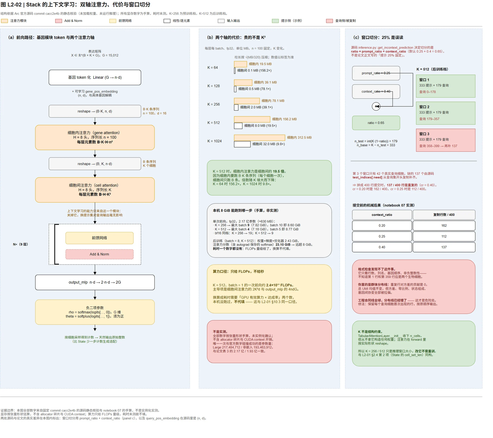

# L2-02｜Stack 与上下文学习：让无标签细胞充当示例

> 本课回答：Stack 为什么不需要为每个任务重训——它怎样把「示例细胞」变成输入的一部分，这个设计的代价是什么，以及它在本赛合同下哪里会直接失效。
>
> 前置课程：[L1-01 领域地图与五种赌注](L1-01-领域地图与五种赌注.md)、[第 04 课：你怎么知道改进是真的](04-你怎么知道改进是真的.md)、[L2-01 State 模型深潜](02-State模型拆解.md)
> 下一课：[`L2-03`](L2-03-基础模型路线.md)，阅读顺序见 [README.md](README.md)
> 课程索引与主题归属：[README.md](README.md)
>
> 核验日期：2026-09-17。面向熟悉软件开发和机器学习、正在补齐单细胞生物学的读者。
>
> 本文是**源码与论文对照阅读**的结果：全部结构、维度、窗口切分与计划表都取自固定 commit 的官方仓库与已发布配置（静态核验）；论文结论一律标 `[P]`，**未在本项目复现**。本机**未安装 Stack、未下载权重、未运行推理**，因此本文的显存与算力数字**全部是手算**，并显式标为工程假设；**耗时一个数字都没有**。

**一句话概括：Stack 把「学一个扰动任务」换成了「看几个例子，然后照做」——推理时把一批细胞和它们的标签一起放进输入，模型通过细胞间注意力从这批例子里取信息，于是同一个权重可以不做任何调整就切到新任务、新细胞系、甚至新物种。** 这个决定带来两个后果：它可能绕开「新背景只有 NTC」的死结，也可能因为这个死结而完全用不上——本课 §7 就是讲清它到底落在哪一边。



*图：(a) 前向路径与两个注意力轴；(b) 两个轴的显存代价对比与 8 GiB 边界；(c) 窗口切分公式与查询细胞被复制的后果。所有数字来自固定 commit `cacc2e4b` 的源码静态核验与 notebook 07 的手算，**不是实例化实测**；图上每个数字的来源与证据等级见 `docs/style/prompts/L2-02-stack-icl-facts.md`。*

---

## 1. 它赌什么

**它属于 [L1-01](L1-01-领域地图与五种赌注.md) §2.4 的「表征预训练」赌注**，但把这一注押得比同族（scGPT、scBaseCount、AIDO Cell）更极端。核心假设是一句话：

> 不需要为每个任务学一套参数，也不需要显式的任务标签。只要把「示例」和「待预测对象」放进同一个上下文，一个在 1.49 亿细胞上预训练过的通用模型就能在推理时推断出这个任务是什么。

Stack 把这个假设拆成三个更具体的赌：

| 赌 | 具体内容 | 如果赌错了会怎样 |
|---|---|---|
| **赌任务可以从例子里读出来** | 「把 A 细胞系变成 B 细胞系」「敲掉某个基因会怎样」这类任务信息，可以由一批**带标签的细胞**隐式表达，不需要任何任务名、不更新任何参数 | 上下文学习退化成条件编码器；换成新任务就必须微调，`n_cells` 级别的灵活性消失 |
| **赌基因模块可以自学** | 不导入 GO、基因共表达或文本嵌入，用 `Linear(G, n_hidden × token_dim)` 把每个基因的独立表达值直接学成 `n=100` 个 token。基因的语义从数据里涌现 | 需要外部基因知识；未见基因只能靠相似性外推，泛化面变窄 |
| **赌「零样本」可以花推理算力买** | 允许推理时把已扰动细胞也放进上下文（这是上下文学习的**前提**），用推理成本换掉训练成本 | 一旦「已扰动细胞不可得」，这个模型在本赛的核心机制就没有输入 |

**与 L2-01 State 的关键分野：** State 赌「条件化生成」——把背景与扰动编码成条件，直接生成目标分布；Stack 赌「上下文推断」——把示例直接摆到模型面前。前者学的是 `p(细胞 | 背景, 扰动)`，后者学的是「给我看几个 `(细胞, 标签)` 对，我推断这个映射」。

**官方对 Stack 的规模说明：** 论文报告预训练语料为 **1.49 亿个人类单细胞**，后训练（对齐）阶段另有约 **5,500 万细胞**（[P1]，见 §5）。Stack 与 State 并列被官方 FAQ 允许用于比赛（参赛使用代码视为 Non-Commercial Purpose，仍须遵守适用代码许可；商业参赛者使用预训练权重需相应商业许可）`[S2]`。本项目首投**暂不依赖 Stack**，这是实施优先级决定，不是法律判断。

### 1.1 什么时候它一定会输

三条，其中第一条是本课最重要的一条：

1. **上下文里必须已经有「被扰动过的细胞」。** 这是 Stack 能工作的机制前提，不是可选配置。本赛合同给新背景的只有 NTC（非靶向对照）和靶基因名字（[S3]）——**没有该靶点在该背景里的任何扰动真值**。所以 Stack 的「跨背景零样本」在本赛上不能按原样使用，必须把标签来源换掉（见 §7 第 1 项，那是本课真正的输出）。
2. **上下文窗口里的示例数量会被显存和序列长度卡住。** 细胞间注意力的代价是 `O(K²)`，而细胞内注意力的代价是 `O(K·n²)`——后者在 `K=512` 时反而是前者的 **19.5 倍**（[notebook 07](../../notebook/07_stack_icl_context.ipynb) 实测计算）。想「多放点例子来提高准确率」不是免费的。
3. **它仍然属于「表征预训练」赌注，因此继承这一族的天花板判据。** [L1-01](L1-01-领域地图与五种赌注.md) §2.4 列出的三条独立基准工作（Ahlmann-Eltze 等、Csendes 等、PerturBench）都报告：**在本任务上，大规模预训练表征的收益经常是负的，没有一个深度模型稳定优于相应的简单基线。** Stack 的上下文学习是一次绕过这个判据的尝试（因为它不用微调、不学固定任务头），但**它并没有被那三个基准检验过**——那三篇比的是 scGPT、scFoundation 一类表征模型，不是 ICL 模型。这是本课必须写明的证据缺口，不能当作「Stack 已经证明了它不适用」。

---

## 2. 输入输出契约

### 2.1 张量形状：一个细胞是一个 token

Stack 的输入是一批**细胞集**（cell set），每个细胞集内部再切成**基因模块 token**：

| 张量 | 形状 | 含义 |
|---|---|---|
| 输入表达 | `B × K × G` | `B` 个细胞集，每个 `K` 个细胞，每个细胞 `G` 个基因的（归一化）表达 |
| token 化后 | `B × K × n × d` | 每个细胞的 `G` 维向量被投影成 `n` 个 token，每个 `d` 维 |
| 注意力输入 | `(B·K) × n × d` → `B × K × (n·d)` | 细胞内注意力在 `(B·K)` 条长度 `n` 的序列上跑；再 reshape 成细胞序列 |
| NB 输出 | `B × K × 2G` | 每细胞 2 个参数 × `G` 个基因（负二项分布的 `rho` 与 `theta`） |

**这是与 State 完全相反的组织方式。** State 里**一个细胞是一个 token**（[L2-01](02-State模型拆解.md) §2.1）；Stack 里**一个细胞是一段长度为 `n` 的 token 序列**，细胞才是外层。所以 State 的注意力在「细胞之间」，Stack 的注意力**在两个轴上都有**——这就是下一节的主角。

### 2.2 两套维度，别合并成一句话

| 量 | Stack-Large（预训练档） | Stack-Large-Aligned（后训练档） | 本赛 2026 合同 |
|---|---|---|---|
| 基因数 `G` | 15,012（统一基因名单上限） | 同左 | **18,533** |
| 基因模块 token 数 `n` | 100 | 100 | — |
| token 维 `d` | 16 | 16 | — |
| 层数 | 9 | 9 | — |
| 细胞内注意力头数 | 8（源码硬编码） | 8 | — |
| 细胞间注意力头数 | 8（配置 `n_heads`） | 8 | — |
| **细胞集大小 `K`** | **256**（`bc_large.yaml`） | **512**（`ft_parsecg.yaml`） | **每靶点 400 个细胞** |
| 输出 | 负二项分布参数（`rho`, `theta`） | 同左 | **非负整数 counts** |

左两列都是官方事实（[S1] 两份 YAML 配置）。**预训练与后训练用的是两套 `K`**，这一点在 §2.3 会被证明只是推理窗口大小，不是结构约束。`G=15,012` 与 `18,533` 的差额是本赛必须处理的基因轴适配（§7 第 4 项）。

### 2.3 一个反直觉的细节：`K` 不是结构约束

`TabularAttentionLayer.__init__` 收下 `n_cells` 参数，但**从头到尾没有用它构造任何权重**——注意力在 `forward()` 里按实际形状 reshape（[S1] `modules/attention.py`）。所以：

> **`K = 256` 与 `K = 512` 只是「推理时一个窗口放几个细胞」，改它不需要重训。**

这与 [L2-01](02-State模型拆解.md) §2.4 第 2 项（State 的 `cell_set_len` 与权重形状无关）**完全同构**。两课合起来给出一条贯穿本项目的操作规则：

> **看到「集合大小 / 上下文长度」这类数字时，先分清它是「结构约束」（写进权重形状）还是「运行时窗口」（只在 `forward` 里生效）。前者改不了，后者随便改。**

但「能改」不等于「没有代价」：论文报告集合大小会影响验证损失（[P1]，与 State 那份消融同构），而 §3.4 会说明改 `K` 会直接改变注意力显存。

---

## 3. 架构：双轴表格注意力

### 3.1 三个部分

```text
表达矩阵 (B, K, G)
   └─ 基因 token 化：Linear(G → n·d) + 可学习 gene_pos_embedding (n, d)
        └─ reshape → (B·K, n, d)
             └─ 细胞内注意力（在 n 个 token 上，逐细胞独立）
                  └─ reshape → (B, K, n·d)
                       └─ 细胞间注意力（在 K 个细胞上，逐细胞集独立）
                            └─ × 9 层（每层两个注意力 + FFN + LayerNorm）
                                 └─ output_mlp: n·d → 2·n·d → 2G
                                      └─ 负二项参数 (rho, theta)
```

### 3.2 基因 token 化：为什么不用外部基因知识

`Stack` 用一个线性层把 `G` 维表达向量投到 `n·d = 1,600` 维，再 reshape 成 `n=100` 个 `d=16` 的 token，并加上一个**可学习的** `gene_pos_embedding (n, d)`（[S1] `models/core/base.py` 的 `__init__`）。

三点值得注意：

1. **完全端到端**，不导入 GO 术语、基因共表达网络或文本嵌入。基因之间的功能关系只能从「哪些基因在不同细胞里一起变」里学。
2. **`gene_pos_embedding` 给的是「第几个 token」的身份，不是基因的身份。** 它是一个 `(n, d)` 的可学习表，与具体基因解耦——基因的语义被压进了 `Linear` 的权重里。这与 State 的 one-hot 靶点嵌入是两种不同的「身份表示」思路。
3. **`n=100` 是一个固定的分块数，不是「每个基因一个 token」。** 15,012 个基因被压进 100 个 token，平均每个 token 承载 150 个基因的信息。这个压缩是 Stack 能在有限序列长度里处理全基因表达的原因，也是它可能丢信息的环节。

### 3.3 双轴注意力：本课最该记住的一张表

`TabularAttentionLayer.forward` 依次做两次注意力（[S1]）：

| 轴 | 张量形状 | 元素数（一层） | 跑的序列数 | 直观含义 |
|---|---|---|---|---|
| **细胞内**（gene attention） | `(B·K, H_cell, n, n)` | `B·K·H·n²` | `B·K` 条 | 一个细胞内部的基因模块之间怎么互相影响 |
| **细胞间**（cell attention） | `(B, H_gene, K, K)` | `B·H·K²` | `B` 条 | 一个细胞集内部的细胞之间怎么互相影响 |

**反直觉点在这里：** 直觉上「序列长度 100 比 512 便宜得多」，于是很容易认为细胞内注意力是次要项。但细胞内注意力要对 **`K` 个细胞各跑一次**，元素数是 `K·n²` 而不是 `n²`；细胞间注意力只跑 `B` 次，是 `K²`。代入 `n=100`、`K=512`：

```text
细胞内：K·n² = 512 × 10,000  = 5,120,000
细胞间：K²   = 512²          =   262,144
                              倍数 ≈ 19.5
```

**细胞内注意力在 `K=512` 时约为细胞间注意力的 19.5 倍。** 完整扫描（batch=1, fp32, 每层, 单位 MB）：

| `K` | 细胞内 / 层 | 细胞间 / 层 | 倍数 |
|---|---|---|---|
| 64 | 19.5 | 0.1 | 156.2× |
| 128 | 39.1 | 0.5 | 78.1× |
| 256 | 78.1 | 2.0 | 39.1× |
| 512 | 156.2 | 8.0 | **19.5×** |
| 1024 | 312.5 | 32.0 | 9.8× |

（以上为 [notebook 07](../../notebook/07_stack_icl_context.ipynb) 的实测计算输出。）

**这条结论的操作价值：** 想通过「扩大上下文窗口放更多示例」来提升效果时，先算的应该是 `K·n²` 这一项，而不是 `K²`。而且注意倍数随 `K` 增大而**下降**——因为 `K·n²` 对 `K` 线性、`K²` 对 `K` 二次。所以窗口越大，细胞间注意力（也就是上下文学习的机制所在）的成本占比越高，细胞内注意力反而相对便宜。

### 3.4 显存账与 8 GiB 边界（**手算，非实测**）

以下全部是**工程假设**：按张量形状手算，未在真实硬件上实例化确认。含 2.17 亿参数（Large 档，fp32 约 830 MB）：

| 配置 | 最大 batch | 该 batch 峰值 | 再加一格 |
|---|---|---|---|
| `K=256`（预训练档），fp32 | **9** | 7.82 GiB | batch 10 → 8.60 GiB（溢出） |
| `K=512`（后训练档），fp32 | **4** | 7.18 GiB | batch 5 → 8.77 GiB（溢出） |
| `K=256`，bf16 | **19** | 7.80 GiB | — |
| `K=512`，bf16 | **9** | 7.57 GiB | — |

**本机 8 GiB 能跑到哪一步：** 单次前向、batch 4 以内（`K=512` fp32），或 `K=256` 时 batch 9。**这够做小批推理，不够做任何训练**：

| 训练侧（官方配置 `batch=8, K=512`，fp32） | 数值 |
|---|---|
| 权重 + 梯度 + 优化器状态（AdamW 两个动量，共 3× 权重） | 2.43 GiB |
| 注意力分数（含 autograd 为反向保存的 softmax） | **23.10 GiB** |
| 合计 | **远超 8 GiB** |

预训练档（`batch=32, K=256`）比这还大。**结论：Stack 在本机属于 [README](README.md) §6 的「纯阅读」档，本机不做训练也不做真实推理。**

**耗时：本课不给任何数字。** 一个 `K=512`、batch=1 的窗口前向约 **2.4×10¹¹ FLOPs** 量级（主导项是细胞间注意力的 `2K²d` 与 `output_mlp` 的 `4ndG`）——但把它换算成秒需要「GPU 有效算力 × 达成率」两个数，本机没跑过，不代填。这是本课与 L2-01 §10.3 一致的口径：**能手算的给手算，不能实测的不编造。**

---

## 4. 训练目标：负二项似然 + 后训练自蒸馏

Stack 的训练分两个阶段，必须分开讲——它们的损失函数不是一回事。

### 4.1 预训练：负二项似然 + 掩码重建

模型输出的不是表达值，而是**负二项分布的两个参数**（[S1] `output_mlp: n·d → 2·n·d → 2G`）：

```text
rho   = softmax(logits[..., 0])          # 每个基因的"成功概率"，G 维归一化
theta = softplus(logits[..., 1])         # 离散度，必须为正
mean  = rho × lib_size                   # 期望表达量，lib_size 是测序深度
```

**为什么是负二项而不是 MSE？** 因为 scRNA-seq 的原始计数是**过度离散**的：方差大于均值。泊松分布强制 `方差 = 均值`，会把真实数据的离散度抹掉；负二项多一个 `theta` 参数，可以独立表达「这个基因在该细胞里的波动有多大」。**这一条直接关系到本赛的群体分布线**（[README](README.md) §5.2 的方差、零比例、基因间协同）——一个只会输出均值的模型在这条线上必然失分。这一点与 State 用 energy 距离保留集合离散度是**同一个问题的两种解法**：State 在损失层面保方差，Stack 在输出分布层面保方差。

预训练同时做**掩码重建**：训练时随机把一部分细胞/基因置为掩码，让模型根据上下文补回去（`mask_rate` 在 0.1–0.8 之间取）。**这是上下文学习的训练信号来源**——模型必须学会「看着其余部分推断被遮住的部分」，这句话换个说法就是「看着示例推断查询」。

### 4.2 后训练：自蒸馏 + 四项目标

后训练阶段（`Stack-Large-Aligned`）用**冻结的预训练模型当教师**，做自蒸馏（[S1] `models/finetune/model.py`、`mixins.py`）：

```text
时间混合：time = rand(1) × 0.9375                              # 随机"扰动完成度"
          n_context_cell = n_kept_cell + int((n_cells - n_kept_cell) × time)
因果掩码：attn_mask[:n_kept_cell, n_kept_cell:] = True          # 查询细胞不能看见彼此
EMA 教师：每 500 步  teacher ← 0.95 × teacher + 0.05 × student
梯度缩放：query_pos_embedding 与 cls 分类器用 10× 梯度
```

总损失（[S1] 第 132 行）：

```text
L_FT = L_dist + 1·L_recon + 0.01·L_SW + 1·L_CLS
```

| 项 | 含义 | 作用 |
|---|---|---|
| `L_dist` | `0.5 × (L_embed + L_gene)`，用 **energy 距离** | 让预测分布与真实分布一致——**与 [L2-01](02-State模型拆解.md) §4.1 是同一个数学对象** |
| `L_recon` | 重建损失 | 保证不偏离预训练的表达重建能力 |
| `L_SW` | Sliced Wasserstein，权重仅 **0.01** | 低权重的分布正则，量级上它是附属项 |
| `L_CLS` | 分类头（`cls`，双层 MLP） | 让表征保留「这是什么细胞/什么扰动」的可分性 |

**两个细节值得单独记：**

1. **`energy` 距离在 Stack 里是后训练才出现的**，预训练走的是负二项似然。所以「Stack 用 energy 距离」这句话只在后训练阶段成立——这与「State 用 energy 距离」是两件事，不要合并成一句。
2. **`query_pos_embedding` 在源码里形状是 `(n_hidden, token_dim)`（即 `(n, d)`），不是论文写的 `R^{n·d}`**（[S1] vs [P1]）。这是本课核到的第二处源码与论文的文字差异（第一处见 §6.2）。它影响的是「查询细胞的位置编码有多大的容量」，量级上不改变结论，但引用维数时必须用源码那一套。

### 4.3 推理：`T=5` 的迭代生成

`get_incontext_generation` 的默认档是 `num_steps=5`，它排两张表（[S1]）：

```text
t   = (arange(T) + 1) / T              → [0.2, 0.4, 0.6, 0.8, 1.0]
mr  = 1 - t                            → [0.8, 0.6, 0.4, 0.2, 0.0]   # 还剩多少待预测
cr  = linspace(0.2, 0.4, T)            → [0.2, 0.25, 0.3, 0.35, 0.4] # 提示上下文占比递增
```

每步用同一个窗口切分公式，所以**提示细胞一步步变多、查询细胞一步步变少**（`K=512`）：

| 步 | `mask_rate` | `context_ratio` | 提示细胞 | 查询细胞 |
|---|---|---|---|---|
| 1 | 0.80 | 0.20 | 231 | 281 |
| 2 | 0.60 | 0.25 | 256 | 256 |
| 3 | 0.40 | 0.30 | 282 | 230 |
| 4 | 0.20 | 0.35 | 308 | 204 |
| 5 | 0.00 | 0.40 | 333 | 179 |

**这是一个「先粗后细」的生成过程**：早期步骤大部分细胞还没有赋值（`mask_rate` 高），模型用少量提示做粗推断；后期把已生成的细胞回填进上下文，逐步细化。**注意第 5 步 `mask_rate = 0`**——最后一步不再掩码，是对完整窗口做一次一致性前向。

---

## 5. 数据：训练语料暴露了什么

| 阶段 | 规模 | 证据 |
|---|---|---|
| 预训练 | **1.49 亿个人类单细胞**（观察性图谱为主） | [P1] |
| 后训练（对齐） | 约 **5,500 万细胞**的扰动数据 | [P1] |

后训练数据对应 `ft_parsecg.yaml`（Parse-PBMC 的 CRISPR 筛选）等扰动数据集，`replacement_ratio: 0.75` 意味着训练时 75% 的上下文细胞会被替换（[S1]）。

### 5.1 这里的「零样本」比本赛的「零样本」宽松，也比 State 的更成问题

Stack 论文声称的零样本能力包括**跨细胞系、跨物种**（论文的 ICL 任务里包含在小鼠数据上测试人类预训练模型）。但那要求上下文里提供**小鼠的已扰动细胞**作为示例——**示例本身就是「新背景」里的数据**。

而 VC2026 的规则是：新背景（D/E/F）只给 NTC 和靶基因名字，不给任何该背景的扰动真值（[S3]）。**两者不是同一个问题**：Stack 的零样本是「没见过这个背景的模型 + 见过这个背景的示例」，本赛的零样本是「没见过这个背景的模型 + 也没见过这个背景的任何示例」。

这一条直接决定了 §7 第 1 项，是本课的核心结论。

### 5.2 一个必须先确认的事实：预训练语料是否覆盖本赛的 300 个靶点

Stack 在推理时**可以把任意细胞的标签当作示例**，所以理论上「示例标签」可以是任意的。但**示例必须是「已经知道结果的扰动」**——如果本赛给的靶点从未在任何公开扰动筛选里出现过，就没有任何来源能提供这类示例。

这不是「模型没学过」，而是「**上下文根本没有东西可放**」。它是数据可得性问题，不是模型能力问题。落在本项目的处理方式见 [第 03 课](03-State上手.md) 的数据 manifest 与 [L2-04](README.md) 的基线对照。

**使用条款：** 与 [L2-01](02-State模型拆解.md) §5.2 同一条——非商业参赛者可使用预训练 checkpoint，商业参赛者使用预训练权重需相应商业许可 [S2]。这不是法律意见。

---

## 6. 官方代码怎么跑（以及本机为什么跑不了）

### 6.1 本地副本与入口

| 内容 | 路径 |
|---|---|
| 官方仓库浅克隆（固定 commit `cacc2e4b09435c3e536d46237d10b50f222dd144`，2026-04-27） | `references/stack/` |
| 模型主体（token 化、注意力、NB 解码器） | `references/stack/src/stack/models/core/base.py` |
| 双轴注意力层 | `references/stack/src/stack/modules/attention.py` |
| 推理（含窗口切分与迭代生成） | `references/stack/src/stack/models/core/inference.py` |
| 后训练（自蒸馏与损失） | `references/stack/src/stack/models/finetune/model.py`、`mixins.py` |
| 预训练配置（`K=256`） | `references/stack/configs/training/bc_large.yaml` |
| 后训练配置（`K=512`） | `references/stack/configs/finetuning/ft_parsecg.yaml` |

本课引用的每个数字都能用两条命令回到源码：

```bash
git -c safe.directory='*' -C references/stack log -1 --format='%H %s'   # 应输出 cacc2e4b 开头

python - <<'PY'
import re, pathlib
# 窗口切分：确认是 prompt_ratio + context_ratio，不是论文写的"提示 25% 固定"
src = pathlib.Path("references/stack/src/stack/models/core/inference.py").read_text()
i = src.index("def get_incontext_prediction")
print("\n".join(src[i:i+1600].splitlines()[:24]))
PY
```

（Windows 环境下第二条需用仓库的 `.venv` Python；纯读取，不需要安装 Stack。）

### 6.2 一条必须按源码而不是按论文读的事

论文正文说提示条件占 **25%**，但源码里决定窗口切分的是（[S1] `inference.py::get_incontext_prediction`）：

```python
ratio  = prompt_ratio + context_ratio          # 默认 0.25 + 0.4 = 0.65
n_test = int(n_cells * (1 - ratio))            # 默认给查询侧 35%
n_base = n_cells - n_test
```

**决定提示/查询比例的，是两者之和，不是论文说的那个 25%。** 照论文理解会把查询侧算多一倍（35% vs 25%）。这是本课核到的**第二处源码与论文的真实差异**（第一处是 §4.2 的 `query_pos_embedding` 形状）。

配套的两个行为也必须按源码读：

- **尾组不足会从头补齐**：最后一个窗口若查询细胞不够，源码用 `test_indices[:need]` 填充，即**把开头的查询细胞复制一份**；
- **base 池用尽会回绕**：`base_idx_ptr` 取模复用提示细胞。

**对 VC2026 的直接后果（本课的一个可复核产物）：** 每靶点恰好 400 个细胞，这个数字几乎不可能被窗口整除。以 `K=512`、`prompt_ratio=0.25` 计算：

| `context_ratio` | 提示侧 | 查询侧 | 窗口数 | **被复制的查询细胞** |
|---|---|---|---|---|
| 0.20 | 231 | 281 | 2 | **162 / 400** |
| 0.25 | 256 | 256 | 2 | **112 / 400** |
| 0.40 | 333 | 179 | 3 | **137 / 400** |

预训练档 `K=256`：`cr=0.25` → base 128 / query 128 / 4 窗口 / 复制 112；`cr=0.40` → base 167 / query 89 / 5 窗口 / 复制 45。

**提交前必须去重并按原顺序对齐，否则 400 行里会有重复行。** 这不是 bug，是源码 `test_indices[:need]` 的既定行为——但它会让你的输出里出现同一个细胞被算两次的情况，而本赛的合同只要求「400 行、每行一个细胞」，**多出来的重复行会破坏群体分布线**（重复行的方差贡献是 0）。这与 [第 03 课](03-State上手.md) 反复强调的「不能靠复制同一行伪造单细胞群体」是同一件事的另一个入口。

### 6.3 真实推理命令在哪

Stack 的 `stack generate` CLI、`--prompt-ratio` 等参数的完整用法、以及权重下载与许可核对，**本课不复述**——按 [README](README.md) §7「不重复研究文档」的约定，本课只保留机制与接口层，命令落在 `references/stack/README.md` 与后续 runbook。

### 6.4 本机跑不了，原因要写清楚

本机（RTX 3070 Ti Laptop，8 GiB 显存，仓库学习环境 Python 3.13）**不能**运行 Stack，三条独立阻塞：

1. **依赖**：需要 PyTorch + CUDA；仓库的 notebook 学习环境按设计**不安装 PyTorch**（见 `notebook/README.md`）。
2. **算力**：§3.4 已手算——8 GiB 单次前向只到 batch 4（`K=512`），训练侧注意力分数一项就 23.10 GiB。
3. **资产**：Stack-Large 权重与 1.49 亿细胞级训练语料均未下载。

所以本课属于 [README](README.md) §6 的「**纯阅读**」档：不要求产物。本机真正能做的是三件事——读源码与配置、跑 [notebook 07](../../notebook/07_stack_icl_context.ipynb) 的纯 NumPy 复刻、用手算把显存账与参数量算出来。**其中参数量手算与论文表 3 对上了，这是本课唯一一次与官方数字的直接碰撞。**

---

## 7. 在 VC2026 上的适配缺口

这张表是本课对实施层的全部输出。**第 1 项是本课最重要的结论。**

| # | 缺口 | 现状 | 要改什么 | 预训练权重 |
|---|---|---|---|---|
| 1 | **上下文里的示例从哪来** | 上下文学习要求提供**已扰动**细胞作示例 | **本赛给新背景的只有 NTC**，没有任何扰动真值。可选来源只有两条：① 从**别的背景**（A/B/C 或公开筛选）拿同靶点的扰动细胞当示例——这是跨背景迁移假设，不是同一背景的示例；② 用模型自己生成的预测细胞当示例——这是自举，会把早期误差放大 | **可迁移，但机制前提被削弱**：它不再是「本背景的 ICL」，而是「跨背景 ICL + 自举」 |
| 2 | 基因轴 15,012 → 18,533 | 统一基因名单上限 15,012 | 换 token 化的 `Linear(G, n·d)` 与 `output_mlp` 的输出层 `2G` | **两端必须重训**，主干可迁移 |
| 3 | 输出分布 → 原始整数计数 | 模型输出 NB 参数（`rho`, `theta`） | 本赛要整数 counts。NB 参数天然可采样，但**必须核对采样后的分布**（均值、方差、零比例）是否符合合同 | NB 头**可复用**（这比 State 省一步：State 输出 `log1p` 浮点，需另加计数生成器） |
| 4 | `K` 的窗口切分与去重 | 源码会把查询细胞复制 | 400 行输出的尾组处理 + 去重 + 顺序对齐 | 与权重无关 |
| 5 | 未见背景 + 未见靶点 | 预训练覆盖公开筛选的扰动 | 同第 1 项：无真值可微调，只能靠跨背景示例 | 迁移能力是核心赌注，不是工程项 |

### 7.1 第 1 项展开：这是本课要说清的那个冲突点

**冲突的准确表述：**

> Stack 的上下文学习机制要求输入里有「已经知道结果的扰动细胞」。本赛合同给 D/E/F 三个新背景的信息只有 NTC 表达和靶基因名字——**没有任何该背景下的扰动真值**。因此：
>
> **若上下文需要本背景的已扰动细胞，则它在我们能用的数据上不成立。**

**三条可能的绕法，以及各自的代价：**

| 绕法 | 具体做法 | 代价 / 前提 |
|---|---|---|
| **A. 跨背景示例** | 从 A/B/C 或公开 Perturb-seq 里取同靶点的扰动细胞，放进上下文 | 前提是「扰动效应跨背景可迁移」——这正是 [L1-01](L1-01-领域地图与五种赌注.md) 说的**本领域最脆弱的假设之一**，且 [第 03 课](03-State上手.md) 的 leave-one-context-out 协议就是用来检验它的 |
| **B. 自举（self-bootstrapping）** | 用自己的第一轮预测当示例，迭代生成 | 早期误差进入上下文 → 误差被当成示例再学一遍。**必须先证明第一轮预测的效应幅度超过噪声地板**（[第 04 课](04-你怎么知道改进是真的.md)），否则是在放大噪声 |
| **C. 只把 NTC 当上下文** | 上下文里只放 NTC，不放任何扰动细胞 | 此时「示例」不携带任务信息，**退化成条件编码器**——就等于放弃 ICL，回到微调路线（即 [第 03 课](03-State上手.md) 的 State 主线） |

**这三条对应三种完全不同的实施成本。** 本项目首投选择的是 C→微调路线（State 主线），把 A/B 留作 [L2-04](README.md) 的对照。**注意这不是说 Stack 无用**：Stack 的 NB 输出头（第 3 项）是它对本赛最直接的贡献点——它天生输出计数分布，比 State 少一步适配。

---

## 8. 可复现实践

配套 notebook：[`notebook/07_stack_icl_context.ipynb`](../../notebook/07_stack_icl_context.ipynb)。它在**纯 NumPy** 里复刻 Stack 的三件可在 CPU 上验证的事，不需要 GPU、PyTorch 或权重。

| 单元 | 内容 | 你会拿到什么 | 本机实测输出（`SEED=20260917`） |
|---|---|---|---|
| 一 | 窗口切分复刻 | 提示/查询比例、窗口数、**被复制的查询细胞数** | `K=512, cr=0.40` → base 333 / query 179 / 3 窗口 / **复制 137/400** |
| 二 | 双轴注意力显存与 batch 边界 | 两个轴的代价对比、8 GiB 下的 batch 上限 | `K=512` 细胞内 156.2 MB/层 vs 细胞间 8.0 MB/层（**19.5×**）；fp32 最大 batch 4（7.18 GiB） |
| 三 | 参数量分解 | Base / Large 两档手算，可与论文表 3 对表 | Base **76,740,712**（非嵌入 64,730,312）；Large **217,484,712**（非嵌入 193,463,912） |
| 四 | `T=5` 生成计划 | 每步的提示/查询细胞数与 `cr` 递增 | `mr=[0.8,0.6,0.4,0.2,0.0]`；`cr=[0.2,0.25,0.3,0.35,0.4]` |
| 五 | 上下文敏感性 | 「有细胞间注意力」vs「关掉它」的对照 | 换提示集后查询输出差 **9.127169**；关掉后 **0.000000**；打乱提示顺序 **4.441e-16** |

**单元五为什么重要：** 它是「上下文真的在起作用」的最小可执行证据。关掉细胞间注意力后，换提示集对查询输出**完全没有影响**（差值恰好为 0）——这证明上下文学习的能力**完全来自细胞间注意力这一个模块**，不是来自任何其他机制。同时打乱提示顺序差值在 `1e-16` 量级（浮点误差），验证了**细胞集是集合不是序列**：提示细胞的排列顺序不是一个可调超参。

跑完请填这张表，它是本课的产物：

| 项 | 你填的 | 依据 |
|---|---|---|
| 我的窗口切分（`prompt_ratio` / `context_ratio` / `K`），提示侧与查询侧各多少细胞 | | §6.2 |
| 我的输出里有多少行是重复的，去重方案是什么 | | §6.2 那张表 |
| 8 GiB 下我能跑到哪个 batch，用什么精度 | | §3.4 |
| 我的上下文示例来自哪里（A 跨背景 / B 自举 / C 只有 NTC） | | §7.1 |
| 如果我用自举，我凭什么认为第一轮预测超过噪声地板 | | §7.1 绕法 B |

**三件本课明确没做的事**（不要当成已验证）：没有加载官方权重、没有跑真实推理、没有测任何耗时。参数量与论文表 3 一致是**唯一**一次和官方数字的直接碰撞。

---

## 9. 诊断题

### 9.1 题一：上下文里该放什么

你要用 Stack 预测靶点 `X` 在背景 `D`（新背景，只给了 NTC）里的响应。有人提出三种上下文构造方案：

- **方案 A**：从背景 A 里取靶点 `X` 的 100 个扰动细胞当示例；
- **方案 B**：先用 NTC-only 方式生成一轮预测，取 100 个预测细胞当示例，再生成第二轮；
- **方案 C**：上下文里只放背景 D 的 NTC 细胞。

1. 三个方案分别在赌什么假设？
2. 哪一个**没有**动用任何跨背景迁移假设？它的代价是什么？
3. 方案 B 失败时你会观察到什么现象？

<details>
<summary>参考答案</summary>

1. **A 赌「扰动效应跨背景可迁移」**——即 `X` 在背景 A 里的效应能代表它在背景 D 里的效应。这正是 [L1-01](L1-01-领域地图与五种赌注.md) 列为最脆弱假设的那一条，检验协议是 [第 03 课](03-State上手.md) 的 leave-one-context-out。**B 赌「模型的第一轮预测已经比 NTC 更接近真值」**——即自举的起点是有效的（如果不成立，就是把噪声当示例）。**C 赌「上下文不需要携带任务信息」**——也就是放弃 ICL。

2. **方案 C。** 它只使用本赛合同合法给到的数据（NTC），不假设任何跨背景迁移。代价是：上下文里的「示例」不再携带任务信息，**Stack 退化为一个条件编码器**——图表注意力仍在，但「从例子里读出任务」这条路径没有输入。此时它在效果上等同于「用 NTC 条件化 + 靶点表示」的路线，与 [第 03 课](03-State上手.md) 的 State 微调主线重合，Stack 的 ICL 优势归零。

3. **误差自我强化**：第二轮输出比第一轮更偏离真值，且**在靶点之间表现不一致**——有的靶点变好、有的变差，因为自举放大的是模型自身的偏差方向。更具体的可观测信号是：第二轮预测的效应幅度**系统性变大**（把噪声当成了示例里的信号），且不同随机种子之间方向不一致。判据回到 [第 04 课](04-你怎么知道改进是真的.md)：**第一轮的效应幅度若不超过本机噪声地板，B 方案从起点就不成立，不必试。**
</details>

### 9.2 题二：这一步该算哪个轴的代价

你想把上下文窗口从 `K=256` 扩到 `K=512`，理由是「多放一倍的示例应该能提高准确率」。同事说：「细胞间注意的是 `K²`，翻倍就是 4 倍，显存会炸。」

1. 他这个判断错在哪？
2. 实际涨得更多的**是**哪一项？给出 `K=256 → 512` 的倍数。
3. 这对「要不要把 `K` 开大」这个决策意味着什么？

<details>
<summary>参考答案</summary>

1. **他算错了轴。** 细胞间注意力确实是 `K²`（256→512 是 4 倍：2.0 MB → 8.0 MB，每层每 batch），但它在总量里**不是主导项**。主导项是细胞内注意力的 `K·n²`——它随 `K` **线性**增长，看起来更温和，但基数是 `n² = 10,000`，而细胞间是 `K`。

2. **涨得更多的绝对值是细胞内注意力**：78.1 MB → 156.2 MB（每层每 batch，**恰好 2 倍**，因为对 `K` 线性）；细胞间是 2.0 MB → 8.0 MB（**4 倍**，但绝对值只有 6 MB）。**两者倍数的差异来自指数：线性 vs 二次。** 因此随 `K` 增大，**细胞间的占比会上升**——`K=64` 时细胞内是细胞间的 156 倍，`K=1024` 时只剩 9.8 倍。

3. **「把 `K` 开大」的边际成本主要在细胞内注意力上，而它每翻一倍 `K` 就翻一倍。** 更关键的是：真正决定上下文学习能力的细胞间注意力，**在整个显存账里是最便宜的那一项**——它是 `K²` 没错，但它的基数比 `n²` 小两个数量级。所以在 8 GiB 这个量级上，**限制你的从来不是「上下文能放多少示例」，而是每个细胞内部那 100 个 token 的平方代价**。想扩大窗口，正确的优化方向是压 `n`（基因模块 token 数），而不是压 `K`。

**根因**：直觉用「序列长度」比较两个注意力，但这两个注意力的**序列数不同**——细胞内跑 `B·K` 条、细胞间只跑 `B` 条。不把序列数算进去就会算错主导项。（`n` 是结构超参，压它要重训；`K` 是运行时窗口，可以随便改——见 §2.3。）
</details>

### 9.3 题三：400 行里有 137 行是重复的

你按 `K=512`、`prompt_ratio=0.25`、`context_ratio=0.4` 跑完推理，把结果拼成 400 行提交。提交通过格式检查。

1. 这 400 行里有多少个细胞是重复出现的？依据是什么？
2. 为什么格式检查发现不了这件事？
3. 它伤害的是本赛三条成绩线里的哪一条或哪几条？

<details>
<summary>参考答案</summary>

1. **137 行是重复的**（[notebook 07](../../notebook/07_stack_icl_context.ipynb) 单元一的实测输出：`cr=0.40` → 162 / 112 / 137 三档中的 `0.40` 那档）。依据是源码 `get_incontext_prediction` 的尾组处理：`n_test = int(512 × (1 − 0.65)) = 179`，400 个查询细胞需要 3 个窗口（`179 × 3 = 537 > 400`），最后一个窗口只有 `400 − 358 = 42` 个真实查询细胞，缺 `179 − 42 = 137` 个，源码用 `test_indices[:137]` 补齐——**这 137 个细胞是开头那批的副本**。

2. **因为格式检查只看行数、列名、基因顺序、数值类型和非负整数性。** 它不知道「第 1 行」和「第 359 行」应该是同一个生物细胞还是两个。合同层面的「400 行」在这件事上是一个**充要条件不成立**的检查：400 行合法，400 行里全是同一行的复制品也合法——这正是 [第 03 课](03-State上手.md) 反复强调「不能靠复制同一行伪造单细胞群体」的原因。

3. **主要伤害群体分布线**（[README](README.md) §5.2）：重复行对方差的贡献是 0（同一行跟自己的差是 0），对零比例的贡献是把该细胞的特征重复计数。总 UMI 的均值不受影响（复制不改变均值），但**方差、零比例、细胞状态组成、基因间协变全部被拉偏**。DEG 线也会受轻度影响（伪批量层面被重复行的权重放大）。**工程合同线不受影响**——这正是它危险的地方：**合同线全绿，分布线已经错了。**

**修法**：保留每个查询细胞第一次出现的行，按原顺序输出；或改用能整除的窗口设置。**前者更稳，因为它不依赖整除性这一巧合。**
</details>

---

## 10. 来源、核验范围与证据边界

### 10.1 来源

- **[S1]** Stack 官方仓库固定 commit [`cacc2e4b09435c3e536d46237d10b50f222dd144`](https://github.com/ArcInstitute/stack/tree/cacc2e4b09435c3e536d46237d10b50f222dd144)（2026-04-27）：`src/stack/models/core/base.py`、`src/stack/modules/attention.py`、`src/stack/models/core/inference.py`、`src/stack/models/finetune/model.py`、`mixins.py`、`configs/training/bc_large.yaml`、`configs/finetuning/ft_parsecg.yaml`（2026-09-17 **静态核验**：读源码与配置，未安装依赖、未下载权重、未运行推理）。
- **[S2]** Arc Institute，仓库保存的 [FAQs](../Official-website/FAQs.md)（State 与 Stack 的比赛用途与预训练权重许可说明）。
- **[S3]** Arc Institute，仓库保存的 [About the Data](../Official-website/About-the-Data.md)（2026 合同：3 背景 / 300 靶点 / 每靶点 400 细胞 / 原始计数）。
- **[P1]** Dong et al.，*Stack: In-Context Learning of Single-Cell Biology*，bioRxiv 2026，[DOI](https://doi.org/10.64898/2026.01.09.698608)。本地转述材料：`docs/references/Stack 模型架构详解.md`、`docs/references/Stack_ In-Context Learning of Single-Cell Biology.md`（机器转述，**不替代原文**）。**未在本项目复现。**
- **[P2]** 上游仓库登记表（含固定 commit 与许可状态）：[docs/references/REPOS.md](../references/REPOS.md)。

### 10.2 证据等级的说明

本课的 `[S#]` 包括**固定 commit 的官方源码与已发布配置**。它们与官网页面同为可复核的官方一手来源，但性质不同：前者是「代码此刻长这样」，后者是「规则要求什么」。两者冲突时以代码为准，并显式标注差异——本课核到**两处**（§4.2 的 `query_pos_embedding` 形状、§6.2 的窗口切分公式）。

### 10.3 尚未完成 / 明确没做的事

1. **未运行推理、未加载权重、未测任何耗时。** §3.4 的显存表与 §6.2 的窗口表都是**手算 + 源码逻辑复刻**，不是实例化实测。**耗时一个数字都没有**——FLOPs 量级给了，换算所需的「GPU 有效算力 × 达成率」两个数不代填。
2. **未核验 Sliced Wasserstein 的实现细节。** §4.2 只按权重（0.01）说明它在损失里是附属项，未逐行核验其计算路径。
3. **未读 Stack 正式发表版（若已发表）。** 论文结论全部来自 bioRxiv 预印本与本地机器转述；若正式版有改动需重核。
4. **§1.1 第 3 条的证据缺口已显式写明**：L1-01 §2.4 的三篇基准（Ahlmann-Eltze 等、Csendes 等、PerturBench）**没有检验过 ICL 类模型**，因此「基础模型打不过线性基线」这一判据**不能直接外推到 Stack**。这是缺口，不是结论。
5. **未引用任何参赛者自报数字。** Stack 在 VC2025 上的实际表现属于参赛者自报（见 `docs/blogs/`），本课一概不用。

### 10.4 主题边界

- **Stack 的架构、训练目标与上下文机制是本课的权威内容。** State 的对应内容是 [L2-01](02-State模型拆解.md) 的权威内容，本课只在机制对照处回指。
- **噪声地板**的权威位置是 [第 04 课](04-你怎么知道改进是真的.md)，本课 §1.1、§7.1、§9.1 只引用它的结论。
- **跨背景验证协议**的权威位置是 [第 03 课](03-State上手.md)，本课 §5.1 与 §7.1 只指出 Stack 的零样本定义与本赛的差异。
- **原始计数生成**的权威位置是 [第 03 课](03-State上手.md)，本课只指出 Stack 的 NB 输出头天生可采样、比 State 少一步适配。
- **五种赌注与天花板判据**的权威位置是 [L1-01](L1-01-领域地图与五种赌注.md)，本课 §1 只回指「表征预训练」这一注，不重复展开其他四注。
