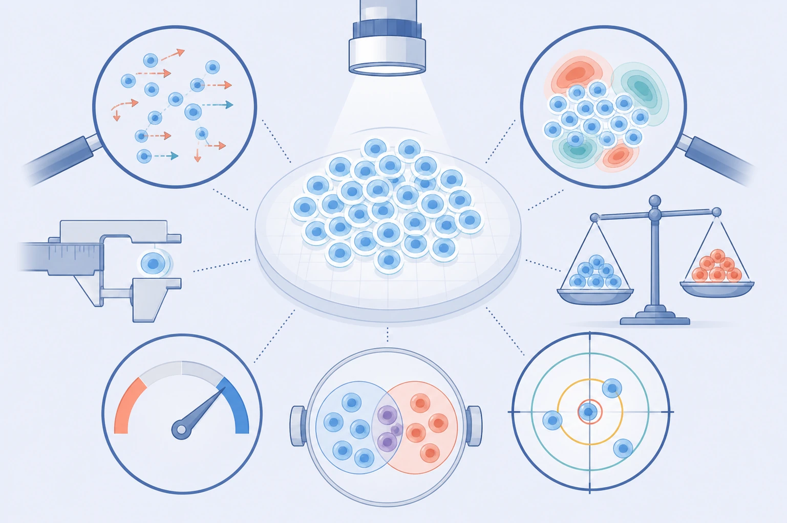

# L3-01｜评分指标与离线评估

> 前置课程：[L0-01 数据合同、真实数据审计与首个基线](01-数据合同与首个基线.md)  
> 下一课：[L3-02 公开扰动数据与跨背景验证](L3-02-公开扰动数据与跨背景验证.md)  
> 课程索引与主题归属：[README.md](README.md)

一句话结论：**评分器先把单细胞预测整理成两种中间结果，一种是“一组细胞的总体表达谱”，另一种是“哪些基因发生了多大变化”的差异表。六项指标只是在这两种结果上问六个不同问题。**

> 建议阅读方式：第一遍只读第 0 至 6 节，先能说清数据怎样一步步变成分数。第 7 节之后是实验和公式参考，可以第二遍再看。

## 0. 先解决最容易卡住的名字

### 0.1 ADNP 是什么

原文拿 `ADNP` 举例。`ADNP` 是一个人类基因的标准符号，全名是 *activity dependent neuroprotector homeobox*。[S4] 在本课中，不需要知道它的具体生物功能；它只是一个示例的**待扰动目标基因**。把 `ADNP` 换成面板里的其他目标，后面的计算完全一样。

“扰动 ADNP”的意思是：实验用 CRISPR interference（CRISPRi，CRISPR 转录抑制）尽量降低 `ADNP` 的转录。guide RNA（引导 RNA）是一段负责定位目标 DNA 的短 RNA，它把转录抑制执行器带到 `ADNP` 附近，从而减少该基因产生 RNA（核糖核酸，基因转录产物）。由于基因在细胞调控网络中互相影响，评分对象不是只有 `ADNP` 这一列，而是扰动后全部 18,533 个测量基因的计数。

这里要分清两种角色：

| 角色 | 以 ADNP 为例 | 在数据中的位置 |
|---|---|---|
| 目标基因 | 实验想压低 `ADNP` | `target_gene = ADNP` |
| 测量基因 | `ADNP`、`GENE_B`、`GENE_C` 等 18,533 个基因 | 表达矩阵的列 |

后文为了不让基因名分散注意力，用 `G1`、`G2`、`G3` 代表任意三个测量基因。

### 0.2 评分时比较的是两组细胞

对一个目标，评分器至少需要两组细胞：

1. **目标扰动组**：例如携带 ADNP 定向 guide RNA 的细胞。预测侧和实测真值侧各有一组。
2. **非靶向对照组**（non-targeting control，以下简称 NTC）：guide RNA 不被设计去命中人类基因，但细胞经历了其余实验流程。它表示“没有特定目标被压低时，这个细胞背景通常是什么样”。

两组细胞不是同一个细胞的前后照片。单细胞 RNA 测序会消耗被测细胞，因此它们是从两个细胞群体分别抽到的样本。

### 0.3 一张图先看清两条计算路线

```text
预测的单细胞原始计数
  |
  |-- 路线 A：同组细胞先汇总
  |      -> 群体表达谱
  |      -> 扰动身份分 + 全表达谱误差分
  |
  `-- 路线 B：保留每个细胞
         -> 逐基因比较“扰动组 vs NTC”
         -> 差异表达表
         -> 方向、排序深度、显著基因集合、变化幅度四个分数
```

路线 A 主要问“整组细胞的平均效果对不对”。路线 B 还会看每个细胞的值怎样分布，所以保留了更多单细胞信息。

## 1. 路线 A：从单细胞到群体表达谱

### 1.1 原始输入是什么

表达矩阵的每一行是一个细胞，每一列是一个基因，单元格是该细胞中该基因的原始 UMI 计数。UMI 是 unique molecular identifier（唯一分子标识符），用于尽量避免把同一原始 RNA 分子的扩增副本重复计数。

下面只用 2 个 NTC 细胞、2 个 ADNP 扰动细胞和 3 个基因演示。真实评分使用 18,533 个基因，此处数字只用于手算。

| 细胞 | 分组 | G1 | G2 | G3 | 该细胞总 UMI |
|---|---|---:|---:|---:|---:|
| N1 | NTC | 10 | 0 | 10 | 20 |
| N2 | NTC | 0 | 10 | 10 | 20 |
| P1 | ADNP 扰动 | 5 | 0 | 15 | 20 |
| P2 | ADNP 扰动 | 5 | 0 | 15 | 20 |

### 1.2 第一步：在每个基因上竖向求和

对同一组的细胞，分别汇总每个基因的计数：

| 组 | G1 总计数 | G2 总计数 | G3 总计数 | 整组总计数 |
|---|---:|---:|---:|---:|
| NTC | 10 | 10 | 20 | 40 |
| ADNP 扰动 | 10 | 0 | 30 | 40 |

这个按基因求和的向量叫做**伪批量计数**（pseudobulk counts）。“伪”是因为它不是在实验室里把细胞真正混合后测量，而是在计算中把许多单细胞的计数加起来。

为什么要求和？一个细胞中某个 RNA 分子可能恰好没有被采样到，但同组许多细胞汇总后，这种偶然漏测的相对影响会变小。代价是细胞之间的差异被压成了一个总量向量。

### 1.3 第二步：把每组调到相同总量

一组细胞可能测得更深，或者包含更多细胞，因而所有基因的总计数都更大。评分器不直接比较这些总数，而是把每组伪批量按比例调到总和 50,000：[S3]

$$
\text{归一化计数}_g
=50{,}000\times
\frac{\text{该组基因 }g\text{ 的总计数}}
{\text{该组所有基因的总计数}}.
$$

为了手算方便，先把上面的玩具数据调到总和 100。真实评分器使用 50,000，原理相同。

| 组 | G1 | G2 | G3 | 总和 |
|---|---:|---:|---:|---:|
| NTC | 25 | 25 | 50 | 100 |
| ADNP 扰动 | 25 | 0 | 75 | 100 |

归一化后的 25 不再表示真实观察到了 25 个分子，而是“如果这组的总量统一为 100，G1 占 25”。

### 1.4 第三步：用 `log(1 + x)` 压缩极大值

基因表达量往往相差很大。如果直接比较，少数高表达基因会主导整个距离。评分器对每个归一化值计算 `log(1 + x)`。加 1 是为了让原来的 0 仍能安全进入对数。

此时得到的向量才是后文所说的**群体表达谱**。严格地说，“伪批量计数”是求和后的原始向量，“群体表达谱”是继续归一化和对数变换后的向量。

### 1.5 第四步：减去 NTC，得到扰动效应

群体表达谱中大部分数值反映“这类细胞本来是什么样”。评分器把扰动组的谱减去同一细胞背景的实测 NTC 谱：

$$
\text{扰动效应向量}
=\text{扰动组群体表达谱}
-\text{NTC 群体表达谱}.
$$

对某个基因，差值大于 0 表示该基因在扰动组相对更高，小于 0 表示相对更低。这个差值是在归一化并取对数后得到的，不是原始 UMI 计数直接相减。

到这里，路线 A 完成。第一项指标用扰动效应向量识别目标身份，第二项指标比较预测与实测群体表达谱的数值距离。

## 2. 路线 B：从单细胞到差异表达表

路线 B 不先把细胞全部加在一起。它对每个基因保留“许多个扰动细胞的值”和“许多个 NTC 细胞的值”，然后比较两组分布。

### 2.1 第一步：每个细胞单独换算为 CPM

CPM 是 counts per million（每百万计数）。对细胞 $i$ 中的基因 $g$：

$$
\mathrm{CPM}_{i,g}
=\frac{\text{细胞 }i\text{ 中基因 }g\text{ 的原始计数}}
{\text{细胞 }i\text{ 的所有基因总计数}}
\times 1{,}000{,}000.
$$

例如：

- 细胞 A 总共有 10,000 UMI，其中基因 G1 有 1 个计数，则 G1 为 100 CPM；
- 细胞 B 总共有 100,000 UMI，其中 G1 有 5 个计数，则 G1 为 50 CPM。

细胞 B 的 G1 原始计数更大，但它占该细胞总计数的比例反而更小。CPM 是为了减少细胞测序深度差异的影响。

**CPM 只是评分器内部使用的可比尺度。**它不表示实验真的测到了一百万个分子，也不改变比赛提交必须为非负整数原始计数的要求。

### 2.2 第二步：用 NTC 平均表达过滤极低表达基因

“NTC 中平均表达”是一个具体的算术平均：

1. 先把每个 NTC 细胞中该基因的计数换成 CPM；
2. 再把所有 NTC 细胞的该基因 CPM 相加；
3. 最后除以 NTC 细胞数。

例如，某基因在 4 个 NTC 细胞中的 CPM 是 `0, 10, 10, 20`，则：

$$
\text{NTC 平均 CPM}=(0+10+10+20)/4=10.
$$

官方规则只保留 **NTC 平均值大于 5 CPM** 的基因。[S3] 这是“许多 NTC 细胞的平均大于 5”，不是“每个 NTC 细胞都必须大于 5”。上例中即使第一个细胞为 0，该基因仍然通过过滤。

为什么过滤？极低计数中的偶然漏测比例很大，而且一次同时检验的基因越多，后面的多重检验校正越严格。过滤可以把检验能力集中在对照中有足够信号的基因上。

边界是：**被过滤不等于没有生物学信息。**一个在 NTC 中沉默、却被扰动强烈诱导的基因可能很重要，只是它不进入这四项差异表达指标。

### 2.3 第三步：用 Wilcoxon 秩和检验比较两组细胞

Wilcoxon rank-sum test（Wilcoxon 秩和检验，也称 Mann–Whitney U 检验）不先问两组均值差了多少，而是问：**把两组细胞的值混在一起从小到大排序后，某一组是否系统地排得更高或更低？**

继续使用上面的基因，假设它在两组细胞中的 CPM 为：

| 组 | 4 个细胞的 CPM |
|---|---|
| NTC | 0, 10, 10, 20 |
| ADNP 扰动 | 30, 40, 40, 50 |

混合排序后为：

```text
0(NTC), 10(NTC), 10(NTC), 20(NTC), 30(扰动), 40(扰动), 40(扰动), 50(扰动)
```

所有扰动细胞都排在 NTC 之上，这是一个很强的“扰动组通常更高”信号。实现会给并列值分配平均秩，再由秩和计算一个双侧 p 值。“双侧”表示上调和下调都可以被发现。

p 值不是“基因没变化的概率”。它表示：如果两组实际没有系统差别，由抽样偶然性产生当前这么极端或更极端秩差的概率有多大。小 p 值表示当前排序在“无系统差别”假设下不容易出现，但它不单独告诉我们变化有多大。

软件类比只能帮助建立直觉：秩和检验像只比较请求延迟的排名，而不让一个极端延迟值把算术平均整个拉走。类比的边界是，细胞值中有很多并列零，而且细胞未必完全独立；最终应使用官方评分器，不能靠这个类比自己重写检验。

### 2.4 第四步：校正“一次测了几千个基因”带来的偶然命中

假设我们对许多个其实没有变化的基因分别做检验。只要尝试足够多次，也会偶然遇到一些很小的 p 值。因此不能把每个原始 p 值单独与 0.05 比较。

官方使用 Benjamini–Hochberg 校正（以下简称 BH 校正）。例如，某个玩具扰动只检验 4 个基因，排序后的原始 p 值是：

| 排名 | 原始 p 值 | BH 校正后 p 值 |
|---:|---:|---:|
| 1 | 0.001 | 0.004 |
| 2 | 0.010 | 0.020 |
| 3 | 0.040 | 0.053 |
| 4 | 0.200 | 0.200 |

原始 p 值 0.040 小于 0.05，但校正后为 0.053，不再达到官方显著性阈值。真实评分中，BH 校正在**每个扰动内部**，对通过低表达过滤的所有基因一起进行。校正后 p 值小于 0.05 的基因记为“显著变化”。[S1][S3]

BH 校正的目标是控制 false discovery rate（错误发现率），也就是在被判为显著的基因中，假阳性比例的期望值。“校正后 p < 0.05”不等于这一个基因有 95% 概率真的变化，也不保证任何一次实际列表中恰好只有 5% 假阳性。

### 2.5 第五步：用平均值计算变化方向和幅度

Wilcoxon 检验的双侧 p 值只负责判断“两组是否有差别”。变化方向和幅度由 log2 fold-change（以 2 为底的倍数变化，以下简称 LFC）提供：

$$
\mathrm{LFC}_{g}
=\log_2
\frac{\text{扰动组中基因 }g\text{ 的平均 CPM}+\epsilon}
{\text{NTC 中基因 }g\text{ 的平均 CPM}+\epsilon}.
$$

$\epsilon=10^{-9}$ 是一个用于避免除以零的极小数。对上面的例子：

$$
\text{NTC 平均}=10,\qquad
\text{扰动组平均}=40,
$$

$$
\mathrm{LFC}\approx\log_2(40/10)=\log_2(4)=2.
$$

这表示扰动组平均约为 NTC 的 4 倍。常用解读是：

| LFC | 直觉解读 |
|---:|---|
| 2 | 约变为 4 倍 |
| 1 | 约变为 2 倍 |
| 0 | 两组平均相同 |
| -1 | 约变为一半 |
| -2 | 约变为四分之一 |

注意，p 值小不代表 LFC 一定大。如果细胞多、组内波动小，一个很小但一致的变化也可以有很小的 p 值。反过来，平均变化很大但组内细胞差异也很大时，p 值未必足够小。

### 2.6 最终一行差异表达结果里有什么

对每个“扰动 × 测量基因”组合，评分器最终需要下面这些信息：

| 列 | 它怎样来 | 它回答什么 |
|---|---|---|
| 基因 | 表达矩阵的列名 | 正在判断哪个基因 |
| NTC 平均 CPM | NTC 细胞的单细胞 CPM 取平均 | 该基因是否进入检验 |
| 原始 p 值 | Wilcoxon 秩和检验 | 在无系统差别时，当前秩差有多少见 |
| 校正后 p 值 | 同扰动内的 BH 校正 | 考虑同时测试多基因后的显著性 |
| LFC | 两组平均 CPM 之比取 $\log_2$ | 变化向上还是向下，幅度多大 |
| 是否显著 | 校正后 p 值是否小于 0.05 | 是否进入“显著变化基因”集合 |

同一套流程分别对“预测扰动细胞 vs 实测 NTC”和“实测扰动细胞 vs 实测 NTC”运行，得到一张预测差异表和一张真值差异表。后四项指标就是比较这两张表。


*图 1｜六项指标共用两条前处理路线。前两项使用群体表达谱，后四项使用差异表达表。右侧只表示不同人为错误不会让六项分数以完全相同的方式变化，不代表新的生物机制。*

## 3. 六项指标逐个说人话

先不看源码名，只看六个问题：

| 编号 | 它问什么 | 使用哪条路线 |
|---:|---|---|
| 1 | 这个预测像不像它声称的那个扰动？ | 群体表达谱 |
| 2 | 整个群体表达谱的数值离真值多远？ | 群体表达谱 |
| 3 | 预测为响应的基因，上调或下调方向对不对，而且有没有少报太多？ | 差异表达表 |
| 4 | 按模型的信心从高到低看，正确方向能维持到多深？ | 差异表达表 |
| 5 | 预测与实验是否找到同一批显著变化基因？ | 差异表达表 |
| 6 | 真实响应基因的变化幅度预测得准不准？ | 差异表达表 |

### 3.1 指标 1：扰动身份区分分数

官方名为 Perturbation Discrimination Score（扰动区分分数，以下简称 PDS），源码名是 `pds_cosine`。

对一个声称是 ADNP 扰动的预测，它做三件事：

1. 取路线 A 得到的 ADNP 预测效应向量；
2. 把它分别与 300 个真实目标的效应向量比较；
3. 检查真实 ADNP 在 300 个候选中排第几。

比较使用 cosine distance（余弦距离）。可以先把每个效应向量想成一个高维箭头：余弦距离主要看两个箭头的方向图案像不像，对长度没有那么敏感。[P1]

- 真实 ADNP 排第 1，该目标的原始分为 1；
- 真实 ADNP 排最后，原始分为 0；
- 没有身份信息时，平均位置在中间，原始分约为 0.5；
- 所有目标输出同一个非零响应时，300 个目标平均后的原始 PDS 恰好为 0.5；所有目标都输出 NTC 零效应时，每个目标都因全部距离并列而得到 0.5。[S3]

**它故意不回答什么？** PDS 高只表示“图案足以识别目标”，不保证每个基因的表达量和变化幅度都准确。

### 3.2 指标 2：全表达谱误差

这项的源码名是 `expr_mse_unbiased_capped_norm`。MSE 原本是 mean squared error（均方误差），但官方这一项不是一个普通 MSE。

先抓住主体：

1. 比较预测群体表达谱和实测群体表达谱；
2. 计算所有基因上的平方距离，差得越多的基因惩罚越大；
3. 再除以“实测扰动相对 NTC 本来有多大”，使误差相对于真实任务尺度可解释。

原始值越低越好。0 表示群体谱完全命中；把 NTC 当作每个扰动的预测时，原始值期望约为 1；误差过大时可以超过 1。[S3]

名字中其余三段的意思是：

- `unbiased`（抽样偏差校正）：每次删除一个细胞并重算群体谱，估计“只因这次抽到了哪些细胞”带来的距离。这种逐个删除再重算的方法叫 delete-one jackknife（删一法）。
- `capped`（校正量受限）：预测侧不能通过故意制造大量细胞波动，让评分器把系统误差都当作抽样噪声扣掉。
- `norm`（归一化误差）：用真实扰动相对 NTC 的距离作分母。

**它故意不回答什么？** 两群细胞即使分布形状不同，只要汇总后的群体谱接近，主体误差就可能较小。删一校正会使用部分组内波动信息，但这仍不是对完整单细胞分布的全面比较。

### 3.3 指标 3：方向保真度，同时惩罚少报

源码名是 `de_wilcoxon_direction_fidelity_yield_raw`。它先看模型判为显著的基因，再问这些基因的 LFC 正负号是否与真值一致。

假设：

- 实验真值找到 10 个显著变化基因；
- 模型只报了 6 个；
- 其中 5 个的上调或下调方向正确。

则分数不是 $5/6$，而是：

$$
\frac{5}{\max(6,10)}=0.5.
$$

如果只报最有把握的少数基因，方向正确率看起来可能很高，但 `yield` 会对覆盖不足加以惩罚。反过来，报得过多也会扩大分母。原始值范围为 0 到 1，越高越好。

**它故意不回答什么？** 它只看 LFC 的正负方向，不区分变化 1.1 倍还是 10 倍。

### 3.4 指标 4：方向能保持正确到多深

源码名是 `de_wilcoxon_direction_reach_raw`。它先只取实验真值中显著变化的基因，再按模型自己的信心从高到低排序。对前 1 个、前 2 个、前 3 个一直到全部基因，分别计算方向正确率。

官方要求某个前缀中至少 90% 方向正确，并找仍达到这一要求的最深位置。最后用该深度除以真实显著基因总数。

例如，真值有 10 个显著基因，模型排完 10 个后其中 9 个方向正确，则最深位置可以达到 10，该目标的 reach 为 $10/10=1$。它不是在遇到第一个错误时立即停止；前缀正确率可能先低于 90%，后面因连续正确而恢复到 90%。[S3]

**它故意不回答什么？** 它的候选池由真值显著基因决定，主要检查排序和方向，不能单独证明模型能从全部基因中发现正确响应集合。

### 3.5 指标 5：显著基因集合重合度

源码名是 `de_wilcoxon_sig_jaccard`，使用 Jaccard index（Jaccard 集合重合度）。

假设：

- 真值显著集合是 `{G1, G2, G3, G4}`；
- 预测显著集合是 `{G2, G3, G5}`。

两边共同拥有 `G2, G3` 2 个基因，合并去重后有 `G1, G2, G3, G4, G5` 5 个基因，所以：

$$
\text{Jaccard}=\frac{\text{交集大小}}{\text{并集大小}}=\frac{2}{5}=0.4.
$$

完全相同为 1，完全不重合为 0，两边都为空集时按 1 处理。它同时惩罚漏报和多报。

**它故意不回答什么？** Jaccard 只看基因名单，不看上调或下调，也不看幅度。即使把所有 LFC 符号翻转，只要显著性名单没变，Jaccard 仍可以很高。

### 3.6 指标 6：真实响应基因的幅度误差

源码名是 `de_wilcoxon_lfc_nmae`。NMAE 是 normalized mean absolute error（归一化平均绝对误差）。

它只在实验真值已经判为显著、且真实 LFC 是有限值的基因上计算。玩具例子假设只有两个基因：

| 基因 | 真实 LFC | 预测 LFC | 绝对误差 |
|---|---:|---:|---:|
| G1 | 1 | 0.5 | 0.5 |
| G2 | -2 | -1 | 1 |

$$
\mathrm{NMAE}=\frac{0.5+1}{|1|+|-2|}=\frac{1.5}{3}=0.5.
$$

官方规则只评分至少有 10 个合格真实显著基因的扰动；上面两基因例子只为了演示算法。原始值越低越好：完美预测为 0，对所有基因都预测零变化时为 1，过度放大可以超过 1。[S3]

**它故意不回答什么？** 它的评分基因集合由实验真值决定，所以它检查的是“对已知真实响应基因，幅度准不准”，不是“模型自己找对了多少响应基因”。



*图 2｜多角度评分的直觉插画。周围的方向、集合、尺度和距离意象只表示“从不同方面检查同一预测”，不逐一对应公式，也不代表真实仪器或细胞形态。本图是生成式解释插画，不是机制证据。*

## 4. 为什么六项指标要排除目标基因本身

如果题目已经告诉模型 `target_gene = ADNP`，那么预测 `ADNP` 下降只是在重述 CRISPRi 的直接目标，而不是推断下游细胞响应。因此，六项指标都不评分当前扰动的目标基因。[S3]

扰动身份指标更严格：它在比较任意两个扰动效应时，统一移除整张面板的 300 个目标基因列。这保证 300 × 300 次距离比较使用同一组特征，也防止模型通过专门改写已公布的目标基因列走捷径。其余五项只移除当前扰动自己的目标基因。

## 5. Raw 和 Scaled：原始值不是总分尺度

### 5.1 原始值为什么不能直接平均

Raw 是每项指标自己的原始值。它们的方向和单位不同：

| 原始指标 | 越好的方向 |
|---|---|
| 扰动身份 PDS | 越高越好 |
| 全表达谱误差 | 越低越好 |
| 方向保真度 | 越高越好 |
| 方向深度 | 越高越好 |
| 显著集合 Jaccard | 越高越好 |
| LFC 幅度 NMAE | 越低越好 |

一个原始误差 500 不能与原始 PDS 0.8 直接相加，就像 500 毫秒不能与 0.8 米取平均。官方先把每项原始值放到同一个参考尺度上，才计算总分。[S1]

### 5.2 0 和 1 是两个实测参考点

对每个“指标 × 细胞背景”，官方使用两个参考：

- **0 分参考**：计算该背景的平均扰动响应，再把这个相同响应分配给所有目标。它知道“这个背景通常如何响应”，但不能区分具体目标。
- **1 分参考**：把每个真实扰动和 NTC 的细胞分成两个不重叠半集，用一半与另一半比较，共做 5 次固定随机拆分后平均。它代表半深度真实重复之间的一致性。

特别注意：**0 分参考不是 NTC，也不是全零矩阵。**

> **与 [L1-02 噪声地板](L1-02-证据基线与噪声地板.md) 的连接（本课只回指，不重复讲解）。** 这里的 1 分参考**本身就是一次噪声地板测量**：它测的是「真实实验自己跟自己能差多少」。所以 $s=1$ 的含义可以更精确地说成「你的预测与真值的差距，和真值的一次半深度独立重复与它的差距一样大」。本机如何在自己的数据上测量同一个量、测出来的数字是多少、以及它怎样被用作「改进是否真实」的阈值，见 [L1-02](L1-02-证据基线与噪声地板.md) §4、§5 与 §7。反过来，六项指标各自会把这个噪声**非线性地放大**（DE 类指标要经过 Wilcoxon 检验与 BH 校正），因此不能把群体表达谱那一档的地板直接搬到单项指标上。

设提交的原始指标值为 $u$，0 分参考的原始值为 $b$，1 分参考的原始值为 $r$，缩放后的值是：

$$
s=\frac{u-b}{r-b}.
$$

玩具例子 1，某项“越高越好”的指标中，$b=0.5$、$r=0.8$、模型 $u=0.65$：

$$
s=(0.65-0.5)/(0.8-0.5)=0.5.
$$

模型走过了从基线到重复实验参考之间的一半。

玩具例子 2，某项“越低越好”的误差指标中，$b=1.0$、$r=0.04$、模型 $u=0.52$：

$$
s=(0.52-1.0)/(0.04-1.0)=0.5.
$$

同一个公式自然处理了“误差越低越好”，因为这时分母是负数。

### 5.3 怎样读缩放后的数

| 缩放值 | 正确解读 | 不正确解读 |
|---:|---|---|
| 0 | 与当前背景的平均扰动响应基线相当 | 缺失值或“什么都没有” |
| 1 | 与两个半深度真实重复的一致性相当 | 100% 准确或理论满分 |
| < 0 | 比平均扰动响应基线更差 | 评分器出错 |
| > 1 | 比半深度重复参考更接近保留真值 | 必然超过完整生物实验 |

1 不是上限，因为重复参考的每一边只有一半细胞，仍包含抽样噪声。全表达谱误差的缩放分特别限制在 `[0, 1]`；LFC 幅度误差的坏侧最低限制为 `-6`；其余四项不做统一截断。[S1][S3]

每个细胞背景内先对六项缩放分等权平均，再对三个背景等权平均。分数不是百分比，不乘 100。验证轮 A/B/C 与最终轮 D/E/F 使用不同细胞背景、目标面板和参考点，所以不能直接比较两轮绝对分数。[S1]

## 6. 怎样读一张六指标成绩单：对模型选择的影响

不要从总分开始猜。按下面顺序读：

1. **先看扰动身份**：模型是否真的为不同目标产生了不同响应，还是输出了一个通用平均谱？
2. **再看整体数值误差**：目标身份图案对了以后，整体表达量是否过强或过弱？
3. **再看显著基因集合**：模型有没有找到与实验相同的响应基因？
4. **再看方向与排序**：找到的响应是上调还是下调，高信心基因是否真的更可靠？
5. **最后看幅度**：响应的大小是否校准？

几种常见组合：

| 成绩模式 | 首先怀疑什么 | 不能直接得出什么 |
|---|---|---|
| 身份 PDS 高，但全谱误差和 LFC 幅度误差差 | 效应方向图案有用，但整体尺度过强或过弱 | 模型已经准确重建表达量 |
| Jaccard 高，方向保真度低 | 响应基因名单大致对，但上调和下调可能翻转 | 显著名单正确就代表机制正确 |
| 群体两项好，差异表达四项差 | 群体平均可能接近，但细胞间波动、零比例或生成分布不对 | 一定只是目标表示太差 |
| 方向保真度尚可，Jaccard 很低 | 模型可能只报少数有把握基因，或显著性校准不对 | 方向头已经完成整个任务 |

一个务实的模型选择方法是：先为六项分数设最低门槛，排除在某一方面明显失真的模型，然后再比较通过门槛的模型总分。

**这张表直接决定你的模型往哪个方向改。** 六项不是六个独立的分数，而是六个**互不替代的故障探针**：全谱误差差说明标定问题，Jaccard 低说明显著性校准问题，方向保真度低说明符号问题。看错一格，就会去修一个本来没坏的模块——这是本项目里最贵的一类返工。

### 6.1 与 VC2026 的关系：这六项指标为什么这样设计

VC2026 的评分不是「谁预测得准谁赢」这么简单，六个指标各自封死了一条**捷径**。理解这一点，才知道为什么不该针对单项做优化：

| 指标 | 它封死的捷径 | 对本赛的直接影响 |
|---|---|---|
| 扰动身份 PDS | 输出一个对所有目标都一样的「通用平均扰动谱」 | D/E/F 阶段没有真值可看，这条最容易被自欺：平均谱在 PDS 上会直接暴露 |
| 全表达谱误差 | 只在少数基因上做对、其余不管 | 决定你是否必须覆盖全部 18,533 个基因 |
| 方向保真度 + reach | 只报少数有把握的基因来拉高准确率 | 逼你在「敢报」与「报得准」之间取平衡 |
| Jaccard | 用显著性阈值调参刷分 | 逼你报告响应基因集合，而不只是方向 |
| LFC 幅度 NMAE | 把效应幅度整体放大或缩小 | 逼你校准尺度，不能只做排序 |

**这五项里任何一项单独刷高，都会被其他项拉住。** 因此在本赛里，「我的改动让总分涨了 X」这句话只有在**六项分解 + 逐背景分解**都看过之后才成立——这正是 [L2-05](L2-05-实验方法-消融与证伪设计.md) §4.2 把「逐指标分解」列进证伪清单的原因。L2-05 §4.1 的清单里，至少有三条改动（换损失、相似背景加权、缩小方差）**在总分上看不出来**，只能靠这张六项表发现。

**还有一条与执行时序有关**：A/B/C 有真值，D/E/F 没有。所以上表这套诊断只在 A/B/C 上可用；一旦进入最终轮，你只剩 NTC 和一个已经冻结的模型，能做的判断退化成 [L3-05](L3-05-消融集成与最终轮.md) §2.3 讲的「用稳定性而不是单次最高分选模型」。**在 A/B/C 上没用完的诊断额度，到了最终轮不会补给你。**

## 7. 噪声与实现中的常见失败

### 7.1 为什么真实实验与自己也不会完全一样

- 同一扰动组中，细胞周期、应激状态和原有表达不同，会形成真实异质性；
- 单细胞 RNA 测序只抽样到每个细胞的部分分子，低丰度 RNA 容易出现偶然零值；
- guide 效率、脱靶作用和扰动时长会改变实际效应幅度；
- 批次差异可以同时改变 NTC 和扰动组。如果对照不匹配，模型可能学到实验批次而不是生物响应。

这些因素解释了为什么官方用真实数据的两个半集建立 1 分参考，而不是假设两次真实实验必须逐项相同。

**本课只用到这一步**：它说明指标会放大噪声，因此小的分数差不能直接当改进。至于这个噪声**有多大**、怎样在本机测出来、以及超过多少才算真实改进，是 [L1-02](L1-02-证据基线与噪声地板.md) 的主题，不在本课展开。

### 7.2 评估代码最容易犯的错

1. **基因顺序不同仍直接比较**：数字可以合法，但每一列的生物含义已经错位。
2. **把 CPM 或 `log(1 + x)` 数据当成原始计数提交**：内部评分变换不是提交格式，正式提交仍要求原始非负整数计数。
3. **为预测侧自己生成一个 NTC**：官方规则对预测和真值都使用同一份实测 NTC。自建评估换了原点，数值就不再与官方可比。
4. **每次改变目标面板**：PDS 是在当前 300 个候选中的排名，面板改变会改变指标本身。
5. **只看总分**：平均后的数字会隐藏“身份强、幅度差”等可修复问题。
6. **把一次随机拆分当成稳定真值**：官方重复参考使用 5 次固定拆分。很小的模型差异可能低于评估的分辨能力。

## 8. 离线评估：先证明评分台没有骗你

> **配套 notebook：[`04_arc_colab_h1_benchmark.ipynb`](../../notebook/04_arc_colab_h1_benchmark.ipynb)。** 本节讲的「固定输入与版本」「最小的三个校验臂」需要能跑的核来落地，而本地没有 GPU 也不装 `arc-state`。那份 notebook 离线校验官方 Colab 固定副本的哈希、把 150 个训练靶点筛成 126 个推理靶点、并生成推理目标 TSV——它证明的是**评分输入合同没有走样**，不是六项指标的数值结果。
>
> **边界写清**：本节 §8.2 的三个校验臂与 §8.3 的人为破坏实验，**本机尚未在 `cell-eval2` 上实跑过**（需要 H1 真值与专用环境）。表中「预期的敏感指标」是**根据指标定义得到的实验前预期，不是已观测结果**——这句话在 §8.3 正文里也重复了一次，因为它最容易被读成已验证结论。

### 8.1 固定输入与版本

首选 VC2025 的 H1 人胚胎干细胞公开扰动真值，因为它同样是 CRISPRi，也使用 10x Flex 固定 RNA 测量技术，且有同背景 NTC。它只能用来搭建和检查评分流程，不能替代下一课的整细胞背景留出验证。[S2]

```yaml
dataset: vc2025_h1
truth_split: 公开可用的扰动真值子集
cell_eval2: 0.15.0
rule_version: 3
seed: 20260830
genes: 显式记录版本、数量和顺序
targets: 显式保存列表及顺序
cells_per_target: 400
```

版本号来自当前官方指标说明使用的参考包版本。将来规则更新时，应新建实验记录，不覆盖旧结果。[S3]

### 8.2 最小的三个校验臂

1. **真实半集对另一半**：每个目标和 NTC 都拆成不重叠两半，用一半当预测、另一半当真值。它应接近本地自建的 1 分参考。
2. **同一平均扰动响应分配给所有目标**：它应接近本地自建的 0 分参考，身份 PDS 原始值应为 0.5。
3. **把 NTC 当作所有目标的零效应预测**：身份 PDS 原始值应为 0.5，LFC 幅度 NMAE 原始值应接近 1。

这三个检查都通过后，再做人为破坏实验。

### 8.3 人为破坏实验应该验证什么

下表的变化表示**指标表现**，不是原始数值的增减。它们是根据定义得到的实验前预期，不是已观测结果。

| 人为破坏 | 预期最敏感的指标 | 用它检查什么 |
|---|---|---|
| 随机打乱完整细胞群的 `target_gene` 标签 | 身份 PDS 和多数其他项应变差 | 标签是否真的参与评分，是否有真值泄漏 |
| 在最终扰动效应空间统一缩小 | 全谱误差和 LFC 幅度应变差，理想余弦 PDS 可能近似不变 | 方向图案与幅度是否被分开检查 |
| 把 LFC 正负号翻转，尽量保留显著名单 | 方向和幅度应明显变差，Jaccard 可能近似不变 | 集合指标是否被错误地当成方向指标 |
| 让 400 个细胞几乎完全相同，但尽量保持群体谱 | 群体主体可能变化小，差异表和抽样校正可能变化 | 评分是否能感受到部分细胞分布坍缩 |

在原始计数上修改、再经过归一化、对数、非负裁剪和重新采样后，理想的“只缩放幅度”未必仍是严格线性缩放。因此表中“可能近似不变”必须通过实验检查，不能当成已验证事实。

### 8.4 运行官方实现

`cell-eval2` 是官方评分工具。命令中的 `.h5ad` 是用于存放 AnnData 单细胞矩阵及其行列元数据的文件格式，具体数据合同见前置课程。

```bash
uvx --from 'cell-eval2==0.15.0' cell-eval2 run \
  -ap predictions/repeat_half.h5ad \
  -ar truth/holdout_half.h5ad \
  --preset vcc2026 \
  --pert-col target_gene \
  -o results/repeat_half
```

先保存六项原始值。如果要建立本地 0/1 尺度，须在同一离线数据集上另算平均扰动响应基线和 5 次分层半集重复参考。**本地自建尺度只能用于同一数据集内比较，不能冒充 A/B/C 官方缩放分。**

成绩单至少保存：数据版本、`cell-eval2` 版本、规则版本、随机种子、细胞背景、目标面板哈希、六项原始值、六项缩放值、有效扰动数、运行日志和代码提交号。

## 9. 第二遍再看：公式与精确边界

### 9.1 群体表达谱与扰动效应

对扰动 $p$ 和基因 $g$，先将该组所有细胞计数求和：

$$
P_{p,g}=\sum_{c\in\mathcal C_p}y_{c,g}.
$$

再归一化到 50,000 并取自然对数：

$$
b_{p,g}=\log\!\left(1+50{,}000\frac{P_{p,g}}{\sum_{g'}P_{p,g'}}\right).
$$

预测效应和真实效应都以同一份实测 NTC 为原点：

$$
\hat\delta_p=\hat b_p-b_{\mathrm{ctrl}},
\qquad
\delta_p=b_p-b_{\mathrm{ctrl}}.
$$

### 9.2 扰动身份 PDS

预测目标 $p$ 与真实目标 $q$ 的余弦距离是：

$$
d_{p,q}=1-
\frac{\langle\hat\delta_p,\delta_q\rangle}
{\lVert\hat\delta_p\rVert\lVert\delta_q\rVert}.
$$

若正确目标前面有 $k_p$ 个更近的候选，并列按中间秩计入 $k_p$，对 $n=300$ 个目标：

$$
\mathrm{PDS}_p=1-\frac{k_p}{n-1}.
$$

### 9.3 全表达谱误差的主体

忽略删一抽样校正时，可以先用下式记住主体：

$$
\mathrm{MSE}_{\mathrm{raw}}\approx
\frac{\sum_p\lVert\hat b_p-b_p\rVert^2}
{\sum_p\lVert b_p-b_{\mathrm{ctrl}}\rVert^2}.
$$

这不是评分器的完整公式。正式实现对分子和分母都减去基于删一法估计的抽样噪声，并对预测侧能够抵扣的校正量设置上限。它在整张目标面板上先求和再相除，因此是六项中唯一没有逐扰动分数的指标。精确校正式见官方规范 [S3]。

### 9.4 差异表达表

对通过 NTC 平均大于 5 CPM 过滤的基因：

$$
\mathrm{LFC}_{p,g}=\log_2
\frac{m^{\mathrm{pert}}_{p,g}+10^{-9}}
{m^{\mathrm{ctrl}}_g+10^{-9}},
$$

其中 $m$ 是单细胞 CPM 的算术平均。Wilcoxon 秩和检验使用单细胞 CPM 值，BH 校正在每个扰动内进行，校正后 p 值小于 0.05 时记为显著。

### 9.5 后四项指标

对某扰动，令 $n_{\mathrm{real}}$ 为真实显著基因数。真值 LFC 定义良好且非零的基因称为“可裁定”，令 $n_{\mathrm{pred}}$ 为预测判为显著且可裁定的基因数，$k$ 为其中预测与真值 LFC 同号的数量。预测判为显著、但预测 LFC 无定义或恰好为零的基因仍进入 $n_{\mathrm{pred}}$，但在 $k$ 中算错。方向保真度为：

$$
F_p=\frac{k}{\max(n_{\mathrm{pred}},n_{\mathrm{real}})}.
$$

对真实显著基因按预测信心排序，前 $j$ 个中方向正确率为 $P(j)$。令 $j^*$ 为仍满足 $P(j)\ge0.9$ 的最深位置，方向深度为：

$$
R_p=\frac{j^*}{n_{\mathrm{real}}}.
$$

令 $\mathcal R_p$ 和 $\widehat{\mathcal R}_p$ 分别为真实与预测显著基因集合，Jaccard 重合度为：

$$
J_p=\frac{|\mathcal R_p\cap\widehat{\mathcal R}_p|}
{|\mathcal R_p\cup\widehat{\mathcal R}_p|}.
$$

令 $S_p$ 为真实显著且真实 LFC 有限的基因集合，LFC 幅度误差为：

$$
\mathrm{NMAE}_p=
\frac{\sum_{g\in S_p}|\widehat{\mathrm{LFC}}_{p,g}-\mathrm{LFC}_{p,g}|}
{\sum_{g\in S_p}|\mathrm{LFC}_{p,g}|}.
$$

## 10. 本课术语查找表

| 术语 | 全称 | 本课中的意思 |
|---|---|---|
| ADNP | *activity dependent neuroprotector homeobox* | 一个基因符号，只作示例目标，不是指标名 |
| NTC | non-targeting control | 非靶向对照，扰动效应的比较原点 |
| UMI | unique molecular identifier | 用来尽量去除扩增重复后的分子计数标识 |
| pseudobulk | pseudobulk counts/profile | 同组单细胞按基因汇总得到的群体计数或表达谱 |
| CPM | counts per million | 把每个细胞的总计数换算到一百万的内部可比尺度 |
| DE | differential expression | 差异表达，逐基因比较扰动组和 NTC |
| BH 校正 | Benjamini–Hochberg correction | 同时检验多基因时控制错误发现率 |
| LFC | log2 fold-change | 以 2 为底的倍数变化，正负号表示方向，绝对值表示幅度 |
| PDS | Perturbation Discrimination Score | 扰动身份区分分数 |
| MSE | mean squared error | 均方误差；官方表达误差在此基础上增加抽样校正和归一化 |
| NMAE | normalized mean absolute error | 用真实 LFC 总幅度归一化的绝对误差 |

## 11. 一道理解检查题

某模型相对上一版出现：

- 扰动身份 PDS 明显上升；
- 方向保真度和方向深度基本不变；
- Jaccard 略降；
- 全表达谱误差与 LFC 幅度误差明显变差。

团队说：“PDS 变好，说明模型更懂生物机制，应该直接采用。”这个判断有什么问题？下一步只做一个实验，最值得做什么？

## 12. 答案

PDS 上升只说明不同目标的响应在余弦方向上更容易区分，不保证全表达谱或 LFC 幅度更准。两种幅度相关误差同时变差，而方向项基本不变，与“响应被统一放大或缩小”相容。这是一个待验证的工程解释，不能直接上升为“学到了更好机制”。

最有信息量的单个实验是：**固定模型的效应方向，扫描一组全局效应缩放系数，例如 `{0.25, 0.5, 0.75, 1.0, 1.5, 2.0}`，每次都重新生成合法原始计数，然后画出六项分数随缩放系数的曲线。**

如果 PDS 近似不变，而两种幅度误差在某个系数处最好，说明主要是效应尺度校准问题。如果 PDS 也明显变化，则要检查从效应空间返回原始计数时的对数变换、非负裁剪、重新归一化或采样是否同时改变了方向图案。

## 13. 来源与陈述边界

### 13.1 来源

- [S1] Arc Institute，[VC2026 FAQ：评分](../Official-website/FAQs.md#评分)。用于原始值、参考缩放、0/1 参考点、汇总方式、截断和跨轮不可比性。
- [S2] Arc Institute，[About the Data](../Official-website/About-the-Data.md)。用于 2026 数据规模、CRISPRi、10x Flex，以及 VC2025 H1 数据与今年测序化学一致的官方说明。
- [S3] Arc Institute，[cell-eval2 README](https://github.com/ArcInstitute/cell-eval2/blob/5e64833518a6603a0301cbe28185d49c30f4a986/README.md)、[vcc2026 指标规范](https://github.com/ArcInstitute/cell-eval2/blob/5e64833518a6603a0301cbe28185d49c30f4a986/docs/vcc2026_metrics/vcc2026-metrics-brief.md) 和 [preset](https://github.com/ArcInstitute/cell-eval2/blob/5e64833518a6603a0301cbe28185d49c30f4a986/src/cell_eval2/configs/vcc2026.yaml)，核对 commit `5e64833518a6603a0301cbe28185d49c30f4a986`。用于六项定义、过滤阈值、精确参数和边界。正式比赛若发布更高 `rule_version`，以新版本为准。
- [S4] HUGO Gene Nomenclature Committee，[HGNC:15766](https://www.genenames.org/data/gene-symbol-report/#!/hgnc_id/HGNC:15766)。用于核对 `ADNP` 的批准符号和全名。
- [P1] Liu et al., *Effects of Distance Metrics and Scaling on the Perturbation Discrimination Score*, arXiv:2511.16954v1；见[项目索引](../references/INDEX.md#effects-of-distance-metrics-and-scaling-on-the-perturbation-discrimination-score)和[本地机器转换阅读版](../references/liu-et-al-2025-pds-scaling-v1/liu-et-al-2025-pds-scaling-v1.md)。用于理解 PDS 的距离与尺度性质，论文结论尚未由本项目复现。

### 13.2 陈述边界

- **官方事实**：六项指标、CPM 和伪批量处理参数、低表达过滤、检验方法、参考缩放和汇总规则来自 FAQ 与 `cell-eval2` 官方代码和规范。
- **教学简化**：文中 3 基因、4 细胞、归一化到 100 和 4 个 p 值都是为了手算而设计的玩具例子，不是竞赛数据或实验结果。
- **论文结论**：PDS 对距离和效应尺度的性质另有 Liu 等人的分析，本课没有把其 VC2025 数值直接迁移为 VC2026 成绩。
- **工程假设**：第 6 节的成绩模式诊断和第 8 节的人为破坏预期用于形成可证伪假设，不是已经测得的结果。
- **尚未完成**：本课没有运行 VC2025 离线破坏实验，也没有构建官方 A/B/C 参考包；运行后应将配置、异常和结果另存为实验记录，不回填未经核验的数字。
