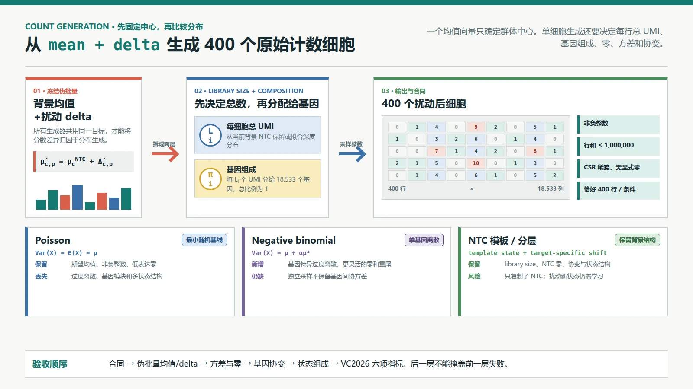
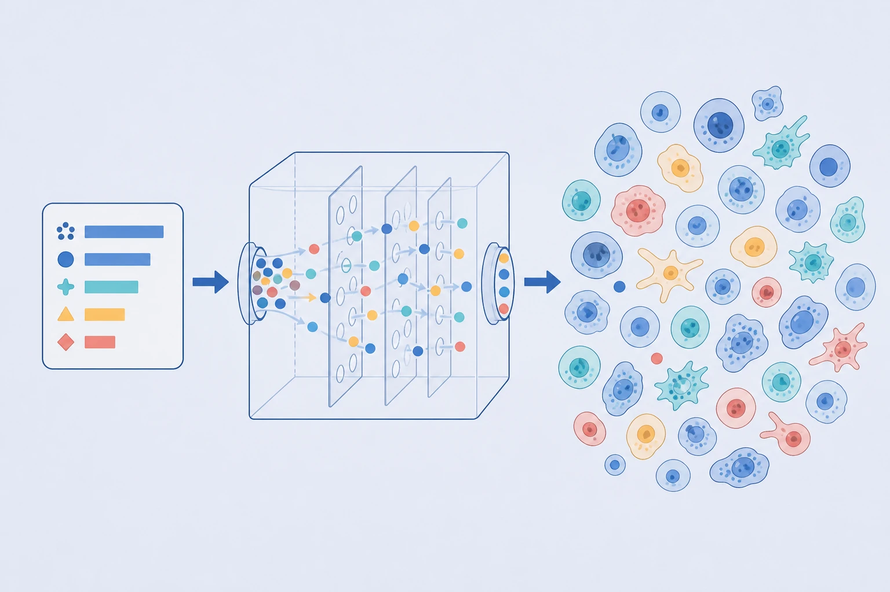

# L3-03｜单细胞原始计数生成

> 编写日期：2026-08-30
>
> 前置学习：[L3-02 公开扰动数据与跨背景验证](L3-02-公开扰动数据与跨背景验证.md)  
> 下一课：[L3-04 State 微调实战与算力预算](L3-04-State微调实战与算力预算.md)  
> 课程索引与主题归属：[README.md](README.md)
>
> 本课的工程前提：上一阶段已经能为一个 `context × target` 预测伪批量均值或扰动 delta。本课不讨论 delta 怎样预测，只讨论怎样把它变成 400 行合法且可检验的单细胞原始计数。

## 0. 学完本课能做什么

学完后，你应该能够：

1. 解释“均值预测正确”为什么不等于“已经生成真实的单细胞”；
2. 说清均值、方差、过度离散、零比例和基因协方差分别描述分布的哪一部分；
3. 说清 scRNA-seq 中的零为什么不是一个可随意打开的 `dropout` 开关；
4. 在相同预测均值下，比较复制均值、NTC 模板变换、Poisson、负二项、multinomial / Dirichlet-multinomial 和状态分层重采样；
5. 将每个细胞的总 UMI（library size）与这些 UMI 在基因间的组成（composition）分开建模；
6. 对生成结果逐层验收：先过文件合同，再检查均值，然后检查单基因分布、基因关联、状态组成和六项比赛指标。

本文将三类陈述分开：带 `[S#]` 的数字和合同来自官方页或官方代码；带 `[P#]` 的方法陈述是论文作者结论；Poisson/NB 选型、NTC 模板变换、状态分层和验收顺序都是待实验的工程方案。



*图 1｜计数生成的两层分解。先决定每个细胞一共有多少 UMI，再决定它们分配给哪些基因。Poisson、负二项和模板重采样保留的信息不同，不存在“只要能产生整数就等价”。本图为 HTML/CSS 确定性教程图，其中的计数仅用于解释，不是实验数据。*



*图 2｜从群体中心到单细胞群体的直觉插画。透明装置象征统计采样过程，而不是细胞在实验室中的制造机制；输出细胞的颜色和形态只强调“不能完全相同”，不代表真实细胞类型、状态比例或基因表达数值。本图使用 GPT Image 参考项目科学信息图风格生成，并经人工核对。*

## 1. 从一个均值到 400 个细胞，究竟缺了什么

假设已有背景 $c$ 的 NTC 伪批量均值 $\mu_c^{NTC}$，以及模型对目标 $p$ 预测的扰动效应 $\hat\Delta_{c,p}$：

$$
\hat\mu_{c,p}=\mu_c^{NTC}+\hat\Delta_{c,p}.
$$

$\hat\mu_{c,p}$ 可以回答“这组扰动细胞平均看起来怎样”，却没有回答下列问题：

- 每个细胞总共测到多少 UMI？
- 一个低表达基因在 400 个细胞中应该出现多少个零？
- 相同均值下，细胞间的波动应该多大？
- 细胞周期、应激等状态比例是否因扰动改变？
- 同一通路的基因是否会在同一些细胞中共同升高或降低？

这些都是“分布”的信息，不在一个均值向量里。

还要再强调一次：**VC2026 没有同一个细胞扰动前后的配对测量。** scRNA-seq 测量会消耗细胞，NTC 细胞和扰动细胞是两群不同的细胞。因此，把第 17 个 NTC 细胞变成第 17 个扰动细胞，只是建模上人为选择的映射，不是数据提供的生物真值。[S3][P1]

## 2. 先把分布的五个层次讲透

### 2.1 均值与方差：中心和波动不是一回事

**均值（mean）**是某基因在一群细胞中的平均计数；**方差（variance）**衡量单个细胞偏离这个平均的程度。

例如，两组细胞的某基因均值都是 5：

```text
组 A：5, 5, 5, 5, 5       均值 5，方差 0
组 B：0, 0, 5, 10, 10     均值 5，方差很大
```

伪批量均值无法区分这两组。生物上，B 可能混合了两种细胞状态，也可能只是测量更不稳定；仅凭方差不能区分原因。

### 2.2 过度离散：真实波动常比 Poisson 更大

先建立生成直觉：Poisson 假设在给定一个固定平均速率后，每一次分子计数近似独立，因此平均值一旦确定，允许的随机波动也被锁定。真实细胞的转录速率、状态和测序深度本身还会变化，所以观测波动经常超过这个最小模型。

**过度离散（overdispersion）**就是观测方差大于同均值 Poisson 分布的方差。Poisson 分布满足

$$
\mathrm{Var}(X)=\mathbb{E}[X]=\mu.
$$

但细胞的转录活性、状态和测序深度都会变，常见简化模型是负二项分布（negative binomial, NB）：

$$
\mathrm{Var}(X)=\mu+\alpha\mu^2,
$$

其中 $\alpha\ge 0$ 是额外离散程度。$\alpha=0$ 时回到 Poisson；$\alpha$ 越大，同均值下细胞间差异越大。负二项不是在解释额外波动来自哪里，只是增加一个参数把它容纳进观测分布；这个式子不会自动区分生物原因和技术原因。

### 2.3 零值：不是独立的 `dropout` 开关

一个单元格为零，可能是：

- 这个细胞在当时真的几乎不转录该基因；
- 有少量 RNA，但在有限 UMI 库中没有分配到它；
- 探针捕获、样本处理或计数流程没有留下可观测计数；
- 该细胞处于一种本来就不表达该基因的状态。

这些原因混在同一个零里。如果先从连续高斯模型生成数值，再用一个独立硬币随机“打零”，会将零与基因均值、library size 和细胞状态的关系切断。它可以作为反例，不应默认为真实 scRNA-seq 生成机制。

### 2.4 协方差：基因不是各自独立的列

**协方差（covariance）**衡量两个基因是否倾向在同一些细胞中一起升高或一起降低。细胞周期、干扰素应答、核糖体生成等生物程序会让一群基因协同变化。

独立地为每个基因采样 Poisson 或 NB，即使每一列的均值和方差都对，也可能把这些基因模块拆散。这就像逐列生成一张关联表：单列统计都对，不代表跨列约束还在。类比的边界是，基因关联可能来自共同调控、混合状态或测序深度，相关不自动等于直接调控。

### 2.5 Library size 与 composition：一个有用的两层分解

**Library size（单细胞总 UMI）**是细胞 $i$ 所有基因计数之和 $L_i=\sum_g x_{ig}$。**Composition（基因组成）**是这个总数中分配给每个基因的比例 $\pi_{ig}$，满足 $\pi_{ig}\ge0$ 且 $\sum_g\pi_{ig}=1$。

于是可以把生成写成：

```text
第一层：为细胞 i 选择总 UMI L_i
第二层：按基因比例 π_i 分配这 L_i 个 UMI
输出：x_i 是非负整数，且 sum(x_i) = L_i
```

这个分解很适合 VC2026：可以从当前背景 NTC 保留真实 $L_i$ 分布，把扰动预测主要放在 $\pi_i$ 的变化上。但这仍是工程分解，不能说 library size 全是技术噪声；细胞大小、RNA 含量和生存选择也可能让扰动后的总 UMI 真实变化。

## 3. 六种生成方案放在同一张图里比较

### 3.1 方案 A：复制或整数化均值

**输入**：$\hat\mu_{c,p}$。

**操作**：将均值四舍五入，或用最大余数法分配整数，然后复制 400 次。

**输出**：400 行完全相同的细胞。

**为什么需要它**：它是最小负对照，能把“均值预测”和“分布生成”的贡献拆开。

**主要失败**：方差为零，零比例只由四舍五入决定，所有基因的细胞间关联退化。大量并列值还会改变 Wilcoxon 检验的行为。它可能在某些伪批量指标上不差，却不应被称为可信的单细胞模型。

### 3.2 方案 B：复用并变换 NTC 模板

**输入**：当前背景的真实 NTC 细胞 $x_i^{NTC}$，以及预测 delta 或 log fold-change。

**操作**：选 400 个 NTC 模板，保留它们的 library size 和状态。若预测的是基因自然对数倍数变化 $d_g$（若是 log2 fold-change，则将下式的 $\exp(d_g)$ 换成 $2^{d_g}$），可先对每个模板的组成重加权：

$$
\pi'_{ig}=\frac{(x_{ig}+\epsilon)\exp(d_g)}
{\sum_h(x_{ih}+\epsilon)\exp(d_h)},
$$

$\epsilon$ 是预先固定的小伪计数，用来避免 NTC 中偶然为零的基因永远无法获得采样概率。它主要影响低表达基因，因此数值必须在训练侧冻结并单独做消融。随后再将 $L_i$ 个 UMI 按 $\pi'_i$ 分配。

**输出**：保留 NTC 的深度、零和一部分细胞状态结构，同时在组成上施加扰动。

**为什么需要它**：不用从零学习当前匿名背景的全部噪声结构。

**主要失败**：若所有细胞共用同一 $d_g$，它默认扰动不依赖细胞状态；对计数直接加 delta 还会产生负数，用 `clip(0)` 会系统性改变均值。NTC 重采样只保留对照的关联结构，不会自动生成扰动新建的状态。

### 3.3 方案 C：独立 Poisson

设细胞 $i$ 中基因 $g$ 的期望计数为 $\lambda_{ig}=L_i\pi_{ig}$：

$$
x_{ig}\sim\mathrm{Poisson}(\lambda_{ig}).
$$

**新增能力**：自然产生非负整数和低表达基因的零；有明确期望。

**代价与失败**：均值锁定方差，往往小于真实细胞波动；按基因独立采样不保留基因模块。独立 Poisson 采样后每行总计数也会围绕 $L_i$ 再波动，如果要精确固定行和，应使用 multinomial。

### 3.4 方案 D：独立负二项

$$
x_{ig}\sim\mathrm{NB}(\mu_{ig},\alpha_g),
\qquad \mathrm{Var}(x_{ig})=\mu_{ig}+\alpha_g\mu_{ig}^2.
$$

**新增能力**：每个基因可有不同过度离散，因而比 Poisson 更容易匹配方差和零比例。

**代价与失败**：要稳定估计 18,533 个基因的 $\alpha_g$ 需要收缩或均值—离散趋势；独立 NB 仍不保留基因间协方差，各基因采样后的行和也不会精确等于预定 $L_i$。从 NTC 估计的离散可用作先验，不能假定它在所有扰动下不变。

### 3.5 方案 E：Multinomial 与 Dirichlet-multinomial

固定细胞总 UMI $L_i$ 后，**多项分布（multinomial）**将它们一次性分配给所有基因：

$$
x_i\sim\mathrm{Multinomial}(L_i,\pi_i).
$$

它保证整数、非负和精确行和，并且因为总数固定，一个基因分到更多时会挤占其他基因的份额。这种组成约束不等于生物调控网络。

**Dirichlet-multinomial（狄利克雷-多项分布）**再多一层：先让每个细胞的组成 $\pi_i$ 围绕群体组成 $\bar\pi$ 波动，然后分配 UMI：

$$
\pi_i\sim\mathrm{Dirichlet}(\kappa\tilde\pi),
\qquad x_i\sim\mathrm{Multinomial}(L_i,\pi_i).
$$

其中 $\tilde\pi$ 是对 $\bar\pi$ 加小量平滑并重新归一化后的正组成，避免 Dirichlet 参数为零。$\kappa$ 越大，细胞组成越接近 $\tilde\pi$；$\kappa$ 越小，细胞间越不同。它能添加过度离散，但一个全局 $\kappa$ 无法表示多个生物状态，也不会自动恢复通路特异的正相关。

### 3.6 方案 F：状态分层重采样

**状态分层（state-stratified sampling）**先按可解释或可稳定复现的状态分组，例如细胞周期、应激程序或一个严格在训练集拟合的聚类。对每个状态 $s$，分别预测：

1. 扰动后该状态的群体比例 $w_{c,p,s}$；
2. 该状态内的 delta $\Delta_{c,p,s}$；
3. 从对应 NTC 层重采样模板，再施加状态特异变换。

**新增能力**：可以表达“同一扰动在不同起始状态中效果不同”，也可以表达群体组成变化。

**代价与失败**：分层本身可能是批次、library size 或算法分辨率造成的假簇；新背景可能出现训练中没有的状态。如果只复制 NTC 状态比例，就仍然无法预测扰动诱导的选择、停滞或死亡。

### 3.7 选型不是从最复杂的开始

| 方法 | 均值 | 方差/零 | library size | 基因协变 | 状态组成 | 最主要的用途 |
|---|---|---|---|---|---|---|
| 复制均值 | 可精确对齐 | 错 | 固定 | 错 | 错 | 最小负对照 |
| NTC 模板变换 | 需校准 | 部分保留 | 可保留 | 部分保留 | 默认保留 NTC | 低成本竞赛基线 |
| 独立 Poisson | 期望对齐 | 常偏小 | 仅期望对齐 | 错 | 错 | 最小随机计数基线 |
| 独立 NB | 期望对齐 | 可拟合过度离散 | 不精确固定 | 错 | 错 | 单基因分布基线 |
| Multinomial / DM | 期望对齐 | DM 可更离散 | 精确固定 | 仅有组成约束 | 单一 DM 不会分状态 | 显式的深度+组成生成 |
| 状态分层模板 | 需分层校准 | 部分保留 | 可保留 | 保留层内结构 | 可预测 | 需有证据才升级的方案 |

## 4. 一条可落地的生成流水线

### 步骤 1：冻结伪批量终点

**输入**：对每个 `context × target` 的 $\hat\mu$ 或 $\hat\Delta$。

**操作**：将生成器与 delta 预测器版本分开，同一组均值交给所有采样器。若在对数归一化空间预测，先定义唯一的 count-space 回转规则，不能将 `expm1` 后的数直接当成无偏原始计数。

**输出**：一份带版本号的目标均值表。

**为什么需要**：否则生成器 A 和 B 的分数差异可能实际来自不同均值，无法归因。

### 步骤 2：只从当前背景 NTC 建立观测模型

**输入**：A、B 或 C 的 18,400 个 NTC 细胞。

**操作**：保存 library size 经验分布，估计均值—方差趋势、零比例曲线和稳定状态分层。先按 `ntc_id` 分割验证：用部分 NTC guide 拟合，在未使用 guide 上检查能否重现分布。

**输出**：每背景的采样参数与质控报告。

**为什么需要**：背景 D/E/F 到来时只有 NTC，生成器不应依赖 A/B/C 的硬编码参数。

### 步骤 3：选择 400 个 library size 和起始状态

**输入**：当前背景 NTC 的行和、状态标签或连续表示。

**操作**：固定随机种子，按事先声明的规则抽取 400 个模板。基线可保留 NTC 状态比例；升级模型才预测扰动后比例。应额外运行 5–10 个种子，报告评估的采样波动。

**输出**：400 个 $L_i$ 与状态条件。

**为什么需要**：不能让一次幸运采样冒充模型提升。

### 步骤 4：把预测均值转成合法 composition

**输入**：上游冻结的预测均值或 delta，以及当前背景的深度规则。

**操作**：若 $\hat\mu_g$ 有负数，先回到预测模型处理，而不是在最后一律截零；再将合法质量归一化成和为 1 的基因概率。最小规则是：

$$
\bar\pi_g=\frac{\max(\hat\mu_g,0)}{\sum_h\max(\hat\mu_h,0)}.
$$

**输出**：每个 `context × target` 一条非负、总和为 1 的 composition。多项类采样器只有拿到合法概率才能工作。

**为什么需要**：上式会丢失预测的绝对总量。更稳妥的做法是让上游模型分别预测总量与组成，或在 log-composition 空间预测相对变化；无论选择哪种，都必须让总量接口与组成接口分开可审计。

### 步骤 5：采样并做有限样本校准

**输入**：400 个 $L_i$、对应 composition，以及选定采样分布和随机种子。

**操作**：从选定分布生成 400 行。400 是有限样本，其实际伪批量不会恰好等于期望 $\hat\mu$。可设定可接受偏差，并对最大偏差的基因做总数守恒的小额整数调整；但不应把每一列强制调成完全相同，否则又会压低方差和破坏协变。记录校准前后改动了多少计数。

**输出**：400 行非负整数候选，以及采样前后伪批量偏差和改动日志。

**为什么需要**：它控制有限样本带来的额外偏移，同时保留生成器本来声称提供的方差与协变；校准不能悄悄退化成复制均值。

### 步骤 6：稀疏化、标注并本地预检

**输入**：所有 `context × target` 的 400 行计数。

**操作**：转 CSR，清除显式零；从 `gene_names.csv` 和 `pert_counts.csv` 构造列和标签；检查每行有限、非负、整数且总计数不超过 1,000,000；最后运行 `vcc prep --dry-run`。

**输出**：$360{,}000\times18{,}533$ 的稀疏 H5AD，不包含 NTC 行。

**为什么需要**：官方对整个矩阵设有约 47.5 亿存储项上限，显式零也计入。生成器让更多基因变为非零时，可能在科学评估前就违反工程合同。[S1][S2]

## 5. 实践前的受控比较设计

本实践的问题不是“哪个生成器最高级”，而是：

> 在伪批量目标完全相同时，哪个生成器能增加真实分布信息，又不破坏已经预测对的 delta？

### 5.1 数据分割

1. 选择一个有 NTC 和多个扰动真值的已登记公开 Perturb-seq 数据；
2. 以完整实验背景为单位做 leave-one-context-out，不能随机拆单细胞；
3. 在留出背景中，只把 NTC 交给生成器；扰动细胞只用于最后评估；
4. 为每个扰动从真实细胞计算伪批量均值，将它当作 **oracle mean** 交给全部生成器。

使用 oracle mean 不是作弊，因为这一小实验只想隔离生成误差。等选定生成器后，再把 oracle mean 换成模型预测 mean，会得到端到端结果。

### 5.2 对照组与变量

对每个留出扰动生成恰好 400 个细胞，固定相同 library-size 样本和随机种子组，比较：

```text
G0  复制整数均值
G1  NTC 模板 + 组成重加权 + multinomial
G2  独立 Poisson
G3  基因特异 NB
G4  Dirichlet-multinomial
G5  状态分层 NTC 模板 + 状态特异重加权
```

对 G3 和 G4 的离散参数只在训练背景拟合；若用留出扰动真值调参，便泄漏了要预测的分布。

### 5.3 随机性和结果表

- 固定 `base_seed=2026`，运行 10 个种子；
- 报告每个指标在“扰动中位数”上的中位数和 IQR；
- 同时保留最差 10% 扰动，防止均值掩盖失败；
- 记录产生 360,000 行的预计时间、峰值内存、nnz 和 H5AD 体积。

结果表至少包含：

| generator | pseudobulk error | variance error | zero-rate error | correlation error | state proportion error | six-metric mean | nnz/cell | time |
|---|---:|---:|---:|---:|---:|---:|---:|---:|
| G0 |  |  |  |  |  |  |  |  |
| G1 |  |  |  |  |  |  |  |  |
| G2 |  |  |  |  |  |  |  |  |
| G3 |  |  |  |  |  |  |  |  |
| G4 |  |  |  |  |  |  |  |  |
| G5 |  |  |  |  |  |  |  |  |

## 6. 实际流程的分层验收：先检查你真正声称保留的信息

### 第 0 层：数据合同

- 每个 `context × target` 恰好 400 行，一轮共 360,000 行；
- 18,533 个基因与 `gene_names.csv` 顺序完全相同；
- 全部数值是有限、非负整数，单细胞总计数不超过 1,000,000；
- 无 NTC 行，无显式零，存储项低于官方上限，`vcc prep --dry-run` 通过。[S1][S2]

### 第 1 层：伪批量均值与 delta

- 比较生成 400 行的列和与冻结目标 $\hat\mu$；
- 检查相对 NTC 的 delta 方向、大小和前若干基因；
- 分开报告生成前就存在的 mean error 和生成后额外引入的 sampling error。

这一层失败时，不要先看方差。因为一个把中心都移错的分布，即使外观很像单细胞，也没有预测对扰动。

### 第 2 层：单基因分布

在均值分箱后比较：

- 方差与均值的关系，避免只看高表达基因；
- 每基因零比例，并画出零比例对均值的曲线；
- 分位数、重尾和极端计数；
- 目标自身的敲低只作生物学诊断，不能代替对下游全转录组的评估。

### 第 3 层：基因关联

不要直接比较 $18{,}533\times18{,}533$ 的稀疏噪声相关矩阵。先用训练集冻结的基因模块、高变基因或生物通路摘要，再检查：

- 模块内和模块间相关的差异；
- 细胞主成分或低维嵌入的协方差；
- 生成细胞是否只有 library size 这一个全局因子；
- 相关保留是否仅因复制了 NTC，而没有学到扰动后的关联改变。

### 第 4 层：状态组成

用训练集冻结的状态分类器或无监督分层，比较真实与生成群体的状态比例和状态内 delta。绝不能在留出真值上重新选聚类数，然后把更好匹配当成泛化。

### 第 5 层：VC2026 六项指标

在本地可见扰动真值上运行与官方同版本的 `cell-eval2` `vcc2026` 配置，分别报告：

1. `pds_cosine`：扰动身份能否区分；
2. `expr_mse_unbiased_capped_norm`：全表达谱的幅度误差；
3. `de_wilcoxon_direction_fidelity_yield_raw`：所报响应基因的方向和覆盖；
4. `de_wilcoxon_direction_reach_raw`：方向正确性能在排序中维持多深；
5. `de_wilcoxon_sig_jaccard`：显著响应基因集合是否重合；
6. `de_wilcoxon_lfc_nmae`：真实显著基因的 log fold-change 幅度误差。[S2][S4]

不只看六项平均。如果两个生成器均值完全相同，指标差异才更可能来自分布生成；若均值不同，就必须先重新做控制实验。

## 7. 噪声、失败模式与 VC2026 的关系

### 7.1 生物变异与观测变异混在一起

一个基因的方差可能来自转录爆发、细胞周期或状态混合，也可能来自捕获和测序过程。完美匹配观测方差不等于重建了分子机制。比赛要求预测“经 10x Flex 测得的计数”，因此观测分布本身确实是预测目标的一部分；但不能将它错讲成细胞内部的完整生物过程。[S1]

### 7.2 错的稀疏化会改写生物信号

为了存储上限将低计数置零，会改变零比例和 Wilcoxon 检验。官方 FAQ 给出低于约 1 CPM 时可考虑置零的工程建议，但这不是对任意数据都无损的定理。要在本地评估置零前后的六项指标和零比例，并报告被删计数的总比例。[S2]

### 7.3 400 个细胞不是 400 个独立监督任务

同一 `context × target` 的细胞共享实验条件。训练时把每个细胞都当成一个独立的 context-target 标签，会产生伪重复（pseudoreplication）的过度自信。评估分割和 bootstrap 应以扰动条件、实验或背景为单位，不是在同一群细胞内随机分行。

### 7.4 与 VC2026 的关系和对模型选择的影响

本课的结论不是“必须上扩散模型”，而是：

1. 先确认伪批量 delta 有跨背景信号；
2. 用复制均值定义分布生成的零能力起点；
3. 用 NTC 模板 + composition 变换建立低成本强基线；
4. 只有当 NB、DM 或状态分层在留出背景上增加方差、零、关联或状态真实性，且不伤害均值和六项指标，才升级；
5. 生成器不能修复错的扰动 delta，最多只能把错的中心包装成看起来像单细胞的分布。

## 8. 可复现实践：一次完整运行顺序

现在把前面的设计真正跑一次：先冻结一个留出 context 和 oracle mean，再按 G0–G5 依次生成，每个方法运行相同 10 个种子；每次立即运行第 0–5 层验收，并填写第 5.3 节的结果表。选出生成器后，把 oracle mean 换成真实模型预测，只运行一次冻结的端到端评估。保存数据版本、分割清单、随机种子、参数、`cell-eval2` 版本、运行时间和 nnz；没有这些信息的一次高分不算通过。

## 9. 诊断题

你有两个生成器：

- A 对每个基因独立使用 NB，几乎完美匹配了真实的均值、方差和零比例；
- B 变换当前背景的 NTC 模板，单基因方差略有偏差，但保留了真实的基因模块与细胞状态。

能否仅凭“A 的均值、方差和零比例更准”就判定 A 是更好的 VC2026 生成器？下一步最有信息量的实验是什么？

<details>
<summary>答案：先自己作答，再展开</summary>

不能。A 只证明了逐基因边缘分布更准，独立 NB 可能破坏基因协方差和状态组成；B 则可能保留了这些联合结构，却也可能只是把 NTC 结构原样复制，没有预测扰动后改变。

下一步应在完整留出的公开扰动背景上，给 A 和 B **完全相同的 oracle mean、library-size 样本和随机种子组**，然后同时比较基因模块协方差、状态比例、状态内 delta 以及六项指标。还要加入原样复用 NTC 的负对照，确认 B 保留的不只是未扰动结构。只有当新增的联合结构在留出扰动真值上更接近且不伤害均值时，才能判定升级有效。

</details>

## 10. 来源与陈述边界

- [S1] [VC2026 官方 About the Data 本地保存页](../Official-website/About-the-Data.md)：每个扰动 400 个细胞、360,000 行、18,533 个基因、原始计数、非负整数、行总量和稀疏存储约束。
- [S2] [VC2026 官方 FAQ 本地保存页](../Official-website/FAQs.md)：原始计数评分、存储项上限、置零建议、`cell-eval2/vcc2026` 及六项参考缩放指标。
- [S3] [VC2026 数据合同与首个基线](01-数据合同与首个基线.md)：NTC 不是配对的扰动前细胞，A/B/C 真实 library size、检测基因数和稀疏度审计。
- [S4] [`cell-eval2` 官方 `vcc2026` 指标参考](https://github.com/ArcInstitute/cell-eval2/blob/5e64833518a6603a0301cbe28185d49c30f4a986/docs/vcc2026_metrics/vcc2026-metrics-brief.md)：六项指标的规范名称与计算边界；核对 commit `5e64833518a6603a0301cbe28185d49c30f4a986`，日期 2026-08-30。正式比赛若发布更高规则版本，应记录升级并重新核验。
- [P1] [STATE 本地中文阅读材料](<../references/使用 STATE 预测多样化情境下细胞对扰动的响应.md>)，权威原文为 [bioRxiv DOI](https://doi.org/10.1101/2025.06.26.661135)：论文以未配对细胞群体和分布转移表述扰动预测；具体模型结论属于作者报告，不是本项目复现结果。

本课中 Poisson、NB、multinomial 和 Dirichlet-multinomial 是可检验的统计生成候选，不是 VC2026 官方指定模型，也不是对 10x Flex 全部分子过程的机制模拟。“保留 NTC library size”、“状态分层重采样”和各层验收阈值都是工程方案，必须在公开扰动真值的留出背景上实验后才能用于模型选择。
