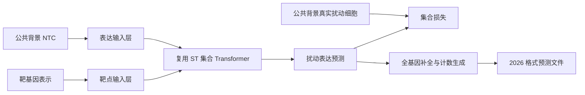

# L3-04｜State 微调实战与算力预算

> 本课回答：怎样复用 Arc 已发布的 State 预训练权重、完成微调并适配 2026 原始计数输出合同。原理侧（State 为什么这样设计）见 `L2-01 State 模型深潜`〔待写〕。
>
> 前置课程：[L3-03 单细胞原始计数生成](L3-03-单细胞原始计数生成.md)  
> 下一课：[L3-05 消融、集成与最终轮](L3-05-消融集成与最终轮.md)（完整学习顺序见 [README.md](README.md)）  
> 课程索引与主题归属：[README.md](README.md)
>
> 核验日期：2026-09-14。面向熟悉软件开发和机器学习、正在补齐单细胞生物学的读者。
>
> 本文是有源码依据的操作教程和实施设计。已核对官方规则、模型配置、加载逻辑和数据文件元信息；**尚未下载大权重/训练数据、运行微调或得到比赛成绩**。代码块分别标明原生命令、条件式示例和需要自行实现的部分；硬件与工时建议不是实测最低要求。

**推荐起点：复用官方 Replogle State Transition（ST，状态转移模型）的预训练权重，保留其实际的 328 维 Transformer 主干，先做小批兼容验证，再微调靶点表示和表达预测路径，最后接上 2026 原始计数输出。** 首次租用建议为 **1 张 24 GB GPU、64 GB 主机内存、300 GB SSD，先预留 4–8 GPU 小时做试跑**。若进入完整 18,533 基因训练，优先考虑 48 GB GPU、128 GB 内存和 500 GB SSD。先测吞吐再决定总预算，不必先购买完整预训练集群。

阅读顺序：第 1–3 节理解模型与权重；第 4–6 节准备数据并划分验证；第 7–9 节执行微调；第 10–12 节生成计数、评分、打包；第 13–15 节估算资源和安排工作。

2026-09-15 增加[可运行的三份学习 notebook](../../notebook/README.md)，直接读取本地 `data/vcc2026-validation/controls/`，保存了真实数据检查、官方配置与基因轴对比、集合模型数学演示和教学 H5AD 的运行输出；不需要先启动正式 State 训练。

## 1. 先说清楚：我们在微调什么任务

### 1.1 为什么有公共训练数据，还叫零样本

这里的**细胞背景（cell context）**，是细胞的类型、遗传状态、培养环境及实验条件共同决定的生物与测量环境。同一个基因被压低，在不同背景中可能产生不同后果：某条生存通路在一种细胞中必不可少，在另一种细胞中却可能有备用通路。

**CRISPRi（CRISPR interference，CRISPR 干扰）**用向导 RNA 将不切断 DNA 的 Cas 蛋白及抑制组件带到靶基因附近，降低该基因的转录。它不是把基因从 DNA 中删除，也不是把表达矩阵某一列机械地设为零。靶基因产物减少后，会影响调控、代谢、增殖等过程，进而改变其他基因的 RNA 水平；这种间接变化正是比赛要预测的内容。

**非靶向对照（non-targeting control，NTC）**携带不针对指定靶基因的向导，用来测量同一实验条件下的背景分布。它经过了相关实验流程，并不是完全没有处理过的自然细胞。

因此训练和考试是两件事：

| 阶段 | 模型能看到什么 | 学习或预测什么 |
|---|---|---|
| 公共数据预训练/微调 | K562、RPE1、HepG2、Jurkat 等背景的 NTC、扰动标签、扰动后表达 | 学习哪些响应可以跨背景迁移 |
| 2026 验证轮 | A/B/C 的 NTC 和 300 个靶基因名称 | 每个背景、每个靶点预测 400 个扰动细胞 |
| 2026 最终轮 | 新的 D/E/F NTC 和另一组靶点名称 | 按冻结流程预测，不获得对应扰动真值 |

“零样本”限制的是**目标背景中的扰动监督**，不禁止在其他背景训练或微调。也不意味着每个比赛靶点都从未出现在公共数据中。必须分别报告“新背景、已见靶点”和“新背景、未见靶点”。[S1][S2]

### 1.2 一个单细胞计数向量实际代表什么

**基因表达**在这里指 RNA 测量量。**单细胞 RNA 测序（scRNA-seq）**把大量细胞分别测量，得到“细胞 × 基因”的矩阵。一个计数为 0，可能是细胞里表达很低、检测遗漏，也可能是该基因确实未表达；不能一概等同于基因关闭。

比赛采用 **10x Flex**。其基本信息链是：固定细胞中的 RNA 与基因对应的探针对结合，相邻探针连接，随后连接产物获得细胞条形码和分子标记，经过扩增和测序后归属到细胞与基因。**UMI（unique molecular identifier，唯一分子标识）**用于识别重复扩增的同一标记分子，避免把 PCR 复制数当成独立检测分子数。最终 raw counts 是这条测量流程下去重后的检测计数，不是细胞全部 RNA 分子的无损清点。分子过程详见[基础学习指南](00-VC2025学习指南.md)及[L3-03 单细胞原始计数生成](L3-03-单细胞原始计数生成.md)。[S1][S12]

这决定了两个建模要求。第一，要学习生物响应，也要处理捕获效率、测序深度和实验平台带来的噪声。第二，模型内部的标准化表达可以是浮点数，但提交必须生成非负整数计数。

### 1.3 为什么不能把两个细胞逐行配对训练

**Perturb-seq**把基因扰动标签与单细胞表达测量结合。测量通常会破坏细胞，因此无法先测量某个细胞、扰动它，再测量同一个细胞。数据中第 100 行 NTC 与第 100 行扰动细胞没有天然对应关系。

State 因而学习“对照细胞集合 → 扰动后细胞集合”。给模型一组同背景对照，再给同背景同靶点的真实扰动细胞作为集合监督，比较两组分布，不要求第 i 个预测严格对应第 i 个真细胞。细胞周期、状态比例、扰动效率和检测噪声使集合内部本来就有差异。

在软件直觉上，可以把它想成学习输入样本群与输出样本群之间的变换；类比的边界是，真实生物系统并没有提供可回放的逐对象调用日志。

## 2. State 包含 SE 和 ST，本教程优先微调 ST

**State Embedding（SE，状态嵌入）**把表达向量变成紧凑表示，主要学习细胞状态结构。**State Transition（ST，状态转移）**接收对照状态和扰动表示，预测扰动后的状态。它们职责不同：只有 SE 权重，不能自动得到一个扰动预测器。

官方发布的 ST 可以工作在 HVG、SE 嵌入或表达空间中。**HVG（highly variable genes，高变基因）**是选出的变化较明显的一部分基因，常用于压缩输入。选出 2,000 个 HVG 不表示另外 16,533 个比赛基因不重要，也不满足全基因提交合同。

本教程先选表达/HVG 路线，因为它减少了额外 SE 编码、解码与基因映射的工作。不需要重新训练论文中用 1.67 亿观察性细胞训练的 SE，也不需要把 Tahoe-100M 全部下载到本地。[S3][S4]



ST 中通常是**一个细胞一个 token**，token 的特征是多个基因的表达；`cell_set_len=64` 指每组 64 个细胞，不是 64 个基因。预测 400 个细胞也不要求把训练集合长度改成 400：可以多组推理，处理尾组后精确保留 400 行。

## 3. 选择权重：不要把三种 State 当成同一个配置

以下为固定版本的官方资产或源码核验结果。[S3][S4][S5]

| 对象 | 已核实结构/输出 | 适合做什么 | 主要适配工作 |
|---|---|---|---|
| `ST-HVG-Replogle/zeroshot/jurkat` | 8 层；hidden 328；set 64；输入/输出 2,000；one-hot 靶点维度 2,024 | 最小加载与微调起点；候选跨 Jurkat 留出权重 | 保留原 HVG 轴；未见靶点表示；全基因输出；核实预训练暴露 |
| `st-x-replogle-full/k562_0.99` | 8 层；hidden 328；set 64；输入/输出 6,546；one-hot 2,024 | 表达空间迁移的另一候选 | `full` 仍不是 18,533；训练划分不能从文件名猜 |
| `ST-SE-Replogle` / `st-se-replogle-full` | 已发布 checkpoint 与配置 | 已有 SE 管线时比较 | SE 输入、解码器和基因轴都要额外核对 |
| 当前源码 `model=state` 默认 | 8 层；hidden 768；set 512；全基因输出路径 | 随机初始化对照或后续扩模 | 不能直接用它接 328 维权重并声称完整复用 |
| 作者 VC2025 Colab | ESM2 连续靶点；40k 训练步；2025 H1 support 数据 | 参考靶点特征与训练入口 | 不是 2026 数据划分；不保证公开对应的已训 checkpoint |

**one-hot（独热编码）**把靶点表示为某一位置为 1、其余为 0 的向量；坐标含义由词表决定。它有利于学习已见靶点，却不能自然处理新靶点。

**ESM2**是从蛋白质氨基酸序列学习表示的预训练模型。对编码蛋白质的靶基因，连续向量可以把序列相关信息传给 ST。新靶点有向量，代表模型能接收它；不代表模型已经知道其在新背景中的真实影响。非蛋白编码靶点、别名和多个蛋白异构体还需要明确处理策略。

特别注意 hidden 328 的官方配置仍有 `12 heads`、`head_dim=64`、`intermediate_size=3072`。不能自行把 head 数改为能整除 328 的数；这里投影后的注意力宽度由配置决定。复制父模型的真实结构，比套用一般 Transformer 的经验规则可靠。

推荐两段推进：先用 `ST-HVG-Replogle` 验证加载、预处理和旧靶点行为；再复用其主干微调 ESM2 输入及全基因预测路径。后一段应明确命名为 **“State 预训练主干迁移微调”**，并报告复用了哪些权重。

## 4. 数据下载单：哪些必须有，哪些以后再加

### 4.1 第一批：四背景 CRISPRi 核心数据

K562、RPE1、HepG2、Jurkat 是不同来源的细胞模型。这里不需要记住每个细胞系的所有生物学特征，先理解其用途：让模型观察**相同靶点在不同背景中的响应**，并保留背景进行外部验证。K562 与 RPE1 来自 Replogle 数据，HepG2 与 Jurkat 来自 Nadig 数据。[S6][S7]

优先下载 scPerturb 整理的压缩 H5AD，避免先下载近百 GB 的未压缩作者副本。2026-09-14 已从固定 Zenodo record `13350497` API 重新核实下表文件名、体积和 MD5；数据记录许可为 CC BY 4.0。它们是作者数据的整理副本，使用时仍须核对 raw-count 内容、符号处理和筛选差异。[S8]

| 优先级 | 文件名 | 下载 GB（十进制） | 用途 |
|---|---|---:|---|
| 必需核心 | `ReplogleWeissman2022_K562_essential.h5ad` | 1.547 | 核心训练背景 |
| 必需核心 | `ReplogleWeissman2022_rpe1.h5ad` | 1.237 | 核心训练/留出背景 |
| 必需核心 | `NadigOConner2024_hepg2.h5ad` | 0.851 | 增加背景差异 |
| 必需核心 | `NadigOConner2024_jurkat.h5ad` | 1.294 | 增加背景差异；配合 Jurkat 留出实验 |
| 第二批建议 | `ReplogleWeissman2022_K562_gwps.h5ad` | 8.805 | 扩展靶点覆盖；GWPS 指全基因组扰动筛选 |
| 合计 | 四背景核心 / 加 GWPS 后五个文件 | **4.928 / 13.733** | 不是所有派生文件的工作盘需求 |

五文件精确合计为 `13,733,339,273 bytes`。Nadig 文件名中的 `2024` 是整理版本命名，其对应正式论文为 2025 年，不能据文件名拆成两项独立证据。

下载链接统一为 `https://zenodo.org/records/13350497/files/<文件名>?download=1`。例如以下命令只下载一个文件；正式操作对下载单逐项执行，并核对大小和校验和：

```bash
mkdir -p /data/vcc2026/raw/scperturb
curl --fail --location --continue-at - \
  'https://zenodo.org/records/13350497/files/NadigOConner2024_hepg2.h5ad?download=1' \
  --output /data/vcc2026/raw/scperturb/NadigOConner2024_hepg2.h5ad
md5sum /data/vcc2026/raw/scperturb/NadigOConner2024_hepg2.h5ad
```

| 文件简写 | Zenodo 发布的 MD5 |
|---|---|
| K562 essential | `d8cba17576d1a8afc0f7d71b79cad0f7` |
| RPE1 | `cc7f1ec50aeb3a3e1b4a6cfa713d80fa` |
| HepG2 | `af2be47f7477cf32fa6e4bec1c6a4868` |
| Jurkat | `d8b05d00bfbd686d37ffdd4293bc6c8c` |
| K562 GWPS | `13db594f8f1d2ccb88fec44a13e414dc` |

MD5 用于与来源发布值核对，实验 manifest 另记录本地 SHA-256。不要同时把 scPerturb 副本和对应作者原件当作两份独立训练数据。

### 4.2 比赛输入、H1 开发集与模型辅助资产

| 数据/资产 | 大小依据 | 是否需要 | 正确用途 |
|---|---:|---|---|
| 2026 `controls.zip` | 官方约 0.63 GB | 必需 | A/B/C NTC、基因顺序、当前靶点清单 |
| ST-HVG 所选一个 `best.ckpt` | 471,699,039 bytes | 必需选一组 | 预训练初始化；加配置/映射后预留约 0.5 GB |
| ST-x 所选一个 `best.ckpt` | 664,162,239 bytes | 可选替代 | 另一条表达空间初始化；不必两套全下载 |
| ESM2 靶点特征字典及名称映射 | 随覆盖数和维度变化 | 未见靶点路线必需 | 复用特征，不重训蛋白模型；维度/来源/覆盖需验证 |
| H1 `train/adata_Training.h5ad` | 15,482,497,461 bytes | 推荐开发集 | 给 H1 NTC；扰动真值仅交给评分器 |
| H1 validation + test H5AD | 18.880 GB 合计 | 后期可选 | 结构冻结后增加 H1 训练监督；不是第一轮微调前置 |
| 2025 State support ZIP | 8.717 GB 下载，约 48.691 GB 解压 | 可选便利包 | 查 ESM2 特征及原作者流程；含 H1 内容，须防重复和泄漏 |

H1 是**人胚胎干细胞系（human embryonic stem cell line）**，与前述癌细胞/其他细胞背景存在生物差异，但其 10x Flex 测量平台接近本赛，因此特别适合检查测量平台迁移。先把整个 H1 留出；配置冻结后再决定是否加入最终微调。[S9][S10]

H1 下载入口、对象版本和校验要求见 [H1 benchmark 审计](../research/h1-benchmark-audit.md)。不必下载 FASTQ 原始测序读取：这里从处理好的 count matrix 开始，没有重新比对数 TB 读取的训练需要。

加上 H1 开发对象、比赛输入和一个权重，第一批下载约 **21–23 GB**；加入 GWPS 后约 **30–33 GB**。范围给辅助文件和特征留出空间，**不包括可选 support ZIP、环境安装缓存和派生数据**。

### 4.3 暂缓的数据

| 数据 | 暂缓理由 | 什么时候再加入 |
|---|---|---|
| Jiang 六细胞系、五条信号条件的 Perturb-seq | 约 20.142 GB 的五个 RDS；R 格式转换、刺激条件、对照匹配需额外处理 | 四背景流程可靠后补背景多样性 |
| Tahoe-100M | 主要为药物扰动，训练条件与单基因 CRISPRi 不同 | 独立设计跨模态实验时 |
| scBaseCount 等观察性图谱 | 提供状态结构，不直接提供 CRISPRi 前后监督 | 比较冻结 SE 或观察性预训练收益时 |
| 其他 CRISPR knockout 数据 | knockout 是基因敲除，与 CRISPRi 敲低强度和机制不同 | 明确加入扰动模态条件并做消融时 |

Jiang 的六种细胞系加五种信号条件不等于 30 种独立细胞系；刺激状态是背景的一部分，要把实验条件写进 context 定义。[S11]

### 4.4 到底需要多少细胞才能开始

没有已核验的一手证据能给出“至少 N 个细胞即可达到某个 VC2026 分数”。数据价值主要取决于背景、靶点、对照和实验质量的覆盖，重复增加同一种细胞不能替代增加一个新背景。

建议三档逐步扩大，以下为工程采样方案：

| 阶段 | 建议样本组织 | 它能回答什么 |
|---|---|---|
| 接口试跑 | 每训练背景选 10–30 个靶点，每组最多取 128 个扰动细胞，另取 500–2,000 个 NTC；总计通常几万细胞 | 能否加载、产生有限损失、保存并恢复模型 |
| 首次迁移微调 | 使用四背景核心中通过 QC 的全部可用条件；按背景与靶点平衡抽集合 | 模型是否能改善一个留出背景 |
| 覆盖扩展 | 加 GWPS；平衡其与其他背景的采样权重 | 大量新增靶点是否改善已见/未见目标表现 |

STATE 预印本报告的 Replogle-Nadig 筛选输入为 624,158 cells、1,677 perturbations、4 contexts；这是作者特定筛选协议下的规模，不能等同于 scPerturb 文件原始行数或我们将要使用的精确训练行数。[S3][S6][S7]

## 5. 微调之前先确定验证划分，连预训练暴露一起算

### 5.1 微调集没有某背景，不代表模型从没见过它

假设一个公开 checkpoint 已经用 Jurkat 扰动训练过。之后只用 K562 微调，再在 Jurkat 上测试，并不能称为“Jurkat 从未见过”。预训练权重已经携带了该背景的信息。

因此每个实验须记录两个清单：**父 checkpoint 的训练暴露**和**本次微调的数据暴露**。仅下载名字含 `zeroshot/jurkat` 的权重还不充分。官方仓库确有 Jurkat 整体留出的 TOML，发布配置也指向同名协议；但发布资产未包含逐样本训练 manifest 或完整原始 TOML 内容，当前只能说“与留出协议一致的候选”，不能声称已经证明逐细胞未暴露。[S5]

对预训练来源无法完全确认的结果，单独标注“预训练暴露未完全核验”；不要放进严格干净 LOCO 排名。**LOCO（leave-one-context-out，留出整个细胞背景）**应从预训练、特征拟合、微调直到选模全链条审计。

### 5.2 推荐开发顺序

1. **H1 开发回路：**优先选择有证据仅用 Replogle/Nadig 的父权重，本次微调排除全部 H1 扰动；H1 只给 NTC 输入。审计父权重来源后，才决定结果可以标为干净还是暴露未知。
2. **公共背景留出：**每折使用相应未暴露于测试背景的父权重/训练来源；没有干净父权重时，可以额外从头训练一个小对照，或诚实降低结论等级。
3. **全局靶点留出：**若声称预测未见靶点，必须在所有训练背景和父权重暴露中检查该靶点；仅从一个背景删除它不够。
4. **冻结最终方案：**学习率、生成器、模型选择规则确定后，可以将 H1 加入最终训练，但此后的 H1 分数只能称为已见背景或训练后参考。

随机拆分单细胞仅适合调试。它让相同背景、靶点甚至 guide 的近似样本跨越训练与测试，不能检验本赛需要的迁移。

### 5.3 原生 TOML 示例

下面是一个**语法示例**：同目录内只有经过同一基因轴处理的公共数据，`context_id` 的取值正好是所写名称。Jurkat 用于外层测试，HepG2 用于选 checkpoint，剩余背景训练；这会只留下两个核心训练背景，所以它是容易理解的第一折，不是唯一的最优划分。

```toml
[datasets]
public_crispri = "/data/vcc2026/aligned/core4/"

[training]
public_crispri = "train"

[zeroshot]
"public_crispri.Jurkat" = "test"
"public_crispri.HepG2" = "val"
```

TOML 只控制本次 loader 的划分，不能撤销父权重暴露。若父权重见过 HepG2，它可以用作已见背景开发验证，但应另加未暴露背景的迁移检验。最终 test loss 不用于挑 best checkpoint。[S4][S5]

## 6. 数据处理合同：让每个数与每列基因都有明确含义

### 6.1 每个 H5AD 至少保留这些对象

**AnnData/H5AD**是表达矩阵和元数据的容器，可以把它理解成一个带行列注释的矩阵文件；它并不保证 `.X` 天然就是 raw counts。

| 对象 | 本项目约定 | 为什么需要 |
|---|---|---|
| `.X` | 原始整数值 counts，推荐 CSR | 保存测量基准，避免不可逆覆盖 |
| `.obs.target_gene` | 统一基因符号；对照统一 `non-targeting` | 连接特征词表和比赛靶点 |
| `.obs.context_id` | 生物背景及必要的刺激条件 | 分组和留出 |
| `.obs.batch_id` | `study:context:原batch` 等可追溯标识 | 同背景内匹配对照；避免不同文件 batch 同名 |
| guide/construct、study、assay | 保留原始列与映射 | QC、重复数据识别和技术差异审计 |
| `.var_names` | 规范化后的唯一基因符号、固定顺序 | 避免按错列训练 |
| `.obsm['X_hvg']` | 只在 HVG 路线存固定旧基因轴的 log 表达 | 与旧输入层坐标逐项一致 |
| `.var['gene_name']`、`.uns['hvg_names']` | 完整基因名列；与 `X_hvg` 同序的旧 HVG 名单 | 让 loader 取到正确的输出名称 |
| 实测基因 mask | 每个来源哪些基因确实测量 | 区分缺测与真实零计数 |

处理顺序应为：读 metadata → 固定划分 → 核对计数层 → 统一标签 → 建立基因映射 → 分块变换 → 核验覆盖 → 才交给 loader。不要先把全部来源 dense concat 到内存中。

HVG 路线还要清除冲突的 `.var['highly_variable']`，或保证该 mask 按 `.var` 顺序选出的名单与 `X_hvg` 完全一致。固定 loader 的名称选择有优先级，仅保存 `.var_names` 和 `X_hvg` 不够；最终断言 `data_module.get_var_dims()['gene_names']` 与父权重有序名单逐项相同。[S5]

### 6.2 对照匹配为什么不能随便选

同一背景下，测序批次、培养处理或刺激条件不同，也会改变表达。**批次效应（batch effect）**是技术或实验过程造成的系统差异；若用一个批次的 NTC 配另一个批次的扰动，模型可能把这种差异学成基因扰动响应。

每个训练集合应从同一 `context × target × batch` 条件取扰动细胞，从对应 `context × batch` 取 NTC。检查范围是 loader 的每个实际文件/dataset 与 split，不能只在全局合并后检查存在对照。没有匹配对照的组先报告并处置，不能默认拿全局对照填上。保留多 guide 信息，用于发现弱敲低、错标或异常组；不能利用外层测试扰动表达挑选“最好预测”的 guide。

### 6.3 归一化只做一次，而且要保留旧 checkpoint 的尺度

定义每细胞总计数 $L_i=\sum_g x_{ig}$。本项目可采用明确的 **CP10K** 尺度，即每细胞按总量缩放到 10,000：

$$
z_{ig}=\log\left(1+10{,}000\frac{x_{ig}}{L_i}\right).
$$

先排查总量为零的细胞。对已经归一化的值再次运行此变换会改变尺度。总量分母还必须说明基于哪个基因集合计算：先裁到 2,000 HVG 再归一化，与在原始全表达轴归一化后取 HVG，不是同一数据。

原版 `preprocess_train` 调用 `normalize_total` 时没有显式固定 10,000。**兼容旧权重推理必须追溯其实际预处理；不能因配置写着 `X_hvg` 就认定它是 CP10K。** 若旧尺度无法完全恢复，但决定统一 CP10K 继续训练，应记录这是一次输入分布迁移，不能称逐字复现。[S4]

对于新的 full-gene 路线，源码支持：`.X` 保留 raw counts，设置 `model.kwargs.log1p_from_raw_counts=true`、`counts_target_sum=10000`，同时 `+data.kwargs.is_log1p=false`。模型在内部变换。HVG 路线则可以直接提供已准备好的 `X_hvg`，关闭上述内部 raw 转换。二者选一个，不叠加。

### 6.4 最容易漏掉的难点：缺测基因

2026 输出要求 18,533 基因，而公开矩阵可能只包含筛选后的几千个基因。某基因未出现在公开文件中，表示**没有这项监督**，不能把补零当成“实验测到该基因永远为零”。

H1 为 18,080 基因；既有核验与当前 2026 基因轴交集为 18,077，另有 456 个 2026 基因在 H1 中缺失、3 个 H1 独有基因。下载当轮文件后需复算，不硬编码旧清单。[S9]

两种明确的实现选择：

| 选择 | 如何训练 | 如何输出 18,533 基因 | 边界 |
|---|---|---|---|
| 保留旧 HVG ST + 全基因适配器 | 旧轴上微调 ST；用有实测监督的基因训练补全/残差头 | 目标 NTC 提供完整基线，模型负责可支持的效应，其余明确采用零效应假设 | 工程量较小，但未建模基因的扰动响应无法凭空恢复 |
| ST 全基因迁移 | 扩展输入/输出；每个来源在实测基因子空间计算集合损失 | 全基因 head 加同样的覆盖/缺失规则 | 必须给 loader/loss 增加实测 mask，不能仅补零后用原生 loss |

对于 Energy 集合损失，可在同一 screen 的预测集合和真值集合中取相同实测基因子集后计算距离；若各来源测量维数不同，还需固定距离归一化/权重规则，防止宽面板支配损失。输入缺测也应使用明确的填充和 mask 设计，不能把某来源的缺测模式误读成生物特征。

**固定 State 源码没有自动完成这套跨来源全基因 mask 适配。** 第 9 节全基因命令必须在该数据/损失适配实现后使用。缺失处理属于比赛方案的实质工作，不能藏在一个 `reindex(fill_value=0)` 里面。

2026-09-15 的[模型学习 notebook](../../notebook/02_state_model_and_transfer.ipynb)读取固定官方 hparams 与本地官方基因清单后，原始符号逐字匹配为 HVG `1,877/2,000`、旧 full `6,197/6,546`。旧轴分别有 123/349 个名称未直接匹配；先检查别名和 ID 版本，再确定真实缺测。该结果说明目标 NTC 输入也要核验旧基因覆盖，不能仅检查训练文件；它不是 300 个扰动靶点的训练覆盖率。

### 6.5 靶点特征覆盖在 GPU 训练前完成

生成 `target_coverage.tsv`，对每个训练目标、H1 评估目标和当轮 300 目标记录：原名、规范名、序列/特征来源、向量维度、是否有限、是否意外零向量、父权重是否已见、公共数据是否有扰动监督。

旧 one-hot 路线要保留原 `pert_onehot_map.pt` 的坐标含义。重新按当前数据排序生成相同长度的词表，形状虽相同，原权重的每列却已指向错误靶点。

ESM2 路线使用 `{gene_symbol: tensor}` 特征字典，并给 `non-targeting` 一个显式约定。官方 starter 已采用 ESM2，添加它本身不是我们新的架构贡献。旧 support 包可能缺少 2026 靶点；无法取得蛋白序列的目标需要有来源的备用表示或显式缺失编码，并独立评估。[S4]

已有特征可从作者 [VC2025 support ZIP](https://storage.googleapis.com/vcc_data_prod/datasets/state/competition_support_set.zip) 的 `ESM2_pert_features.pt` 线索开始：先列出压缩包目录，只提取所需特征和来源说明，不无条件解压约 48.7 GB 内容。对缺少的编码蛋白基因，要用与旧特征相同的 ESM2 checkpoint、输出层、序列版本与 pooling 方法补算；这些细节无法核实时，应重新生成一致的一套特征并单独记录，不能混合不兼容表示。这里的“冻结 ESM2”表示训练 ST 时把这些向量当作常量，不需要在每个训练 step 重跑蛋白模型。

当前 loader 遇到缺失特征会补零，infer 遇到未知靶点会退回对照表示。项目入口应提前拒绝未覆盖目标并输出清单，防止表面上生成了 400 行、实际全在预测 NTC。[S4][S5]

## 7. 建立可复现环境，下载一组权重而非整个仓库

### 7.1 环境与目录

固定源码要求 Python `>=3.11,<3.13`，建议单独使用 Python 3.12。训练环境与 H1 评分环境分开：前者依赖旧 `cell-eval`，后者使用 `cell-eval2` 的固定版本；包名相似不代表评估协议相同。[S4][S10]

下面是**安装示例，本文没有执行安装**。`/data/vcc2026` 表示你的工作盘，可整体替换为自己的绝对路径。CUDA/PyTorch 安装仍须与实际驱动匹配。

```bash
mkdir -p /data/vcc2026/src /data/vcc2026/envs
git clone https://github.com/ArcInstitute/state.git /data/vcc2026/src/state
git -C /data/vcc2026/src/state checkout 9bbfe78a434a55205e4de834e1ea99f85f7a3add

uv venv --python 3.12 /data/vcc2026/envs/state
source /data/vcc2026/envs/state/bin/activate
uv pip install -e /data/vcc2026/src/state
uv pip install 'cell-load @ git+https://github.com/ArcInstitute/cell-load.git@9ba45e59f6f8117bb7a21371ad38d67175586d53'
uv pip check
state tx --help
python -c 'import torch; print(torch.__version__, torch.cuda.is_available())'
```

源码固定并不自动锁定全部传递依赖。首次成功安装后保存完整依赖解析、Python/CUDA/驱动版本和源码 diff；后续机器按该锁定结果恢复。不要边训练边更新 `transformers`、Lightning 或 cell-load。

建议工作目录：

```text
/data/vcc2026/
  raw/                 原始输入，保留来源与校验和
  pretrained/          选中的官方 checkpoint 和配套配置
  manifests/           数据、基因、靶点、预训练暴露清单
  aligned/             分块对齐后的 H5AD
  features/            ESM2、名称映射、覆盖报告
  splits/              每个实验的 TOML 和实际样本清单
  runs/                每个实验独立目录
  predictions/         按背景与靶点分片的输出
  evaluation/          独立评分资产和结果
```

权重、H5AD、预测和缓存不放入普通 Git；仓库只保存配置、代码、manifest、来源和教程。

### 7.2 只下载一个 run 的必要文件

下面的 Python 示例在已安装 `huggingface_hub` 的环境执行。固定 revision，下载一个 `best.ckpt` 及其配置/映射。不要用覆盖整个模型仓库的下载模式：发布树里包含 `adata_real.h5ad`、真实 DE 等评估答案，既浪费空间，也可能进入训练路径造成泄漏。

```python
from huggingface_hub import snapshot_download

run = "zeroshot/jurkat"
files = [
    "config.yaml",
    "version_0/hparams.yaml",
    "checkpoints/best.ckpt",
    "pert_onehot_map.pt",
    "batch_onehot_map.pkl",
    "cell_type_onehot_map.pkl",
    "var_dims.pkl",
    "data_module.torch",
]
snapshot_download(
    repo_id="arcinstitute/ST-HVG-Replogle",
    revision="bb6a9562cbbf1fd152df14cc53b4cc7517c77175",
    allow_patterns=[f"{run}/{name}" for name in files],
    local_dir="/data/vcc2026/pretrained/ST-HVG-Replogle",
)
```

`data_module.torch` 主要保存配置和作者本机路径，不是全部训练数据。旧 `.pkl` 映射与新运行 `.torch` 映射的命名也有版本差异，应按实际 loader/infer 读取路径核对，不仅凭扩展名替换。[S5]

### 7.3 加载后的第一次检查

先用 CPU 读取来源可信、已固定 SHA 的 checkpoint，检查 `hyper_parameters` 和 `state_dict` 的键、形状；正式 GPU 微调前输出：

```text
parent checkpoint / revision / SHA-256
input/output gene names and order
old target feature mapping and dimensions
hidden/layers/heads/head_dim/FFN/set length
preprocessing scale and measured-gene mask
loaded / reinitialized / unexpected keys
loaded parameter elements / expected reusable parameter elements
trainable parameters by module
pretraining and fine-tuning exposure manifest
```

“成功执行 `load_state_dict`”仅说明某些张量被接受。关键是 Transformer 的注意力、MLP 和归一化层是否按预期继承；比例用参数元素数计算，不能按键数量估计。

然后在原接口上做少量 NTC 与已覆盖靶点推理。检查数值有限、基因顺序正确、不同靶点不是完全相同输出、改变 NTC 背景会影响预测。此时只检验接口和响应敏感性，不把小样本数值当作性能结论。

## 8. 原生微调入口：`init_from` 与 resume 必须分清

### 8.1 三种操作的区别

| 操作 | 权重来源 | 优化器/训练步 | 使用场景 |
|---|---|---|---|
| 从头训练 | 随机初始化 | 新建 | 消融或没有合适父权重 |
| `model.kwargs.init_from=...` | 加载同名且形状匹配的张量 | 新建优化过程 | 迁移到新数据、改学习率、换输入/输出层 |
| 相同 run 的 `last.ckpt` resume | 恢复该 run checkpoint | 恢复训练状态 | 中断后继续同一实验 |

固定源码在输出目录已有 `checkpoints/last.ckpt` 时优先 resume；只有不存在它时才处理 `init_from`。因此每个新微调实验使用新的 `name`，不要把父 run 当作输出目录。不能通过删除原实验文件来混淆两种操作。[S5]

`init_from` 会预先过滤形状不匹配的键，再 `strict=False` 加载。单独使用 PyTorch 的 `strict=False` 并不能自动忽略所有同名张量的形状冲突；也不能解决同形但基因/靶点含义错位。

### 8.2 第一段微调：先保留 2,000 HVG 表达接口

下面是**原生 CLI 字段组成的迁移 pilot 示例**。前提是已经完成第 6 节：各来源的 `X_hvg` 对应父权重的同一组 2,000 基因、同一顺序，监督轴也一致，且每个来源确实测过全部这些基因；特征文件覆盖全部目标；TOML 真正包含 train/val/test。若旧 HVG 也存在缺测，须先实现 mask、排除不兼容来源或迁移基因轴，不能补零进入原生 HVG loss。这里换 ESM2 并关闭旧 batch embedding，属于显式迁移，不是父模型原样复现。

若先做保留旧靶点表示的兼容微调，将下方 `perturbation_features_file` 改为父 run 的 `pert_onehot_map.pt`，并只使用其已覆盖目标。切换 ESM2 时，若新特征维数恰为旧维数 2,024，须先用迁移器排除旧 `pert_encoder` 权重；原生 shape 检查不能发现同维但不同含义的问题。

```bash
state tx train \
  model=state \
  model.kwargs.init_from=/data/vcc2026/pretrained/ST-HVG-Replogle/zeroshot/jurkat/checkpoints/best.ckpt \
  model.kwargs.hidden_dim=328 \
  model.kwargs.cell_set_len=64 \
  model.kwargs.transformer_backbone_kwargs.hidden_size=328 \
  model.kwargs.transformer_backbone_kwargs.intermediate_size=3072 \
  model.kwargs.transformer_backbone_kwargs.num_hidden_layers=8 \
  model.kwargs.transformer_backbone_kwargs.num_attention_heads=12 \
  model.kwargs.transformer_backbone_kwargs.num_key_value_heads=12 \
  model.kwargs.transformer_backbone_kwargs.head_dim=64 \
  model.kwargs.n_encoder_layers=1 \
  model.kwargs.n_decoder_layers=1 \
  model.kwargs.batch_encoder=false \
  model.kwargs.use_batch_token=false \
  model.kwargs.freeze_pert_backbone=false \
  model.kwargs.lora.enable=false \
  +model.kwargs.gene_decoder_bool=false \
  model.kwargs.log1p_from_raw_counts=false \
  data.kwargs.toml_config_path=/data/vcc2026/splits/hvg_pilot.toml \
  data.kwargs.embed_key=X_hvg \
  data.kwargs.output_space=gene \
  data.kwargs.pert_col=target_gene \
  data.kwargs.cell_type_key=context_id \
  data.kwargs.batch_col=batch_id \
  data.kwargs.basal_mapping_strategy=batch \
  data.kwargs.control_pert=non-targeting \
  data.kwargs.perturbation_features_file=/data/vcc2026/features/esm2_all_targets.pt \
  data.kwargs.num_workers=4 \
  +data.kwargs.is_log1p=false \
  training.batch_size=4 \
  training.gradient_accumulation_steps=4 \
  training.lr=0.00001 \
  training.max_steps=2000 \
  training.val_freq=2000 \
  training.train_seed=42 \
  training.devices=1 \
  use_wandb=false \
  training.wandb_track=false \
  output_dir=/data/vcc2026/runs \
  name=st_hvg_esm2_pilot_001
```

这里 `.X` 保存 raw counts，所以 `is_log1p=false`；主输入和监督直接读取已预处理的 `X_hvg`，因此 `log1p_from_raw_counts=false`，不再做内部 raw 转换。这两个开关描述不同对象。不要遗留误称 `.X` 已 log1p 的 `uns['log1p']` 元数据；对原始表达路线使用第 9 节另一套配置。

本示例显式关闭辅助 `gene_decoder`，去除一组不参与当前主路径但仍占存储的参数。此 HVG 配置的原生 loader 本来不提供触发辅助损失的 `pert_cell_counts`，不能声称此处修复了已经发生的重复 loss；关闭它也防止后续改输入路线时意外引入另一条监督。这个简化应记录在配置中。`basal_mapping_strategy=batch` 启用同批次同背景对照匹配；原生实现仍有缺对照时跨 batch 回退，因此必须提前检查每个组都有匹配对照，而不能只依赖这个开关。[S5]

`batch_size=4` 表示一个 microbatch 的集合数，每组 64 个细胞；累积 4 次得到单 GPU 上每次更新约 `4 × 4 = 16` 组、`16 × 64 = 1,024` 个细胞位置。采样会重复使用细胞，因此这不是每步 1,024 个新的独立实验样本。

`max_steps` 是优化器更新步数；`val_freq` 在源码中传给 Lightning 的 `val_check_interval`，按训练 batch 计数。此配置每 2,000 个 microbatch 约验证一次，即约 500 次优化器更新；最后一次不完整累积等边界以实际日志为准。估算时间时不能把 microstep 与 optimizer step 混用。[S5]

另一个源码细节：`training.ckpt_every_n_steps` 虽在 YAML 中出现，当前 callback 没有使用它，而将 `val_freq` 同时当作 checkpoint 的 optimizer-step 间隔。因此这里验证约每 500 更新一次，checkpoint 触发却每 2,000 更新一次；不能保证保存所有验证点中的最佳模型。pilot 结束另存 `final.ckpt` 可用于接口检查。正式选模前应修正 callback：每次验证完成后按本次 `val_loss` 选 best，周期性 resume 保存单独配置，并验证保存的权重确实对应所记录分数。[S5]

学习率 `1e-5`、2,000 steps 是保守 pilot 起点，不是作者最优参数。pilot 用于检查继承比例、梯度、吞吐和初步验证；不能把 2,000 步文件直接视为正式提交模型。

### 8.3 如何选择冻结范围和学习率

更完整的迁移通常分两段，以下需要在项目训练器里显式实现：

| 阶段 | 训练哪些参数 | 工程起始范围 | 观察什么 |
|---|---|---|---|
| 新接口热身 | 新 ESM2 输入层、改过的表达层/输出层；Transformer 固定 | 500–2,000 更新；新层 LR `1e-4` | 新接口能否把输入送入旧主干并形成有效输出 |
| 联合微调 | 新层 + Transformer | 5k–20k 更新；主干 LR `1e-5`，新层 `1e-4`，验证早停 | 迁移增益能否稳定；旧能力是否遗忘 |

这是起始搜索区间，不能据此保证收敛。原生优化器是一个学习率的 **Adam**；配置中的 `weight_decay` 没有被传给该优化器。分组学习率、AdamW、scheduler 或只冻结指定模块都需要修改训练器，并保存 diff。[S4][S5]

尤其不要用 `freeze_pert_backbone=true` 代替“只训练新头”：源码会冻结 Transformer **和 `project_out`**。扩展输出后，新初始化的输出层可能因此完全不学习。

### 8.4 为什么首轮不直接开 LoRA

**LoRA（low-rank adaptation，低秩适配）**通过训练附加的小矩阵减少主干更新参数。它可降低优化器状态开销，但通常仍需保留训练输入层时穿过主干的计算图，也不会自动解决大输出头和缺测基因问题。

固定源码在加载 `init_from` 前注入 LoRA；PEFT 包装会改变部分权重键名，未带 LoRA 的父 checkpoint 可能无法按原键名继承。正确做法是先完整加载基础权重再注入，或实现并验证重映射。首轮保持 `lora.enable=false`；以后与全量微调做同协议比较。[S5]

### 8.5 精度与显存

当前 ST Trainer 没有自动传入 bf16 precision；不能只添加一个 YAML 字段就假设它生效。若采用混合精度，需把经过验证的 `precision="bf16-mixed"` 接入 Lightning Trainer，并确认硬件支持。Energy loss 的距离与规约必要时保持 FP32，检查 finite、梯度和结果稳定性。T4 不应按原生 bf16 硬件预算；L4/A100 等也要实际核验环境。

最先降低 microbatch，配合梯度累积维持更新组数。改变 set 长度会同时改变模型看到的群体信息；从 64 改 32 不仅是省显存参数，要在结果表标注。增加 GPU 数也不必然提速：集合采样器与分布式拆分必须先验证不重复取同一批数据。

## 9. 第二段迁移：从旧基因轴走到 18,533 基因

### 9.1 哪些层可以复用

设旧轴为 $G_{old}$，新轴为 $G_{new}$，隐藏维度仍为 328。

| 模块 | 基因数变化的影响 | 迁移方法 |
|---|---|---|
| Transformer | 主干形状通常不变 | 完整继承并核对键/元素比例 |
| `basal_encoder` | 输入列数变化 | 按基因符号复制交集列；新列初始化 |
| `pert_encoder` | one-hot → ESM2 改变输入含义和维数 | 新建并训练；不能按形状相同就保留旧含义 |
| `project_out` | 输出行数变化 | 按基因符号复制交集行和 bias；新行初始化 |
| `final_down_then_up` | `all` 路径有 `G → G//8 → G` | 形状变化时需专门迁移或重建，不存在天然基因对应的中间隐维 |
| batch embedding | 新 batch ID 没有旧坐标 | 显式移除或重新设计；不把未知 batch 当第 0 个旧 batch |

从 HVG `gene` 路线进入 `all` 路线会新增最后的全基因混合层；从旧 `all` 扩到新 `all` 也会改变其形状。`init_from` 只能复用它认可的同形键，**不会替你按基因名称复制交集参数**。

如果保留官方 `G → G//8 → G`，当 `G=18,533` 时仅这一层组就有 **85,865,705 个参数**。这解释了为什么“复用 328 维小主干”扩成全基因后也可能需要更大 GPU。换成低秩残差 head 可以减少开销，但它属于新的适配架构，需要与保留原层的版本分开命名与比较。[S4][S5]

### 9.2 全基因配置增量

完成第 6.4 节的 mask/监督适配、输入输出参数迁移和验证后，继续沿用第 8 节结构配置，改用以下字段。**这是配置增量，不是可单独执行的完整命令，更不是原生源码已经支持缺失 mask 的承诺。**

```text
model.kwargs.init_from=/data/vcc2026/runs/st_hvg_esm2_pilot_001/checkpoints/best.ckpt
data.kwargs.toml_config_path=/data/vcc2026/splits/fullgene_train.toml
data.kwargs.embed_key=null
data.kwargs.output_space=all
+data.kwargs.is_log1p=false
model.kwargs.log1p_from_raw_counts=true
model.kwargs.counts_target_sum=10000
training.batch_size=1
training.gradient_accumulation_steps=16
name=st_fullgene_transfer_001
```

示例 parent 仅说明连接方式；正式训练使用经过选模的父 run。若按基因映射生成了迁移 checkpoint，这里的 `init_from` 应指向那一份已审计的初始化文件。确认 `.X` 是 raw，且没有残留表示 `.X` 已 log1p 的错误 `uns['log1p']` 元数据，否则 loader 可能自动改变模式。

模型内部输出“全基因表达”仍不等于“原始整数计数”。不要通过 `nb_decoder=true`、`softplus=true` 或变量名 `counts_preds` 判断自己已经具备合规生成器；必须检查实际执行分支和写出数值。[S4]

### 9.3 微调是否值得继续，靠什么判断

至少比较三项：冻结父模型加相同提交适配、父模型微调、相同架构随机初始化。数据、划分、训练预算和计数生成器保持可比，报告父模型暴露状态。

观察每个留出背景的扰动方向、效应幅度和六项计数空间指标。只降低训练 loss，可能只是更好地拟合 K562；只提高 H1，可能是多次在 H1 选参数后的开发集适配。一次验证运行先保留一个 seed，确认存在信号再扩到 3 个种子，避免一开始把算力耗在没有假设的网格搜索上。

## 10. 从浮点表达变成每个靶点 400 个原始计数细胞

### 10.1 `state tx infer` 写出的不是可直接提交的 counts

原生 infer 的基因空间输出为浮点，并会裁剪到 `[0,14]`。这不是整数计数的取值限制，而是其表达预测处理。即使 `.X` 输入 raw counts、设置 `output_space=all`，输出也不会自动恢复每个细胞的文库量。[S4]

**文库量（library size）**在此指每个细胞总检测计数 $L_i$。将预测的 log1p(CP10K) 值 $z$ 做 `expm1` 只能得到标准化表达，不能找回归一化时丢掉的 $L_i$。简单 `round(expm1(z))` 会把任意 10,000 尺度当成实验深度。

### 10.2 一个完整但需要校准的计数生成方案

先明确这是**工程基线**，需要和其他生成器比较，不是 State 官方已经验证的 VC2026 方案。

1. **采样背景细胞。**从目标背景的 NTC 分层抽样，对 46 个 `ntc_id` 保持均衡，保留合理的细胞状态差异。400 不能被 46 整除时平衡分配并轮换余数，固定随机种子。
2. **预测全基因相对表达。**全基因模型输出完整 rate；HVG 模型则通过全基因适配器把预测响应施加到目标 NTC 的完整表达基线上。没有扰动监督的基因采用什么效应必须明确记录，不能全部补零计数。
3. **得到组成概率。**令非负预测 rate 为 $r_{ig}$，计算 $p_{ig}=r_{ig}/\sum_g r_{ig}$。先检查总和严格为正、数值有限。若全基因输出是 log1p(CP10K)，可用 `expm1` 得到 rate 再重新归一化。
4. **预测或采样文库量。**首版可从同背景 NTC 的总计数分布取 $L_i$，等价于假设扰动不会系统改变总检测量；若公共留出实验表明不足，再训练靶点条件的深度校准模块。比赛没有提供目标扰动后的总量真值。
5. **生成整数。**例如 $Y_i\sim\operatorname{Multinomial}(L_i,p_i)$，一次抽样把该细胞的 $L_i$ 个计数分配给各基因。它保证非负整数和固定行和；采用负二项（negative binomial，NB）生成时则需额外估计过度离散和控制行和。
6. **比较分布。**检查总计数、检测基因数、零比例、逐基因均值/方差、状态比例与协同变化，再进入六指标评分。

用 NTC 深度并非生物学定律：扰动可能改变细胞大小、总 RNA、存活率或测量质量。NTC 也已经含检测噪声，再直接作为 rate 做一次采样可能叠加噪声，因此需要平滑/收缩和生成器消融。独立逐基因 NB 能控制边缘方差，却不自动恢复基因间协方差。详见[L3-03 单细胞原始计数生成](L3-03-单细胞原始计数生成.md)。

一个可独立复用的**整数采样函数示例**如下；它不负责训练 rate/depth，也不负责补全缺失基因。输入 rate 必须已经是完整、有序的全基因输出：

```python
import numpy as np
from scipy import sparse

def sample_counts(rate, library_sizes, seed):
    rate = np.asarray(rate, dtype=np.float64)
    depth = np.asarray(library_sizes)
    if rate.ndim != 2 or depth.shape != (rate.shape[0],):
        raise ValueError("Expected rate[N,G] and library_sizes[N]")
    if not np.isfinite(rate).all() or (rate < 0).any():
        raise ValueError("Rates must be finite and nonnegative")
    if (not np.isfinite(depth).all() or (depth < 1).any()
            or (depth > 1_000_000).any()
            or not np.equal(depth, np.floor(depth)).all()):
        raise ValueError("Library sizes must be integers in [1, 1000000]")
    mass = rate.sum(axis=1)
    if not np.isfinite(mass).all() or (mass <= 0).any():
        raise ValueError("Every cell needs positive finite rate mass")
    rng = np.random.default_rng(seed)
    rows = [
        sparse.csr_matrix(
            rng.multinomial(int(n), r / total).astype(np.int32)[None, :]
        )
        for r, total, n in zip(rate, mass, depth)
    ]
    counts = sparse.vstack(rows, format="csr")
    counts.eliminate_zeros()
    return counts
```

实际每次只传一个靶点的 400 行，立即写盘。该函数生成不同细胞的前提是输入 rate/depth 能表达差异；400 次重复同一均值并不能代替学会真实细胞异质性。采样种子按 `context × target × replicate` 稳定派生，不使用会随进程变化的 Python 默认 `hash()`。

## 11. 分片推理、评分与提交

### 11.1 先生成一个背景、一个靶点

每份推理输入只包含对应背景 NTC，规范化字段名，并按训练基因轴准备。匿名 A/B/C 的背景信息来自表达，不需要猜测细胞系名称再塞入旧身份索引。

State 原生 infer 的 TSV 与官方 `pert_counts.csv` 不同：TSV 列是 `perturbation`、`num_cells`。例如先用当前面板中的一个真实靶点生成：

```text
perturbation	num_cells
ADNP	400
```

以下为**已完成全基因迁移并通过小批加载后的推理示例**。对 HVG 模型必须使用与之对应的输入/输出适配，不能直接替换模型路径：

```bash
state tx infer \
  --model-dir /data/vcc2026/runs/st_fullgene_transfer_001 \
  --checkpoint /data/vcc2026/runs/st_fullgene_transfer_001/checkpoints/best.ckpt \
  --adata /data/vcc2026/aligned/infer/A_controls_raw.h5ad \
  --pert-col target_gene \
  --celltype-col context_id \
  --control-pert non-targeting \
  --tsv /data/vcc2026/aligned/infer/A_targets_shard_001.tsv \
  --max-set-len 64 \
  --seed 42 \
  --output /data/vcc2026/predictions/A_log_expression_shard_001.h5ad
```

原生 infer 会保留并模拟输入对照行；正式导出时只保留当轮目标对应的预测行，检查每目标 400 个。不要使用 `--all-perts`：保存的特征词表可能远大于比赛面板。

流程通过后扩到每片 5–10 个靶点，再遍历三个背景。分片大小由 CPU RSS 和 GPU 峰值决定。固定源码会 dense 化输入并持有预测副本，不能一次给它整个 360,000 行输出任务。[S4][S5]

### 11.2 H1 开发评分

H1 benchmark v0.2.0 是社区工具，使用官方 `cell-eval2==0.16.0`、`vcc2026` profile。它提供固定参考资产和 CPU 分块评分，适合本地比较模型，不是官方隐藏榜单真值。[S10]

| 对象 | H1 benchmark | 2026 官方单轮 |
|---|---:|---:|
| 背景数 | 1 | 3 |
| 靶点数 | 126 | 300 |
| 每个靶点/背景 | 400 cells | 400 cells |
| 输出行 | 50,400 | 360,000 |
| 基因轴 | 18,080 | 18,533 |
| `obs` 导出合同 | 仅 `target_gene` | `target_gene`、`context` |

H1 未满足 400 个实测细胞的 24 个训练目标被工具排除，留下 126 个。不能把它换成任意 126 个目标后继续沿用原参考缩放。模型若只输出 2026 轴，仍需专门解决 H1 独有 3 个基因，或在训练时明确建立 18,536 基因并集；后一选择也改变资源和模型维数。两个导出器分别按本轮原生基因清单映射。[S9][S10]

在本仓库根目录执行的**接入示例**：

```bash
uv sync --project references/vcc2026-h1-benchmark --frozen
uv run --project references/vcc2026-h1-benchmark vcc-h1 setup \
  --h1 /data/vcc2026/raw/h1/adata_Training.h5ad \
  --data-dir /data/vcc2026/evaluation/h1-data
uv run --project references/vcc2026-h1-benchmark vcc-h1 check \
  --data-dir /data/vcc2026/evaluation/h1-data
uv run --project references/vcc2026-h1-benchmark vcc-h1 score-control-baseline \
  --data-dir /data/vcc2026/evaluation/h1-data \
  --output /data/vcc2026/evaluation/h1-control
uv run --project references/vcc2026-h1-benchmark vcc-h1 score \
  /data/vcc2026/predictions/prediction_h1.h5ad \
  --data-dir /data/vcc2026/evaluation/h1-data \
  --gene-chunk 512 --de-threads 4 \
  --output /data/vcc2026/evaluation/h1-st-finetuned
```

`setup` 会访问网络下载小型参考资产；未提供现成 H1 时可能下载大对象。参考 DE、均值和缩放锚点包含扰动答案信息，仅给评分器，不给训练器。

### 11.3 六项指标分别提醒我们什么

**伪批量（pseudobulk）**是把一组细胞汇总成群体表达摘要；**差异表达（differential expression，DE）**比较扰动组与 NTC，判断哪些基因及其变化可信。

| 指标 | 本赛主要关注的内容 | 典型失败信号 |
|---|---|---|
| `pds` | 扰动响应方向是否足以区分不同靶点 | 所有目标输出近似通用响应 |
| `mse` | 伪批量表达误差 | 全局幅度/组成不准 |
| `nmae` | 参考响应基因上的归一化效应误差 | 方向合理但效应明显缩小或放大 |
| `fid` | 差异响应方向的 fidelity | 显著基因方向翻转；这里不是图像生成的 Fréchet FID |
| `reach` | 强/显著响应的恢复 | 模型过于保守，恢复不到真实响应 |
| `jac` | 差异基因集合重叠 | 该变的不变，或制造大量假阳性 |

这张表用于理解，不替代官方精确定义。输入给评分器的是 raw counts，评分器会按其指标规则执行内部归一化和 DE 计算；不要自己先把输出 `log1p` 再提交。六项先参考缩放，再等权汇总；H1、A/B/C、D/E/F 的不同面板和锚点使绝对分数不能直接互换。靶基因自身从评分中排除，只压低靶基因那一列不能赢得比赛。[S1][S2][S10]

### 11.4 最终文件与本地打包

正式导出器须完成：按 `gene_names.csv` 精确重排；只保留当轮靶点；生成唯一 cell ID；`context` 保持 A/B/C；每个组合恰好 400 行；数值有限、非负、整数，每细胞总量不超过 1,000,000；CSR 去除显式零，总存储项不超过 4,750,000,000。

```bash
vcc prep /data/vcc2026/predictions/prediction.h5ad \
  -g /data/vcc2026/raw/controls/gene_names.csv \
  --perts /data/vcc2026/raw/controls/pert_counts.csv \
  --contexts A,B,C --dry-run

vcc prep /data/vcc2026/predictions/prediction.h5ad \
  -g /data/vcc2026/raw/controls/gene_names.csv \
  --perts /data/vcc2026/raw/controls/pert_counts.csv \
  --contexts A,B,C \
  -o /data/vcc2026/predictions/prediction.vcc
```

`prep` 通过证明格式合格，不证明生物预测准确。上传时使用当前官方 CLI；最终轮更换 D/E/F 与其新面板，重新检查靶点特征覆盖。官方最终截止为 **2026-11-05 23:59 UTC，即北京时间 11 月 6 日 07:59**，只以最后一次 final entry 参奖，不自动挑历史最高分。[S2]

## 12. 教程变成可运行项目，还需要交付哪些代码

不要把第 8 节的一条训练命令误认为端到端工程已经完成。State 提供主干和训练入口，下面这些接口是项目必须做实的部分：

| 产物 | 输入 → 输出 | 完成标准 |
|---|---|---|
| 数据准备器 | 原始 H5AD/metadata → 对齐数据、mask、来源 manifest | 基因/标签正确，raw 可追溯，分块运行 |
| 权重迁移器 | 父 checkpoint、旧/新基因及特征定义 → 新初始化文件、加载报告 | 同形语义错位被阻止；预期主干确实继承 |
| 微调配置/薄封装 | 数据划分、初始化、冻结/学习率/保存规则 → run | 新实验与 resume 分离，验证后正确选 best，记录真实 trainable 参数 |
| 全基因与计数适配器 | ST 输出、目标 NTC → 400 个 counts/组 | 缺测处理明确，基因全覆盖，分布校准可比较 |
| 推理分片/导出器 | checkpoint、NTC、当轮面板 → H5AD | 可重启，峰值内存受控，两种原生基因合同独立 |
| 评估与实验台账 | 预测、隔离参考 → 每背景/每靶点六指标和资源报告 | 固定版本、同协议对照、无参考真值泄漏 |

仓库当前没有这些接口的完整训练实现。本文已经给出原生字段、数据来源和实现边界，下一次实施应按表完成，而不创建一个名为 `finetune.py`、内部仍随机初始化全部权重的替代品。

## 13. 需要多少 GPU、内存、磁盘和时间

### 13.1 可直接用于选机器的分档

**下表是采购/排期的工程预留，不是经 GPU 实跑证明的最低配置。**首轮以 HVG 或轻量全基因适配为起点；通过小批测试后再扩大。

| 档位 | GPU | CPU / 主机 RAM | 工作盘 | 建议预算 | 适合的任务 |
|---|---|---|---:|---|---|
| 当前本机 | RTX 3070 Ti Laptop，8 GiB | i7-12700H，20 逻辑 CPU，约 15 GiB | 当前约 757 GiB 可用 | 本地准备；GPU 可行性待测 | metadata、分块 ETL、代码调试、小批加载、H1 CPU 评分 |
| **微调起步** | **单张 24 GB，如 L4/RTX 4090** | **8–16 vCPU / 64 GB** | **300 GB SSD** | **先 4–8 GPU-h；通过后按 30–80 同卡 GPU-h 预留一轮小规模实验** | 328 主干、set64、HVG 微调、轻量全基因适配、少量消融 |
| 全基因稳妥档 | 单张 48 GB；或 A100 40/80 GB | 16–32 vCPU / 128 GB | 500 GB SSD | 先单次 pilot；复杂流程可预留 60–180 同卡 GPU-h | 全基因主路径、新输出层、mask、多折与多个种子 |
| 后续加速 | 2–4 张同型 48/80 GB | 32+ vCPU / 128–256 GB | 1 TB | 按已测单折耗时与并行效率申请 | 已确定有价值的独立 fold/seed 并行 |

当前机器信息由本轮 `nvidia-smi`、`free`、`lscpu`、`df` 读取。它说明本机适合承担哪些准备工作，不证明 8 GiB 能装下本教程任何完整训练配置。24 GB 卡之间、24 GB 与 A100 之间不能按显存比例换算耗时。

30–80 GPU-h 是少量完整微调、验证与失败余量的预算包；若 200-step pilot 明显慢于预期或新全基因头占用很大，应重新计算，不能坚持按这个数采购。反过来，若冻结/轻量方案已满足目标，也不需要把预留时数全部用完。

### 13.2 显存不是 checkpoint 文件大小

全参数 FP32 Adam 的粗略训练常驻张量下界为：

$$
M_{param}\approx 4P\;\text{权重}+4P\;\text{梯度}+8P\;\text{Adam 一二阶状态}
=16P\;\text{bytes}.
$$

这个式子不包括激活、attention/集合距离中间量、CUDA workspace、混合精度副本或分配器缓存；冻结参数没有同样的梯度/优化器成本。bf16 的实际节省依赖训练实现，不能简单除以二。

还需考虑：

- set 长度增加会提高 attention 与集合距离计算成本；microbatch 也会同时放大激活。
- 全基因末端混合层约 8,587 万参数，是本轮按矩阵形状精确计算的单个模块，**不是完整参数量**。
- 基类在默认配置下可能创建额外 `gene_decoder`，batch 有 `pert_cell_counts` 时还会计算辅助损失；本教程 pilot 显式关闭它，其他 run 应单独核算。
- 原生 `init_from` 会将 checkpoint 加载到 CUDA；其中若有旧 optimizer 状态，加载峰值可能高于只装 `state_dict`。可以实现 CPU 加载、过滤后复制与释放临时对象，并验证行为。

因此训练启动日志必须给出按模块的参数数目和实际峰值，不能沿用旧笔记中只统计主 forward 路径的总参数估算。[S4][S5]

### 13.3 先用 100–200 步测出自己的单步耗时

建议先跑 100–200 个 optimizer steps 排查内存，再跑第 8 节 2,000-step pilot 看趋势。排除前 20–50 步初始化、文件缓存和内核热身后记录：

| 字段 | 为什么记录 |
|---|---|
| GPU 型号、显存、精度、依赖锁 | 确定实测适用范围 |
| loaded/trainable 参数；microbatch、set length、accumulation | 确定实际模型和更新规模 |
| 稳态 seconds/optimizer-step | 避免用 microstep 错算训练时间 |
| 每次验证耗时及间隔 | 全流程可能由验证而非训练支配 |
| CUDA peak allocated/reserved、CPU max RSS | 决定卡和内存是否需要升级 |
| 数据加载等待、GPU 利用率、checkpoint 写入时间 | 判断瓶颈在计算还是 I/O |
| 推理 seconds/target、分片大小和生成 nnz | 预测完整轮容量 |

可用 `/usr/bin/time -v` 包住完整命令记录墙钟和主机峰值，用 PyTorch CUDA peak 统计记录显存；只看一次 `nvidia-smi` 截图可能漏掉加载/验证峰值。

### 13.4 用测到的数计算总工时

单 run 的计划时间可写成：

$$
T_{run}=\frac{S\,t_{step}+N_{val}\,t_{val}+t_{load}+t_{save}}{3600}
\quad\text{小时}.
$$

这里 $S$ 为优化更新数，$N_{val}$ 按真实 batch 验证频率计算。并行多卡时总 GPU-hours 是卡数乘墙钟，不等于等待时间。

例如固定 **10,000 optimizer steps**，只看训练、暂不算验证：

| 实测每更新耗时 | 单 run 训练 | 加 30% 预留 | 6 个同规格 run 的训练预留 |
|---:|---:|---:|---:|
| 0.25 s | 0.69 h | 0.90 h | 5.42 GPU-h |
| 1 s | 2.78 h | 3.61 h | 21.67 GPU-h |
| 3 s | 8.33 h | 10.83 h | 65.00 GPU-h |
| 10 s | 27.78 h | 36.11 h | 216.67 GPU-h |

这张敏感性表说明：不知道实际 step 时间时，“微调固定需要十小时”没有依据。30% 仅为示例余量，若测得验证很重，应单独加实际验证时间，不能假定余量总能覆盖。

作者 VC2025 T4 Colab 曾保存约 1.25 step/s 日志，40k steps 可外推约 9 小时；但其历史模型、集合/批次、代码和数据与这里不同，**不能据此保证发布 328 权重的全基因迁移也只需 9 小时**。论文 SE 的 32 H100 预训练也不是本教程 ST 微调的采购要求。[S3][S9]

若租卡单价为 $r$ 元/GPU-h，则 `GPU费用 = GPU-hours × r`。例如预算 60 GPU-h，假设报价 10 元/h 则为 600 元，25 元/h 则为 1,500 元；这只是算术示例，不是当前市场报价。CPU/RAM、磁盘、下载流量、停机仍保留的云盘另计。

### 13.5 磁盘与主机内存

建议 300 GB 起步盘按以下用途分配，具体以保留策略调整：

| 用途 | 预留 GB |
|---|---:|
| 五个公共文件 + H1 train + controls + 一个父权重/特征 | 约 30–33 |
| 对齐数据、HVG、mask、分块缓存 | 40–80 |
| 训练环境、包缓存、评估数据 | 15–30 |
| 选中的 best/last/checkpoint 与日志 | 20–50 |
| 预测分片、合并 H5AD、打包及临时副本 | 40–70 |
| 剩余缓冲 | 按实际总量留 30–50 |

若同时取上述所有上界，300 GB 已偏紧，应升级 500 GB；support ZIP 解压和 Jiang 也另算。只保留有价值的 checkpoint，训练中监控增长，不能每几百步永久保存所有完整 Adam checkpoint。

完整提交的 dense float32 单矩阵约 **24.85 GiB**；两个副本即约 49.71 GiB，尚未算其他对象。若约 5,800 非零/细胞，全轮约 20.88 亿 nnz；`int32 data + int32 indices + int64 indptr` 的 CSR 数组约 **15.56 GiB**，而某些拼接/库操作会将 indices 升成 int64，成本更高。达到 47.5 亿上限时尤其不能默认整套 CSR 可用 32 位索引偏移。[S1][S9]

所以采用按背景/靶点写片、磁盘拼接或流式 CSR 写出，先做完整 360,000 行预演。H1 普通评分可以在 CPU 分块运行；64 GB 是起步主机的工程推荐，不能把某个 GPU 评分示例的 40/80 GB 显存误认为 H1 评分的强制条件。[S10]

## 14. 一个按产物验收的实施安排

以下按一名熟悉 Python/PyTorch 的开发者估算 **约 10–15 个工作日**；这是工程排期，不是模型训练墙钟承诺。未知数据处理和全基因适配可能使其延长。

| 时段 | 主要工作 | 当天应留下的可检查结果 |
|---|---|---|
| 第 1–2 天 | 固定权重/环境；下载核心；准备 H1 评分 | manifest、父模型来源、环境锁；加载报告；评分 baseline |
| 第 3–4 天 | 标签、对照、HVG/全基因轴、划分与特征覆盖 | 对齐 H5AD、mask、target coverage、无泄漏 split |
| 第 5 天 | 100–200 步资源测量和 2,000 步 pilot | 峰值显存/RSS/吞吐；继承比例；有限 loss 和可恢复 checkpoint |
| 第 6–8 天 | 新接口热身与联合微调；接完整计数输出 | 一个可重复的 H1 50,400 行预测；六指标比较 |
| 第 9–11 天 | 加 GWPS；一项全基因适配；公共背景留出 | 每个背景/目标类别结果；与冻结父模型对照 |
| 第 12–15 天 | 保留有效改动；完整 ABC 推理打包 | 360,000 行 H5AD、`.vcc`、资源报告、冻结 runbook |

若第 5 天加载报告显示大部分 Transformer 没继承，先修迁移，不继续花钱训练。如果 pilot 能训练但留出分数下降，先检查尺度、对照匹配、缺测和靶点覆盖，再决定是否改模型。不要同时换数据、主干、loss 和生成器后仅凭一个总分判断原因。

最终推荐保留的实验序列很短：冻结父模型 → 原接口微调 → 连续靶点微调 → 全基因/计数适配 → 加 GWPS → 有证据后多种子。每个箭头只增加一个主要假设；H1 和父模型暴露状态全程跟踪。

## 15. 常见故障与一个自检问题

| 现象 | 优先检查 |
|---|---|
| 日志说从 checkpoint 启动，但效果像随机初始化 | hidden/heads 是否变了；loaded 参数比例；LoRA 键名前缀；基因坐标 |
| 改学习率/父权重后似乎没有生效 | 输出目录是否已有 `last.ckpt`，实际是否走 resume |
| 新输出头永远不学习 | `freeze_pert_backbone` 是否冻结了 `project_out`；优化器是否包含新参数 |
| 不同靶点预测都相同 | 缺 ESM2 回退 NTC；one-hot 重排；靶点未进模型；预测塌缩 |
| 训练好、换背景很差 | 预训练/微调泄漏；batch embedding；缺对照回退；测量平台或归一化尺度变化 |
| 某些来源损失异常大 | 把未测基因补零监督；来源维数未归一；辅助 decoder 意外启用 |
| infer GPU 不大但主机 OOM | 整体 dense 化和预测副本；降低每片目标数并分块写出 |
| counts 通过格式但 DE 很差 | 400 行过于相似；噪声叠加；文库量/零比例/效应幅度不匹配 |
| `.vcc` 被拒，文件压缩后明明很小 | 非整数、基因顺序、control 行、组计数、stored nnz 与显式零 |

**诊断题：**一个父 checkpoint 在四个公共背景训练过，你仅删除本轮微调数据中的 Jurkat，然后在 Jurkat 得到高分；同时模型输出 2,000 个浮点基因值。这个结果距离“完成 VC2026 零样本微调方案”还缺什么？

<details>
<summary>参考答案</summary>

Jurkat 已暴露于预训练，不能称为干净的背景留出；需要检查父模型来源或使用可审计的匹配留出权重。2,000 个浮点输出还缺完整比赛基因轴、缺测处理、400 个细胞的原始计数生成以及 2026 文件合同。还要核对未见靶点表示、目标 NTC 条件输入、六项指标、分片容量和正式面板。高分与能加载权重，都不能自动补齐这些环节。

</details>

## 16. 来源、核验范围与检索记录

本文采用以下证据层级：官方规则/源码/文件元信息为可核查事实；论文和作者 Colab 的结果为作者报告；微调阶段、机器档位、采样器和时间区间为工程建议；实际比赛增益、兼容性、峰值显存及训练时间为待实测项。

- **[S1] 比赛数据与 FAQ：**[About the Data 本地页](../Official-website/About-the-Data.md)、[FAQ 本地页](../Official-website/FAQs.md)；[官网数据页](https://virtualcellchallenge.org/datasets)、[官网评分](https://virtualcellchallenge.org/evaluation)。本地两页为首要合同依据，与同日核验记录交叉使用。
- **[S2] 当前规则/CLI 核验：**[提交合同与时间线](../research/submission-contract-check.md)；一手入口为[Rules](https://virtualcellchallenge.org/rules)、[官方 CLI](https://vcc-cli-wiki.virtualcellchallenge.org/cli-reference)。使用权重时核对具体许可：FAQ 区分比赛代码使用与商业参赛者的预训练权重使用条件，不把公开可下载等同于任何用途授权。
- **[S3] State 原文：**Adduri et al., *Predicting cellular responses to perturbation across diverse contexts with State*；[正式版 Cell DOI](https://doi.org/10.1016/j.cell.2026.07.052)、[预印本 v2](https://www.biorxiv.org/content/10.1101/2025.06.26.661135v2)。本轮 Crossref 再确认正式题名、DOI 与 2026 年 8 月书目；未读正式版全文，方法/历史规模引用预印本和既有核验，二者不计独立证据。
- **[S4] State 实现：**[固定代码](https://github.com/ArcInstitute/state/tree/9bbfe78a434a55205e4de834e1ea99f85f7a3add)、[cell-load 固定代码](https://github.com/ArcInstitute/cell-load/tree/9ba45e59f6f8117bb7a21371ad38d67175586d53)、[既有源码审计](../research/state-training-source-audit.md)。其中默认模型、数据/训练 YAML、`base.py`、`state_transition.py`、`_train.py`、`_infer.py` 是操作语义依据。
- **[S5] 本轮检查点审计：**[State 发布检查点如何真正微调](../research/state-checkpoint-finetuning-audit.md)，保留参数、键名、微调入口、冻结/LoRA/批次行为和逐项一手源码位置；[ST-HVG 固定资产](https://huggingface.co/arcinstitute/ST-HVG-Replogle/tree/bb6a9562cbbf1fd152df14cc53b4cc7517c77175/zeroshot/jurkat)、[ST-x 固定资产](https://huggingface.co/arcinstitute/st-x-replogle-full/tree/48ad5f70215ab4c58caa5a68e77d837601d29d35/k562_0.99)。
- **[S6] Replogle：**[Cell 2022 DOI](https://doi.org/10.1016/j.cell.2022.05.013)、[作者 Figshare 数据](https://plus.figshare.com/articles/dataset/20029387)、[开放原文](https://pmc.ncbi.nlm.nih.gov/articles/PMC9380471/)。
- **[S7] Nadig：**[Nature Genetics 2025 DOI](https://doi.org/10.1038/s41588-025-02169-3)、[GEO GSE264667](https://www.ncbi.nlm.nih.gov/geo/query/acc.cgi?acc=GSE264667)。
- **[S8] 压缩数据副本：**[scPerturb Zenodo 13350497](https://zenodo.org/records/13350497)、[API](https://zenodo.org/api/records/13350497)、[固定 Replogle 转换代码](https://github.com/sanderlab/scPerturb/blob/b69f72a070a92bcbaf41e7f9897b11598109ab48/dataset_processing/scripts/ReplogleWeissman2022.py)。本轮直接重读 API 得到文件名、精确 bytes、MD5 与记录许可；未下载矩阵。
- **[S9] 既有数据容量证据：**[容量来源核验](../research/data-compute-capacity-sources.md)中的原始文件元信息、H1 轴交集、作者 Colab 历史吞吐与输出微基准。该笔记的旧模型优先级/采购方案不作为本教程的微调预算。H1 一手入口：[Arc Atlas VCC README](https://github.com/ArcInstitute/arc-virtual-cell-atlas/blob/main/virtual-cell-challenge/README.md)。
- **[S10] H1 benchmark：**[固定 v0.2.0 代码](https://github.com/forrestsheldon/vcc2026-h1-benchmark/tree/d28dd0496cc9fbf1d0088ce171208c0deb54a268)、[本地审计](../research/h1-benchmark-audit.md)。规模、合同、依赖与作者报告值不等同于本次真实评分结果。
- **[S11] Jiang：**[Nature Cell Biology 2025 DOI](https://doi.org/10.1038/s41556-025-01622-z)、[Zenodo 14518762](https://zenodo.org/records/14518762)；仅作为后续数据扩展。
- **[S12] Flex 信息链：**Abay et al., *Transcript-specific Enrichment Enables Profiling Rare Cell States via scRNA-seq*，[bioRxiv 原文](https://www.biorxiv.org/content/10.1101/2024.03.27.587039v1.full)，及本仓库[论文索引](../references/INDEX.md)中的机制核验；不据该论文推断 Arc 具体试剂参数。

本轮先复用 `docs/references/INDEX.md`。Infra Scholar 顺序查询 **1 次**：`Predicting cellular responses to perturbation across diverse contexts with State`，查看前 10 个结果；State 预印本命中，另见已知 Jiang 预印本版本。结果已足以定位原有来源，不继续精炼、不扩搜其他模型。其余返回只作原始线索，没有参与模型性能判断。

直接 HTTP 核验 **9 次**：Crossref State 正式 DOI 1 次，Replogle/Nadig/Jiang 正式书目各 1 次，scPerturb Zenodo API 1 次；独立源码研究分支读取固定 HF tree 2 次、两个各 1,901-byte `data_module.torch` 2 次，均成功。加 Scholar 共 **10 次网络调用**。开始时两个本地请求脚本因缺 `requests` 未启动网络，改用标准库 `urllib` 后完成；不计为 HTTP 失败。SciVerse、Paper Schema 与额外主题查询均为 0；证据缺口集中在资产兼容和真实训练，继续文献扩搜不能代替试跑。

未解决项：父权重的完整训练 manifest、输入归一化精确尺度、下载后的真实 target/gene 覆盖、不同来源计数与 mask、真正加载的参数比例、硬件峰值/速度、全基因适配和正式六指标增益。本文没有把这些未知项写成已经成功的复现。

本文交付前的轻量检查已通过：2 个 Python 代码块 AST、6 个 Bash 代码块语法、1 个 TOML 代码块解析、40 个微调覆盖字段与固定配置/源码的核对，以及新增两篇文档的本地链接检查。整数采样函数在小型合成数据上验证了行和、整数稀疏输出、固定种子重复性和异常输入拒绝。该检查使用独立临时依赖环境，不是 State 安装、真实数据评分或 GPU 训练测试。
