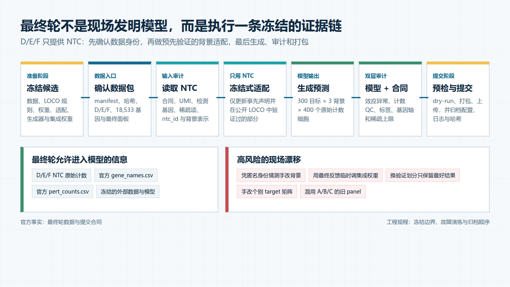

# L3-05｜消融、集成与最终轮

> 前置课程：[L3-04 State 微调实战与算力预算](L3-04-State微调实战与算力预算.md)  
> 课程索引与主题归属：[README.md](README.md)
>
> 本课目标：把“若干验证方案”收敛成一个可复现的最终系统，并在 D/E/F 只有 NTC、没有扰动真值的条件下完成适配、生成、审计和提交。
>
> 重要边界：本文中的数据规模、格式和提交规则来自官方资料；冻结策略、集成规则、运行顺序和故障演练是项目工程规程，不是 Arc 官方指定做法。

## 0. 学完本课应该能做什么

学完后，你应该能够：

1. 区分**消融实验（ablation study）**、模型选择、集成和最终轮适配各自回答的问题；
2. 解释为什么 A/B/C 排行榜不能代替跨背景离线验证；
3. 写出模型冻结清单，并区分可以使用 D/E/F NTC 的适配与会改变研究问题的重新训练；
4. 用多个留出背景而不是单次最好成绩选择候选；
5. 解释模型分歧为什么只能当作不确定性线索，不能自动当作真实误差概率；
6. 在最终数据到达前，用 A/B/C 完整演练下载、审计、生成 360,000 行、`vcc prep` 和归档；
7. 在 D/E/F 到达后按固定顺序执行，并定位背景标签错位、旧面板、基因轴、稠密矩阵和随机性等故障；
8. 留下足以复现最终提交的配置、日志、哈希和方法说明。

## 1. 最终轮更像一次受约束的生产发布

### 1.1 直觉解释

到最终轮时，主要问题不再是“还能想到什么新模型”，而是：

> 在看不到 D/E/F 扰动真值的情况下，怎样让已经验证过的方法对新 NTC 正确适配，并确保生成物确实来自预先选定的系统？

软件上可以把它类比为生产发布：训练代码像构建流程，模型权重像发布制品，D/E/F NTC 像上线时才出现的环境输入，`.vcc` 像最终发布包。这个类比的边界是，生产配置通常有确定答案，而新细胞背景的生物状态具有真实变异；即使程序完全正确，预测也可能在生物学上失败。

官方已明确：[S1][S2]

- 最终排名只看最终测试集；
- 验证轮和最终轮使用不同细胞系、不同扰动面板和各自的参考缩放，分数不能按绝对数值直接比较；
- 最终只能选择一份作品参与奖项评选。

最终轮中仍可以修复程序错误，但若此时才决定验证划分、模型结构或集成权重，就会在没有真值的 D/E/F 上做无法检查的选择。



*图 1｜最终轮证据链。D/E/F 只进入预先声明的 NTC 条件化、生成和合同审计；模型家族、LOCO 选择规则和集成权重应在最终数据进入模型前冻结。下方红色区域列出高风险做法，不表示官方额外禁止条款。图由 HTML/CSS 按数据合同确定性绘制。*


*图 2｜最终轮控制室的工程直觉。雪花、检查面板和封装盒分别象征冻结候选、质量审计和归档提交，不是官方界面、评分实现或生物机制；左侧三种抽象细胞也不代表 D/E/F 的真实身份或形态。本图使用 GPT Image 参考项目科学信息图风格生成，并按单一问题定向修订后人工核对。*

### 1.2 哪些东西必须在最终数据进入模型前冻结

“冻结”不是把整个仓库设成只读，而是把会影响科学结论的选择写清楚。至少应冻结：

| 对象 | 冻结内容 | 为什么 |
|---|---|---|
| 数据 | 采用的数据集、版本、许可、过滤规则、基因映射 | 防止看到新背景后临时选择更像 D/E/F 的训练来源 |
| 验证 | LOCO 划分、目标留出、六指标聚合、失败判据 | 防止换一套更偏爱当前模型的考试题 |
| 模型 | 结构、损失、权重检查点、随机种子集合 | 确认最终生成物对应已经验证的候选 |
| 表示 | context encoder、target encoder、缺失映射处理 | 防止靠猜测匿名身份手工替换表示 |
| 适配 | 哪些参数可由 NTC 更新、步数、学习率、停止规则 | D/E/F 没有扰动真值，不能现场凭成绩调参 |
| 生成 | 400 细胞的生成器、库大小抽样、稀疏阈值 | 计数层变化也会改变评分，不只是文件后处理 |
| 集成 | 成员、权重、在哪一层合并 | 避免根据最终提交反馈追逐偶然波动 |

代码修复仍然允许，但必须记录修复前后差异，并证明它只纠正实现合同或已定义算法，而不是引入一个没有离线证据的新方法。

## 2. 消融不是“把组件轮流关掉”这么简单

### 2.1 消融要回答因果上更窄的问题

**消融实验（ablation study）**是在其他条件尽量不变时，移除或替换一个组件，检查这个组件是否带来稳定增益。

例如，比较：

```text
相似背景加权 delta
        |
        + target 基础表达
        |
        + target 蛋白嵌入
        |
        + NTC set encoder
        |
        + 单细胞生成器
```

每一步只增加一个主要信息来源。若同时替换数据、模型、损失和计数生成器，即使分数提高，也无法知道哪一部分有效。

### 2.2 一张总分表不够

每个候选至少按以下切面报告：

| 切面 | 要回答的问题 |
|---|---|
| 留出背景 | 增益是否只出现在某一条细胞系？ |
| 留出目标 | 模型是记住目标 ID，还是能外推新目标？ |
| 六项指标 | 改善来自表达校准、方向、显著集合还是扰动区分？ |
| 目标效应强度 | 弱扰动是否被全部预测成零？强扰动是否幅度爆炸？ |
| 计数 QC | 总 UMI、检测基因、方差、零比例是否被破坏？ |
| 资源 | 增益是否值得训练时间、推理时间和内存成本？ |

论文可能报告某个组件在其数据上有效。例如 X-Cell 报告了架构和损失消融，也描述了只使用 NTC 的测试时适配；这些是作者在其数据与实现上的论文结论，不能直接证明同一设置会提高本项目的 VC2026 分数。[P1]

### 2.3 用稳定性而不是单次最高分选模型

一个实用的候选选择规则可以是：

1. 在所有预先定义的留出背景上运行相同协议；
2. 每个背景分别保存六项指标和 QC，而不是先求平均；
3. 剔除合同失败、数值不稳定或某一背景灾难性退化的候选；
4. 比较中位表现、最差背景和背景间波动；
5. 只在差异稳定时使用平均分决定排序。

这里的“最差背景”不是要机械优化一个最小值，而是防止平均数掩盖零样本泛化崩溃。若模型在五个背景略升、一个背景大幅为负，最终遇到类似第六个背景时风险很高。

## 3. 集成到底合并什么

**集成（ensemble）**是把多个模型的预测按预先定义的规则组合。它可能减少单模型方差，但不会自动修复共同偏差。

### 3.1 三个可选合并层

| 合并层 | 操作 | 优点 | 主要风险 |
|---|---|---|---|
| 扰动 delta | 先对模型预测的伪批量 delta 加权，再生成细胞 | 容易控制幅度和非负修正；所有成员共用计数生成器 | 会抹平成员预测的不同状态组成 |
| 生成参数 | 合并均值、离散度、状态权重等参数，再采样 | 能让成员共同决定分布 | 不同模型参数语义可能并不兼容 |
| 预测细胞 | 从不同成员各取一部分细胞，拼成 400 个 | 简单，并保留成员内部异质性 | 可能制造不真实的混合群体；成员库大小和稀疏度不一致 |

不建议把整数 count 矩阵逐元素平均后再四舍五入作为默认方案。这样会改变零比例、方差和基因协同，而且“四舍五入后合法”不等于生成机制合理。

### 3.2 权重必须从公开真值中得到

设三个成员的 delta 为 $\Delta_1,\Delta_2,\Delta_3$，一个简单凸组合为：

$$
\Delta_{ens}=w_1\Delta_1+w_2\Delta_2+w_3\Delta_3,
\qquad w_m\ge 0,\quad \sum_m w_m=1.
$$

权重应在冻结的 LOCO 验证中选择，并检查不同留出背景是否给出相近结论。若某组权重只在一个背景最好，不应把它解释为普遍规律。

### 3.3 多模型一致不等于正确

如果多个成员使用相同训练数据、相同 target embedding 和相似损失，它们可能共同遗漏同一条生物通路。集成能降低独立噪声，却不能消除共同偏差。

## 4. 不确定性：模型不知道什么

**预测不确定性（predictive uncertainty）**描述模型对结果缺乏把握的程度。最终轮没有扰动真值，因此只能用代理信号识别高风险区域。

可以记录：

- 成员间 delta 方向和幅度的分歧；
- 某个 D/E/F context embedding 到训练背景的最近距离；
- target 是否在训练扰动中出现，蛋白或网络特征是否缺失；
- 不同 NTC 子样本产生的 context 表示波动；
- 计数生成重复之间的伪批量波动。

这些信号回答的是“模型之间或输入子样本之间是否稳定”，不是“出错概率是多少”。若没有校准实验，不能把成员标准差 0.2 写成 20% 错误概率。

不确定性在比赛中的主要用途是诊断：发现某个目标的幅度异常、某个背景远离训练分布、或某个生成器对随机种子过于敏感。它不应成为手工修改个别最终目标的借口。

## 5. 最终轮前做一次完整彩排

### 5.1 彩排输入

流程彩排把 A/B/C 暂时当作一套“新到数据”。不要用已缓存的中间结果直接开始，而应从官方 ZIP 或解包目录重新走完整流程：

```text
controls 数据包
  -> manifest / CSV / H5AD 合同检查
  -> NTC QC 与 context 表示
  -> 预先声明的 NTC-only 适配
  -> 300 target × 3 context × 400 cells
  -> H5AD 审计
  -> vcc prep --dry-run
  -> .vcc 打包
  -> 哈希、日志、配置归档
```

彩排不是为了重新提高 A/B/C 排行榜，而是测量整条流水线的运行时间、峰值内存、临时磁盘、最终文件大小和人工操作点。

### 5.2 故障注入

主动制造以下错误，确认检查器会在上传前阻止它们：

1. 交换 B/C 标签；
2. 使用旧轮的 `pert_counts.csv`；
3. 把 `gene_names.csv` 排序后写出；
4. 多放一行 NTC；
5. 把 `log1p` 浮点数当作原始计数；
6. 用 dense 数组或留下大量显式零；
7. 每个目标只生成 399 个细胞；
8. 在失败重跑时改变随机种子，却仍沿用旧文件名。

官方 `vcc prep` 会检查多项合同，但背景标签互换尤其危险：文件仍可能合法，官方 FAQ 明确提醒它会让所有指标接近随机，却看起来像普通模型性能差。[S2] 因此项目检查器还必须把每个输出 context 与其来源 NTC 文件和 manifest 绑定。

## 6. 最终数据到达后的固定执行顺序

### 6.1 第一步：只确认数据身份

输入：最终轮下载文件。

操作：记录下载时间、文件大小和校验和；读取 `manifest.json`；列出 context、基因数、目标数和每背景控制细胞数；确认它是 final/test 数据包，而不是 validation 缓存。

输出：机器可读的合同审计报告。

原因：后续所有结果都依赖这一个数据身份。若源头混用，模型日志再完整也无法补救。

### 6.2 第二步：审计 D/E/F NTC

输入：三个控制 H5AD。

操作：复用 A/B/C 已验证的读取和 QC 代码，计算总 UMI、检测基因、稀疏项、`ntc_id` 组成、伪批量位置和 context encoder 输出。

输出：D/E/F 控制审计与相对训练背景的距离诊断。

原因：NTC 是最终背景的唯一观测信息。这里可以识别格式和分布漂移，但不能反推出匿名细胞系的官方身份。

### 6.3 第三步：执行预先声明的 NTC-only 适配

输入：冻结模型和 D/E/F NTC。

操作：只更新冻结清单允许的统计量或参数，例如 context 表示、归一化统计，或事先验证过的 NTC 重建适配。

输出：带数据和配置指纹的适配工件。

原因：测试时适配可以帮助模型读取新背景，但它没有扰动真值监督。重建 NTC 更好不保证扰动转移更好，因此适配规则必须在公开 LOCO 实验中先验证。

### 6.4 第四步：生成候选并做双层审计

第一层是模型审计：逐 `target × context` 检查预测 delta 范数、目标自身表达、极端基因、成员分歧和种子稳定性。

第二层是合同审计：检查 360,000 行、18,533 列、每组恰好 400 行、无 NTC、原始非负整数、每细胞总计数上限、CSR 稀疏项和官方基因顺序。[S1][S2]

输出必须来自自动流水线。人工可以审阅异常报告，但不能在表格里手改某个 target 的矩阵而不留下可复现规则。

### 6.5 第五步：预检、打包与归档

先运行：

```bash
vcc prep prediction.h5ad \
  -g gene_names.csv \
  --perts pert_counts.csv \
  -o prediction.vcc \
  --dry-run
```

通过后再生成 `.vcc`。归档至少包括：

- Git commit 与 dirty-worktree 说明；
- 数据 manifest 和输入文件哈希；
- 模型检查点哈希；
- 完整配置和随机种子；
- 运行命令、开始结束时间、硬件和峰值资源；
- H5AD 与 `.vcc` 哈希；
- QC 摘要和 `vcc prep` 结果；
- 最终选中作品的选择理由。

这也为官方可能要求的获奖方法说明保留可复核材料。官方 FAQ 说明，入围决赛者必须提交并公开如何创建获奖作品的说明。[S2]

## 7. 何时应该退回简单模型

出现下面任一情况时，应优先退回最近一个通过证据门的候选：

- 复杂模型在不同留出背景的收益方向不一致；
- context 适配降低 NTC 重建损失，却恶化公开扰动预测；
- 单细胞生成器改善方差，却显著破坏六项群体指标；
- 集成只在一个背景超过最佳单模型；
- 完整生成无法在资源预算内稳定复现；
- 无法从最终 H5AD 追溯到唯一配置和检查点。

简单、可复现且经过跨背景验证的模型，比一个只能解释训练损失、无法稳定生成完整提交的大模型更适合最终轮。这是工程风险判断，不表示简单模型在生物预测上天然更强。

## 8. 最终轮检查表

### 8.1 冻结前

- [ ] 所有候选使用相同的公开数据版本和 LOCO 划分；
- [ ] 六项指标、每背景结果、QC 和资源成本齐全；
- [ ] 模型、表示、生成器和集成分别有消融；
- [ ] 最终候选与回退候选各自可从零复现；
- [ ] NTC-only 适配规则已在公开留出背景验证；
- [ ] 完整 360,000 行彩排通过；
- [ ] 标签交换、旧面板和显式零等故障能被检查器发现。

### 8.2 D/E/F 到达后

- [ ] final manifest、context 和 panel 已确认；
- [ ] D/E/F NTC 合同与 QC 已完成；
- [ ] 没有猜测或硬编码匿名细胞系身份；
- [ ] 只执行冻结的 NTC-only 适配；
- [ ] 每个 `target × context` 恰好 400 个细胞；
- [ ] 基因轴、原始计数、稀疏项和总 UMI 合法；
- [ ] 模型异常与合同异常分别审计；
- [ ] `vcc prep --dry-run` 通过；
- [ ] H5AD、VCC、配置、日志和哈希一起归档；
- [ ] 上传后记录平台返回结果与最终参赛作品选择。

## 9. 诊断题

假设模型 M 在六个公开 LOCO 背景中的平均分高于模型 S，但 M 在其中一个背景上大幅为负；S 的平均分略低，却在所有背景都稳定为正。D/E/F 到达后，M 的 context embedding 看起来离训练背景更近。你是否应该因此直接选择 M，并用 D/E/F NTC 继续调 M 的集成权重？

先停下来回答，再看下面的解释。

---

不应该仅凭这些信息直接选择 M，也不应在没有扰动真值的 D/E/F 上重新调集成权重。

M 的平均分说明它在部分已知背景可能更强，但单背景灾难性失败暴露了零样本尾部风险；embedding 距离只是表示空间中的相似度，不是扰动响应正确性的证明。应按冻结前声明的选择规则综合平均、最差背景、指标结构和资源稳定性决定 M 或 S。若预先规则选择 M，也只能执行已经在公开 LOCO 中验证的 NTC-only 适配和固定集成；若风险规则选择 S，就不应因为 D/E/F “看起来更像”而临时翻转。模型距离可进入不确定性报告，但不能代替真值。

## 10. 来源与陈述边界

### 官方与一手资料

- [S1] Arc Institute，仓库保存的 [About the Data](../Official-website/About-the-Data.md)：D/E/F 发布方式、每轮形状、H5AD 和原始计数合同；核验日期 2026-08-30。
- [S2] Arc Institute，仓库保存的 [FAQs](../Official-website/FAQs.md)：提交规则、验证与最终分数不可直接比较、背景标签错位风险、稀疏项限制和方法说明要求；核验日期 2026-08-30。

### 论文材料

- [P1] X-Cell: Scaling Causal Perturbation Prediction across Diverse Cellular Contexts，[本地阅读材料](../references/X-Cell：通过扩散语言模型扩展跨多样细胞情境的因果扰动预测.md)；用于理解作者报告的消融、留出验证和 NTC 测试时适配。具体收益是论文结论，不是本项目复现结果；规范出处状态见 [论文索引](../references/INDEX.md)。

### 边界

本文的冻结表、候选选择、集成层、不确定性诊断、故障注入和归档清单属于项目工程规程。它们旨在让最终提交可复现、可审计，不能保证获得特定排行榜分数。D/E/F 的真实扰动结果仍由主办方保留；任何基于 NTC 的背景距离、身份猜测或模型一致性都不能替代真实扰动验证。
