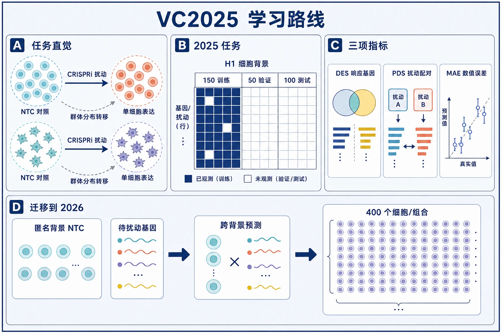
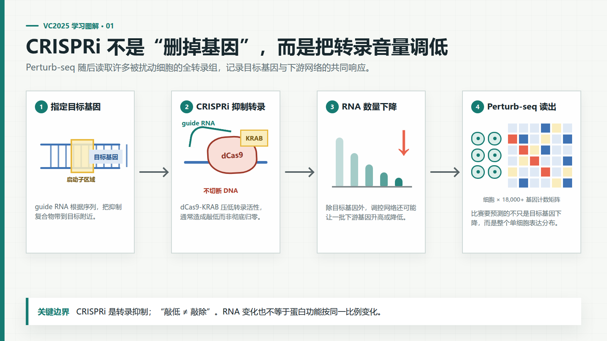
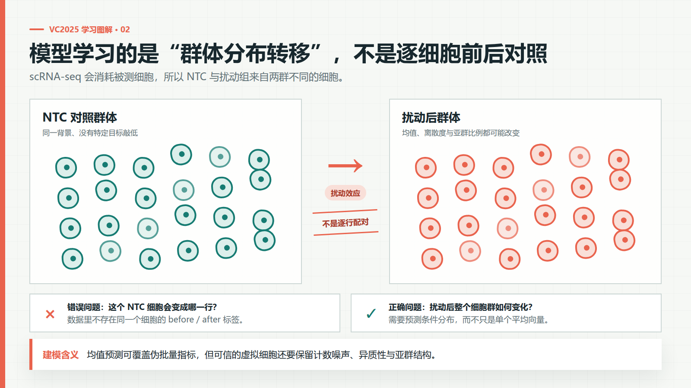
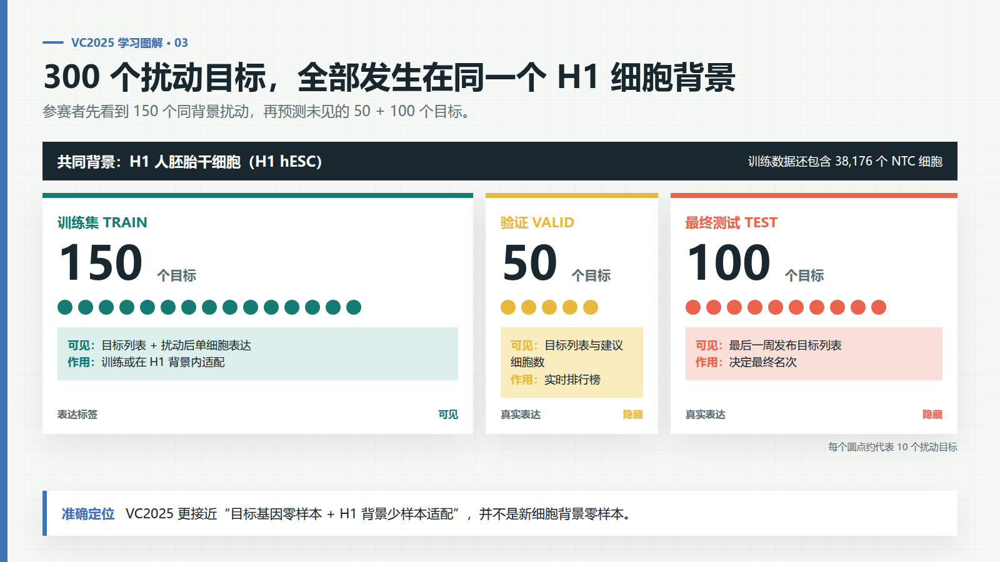
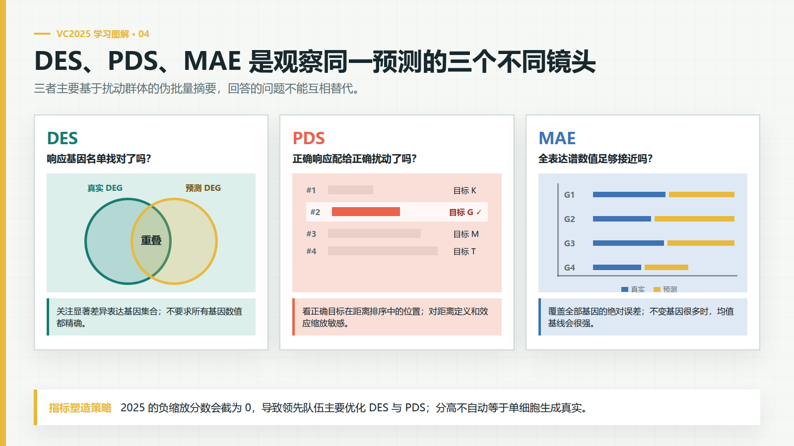
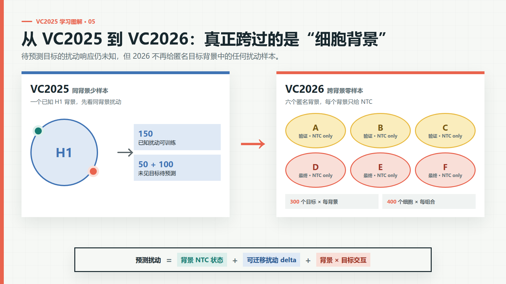

# VC2025 学习指南：先弄明白上一届，再准备 VC2026

> 调研日期：2026-08-21
>
> 目的：用 2025 年首届 Arc Virtual Cell Challenge（VC2025）建立任务、数据、指标和建模直觉，并明确哪些经验能迁移到 VC2026。
>
> 一句话结论：**VC2025 是“已知 H1 细胞背景内，给少量同背景扰动样本后预测未见扰动”的少样本任务；VC2026 则是“只给匿名新背景的对照细胞，预测所有扰动”的跨背景零样本任务。后者难度明显更高，不能把上一届冠军方案原样照搬。**



*学习路线总览｜从群体分布转移出发，依次理解 VC2025 的监督结构和三项指标，再过渡到 VC2026 的跨背景零样本任务。本图使用生成式图片工具参考公开科学信息图的版式语言制作，并经人工核对；它是解释性插画，不是实验数据或机制证据。*

## 0. 怎样读这份笔记

本文严格区分四类陈述：

- **已验证事实**：来自 Arc 官方页面、官方 GitHub/数据桶、比赛期网页存档或仓库内保存的 2026 官方页面。
- **论文结论**：作者在论文或预印本中的结论，尚不等于本项目已经复现。
- **工程解释**：根据规则和公开材料给出的建模含义，不是比赛官方承诺。
- **待验证猜想**：目前证据不足，必须通过代码、数据或实验继续核验。

这届比赛不是 Kaggle 赛。**已验证事实**：VC2025 使用 `virtualcellchallenge.org` 的自有平台和 `.vcc` 提交文件；本次没有找到 Arc 官方 Kaggle 竞赛页。[S1][S2][S3]

## 1. 先建立生物学直觉

### 1.1 基因表达、RNA 和单细胞 RNA 测序

**基因表达（gene expression）**可以先理解为“某个基因当前被细胞读取了多少”。DNA 像长期保存的源代码，RNA 更像运行时产生的消息；但这只是软件类比，真实机制还包括转录调控、RNA 降解等过程，不能把 RNA 数量直接等同于最终蛋白功能。

- **直觉解释**：每个细胞可以表示成一个很长的数值向量，每一列是一个基因，每个数表示检测到多少 RNA。
- **生物机制**：基因先被转录成 RNA；单细胞 RNA 测序（single-cell RNA sequencing, scRNA-seq）把不同细胞分开测量 RNA。
- **与比赛的关系**：模型输入和输出都是细胞 × 基因的表达矩阵。
- **对模型的影响**：矩阵高维、稀疏、计数噪声大；不能把零简单解释成“这个基因绝对没有表达”。

### 1.2 UMI 与原始计数

**UMI（Unique Molecular Identifier，唯一分子标识符）**是在测序前给 RNA 分子加的短标签，用于减少 PCR 重复扩增造成的重复计数。

- **直觉解释**：同一张工单被复印十次，UMI 帮助我们尽量只把原工单算一次。
- **生物机制**：带相同 UMI 的测序读段可被归并，最终得到近似的 RNA 分子计数。
- **与比赛的关系**：VC2025 数据每个细胞中位数超过 50,000 UMI，VC2026 要求输出原始非负整数计数。[S6]
- **对模型的影响**：每个细胞总 UMI 不同，既包含生物差异，也包含测序深度差异。归一化便于训练和比较，但 VC2026 最终仍须生成合法的原始计数。

### 1.3 CRISPRi、敲低与 Perturb-seq

**CRISPR interference（CRISPRi，CRISPR 干扰）**使用失去切割能力的 dCas9 和转录抑制结构域（如 KRAB）阻止目标基因转录。它通常造成**敲低（knockdown）**，即表达量显著下降，而不保证变成绝对零，也不同于切断 DNA 的基因敲除（knockout）。

**Perturb-seq**把 CRISPR 扰动和 scRNA-seq 结合：每个细胞既记录“扰动了哪个基因”，又记录扰动后的全转录组。

- **直觉解释**：对许多相同细胞分别关闭一个模块，再记录整个系统的运行日志。
- **生物机制**：被压低的目标基因可能通过调控网络、蛋白复合体或细胞状态变化影响许多其他基因。
- **与比赛的关系**：给定待敲低的目标基因，预测扰动后每个细胞的 18,000 多维表达计数。
- **对模型的影响**：目标基因自身下降只是最直接信号；真正困难的是预测下游响应、响应方向、强度和细胞间异质性。



*图 1｜CRISPRi/Perturb-seq 的任务链路。CRISPRi 通常造成敲低而不是完全敲除；模型要预测的是目标基因和下游网络共同形成的全转录组响应。*

一个对建模非常关键的事实是：**scRNA-seq 测量会消耗并破坏被测细胞**。因此数据中没有“同一个细胞在扰动前和扰动后”的一一成对样本；NTC 与扰动细胞是从两个细胞群体中取得的不同细胞。**工程解释**：这不是有配对标签的逐行回归，而是学习“对照细胞群体分布 -> 扰动细胞群体分布”的转移。这也是比赛要求生成多个细胞，且许多方法使用集合、分布或生成式目标的原因。



*图 2｜scRNA-seq 数据中的“前后”是两个群体，而不是同一细胞的两个时间点。伪批量均值只描述了分布的一部分。*

VC2025 使用双向导 RNA（dual-guide）CRISPRi：同一载体携带两条指向同一目标的 guide，以增强敲低的一致性。Arc 报告 83% 的细胞达到超过 80% 的目标敲低，63% 的细胞检测到两条正确 guide。[S6]

### 1.4 对照、细胞背景与批次效应

**非靶向对照（non-targeting control, NTC）**携带不针对任何基因的 guide，用来估计“没有特定基因扰动时”的表达分布。

**细胞背景（cellular context）**指影响扰动响应的细胞身份与状态，例如细胞系、组织来源、遗传背景和培养状态。同一个基因在两种细胞中可能表达不同、参与不同调控网络，因此敲低后的反应也可能不同。

**批次效应（batch effect）**是由实验批次、试剂、仪器、处理时间等技术因素造成的系统差异，而不是想研究的生物差异。

- **直觉解释**：NTC 是同一运行环境下的健康基线；细胞背景像不同硬件和配置；批次效应像日志采集器版本变化。类比只能帮助理解，真实生物状态不是可枚举的软件配置。
- **与比赛的关系**：VC2025 的目标背景固定为 H1 人胚胎干细胞；VC2026 的六个背景匿名，模型只从各背景 NTC 表达谱推断身份和状态。
- **对模型的影响**：模型必须区分“扰动效应”“细胞背景差异”和“技术批次差异”。如果把三者混在一起，跨背景泛化会失败。

### 1.5 伪批量与差异表达

**伪批量（pseudobulk）**是把同一条件下许多单细胞的表达取和或平均，得到一个群体级表达谱。它能降低单细胞噪声，但会丢掉细胞间分布和亚群信息。

**差异表达（differential expression, DE）**比较扰动细胞与对照细胞，寻找统计上显著升高或降低的基因；这些基因称为差异表达基因（DE genes, DEGs）。

- **直觉解释**：单细胞像逐条请求日志，伪批量像按服务聚合后的指标；DEG 是相对基线发生可信变化的字段。
- **生物机制**：扰动影响转录调控或细胞状态，使一组基因的 RNA 分布改变。
- **与比赛的关系**：VC2025 的 DES、PDS 和 MAE 都大量依赖伪批量或扰动相对 NTC 的差异。
- **对模型的影响**：只预测均值可能得到不错的群体级分数，却不代表生成了真实的单细胞异质性。这个边界对理解 2025 方案尤其重要。

## 2. VC2025 到底让参赛者做什么

### 2.1 任务定义

**已验证事实**：Arc 在一个 H1 human embryonic stem cell（H1 hESC，人胚胎干细胞系）背景中，用 CRISPRi 沉默 300 个目标基因，并以 10x Genomics GEM-X Flex 和 Illumina 测得单细胞转录组。[S2][S5][S6]

```text
H1 非靶向对照细胞 + 150 个已知 H1 扰动
                    |
                    v
             训练/适配一个模型
                    |
        +-----------+-----------+
        |                       |
        v                       v
预测 50 个验证扰动       预测 100 个最终测试扰动
                                |
                                v
                    最终排名只看这 100 个目标
```



*图 3｜VC2025 的监督结构。三个划分共享 H1 背景，区别在于扰动目标及其真实表达是否可见。*

300 个目标的比赛期划分是：

| 划分 | 目标数 | 参赛者能看到什么 | 用途 |
|---|---:|---|---|
| 训练 | 150 | H1 扰动后的单细胞表达和 NTC | 训练或微调 |
| 验证 | 50 | 目标基因列表与建议生成细胞数，不给真实表达 | 实时排行榜 |
| 最终测试 | 100 | 最后一周发布目标列表，不给真实表达 | 最终排名，且只按该集合排名 |

这不是严格的“新细胞背景零样本”。**工程解释**：模型已经看到同一个 H1 背景下 150 个扰动，因此核心问题更接近：

> 从同一背景的已知扰动中，学习可迁移到未见目标基因的扰动效应。

Arc 的 Cell commentary 把它称为面向上下文泛化的挑战；结合实际数据划分，更准确的工程表述是“目标基因零样本 + 目标背景少样本适配”，而不是“目标背景零样本”。[S2][S9]

### 2.2 数据规模与一个容易误读的数字

比赛期数据页给出的训练文件为：

- `adata_Training.h5ad`，约 15 GB；
- 221,273 个细胞 × 18,080 个基因；
- 其中 38,176 个细胞的 `target_gene` 是 `non-targeting`。[S2]

当前官方公开桶中的三个 `pert_counts` 文件记录：

| 划分 | 目标数 | 扰动细胞 `n_cells` 合计 |
|---|---:|---:|
| train | 150 | 183,097 |
| validation | 50 | 60,751 |
| test | 100 | 132,670 |
| 合计 | 300 | 376,518 |

这里有两点需要拆开：

1. **已验证事实**：`183,097 + 38,176 = 221,273`，因此当前训练 `pert_counts` 与比赛期训练 H5AD 的细胞数能精确对上；前者只统计扰动细胞，后者还包含 NTC。
2. **未解决问题**：三个公开划分的扰动细胞合计 376,518，若再加训练 NTC 则更多，而 Arc 页面又用“约 300,000 个细胞”概述全数据。[S2][S5][S6] 目前没有官方说明这个差异来自后赛季重发布、过滤口径、近似取整还是其他原因。使用数据时应以实际文件和 manifest 为准，不能拿宣传页近似数做数组尺寸假设。

### 2.3 实验质量为什么重要

Arc 报告该数据约有每个扰动 1,000 个细胞、每个细胞超过 50,000 UMI，并根据敲低强度和数据质量对训练/验证/测试进行分层，以尽量平衡三个划分。[S6]

**工程解释**：这是一个相对高深度、高覆盖的基准。模型在这里学到的噪声分布，不一定等同于其他公开 Perturb-seq 数据集；跨数据集训练时仍要处理测序化学、基因面板、细胞系和预处理差异。

## 3. VC2025 怎样提交

**已验证事实**：提交文件为 `.vcc`，其内部包装一个 AnnData H5AD。比赛期要求包括：[S2][S3]

- `.obs["target_gene"]` 标明扰动目标；
- `.var` 恰好包含官方顺序的 18,080 个基因；
- 必须含 `target_gene == "non-targeting"` 的对照细胞；
- 包括对照在内最多 100,000 个细胞；
- `.X` 使用 `float32`；
- 数值可以是整数计数或 `log1p` 归一化值，其他归一化不合法；
- `pert_counts_Validation.csv`/`Test.csv` 的 `n_cells` 是建议数量而非硬性数量，但少生成细胞可能降低分数。

**工程解释**：VC2025 的格式允许模型把重点放在伪批量效应上。冠军总结甚至提到把伪批量预测重复为多个细胞来满足 DES 计算所需样本数。[S7] 这说明“文件看起来像单细胞”不等于模型真的学到了单细胞分布。

## 4. 三个主指标究竟测什么

### 4.1 DES：有没有找对响应基因

**已验证事实**：Differential Expression Score（DES，差异表达分数）对每个扰动分别比较扰动细胞和 NTC：

1. 使用带并列值修正的 Wilcoxon 秩和检验；
2. 用 Benjamini-Hochberg 方法控制 FDR，阈值为 0.05；
3. 比较预测与真实的显著 DEG 集合；
4. 当预测 DEG 太多时，按绝对 log fold-change（logFC）保留与真实 DEG 数相同的前若干个，再计算与真实集合的重叠；
5. 对所有扰动取平均。[S3][S6]

**直觉**：DES 问的是“受影响的基因名单有没有找对”。它重视生物学解释常用的 DEG，但不充分约束所有基因的精确数值，也不保证每个扰动彼此可区分。

### 4.2 PDS：有没有把正确响应配给正确扰动

Perturbation Discrimination Score（PDS，扰动区分分数）把每个预测与全部真实扰动比较，检查正确目标在距离排序中排第几。排名第 1 最好；随机猜测的平均值约为 0.5。[S3][S6]

这里必须保留一个**官方文档版本差异**：

| 来源 | PDS 比较对象 | 其他细节 |
|---|---|---|
| 2025-09-06 比赛期评估页存档 | 扰动细胞的 log1p 伪批量表达谱 | 用 L1/Manhattan 距离；距离计算排除被扰动目标基因 [S3] |
| Arc 数据文章（注明 2025-10-01 更新以匹配 STATE） | 扰动相对 NTC 的伪批量 delta | 用 L1 距离；文章公式基于 `delta = perturbation - control` [S6] |

**已验证事实**：这两份官方材料不是同一个数学定义。
**待验证项**：若要精确复现历史最终排行榜，应找到比赛最终运行的 `cell-eval` 版本、配置和提交时对应的代码标签；不能把两版文字悄悄合并。概念学习时，较晚的 NTC-delta 版本更能表达“是否把扰动效应配对正确”，但这不构成对历史运行代码的证明。[S8]

### 4.3 MAE：整个表达谱数值准不准

Mean Absolute Error（MAE，平均绝对误差）计算预测与真实伪批量表达在所有基因上的平均绝对差；越低越好。[S3][S6]

**直觉**：DES 只看显著变化名单，PDS 看扰动身份是否可区分，MAE 则看全转录组数值校准。它覆盖广，但大量不变基因、技术噪声和细胞异质性会让“预测平均细胞”成为很强的朴素基线。



*图 4｜三个指标是互补镜头。它们主要观察群体级摘要，单项高分不能单独证明生成的单细胞分布真实。*

### 4.4 排行榜总分和它暴露的问题

比赛把三项指标相对训练数据的 cell-mean baseline（细胞均值基线）缩放：[S3]

```text
DES_scaled = (DES_prediction - DES_baseline) / (1 - DES_baseline)
PDS_scaled = (PDS_prediction - PDS_baseline) / (1 - PDS_baseline)
MAE_scaled = (MAE_baseline - MAE_prediction) / MAE_baseline

overall = mean(DES_scaled, PDS_scaled, MAE_scaled) * 100
```

任何负的缩放分数都会被截为 0。**已验证事实**：Arc 赛后总结称几乎所有模型的 MAE 都差于基线；由于负改进被截断，MAE 实际上不再拉低排行榜分数，领先队伍便主要优化 PDS 和 DES。[S7]

**工程解释**：

- 指标不是旁观者，它会改变参赛者最优策略；
- “单项差于基线不受额外惩罚”使模型可以放弃该项；
- 高维 L1-PDS 对预测效应的缩放敏感。Outlier 团队的论文分析表明，放大预测幅度可能系统性改变 PDS，而不代表表达量更校准。[P3]

Arc 因此增设 Generalist Prize（综合能力奖），以七项指标的平均名次评估：原三项 DES/PDS/MAE，加上 Pearson delta correlation、Spearman logFC correlation、AUPRC 和 Spearman effect-size correlation。[S7]

## 5. 获奖方案做了什么

以下均是 **Arc 官方赛后方法摘要**，不是本项目独立复现的结果。[S7]

| 名次/奖项 | 团队与模型 | 官方摘要中的核心做法 | 最值得学的点 |
|---|---|---|---|
| 第 1 名 | BM_xTVC / BioMap，`xTrimoSCPerturb` | 改进 scFoundation 编码器；融合蛋白质嵌入和筛选后的公开扰动数据；使用解耦交叉注意力解码器；把训练集 DEG 频率和均值表达作为显式特征；以伪批量训练，融合 PDS + DES + 小权重 MAE 损失 | 深度表征与经典统计特征结合；训练目标直接对应评分指标 |
| 第 2 名 | XLearning Lab，`X` | 全连接网络；聚合对照、ESM-2 目标蛋白嵌入和 UMI 指示特征；预测相对对照的残差扰动 delta；使用公开 Perturb-seq，包括小规模 H1 PerturbAtlas 数据 | 简单架构配合正确条件和残差目标也能很强；同背景外部数据很有价值 |
| 第 3 名 | Outlier，`TransPert` | 只用伪批量和 Wilcoxon 摘要；从多个细胞系按相似性聚合扰动效应，再修正可能显著的基因；用交叉验证选择全局缩放以优化 PDS | 统计基线、跨背景相似性和指标分析可以胜过复杂生成模型 |
| Generalist Prize | Altos Labs，`go-with-the-flow` | 直接在表达空间做 flow matching，使用定制 U-Net；约 700 万个公开、比赛及内部非 H1 扰动细胞预训练，再用较小的 H1 特定数据微调 | 真正生成单细胞异质性的路线在更广指标下有价值；大规模预训练仍需目标背景适配 |

### 5.1 不能从冠军榜过度推出什么

- **不能推出**“scFoundation、ESM-2 或 flow matching 必然适合 VC2026”；2025 有 H1 扰动可微调，2026 没有目标背景扰动标签。
- **不能推出**“重复一个伪批量向量就是好的虚拟细胞”；它可能适配部分 2025 指标，却没有生成可信的单细胞分布。
- **不能推出**“把 PDS 缩放做大就能赢”；PDS 只是总评的一部分，DES 仍要求真实生物信号，2026 又换成六项参考缩放指标。
- **不能推出**复杂神经网络天然优于统计模型。Arc 的总结恰恰认为，2025 领先方案普遍包含统计特征、基线或显式指标优化。[S7]

## 6. VC2025 与 VC2026 的关键差异



*图 5｜2026 的核心难点是上下文外推：模型只能从匿名背景的 NTC 推断细胞状态，再迁移目标扰动效应。图中的加法分解是工程假设，不是已验证的生物学公式。*

| 维度 | VC2025 | VC2026 | 对工程方案的含义 |
|---|---|---|---|
| 目标背景 | 一个已知 H1 hESC | 六个匿名背景；验证 A/B/C，最终 D/E/F | 2026 必须从 NTC 推断背景，不能硬编码细胞系名称 |
| 背景内扰动监督 | 有 150 个 H1 训练扰动 | 没有挑战赛训练集；每个新背景只给 NTC | 从少样本适配变成真正的跨背景零样本 |
| 每轮目标 | 150 train / 50 validation / 100 final test | 每轮同一组 300 个目标作用于三个背景 | 2026 需要同时建模 target × context 交互 |
| 预测细胞数 | 按 `n_cells` 建议，提交总数最多 100,000 | 每目标 × 每背景恰好 400；一轮共 360,000 | 输出形状更严格，生成成本显著增加 |
| 基因数 | 18,080 | 18,533 | 权重、词表和矩阵必须显式对齐，不能沿用旧列索引 |
| 输出值 | 整数或 log1p 均可 | 仅原始、有限、非负整数计数 | 需要从模型表示可靠地生成 count space 数据 |
| 对照行 | 提交必须包含 NTC | NTC 只作输入，提交 NTC 会被拒绝 | 数据装配逻辑相反，最容易产生格式错误 |
| 主评分 | DES、PDS、MAE，相对单一基线缩放，负值截 0 | `cell-eval2` 六项指标；每背景以 context mean=0、重复实验=1 做参考缩放 | 2025 的单指标捷径更难奏效，应优化多维生物保真度 |
| 最终排名 | 仅 100 个最终目标 | 仅 D/E/F 最终轮；三背景平均 | 验证分数不可直接外推最终匿名背景 |

VC2026 数字和格式均来自仓库保存的官方页面：[About-the-Data](Official-website/About-the-Data.md) 与 [FAQs](Official-website/FAQs.md)。

## 7. 从 VC2025 真正应该学到什么

### 7.1 已验证的比赛经验

1. **强基线是第一等公民。** 平均细胞、平均扰动效应和伪批量统计不是“临时凑数”，而是必须击败的基准。
2. **目标函数必须与评估对齐。** 2025 冠军显式融合 PDS、DES、MAE，第三名甚至针对 PDS 的几何性质做全局缩放。[S7]
3. **同一扰动在不同背景的可迁移信息确实重要。** 前三名均不同程度使用公开 Perturb-seq 或跨细胞系摘要，但具体增益尚未由本项目复现。
4. **统计摘要仍然非常有竞争力。** 基因均值、DEG 频率、Wilcoxon 结果和细胞系相似度能够与深度模型互补。
5. **均值预测和单细胞生成是两个层次。** 2025 主指标偏重伪批量；Generalist Prize 才更全面考查不同性质。[S7]

### 7.2 面向 VC2026 的工程判断

以下是**工程解释**，需要实验验证：

- 把问题写成 `predicted perturbation = context NTC state + transferable perturbation delta + context-target interaction`，比直接生成绝对表达更容易拆分误差来源。
- 先在多个公开细胞系上做 leave-one-context-out（整细胞背景留出）验证，才能接近 2026 的匿名背景设置；随机留出细胞或只留出目标基因会高估泛化。
- 先做伪批量 delta 基线，确认指标和跨背景信号，再增加单细胞计数生成；否则很难判断失败来自生物效应预测还是计数噪声生成。
- 目标蛋白嵌入、基因网络和通路先验可能帮助未见目标泛化，但它们不能替代 NTC 对目标背景状态的条件化。
- 任何在 2025 H1 上调参的策略都要防止 H1 特化。H1 应作为训练背景之一或独立诊断集，而不是 VC2026 最终背景的代理。

### 7.3 建议的学习顺序

1. **读规则和数据结构**：先逐字段理解 2025 H5AD/`pert_counts`，再与 2026 的 `context`、`ntc_id`、18,533 基因和原始计数约束对照。
2. **复现朴素基线与指标**：复现 context mean、perturbation mean、DES/PDS/MAE；同时固定并记录 PDS 使用的代码版本。
3. **做数据审计**：查看每细胞 UMI、零比例、目标敲低、每扰动细胞数、批次与 NTC 分布，不要一开始就训练大模型。
4. **做跨背景验证协议**：选多个公开 CRISPRi Perturb-seq 细胞系，整背景留出，只向模型提供留出背景 NTC。
5. **建立统计 delta 基线**：按背景相似度、目标相似度或共享通路聚合其他背景的扰动 delta。
6. **再加表示学习和生成模型**：只有在基线和误差分解稳定后，才比较蛋白嵌入、set encoder、diffusion/flow 等路线。
7. **最后做格式与资源压力测试**：确保恰好生成 360,000 × 18,533 的稀疏原始整数计数，并用 `vcc prep --dry-run` 检查。

## 8. 当前尚未解决的问题

1. **公开细胞总数口径**：当前三个 split 的 `n_cells` 与官方“约 300,000”概述不一致，尚无官方解释。
2. **历史最终 PDS 实现**：比赛期评估页和 2025-10-01 更新后的 Arc 文章定义不同；需定位最终评分所用 `cell-eval` 精确版本、配置或代码标签。
3. **冠军方法可复现性**：Arc 赛后文章称部分完整论文仍将发布；本次只核验官方摘要，没有独立复现代码和结果。
4. **VC2025 数据版本**：使用当前公开桶前，应记录对象版本、校验和及 manifest，确认它是否与比赛时下载包完全相同。

## 9. 调研范围和来源

### 9.1 官方/一手来源

- [S1] [Virtual Cell Challenge 2025 archive](https://virtualcellchallenge.org/2025)
- [S2] [VC2025 Data 页面，2025 年网页存档](https://web.archive.org/web/20250906/https://virtualcellchallenge.org/datasets)
- [S3] [VC2025 Evaluation 页面，2025-09-06 网页存档](https://web.archive.org/web/20250906/https://virtualcellchallenge.org/evaluation)
- [S4] [VC2025 FAQ，2025 年网页存档](https://web.archive.org/web/20250906/https://virtualcellchallenge.org/faq)
- [S5] [Arc Virtual Cell Atlas：VC2025 README 与公开数据入口](https://github.com/ArcInstitute/arc-virtual-cell-atlas/tree/main/virtual-cell-challenge)
- [S6] [Behind the Data of the Virtual Cell Challenge](https://arcinstitute.org/news/behind-the-data-virtual-cell-challenge)
- [S7] [Virtual Cell Challenge 2025 Wrap-Up: Winners and Reflections](https://arcinstitute.org/news/virtual-cell-challenge-2025-wrap-up)
- [S8] [ArcInstitute/cell-eval](https://github.com/ArcInstitute/cell-eval)
- [S9] [Virtual Cell Challenge: Toward a Turing test for the virtual cell](https://doi.org/10.1016/j.cell.2025.06.008)
- [2026 官方数据说明](Official-website/About-the-Data.md)
- [2026 官方 FAQ](Official-website/FAQs.md)

### 9.2 学术来源

- [P1] Roohani et al. *Virtual Cell Challenge: Toward a Turing test for the virtual cell*. Cell 188(13), 3370-3374 (2025). DOI: [10.1016/j.cell.2025.06.008](https://doi.org/10.1016/j.cell.2025.06.008)。用于核验挑战愿景和任务定位；本地未保存原文 PDF。
- [P2] Adduri et al. *Predicting Cellular Responses to Perturbation across Diverse Contexts with State*. bioRxiv (2025). DOI: [10.1101/2025.06.26.661135](https://doi.org/10.1101/2025.06.26.661135)。用于理解 CELL-EVAL 和跨背景任务；本次未成功取得本地原文，结论仍以预印本为准。
- [P3] Liu et al. *Effects of Distance Metrics and Scaling on the Perturbation Discrimination Score*. arXiv:2511.16954v1 (2025). [摘要与原文](https://arxiv.org/abs/2511.16954v1)；[本地 PDF](references/liu-et-al-2025-pds-scaling-v1.pdf)。用于理解 PDS 的距离与尺度敏感性；论文结论尚未由本项目复现。

### 9.3 检索说明

本次通过 Infra Scholar API 使用 **2 个唯一检索式**：

1. `Arc Institute Virtual Cell Challenge 2025 xTrimoSCPerturb TransPert perturbation prediction`
2. `"Effects of Distance Metrics and Scaling on the Perturbation Discrimination Score"`

首次查询的原始返回未保存，因此为补齐逐篇审计记录原样重放了一次：总计 3 次 API 请求，但仍只有上述 2 个唯一检索式。检索结果回到 Arc 官方页面、官方仓库、DOI/Crossref、bioRxiv 或 arXiv 原文页面核验。检索中出现但不直接证明 VC2025 规则或获奖方案的通用 AIVC 展望、GEARS、TxPert 和 CRISPR 脱靶论文，均未作为本文事实证据；所有可追溯候选及采用、备选或排除理由见 `references/INDEX.md`。

[S1]: https://virtualcellchallenge.org/2025
[S2]: https://web.archive.org/web/20250906/https://virtualcellchallenge.org/datasets
[S3]: https://web.archive.org/web/20250906/https://virtualcellchallenge.org/evaluation
[S4]: https://web.archive.org/web/20250906/https://virtualcellchallenge.org/faq
[S5]: https://github.com/ArcInstitute/arc-virtual-cell-atlas/tree/main/virtual-cell-challenge
[S6]: https://arcinstitute.org/news/behind-the-data-virtual-cell-challenge
[S7]: https://arcinstitute.org/news/virtual-cell-challenge-2025-wrap-up
[S8]: https://github.com/ArcInstitute/cell-eval
[S9]: https://doi.org/10.1016/j.cell.2025.06.008
[P3]: https://arxiv.org/abs/2511.16954v1
