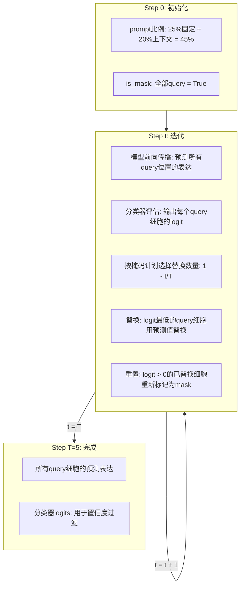

本文档基于 Stack 论文和源码 [https://github.com/ArcInstitute/stack](https://github.com/ArcInstitute/stack)，对模型架构进行逐层拆解。代码引用格式为 `文件名:行号`。

## 1. 总览
Stack 是一个基于 **Tabular Attention** 的单细胞基础模型。核心设计思想：**利用细胞集合中的上下文信息来增强单个细胞的表征**。

传统模型将每个细胞独立编码，Stack 则将同一实验样本的细胞组成一个 **细胞集(cell set)** 输入模型，通过交替的细胞内/细胞间注意力机制同时建模基因依赖性和细胞间关系。


**关键参数配置:**

| **参数** | **符号** | **Base** | **Large** | **说明** |
| --- | --- | --- | --- | --- |
| 层数 | N_L | 6 | 9 | Tabular Attention 堆叠层数 |
| token数 | n | 100 | 100 | 每个细胞的基因模块数 |
| token维度 | d | 8 | 16 | 每个 token 的特征维度 |
| 嵌入总维度 | n*d | 800 | 1600 | 每个细胞的嵌入维度 |
| 参数量 | - | 76.7M | 217M | 包含嵌入参数 |


---

## 2. Tokenization: 基因模块标记化
这是 Stack 的第一个关键创新，也是它与几乎所有现有单细胞基础模型的根本区别。

### 2.1 先看其他模型怎么做
几乎所有现有的单细胞基础模型都采用 **基因级(gene-level) tokenization**：

| **模型** | **Tokenization 方式** | **每个细胞 token 数** | **外部知识依赖** |
| --- | --- | --- | --- |
| scGPT | 每个基因 = 1 个 token，带预训练基因嵌入 | ~5000 (HVG) | 是，基因语义嵌入 |
| Geneformer | 每个基因 = 1 个 token，按表达量排序 | ~2000 (非零基因) | 否，但依赖基因排序 |
| UCE | 每个基因 = 1 个 token，基于 UniProt 嵌入 | ~5000 (HVG) | 是，蛋白质语义 |
| TranscriptFormer | 每个基因 = 1 个 token | ~4000 (HVG) | 是，基因词汇表 |
| State | 每个基因 = 1 个 token | ~2000 | 否 |


基因级 tokenization 的问题：

1. **计算代价高。** 每个细胞有数千个 token，自注意力复杂度为 O(seq_len^2)。5000 个 token 的注意力矩阵是 25M 个元素，而 Stack 的 100 个 token 只有 10K 个元素——差了 2500 倍。
2. **基因排序问题。** 基因没有天然的顺序。Geneformer 按表达量从高到低排序，scGPT 用随机排列，不同排序策略影响模型行为。
3. **信息瓶颈在注意力层。** 大量注意力预算花在冗余的基因级关系上，而不是更高层次的生物学模式。

### 2.2 Stack 的做法：基因模块 tokenization
Stack 不把每个基因当作一个 token，而是将整个基因表达向量通过一个 **可训练的单层感知机** 压缩成 n=100 个 token。每个 token 不是代表单个基因，而是代表一个 **基因模块(gene module)**——一组功能相关的基因。

**基本流程:** 每个细胞的基因表达向量 x ∈ R^G 通过单层 MLP 投影到潜在空间，再 reshape 为 n 个 token，每个 token 维度为 d。


**代码对应** (`models/core/base.py:45-51`):

```python
# 单层感知机: G -> n_hidden * token_dim
self.gene_reduction = nn.Sequential(
    nn.Linear(n_genes, n_hidden * token_dim),
    nn.GELU(),
    nn.Dropout(dropout),
)
# 可学习的基因位置嵌入
self.gene_pos_embedding = nn.Parameter(torch.randn(n_hidden, token_dim))
```

关键点：这个 tokenization 层与模型其余部分 **端到端训练**，不依赖任何外部基因语义信息（如 Gene Ontology、UniProt 嵌入等）。模型必须自己学会如何将 15000 个基因有意义地分配到 100 个模块中。

### 2.3 为什么这样做是合理的?
#### 生物学依据：基因以模块/通路为单位协同工作
分子生物学的一个基本事实是：**基因不是独立运作的**。它们以通路(pathway)、调控网络(regulatory network)和基因模块(gene module)的形式协同表达：

+ 干扰素刺激基因(ISG)——如 IFIT1、ISG15、MX1——在病毒感染时一起上调
+ 线粒体氧化磷酸化基因——如 NDUFA1、COX4I1、ATP5A1——在代谢活跃时共同表达
+ 细胞周期基因——如 MKI67、TOP2A、PCNA——在增殖细胞中同步激活

这些模块通常包含几十到几百个基因，但它们的 **整体激活模式** 才携带了细胞的生物学状态信息。单个基因的表达是嘈杂的——单细胞数据的技术噪声(dropout、PCR bias)使得单基因水平的信号很不稳定。但 **一个基因模块的聚合信号** 要稳健得多。

Stack 的 tokenization 正是利用了这个生物学先验：用 100 个 token 去捕捉 ~100 个基因模块的整体激活状态，而非逐个基因地追踪。

#### 信息论角度：信息压缩是合理的
基因表达数据中存在大量 **冗余信息**。共表达基因携带的信号高度相关——IFIT1 和 IFIT3 的表达模式几乎一样，因为它们受同一个转录因子(IRF)调控。从信息论角度，15000 维的基因表达向量中的"有效信息维度"远小于 15000。

PCA 和 HVG 选择等经典方法本质上也在做类似的事情——从高维基因空间中提取低维的有意义信号。Stack 的 tokenization 可以看作是一个 **可学习的、非线性的降维过程**。

#### 实验证据：模型自发学到了生物学上有意义的基因分组
论文提供的证据非常有力：

1. **GO 富集分析证实功能连贯性。** 论文对每个 token 中权重最大的前 10 个基因做了 Gene Ontology 生物过程富集分析（图 1E），发现每个 token 的 top 基因显著富集在特定的生物学通路上。例如：
    - 某些 token 富集了免疫/炎症相关通路
    - 某些 token 富集了代谢相关通路
    - 某些 token 富集了细胞外基质/黏附相关通路
2. **自发稀疏性。** 在 699 个被分析的"重要基因"中，75.3% 仅出现在一个 token 中。注意：Stack 并没有施加任何显式的稀疏性约束（如 L1 正则化或 group sparsity loss）。这种稀疏的基因-模块映射是模型在训练过程中自发涌现的。
3. **与扩展行为一致。** 论文图 S1 显示，增加 token 数量或 token 维度都能提升验证性能，说明 100 个 token 为模型提供了足够的信息容量。

### 2.4 与其他方案的对比


| **对比维度** | **基因级 tokenization** | **基因模块 tokenization (Stack)** |
| --- | --- | --- |
| **每细胞 token 数** | 2000~5000 | 100 |
| **注意力计算量** | O(G^2) ~ O(25M) | O(n^2) = O(10K)，降低 2500x |
| **基因排序依赖** | 是(排序影响结果) | 否(全基因向量投影) |
| **外部知识依赖** | 通常需要基因嵌入/词汇表 | 完全端到端学习 |
| **噪声鲁棒性** | 低(单基因噪声大) | 高(模块级聚合去噪) |
| **可解释性** | 每个token对应一个基因 | 每个token对应一个功能模块 |
| **信息损失** | 保留所有基因细节 | 丢弃模块内基因差异 |


### 2.5 潜在的局限
基因模块 tokenization 也有 trade-off：

+ **单基因分辨率丢失。** 如果某个关键 biomarker 基因（如 CD19 用于识别 B 细胞）的特异性信号在模块化过程中被稀释，可能影响对稀有细胞亚群的识别。不过论文的细胞类型分类评估（图 S3C）显示 Stack 在这方面仍然具有竞争力。
+ **模块分配是静态的。** 同一个线性投影为所有细胞类型使用相同的基因-模块映射。但不同细胞类型中基因的功能角色可能不同（一个基因在 T 细胞和上皮细胞中参与的通路可能不同）。这是未来的改进方向。
+ **解码器的负担。** 从 800/1600 维嵌入重建 15012 个基因的表达，解码器承担了从压缩表示到高维输出的所有工作。这也解释了为什么 Stack 使用 NB 分布参数化（比 MSE 损失更适合计数数据的重建）。

---

## 3. Stack vs LLM: 从 1D 序列到 2D 网格
在深入 Tabular Attention 的细节之前，先理解 Stack 和 LLM 之间最本质的结构差异——**数据的维度**。

### 3.1.1 LLM 的 1D 序列
```plain
LLM 数据:  (batch, seq_len, hidden_dim)
             b       n         d

           token_1  token_2  token_3  ...  token_n
              ↓        ↓        ↓            ↓
           [─────────── 自注意力 ────────────]
                    沿唯一的序列轴
```

LLM 中所有 token 排成一维序列，位置编码提供顺序信息，注意力沿着这唯一的一个轴操作。

### 3.1.2 Stack 的 2D 网格
```plain
Stack 数据: (batch, n_cells, n_hidden, token_dim)
              b        K         n          d

            gene_module_1  gene_module_2  ...  gene_module_100
cell_1  →   [  t_1,1    ] [  t_1,2    ]  ... [  t_1,100    ]  ← 细胞内注意力
cell_2  →   [  t_2,1    ] [  t_2,2    ]  ... [  t_2,100    ]
  ...          ...            ...                ...
cell_K  →   [  t_K,1    ] [  t_K,2    ]  ... [  t_K,100    ]
                ↑              ↑                  ↑
              细胞间注意力（沿细胞轴）
```

Stack 比 LLM 多出一个维度：**细胞维度 K**。数据从 1D 序列变成了 2D 网格（cells x gene_modules），因此需要沿两个轴交替做注意力。

### 3.1.3 这不是 Stack 独有的设计
高维数据使用 **逐轴交替注意力 (Axial Attention)** 是一个成熟的设计范式:

| **模型** | **数据形状** | **维度结构** | **处理方式** |
| --- | --- | --- | --- |
| **LLM** | (b, seq, d) | 1D 序列 | 单轴注意力 |
| **ViT** | (b, patches, d) | 1D 序列（展平2D patch） | 单轴注意力 |
| **Axial Attention** | (b, H, W, d) | 2D 空间 | 沿 H 做一次，沿 W 做一次 |
| **Video Transformer** | (b, T, H, W, d) | 3D 时空 | 沿 T/H/W 分别做注意力 |
| **Stack** | (b, K, n, d) | 2D: cells x modules | 沿 n 做一次，沿 K 做一次 |


Stack 与 Axial Attention 的思想完全一致：对 2D 结构的数据不展平为 1D，而是沿每个轴交替做注意力。好处是计算复杂度从 O((K_n)^2) 降低为 O(K_n<sup>2 + K</sup>2*n)。

### 3.1.4 多出的维度意味着什么
LLM 的 seq_len 维度是 **同一个样本** 内的 token 序列——一个句子的词。

Stack 的 K 维度是 **不同样本**（不同细胞）并排放在一起。这在传统 Transformer 中是不常见的——通常每个样本独立通过模型。

Stack 把 K 个细胞放入同一个注意力窗口，本质上是重新定义了"什么是一个样本"：**一个样本不是一个细胞，而是一个细胞集合**。这正是 Stack 上下文能力的来源——K 个细胞在注意力中互相通信，类似 LLM 中 context window 内的 token 互相通信。

> 一句话总结：Stack 把 LLM 中"同一序列内的 token 间注意力"拆成了两层——**基因模块间的注意力**（类比 token 间注意力）+ **细胞间的注意力**（LLM 中没有的机制，即不同样本之间的信息交换）。
>

---

## 4. Tabular Attention Layer: 核心架构
这是 Stack 最核心、也最需要深入理解的部分。

### 4.1 核心直觉
接着上面的 2D 网格视角，想象一个 **二维表格**:

+ **行(Row)** = 细胞，共 K=256 行
+ **列(Column)** = 基因模块 token，共 n=100 列
+ **每个格子的值** = 一个 d=8 维的向量

Tabular Attention 的设计是: **沿列方向做一次注意力，再沿行方向做一次注意力**。

+ 沿列方向 = 同一细胞内，100 个 token 互相交流 → **细胞内注意力(Intra-cellular)**
+ 沿行方向 = 同一 token 位置，256 个细胞互相交流 → **细胞间注意力(Inter-cellular)**

这种交替注意力的思想来自表格深度学习 (TabPFN, TabICL)。在传统表格数据中，行是样本、列是特征；在 Stack 中，行是细胞、列是基因模块 token。

### 4.2 数据张量的维度变化全图
下面用具体的维度标注来追踪数据在每一步的变换。以 Large 模型为例: `B=batch_size, K=256, n=100, d=16, n*d=1600`。


### 4.3 Step 1: 细胞内注意力 (Intra-cellular Attention)
**目标:** 让同一细胞内的 100 个基因模块 token 互相交换信息。

**类比:** 想象 100 个专家坐在一个会议室里，每个专家负责理解细胞的一个方面(比如免疫信号、代谢通路等)。他们互相讨论，整合各自掌握的信息，形成更完整的理解。

**代码对应** (`modules/attention.py:112-115`):

```python
# 展平 batch 和 cell 维度 -> 每个细胞独立处理
x_cell = x.reshape(batch_size * n_cells, n_genes, token_dim)
# (B*256, 100, 16)  每一行 = 一个细胞的所有token

# 加入可学习的位置嵌入
x_cell_with_pos = x_cell + gene_pos_emb.unsqueeze(0)
# gene_pos_emb: (100, 16) -> 广播到 (B*256, 100, 16)

# 多头自注意力
cell_attn_out, _ = self.cell_attn(x_cell_with_pos)
# Q,K,V 都来自这 100 个 token
# 序列长度 = 100, 特征维度 = 16, 注意力头数 = 8

# 残差连接 + LayerNorm (Post-LN 风格)
x_cell = self.cell_norm(x_cell + cell_attn_out)
# (B*256, 100, 16)
```

**注意力机制细节:**

输入 `x_cell` 的 shape 是 `(B*256, 100, 16)`:

+ 这意味着有 `B*256` 个独立的注意力计算
+ 每个注意力计算的序列长度是 100 (100个token)
+ 每个 token 的特征维度是 16
+ 8 个注意力头，每个头的维度是 16/8 = 2
+ 注意力矩阵: `(100, 100)` — 每个 token 关注所有 100 个 token

**为什么需要这一步?** 单细胞数据中，基因之间存在复杂的共表达关系。通过让基因模块 token 互相注意，模型可以学习这些基因间的依赖。例如，如果 token A 代表免疫相关基因，token B 代表炎症信号基因，细胞内注意力可以学会让 A 关注 B。

### 4.4 Step 2: 细胞间注意力 (Inter-cellular Attention)
**目标:** 让 256 个细胞之间互相交换信息，聚合群体级别的上下文。

**类比:** 继续上面的比喻 — 现在 256 个会议室(细胞)各派一个代表到一个大厅集合。每个代表携带一份 1600 维的"细胞摘要"(100个token展平)。代表们互相交流，了解其他细胞的状态，然后把新信息带回各自的会议室。

**代码对应** (`modules/attention.py:117-124`):

```python
# 还原 batch 结构
x = x_cell.reshape(batch_size, n_cells, n_genes, token_dim)
# (B, 256, 100, 16)

# 展平基因维度: 每个细胞变成一个长向量
x_gene = x.reshape(batch_size, n_cells, n_genes * token_dim)
# (B, 256, 1600)  每一行 = 一个细胞的完整嵌入

# 多头自注意力
gene_attn_out, attn = self.gene_attn(x_gene, attn_mask=gene_attn_mask)
# Q,K,V 都来自这 256 个细胞
# 序列长度 = 256, 特征维度 = 1600, 注意力头数 = 8

# 残差连接 + LayerNorm
x_gene = self.gene_norm(x_gene + gene_attn_out)
# (B, 256, 1600)
```

**注意力机制细节:**

输入 `x_gene` 的 shape 是 `(B, 256, 1600)`:

+ 这意味着有 B 个独立的注意力计算
+ 每个注意力计算的序列长度是 256 (256个细胞)
+ 每个细胞的特征维度是 1600 (100个token * 16维)
+ 8 个注意力头，每个头的维度是 1600/8 = 200
+ 注意力矩阵: `(256, 256)` — 每个细胞关注所有 256 个细胞

**这是 Stack 上下文学习能力的核心来源。** 通过细胞间注意力:

+ 模型可以聚合细胞集的群体统计信息
+ T 细胞可以"看到"同批次中 B 细胞、巨噬细胞的状态
+ 推理时，新数据中的上下文会自动影响每个细胞的嵌入

**消融实验验证:** 论文图 1D 表明，当细胞集中唯一细胞数超过 32 时，有细胞间注意力的模型显著优于没有的版本。随着唯一细胞数增加，优势进一步扩大。

### 4.5 Step 3: 前馈网络 (FFN)
**目标:** 对每个 token 独立施加非线性变换。

**代码对应** (`modules/attention.py:126-129`):

```python
# 还原 token 结构
x = x_gene.reshape(batch_size, n_cells, n_genes, token_dim)
# (B, 256, 100, 16)

# 展平所有 token -> 每个 token 独立通过 FFN
mlp_input = x.reshape(-1, token_dim)
# (B*256*100, 16)

# FFN: d -> 4d -> d
mlp_out = self.mlp(mlp_input)
# Linear(16, 64) -> GELU -> Dropout -> Linear(64, 16)

# 残差连接 + LayerNorm
x = self.mlp_norm(mlp_input + mlp_out).reshape(batch_size, n_cells, n_genes, token_dim)
# (B, 256, 100, 16)
```

**FFN 的内部结构** (`modules/attention.py:93-101`):

```python
hidden_dim = token_dim * mlp_ratio  # 16 * 4 = 64
self.mlp = nn.Sequential(
    nn.Linear(token_dim, hidden_dim),   # 16 -> 64
    nn.GELU(),
    nn.Dropout(dropout),
    nn.Linear(hidden_dim, token_dim),   # 64 -> 16
    nn.Dropout(dropout),
)
```

### 4.6 为什么是"Tabular"Attention?
"Tabular"这个词来自表格数据(Tabular Data)的建模思想。在传统表格学习中:

+ **行(Row)** = 样本(例如病人)
+ **列(Column)** = 特征(例如年龄、血压等)
+ **列方向注意力** = 同一样本内不同特征的关系
+ **行方向注意力** = 不同样本之间的关系

Stack 将这个思想迁移到单细胞数据:

| 传统表格 | Stack |
| --- | --- |
| 行 = 样本 | 行 = 细胞 |
| 列 = 特征 | 列 = 基因模块 token |
| 列方向注意力 = 特征交互 | 细胞内注意力 = 基因模块交互 |
| 行方向注意力 = 样本关系 | 细胞间注意力 = 细胞上下文 |


### 4.7 用一个具体例子走一遍
假设我们有一个 PBMC 血液样本，输入细胞集包含 256 个细胞。其中一个细胞是 CD4 T 细胞，表达了一些干扰素刺激基因(ISG)。

**Step 1 — 细胞内注意力:**

+ 在这个 CD4 T 细胞的 100 个 token 中，代表 ISG 的 token 和代表 T 细胞受体信号的 token 可能会互相注意
+ 注意力让模型学习: "这个细胞的 ISG 高表达，说明可能处于炎症状态"

**Step 2 — 细胞间注意力:**

+ 256 个细胞互相注意。如果细胞集中有很多受 IFN 刺激的细胞，CD4 T 细胞会"看到"这些信号
+ CD4 T 细胞的嵌入会被调整为: "周围的细胞都显示炎症状态，我应该强化 ISG 相关的表征"
+ 这就是 **上下文学习**: 同一个细胞在不同的细胞集上下文中会得到不同的嵌入

**Step 3 — FFN:**

+ 每个 token 独立通过非线性变换，进一步提炼信息

**经过多层叠加后:**

+ 每个细胞的嵌入既编码了自身基因表达的信息(通过细胞内注意力)
+ 又编码了所处群体的上下文信息(通过细胞间注意力)
+ 这种双重信息使得 Stack 在零样本推理时就能利用上下文提升性能

### 4.8 残差连接和 LayerNorm
每个子步骤都使用 Post-LN 风格的残差连接:

```plain
output = LayerNorm(input + sublayer(input))
```

这种模式在三个地方出现:

1. `x_cell = self.cell_norm(x_cell + cell_attn_out)` — 细胞内注意力后
2. `x_gene = self.gene_norm(x_gene + gene_attn_out)` — 细胞间注意力后
3. `x = self.mlp_norm(mlp_input + mlp_out)` — FFN 后

残差连接确保梯度可以跳过子层直接传播，LayerNorm 稳定每层的输出分布。

---

## 5. MultiHeadAttention 实现
**代码对应** (`modules/attention.py:11-58`):

```python
class MultiHeadAttention(nn.Module):
    def __init__(self, d_model, n_heads, dropout=0.1):
        self.qkv = nn.Linear(d_model, d_model * 3, bias=False)
        self.proj = nn.Linear(d_model, d_model)
        self.dropout = nn.Dropout(dropout)

    def forward(self, x, attn_mask=None, return_attn=False):
        qkv = self.qkv(x).reshape(B, S, 3, H, D)
        q, k, v = qkv.permute(2, 0, 3, 1, 4)
        attn_scores = (q @ k.T) * scale
        attn = dropout(softmax(attn_scores))
        out = proj(attn @ v)
```

标准的多头自注意力: QKV投影 -> 分头 -> 缩放点积 -> Softmax -> 加权聚合 -> 输出投影。支持布尔类型的注意力掩码。

在 Tabular Attention Layer 中，同一个 MultiHeadAttention 类被实例化两次，但参数完全不同:

| **实例** | **序列长度** | **特征维度** | **头数** | **每头维度** |
| --- | --- | --- | --- | --- |
| cell_attn | 100 (token数) | 16 (token维度) | 8 | 2 |
| gene_attn | 256 (细胞数) | 1600 (n*d) | 8 | 200 |


这两个注意力操作作用在不同的"轴"上，捕获不同层次的关系。

---

## 6. Decoder: 负二项分布参数化
最终的 token 拼接展平后，通过 2 层 MLP 解码为 Negative Binomial 分布参数。

**代码对应** (`models/core/base.py:67-72, 108-122`):

```python
# 解码器MLP
self.output_mlp = nn.Sequential(
    nn.Linear(n_hidden * token_dim, n_hidden * token_dim * 2),
    nn.GELU(),
    nn.Dropout(dropout),
    nn.Linear(n_hidden * token_dim * 2, n_genes * 2),
)

# 解码过程
flat_embeddings = final_cell_embeddings.reshape(B * K, -1)
output = self.output_mlp(flat_embeddings)
output = output.reshape(B, K, G, 2)

rho = softmax(output[..., 0])        # 表达比例参数
theta = softplus(output[..., 1])     # 离散度参数
mean = rho * lib_size                # NB均值 = 比例 x 文库大小
```

**生成过程:**

```plain
x_g ~ NB(l * rho_g, theta_g)
```

其中 `l` 是文库大小标量，`rho` 是基因表达比例，`theta` 是离散度参数。这与 scVI 的生成模型一致。

---

## 7. 预训练目标
预训练使用 **矩形掩码重建 + Sliced Wasserstein 正则化**。


### 7.1 矩形掩码 (Rectangular Masking)
**代码对应** (`models/core/base.py:124-140`):

```python
def apply_mask(self, features):
    # 随机掩码率: 0.1 ~ 0.8
    mask_rate = uniform(self.mask_rate_min, self.mask_rate_max)
    n_genes_to_mask = int(n_genes * mask_rate)

    # 随机选择一批基因
    mask_indices = torch.randperm(n_genes)[:n_genes_to_mask]

    # 所有细胞共享同一掩码 -> 矩形掩码
    mask[:, :, mask_indices] = True
    masked_features[mask] = 0.0
```

**为什么用矩形掩码?** 如果每个细胞独立掩码不同基因，模型可以简单地从邻近细胞的同基因表达中"抄答案"。矩形掩码确保同一基因在所有细胞中都被遮蔽，**强制模型通过基因间关系来重建**。

### 7.2 Sliced Wasserstein 正则化
**代码对应** (`models/core/losses.py:33-66`):

```python
def _compute_sw_loss(self, final_cell_embeddings):
    # 随机子采样细胞 (32~128)
    k = randint(32, 128)
    embeddings_sub = embeddings[:, :k]

    # 中心化
    centered = embeddings_sub - embeddings_sub.mean(dim=1, keepdim=True)

    # 与标准高斯的Sliced Wasserstein距离
    prior = randn_like(centered)
    return self.sw_distance(centered, prior)
```

**作用:**

1. 防止模型死记硬背 (memorization)
2. 实现潜因子的线性可识别性 (linear identifiability)，提升泛化能力

---

## 8. 推理流程
预训练后，Stack 可以在零样本设置下直接用于新数据。


**上下文感知的嵌入:** 推理时，每个细胞的嵌入取决于细胞集中其他细胞的组成:

+ 同一细胞在不同上下文中会产生不同的嵌入
+ 细胞间注意力层自动聚合群体信息
+ 无需微调即可泛化到未见数据集

---

## 9. 后训练: 从"理解细胞"到"设计细胞"
预训练让 Stack 学会了理解细胞集合中的依赖关系——它能把细胞上下文编码进嵌入。但这还不够。

### 9.1 预训练的局限：类比 LLM 的 SFT
预训练的 Stack 类似于预训练的 LLM（如 base GPT）：

+ 它能理解输入的模式（LLM 理解文本，Stack 理解细胞集）
+ 但它不能 **按照用户意图行动**

具体来说，预训练 Stack 的输入始终来自 **同一生物学样本**（同一供体、同一实验条件）。细胞之间的上下文是自然形成的，用户无法主动"设计"这个上下文来获得想要的结果。

这和 LLM 的发展路径完全平行：

```plain
LLM:  预训练 (next-token prediction) → SFT + RLHF → 能遵循用户指令
Stack: 预训练 (掩码重建)            → 后训练对齐  → 能响应细胞提示
```

后训练的目标是让 Stack 从一个"被动的细胞编码器"变成一个"主动的细胞生成器"：给定一个提示（prompt）细胞群和一个查询（query）细胞群，预测查询细胞在提示条件下的反事实状态。

### 9.2 Cell Prompting：核心概念
后训练引入了一个全新的任务定义——**细胞提示 (cell prompting)**：


+ **Prompt 细胞**：指定"你想要什么生物学条件"。可以是受微扰的细胞、来自特定供体的细胞、或任何观察性样本的细胞
+ **Query 细胞**：指定"你想影响什么细胞类型"。来自不同上下文的细胞，提供细胞类型的身份信息
+ **输出**：预测 query 细胞在 prompt 所代表条件下的基因表达谱

关键约束：prompt 和 query 可以来自 **完全不同的数据集**，包含 **非重叠的细胞类型**，且 **不需要任何注释信息**。这意味着传统的监督学习方法不适用，必须依赖基础模型的零样本能力。

### 9.3 为什么预训练 Stack 特别适合做这件事
后训练能成功的前提是模型已经具备了一定的"上下文敏感性"。Stack 的预训练架构恰好提供了这一点：

1. **细胞间注意力**：预训练时已经学会了如何从细胞集的上下文中提取信息。后训练只是教会它"听从设计好的上下文"
2. **矩形掩码**：预训练时模型已经习惯了"一部分信息可见、一部分需要预测"的范式。后训练将这个范式从随机掩码变成了用户设计的 prompt/query 分割
3. **NB 分布解码器**：预训练时学会了将嵌入映射回基因表达空间。后训练继承了这一能力

论文的消融实验（图 S8）证实了这一点：**从随机初始化开始做后训练的 Stack 远不如从预训练权重开始的效果**。预训练阶段获得的知识是后训练成功的基础。

### 9.4 后训练输入的构建
这是后训练最精巧的设计。核心思想来自 **掩码扩散模型 (Masked Diffusion Model)**：

在掩码扩散中，输入序列的一部分是可见的（未掩码），另一部分需要模型预测（被掩码）。Stack 的后训练将这个范式从 token 序列推广到了细胞集合。

#### 训练样本的构建过程
以一个包含 T 细胞、B 细胞、巨噬细胞的人类 PBMC 样本为例：


具体步骤：

1. **按细胞类型分组**：将样本 A 的细胞按类型连续排列，类型顺序随机
2. **三段划分**：
    - **Prompt Fixed (25%)**：保持原始表达，作为条件信息
    - **Prompt Kept (K_kept 个)**：从教师模型预测的分布中采样表达
    - **Target (K_query 个)**：真实表达被保留用于计算损失，但输入中被替换
3. **用 Query 替换 Target**：从不同的生物学上下文（供体 B 或不同实验条件）中取出 **相同细胞类型** 的细胞来填充 Target 位置
4. **细胞类型平衡**：对过多的细胞类型做下采样，避免类型不平衡

训练输入的组成：

| **组成部分** | **符号** | **大小** | **来源** |
| --- | --- | --- | --- |
| Prompt Fixed | X_prompt^fixed | 25% * K | 样本 A 原始细胞 |
| Prompt Kept | X_prompt^kept | K_kept | 教师模型预测分布采样 |
| Query | X_query | K_query | 样本 B 的匹配类型细胞 |


K_kept + K_query = 75% * K，比例 K_kept / (K_kept + K_query) 从均匀分布采样。

**为什么要做这么复杂的替换?** 直觉是：如果我们只让模型看到同一样本的细胞，它只会学到"复制邻居"。通过把一部分细胞替换为来自不同上下文的 query，并要求模型恢复原始 target，我们教会了模型：**给定 prompt 提供的条件信息，预测 query 位置上应该有什么样的表达**。

### 9.5 自蒸馏 (Self-Distillation)
后训练的核心问题是：**训练目标从哪里来？**

回顾 9.4 的设置——我们用样本 B 的细胞替换了样本 A 的 target 位置。模型的任务是预测"target 位置原本应该有什么"。但这里的"原本"指的是样本 A 中 target 细胞的真实表达。这个信息我们是有的（样本 A 的完整数据），所以训练目标确实存在。

那直接用 target 的原始基因表达向量作为监督信号不就行了？**不行，因为三个原因：**

#### 为什么不能直接用原始表达做 target
**问题 1：表达空间太嘈杂。** 单细胞基因表达是 15000 维的稀疏计数向量。两个生物学上非常相似的细胞，原始表达差异可能很大（dropout 噪声、技术变异）。直接在这个空间做逐点匹配极其困难。

**问题 2：逐点匹配 vs 分布对齐。** 我们不需要让模型逐个细胞地复制 target——query 位置的第 5 个细胞不需要精确匹配 target 位置的第 5 个细胞。我们需要的是预测出的 B 细胞 **群体的整体分布**（均值、方差、基因间相关性）和 target B 细胞群体一致。原始表达不适合做分布级别的对齐。

**问题 3：空间不对齐。** Target 细胞来自样本 A（供体 A，受刺激），query 细胞来自样本 B（供体 B，未刺激）。它们有不同的供体特异性基线表达。直接比较原始表达没有意义——需要一个能"理解"并消除这种基线差异的表示空间。

#### 教师模型的作用：把 target 转换到模型空间
教师模型就是 **预训练好的 Stack 本身**。它把 target 细胞的原始表达转换到模型自己的嵌入空间中，提供一个"软"的训练目标：


教师对完整的样本 A 前向传播（不做掩码，所有细胞都可见），为 target 位置的细胞生成：

+ **嵌入向量**（800/1600 维）：在模型的表示空间中，target 细胞"长什么样"
+ **表达参数**（NB 分布的 rho 和 theta）：教师认为 target 细胞的基因表达分布应该是什么

这些就是学生的训练目标——不是原始的 15000 维计数向量，而是 Stack 自身空间中的平滑表征。

#### 教师和学生的初始化与更新


+ **初始化**：教师和学生 **都从同一个预训练 Stack 初始化**，初始权重完全一样
+ **学生**：正常训练——接收梯度，反向传播更新权重
+ **教师**：**不接收梯度**，冻结运行。每 500 步做一次 EMA 更新：`teacher = 0.95 * teacher + 0.05 * student`
+ 教师本质上是"几步之前的学生"的平滑版本

#### 为什么教师不直接冻结
如果教师永远保持预训练权重不变，它会和不断变化的学生越来越"脱节"，提供的目标会变得过时。

EMA 确保教师 **缓慢地** 跟踪学生的变化（95% 保持不变，只有 5% 向学生靠拢）。这样教师既不会剧变（保持稳定目标），也不会完全脱节（跟着学生一起进化）。

这个技巧来自自监督视觉学习（BYOL, DINO 等）。核心思想是：**学生追逐一个缓慢移动的靶子，比追逐固定靶子或追逐自己的尾巴都更有效。**

#### 为什么叫"自"蒸馏
"自"蒸馏是因为教师和学生是 **同一个模型架构**，教师的权重来自学生的历史平均。模型在教自己——教师是"过去自己"的平滑版本，学生是"正在学习的自己"。

与普通蒸馏（如用 GPT-4 教一个小模型）不同，这里没有外部教师。预训练赋予的知识通过教师的初始化保留，后训练的新能力通过学生的梯度更新获得，EMA 确保两者平衡。

#### 用具体例子走一遍
```plain
样本A: 供体A, IFN-beta刺激, 512个细胞
样本B: 供体B, 未刺激, 512个细胞
```

| **步骤** | **教师** | **学生** |
| --- | --- | --- |
| 输入 | 完整样本A（512细胞，全部来自供体A） | prompt(128) + kept(K) + query(384-K)，query来自供体B |
| 前向传播 | 无掩码，所有细胞可见 | 有掩码（0.1~0.3 掩码率） |
| 输出 | target位置的嵌入和表达参数 | query位置的嵌入和表达参数 |
| 梯度 | **无**（冻结运行） | **有**（正常反向传播） |
| 目标 | 为学生提供训练目标 | 最小化与教师输出的距离 |


### 9.6 架构修改
后训练在预训练 Stack 上增加了三个组件：

#### 9.6.1 Query Position Embedding
```python
# 可学习的查询位置嵌入
self.query_pos_embedding = nn.Parameter(torch.randn(n_hidden * token_dim))
```

加到所有 query 细胞的 token 表征上。作用类似于 LLM 中的特殊 token（如 `[MASK]`）的位置编码——告诉模型"这些位置的细胞是需要预测的"。

#### 9.6.2 MLP 二分类器
```python
# 分类器: 区分 prompt 细胞 vs query 细胞
self.classifier = nn.Sequential(
    nn.Linear(2 * n_hidden * token_dim, ...),
    ..., 
    nn.Linear(..., 1)  # 输出 logit
)
```

输入是"平均 prompt 嵌入"与"单个细胞嵌入"的拼接。输出一个 logit：

+ **负值** → 细胞更像 prompt → 生成置信度高
+ **正值** → 细胞更像 query → 还需要进一步优化

分类器在推理时指导迭代生成的优先级。

#### 9.6.3 因果注意力掩码 (Causal Attention Mask)
在所有 Transformer 层中引入因果掩码：**prompt fixed 细胞不能关注 prompt kept 或 query 细胞**。

这确保了信息流是单向的：从 prompt → query，而非双向。类比 LLM 中的因果语言模型：未来的 token 不能影响过去 token 的预测。在 Stack 中，prompt 是"已知的过去"，query 是"待预测的未来"。

#### 9.6.4 梯度缩放
新组件（query position embedding 和分类器）使用 10x 梯度缩放，让它们相对于预训练参数有更高的学习率。这是因为预训练参数已经很好了，只需要微调，而新组件需要从头学习。

### 9.7 后训练损失函数
后训练目标是多个损失的加权组合：

```plain
L_FT = L_dist + L_recon + 0.01 * L_SW + L_CLS

L_dist = 0.5 * (L_embed + L_gene)
```


#### L_embed: 嵌入对齐
query 细胞的学生嵌入与 target 细胞的教师嵌入之间的 **能量距离** (Energy Distance)。目标是在嵌入空间中对齐分布。

#### L_gene: 表达对齐
预测的对数归一化 target 表达分布与真实分布之间的能量距离。由于直接优化 NB 分布参数困难，使用可重参数化的零膨胀正态分布采样器来近似，匹配前两个矩。

为了解决过度平滑问题，为 query 细胞使用从 prompt 细胞计算的共享过度离散参数。损失仅在前 1000 个高变基因（按皮尔逊残差确定）上计算，并按细胞类型分层。

#### L_recon: 保持掩码重建能力
在 prompt 细胞上应用标准的掩码重建损失（掩码率 0.1~0.3）。这是一个 **辅助任务**，防止模型在学会新任务后"遗忘"预训练能力。

#### L_SW: 潜在正则化
保留预训练中的 Sliced Wasserstein 正则化，应用于所有细胞的嵌入。

#### L_CLS: 分类损失
MLP 分类器区分 query 和 prompt kept 细胞的二元交叉熵损失。

### 9.8 推理时的迭代生成过程
后训练完成后，Stack 在推理时作为一个 **条件掩码扩散模型** 运作。这和 LLM 的自回归生成不同——它是一个 **迭代精化** 的过程。

#### 类比理解
+ **LLM 生成**：自回归，从左到右逐个 token 生成，每个 token 只生成一次
+ **掩码扩散生成**：迭代精化，每次预测所有位置，但只接受最高置信度的预测，重复直到所有位置都被"接受"

#### 详细流程
推理时输入 = 拼接的 prompt 条件细胞 + prompt 上下文细胞 + query 细胞。总共 T=5 步迭代：



每一步的具体操作：

| **步骤** | **操作** | **细节** |
| --- | --- | --- |
| 预测 | 模型前向传播 | 为所有 query 位置生成完整的基因表达谱 |
| 评分 | 分类器评估 | 每个 query 细胞得到一个 logit，越低表示越像 prompt，置信度越高 |
| 选择 | 掩码计划 | 当前步允许替换的数量 = (1 - t/T) * 剩余 masked 细胞数 |
| 替换 | 高置信度优先 | 选择 logit 最低的 query 细胞，用模型预测值替换其表达 |
| 重置 | 质量控制 | 所有 logit > 0 的 query 细胞（包括刚替换的）重新标记为 masked |
| 调整 | prompt 比例 | prompt 上下文比例从 20% 逐步增加到 40% |


**为什么需要迭代而不是一步到位?** 因为单步预测容易产生不一致的结果——不同 query 细胞的预测可能相互矛盾。迭代精化允许模型逐步"消化"已经接受的预测，用它们作为新的上下文来改进后续预测。论文图 S9 显示，5 步迭代比 1 步预测有适度但一致的优势。

**重置机制的妙处：** logit > 0 的细胞被重新标记为 masked，意味着模型"不满意"之前的预测，要求重新尝试。这形成了一个自适应的质量控制循环。

### 9.9 后训练数据
后训练数据来自两个来源，合计 ~5500 万个细胞：

| **数据来源** | **细胞数** | **特点** |
| --- | --- | --- |
| CELLxGENE 精选子集 | ~4500 万 | 189 个大规模数据集，每个 >50000 细胞且 >5 个供体 |
| Parse PBMC 10M | ~1000 万 | 12 个供体，90 种细胞因子微扰 |


数据选择有特定偏好：

+ 侧重 **体内 (in vivo) 细胞类型**，特别是免疫细胞
+ 每个数据集至少有 5 个供体（确保供体间变异可供学习）
+ 使用自动化程序选择最佳细胞类型注释列（优先使用作者提供的粗粒度标签）

### 9.10 后训练的关键结果
Stack 在后训练后展现出的核心能力：

1. **零样本泛化**：在 31 项评估中的 28 项排名第一。所有评估数据集都是模型在预训练和后训练中 **从未见过** 的
2. **跨细胞类型微扰预测**：只看到 T 细胞受微扰的效果，就能预测 B 细胞和巨噬细胞在同一微扰下的反应
3. **跨数据集生成**：用 Parse PBMC 的微扰细胞作为 prompt，Tabula Sapiens 的免疫细胞作为 query，直接生成从未实验过的细胞状态
4. **无需微扰标签**：Stack 不需要知道 prompt 细胞受到了什么微扰——它直接从表达模式中推断上下文信息

---

## 10. 数据流完整图示


---

## 11. 模型层次结构与源文件映射
从代码角度看，Stack 的模型类通过 mixin 组合模式构建:


**源文件映射:**

| **类** | **文件** |
| --- | --- |
| StateICLModelBase | `models/core/base.py` |
| LossComputationMixin | `models/core/losses.py` |
| InferenceMixin | `models/core/inference.py` |
| StateICLModel | `models/core/__init__.py` |
| TabularAttentionLayer | `modules/attention.py` |
| MultiHeadAttention | `modules/attention.py` |
| SlicedWassersteinDistance | `modules/regularizers.py` |
| ICL_FinetunedModel | `models/finetune/model.py` |


---

## 12. 上下文学习的四种任务
后训练完成后，Stack 支持四种上下文学习 (ICL) 任务:

| **任务** | **提示 (Prompt)** | **查询 (Query)** | **目标** |
| --- | --- | --- | --- |
| 1. 新细胞类型的微扰预测 | 受微扰细胞 (随机类型) | 对照细胞 (非重叠类型) | 预测新细胞类型的微扰效应 |
| 2. 新样本的微扰预测 | 受微扰T细胞 (供体A) | 对照T细胞 (供体B) | 跨供体预测微扰反应 |
| 3. 留出细胞类型预测 | 选定类型 (供体A) | 非重叠类型 (供体B) | 预测供体特异性的细胞表达 |
| 4. 跨数据集细胞类型生成 | 选定类型 (数据集A) | 非重叠类型 (数据集B) | 在提示上下文中生成新细胞类型 |


---

## 13. Stack 是多模态模型吗?
如果你熟悉端到端语音模型或 VLM(Vision-Language Model)，可能会好奇 Stack 的双轴注意力是否让它成为一个"多模态"模型。

### 13.1 短答案：不是
多模态模型（如 VLM）的核心特征是 **对齐不同模态的表示空间**——图像像素和文本 token 是两种本质不同的信号，需要学习一个共享嵌入空间让它们互相"理解"。

Stack 的两个注意力轴（细胞内、细胞间）处理的是 **同一种信号**（基因表达），只是在不同的粒度层面操作。不存在跨模态对齐的需求。

### 13.2 更准确的定位：单模态的集合级模型 + ICL
Stack 更准确的归类是 **具有 in-context learning 能力的 Set Transformer**：

+ 输入是一个 **集合**（细胞集），而非序列
+ 通过注意力在集合元素之间传递信息
+ 输出是集合中每个元素的上下文化表征

Stack 在此基础上的创新是 **双轴注意力** 和 **cell prompting**（推理时用一组细胞作为 prompt 来指导另一组细胞的生成）。

### 13.3 与熟悉模型的类比
| **Stack 组件** | **你熟悉的模型中的对应物** |
| --- | --- |
| 基因模块 tokenization | 语音模型中的 **特征提取**（从原始波形/频谱到 learned features） |
| 细胞内注意力 | 语音模型中 **帧内/帧间** 的时间建模 |
| 细胞间注意力 | VLM 中的 **cross-attention**（但这里是同类数据而非跨模态） |
| 细胞集输入 | 类似于 Batch 内的样本交互（如 Set Transformer） |
| Cell prompting | LLM 的 **in-context learning**（最核心的类比） |


### 13.4 如果硬要映射到多模态框架
最接近的类比是 **"同一模态的两个视角"**：

```plain
多模态模型 (VLM):   Image pixels  ←→  Shared Space  ←→  Text tokens
                                          (不同模态)

Stack:              Gene-level    ←→   Same Space   ←→  Cell-level
                    view                  (同一数据, 不同粒度)
```

这种模式在文献中被称为 **multi-view learning** 或 **multi-scale representation**，而非严格意义上的 multimodal。关键区别在于：多模态需要解决 modality gap（模态鸿沟），而 Stack 的两个轴天然共享同一套 token，不存在对齐问题。

### 13.5 Stack 与 VLM 的本质区别
| **维度** | **VLM (如 LLaVA)** | **Stack** |
| --- | --- | --- |
| 输入模态 | 图像 + 文本（两种数据） | 基因表达（一种数据） |
| 表示空间 | 需要学习跨模态对齐 | 单一表示空间 |
| 注意力结构 | 图像 encoder + 文本 decoder + cross-attn | 统一的 tabular attention |
| 条件生成 | 用文本指导图像描述 | 用 prompt 细胞指导 query 细胞生成 |
| ICL 来源 | 文本模态的自然序列能力 | 后训练对齐获得 |
| 更像什么 | 翻译模型（两种语言互译） | 集合推理模型（集合内元素互相推理） |


