# AIDO Cell: A General-Purpose Simulator for Cell Biology

GenBio AI Team

## Abstract

In this technical report, we introduce AIDO Cell, a cell biology simulator from GenBio AI. AIDO Cell is built on a world model that maintains a coherent cell state over the course of an experiment, enabling AIDO Cell to continuously respond to perturbations such as genetic and molecular edits, generate multimodal readouts from each state, and design molecules to induce state-specific changes. There is no limit to the number of operations that can be applied to an individual cell instance in AIDO Cell, enabling rapid simulation of arbitrary sequences of perturbations and readouts. Experiments follow a series of cell states, where each state can be decoded into multiscale, multimodal readouts that would be difficult or impossible to measure simultaneously in physical experiments. AIDO Cell’s perturbation capabilities include genetic knockouts, knockdowns, overexpressions, and pharmacological perturbations. Readout capabilities span gene regulation, epigenomics, RNA isoform expression, protein structure and interaction, protein abundance and localization, cell morphology, and other molecular and phenotypic signatures. In this version 1.0 release of AIDO Cell, we develop prototype virtual cells for the K-562 and Hep-G2 cell lines. These prototypes are intended primarily to demonstrate what a persistent, stateful virtual cell makes possible through continuous experimentation, multiscale simulation, branching state trajectories, and in-context molecular design, rather than to serve as definitive, high-fidelity models of these two specific cell lines today. AIDO Cell is designed to be adaptive and improve with new data, enabling users to customize existing virtual cells or create new ones from their own data. Beyond introducing a platform for in silico cell biology, AIDO Cell provides a composable unit for developing a complete digital organism.

## Contents

1 Introduction 3   
2 AIDO Cell Capabilities 4   
3 AIDO Cell Architecture 7   
3.1 Virtual cell objects . . . . . . . . . . . . . . . . . . . . . . . . . . . . . . . . . . . . . . . . . . . . . . . . . . . . . . . . . . . . . . . . . . . . . . . . . . . . . . . . . . . . 8   
3.2 Shared simulation engine . . . . . . . . . . . . . . . . . . . . . . . . . . . . . . . . . . . . . . . . . . . . . . . . . . . . . . . 8   
4 Virtual Cell State 9   
5 Virtual Cell Operations and Software Interface 11   
5.1 Interaction model. 11   
5.2 Operation catalogue. 11   
6 Comparison to Existing Methods 15   
7 Representative Workflows Using Virtual Cells 18   
7.1 Stateful Multiscale Simulation of the Virtual K-562 Cell Line. 18   
7.1.1 Workflow 1: Simulating the Baseline K-562 State. 18   
7.1.2 Workflow 2: Simulating Kinase Inhibitors and Drug Resistance. 20   
7.1.3 Workflow 3: Designing New Kinase Inhibitors for Cell-State Effects. 22   
7.2 Stateful Multiscale Simulation of the Virtual Hep-G2 Cell Line. 24   
7.2.1 Workflow 1: Simulating the Baseline Hep-G2 State. 25   
7.2.2 Workflow 2: Simulating State Transitions Along the HMGCR Pathway. 26   
7.2.3 Workflow 3: Inverse Design Toward a Cholesterol-Lowering State Without Side Effects. 28   
7.3 Drug Target Identification and Drug Screening. 30   
8 Customizing Virtual Cells 31   
9 Conclusion and Outlook 33   
A GenBio AI Team 34   
B Details on Virtual Cell Benchmark 1.0 34   
B.1 Small Molecule Perturbation Prediction. 34   
B.2 Gene Knockout Prediction. 35   
B.3 Structure Prediction. 36   
B.4 Genome Function Prediction. 37

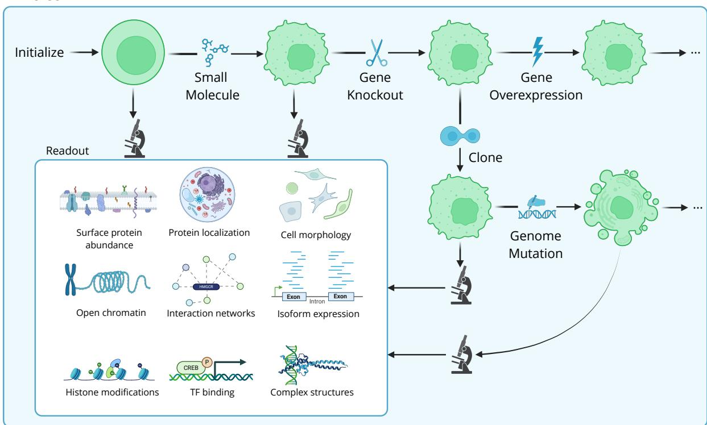  
Fig. 1. AIDO Cell enables virtual cells to be instantiated, perturbed, cloned, and profiled in silico over the course of complex, multistep experiments. Every virtual cell can be resumed, copied, compared, and extended without disturbing the original trajectory. AIDO Cell also provides coherent multiscale, multimodal readouts from th underlying cell state. Any modality can be queried at any point in an experiment without altering the state.

## 1 Introduction

Rational, scalable engineering of biological systems has been a long-standing goal in medicine and biotechnology. Engineering requires simulators that can be programmed, observed, replayed, and debugged. Chemical engineers compute kinetics and potentials, electrical engineers design circuits for voltage and current, mechanical engineers model stress and strain, and aerospace engineers simulate aircraft flows and trajectories. In each case, designs are run in software long before they enter the real world. Biology does not yet have such a simulator. The natural object for biological simulation is the cell: the smallest unit of life, and the basis for multicellular tissues and organisms.

Whole-cell models have pursued this aim from first principles for decades [1, 2, 3, 4, 5], setting the standard for what a biological simulator should be: causal, dynamic, and interpretable down to indi vidual reactions. But every molecular species, reaction, and rate constant must be specified in advance, confining the approach to the smallest and best-characterized organisms. Machine learning has taken the opposite route, learning cellular behavior from measurement alone, and has produced striking accuracy on many tasks [6]. Examples include protein structure predictors [7, 8, 9, 10], sequence-to-function models of gene regulation [11, 12, 13], variant effect predictors [14], and cell-level models of perturbation response [15, 16, 17, 18, 19].

However, simulating a cell requires more than predicting its properties. These models are built around a single assay, modality, or prediction task, fragmenting what is fundamentally one system into many separate pieces. Stitching them into pipelines does not fix the fundamental problem: predictions using isolated components do not account for the interplay between all these components within a living cell. A simulator, by contrast, must hold a cellular state that persists across manipulations, accept interventions that modify it, and render it into observations on demand. The representation of such a cell state and the

engine to operate on it have not existed for biology.

AIDO Cell provides both: a cell world model that serves as a simulation engine, and a software system that harnesses it. The harness maintains a persistent multiscale biological state, and translates user-specified commands into engine operations. The engine evolves cell state in response to perturbations and generates experimental readouts in the context of the current state (Fig. 1). Because every observation and action is defined relative to a persistent state rather than computed as an independent prediction, a single virtual cell supports three capabilities at once: (i) sequential experimentation, in which each perturbation becomes the starting point for the next; (ii) coherent multimodal readouts, in which many measurement types are decoded from one shared state; and (iii) multiscale simulation, in which molecular interventions propagate to cellular and phenotypic outcomes. Because every state is a waypoint in a larger biological landscape, AIDO Cell enables new investigations into questions that are inherently multiscale, multimodal, and open-ended, such as disease understanding and therapeutic development. Furthermore, molecular interventions can be designed to induce a specific change in cell state or readout values using in-context molecular design functions, rather than just targeting individual proteins or genes.

AIDO Cell also exposes a user-facing programming interface in which clients reason about a small set of concepts (cells, states, observations, and interventions) and manipulate them through a tractable set of operations for perturbing cells, decoding states into many simultaneous readouts, and designing against desirable states. This interface is deliberately separated from the underlying simulation engine: users compose experiments against a fixed object contract, while the components of the underlying implementation can be continuously improved. As AIDO Cell continues to be adapted and specialized on new data [20], this stable interface will be essential for providing unified access to a growing virtual cell bank.

To illustrate the capabilities of AIDO Cell, we introduce Virtual Cell Benchmark 1.0, a comprehensive panel of 31 tasks spanning five capability families, including genome regulation, molecular structures and interactions, and genetic and small-molecule perturbations. Unlike existing foundation models, which specialize in one or two biological domains, AIDO Cell unifies these capabilities within a single simulation framework. The panel of tasks demonstrates the breadth and depth of AIDO Cell, which achieves the widest range of biological simulation capabilities as well as state-of-the-art performance across 24/31 tasks.

In this 1.0 release, we provide prototype virtual cells for the K-562 [21] and Hep-G2 [22] cell lines. These prototypes are intended primarily to demonstrate what a persistent, stateful virtual cell makes possible (continuous experimentation, multiscale simulation, branching state trajectories, and in-context molecular design) rather than to serve as definitive, high-fidelity models of these two specific cell lines today. Although these case studies do not fit neatly into existing benchmarks, they demonstrate the new modes of biological discovery that are enabled by stateful cell simulation. AIDO Cell also adapts and improves with access to data from different biological contexts, enabling users to specialize existing virtual cells or create new ones from their own biological data on-demand with the supporting AIDO Foundry (Section 8). Together, these make the cell a programmable object, and a composable unit for engineering larger biological systems.

## 2 AIDO Cell Capabilities

AIDO Cell is designed to address many problems from different stages of the drug development process, which are summarized in Table 1. This breadth is enabled by AIDO Cell being an open-ended simulation platform rather than a single-prediction model. Below, we detail the composable primitives we designed AIDO Cell around in order to enable branching and open-ended simulation experiments across many different study areas.

Table 1. Applications Enabled by AIDO Cell. AIDO Cell supports a broad range of biomedical research and therapeutic development tasks through perturbation, readout, and design capabilities. Each function can be mapped to an API method described in Section 5.

<table><tr><td>Drug Discovery Stage</td><td>Example Application</td><td>Supporting AIDO Cell Functions</td></tr><tr><td>Understanding disease mechanisms</td><td>Contrast a disease genotype against baseline and trace how a loss-of-function or pathogenic variant propagates from chromatin and TF occupancy through transcription to pathway membership and subcellular localization.</td><td>- Knockout one or more genes- Knockdown one or more genes- Mutate one or more gene promoters- Read out protein pathway membership- Read out protein subcellular localization- Read out chromatin accessibility- Read out histone modifications- Read out transcription factor binding</td></tr><tr><td>Target identification &amp; validation</td><td>Rank candidate genes by how strongly knocking out or over-expressing each shifts a disease-associated signature; probe context-specific essentiality across lines; nominate regulators that produce a desired expression change.</td><td>- Knockout one or more genes- Over-express one or more genes- Read out gene expression- Read out protein-protein interactions- Read out protein pathway membership</td></tr><tr><td>Hit identification &amp; molecular screening</td><td>Screen small-molecule libraries for activity against a target, cell state, or cell morphology. Identify a compound&#x27;s most likely protein targets, and flag proteome-wide engagement.</td><td>- Apply one or more small molecule drugs- Read out protein-ligand interactions- Read out cell morphology imaging- Generate a small molecule, antibody, or nanobody targeting a specific cell state change or readout change- Generate a small molecule, antibody, or nanobody to bind to a specific protein</td></tr><tr><td>Mechanism of action studies</td><td>Map a compound&#x27;s phenotypic response back to molecular events: resolve the drug-target binding mode, then read out the downstream pathway and localization consequences.</td><td>- Apply one or more small molecule drugs- Read out protein-ligand interactions- Read out protein-protein interactions- Read out protein, protein-ligand, or protein-protein structures- Read out protein pathway membership- Read out protein subcellular localization</td></tr><tr><td>Hit-to-lead &amp; lead optimization</td><td>Score physicochemical and developability properties, design analogues against a validated target, and flag liabilities such as aggregation propensity and off-target binding.</td><td>- Apply one or more small molecule drugs- Generate a small molecule, antibody, or nanobody to bind to a specific protein- Read out small molecule properties- Read out protein aggregation probability- Read out protein-ligand interactions- Read out protein-ligand structures</td></tr><tr><td>Resistance prediction &amp; disease evolution</td><td>Anticipate escape by composing interventions, layering over-expression of a feedback regulator or a resistance mutation on top of a drug, then designing a corrective intervention back toward baseline.</td><td>- Apply one or more small molecule drugs- Over-express one or more genes- Mutate one or more gene promoters- Read out protein pathway membership- Generate a small molecule, antibody, or nanobody targeting a specific cell state change or readout change</td></tr><tr><td>Preclinical screening &amp; translational modeling</td><td>Compare the same intervention across cell lines to separate efficacy from toxicity, reading out cellular-scale phenotype as a surrogate for safety and efficacy.</td><td>- Apply one or more small molecule drugs- Knockout one or more genes- Knockdown one or more genes- Read out cell morphology imaging- Read out predicted donor age- Read out surface protein abundance</td></tr><tr><td>Clinical trial design &amp; biomarker strategy</td><td>Nominate pharmacodynamic and response biomarkers from multimodal readouts and stratify by genotype context using cell-line-specific predicted response.</td><td>- Mutate one or more gene promoters- Apply one or more small molecule drugs- Read out surface protein abundance- Read out protein subcellular localization- Read out cell morphology imaging- Search for protein targets to upregulate or downregulate specific genes</td></tr></table>

Multiplex Perturbations. AIDO Cell permits perturbations via small molecules, gene knockouts, gene knockdowns, gene overexpressions, or promoter mutations. These perturbations can be applied individually, or multiplexed in any order, as any action can be applied on top of the state produced by another action, indefinitely. This is essential for realistic experimental workflows, where biological mechanism are often triangulated through sequences such as knockout, rescue, and chemical challenges.

As a computational framework, AIDO Cell enables users to run screens of these multiplexed perturbations at unprecedented breadth and depth. We demonstrate this by generating perturbation atlases of 1M virtual cell states from the AIDO Cell K-562 and Hep-G2 cell lines (Figs. 4, 9). These atlases were generated by performing randomized combinations of up to five small molecules, gene knockouts, gene knockdowns, and gene overexpressions.

Multimodal Experimental Readouts. No single assay provides complete information about a cell. Each measurement is a partial observation of the underlying biology, so AIDO Cell exposes many complementary readouts rather than a single output channel. AIDO Cell 1.0 supports readouts across modalities including chromatin accessibility, histone and transcription-factor occupancy, gene expression and isoform abundance, protein structure, protein abundance and localization, protein–protein and protein– ligand interactions, cellular morphology, and predicted donor age (Fig. 1).

Each readout is a function of the current state and can be queried at any point in an experimental trajectory. Because all readouts are generated from the same underlying state, they are mutually coherent: a perturbation that changes transcription is simultaneously reflected in downstream protein abundance, localization, pathway activity, and morphology.

Multiscale Simulation. A cell is organized across multiple interconnected scales, from nucleotides to genes, transcripts, proteins, pathways, and whole-cell phenotype. Interventions are applied at molecular scales, while outcomes such as disease state, toxicity, efficacy, or morphology are observed at cellular or phenotypic scales. AIDO Cell operates across this hierarchy: propagating molecular interventions upward into cellular consequences, and projecting cellular observations or goals downward onto molecular drivers (Fig. 1).

Users may iteratively perturb at the molecular level, zoom out to see the cellular effects, override certain cell-level readouts to their desired state, and zoom in on molecular differences that would underlie these high-level changes. This is possible only if each scale is treated as a view of one shared state rather than as an independent prediction problem.

Serialization and Branching. The full virtual cell state can be serialized, restored, and copied. A saved state can be reloaded, branched into divergent experiments, replicated to probe stochasticity, or shared as a portable experimental object (Fig. 1). Unlike a physical sample, which may be consumed by measurement and cannot be rewound, a serialized virtual cell can be inspected, restored, forked, and replayed.

In addition to action-based perturbations, a virtual cell should allow users to write directly to selected parts of the state (see Section 8). A user may override expression, protein abundance, localization, morphology, or other state variables to specify an initial condition, impose an intermediate measurement, or define a target outcome. The simulator then reconciles the rest of the state around the override, returning a coherent cell state or the nearest biologically plausible one. This capability lets users incorporate real measurements as they become available, define arbitrary experimental starting points, and specify target states for intervention design.

In-Context Molecular Design. Given a current cell state and a target cell state (or readout), AIDO Cell provides inverse design capabilities to infer molecular or genetic interventions that would move the cell toward the target state. We call this capability in-context molecular design. AIDO Cell 1.0 provides generative in-context design functions for small molecules, antibodies, and nanobodies. Other perturbation types can be quickly screened and compared to prioritize. These capabilities close the loop on multiscale simulation, and allow users to compile multiple state changes into a single molecular

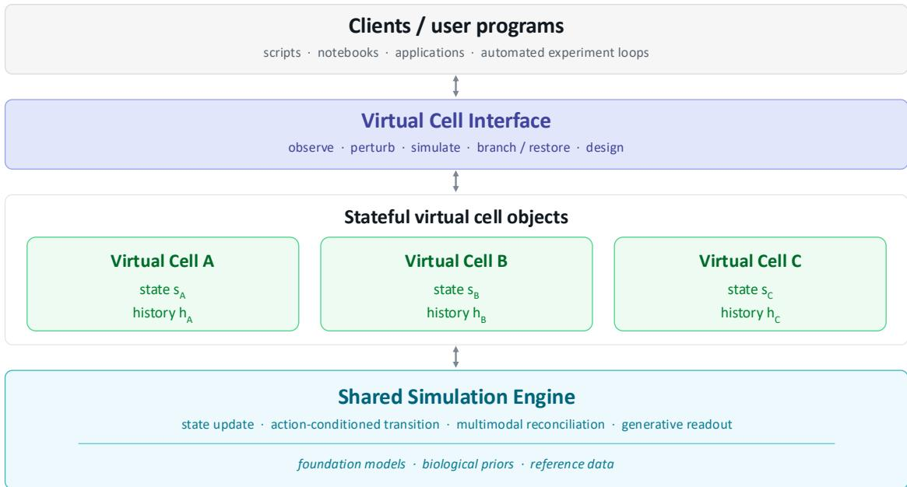  
Fig. 2. System organization of AIDO Cell 1.0. Clients interact with stateful virtual cell objects, each of which contains its own interface, state, and operation history Multiple virtual cells may coexist within the same platform and share the same system services and simulation engine while maintaining independent cellular states. The shared simulation engine contains the underlying models, reference data, and biological knowledge sources used to update state and generate coherent readouts.

## intervention.

Adaptability to New Contexts. AIDO Cell provides prototype simulations for the K-562 and Hep-G2 cell lines in the first release, but the most interesting biological questions concern undersampled cell lines, primary cells, rare disease states, heterogeneous populations, or specialized experimental settings. To support these use cases, AIDO Cell can be automatically finetuned for new data modalities and cell types as data become available, providing customized virtual cells and constructing diverse virtual cell banks.

## 3 AIDO Cell Architecture

The system is organized around a layered architecture, shown in Fig. 2, that separates client-facing abstractions from shared platform services and the underlying simulation engine.

At the top layer, clients interact with the system through scripts, notebooks, applications, or automated experimental loops. The system exposes operations for creating virtual cells, running experiments, comparing trajectories, and designing interventions. These operations are persisted on the cell state, and each cell is assigned a unique identifier in the state store.

The second layer consists of virtual cell objects, maintained by a virtual cell harness. A virtual cell object is instantiated with a biological context, such as a primary cell, a cell line, a cell in a particular microenvironment or tissue state, a disease condition, or a customized reference state. Each object shares a uniform interface but contains its own state and history. The harness supports five core actions: observe, perturb, simulate, branch/restore, and design. The state records the current representation of the cell, while the history records the sequence of interventions, simulations, and readouts that produced that state.

The bottom layer is a shared simulation engine. This engine updates cellular state, propagates the effects of actions, reconciles information across scales and modalities, and renders coherent biological readouts. The engine contains the underlying world model, component models, biological priors, reference databases, and knowledge graphs used for execution. All simulation and readout requests are mediated through the virtual cell object and run on the simulation engine.

This organization gives the platform two complementary properties. First, it provides an object-level programming interface: users reason about virtual cells rather than individual models, predictors, or pipelines. Second, it provides a platform-level execution model: many virtual cells can be instantiated, stored, resumed, branched, compared, and evaluated while sharing the same execution infrastructure. The released interface therefore remains stable even as the internal simulation engine, models, data sources, and execution strategies evolve across releases.

## 3.1 Virtual cell objects

The central abstraction exposed by the system is the virtual cell object. A virtual cell object contains a multiscale representation of a cell system. It is instantiated in a specified cell-type context and then evolves through user-specified operations.

Each virtual cell object contains two conceptual components. The first is the virtual cell interface, which defines the operations a client can invoke. The second is the cell state and history, which records the current biological state of the object and the sequence of operations that produced it. This design makes each virtual cell a stateful environment rather than a stateless pipeline.

Clients interact with a virtual cell through a stable semantic interface that exposes five primitives:

1. Observe: Query the current state through multimodal biological readouts across multiple scales.

2. Perturb: Modify the state through a rich action space of genetic or molecular interventions.

3. Simulate: Evolve the state after an intervention or over an experimental trajectory.

4. Branch/Restore: Save, copy, restore, or compare virtual cell trajectories.

5. Design: Generate or screen for interventions that move the current state toward a desired target state.

Because the virtual cell object is stateful, perturbations are cumulative, with each operation modifying the current state of the object. Subsequent observations, simulations, and design operations are conditioned on the updated state and on the accumulated history of previous operations.

## 3.2 Shared simulation engine

The shared simulation engine is the execution layer used by all virtual cell objects. Its role is to update state in response to actions and to generate coherent readouts from the resulting state. The engine itself is a stateless service shared across virtual cells, performing actions on object-specific states. All virtual cells use the same engine but maintain different contexts, histories, and trajectories.

At a high level, the engine performs three functions. First, it constructs or updates an internal representation of the current cellular state from the virtual cell object and its biological context. Second, it applies an action-conditioned transition that propagates the effect of perturbations or environmental changes. Third, it renders the updated state into observable biological readouts across modalities and scales.

Statefulness enables sequential experimentation, making AIDO Cell fundamentally different from a simple predictive model. AIDO Cell tracks a history of states and applies every intervention to the latest state. The outcome of one perturbation becomes the starting point for the next, allowing an unbounded series of interventions to be composed without enumerating all possible combinations in advance. Because the state summarizes the accumulated history of prior actions, two states can also be compared directly, for example disease versus healthy, perturbed versus baseline, or treated versus untreated.

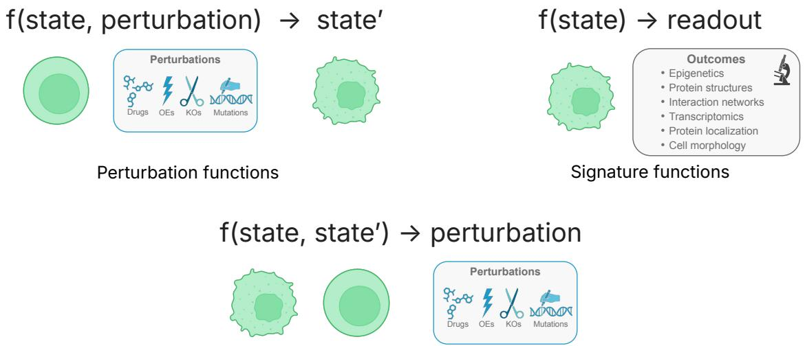  
Search & Design functions  
Fig. 3. AIDO Cell supports three main function types that operate on cell state. Perturbation functions update state. Signature functions interpret state as observable biological readouts. Search and design functions propose interventions that move a current state toward a desired state.

Conceptually, any cell biology world model or system with equivalent behavior can be used as the simulation engine. Given a current state or observation $s ,$ an intervention $^ { a , }$ and an environment or context $e ,$ the engine models the post-intervention state,

$$
p (s ^ {\prime} \mid s, a, e),
$$

where $s ^ { \prime }$ denotes the updated cell state or its observable consequences.

One useful high-level factorization is

$$
z = E (s, e), \qquad z ^ {\prime} = F (z, a, e), \qquad s ^ {\prime} = D (z ^ {\prime}).
$$

Here, the encoder $E$ maps multimodal observations and context into an internal latent representation z, the transition function $F$ evolves that representation under an action, and the decoder $D$ renders the updated representation into biological readouts.

The public client interface is not tied to a specific simulation engine implementation, and any underlying system that enables encoding, state transition, and decoding may be used. Future releases are expected to improve or replace internal components while preserving the same virtual cell object abstraction. The engine used in this release follows these semantics, and contains multiple underlying models, reference data, biological priors, and knowledge graphs used for execution. Clients do not interact with these resources directly; they interact with virtual cell objects, and the system routes operations to the appropriate services and engine components. We provide granular benchmarks of the component models in Section 6, and evaluate the complete user-facing system in Section 7.

## 4 Virtual Cell State

The virtual cell state is a complete representation of the cell maintained by AIDO Cell that captures the data hierarchies and dependencies in a real cell. The state is organized into four types of biological entities separated by scale: nucleotides, isoforms, genes, and cells. Each entity is associated with various properties, and is keyed by a common publicly used identifier. The sets of available keys are exposed as vocabularies within AIDO Cell for transparency and cross-platform compatibility.

The nucleotide-, gene-, isoform-, and cell-level representations provide complementary views of a shared biological state. The virtual cell does not treat these layers as independent databases; rather, they are different projections of the same underlying cellular state and are updated jointly by the simulation engine to maintain consistency across scales and modalities.

Table 2. Virtual cell state schema. The virtual cell state is organized into four levels: cell-level attributes, genelevel state, isoform-level state, and nucleotide-level state. Relationships across levels are encoded as primaryforeign key relationships through genomic coordinates, Ensembl gene identifiers (ENSG), and Ensembl transcript identifiers (ENST).

<table><tr><td>Field</td><td>Description</td></tr><tr><td colspan="2">Cell-level attributes</td></tr><tr><td>cell_type</td><td>ENCODE-standardized cell-line identifier; currently K-562 and Hep-G2.</td></tr><tr><td>reference_genome</td><td>GRCh38.p13 reference sequence used as the coordinate system.</td></tr><tr><td>variants</td><td>Cell-line-specific substitutions relative to the reference genome.</td></tr><tr><td>cell_image</td><td>5-channel Cell Painting image with DAPI, ER, RNA, AGP, and Mito stains.</td></tr><tr><td>morphology_features</td><td>CellProfiler features of the imaging readout.</td></tr><tr><td colspan="2">Gene-level state</td></tr><tr><td>ensembl_id</td><td>Ensembl gene identifier, primary gene index.</td></tr><tr><td>gene_symbol</td><td>HGNC symbol or Gencode accession for display.</td></tr><tr><td>isoform_ids</td><td>Ensembl transcript identifiers. Cross-references the isoform-level state.</td></tr><tr><td>locus</td><td>Coordinates of the full gene region. Cross-references nucleotide-level state.</td></tr><tr><td>expression_level</td><td>Aggregate transcript abundance in transcripts-per-million (TPM).</td></tr><tr><td>protein_abundance</td><td>CITE-seq surface protein abundance.</td></tr><tr><td>subcellular_compartment</td><td>Subcellular localization of the encoded protein.</td></tr><tr><td colspan="2">Isoform-level state</td></tr><tr><td>ensembl_tid</td><td>Ensembl transcript identifier, primary isoform index.</td></tr><tr><td>gene_id</td><td>Parent gene identifier. Cross-references gene-level state.</td></tr><tr><td>sequence</td><td>Amino-acid sequence of the encoded protein, for coding transcripts.</td></tr><tr><td>locus</td><td>Genomic coordinates of every exon in 5&#x27;→3&#x27; order.</td></tr><tr><td>expression</td><td>Transcript abundance in TPM.</td></tr><tr><td>structure</td><td>CIF-format three-dimensional structure of the encoded protein.</td></tr><tr><td>pathways</td><td>Reactome pathway identifiers associated with the protein.</td></tr><tr><td>protein_interactions</td><td>Isoform identifiers and complex structures of interacting proteins.</td></tr><tr><td>small_molecule_interactions</td><td>SMILES and complex structures of small-molecule ligands.</td></tr><tr><td>aggregation_scores</td><td>Protein aggregation-likelihood scores.</td></tr><tr><td colspan="2">Nucleotide-level state</td></tr><tr><td>position</td><td>Chromosome and nucleotide position index.</td></tr><tr><td>nucleotide</td><td>Reference base (A, C, G, or T) at the genomic position.</td></tr><tr><td>regulatory_element</td><td>ENCODE cCRE element-type label.</td></tr><tr><td>chromatin_accessibility</td><td>ATAC-seq accessibility signal.</td></tr><tr><td>histone_mark_signal</td><td>ChIP-seq occupancy signal for every available type of histone modification.</td></tr><tr><td>transcription_factor_signal</td><td>ChIP-seq occupancy signal for every available transcription factor.</td></tr></table>

Nucleotide-level state. The nucleotide-level state of a gene is indexed by genomic coordinate, using chromosome identifiers and positions relative to the reference genome. This layer represents the regulatory substrate on which transcription is controlled.

Each position may contain chromatin accessibility measurements, histone modification signals, transcriptionfactor occupancy, and regulatory-element annotations derived from ENCODE resources. Nucleotide-

level state therefore captures the regulatory landscape that influences gene expression.

Nucleotide-level perturbations, such as single-nucleotide variants or genome edits, enter the state at this layer and can propagate upward through genes, transcripts, proteins, pathways, and ultimately cellular phenotypes.

Isoform-level state. Each gene may produce multiple transcript isoforms through alternative transcription and splicing. Isoform-level state is indexed by Ensembl transcript identifiers, for example ENST00000269305, with one entry per resolved transcript.

Isoforms provide the primary connection between transcriptional regulation and protein function. Each isoform stores transcript abundance together with the properties of its encoded protein, including sequence, structure, abundance, localization, molecular interactions, and pathway membership. This orga nization allows perturbations originating at the genomic or transcript level to propagate into protein-level and pathway-level consequences.

The relationship between genes and isoforms is one-to-many: a single gene may contain multiple transcript isoforms, while each isoform belongs to exactly one parent gene through its gene id field.

Gene-level state. Genes provide the primary organizational unit of the state representation. Each gene is indexed by an Ensembl gene identifier, for example ENSG00000141510, and acts as a container that links genomic coordinates, transcript isoforms, and aggregate expression measurements.

Gene-level state provides a biologically meaningful bridge between genomic sequence and downstream molecular function. Many perturbations are specified at this level, including gene knockouts, knock downs, and overexpression interventions. Gene-level readouts therefore serve as a common point of integration across modalities.

Cell-level attributes. Cell-level attributes contain features such as morphology and predicted donor age, as well as the metadata for this virtual cell instantiation. These attributes determine the reference genome, baseline molecular measurements, supported perturbations, and available readouts.

## 5 Virtual Cell Operations and Software Interface

## 5.1 Interaction model

A client interacts with AIDO Cell by instantiating one or more virtual cell objects in a specified biological context, such as a supported cell line. The system initializes the corresponding cell state and returns a handle to a persistent virtual cell object.

All subsequent interactions are performed through this object. Operations are evaluated against the current state of the virtual cell and may observe the state, modify it, or use it as context for intervention design. Because virtual cells are persistent, a client may issue arbitrarily long sequences of operations, save and restore states, branch experimental trajectories, and compare outcomes across multiple virtua cells.

The remainder of this section specifies the operation catalogue for performing these functions on the virtual cell object.

## 5.2 Operation catalogue

AIDO Cell operations have three main types: signature operations that generate readouts from state, perturbation operations that modify state, and design operations that compare two states to design new perturbations (Fig. 3). The 1.0 interface exposes 20 operations on the cell itself: 15 signature operations and 5 perturbation operations (Table 3). In-context molecular design functions are provided as separate utilities that take cells as context (Table 4).

Signature operations. Signature operations query biological properties of the current cell state. They do not mutate the virtual cell. Results reflect the current state of the object, including any perturbations applied earlier in the same experiment. Simulated readouts cover nucleotide-level chromatin accessibility, histone marks, transcription-factor binding, transcriptomics, proteomics, protein structure, protein– protein and protein–ligand interactions, pathway membership, localization, morphology, and age-related signatures.

Perturbation operations. Perturbation operations apply interventions to the virtual cell. They mutate the current state and append the operation to the experiment history. Subsequent signature, simulation, and design operations are evaluated against the perturbed state. Perturbation experiments can include any number of small molecules, gene knockouts, gene knockdowns, gene overexpressions, and point mutations.

Design operations. Design operations propose candidate interventions using one or more virtual cell states as context. Unlike perturbation operations, they do not mutate the current cell state by default. They return payloads shaped like the inputs accepted by perturbation methods, such as SMILES strings for small molecule perturbation or amino-acid sequences for protein-based interventions.

Design operations are implemented as separate utilities that accept cell IDs as context. The generative functions fall into two groups: target-based design and state-based design, with supporting functions for target identification and property prediction.

Table 3. AIDO Cell API. The 1.0 release exposes 20 methods through the virtual cell object: 15 signature methods that observe the current state and 5 perturbation methods that modify it. Signature methods are read-only and return biological properties of the current state. Perturbation methods apply interventions that update the state and append the action to the experiment history.

<table><tr><td>Method</td><td>Arguments</td><td>Output / Effect</td></tr><tr><td colspan="3">Signature methods</td></tr><tr><td>get_chromatin_readout</td><td>Genomic window (chrom, start, stop, strand); optional sequence</td><td>Per-bp ATAC-seq signal over the window.</td></tr><tr><td>get_histone_readout</td><td>Genomic window; optional histone mark</td><td>Dict {histone mark → per-bp ChIP-seq signal}.</td></tr><tr><td>get_transcription_binding</td><td>Genomic window; optional TF</td><td>Dict {TF → per-bp ChIP-seq signal}.</td></tr><tr><td>get_rna_isoforms</td><td>Ensembl gene ID</td><td>Per-isoform readouts: transcript ID, exons, TPM.</td></tr><tr><td>get_protein_structure</td><td>Ensembl transcript ID</td><td>CIF-format 3D structure of the encoded protein.</td></tr><tr><td>get_protein_aggregation</td><td>Ensembl transcript ID</td><td>Per-chain Aggrecan3D aggregation propensity.</td></tr><tr><td>get_protein_interactions</td><td>Ensembl transcript ID; PPI threshold</td><td>Ranked target_id, sequence, TPM, probability, and complex CIF tuples.</td></tr><tr><td>get_protein_interaction_complexes</td><td>Ensembl transcript ID; PPI threshold</td><td>Predicted protein-protein complex CIFs.</td></tr><tr><td>get_molecule_interactions</td><td>SMILES</td><td>Ranked target_id, sequence, score, TPM, and complex CIF tuples.</td></tr><tr><td>get_molecule_interaction_complexes</td><td>SMILES</td><td>Predicted protein-ligand complex CIFs.</td></tr><tr><td>get_protein_pathway</td><td>Ensembl transcript ID</td><td>Reactome pathways the protein is predicted to participate in.</td></tr><tr><td>get_protein_abundance</td><td>Ensembl transcript IDs</td><td>Predicted CITE-seq surface abundance signal for each protein.</td></tr><tr><td>get_protein_localization</td><td>Ensembl transcript ID(s)</td><td>Subcellular compartments in which each protein is predicted to localize.</td></tr><tr><td>get_cell_morphology</td><td>Diffusion sampling parameters: steps, cfg</td><td>Five-channel cell painting morphology images and CellProfiler morphology features.</td></tr><tr><td>get_cell_age</td><td>None</td><td>Predicted donor age.</td></tr><tr><td colspan="3">Perturbation methods</td></tr><tr><td>gene_knockout</td><td>Ensembl gene ID</td><td>CRISPR knockout of the target gene.</td></tr><tr><td>gene_mutation</td><td>chrom, position, ref, alt</td><td>Single-nucleotide substitution or deletion at the specified position.</td></tr><tr><td>gene_knockdown</td><td>Ensembl gene ID</td><td>RNAi knockdown of the target transcript.</td></tr><tr><td>small_molecule_perturbation</td><td>SMILES</td><td>Apply a small-molecule treatment to the cell.</td></tr><tr><td>gene_overexpression</td><td>Ensembl gene ID</td><td>Overexpression of the target gene.</td></tr></table>

Table 4. AIDO Cell molecule-design companion API. Companion methods operate on one or more virtual cell states and return candidate interventions or molecular artifacts without mutating the current state. Methods are organized into three categories: target identification, generative design, and property prediction.

<table><tr><td>Method</td><td>Arguments</td><td>Output</td></tr><tr><td colspan="3">Target identification methods</td></tr><tr><td>expression_to_target</td><td>Baseline and target CellState</td><td>Ranked target_id, correlation_type, and score tuples.</td></tr><tr><td colspan="3">Generative design methods</td></tr><tr><td>design_molecule_for_target</td><td>Cell; target gene ID</td><td>SMILES designed against the target protein.</td></tr><tr><td>design_protein_for_target</td><td>Cell; target gene ID; antibody/nanobody flag</td><td>Designed binder consisting of CIF structure(s) and amino-acid sequence(s).</td></tr><tr><td>design_molecule_for_state</td><td>Baseline and target CellState</td><td>SMILES predicted to drive baseline → target.</td></tr><tr><td>design_protein_for_state</td><td>Baseline and target CellState</td><td>Antibody sequence predicted to drive baseline → target.</td></tr><tr><td colspan="3">Property prediction methods</td></tr><tr><td>molecule_properties</td><td>SMILES</td><td>Physicochemical properties including MW, logP, SA score, H-bond donors/acceptors, and Lipinski metrics.</td></tr></table>

## 6 Comparison to Existing Methods

The previous sections described the capabilities and design of AIDO Cell. This section quantifies these capabilities by comparison with other existing methods.

Virtual Cell Benchmark 1.0 compares the core readout and perturbation capabilities exposed by the AIDO Cell API with other methods. The benchmark aggregates public biological atlases into a unified panel of five families of tasks with 31 metrics: small-molecule perturbation, genetic perturbation, protein interaction, protein and nucleic acid structure, and genome regulation. Collectively, these tasks span the molecular, regulatory, structural, and cellular prediction capabilities required of a general-purpose cel simulator. Further details on the benchmark can be found in Appendix B.

Tables 5 and 6 demonstrate two distinguishing properties of AIDO Cell 1.0. The first is breadth. AIDO Cell 1.0 is the only system that supports all five families of capabilities, whereas existing foundation models are designed for one or two specialized domains. For example, AlphaFold3, Boltz-1, and Chai-1 focus on protein and biomolecular structure prediction; AlphaGenome predicts regulatory and epigenomic signals from genomic sequence; and scRNA-seq FMs such as scGPT, Geneformer, and GenePT are evaluated on their ability to perform genetic perturbation prediction. Furthermore, AIDO Cell possesses functional capabilities absent from other foundation models, including multistep state transitions and coherent multiscale readouts. AIDO Cell 1.0 unifies all these previously separate capabilities within a single stateful simulation framework, enabling multimodal reasoning over the same virtual cell state.

The second property is depth. For all five families, we expand the comparison numerically in Table 6. Despite its substantially broader scope, AIDO Cell 1.0 matches or exceeds the strongest specialized baseline across nearly every capability family and achieves state-of-the-art performance on 24 of the 31 benchmark metrics. On the few metrics where a task-specific model retains a modest advantage — for example AlphaFold3 on protein–DNA interactions, isoDDE on protein–ligand docking, or AlphaGenome on the chromatin accessibility (ATAC, DNase) and RNA-output (RNA-seq, PRO-cap) regulation tracks — AIDO Cell 1.0 remains competitive while outperforming those same models across the remainder of their respective domains. These results show that broad biological coverage need not come at the expense of predictive accuracy: a single virtual cell system can simultaneously provide comprehensive functionality and state-of-the-art performance across diverse biological prediction tasks.

Table 5. Coverage of different foundation models across five families of capabilities. AIDO Cell 1.0 is the only system spanning every family, and leads in overall performance (more details in Table 6). Most existing foundation models cover one or two families. Functional simulation differences, such as multistep experiments and multiscal readouts, are tallied on the right.

<table><tr><td>Model</td><td>Mol. Perturb</td><td>Gene KO</td><td>Multimer</td><td>Monomer</td><td>Genome reg.</td><td>Families</td><td>SOTA</td><td>Multistep</td><td>Multiscale</td></tr><tr><td>AIDO Cell 1.0</td><td>✓</td><td>✓</td><td>✓</td><td>✓</td><td>✓</td><td>5/5</td><td>24/31</td><td>✓</td><td>✓</td></tr><tr><td>ChatGPT</td><td>✓</td><td>-</td><td>-</td><td>-</td><td>-</td><td>1/5</td><td>0/31</td><td>-</td><td>-</td></tr><tr><td>ChemBERTa</td><td>✓</td><td>-</td><td>-</td><td>-</td><td>-</td><td>1/5</td><td>0/31</td><td>-</td><td>-</td></tr><tr><td>Uni-Mol2</td><td>✓</td><td>-</td><td>-</td><td>-</td><td>-</td><td>1/5</td><td>0/31</td><td>-</td><td>-</td></tr><tr><td>MiniMol</td><td>✓</td><td>-</td><td>-</td><td>-</td><td>-</td><td>1/5</td><td>0/31</td><td>-</td><td>-</td></tr><tr><td>MACCS</td><td>✓</td><td>-</td><td>-</td><td>-</td><td>-</td><td>1/5</td><td>0/31</td><td>-</td><td>-</td></tr><tr><td>ECFP4</td><td>✓</td><td>-</td><td>-</td><td>-</td><td>-</td><td>1/5</td><td>0/31</td><td>-</td><td>-</td></tr><tr><td>ESM2</td><td>-</td><td>✓</td><td>-</td><td>-</td><td>-</td><td>1/5</td><td>0/31</td><td>-</td><td>-</td></tr><tr><td>scGPT</td><td>-</td><td>✓</td><td>-</td><td>-</td><td>-</td><td>1/5</td><td>0/31</td><td>-</td><td>-</td></tr><tr><td>scPRINT</td><td>-</td><td>✓</td><td>-</td><td>-</td><td>-</td><td>1/5</td><td>0/31</td><td>-</td><td>-</td></tr><tr><td>Geneformer</td><td>-</td><td>✓</td><td>-</td><td>-</td><td>-</td><td>1/5</td><td>0/31</td><td>-</td><td>-</td></tr><tr><td>TranscriptFormer</td><td>-</td><td>✓</td><td>-</td><td>-</td><td>-</td><td>1/5</td><td>0/31</td><td>-</td><td>-</td></tr><tr><td>GenePT CC</td><td>-</td><td>✓</td><td>-</td><td>-</td><td>-</td><td>1/5</td><td>0/31</td><td>-</td><td>-</td></tr><tr><td>STRING WaveGC</td><td>-</td><td>✓</td><td>-</td><td>-</td><td>-</td><td>1/5</td><td>0/31</td><td>-</td><td>-</td></tr><tr><td>GenotypeVAE</td><td>-</td><td>✓</td><td>-</td><td>-</td><td>-</td><td>1/5</td><td>0/31</td><td>-</td><td>-</td></tr><tr><td>Boltz-1</td><td>-</td><td>-</td><td>✓</td><td>✓</td><td>-</td><td>2/5</td><td>0/31</td><td>-</td><td>-</td></tr><tr><td>Chai-1</td><td>-</td><td>-</td><td>✓</td><td>✓</td><td>-</td><td>2/5</td><td>0/31</td><td>-</td><td>-</td></tr><tr><td>HelixFold 3</td><td>-</td><td>-</td><td>✓</td><td>✓</td><td>-</td><td>2/5</td><td>0/31</td><td>-</td><td>-</td></tr><tr><td>Protenix-v2</td><td>-</td><td>-</td><td>✓</td><td>✓</td><td>-</td><td>2/5</td><td>0/31</td><td>-</td><td>-</td></tr><tr><td>SeedFold</td><td>-</td><td>-</td><td>✓</td><td>✓</td><td>-</td><td>2/5</td><td>1/31</td><td>-</td><td>-</td></tr><tr><td>AlphaFold 3</td><td>-</td><td>-</td><td>✓</td><td>✓</td><td>-</td><td>2/5</td><td>1/31</td><td>-</td><td>-</td></tr><tr><td>isoDDE</td><td>-</td><td>-</td><td>✓</td><td>✓</td><td>-</td><td>2/5</td><td>1/31</td><td>-</td><td>-</td></tr><tr><td>AlphaGenome</td><td>-</td><td>-</td><td>-</td><td>-</td><td>✓</td><td>1/5</td><td>7/31</td><td>-</td><td>-</td></tr><tr><td>Total Tasks</td><td>6 Tasks</td><td>8 Tasks</td><td>6 Tasks</td><td>3 Tasks</td><td>8 Tasks</td><td>5 Families</td><td>31 Tasks</td><td>-</td><td>-</td></tr></table>

Table6.DetailedcomparisonbetweenAIDOCell1.0andothermethodsacrossfivefamiliesofbenchmarktaskswith31differentmetrics.SeeAppendixBfordetails.

<table><tr><td rowspan="2">Models</td><td colspan="3">Mol. Perturb (WMSE ↓ / AUPRC ↑)</td><td colspan="4">Gene Knockout (WMSE ↓ / AUPRC ↑)</td><td colspan="6">Multimer (Success Rate % ↑)</td><td colspan="3">Monomer (LDDT ↑)</td><td colspan="8">Genome Regulation (Pearson ↑)</td></tr><tr><td>Unseen Drug</td><td>Unseen Cell</td><td>Unseen Cell&amp;Drug</td><td>K-562</td><td>Hep-G2</td><td>Jurkat</td><td>hTERT-RPE1</td><td>Ab-Ag</td><td>Pr-Lg</td><td>Pr-Pr</td><td>Pr-Pt</td><td>Pr-DNA</td><td>Pr-RNA</td><td>Pr</td><td>DNA</td><td>RNA</td><td>Splice Usage</td><td>CAGE</td><td>RNA-seq</td><td>ATAC</td><td>DNase</td><td>PRO-cap</td><td>ChIP-histone</td><td>ChIP-TF</td></tr><tr><td>Train Mean</td><td>0.079 / 0.31</td><td>0.039 / 0.44</td><td>0.083 / 0.23</td><td>0.062 / 0.14</td><td>0.088 / 0.17</td><td>0.106 / 0.14</td><td>0.149 / 0.30</td><td></td><td></td><td></td><td></td><td></td><td></td><td></td><td></td><td></td><td></td><td></td><td></td><td></td><td></td><td></td><td></td><td></td></tr><tr><td>MiniMol</td><td>0.084 / 0.25</td><td>0.035 / 0.24</td><td>0.088 / 0.18</td><td></td><td></td><td></td><td></td><td></td><td></td><td></td><td></td><td></td><td></td><td></td><td></td><td></td><td></td><td></td><td></td><td></td><td></td><td></td><td></td><td></td></tr><tr><td>ChemBERTa</td><td>0.083 / 0.25</td><td>0.061 / 0.21</td><td>0.091 / 0.19</td><td></td><td></td><td></td><td></td><td></td><td></td><td></td><td></td><td></td><td></td><td></td><td></td><td></td><td></td><td></td><td></td><td></td><td></td><td></td><td></td><td></td></tr><tr><td>ChatGPT</td><td>0.081 / 0.25</td><td>0.050 / 0.21</td><td>0.087 / 0.19</td><td></td><td></td><td></td><td></td><td></td><td></td><td></td><td></td><td></td><td></td><td></td><td></td><td></td><td></td><td></td><td></td><td></td><td></td><td></td><td></td><td></td></tr><tr><td>MACCS</td><td>0.089 / 0.24</td><td>0.057 / 0.20</td><td>0.098 / 0.17</td><td></td><td></td><td></td><td></td><td></td><td></td><td></td><td></td><td></td><td></td><td></td><td></td><td></td><td></td><td></td><td></td><td></td><td></td><td></td><td></td><td></td></tr><tr><td>Topological</td><td>0.079 / 0.23</td><td>0.061 / 0.21</td><td>0.082 / 0.19</td><td></td><td></td><td></td><td></td><td></td><td></td><td></td><td></td><td></td><td></td><td></td><td></td><td></td><td></td><td></td><td></td><td></td><td></td><td></td><td></td><td></td></tr><tr><td>Uni-Mol2</td><td>0.080 / 0.22</td><td>0.083 / 0.24</td><td>0.082 / 0.16</td><td></td><td></td><td></td><td></td><td></td><td></td><td></td><td></td><td></td><td></td><td></td><td></td><td></td><td></td><td></td><td></td><td></td><td></td><td></td><td></td><td></td></tr><tr><td>ECFP4</td><td>0.082 / 0.23</td><td>0.056 / 0.22</td><td>0.085 / 0.19</td><td></td><td></td><td></td><td></td><td></td><td></td><td></td><td></td><td></td><td></td><td></td><td></td><td></td><td></td><td></td><td></td><td></td><td></td><td></td><td></td><td></td></tr><tr><td>ESM2</td><td></td><td></td><td></td><td>0.060 / 0.08</td><td>0.084 / 0.09</td><td>0.105 / 0.06</td><td>0.140 / 0.11</td><td></td><td></td><td></td><td></td><td></td><td></td><td></td><td></td><td></td><td></td><td></td><td></td><td></td><td></td><td></td><td></td><td></td></tr><tr><td>scGPT</td><td></td><td></td><td></td><td>0.058 / 0.08</td><td>0.081 / 0.08</td><td>0.102 / 0.05</td><td>0.138 / 0.11</td><td></td><td></td><td></td><td></td><td></td><td></td><td></td><td></td><td></td><td></td><td></td><td></td><td></td><td></td><td></td><td></td><td></td></tr><tr><td>scPRINT</td><td></td><td></td><td></td><td>0.059 / 0.07</td><td>0.083 / 0.08</td><td>0.104 / 0.05</td><td>0.141 / 0.11</td><td></td><td></td><td></td><td></td><td></td><td></td><td></td><td></td><td></td><td></td><td></td><td></td><td></td><td></td><td></td><td></td><td></td></tr><tr><td>Geneformer</td><td></td><td></td><td></td><td>0.060 / 0.07</td><td>0.085 / 0.07</td><td>0.105 / 0.05</td><td>0.145 / 0.10</td><td></td><td></td><td></td><td></td><td></td><td></td><td></td><td></td><td></td><td></td><td></td><td></td><td></td><td></td><td></td><td></td><td></td></tr><tr><td>TranscriptFormer</td><td></td><td></td><td></td><td>0.062 / 0.05</td><td>0.087 / 0.06</td><td>0.106 / 0.03</td><td>0.147 / 0.09</td><td></td><td></td><td></td><td></td><td></td><td></td><td></td><td></td><td></td><td></td><td></td><td></td><td></td><td></td><td></td><td></td><td></td></tr><tr><td>GenePT CC</td><td></td><td></td><td></td><td>0.054 / 0.11</td><td>0.075 / 0.11</td><td>0.096 / 0.08</td><td>0.125 / 0.14</td><td></td><td></td><td></td><td></td><td></td><td></td><td></td><td></td><td></td><td></td><td></td><td></td><td></td><td></td><td></td><td></td><td></td></tr><tr><td>STRING WaveGC</td><td></td><td></td><td></td><td>0.053 / 0.10</td><td>0.074 / 0.10</td><td>0.094 / 0.07</td><td>0.120 / 0.12</td><td></td><td></td><td></td><td></td><td></td><td></td><td></td><td></td><td></td><td></td><td></td><td></td><td></td><td></td><td></td><td></td><td></td></tr><tr><td>GenotypeVAE</td><td></td><td></td><td></td><td>0.054 / 0.10</td><td>0.076 / 0.10</td><td>0.099 / 0.07</td><td>0.127 / 0.13</td><td></td><td></td><td></td><td></td><td></td><td></td><td></td><td></td><td></td><td></td><td></td><td></td><td></td><td></td><td></td><td></td><td></td></tr><tr><td>Boltz-1</td><td></td><td></td><td></td><td></td><td></td><td></td><td></td><td>33.54</td><td>55.04</td><td>68.25</td><td>79.17</td><td>70.97</td><td>56.90</td><td>0.87</td><td>0.34</td><td>0.44</td><td></td><td></td><td></td><td></td><td></td><td></td><td></td><td></td></tr><tr><td>Chai-1</td><td></td><td></td><td></td><td></td><td></td><td></td><td></td><td>23.64</td><td>51.23</td><td>68.53</td><td>66.67</td><td>69.97</td><td>50.91</td><td>0.87</td><td>0.46</td><td>0.49</td><td></td><td></td><td></td><td></td><td></td><td></td><td></td><td></td></tr><tr><td>HelixFold 3</td><td></td><td></td><td></td><td></td><td></td><td></td><td></td><td>28.40</td><td>51.82</td><td>66.27</td><td>89.47</td><td>50.00</td><td>48.28</td><td>0.86</td><td>0.29</td><td>0.55</td><td></td><td></td><td></td><td></td><td></td><td></td><td></td><td></td></tr><tr><td>Protenix-v2</td><td></td><td></td><td></td><td></td><td></td><td></td><td></td><td>65.00</td><td>64.00</td><td>73.00</td><td></td><td></td><td></td><td>0.89</td><td></td><td></td><td></td><td></td><td></td><td></td><td></td><td></td><td></td><td></td></tr><tr><td>SeedFold</td><td></td><td></td><td></td><td></td><td></td><td></td><td></td><td>53.21</td><td>63.12</td><td>74.03</td><td></td><td>72.60</td><td>65.31</td><td>0.89</td><td>0.59</td><td>0.50</td><td></td><td></td><td></td><td></td><td></td><td></td><td></td><td></td></tr><tr><td>OpenFold 3</td><td></td><td></td><td></td><td></td><td></td><td></td><td></td><td>28.83</td><td>44.49</td><td>69.96</td><td></td><td></td><td></td><td></td><td></td><td></td><td></td><td></td><td></td><td></td><td></td><td></td><td></td><td></td></tr><tr><td>AlphaFold 3</td><td></td><td></td><td></td><td></td><td></td><td></td><td></td><td>47.90</td><td>64.90</td><td>72.93</td><td>82.98</td><td>79.18</td><td>62.32</td><td>0.88</td><td>0.53</td><td>0.61</td><td></td><td></td><td></td><td></td><td></td><td></td><td></td><td></td></tr><tr><td>isoDDE</td><td></td><td></td><td></td><td></td><td></td><td></td><td></td><td>75.58</td><td>75.99</td><td>74.19</td><td></td><td></td><td></td><td></td><td></td><td></td><td></td><td></td><td></td><td></td><td></td><td></td><td></td><td></td></tr><tr><td>AlphaGenome</td><td></td><td></td><td></td><td></td><td></td><td></td><td></td><td></td><td></td><td></td><td></td><td></td><td></td><td></td><td></td><td></td><td>0.89</td><td>0.45</td><td>0.80</td><td>0.69</td><td>0.69</td><td>0.60</td><td>0.57</td><td>0.50</td></tr><tr><td>AIDO Cell 1.0</td><td>0.074 / 0.32</td><td>0.027 / 0.46</td><td>0.080 / 0.24</td><td>0.051 / 0.27</td><td>0.069 / 0.22</td><td>0.089 / 0.21</td><td>0.118 / 0.34</td><td>76.61</td><td>66.79</td><td>75.40</td><td>90.00</td><td>75.31</td><td>63.77</td><td>0.94</td><td>0.60</td><td>0.71</td><td>0.89</td><td>0.45</td><td>0.79</td><td>0.67</td><td>0.68</td><td>0.59</td><td>0.57</td><td>0.52</td></tr></table>

## 7 Representative Workflows Using Virtual Cells

To further illustrate the capabilities of this first-in-class system, we present a series of end-to-end case studies using K-562 and Hep-G2 virtual cells released with the current system. These case studies contain representative workflows that simulate known biological states, probe each state through multiple readout modalities, and design molecules to achieve specific state changes.

We begin each study by generating an unperturbed virtual cell and characterizing its baseline state via simultaneous molecular and cellular readouts. Then, we apply several genetic or pharmacological perturbations, and observe how the resulting state changes propagate across simulated experimental readouts. Finally, we identify a post-perturbation state of interest and design a molecular or genetic intervention to induce this state on demand. Wherever possible, we compare the simulated experimental readouts against established findings from the biological literature. The goal of these studies is not to evaluate individual readouts in isolation but to demonstrate how AIDO Cell supports complex and branching experiments while maintaining a coherent internal cell state that can be decoded into molecular and cellular-scale readouts simultaneously.

## 7.1 Stateful Multiscale Simulation of the Virtual K-562 Cell Line

Starting from the baseline K-562 virtual cell state, one can traverse the state space by applying different combinations of perturbations while generating different experimental readouts (Fig. 4). This case study demonstrates how this can be used for conducting end-to-end experiments on the K-562 virtual cell line.

K-562 provides two complementary biological systems for this demonstration: multipotent erythroid or megakaryocyte differentiation [23, 24, 25] and oncogenic signaling driven by the ABL1 kinase domain of the BCR-ABL1 fusion protein [26, 27]. These systems allow us to evaluate whether a virtual cell can maintain coherent state transitions across transcriptional, regulatory, structural, and cellular scales.

The case study is organized into three workflows. Workflow 1 simulates the baseline erythroid state. Workflow 2 simulates state transitions along the ABL pathway, including kinase inhibition, resistance emergence, and therapeutic rescue. Workflow 3 uses the in-context molecular design functions to propose functional analogs to the classic kinase inhibitors and screens them based on desired molecular and cellular behaviors.

## 7.1.1 Workflow 1: Simulating the Baseline K-562 State

```python
AIDO Cell K-562 · Python API
# Characterize the baseline cell state
cell = Cell("K-562")
cell.get_chromatin_readout("HBB")
cell.get_chromatin_readout("HBG2")
cell.get_histone_readout("HBB", mark="H3K4me3")
cell.get_histone_readout("HBG2", mark="H3K4me3")
cell.get_expression()
```

We begin by simulating the baseline K-562 state and decoding its genomic and transcriptional layers. K-562 has been previously characterized as showing a fetal erythroid program in which embryonic and fetal globins are expressed while the adult $\beta { \mathrm { - g l o b i n } }$ gene HBB remains silent [28, 23, 24, 25]. Dean et al. document this directly at baseline, finding $\alpha \cdot , \gamma \cdot , \varepsilon \cdot ,$ , and $\zeta _ { - \mathrm { g l o b i n ~ m R N A s } }$ present in uninduced cells while β-globin mRNA is undetectable [28]. Reading the expression state reveals the defining globin program of erythroid cells (Fig. 5), where embryonic and fetal globins are highly expressed, while adult HBB remains nearly silent.

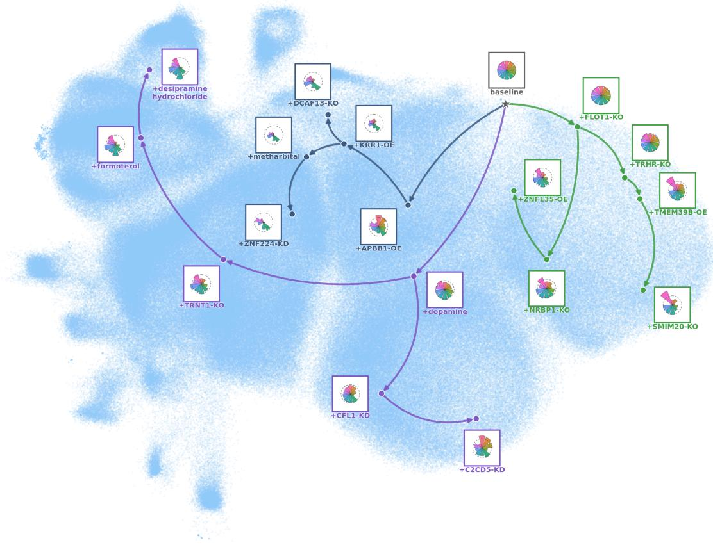  
Fig. 4. K-562 virtual cell perturbation atlas. Atlas of generated states from 1M randomized 5-plex knockout, knockdown, overexpression, and small molecule perturbations on K-562 in AIDO Cell. We plot several continuous perturbation experiments against this atlas. Each node is a simulated state and each arrow is a perturbation. The per-node icon is a circular bar plot of pathway activity: one colored bar per pathway, grown from the center to that pathway’s mean log FC versus baseline. The dashed reference ring marks the baseline (no-change) level, so bars reaching past the ring are up-regulated and bars falling short of it are down-regulated. The ten pathways, clockwise from the top, are E2F targets, G2-M checkpoint, MYC targets, mTORC1 signaling, DNA repair, p53 pathway, apoptosis, heme metabolism, oxidative phosphorylation, and TNF-α/NF-κB signaling.

The same simulated state can be decoded through chromatin and regulatory readouts. A 4 kb window on the genome around promoters within the β-globin locus shows strong activity at the fetal promoters and weak activity at the adult promoter. The fetal promoters exhibit higher H3K4me3, H3K27ac, and chromatin accessibility, and base-resolution tracks show pronounced H3K4me3 and accessibility peaks near the fetal HBG2 and little signal at the adult HBB (Fig. 5), as expected for the active-fetal, silentadult globin program in K-562 [28].

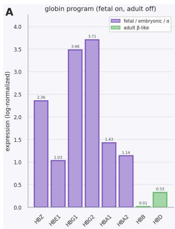

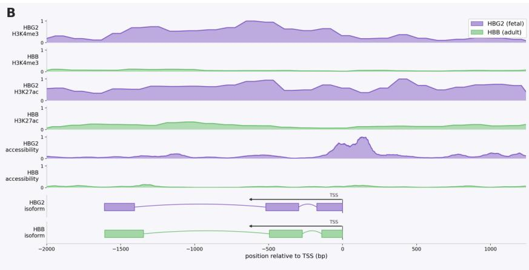  
Fig. 5. Example multiscale readouts from baseline K-562 state. (A) Simulated globin expression program, hue-coded by group (embryonic/fetal HBG/HBZ/HBA on, adult HBB/HBD off); (B) Simulated chromatin tracks at the β-globin-locus promoters (H3K4me3, H3K27ac, and chromatin accessibility), flat at the silent adult HBB TSS and peaked at the active fetal HBG2 TSS. The globin genes lie on the negative strand, so each promoter is upstream (to the right) of its TSS.

## 7.1.2 Workflow 2: Simulating Kinase Inhibitors and Drug Resistance

```python
AIDO Cell K-562 · Python API

imatinib = "CC1=C(C=C(C=C1)..." 
ponatinib = "CC1=C(C=C(C=C1..." 

# Create wild-type and resistant strains 
cell_wt = Cell("K-562")
cell_resistant = cell_wt.clone()
cell_resistant.set_protein_sequence("ABL1", "MLEICL...")

# Characterize both treatments in both strains 
for molecule in [imatinib, ponatinib]:
    for cell_ref in [cell_wt, cell_resistant]:
    cell = cell_ref.clone()
    cell.small_molecule_perturbation(molecule)
    cell.get_protein_complex("ABL1", molecule)
    cell.get_expression()
```

In addition to the baseline erythroid state, K-562 is also an immortal cell line due to the overactive ABL signaling pathway, which causes the cell to proliferate uncontrollably. K-562 was the model system used in the development of imatinib, one of the first targeted therapies against the overactive BCR ABL1 fusion kinase that defines the K-562 lineage [26, 27]. Treating this tumor requires inhibiting the ABL pathway.

First, we directly inhibit the kinase by applying an ABL1-targeted knockdown to the cell state and resimulate cellular readouts. Decoding the perturbed transcriptional state reveals suppression of multiple downstream BCR-ABL output genes (Fig. 6). Expression of the pro-proliferative and pro-survival genes MYC, PIM1, MYB, and BCL2L1 decreases. These changes indicate reduced oncogenic proliferative and survival signaling.

In another K-562 virtual cell clone, we apply imatinib, an FDA-approved ABL1 kinase inhibitor. In addition to cell-level readouts, we also decode the small molecule interactions and complex structure (Fig. 6). The drug-bound state captures the molecular interaction underlying ABL inhibition and provides a structural explanation for the other readout changes. The panel of relevant pathway readouts shows similar effects, throttling the cell-cycle and proliferation regulators. Gene-set enrichment analysis over the full transcriptional signature confirms this at the pathway level: the E2F, G2-M-checkpoint, and Myc-target programs are coordinately repressed (E2F normalized enrichment score −1.67, FDR $q < 0 . 0 1 )$ , while the apoptosis program is not enriched.

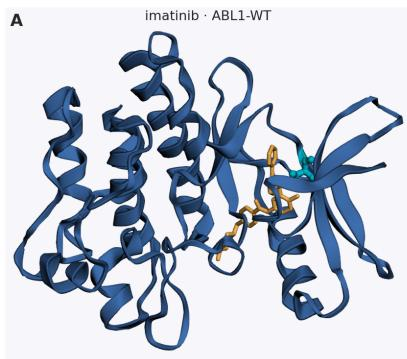

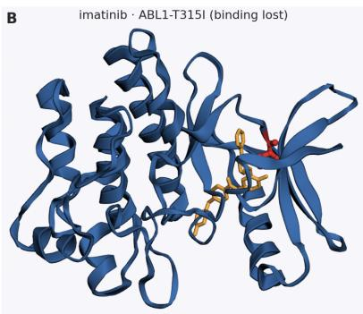

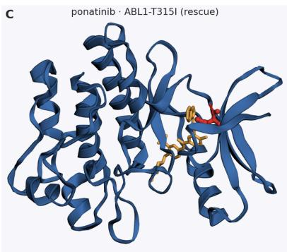

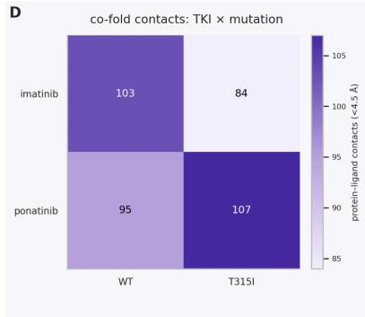

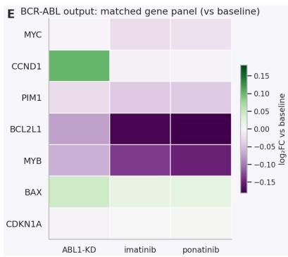

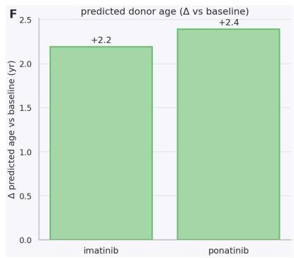  
Fig. 6. T315I imatinib resistance and rescue in K-562. (A–C) Predicted co-folds of imatinib with wild-type ABL1, imatinib with the T315I gatekeeper mutant (engagement lost), and ponatinib with T315I (engagement recovered); the ligand is drawn in orange, and residue 315 is highlighted in red for mutant and blue for wild-type; (D) each drug’s predicted contacts with each strain’s ABL1; (E) the BCR-ABL output panel read on a single matched gene set for the genetic ABL1 knockdown, imatinib, and ponatinib, showing that the three interventions converge on the same transcriptional program; (F) the predicted donor age relative to baseline for imatinib and ponatinib.

After prolonged treatment with imatinib, random mutations and genomic instability give rise to resistant strains that proliferate and take over the cell population. New drugs are needed to address these resistant strains. In K-562, a canonical resistance mutation is ABL1 T315I, which dislodges imatinib from the binding pocket. Here, we apply the resistance mutation and simulate the response to imatinib and an FDA-approved follow-up treatment designed for this resistant strain, ponatinib.

We create four K-562 virtual cell clones, apply the resistance mutation in two, then apply imatinib and ponatinib in each strain and decode their molecular effects. First, we inspect their molecular interactions. The resulting structural states reveal reduced imatinib engagement following introduction of the resistance mutation, while ponatinib maintains strong engagement on the mutant background (Fig. 6). Next, we compare the transcriptional effects of ponatinib against the previously-profiled imatinib and ABL1-knockdown effects. The gene panel shows similar directions in response across all perturbations, supporting a similar mechanism. Beyond expression, the cell-level donor-age readout (a proxy for cellular stress) shifts consistently for imatinib and ponatinib relative to baseline (Fig. 6F).

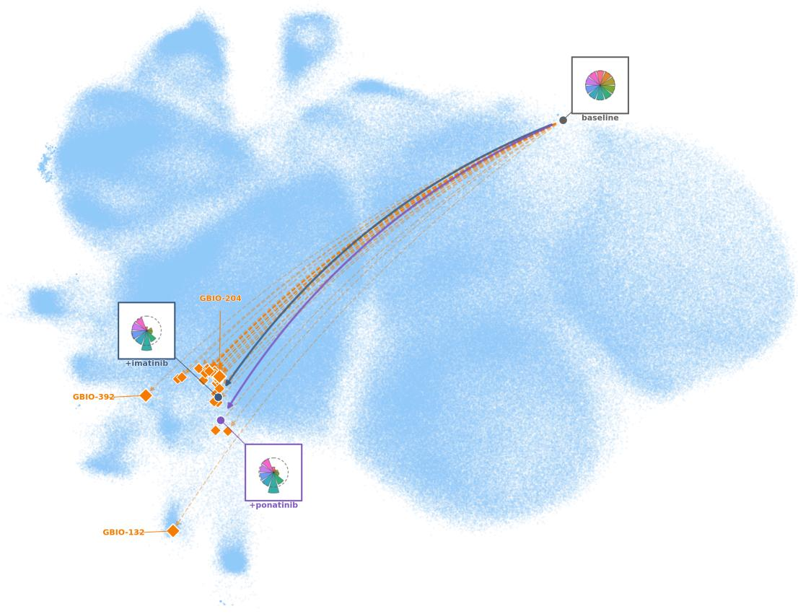  
Fig. 7. ABL1 binder design campaign projected onto the K-562 state space. 36 generated candidates are projected onto the K-562 state cloud as dashed trajectories from the baseline state and compared to the reference ABL1 kinase inhibitors imatinib and ponatinib. We show circular bar plots of pathway activity (mean log<sub>2</sub>FC per pathway versus baseline) to summarize each state’s predicted post-perturbation transcriptional signature; the pathways and their order match Fig. 4.

## 7.1.3 Workflow 3: Designing New Kinase Inhibitors for Cell-State Effects

```python
AIDO Cell K-562 · Python API
# Create the reference perturbation
imatinib = "CC1=C(C=C(C=C1)..."
cell = Cell("K-562")
cell_ref_perturbed = cell.clone()
cell_ref_perturbed.small_molecule_perturbation(imatinib)
cell_ref_perturbed.get_expression()

# Generating target-binding molecules, characterizing them in cells
for _ in range(N):
    molecule = design_molecule_for_target("ABL1")
    cell_perturbed = cell.clone()
    cell_perturbed.small_molecule_perturbation(molecule)
    cell_perturbed.get_protein_structure("ABL1", molecule)
    cell_perturbed.get_protein_ligand_interactions(molecule)
    cell_perturbed.get_expression()
    cell_perturbed.get_cell_age()
```

<table><tr><td>rank</td><td>molecule</td><td>combined avg rank</td><td>Synthesizability</td><td>Pocket contacts (&lt;4.5Å)</td><td>Divergence vs imatinib co-fold (Å)</td><td>ABL1 binding affinity</td><td>ABL1 proteome target rank</td><td>DE recovery vs imatinib</td></tr><tr><td>1</td><td>GBIO-392</td><td>7.00</td><td>2.50</td><td>93</td><td>10.43</td><td>6.12</td><td>326/8899</td><td>88/100 (88%)</td></tr><tr><td>2</td><td>imatinib</td><td>7.33</td><td>2.33</td><td>103</td><td>0.00</td><td>5.62</td><td>1311/8899</td><td>100/100 (100%)</td></tr><tr><td>3</td><td>GBIO-204</td><td>7.83</td><td>2.40</td><td>59</td><td>6.47</td><td>6.94</td><td>187/8899</td><td>65/100 (65%)</td></tr><tr><td>4</td><td>GBIO-132</td><td>9.50</td><td>3.01</td><td>73</td><td>24.69</td><td>6.88</td><td>223/8899</td><td>85/100 (85%)</td></tr><tr><td>5</td><td>GBIO-721</td><td>9.67</td><td>3.24</td><td>67</td><td>4.98</td><td>6.75</td><td>255/8899</td><td>66/100 (66%)</td></tr><tr><td>11</td><td>neg_ctrl</td><td>15.17</td><td>2.73</td><td>60</td><td>6.70</td><td>6.22</td><td>482/8899</td><td>18/100 (18%)</td></tr></table>

Table 7. Multimodal virtual screen of designed ABL1 binders. We score designed binders for ABL1 on synthetic accessibility; pocket contacts (ATP-cleft contacts under 4.5 A); redock divergence vs. imatinib; binding<sup>˚</sup> affinity; target specificity (the rank of ABL1 among the ∼8,900 expressed genes in K-562); and transcriptional similarity to an imatinib perturbation. Synthetic accessibility is the SAscore of Ertl and Schuffenhauer [29], computed from fragment contributions and a molecular-complexity penalty with RDKit and scaled from 1 (easy to synthesize) to 10 (difficult). Molecules are ordered by their average rank across screening modalities (lower is better). We use imatinib as a positive control, and a random drug-like molecule as a negative control. Designs out-score imatinib on affinity and target rank and recover 65–88% of its transcriptome, but mostly dock away from the ATP cleft.

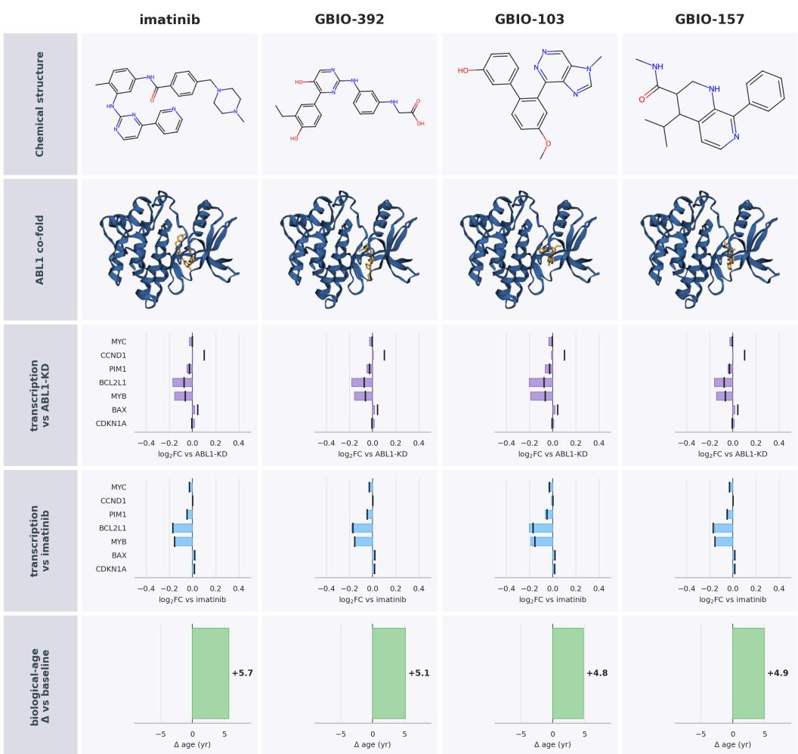  
Fig. 8. Modality × molecule readout. Imatinib (the reference tick) alongside three designed ABL1 binders, GBIO-392, GBIO-103, and GBIO-157, chosen for drug-like chemistry and a converged kinase co-fold, read out across four modalities. Rows (top to bottom): the 2D structure; the predicted ABL1 kinase-domain co-fold (ligand in magenta); the BCR-ABL panel transcriptional response over the genetic ABL1-knockdown profile (black ticks); the same response over imatinib’s; and the predicted biological-age shift. Bars give each molecule’s BCR-ABL log<sub>2</sub> fold change; black ticks mark the reference profile. The three designs reproduce imatinib’s suppression of the BCR-ABL output panel, strongest at BCL2L1, MYB, and PIM1, and its biological-age increase of roughly five years.

In the previous sections, we show how AIDO Cell can be used to characterize a cell before and after perturbation. In this section, we approach the inverse problem: given a desired cell state, can we design a perturbation to achieve this state? We start from a target of interest, the ABL1 kinase, which has been turned hyperactive in K-562 due to a genetic alteration. We use the design\_molecule\_for\_target function to propose candidate binders, generating molecules conditioned on the ABL1 kinase domain (the ATP-binding cleft, residues 241–493) over repeated sampling rounds and screening each candidate by predicted binding to full-length ABL1, used here as a proxy for the ABL1 kinase domain as it occurs in BCR-ABL1.

We perform a new kind of virtual screen on these molecules, introducing them each to the virtual cell and evaluating their effects. We read out traditional metrics used to evaluate therapeutic candidates like synthetic accessibility and pocket binding, as well as cell-level metrics like proteome-wide activity and transcriptional effects.

An ideal small molecule will not only bind its target but also be highly selective and induce a cell state where ABL1 shows reduced activity. We also induce this state by directly applying the known imatinib perturbation to another virtual cell. This lets us rank small molecules on how well they are able to replicate the known drug’s effects. In this exercise, we are searching for functional analogs. We use the imatinib-perturbed cell as a target for designs, searching for small molecules that induce identical effects while being structurally novel.

In Fig. 7, we plot the state changes induced by all 36 designs. Several molecules induce nearly identical state changes to the reference imatinib perturbation. In Table 7, we prioritize these molecules by state similarity and other molecular attributes. We show combined scores from transcriptional similarity as well as synthetic accessibility, pocket contacts, similarity to the known imatinib pose, binding affinity, and the ranking of ABL1 in a proteome-wide screen. We also include the imatinib perturbation as a positive control, and a random drug-like molecule as a negative control. Several designed molecules are competitive with imatinib, and one molecule, GBIO-392, exceeds imatinib on the combined ranking, showing improved predicted specificity and affinity.

We further characterize three designed binders that dock cleanly into the ABL1 kinase, alongside imatinib, across more molecular and cellular readouts in Fig. 8. GBIO-392, GBIO-103, and GBIO-157 reproduce imatinib’s transcriptional response, suppressing the BCR-ABL output panel (BCL2L1, MYB, PIM1) toward the genetic ABL1-knockdown profile. We also profile the predicted donor-age shift, a proxy for cellular stress. All three designs raise the predicted donor age by roughly five years, matching imatinib. Because the designs recover most of imatinib’s transcriptional signature (Table 7), we read this donor-age shift as a proxy for the same proliferative arrest.

## 7.2 Stateful Multiscale Simulation of the Virtual Hep-G2 Cell Line

Starting from the baseline Hep-G2 virtual cell state, one can traverse the state space by applying different combinations of perturbations while generating different experimental readouts (Fig. 9). This case study demonstrates how this can be used for conducting end-to-end experiments on the Hep-G2 virtual cell line.

Hep-G2 provides two complementary biological systems for this demonstration: the hepatocyte secretory program [30, 22] and cholesterol metabolism through the HMG-CoA reductase pathway, which led to the discovery of statins [31, 32]. These systems allow us to evaluate whether a virtual cell can support coherent state simulation, perturbation, comparison, screening, and inverse design on these mechanisms.

The case study is organized into three workflows. Workflow 1 simulates the baseline hepatocyte state and decodes it across molecular, transcriptional, spatial, and morphological readouts. Workflow 2 simulates the statin discovery experiments, evaluating state transitions along the HMGCR pathway through genetic knockdown of HMGCR. Workflow 3 looks at a known side effect of these perturbations and runs a follow-up genetic over-expression screen to mitigate the side effect while retaining the main cholesterol-lowering effect of statins.

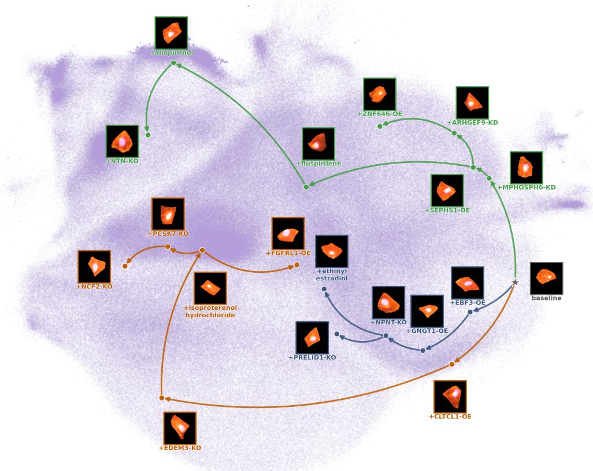  
Fig. 9. Hep-G2 virtual cell perturbation atlas. Atlas of generated states from 1M randomized 5-plex knockout, knockdown, overexpression, and small molecule perturbations on Hep-G2 in AIDO Cell. We plot several continuous perturbation experiments against this atlas. Each node is a simulated state and each arrow is a perturbation. We annotate each state with its generated cell morphology readout.

## 7.2.1 Workflow 1: Simulating the Baseline Hep-G2 State

```python
AIDO Cell Hep-G2 · Python API
# Characterize the baseline Hep-G2 state
cell = Cell("Hep-G2")
cell.get_protein_structure(["FGA", "FGB", "FGG"])
cell.get_expression()
cell.get_protein_localization(["ALB", "TF", "SERPINA1", ...])
cell.get_morphology()
```

First, we evaluate the Hep-G2 baseline state for the presence of a well-characterized plasma protein secretion program, one of Hep-G2’s defining features. Decoding the transcriptional layer reveals a coordinated plasma-protein program characteristic of differentiated hepatocytes (Fig. 10). Our panel is a curated set of twenty canonical hepatocyte-secreted plasma proteins from Hep-G2’s founding characterization [30, 22], restricted to members that the virtual cell reads out. All twenty lie within the top expression decile of the Hep-G2 transcriptome (panel mean 2.42), led by albumin (4.21), APOA2 (4.03), and APOB (3.64). A few classical secreted proteins fall outside the panel because the current model does not read them (plasminogen, complement C4) or does not express them highly in this state

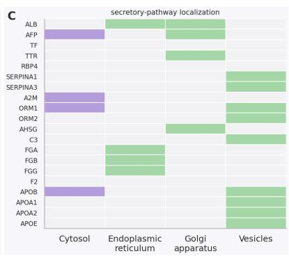

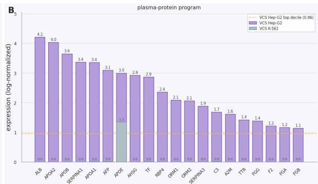

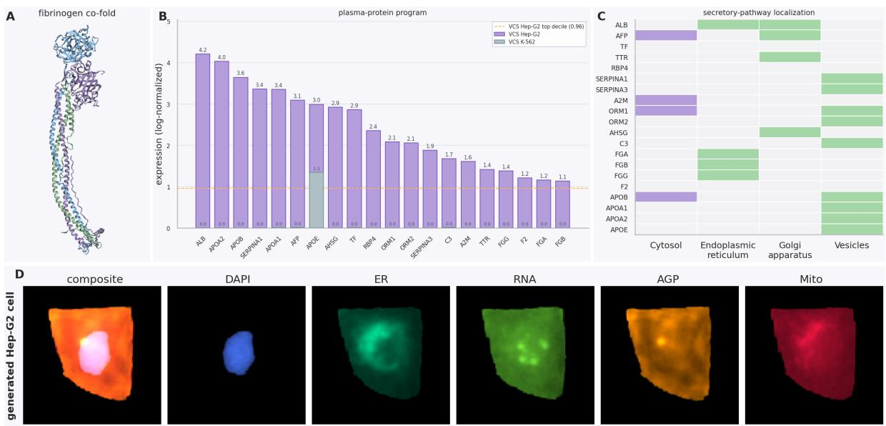  
Fig. 10. Baseline Hep-G2 state card. One simulated state read across scales. (A) the fibrinogen protomer, cofolded from its three secreted chains FGA, FGB, and FGG, which wind into the coagulation hetero-trimer; (B) the plasma-protein expression program from AIDO Cell Hep-G2, with comparison levels from AIDO Cell K-562; (C) predicted localization of the plasma proteins to secretory-pathway compartments (green) vs. non-secretory cytosol (purple); (D) a generated Cell Painting image.

(haptoglobin, ceruloplasmin).

To assess context specificity, we compare the same simulated state against a K-562 virtual cell. The plasma-protein program is largely absent in K-562, indicating that the secretory phenotype emerges specifically from the Hep-G2 state rather than from a generic expression readout.

We further characterize this program by zooming in on key protein interaction complexes and zooming out to predict the localization of these proteins in the cell (Fig. 10). Protein-localization predictions place sixteen of the twenty plasma proteins within secretory-pathway compartments (endoplasmic reticulum, Golgi, and vesicles vs. cytosol alone). Zooming in on the structural layer, we co-fold the three secreted fibrinogen chains, FGA, FGB, and FGG, into a single protomer. The virtual cell assembles the characteristic fibrinogen architecture: the three chains wind into a triple-stranded coiled-coil that terminates in the distal beta- and gamma-nodule domains, showing that the secreted program includes proteins that co-assemble into functional multi-chain complexes.

## 7.2.2 Workflow 2: Simulating State Transitions Along the HMGCR Pathway

```python
AIDO Cell Hep-G2 · Python API
# Characterize a therapeutic target knockdown
cell = Cell("Hep-G2")
cell_kd = cell.clone()
cell_kd.gene_knockdown("HMGCR")
cell_kd.get_expression()
```

Having established the baseline hepatocyte state, we next perturb the HMGCR pathway, the target of statin therapy for high cholesterol. In this case study, we treat HMGCR as a novel target and characterize the pathway through genetic perturbation rather than the known statins. We start by directly knocking down the HMGCR gene and simulating the cell response to characterize the pathway (Fig. 11).

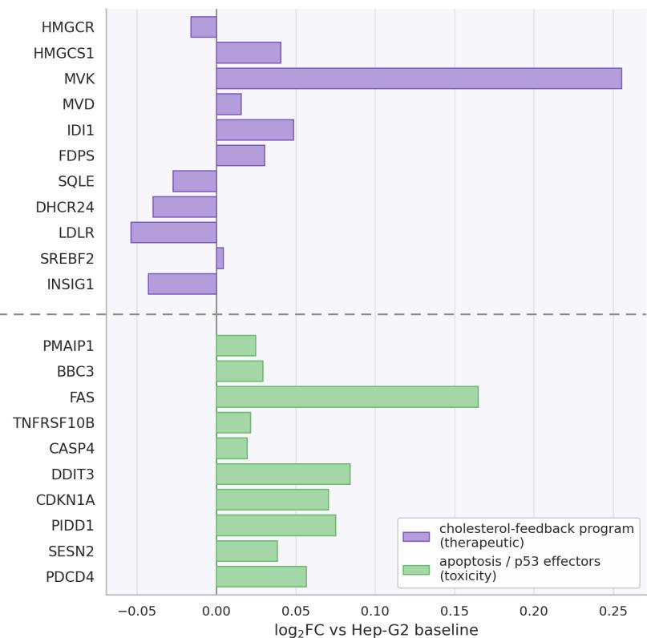  
Fig. 11. Transcriptional consequences of HMGCR perturbation. The simulated perturbed state activates two coordinated programs: the cholesterol-feedback program (the expected therapeutic response) and an apoptotic program (a toxic side effect). The bar gives each gene’s log FC versus the Hep-G2 baseline.

At the expression layer, the perturbed state exhibits two coordinated responses associated with statin biology (Fig. 11). Preranked gene-set enrichment analysis over the cell’s post-knockdown transcrip tome finds the cholesterol-biosynthesis program induced (KEGG Cholesterol metabolism, normalized enrichment score +1.51, nominal $p < 0 . 0 5 )$ . The same gene-set enrichment analysis also flags a putative side-effect: apoptotic and p53 signaling are induced (Hallmark Apoptosis NES +1.41, the only gene set to clear FDR $q < 0 . 2 5 ;$ ; KEGG p53 signaling +1.57), driven by intrinsic-apoptosis effectors such as NOXA, PUMA, FAS, and CASP4.

In reality, statins are known to cause skeletal muscle toxicity (myopathy) in some patients [33]. There are multiple proposed mechanisms for this degenerative response: mitochondrial dysfunction from coenzyme-Q10 depletion, the leading metabolic theory [34]; impaired protein prenylation [35]; atrogin-1-driven muscle atrophy [36]; and direct apoptosis of muscle cells [37, 35]. To find an appropriate biological model for this toxicity in the Hep-G2 AIDO Cell, we consider its capabilities and limitations. AIDO Cell 1.0 represents transcriptional and cellular state but not metabolites, so the coenzyme-Q10 hypothesis cannot be tested directly, and the muscle-atrophy effectors are not expressed in a hepatocyte line. Hep-G2 is also not a muscle cell line but a liver cell line, so we must frame our analysis of the Hep-G2 AIDO Cell accordingly. In this case, we read the overall apoptotic signaling as a proxy for toxicity, a readout our digital model organism supports and that serves as a general indicator of toxic side effects applicable to muscle cells as well.

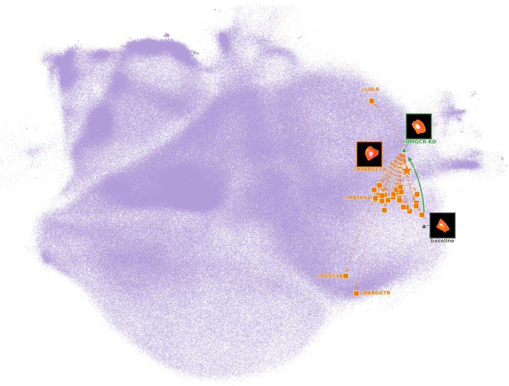  
Fig. 12. Genetic screening on Hep-G2. From the HMGCR-knockdown state we run a follow-up over-expression screen for a second intervention that relieves the apoptotic toxicity while preserving the therapeutic effect of the knockdown. Each candidate over-expression is layered on the HMGCR-knockdown state and projected onto th Hep-G2 state atlas as an orange square; the chosen rescue, HMGCR-KD + PPARGC1A-OE, is marked with a star and shown with its generated Cell Painting morphology. The candidates are scored in Fig. 13.

## 7.2.3 Workflow 3: Inverse Design Toward a Cholesterol-Lowering State Without Side Effects

In the previous section, we characterized the HMGCR-knockdown state as providing a therapeutic benefit by upregulating the SREBP-2 feedback program, but also identified an apoptotic program that drives a known muscle-toxicity side effect in the same state. In this section, we perform a combinatorial genetic screen to identify a second intervention predicted to retain the therapeutic mechanism while relieving the apoptotic toxicity. Hep-G2 is a hepatocyte line, so skeletal-muscle myopathy is not directly observable here; we use the apoptotic program in this virtual model as a proxy for the effect.

Since HMGCR remains the top target, we turn our attention toward designing a combination therapy where HMGCR knockdown induces the desired therapeutic effect and a secondary intervention mitigates the apoptotic side effect. To run this combinatorial screen, we create many virtual cell clones with the HMGCR knockdown applied. Because the Virtual Cell holds persistent state, we start from the HMGCR-knockdown state and layer a panel of candidate over-expressions on top, scoring both arms with genome-wide preranked GSEA: therapeutic retention via KEGG Cholesterol-metabolism enrich ment versus apoptosis relief via Hallmark-Apoptosis enrichment relative to the knockdown state.

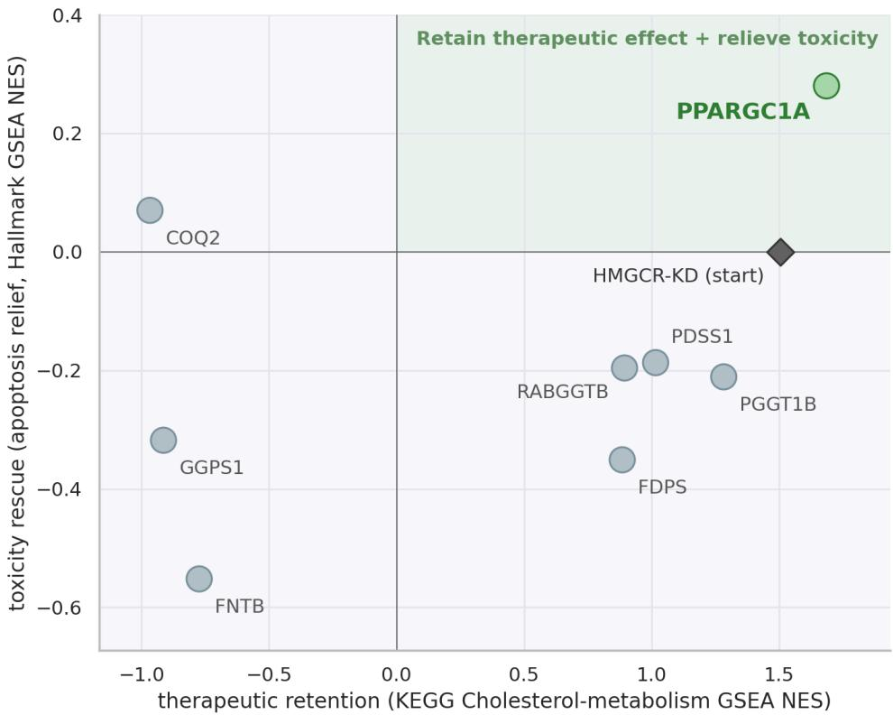

Fig. 13. Scoring the rescue screen: therapeutic retention versus toxicity rescue. Each candidate overexpression on the HMGCR-knockdown state is placed by therapeutic retention (horizontal, KEGG Cholesterolmetabolism GSEA enrichment) against toxicity rescue (vertical, the drop in Hallmark-Apoptosis GSEA enrichment relative to the knockdown). The HMGCR-knockdown starting state is shown for reference. Only PPARGC1A reaches the desirable corner, retaining a positive cholesterol enrichment while relieving apoptosis; every other candidate either loses the cholesterol enrichment or leaves the apoptotic signal engaged.  
```python
AIDO Cell Hep-G2 · Python API
# Score therapeutic and toxic effects genome-wide by GSEA
therapeutic_geneset = "KEGG Cholesterol metabolism"
toxicity_geneset = "Hallmark Apoptosis"
cell = Cell("Hep-G2")
baseline_expression = cell.get_expression()

# Create the therapeutic HMGCR knockdown (with side effects)
cell_kd = cell.clone()
cell_kd.gene_knockdown("HMGCR")
kd_expression = cell_kd.get_expression()

# Search for a follow-up overexpression with therapeutic effect and no side effect
for gene in gene_vocab:
    cell_rescue = cell_kd.clone()
    cell_rescue.gene_overexpression(gene)
    rescue_expression = cell_rescue.get_expression()
```  
Ranking the candidates separates a single clean hit from the decoys and failures (Fig. 13): over-expression of PPARGC1A (PGC-1α), the master regulator of mitochondrial biogenesis and a known protective factor against statin muscle damage [36], relieves the apoptotic program while retaining the cholesterol-

feedback signal. From the HMGCR-knockdown state, PPARGC1A over-expression de-enriches the apoptotic program, moving the Hallmark-Apoptosis signal down to non-significant (NES 1.41 versus NES 1.13), while holding the therapeutic cholesterol-metabolism enrichment at or slightly above the knockdown (NES 1.69 versus 1.51); the resulting state sits on the Hep-G2 atlas with the Cell Painting morphology of the rescued cell (Fig. 12). This is mechanistically consistent with the mitochondrial route of statin myopathy: restoring mitochondrial biogenesis counters the mitochondrial-apoptotic toxi city. The other candidates either collapse the therapeutic feedback or leave the apoptotic signal engaged. The resulting HMGCR-KD + PPARGC1A-OE state establishes a hypothetical reference point for the desired therapy: a genetic program that retains the cholesterol-feedback signal while relieving the apoptotic toxicity of the knockdown alone.

## 7.3 Drug Target Identification and Drug Screening

An important use case of AIDO Cell is virtual screening, where perturbations, state evolution, and multimodal readouts are composed into a single workflow. To compare in this setting, we use DTR-Bench [38], which measures whether the system can recover known drug–target relationships from simulated perturbation experiments. The evaluation setting is zero-shot, making this a difficult test of cross-modal consistency.

We instantiate the Hep-G2 AIDO Cell and use it for drug target identification and drug screening. For each benchmark drug, we apply cell.small molecule perturbation. For each target gene, we apply cell.gene knockdown. We then compare the resulting virtual cell states using transcriptomic and morphological readouts. Successful recovery of known drug–target relationships indicates that the platform captures meaningful biological correspondence across perturbation modalities.

The transcriptomic representation produced by AIDO Cell achieves the strongest overall performance in drug target identification, reaching a state-of-the-art AUROC of 0.608 in K-562 and a runner-up AUROC of 0.576 in Hep-G2. The full results are shown in Table 8.

Table 8. Recovering known drug-target relationships using different perturbation representations on DTR-Bench. AUROC and AUPRC are calculated using ground-truth and predicted bipartite drug-target graphs via distance thresholding on representations of gene knockouts and small molecule perturbations. All evaluations are zeroshot. One-sided paired bootstrap p-values versus the random baseline (10,000 resamples) are reported alongside each metric. AIDO Cell rows are reported for prototype Hep-G2 morphology and expression, and for K-562 expression only, since morphology is not available for the K-562 prototype. LINCS L1000 baselines use the average measured expression profiles from available cell types for each perturbation. PCA embedding applies a 50-component projection before averaging. FM applies a gene expression foundation model.

<table><tr><td></td><td>AUROC</td><td>p-value</td><td>AUPRC</td><td>p-value</td></tr><tr><td>AIDO Cell Expression (K-562)</td><td>0.608</td><td> $< 10^{-4}$ </td><td>0.015</td><td> $< 10^{-4}$ </td></tr><tr><td>AIDO Cell Expression (Hep-G2)</td><td>0.576</td><td> $< 10^{-4}$ </td><td>0.013</td><td> $< 10^{-4}$ </td></tr><tr><td>AIDO Cell Morphology (Hep-G2)</td><td>0.509</td><td>0.119</td><td>0.009</td><td>0.120</td></tr><tr><td>CellVS-Net gene networks [38]</td><td>0.540</td><td>0.001</td><td>0.012</td><td>0.003</td></tr><tr><td>SPRINT (drug-target affinity) [39]</td><td>0.445</td><td>0.993</td><td>0.008</td><td>0.874</td></tr><tr><td>LINCS L1000 observed expression</td><td>0.513</td><td>0.082</td><td>0.009</td><td>0.132</td></tr><tr><td>LINCS L1000 PCA embedding</td><td>0.521</td><td>0.033</td><td>0.010</td><td>0.065</td></tr><tr><td>LINCS L1000 FM embedding [17]</td><td>0.521</td><td>0.027</td><td>0.010</td><td>0.022</td></tr><tr><td>Random</td><td>0.489</td><td>—</td><td>0.008</td><td>—</td></tr></table>

## 8 Customizing Virtual Cells

AIDO Cell 1.0 is released with two prototype virtual cells for K-562 and Hep-G2. In practice, however, most applications involve biological contexts that differ from these example cell lines. To support more diverse cell types, the platform provides two complementary mechanisms for creating custom virtual cells: state customization (Fig. 14) and model adaptation (Fig. 15).

Customization through state initialization. The simplest approach is to instantiate a virtual cell with a customized initial state. Users may provide cell-specific attributes such as genomic variants, expression profiles, or other molecular measurements, and the system incorporates these values into the virtual cell state before simulation begins. This approach requires no retraining and immediately enables experimentation in biological contexts that are sufficiently similar to existing virtual cell programs. In practice, state initialization is most useful when adapting a base virtual cell to a related cell line, disease state, or experimental condition.

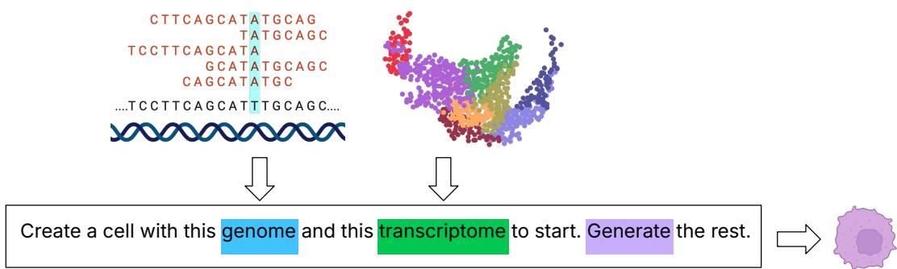  
Fig. 14. Customization through state initialization. A virtual cell can be specialized to a new biological context by modifying its initial state, such as cell-type attributes, genomic variants, expression profiles, or other molecular measurements. The customized state serves as the starting point for subsequent simulation while preserving the same Virtual Cell interface, state schema, and operations.

Customization through model adaptation. For biological contexts that differ substantially from existing virtual cell programs, state override may be insufficient. In these cases, the simulation engine and biological priors must be adapted using additional experimental data. AIDO Cell supports this process through AIDO Foundry, an agentic optimization framework that automates model adaptation and evaluation [20]. Rather than requiring users to manually select models or training procedures, AIDO Foundry uses available data to iteratively align the virtual cell’s weights and biological priors with the target biological context while preserving compatibility with the harness interface.

To demonstrate, we evaluate whether AIDO Foundry can be used to improve performance on unseen cell lines as more training data becomes available (Fig. 16). In this experiment we provide a filtered version of the Tahoe-100M dataset to AIDO Foundry while holding out Hep-G2 as a testing cell line [40]. After using AIDO Foundry to update the biological priors and weights of AIDO Cell, we evaluate its ability to predict the transcriptomic effect of a previously-seen drug in the unseen Hep-G2 cell line. Notably customizing AIDO Cell requires only the relevant subset of inputs and readouts, not the entire breadth of modalities. As the number of distinct training cell lines increases from 5 to 20, differentialexpression classification on the held-out Hep-G2 cell line improves. AUPRC for differentially expressed gene classification improves with just a few cell lines, while overall expression reconstruction continues to improve over many cell lines in terms of perturbation-weighted MSE (WMSE). While confidence intervals are large, and this demonstration takes place on a limited number of training cell lines, this early evidence hints at how AIDO Cell can benefit from additional training data even without perturbation measurements from the target cell line.

Adaptation can be driven by a wide range of data modalities, including genetic perturbations, smallmolecule perturbations, transcriptomics, protein abundance, localization measurements, and imaging assays. The customized virtual cell exposes the same state, operations, and workflows described throughout this release, allowing new biological contexts to be incorporated without changing the client. To gether, state override and AIDO Foundry enable AIDO Cell to support rapid customization and the creation of entirely new virtual cell programs as biological data become available.

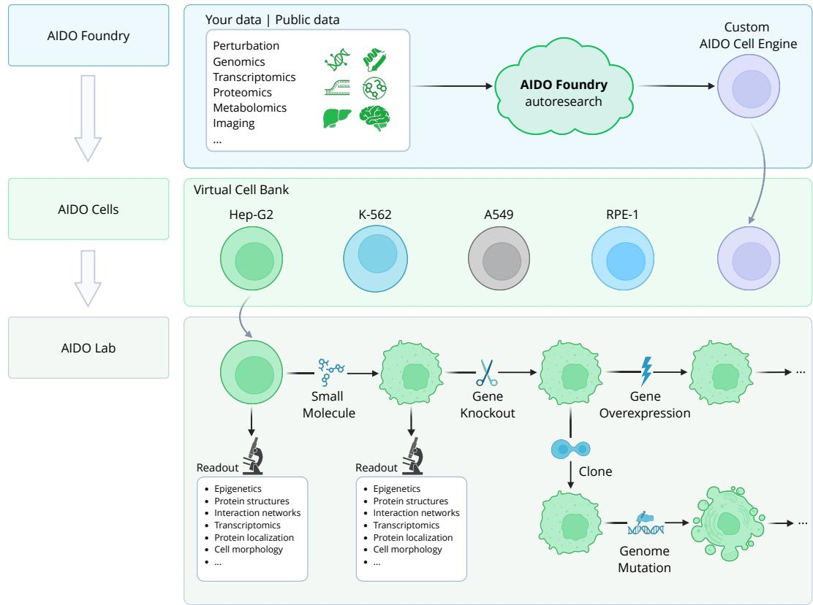

Fig. 15. Customizing AIDO Cell with AIDO Foundry. AIDO Foundry adapts AIDO Cell to new biological contexts with user data or public data. The Foundry produces custom AIDO Cell instances, which are then uploaded to the virtual cell bank. Cell engines can be pulled from the cell bank into AIDO Lab, where simulation can be run on the customized AIDO Cell instance.  
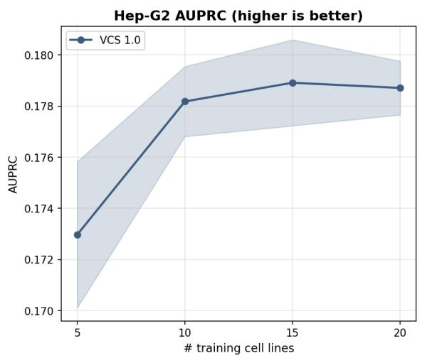

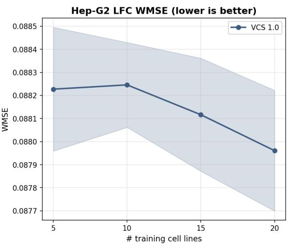  
Fig. 16. Perturbation prediction performance on held-out Hep-G2 with increasing numbers of training cell lines. Predictions are made on observed drugs in the held-out Hep-G2 cell line. AIDO Cell is updated with progressively larger subsets of the remaining cell lines (5, 10, 15, and 20, counting training and validation cell lines) and evaluated on the held-out Hep-G2 cell line. Left: differential-expression classification, measured by sample-averaged AUPRC (higher is better). Right: log-fold-change regression, measured by WMSE (lower is better). We perform five independent runs where training and validation cell lines are sampled randomly. Solid lines show the mean and shaded bands show the standard deviation across re-runs with random cell-line draws.

## 9 Conclusion and Outlook

Rational engineering of biological systems has been a long-standing goal in medicine and biotechnology, but biological simulators are needed to support iterative engineering design. Simulating a biological experiment requires a system that holds a cellular state that persists across manipulations, accepts perturbations that modify it, and renders it into multimodal observations on demand. Until now, biology has had no such simulation framework. To address this, we developed AIDO Cell, a general-purpose simulator for cell biology.

AIDO Cell is built on a world model that evolves cell state in response to user-specified perturbations and decodes this state into experimental readouts, and a software harness that maintains a persistent, multiscale cell state over the course of an experiment. Together, these enable coherent multimodal read outs, sequential experimentation, and in-context molecular design from a single shared representation. We validate AIDO Cell through a combination of benchmarks and case studies. Virtual Cell Benchmark 1.0 assesses both the breadth and depth of AIDO Cell’s capabilities, demonstrating state-of-the-art performance across 24 of 31 metrics spanning five task families, with AIDO Cell being the only method to cover all five families. End-to-end case studies on prototype K-562 and Hep-G2 virtual cells further validate the system on stateful, multistep workflows including drug resistance and rescue, functional analog design, and combinatorial genetic screening.

Looking forward, several directions are promising for advancing biological simulation. First, the simulation scope of AIDO Cell can be expanded to capture additional layers of biological regulation and dynamics. Current representations can be extended to include protein post-translational modifications, degradation and turnover processes, as well as more detailed modeling of signaling cascades, metabolic products and byproducts, and temporal dynamics. Incorporating these mechanisms will be critical for improving fidelity, particularly in contexts where protein-level regulation and non-transcriptional processes dominate cellular behavior.

Second, new interfaces are needed to make multiscale cellular models interpretable and interactive. One promising direction is the development of “biological maps” analogous to geographic information systems, where users can navigate across scales, from molecular structures and interactions to pathways, cellular states and phenotypic outcomes, within a unified visual and computational environment. Such a multiscale, map-like interface would allow users to dynamically query, simulate, and visualize how perturbations propagate across layers, transforming AIDO Cell into an interactive exploratory system.

Third, AIDO Cell can be embedded within broader computational systems through agent-based and workflow-driven integrations. By exposing its capabilities as programmatic interfaces, AIDO Cell can serve as both a queryable knowledge system and an executable simulation engine within larger bioinformatics pipelines. Coupling with autonomous agents would further enable iterative hypothesis generation, experimental planning, and closed-loop optimization, linking upstream data acquisition with downstream design and validation processes.

These directions together point toward a future in which virtual cells are not standalone models, but the basis for an interconnected computational infrastructure for biology. As predictive accuracy improves and system integration deepens, we envision a shift from fragmented, sequential workflows across wet and dry labs to fully computational experimentation and design in AI-Driven Digital Organisms (AI-DOs), followed by wet lab verification. The long-standing goal of rational, scalable engineering of biological systems requires accurate simulators that can be programmed, observed, replayed, and de bugged. AIDO Cell is the first step in realizing this vision at human scale.

## B Details on Virtual Cell Benchmark 1.0

## B.1 Small Molecule Perturbation Prediction

We evaluate small molecule perturbation prediction on a processed benchmark derived from Tahoe-100M (https://huggingface.co/datasets/tahoebio/Tahoe-100M), a genome-wide single-cell perturbation atlas measuring transcriptional responses to small molecules across cancer cell lines. For each perturbation, the single-cell expression profiles of treated cells are compared with matched vehicle (DMSO) controls to identify differentially expressed genes. Each protein-coding gene is assigned a ternary response label: up-regulated (+1), unchanged (0), or down-regulated (−1). For Tahoe-100M, we use the same DEG calling procedure as [41]. This yields a per-perturbation label vector over 19,937 protein-coding genes and casts the directional component of perturbation prediction as a per-gene classification task. By abstracting continuous expression changes into directional response states, this formulation emphasizes the recovery of transcriptional response direction rather than assaydependent differences in expression scale or normalization. The processed benchmark data are available from the GenBio AI perturbation benchmark repository (gs://bucket-engineering-b062/data/ leaderboard/small molecule perturbation/).

To assess out-of-distribution generalization, the data is partitioned along two orthogonal axes: cellular context and chemical structure. Note that these are different from the splits used in [41], which only hold out compounds. After filtering, cell lines are divided into seen and held-out sets, comprising 42 training cell lines and 3 held-out cell lines. Compounds are partitioned according to the Tanimoto similarity of their Morgan/ECFP fingerprints, with 301 compounds used for training and 75 structurally dissimilar compounds held out for testing. This split discourages near-duplicate chemical leakage and ensures that unseen-drug evaluation probes extrapolation to novel chemical space. Models are trained and validated on the seen-cell/seen-drug subset and evaluated under three held-out regimes of increasing difficulty: (i) seen cell line, unseen drug; (ii) unseen cell line, seen drug; and (iii) unseen cell line, unseen drug. These regimes separately quantify generalization to novel chemistry, to novel cellular context, and to both simultaneously.

Each held-out perturbation is scored on two complementary axes: the direction of the transcriptional response, via the ternary DEG labels defined above, and its magnitude, via the per-gene log-fold-change (LFC) over the G = 19,937 protein-coding genes. We report a classification metric (AUPRC) for the former and a regression metric (WMSE) for the latter.

Direction (AUPRC). Prediction is evaluated as a retrieval problem: genes are ranked by the predicted per-gene class scores, and the area under the precision–recall curve is computed separately for the upand down-regulated gene sets against the ternary ground-truth labels. For a perturbation with labels $y _ { g } \in \{ - 1 , 0 , + 1 \}$ } and predicted class probabilities $\hat { p } _ { g } ^ { ( c ) }$ , the average precision for direction $c \in \{ \uparrow , \downarrow \}$ } is

$$
\mathrm{AP} ^ {(c)} = \sum_ {n} \left(R _ {n} - R _ {n - 1}\right) P _ {n},
$$

where $P _ { n }$ and $R _ { n }$ are the precision and recall at the n-th threshold obtained by ranking genes by $\hat { p } _ { g } ^ { ( c ) }$ against the binary target $\mathbf { 1 } [ y _ { g } = c ]$ . The two class-specific scores are averaged per perturbation and then macro-averaged over the K perturbations in each regime,

$$
\mathrm{AUPRC} = \frac {1}{K} \sum_ {k = 1} ^ {K} \frac {1}{2} \left(\mathrm{AP} _ {k} ^ {(\uparrow)} + \mathrm{AP} _ {k} ^ {(\downarrow)}\right).
$$

This rewards accurate prioritization of both up- and down-regulated genes while remaining insensitive to the large background of unchanged genes, providing a robust metric for this highly class-imbalanced perturbation-prediction problem.

Magnitude (WMSE). The predicted LFC is scored by the weighted mean squared error (WMSE) of [42], which up-weights each perturbation’s differentially expressed genes so that the score is not dominated by the many unresponsive genes. Let $\ell _ { k , g }$ and $\widehat { \ell } _ { k , g }$ be the true and predicted LFC of gene g under perturbation k, and $\begin{array} { r } { \mu _ { g } = \frac { 1 } { K } \sum _ { k } \ell _ { k , g } } \end{array}$ the gene-wise mean LFC over the evaluation split (the “vs-rest” reference). With $\delta _ { k , g } = \ell _ { k , g } - \mu _ { g }$ , the per-gene weights are obtained by min–max normalizing $| \delta _ { k , g } |$ across genes to [0,1], squaring, and renormalizing to sum to one,

$$
\tilde {s} _ {k, g} = \frac {| \delta_ {k , g} | - \min _ {g ^ {\prime}} | \delta_ {k , g ^ {\prime}} |}{\max _ {g ^ {\prime}} | \delta_ {k , g ^ {\prime}} | - \min _ {g ^ {\prime}} | \delta_ {k , g ^ {\prime}} |}, \qquad w _ {k, g} = \frac {\tilde {s} _ {k , g} ^ {2}}{\sum_ {g ^ {\prime}} \tilde {s} _ {k , g ^ {\prime}} ^ {2}},
$$

and the reported value is the mean per-perturbation weighted error (lower is better),

$$
\mathrm{WMSE} = \frac {1}{K} \sum_ {k = 1} ^ {K} \sum_ {g = 1} ^ {G} w _ {k, g} \left(\ell_ {k, g} - \hat {\ell} _ {k, g}\right) ^ {2}.
$$

These weights are a pseudobulk proxy for the t-score-vs-rest weighting of [42], using the magnitude of the LFC relative to the split mean in place of per-gene t-statistics.

To enable a fair comparison across different baseline methods, we evaluate all baselines under an identi cal architecture. For each method, compound embeddings are generated using the corresponding molecular encoder. These drug embeddings are concatenated with control expression profiles of the target cell line, allowing predictions to condition on cellular context and to generalize to held-out cell lines. The concatenated representations are then passed to a three-layer MLP, which is identical to the decoder in our model, to generate per-gene response predictions. Therefore, baselines differ only in their compound embeddings, ensuring the performance differences reflect the quality of the learned molecular embeddings rather than differences in the downstream decoder. The Train Mean baseline is a leakagefree reference that, for each held-out perturbation, predicts the average training-set LFC profile along whichever axis is observed in that regime: the mean over training compounds applied to the same (seen) cell line when the drug is novel (seen-cell/unseen-drug regime), and the mean over training cell lines for the same (seen) compound when the cell line is novel (unseen-cell/seen-drug regime).

## B.2 Gene Knockout Prediction

We use the Essential benchmark defined in [41], which is based on two Perturb-seq datasets [43, 44]. The dataset profiles CRISPR-interference (CRISPRi) knockdown of over 2,000 essential genes in each of four cell lines—Hep-G2, Jurkat, and hTERT-RPE1 (2,387 perturbations each) and K-562 (2,054 perturbations)—across 964,451 single cells. Raw counts are normalized to $1 0 ^ { 4 }$ per cell and log(1+x)- transformed. For each perturbation the transcriptional response is summarized over a shared panel of 6,640 target genes, and every perturbation is cast simultaneously as a regression and a classification problem. The processed benchmark data are available from the GenBio AI perturbation benchmark repository (gs://bucket-engineering-b062/data/leaderboard/knockout/).

For the regression task, the ground-truth target $\Delta _ { k } \in \mathbb { R } ^ { G } \left( G = 6 , 6 4 0 \right)$ is the per-gene log-fold-change of the perturbed cells relative to control cells, and a model predicts $\hat { \Delta } _ { k }$ . Accuracy is the weighted mean squared error (WMSE) of [42], computed exactly as in the Small Molecule Perturbation Prediction setting above—with $\Delta _ { k }$ as the LFC target and the gene-wise reference mean µ taken over the evaluation split—so that the per-gene weights $w _ { k , g }$ emphasize the differentially expressed genes,

$$
\mathrm{WMSE} = \frac {1}{K} \sum_ {k = 1} ^ {K} \sum_ {g = 1} ^ {G} w _ {k, g} \left(\hat {\Delta} _ {k, g} - \Delta_ {k, g}\right) ^ {2},
$$

where K is the number of test perturbations; lower is better.

For the classification task, each target gene is assigned a ternary differential-expression label—downregulated (−1), unchanged (0), or up-regulated (+1)—from a per-gene Student’s t-test between all perturbed and all control cells with Benjamini–Hochberg correction. Predictions are scored by the area under the precision–recall curve (AUPRC), computed exactly as in the Small Molecule Perturbation Prediction setting above: the up- and down-regulated AUPRC are averaged per perturbation and then macro-averaged over perturbations. Both metrics are reported per cell line and averaged over a 5-fold cross-validation split of the perturbations; the values in Table 6 are the resulting five-fold means.

To isolate the contribution of each representation, all baselines share an identical protocol and differ only in the per-gene embedding of the perturbed gene, taken from its respective encoder: DNA (AIDO.DNA), protein (ESM2, AIDO.ProteinRAG-16B), single-cell expression (scGPT, Geneformer, scPRINT, TranscriptFormer, GB.Cell), and prior-knowledge (GNN Simple, GenePT, STRING WaveGC, GenotypeVAE) models. A lightweight estimator, fit independently for each cell line and each task, maps this embedding to the two prediction vectors—multi-output logistic regression for classification and k-nearest-neighbors or Lasso regression for regression (each with feature standardization and a 100- dimensional PCA)—with genes lacking an embedding filled by a most-frequent-class or context-mean fallback. In contrast, AIDO Cell 1.0 is a single model trained jointly across all four cell lines and on both the classification and regression tasks simultaneously, conditioning on the target cell line rather than fitting a separate model per cell line; the same model therefore produces every entry of both the WMSE and AUPRC columns. All methods, including AIDO Cell 1.0, are scored with the same evaluation pipeline. The Train Mean baseline is a leakage-free, cell-line-specific reference: for each of the four cell lines it predicts a single constant profile—the average per-gene response over that cell line’s training perturbations—applied identically to every held-out perturbation of the same cell line. This constant is the mean training log-fold-change vector for the regression (WMSE) column and the mean per-gene DEG class distribution for the classification (AUPRC) column, so the four cell lines use four independently computed training means.

## B.3 Structure Prediction

To rigorously evaluate the multimodal structural modeling capabilities of AIDO Cell, we adopt Fold-Bench<sup>1</sup>, a comprehensive and diverse benchmark dataset spanning multiple biomolecular modalities. As summarized in Table 9, the evaluation encompasses a total of 1,823 structural targets, which are categorized into two primary paradigms based on their structural complexity:

• Interactomes (or Multimers): This category assesses the model’s ability to predict quaternary structures and intermolecular interactions across six distinct categories (Antibody-Antigen, Protein-Ligand, Protein-Protein, Protein-Peptide, Protein-DNA, and Protein-RNA).

– For macromolecular interfaces (protein-protein/peptide/nucleic acid and antibody-antigen), we report the Success Rate (%), defined as the percentage of predicted structures achieving an acceptable or higher quality interface accuracy, corresponding to a DockQ score ≥ 0.23 based on standard CAPRI criteria.

– For small-molecule interactions (Protein-Ligand), relying on a single metric often introduces biases. Hence, we employ a stringent joint success criterion: a prediction is considered successful only if it satisfies both a global positioning threshold (LRMSD < 2 A<sup>˚</sup> ) and a local chemical environment preservation threshold (LDDT-PLI > 0.8).

• Monomers: This category validates single-chain structural fidelity for Protein, DNA, and RNA molecules. To mitigate the impact of flexible domain rigid-body shifts, we employ the Local Distance Difference Test (LDDT) score as the core metric, which directly reflects the local structural accuracy of the backbone and side-chains independent of global superposition.

Table 9. Structure prediction evaluation scope and metric definitions.

<table><tr><td>Type</td><td>Dataset</td><td>Number of samples</td><td>Metric definition</td></tr><tr><td rowspan="6">Complex</td><td>Antibody-Antigen</td><td>172</td><td>DockQ success, DockQ ≥ 0.23</td></tr><tr><td>Protein-Ligand</td><td>558</td><td>Success rate, LRMSD &lt; 2 Å and LDDT-PLI &gt; 0.8</td></tr><tr><td>Protein-Protein</td><td>279</td><td>DockQ success, DockQ ≥ 0.23</td></tr><tr><td>Protein-Peptide</td><td>51</td><td>DockQ success, DockQ ≥ 0.23</td></tr><tr><td>Protein-DNA</td><td>330</td><td>DockQ success, DockQ ≥ 0.23</td></tr><tr><td>Protein-RNA</td><td>70</td><td>DockQ success, DockQ ≥ 0.23</td></tr><tr><td rowspan="3">Monomer</td><td>Monomer Protein</td><td>334</td><td>LDDT</td></tr><tr><td>Monomer DNA</td><td>14</td><td>LDDT</td></tr><tr><td>Monomer RNA</td><td>15</td><td>LDDT</td></tr></table>

## B.4 Genome Function Prediction

AIDO Cell 1.0 predicts functional genomic tracks from DNA sequence. To assess its accuracy against a strong external reference, we benchmark it against AlphaGenome [13], a state-of-the-art sequenceto-function model, on AlphaGenome’s own public benchmark. The evaluation uses the test intervals defined by the Borzoi study [12] that correspond to AlphaGenome FOLD 1 — the human Borzoi fold-3 subset, 1,576 intervals, each scored over its central 196,608 bp.

Table 10. AlphaGenome benchmark results on human Borzoi fold 3 (1,576 intervals, central 196,608 bp). All metrics are average Pearson correlation over samples and label tracks. Following the original AlphaGenom evaluation, CAGE, RNA-seq, PRO-cap, ChIP-hist. and ChIP-TF counts are log(1+x)-transformed, while splice usage, ATAC and DNase are evaluated on raw counts (x). For reference we also quote AlphaGenome’s published fold-4 results, read from the violin plot in main Figure 2c of [13].

<table><tr><td></td><td>Splice usage</td><td>CAGE</td><td>RNA-seq</td><td>ATAC</td><td>DNase</td><td>PRO-cap</td><td>ChIP-hist.</td><td>ChIP-TF</td></tr><tr><td>AIDO Cell 1.0 (fold 3)</td><td>0.89</td><td>0.45</td><td>0.79</td><td>0.67</td><td>0.68</td><td>0.59</td><td>0.57</td><td>0.52</td></tr><tr><td>AlphaGenome (fold 3)</td><td>0.89</td><td>0.45</td><td>0.80</td><td>0.69</td><td>0.69</td><td>0.60</td><td>0.57</td><td>0.50</td></tr><tr><td>AlphaGenome (fold 4, published)</td><td>0.86</td><td>0.46</td><td>0.81</td><td>0.70</td><td>0.67</td><td>0.60</td><td>0.59</td><td>0.52</td></tr></table>

AlphaGenome fold 3 vs. fold 4. We report AlphaGenome twice. The first AlphaGenome row (fold 3) is our own evaluation of the released AlphaGenome model: it is scored on the same intervals, against the same labels, with the same transforms and the same metrics as AIDO Cell 1.0, and is therefore directly comparable. The second row shows the published AlphaGenome results, computed on Borzoi fold 4 — AlphaGenome’s FOLD-1 test split, which we hold out for validation. We made this split decision before the release of the AlphaGenome report, leading to the inconsistency. AlphaGenome’s authors have confirmed that no hyperparameter tuning was performed on that fold,<sup>2</sup> so evaluating AlphaGenome here does not overestimate its performance. We report AlphaGenome’s FOLD-1 test split here as well (fold 4, published) for reference.

Labels and provenance. Every score in this section is computed against AlphaGenome’s own released labels, for both models, used as released. The labels were obtained from AlphaGenome’s public release at gs://alphagenome-datasets/v1/train/, distributed as GZIP-compressed TFRecords with one bundle per assay. Our processing consisted of: selecting the windows corresponding to the Bor zoi fold-3 interval list, matching each to our own window by shared genomic center (AlphaGenome’s windows span 1,052,672 bp against our 1,048,576 bp); stripping the padding columns of each bundle using AlphaGenome’s own released column masks; widening the stored bfloat16/float16 values to float32, which is exact; concatenating the bundles into a single track axis in a fixed order; and converting the dense tensors to a sparse (non-zero index and value) representation, which is lossless as no threshold or rounding is applied. The full 1,052,672 bp window is retained, and the 128 bp ChIP-seq bundles are kept dense. AlphaGenome’s splice-site class annotation is not part of the coverage bundles and was retrieved separately from the same release.

AlphaGenome’s predictions. The AlphaGenome predictions scored here were obtained by querying the released AlphaGenome model through its public API, one call per test interval at the full 1,048,576 bp input context, and caching the returned tracks. We request model version FOLD 1 explicitly, which is the version that holds out these intervals; predictions are returned in AlphaGenome’s own output frame and are cropped centrally to the scored 196,608 bp window at evaluation time. No post-processing is applied to them beyond that crop.

RNA-seq and GTEx. AlphaGenome did not release its processed GTEx-derived RNA-seq labels. RNA-seq is therefore scored on the 613 ENCODE-derived tracks present in AlphaGenome’s released label set; the 54 GTEx-derived tracks of our own track layout are excluded from the RNA-seq score for both models.

Metrics. Scores are Pearson correlations computed per track and then averaged over the tracks of a category, following the original AlphaGenome report. Also following this report, we evaluate the log(1 +x) transformed counts for CAGE, RNA-seq, PRO-cap, ChIP-hist., and ChIP-TF, and raw counts for splice usage, ATAC, and DNase. The per-readout spaces, and AlphaGenome’s published values alongside ours, are collected in Table 10.

Splice-site coordinate convention. Our splice annotations follow the STAR convention, in which a splice site is identified with the intron’s terminal base. AlphaGenome instead places its splice-site-usage output on the flanking exonic bases — the donor one base upstream and the acceptor one base downstream of the corresponding STAR position. When scoring AIDO Cell 1.0 against AlphaGenome’s labels we therefore realign those labels onto the STAR positions before comparing; the value is moved, not copied, and only coordinates are affected. AlphaGenome’s own predictions are already in the frame of its labels and are scored with no shift of any kind. The donor/acceptor identity needed for the realignment is taken from AlphaGenome’s splice-site annotation, so that every annotated site is aligned.

Splice-site usage. Splice-site usage is a per-track usage fraction defined at splice sites rather than genome-wide. Each track’s vector is restricted to the positions that AlphaGenome’s splice-site annotation marks as a splice site — any of its four donor/acceptor classes — so that a site that is annotated but unused in a given tissue enters the correlation as an observed zero rather than being dropped.

## References

[1] M. Tomita, K. Hashimoto, K. Takahashi, T. S. Shimizu, Y. Matsuzaki, F. Miyoshi, K. Saito, S. Tanida, K. Yugi, J. C. Venter, and C. A. Hutchison. E-CELL: software environment for wholecell simulation. 15(1):72–84.

[2] L. M. Loew and J. C. Schaff. The virtual cell: a software environment for computational cell biology. 19(10):401–406.

[3] Jonathan R. Karr, Jayodita C. Sanghvi, Derek N. Macklin, Miriam V. Gutschow, Jared M. Jacobs, Benjamin Bolival, Nacyra Assad-Garcia, John I. Glass, and Markus W. Covert. A whole-cell computational model predicts phenotype from genotype. 150(2):389–401.

[4] Derek N. Macklin, Travis A. Ahn-Horst, Heejo Choi, Nicholas A. Ruggero, Javier Carrera, John C. Mason, Gwanggyu Sun, Eran Agmon, Mialy M. DeFelice, Inbal Maayan, Keara Lane, Ryan K. Spangler, Taryn E. Gillies, Morgan L. Paull, Sajia Akhter, Samuel R. Bray, Daniel S. Weaver, Ingrid M. Keseler, Peter D. Karp, Jerry H. Morrison, and Markus W. Covert. Simultaneous crossevaluation of heterogeneous e. coli datasets via mechanistic simulation. 369(6502):eaav3751.

[5] Zane R. Thornburg, Andrew Maytin, Jiwoong Kwon, Troy A. Brier, Benjamin R. Gilbert, Enguang Fu, Yang-Le Gao, Jordan Quenneville, Tianyu Wu, Henry Li, Talia Long, Weria Pezeshkian, Lijie Sun, Daniela Matias de C. Bittencourt, John I. Glass, Angad P. Mehta, Taekjip Ha, and Zaida Luthey-Schulten. Bringing the genetically minimal cell to life on a computer in 4d. 189(9):2582– 2597.e27.

[6] Charlotte Bunne, Yusuf Roohani, Yanay Rosen, Ankit Gupta, Xikun Zhang, Marcel Roed, Theo Alexandrov, Mohammed AlQuraishi, Patricia Brennan, Daniel B. Burkhardt, Andrea Califano, Jonah Cool, Abby F. Dernburg, Kirsty Ewing, Emily B. Fox, Matthias Haury, Amy E. Herr, Eric Horvitz, Patrick D. Hsu, Viren Jain, Gregory R. Johnson, Thomas Kalil, David R. Kelley, Shana O. Kelley, Anna Kreshuk, Tim Mitchison, Stephani Otte, Jay Shendure, Nicholas J. Sofroniew, Fabian Theis, Christina V. Theodoris, Srigokul Upadhyayula, Marc Valer, Bo Wang, Eric Xing, Serena Yeung-Levy, Marinka Zitnik, Theofanis Karaletsos, Aviv Regev, Emma Lundberg, Jure Leskovec, and Stephen R. Quake. How to build the virtual cell with artificial intelligence: Priorities and opportunities. 187(25):7045–7063.

[7] John Jumper, Richard Evans, Alexander Pritzel, Tim Green, Michael Figurnov, Olaf Ronneberger, Kathryn Tunyasuvunakool, Russ Bates, Augustin Z<sup>ˇ</sup>´ıdek, Anna Potapenko, Alex Bridgland, Clemens Meyer, Simon A. A. Kohl, Andrew J. Ballard, Andrew Cowie, Bernardino Romera-Paredes, Stanislav Nikolov, Rishub Jain, Jonas Adler, Trevor Back, Stig Petersen, David Reiman, Ellen Clancy, Michal Zielinski, Martin Steinegger, Michalina Pacholska, Tamas Berghammer, Sebastian Bodenstein, David Silver, Oriol Vinyals, Andrew W. Senior, Koray Kavukcuoglu, Pushmeet Kohli, and Demis Hassabis. Highly accurate protein structure prediction with AlphaFold. 596(7873):583–589. Number: 7873.

[8] Josh Abramson, Jonas Adler, Jack Dunger, Richard Evans, Tim Green, Alexander Pritzel, Olaf Ronneberger, Lindsay Willmore, Andrew J. Ballard, Joshua Bambrick, Sebastian W. Bodenstein, David A. Evans, Chia-Chun Hung, Michael O’Neill, David Reiman, Kathryn Tunyasuvunakool, Zachary Wu, Akvile˙ Zemgulyt<sup>ˇ</sup> e, Eirini Arvaniti, Charles Beattie, Ottavia Bertolli, Alex Bridgland,˙ Alexey Cherepanov, Miles Congreve, Alexander I. Cowen-Rivers, Andrew Cowie, Michael Figurnov, Fabian B. Fuchs, Hannah Gladman, Rishub Jain, Yousuf A. Khan, Caroline M. R. Low, Kuba Perlin, Anna Potapenko, Pascal Savy, Sukhdeep Singh, Adrian Stecula, Ashok Thillaisundaram, Catherine Tong, Sergei Yakneen, Ellen D. Zhong, Michal Zielinski, Augustin Z<sup>ˇ</sup> ´ıdek, Victor Bapst, Pushmeet Kohli, Max Jaderberg, Demis Hassabis, and John M. Jumper. Accurate structure prediction of biomolecular interactions with AlphaFold 3. 630(8016):493–500.

[9] Saro Passaro, Gabriele Corso, Jeremy Wohlwend, Mateo Reveiz, Stephan Thaler, Vignesh Ram Somnath, Noah Getz, Tally Portnoi, Julien Roy, Hannes Stark, David Kwabi-Addo, Dominique Beaini, Tommi Jaakkola, and Regina Barzilay. Boltz-2: Towards accurate and efficient binding affinity prediction. Pages: 2025.06.14.659707 Section: New Results.

[10] Zeming Lin, Halil Akin, Roshan Rao, Brian Hie, Zhongkai Zhu, Wenting Lu, Nikita Smetanin, Robert Verkuil, Ori Kabeli, Yaniv Shmueli, Allan dos Santos Costa, Maryam Fazel-Zarandi, Tom Sercu, Salvatore Candido, and Alexander Rives. Evolutionary-scale prediction of atomic-level protein structure with a language model. 379(6637):1123–1130.

[11] Ziga Avsec, Vikram Agarwal, Daniel Visentin, Joseph R. Ledsam, Agnieszka Grabska-Barwinska,<sup>ˇ</sup> Kyle R. Taylor, Yannis Assael, John Jumper, Pushmeet Kohli, and David R. Kelley. Effective gene expression prediction from sequence by integrating long-range interactions. 18(10):1196–1203. Number: 10.

[12] Johannes Linder, Divyanshi Srivastava, Han Yuan, Vikram Agarwal, and David R. Kelley. Predicting RNA-seq coverage from DNA sequence as a unifying model of gene regulation. pages 1–13.

[13] Ziga Avsec, Natasha Latysheva, Jun Cheng, Guido Novati, Kyle R. Taylor, Tom Ward, Clare By-<sup>ˇ</sup> croft, Lauren Nicolaisen, Eirini Arvaniti, Joshua Pan, Raina Thomas, Vincent Dutordoir, Matteo Perino, Soham De, Alexander Karollus, Adam Gayoso, Toby Sargeant, Anne Mottram, Lai Hong Wong, Pavol Drotar, Adam Kosiorek, Andrew Senior, Richard Tanburn, Taylor Applebaum,´ Souradeep Basu, Demis Hassabis, and Pushmeet Kohli. Advancing regulatory variant effect prediction with AlphaGenome. 649(8099):1206–1218.

[14] Jun Cheng, Guido Novati, Joshua Pan, Clare Bycroft, Akvile˙ Zemgulyt<sup>ˇ</sup> e, Taylor Applebaum,˙ Alexander Pritzel, Lai Hong Wong, Michal Zielinski, Tobias Sargeant, Rosalia G. Schneider, Andrew W. Senior, John Jumper, Demis Hassabis, Pushmeet Kohli, and Ziga Avsec. Accurate<sup>ˇ</sup> proteome-wide missense variant effect prediction with AlphaMissense. 381(6664):eadg7492.

[15] Haotian Cui, Chloe Wang, Hassaan Maan, Kuan Pang, Fengning Luo, Nan Duan, and Bo Wang. scGPT: toward building a foundation model for single-cell multi-omics using generative AI. 21(8):1470–1480.

[16] Christina V. Theodoris, Ling Xiao, Anant Chopra, Mark D. Chaffin, Zeina R. Al Sayed, Matthew C. Hill, Helene Mantineo, Elizabeth M. Brydon, Zexian Zeng, X. Shirley Liu, and Patrick T. Ellinor. Transfer learning enables predictions in network biology. 618(7965):616–624.

[17] Nicholas Ho, Caleb N. Ellington, Jinyu Hou, Sohan Addagudi, Shentong Mo, Tianhua Tao, Dian Li, Yonghao Zhuang, Hongyi Wang, Xingyi Cheng, Le Song, and Eric P. Xing. Scaling dense representations for single cell with transcriptome-scale context. Pages: 2024.11.28.625303 Section: New Results.

[18] Yusuf Roohani, Kexin Huang, and Jure Leskovec. GEARS: Predicting transcriptional outcomes of novel multi-gene perturbations. Pages: 2022.07.12.499735 Section: New Results.

[19] Abhinav K. Adduri, Dhruv Gautam, Beatrice Bevilacqua, Alishba Imran, Rohan Shah, Mohsen Naghipourfar, Noam Teyssier, Rajesh Ilango, Sanjay Nagaraj, Mingze Dong, Chiara Ricci-Tam, Christopher Carpenter, Vishvak Subramanyam, Aidan Winters, Sravya Tirukkovular, Jeremy Sullivan, Brian S. Plosky, Basak Eraslan, Nicholas D. Youngblut, Jure Leskovec, Luke A. Gilbert, Sil vana Konermann, Patrick D. Hsu, Alexander Dobin, Dave P. Burke, Hani Goodarzi, and Yusuf H. Roohani. Predicting cellular responses to perturbation across diverse contexts with state. ISSN: 2692-8205 Pages: 2025.06.26.661135 Section: New Results.

[20] Xingyi Cheng, Pan Li, Han Guo, Youwei Liang, Jing Gong, William de Vazelhes, Changjiang Gou, Pengtao Xie, Le Song, and Eric Xing. Harnessing AI to build virtual cells, 2026. ISSN: 2692-8205 Pages: 2026.04.11.717183 Section: New Results.

[21] Leif C. Andersson, Kenneth Nilsson, and Carl G. Gahmberg. K562—a human erythroleukemic cell line. 23(2):143–147. eprint: https://onlinelibrary.wiley.com/doi/pdf/10.1002/ijc.2910230202.

[22] David P. Aden, Alice Fogel, Stanley Plotkin, Ivan Damjanov, and Barbara B. Knowles. Controlled synthesis of HBsAg in a differentiated human liver carcinoma-derived cell line. 282(5739):615– 616.

[23] T. R. Rutherford, J. B. Clegg, and D. J. Weatherall. K562 human leukaemic cells synthesise embryonic haemoglobin in response to haemin. 280(5718):164–165.

[24] Leif C. Andersson, Mikko Jokinen, and Carl G. Gahmberg. Induction of erythroid differentiation in the human leukaemia cell line k562. 278(5702):364–365.

[25] T Rutherford, J B Clegg, D R Higgs, R W Jones, J Thompson, and D J Weatherall. Embryonic erythroid differentiation in the human leukemic cell line k562. 78(1):348–352.

[26] Brian J. Druker, Shu Tamura, Elisabeth Buchdunger, Sayuri Ohno, Gerald M. Segal, Shane Fanning, Jurg Zimmermann, and Nicholas B. Lydon. Effects of a selective inhibitor of the abl tyrosine¨ kinase on the growth of bcr–abl positive cells. 2(5):561–566.

[27] Arnaud Jacquel, Magali Herrant, Laurence Legros, Nathalie Belhacene, Fred´ eric Luciano, Gilles´ Pages, Paul Hofman, and Patrick Auberger. Imatinib induces mitochondria-dependent apoptosis of the Bcr-Abl-positive K562 cell line and its differentiation toward the erythroid lineage. The FASEB Journal, 17(14):2160–2162, 2003.

[28] A. Dean, T. J. Ley, R. K. Humphries, M. Fordis, and A. N. Schechter. Inducible transcription of five globin genes in K562 human leukemia cells. Proceedings of the National Academy of Sciences, 80(18):5515–5519, 1983.

[29] Peter Ertl and Ansgar Schuffenhauer. Estimation of synthetic accessibility score of drug-like molecules based on molecular complexity and fragment contributions. 1(1):8.

[30] Barbara Knowles, Chin Howe, and David Aden. Human hepatocellular carcinoma cell lines secrete the major plasma proteins and hepatitis b surface antigen. 209:497–9.

[31] Joseph L. Goldstein and Michael S. Brown. Regulation of the mevalonate pathway. 343(6257):425–430.

[32] Akira Endo, Masao Kuroda, and Yoshio Tsujita. ML-236a, ML-236b, AND ML-236c, NEW INHIBITORS OF CHOLESTEROGENESIS PRODUCED BY PENICILLIUM CITRINUM. 29(12):1346–1348.

[33] Christos Vaklavas, Yiannis S. Chatzizisis, Anthony Ziakas, Chrysanthos Zamboulis, and George D. Giannoglou. Molecular basis of statin-associated myopathy. 202(1):18–28.

[34] Albert E. Raizner and Miguel A. Quinones. Coenzyme Q10 for patients with cardiovascular dis-˜ ease: JACC focus seminar. 77(5):609–619.

[35] Gerda M. Sanvee, Jamal Bouitbir, and Stephan Krahenb¨ uhl. C2C12 myoblasts are more sensitive¨ to the toxic effects of simvastatin than myotubes and show impaired proliferation and myotube formation. 190:114649.

[36] Jun-ichi Hanai, Peirang Cao, Preeti Tanksale, Shintaro Imamura, Eriko Koshimizu, Jinghui Zhao, Shuji Kishi, Michiaki Yamashita, Paul S. Phillips, Vikas P. Sukhatme, and Stewart H. Lecker. The muscle-specific ubiquitin ligase atrogin-1/MAFbx mediates statin-induced muscle toxicity. 117(12):3940–3951.

[37] Amie J. Dirks and Kimberly M. Jones. Statin-induced apoptosis and skeletal myopathy. 291(6):C1208–C1212.

[38] Caleb N. Ellington, Sohan Addagudi, Jiaqi Wang, Benjamin J. Lengerich, and Eric P. Xing. Cell-Level Virtual Screening, May 2026.

[39] Andrew T. McNutt, Abhinav K. Adduri, Caleb N. Ellington, Monica T. Dayao, Eric P. Xing, Hosein Mohimani, and David R. Koes. Scaling structure aware virtual screening to billions of molecules with SPRINT.

[40] Jesse Zhang, Airol A. Ubas, Richard de Borja, Valentine Svensson, Nicole Thomas, Neha Thakar, Ian Lai, Aidan Winters, Umair Khan, Matthew G. Jones, John D. Thompson, Vuong Tran, Joseph Pangallo, Efthymia Papalexi, Ajay Sapre, Hoai Nguyen, Oliver Sanderson, Maria Nigos, Olivia Kaplan, Sarah Schroeder, Bryan Hariadi, Simone Marrujo, Crina Curca Alec Salvino, Guillermo Gallareta Olivares, Ryan Koehler, Gary Geiss, Alexander Rosenberg, Charles Roco, Daniele Merico, Nima Alidoust, Hani Goodarzi, and Johnny Yu. Tahoe-100m: A giga-scale single-cell perturbation atlas for context-dependent gene function and cellular modeling. Pages: 2025.02.20.639398 Section: New Results.

[41] Elijah Cole, Geert-Jan Huizing, Sruthi Addagudi, Ngoc Ho, Euxhen Hasanaj, Merel Kuijs, Toby Johnstone, Michael Carilli, Alec Davi, Caleb Ellington, Christoph Feinauer, Pan Li, Romain Menegaux, Shahin Mohammadi, Yue Shao, Jia Zhang, Emma Lundberg, Le Song, Ziv Bar-Joseph, and Eric P. Xing. Foundation models improve perturbation response prediction. bioRxiv, 2026.

[42] Gabriel M. Mejia, Henry E. Miller, Francis J. A. Leblanc, Bo Wang, Brendan Swain, and Lucas Paulo de Lima Camillo. Diversity by design: Addressing mode collapse improves scrna-seq perturbation modeling on well-calibrated metrics. arXiv preprint arXiv:2506.22641, 2025.

[43] Joseph M. Replogle, Reuben A. Saunders, Angela N. Pogson, Jeffrey A. Hussmann, Alexander Lenail, Alina Guna, Lauren Mascibroda, Eric J. Wagner, Karen Adelman, Gila Lithwick-Yanai, Nika Iremadze, Florian Oberstrass, Doron Lipson, Jessica L. Bonnar, Marco Jost, Thomas M. Norman, and Jonathan S. Weissman. Mapping information-rich genotype-phenotype landscapes with genome-scale perturb-seq. 185(14):2559–2575.e28.

[44] Ajay Nadig, Joseph M. Replogle, Angela N. Pogson, Mukundh Murthy, Steven Mccarroll, Jonathan S. Weissman, Elise B. Robinson, and Luke J. O’Connor. Transcriptome-wide analysis of differential expression in perturbation atlases. Nature Genetics, 57:1228 – 1237, 2025.