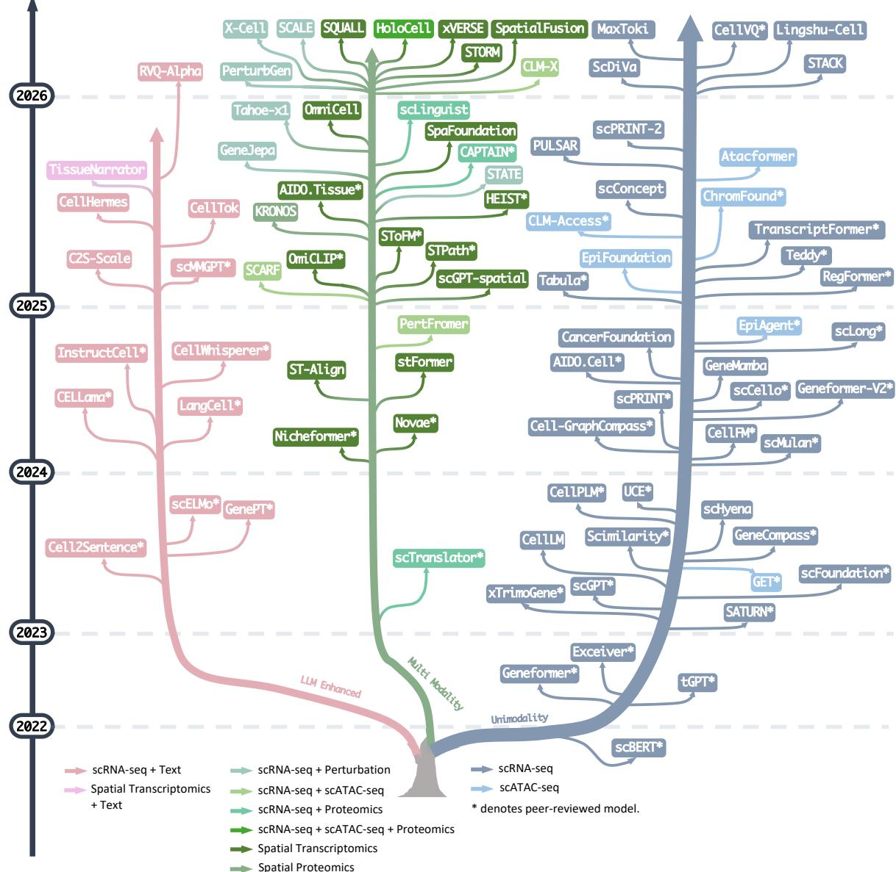
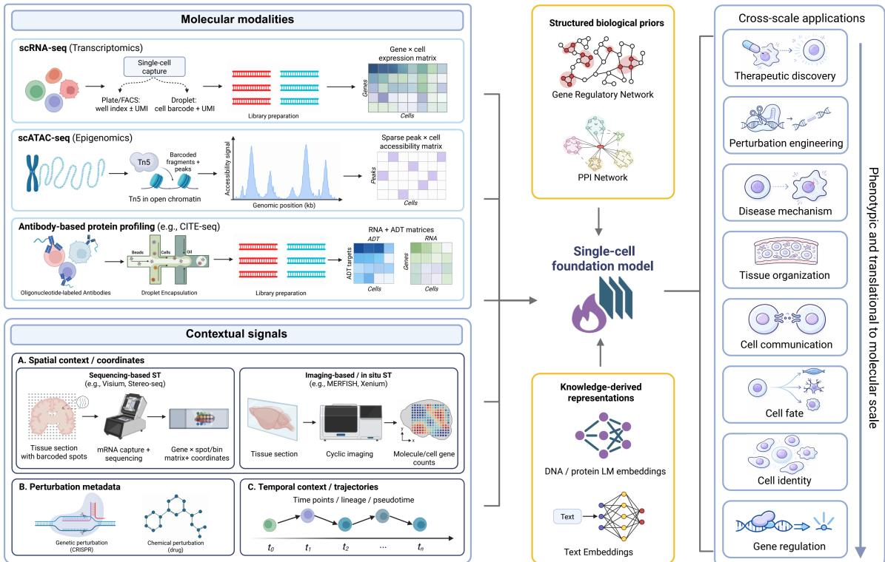
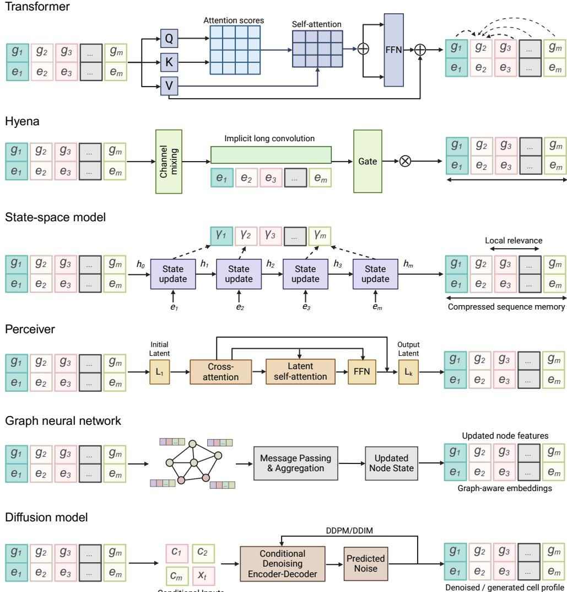
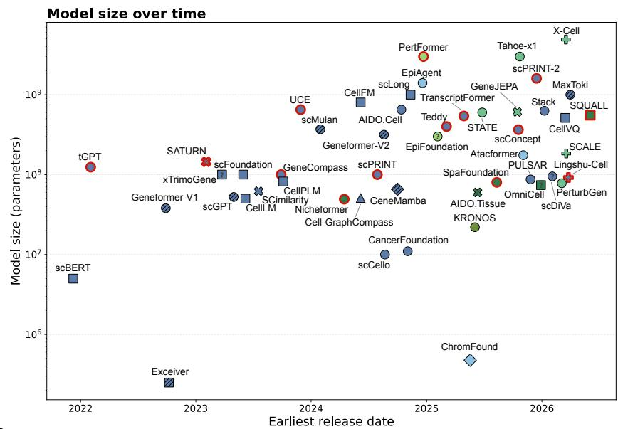
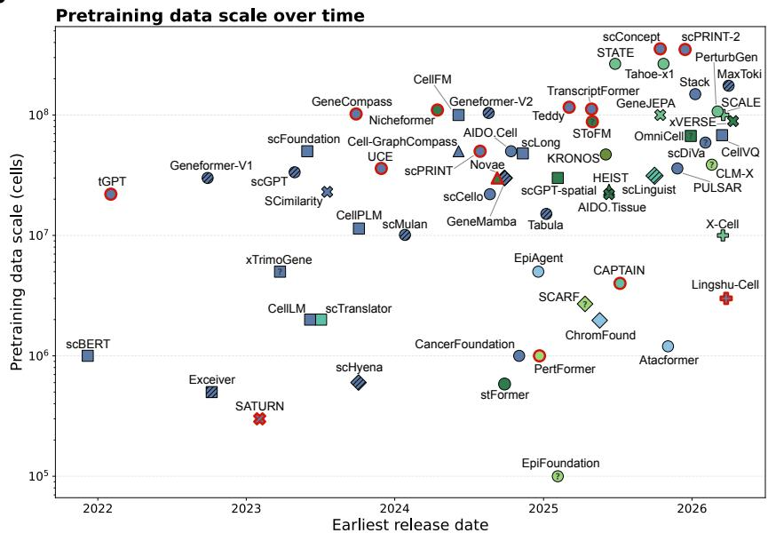
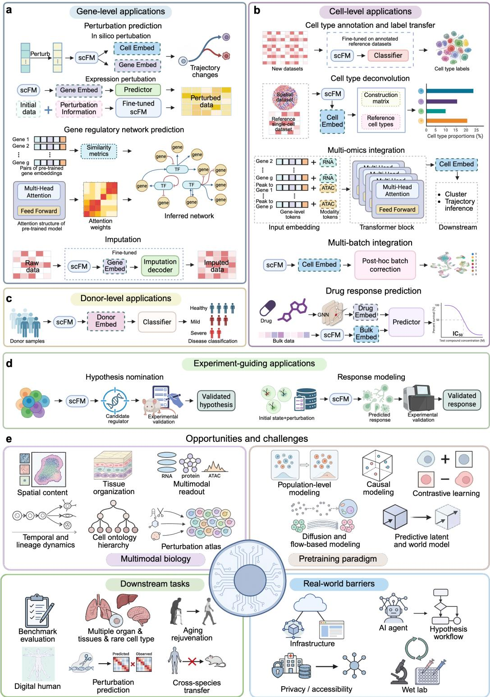

# The Landscape of Single-Cell Foundation Models: Design Principles, Applications, and Open Challenges

Shiyu Jiang † , Zhaoyu Fang † , Yujie Zhang , Xuting Zhang , Jérémie Kalfon , Weixu Wang , Xi Fu , Aakash Patel , Syed Rizvi , Yuancheng Ryan Lu , Siyu He , Yixin Wang , Kejun Ying , Peter Pao-Huang , Yifan Lu , Weizu Xu , Mengchen Wang , Ziyang Miao , Jianhui Lin , Jimmy Ding , Zitong Jerry Wang , Wei Ouyang , Tianlong Chen , Guoxian Yu , Min Li , Jiayi Ma , Fei Wang , Yuying Xie , Jiliang Tang , Raul Rabadan , David van Dijk , Pengtao Xie , Peng He , Emily B. Fox , Le Song , Fabian J. Theis , Eric Xing , Christina V. Theodoris \* , Xiaojie Qiu \* , Jiayuan Ding

Posted Date: 18 August 2026

doi: 10.20944/preprints202608.1166.v1

Keywords: single-cell foundation model; AI virtual cell; LLM for science

Disclaimer/Publisher’s Note: The statements, opinions, and data contained in all publications are solely those of the individual author(s) and contributor(s) and not of MDPI and/or the editor(s). MDPI and/or the editor(s) disclaim responsibility for any injury to people or property resulting from any ideas, methods, instructions, or products referred to in the content.

Article

# The Landscape of Single-Cell Foundation Models: Design Principles, Applications, and Open Challenges

Shiyu Jiang 1,†, Zhaoyu Fang 2,†, Yujie Zhang 3,4, Xuting Zhang 5, Jérémie Kalfon 6, Weixu Wang 7,8 Xi Fu 9, Aakash Patel 10, Syed Rizvi 10, Yuancheng Ryan Lu 11, Siyu He 1, Yixin Wang 1, Kejun Ying 1, Peter Pao-Huang 1, Yifan Lu 1,12, Weize Xu 1, Mengchen Wang 1, Ziyang Miao 13, Jianhui Lin 14, Jimmy Ding 15, Zitong Jerry Wang 5, Wei Ouyang 16, Tianlong Chen 17, Guoxian Yu 18, Min Li 12, Jiayi Ma 12, Fei Wang 18, Yuying Xie 19, Jiliang Tang 19, Raul Rabadan 9, David van Dijk 10, Pengtao Xie 20, Peng He 4, Emily B. Fox 1,21, Le Song 22,23, Fabian J. Theis 7,8, Eric Xing 22,23, Christina V. Theodoris 3,4,\*, Xiaojie Qiu 1,\* and Jiayuan Ding 1,\*

1 Stanford University 2 Central China Normal University 3 Gladstone Institutes 4 UCSF 5 Westlake University 6 Institut Pasteur 7 Helmholtz Munich 8 Technical University of Munich 9 Columbia University 10 Yale University 11 MIT 12 Wuhan University 13 Central South University 14 Amazon 15 KTH Royal Institute of Technology 16 University of North Carolina at Chapel Hil 17 Shandong University 18 Cornell University 19 MSU 20 UCSD 21 Chan Zuckerberg Biohub 22 GenBio AI 23 MBZUAI

Corresponding: christina.theodoris@gladstone.ucsf.edu (C.V.T.); xiaojie@stanford.edu (X.Q.); jiayuandingjsnu@gmail.com (J.D.)

† Equal contribution.

## Abstract

Recent advances in large-scale single-cell atlases and large language models (LLMs) have enabled the emergence of single-cell foundation models (scFMs)-pretrained models that aim to learn transferable representations of cellular states across tissues, conditions, and molecular modalities. These models hold promise for moving single-cell analysis beyond task-specific pipelines towards unified, generalizable and predictive frameworks, yet their biological fidelity, generalization and scaling capacity, as well as utility for perturbation modeling remain challenging. In this review, we summarize recent progress in scFMs across key design dimensions, including data representation, model architecture and learning objective, and examine how these frameworks are being applied to biological discovery. We further critically assess current challenges and opportunities from multimodal pretraining atlas, emerging pretraining paradigms, downstream applications, and real-world barriers. This review provides a structured guide for both computational scientists and experimental biologists seeking to understand, develop, and apply foundation models for single-cell research.

Github: https://github.com/OmicsML/awesome-foundation-model-single-cell-papers

Keywords: single-cell foundation model; AI virtual cell; LLM for science

## 1. Introduction

Single-cell technologies have transformed modern biology by resolving tissues into their constituent cell states, lineages and interactions. Single-cell RNA sequencing (scRNA-seq) first enabled transcriptome-wide measurements at cellular resolution [1,2], and this view has since expanded to chromatin accessibility, protein abundance, and spatial organization [3–5]. In parallel, perturbational single-cell assays have added an interventional dimension: large-scale screens such as Perturb-seq [6] measure cellular responses to known genetic, chemical or environmental factors, providing causal anchors that are difficult to obtain from observational atlases alone. These advances have catalysed atlas-scale efforts to chart cellular diversity across tissues, species and disease states [7,8]. Yet the same features that make these data powerful also make them difficult to model: measurements are large scale, high dimensional and heterogeneous, while cellular identity is strongly shaped by developmental, anatomical and experimental context [4,9,10].

Meanwhile, foundation models have reshaped machine learning by showing that large-scale pretraining can yield transferable representations that generalize across diverse downstream tasks [11, 12]. This paradigm is now being adapted to single-cell biology, where models are pretrained on millions of cells to learn contextual embeddings of genes, cells and, increasingly, multimodal cellular states [13,14]. The appeal is clear: by taking advantage of large-scale general data to gain a fundamental understanding of cell state regulation, foundation models could enable tasks in a broad range of downstream settings with limited or no task-specific data through transfer learning. However, unlike language or natural images, single-cell measurements provide sparse and incomplete snapshots of a complex biological system. The observed molecular states offer only partial readouts of the underlying regulatory processes, which are highly dependent on cell type, tissue, developmental state, perturbation and experimental context. These data are further fragmented across assays, often unpaired across modalities, and affected by sampling noise and technical variation. For many applications, models must therefore move beyond merely descriptive correlations to learn representations that capture transferable biological structure and encode intervention-informed regulatory relationships using perturbational data. Progress in single-cell foundation models consequently depends not only on scale, but also on biologically informed choices in data representation, model architecture and training objectives.

The emergence of single-cell foundation models (scFMs) therefore reflects both an opportunity and a challenge. On one hand, expanding cell atlases and multimodal resources provide the substrate for increasingly general pretraining. On the other, recent work has shown that gains are uneven across tasks, zero-shot generalization remains fragile, and progress in perturbation modeling still falls short of the field’s broader ambitions [15,16]. The central question is no longer whether the foundation-model paradigm can be imported into single-cell biology, but how it should be adapted to capture biological structure faithfully and to support predictive modeling across contexts, modalities and interventions. In the longer term, these efforts are increasingly linked to the vision of AI virtual cells: adaptive in silico systems that can simulate and interrogate cellular behaviour under biologically meaningful conditions [17–19].

In this review, we systematically survey scFMs across the full modeling pipeline. We first examine how single-cell measurements are represented through tokenization strategies and backbone architectures, then discuss the large-scale datasets and preprocessing frameworks that underpin pretraining. We then compare the major learning objectives adopted across current model designs. Next, we trace the use of learned representations across downstream tasks, spanning gene-, cell- and tissue-level analyses, as well as emerging applications in experimental discovery. Finally, we highlight the key challenges and opportunities that will shape the next generation of biologically grounded and predictive scFMs, and provide practical guidance for model development and experimental use for the broader single-cell community.

  
Figure 1. Evolution of single-cell foundation models across modalities. Representative models are arranged as branching lineages by modality. Blue denotes unimodal foundation models trained on scRNA-seq or scATAC-seq, pink denotes LLM-enhanced models integrating transcriptomic or spatial data with natural language, and green denotes multimodal models combining transcriptomic data with perturbation, spatial, chromatin accessibility or proteomic measurements. Branches are ordered by the earliest release date of each model. Dashed horizontal lines indicate publication year, and asterisks denote peer-reviewed models.

## 2. Model Architecture for Single-Cell Foundation Models

scFMs are shaped by the interplay between multiscale biological organization and multimodal data representations, enabling cross-scale applications, as shown in Figure 2. The complexity of modeling transcriptomic profiles together with multimodal information makes model architecture a central design consideration. Although previous studies have summarized the major architectural designs of scFMs [20–22], our review extends this discussion by systematically categorizing recent advances in tokenization strategies, new model backbones, architectural design for multimodality, and efficient, scalable model design.

  
Figure 2. Conceptual framework for single-cell foundation models across biological scales. Single-cell foundation models connect multiscale biological organization with multimodal data and cross-scale applications. Figure created in BioRender.

## 2.1. Data Tokenization Strategy

Single-cell profiles consist of sparse, high-dimensional gene-expression measurements with no canonical feature order. Their sparsity, technical noise and distribution shifts across platforms, species and modalities limit the direct transfer of foundation-model designs developed for other domains. As recent work has shown, tokenization strategy strongly influences downstream performance [23], making it a central inductive bias in scFMs. Here, we examine how scFMs encode gene identity and expression, construct “cell sentences”, and incorporate biological priors or additional modalities into the input representation.

## 2.1.1. Cell Sentence

Existing tokenization strategies can be understood as making three choices: how to represent gene identity, how to encode expression magnitude, and whether to impose biological structure before learning begins. A common paradigm in scFMs treats each cell as a “cell sentence” composed of gene tokens, analogous to words in natural language. To capture expression magnitude as a key component of cellular state, foundation models employ distinct paradigms to build cell sentences: explicit value encoding (discrete or continuous), implicit rank-based ordering, and discrete latent quantization.

Discrete tokenization. A common strategy is to discretize continuous expression into a small number of bins after standard preprocessing [24,25]. Each gene token is then paired with a discrete expression token representing its binned magnitude. This discretization can stabilize model training under the heavy-tailed distributions typical of UMI counts and may reduce sensitivity to technical variation, including batch- and depth-related effects. However, discretization can also sacrifice quantitative resolution and distort gene-specific dynamic ranges, with fixed-width or adaptive binning schemes differing in how they redistribute expression values and in their sensitivity to small expression changes.

Continuous tokenization. Conversely, models such as scFoundation [26] and CellFM [27] encode expression as continuous values rather than discrete bins. Following preprocessing, each gene’s scalar expression value is projected into the model embedding space and combined with its gene-identity embedding. scFoundation further incorporates a read-depth-aware (RDA) objective, conditioning masked reconstruction on total-count information to account explicitly for variation in sequencing depth and associated dropout. Continuous encoding preserves fine-grained quantitative differences that are lost through discretization, making it suitable for tasks requiring quantitative outputs. However, direct exposure to expression magnitudes can increase sensitivity to library size and platform-specific effects. Objectives such as RDA provide one means of restoring robustness through explicit depth conditioning at the training-objective level rather than through tokenization itself.

Rank-based encoding. Rather than explicitly embedding the expression value, Geneformer [28] encodes expression implicitly by ranking genes according to their relative expression in a given cell compared to the non-zero median expression across cells. In this method, ubiquitously highly expressed housekeeping genes are scaled to a lower rank while genes such as transcription factors that are generally lowly expressed will be moved to a higher rank in cells where they are relatively overexpressed. In this formulation, expression magnitude is represented through token order rather than explicit value embeddings, providing a nonparametric view of the transcriptome that may be more robust to technical artifacts that affect the exact expression value while the gene rank remains more stable. This approach is also a compressed representation that avoids computing on non-expressed genes, learning instead from the absence of genes.

Latent tokenization. While most scFMs tokenize expression at the level of individual genes, alternative approaches first compress high-dimensional profiles into a latent token space. CellTok [29] uses a VQ-VAE [30] to learn a single discrete codebook of recurrent expression patterns, representing each cell as a sequence of latent code indices. RVQ-Alpha [31] extends this idea with residual vector quantization (RVQ) [32], compressing each cell into a short sequence of discrete tokens from multiple residual codebooks that are directly embedded into the LLM vocabulary. Compressing cells into a small set of latent codes decouples sequence length from gene number, enabling efficient long-context and language-model integration. However, the learned codebook limits representational capacity and sacrifices direct gene-level interpretability, requiring decoding for gene attribution and in silico perturbation.

## 2.1.2. Prior-Informed Tokenization

Recent tokenization strategies increasingly incorporate structured biological knowledge into the input representation, which is important for scFMs because the token meaning is strongly contextdependent. Unlike natural language words, which often denote composable semantic entities, or protein residues, which carry biochemical properties relevant to folding and binding, single-cell tokens such as genes, peaks, or genomic regions derive much of their meaning from sequence, expression, chromatin accessibility, genomic position, regulatory interactions, and functional annotations. Because these elements operate within evolutionary, molecular, and functional constraints rather than as inde pendent variables, prior-informed tokenization enriches tokens with biological context, transforming tokenization from a formatting step into a biologically grounded modeling strategy.

Content-enriched tokenization. Some foundation models redefine gene tokens as biologically enriched representations, augmenting gene identity with molecular, genomic, regulatory or semantic information. At the genomic level, scPRINT [33,34] incorporates features such as genomic position into the token space, whereas SATURN [35] and TranscriptFormer [36] initialize gene representations with embeddings from the ESM protein language model [37], introducing sequence-derived priors. PULSAR [38] further combines ESM protein embeddings with transcriptomic representations from UCE [39] to bridge molecular and cellular scales for donor-level modeling. GeneCompass [40] adopts a broader strategy, enriching gene tokens with promoter-sequence embeddings from DNABert [41], GRN-derived features, gene-family information and co-expression embeddings, which are projected into a shared space and integrated with continuous expression values. Such priors can improve representations when transcriptomic information is sparse or entities are poorly covered by the pretraining corpus, while supporting better transfer across datasets and species. However, this approach may remains constrained by the coverage and quality of the underlying biological representation.

Relational tokenization. Given that genes operate within coordinated regulatory and functional networks, several methods encode gene–gene relationships during tokenization, converting cells from simple sequences into structured representations. Cell-GraphCompass [42] models each cell as a gene interaction graph with node features and biologically defined edges, whereas scLong [43] injects relational structure into sequence-style tokens by combining expression embeddings with gene ontology (GO) derived gene embeddings learned by a graph neural network. Rather than specifying what a token means, relational priors specify which tokens should influence one another, providing biological dependency structure that would otherwise need to be inferred from expression co-variation alone. However, externally defined relationships can be incomplete or context dependent, potentially limiting their ability to capture gene dependencies that vary across tissues and conditions.

Text embedding as tokenization. A small class of models grounds token identities directly in natural language, mapping genes into semantic spaces learned from biomedical text. GenePT [44] and scELMo [45] represent genes using LLM-derived embeddings of curated or automatically generated gene descriptions, replacing conventional learned gene ID embeddings with literature-informed representations that are subsequently aggregated into cell-level embeddings. By injecting functional knowledge directly into the token space, such representations can improve biological generalization without requiring additional task-specific annotations, although their utility ultimately depends on the quality and coverage of the underlying textual knowledge

## 2.1.3. Multi-Modal Tokenization

Although scFMs are increasingly developed for multi-omics and spatial multi-modal data, most existing tokenization strategies remain transcriptome-centric. In practice, the majority of multiomics models reuse RNA-based tokenization schemes and extend them to additional modalities with minimal adaptation. As a result, transcriptomic features typically dominate the token vocabulary and representation space, while other modalities are incorporated as auxiliary signals.

Transcriptome-centric multimodal tokenization. For RNA modalities, multi-omics models largely follow tokenization paradigms established in unimodal scRNA-seq. Current approaches span three main strategies: discrete tokenization, as used by scGPT-spatial [46] and Tahoe-x1 [47]; continuous tokenization, adopted by stFormer [48] and scLinguist [49]; and rank-based encoding, implemented in Nicheformer [50] and SToFM [51]. Nicheformer further adopts a tokenization strategy similar to Geneformer, with the difference being that cell transcripts are normalized by technology-specific non-zero means to account for variations across sequencing protocols. OmiCLIP [52] takes a distinct approach by mapping omics features into a shared semantic space through text embeddings. Despite these variations, RNA remains the primary organizing modality around which most multimodal tokenization schemes are structured.

Modality-specific tokenization strategies. For non-transcriptomic modalities, protein expression is most commonly represented using continuous tokenization, as in scTranslator [53] and scLinguist [49]. More specialized tokenization schemes emerge when models must accommodate modalityspecific structure or dimensionality. PertFormer [54] uses a multi-omics tokenization strategy in which DNA sequences are converted into k-mer tokens and epigenetic signals are discretized into categorical embeddings. While k-mer tokenization captures recurrent local sequence patterns, GET [55] adopts a more biologically informed strategy for regulatory genomics by using position weight matri ces (PWM)/motif matching to construct peak-by-motif representations, thereby emphasizing motif composition and regulatory context rather than exact base-level sequences. For scATAC-seq data, CLM-X [56] adopts a tailored strategy to address ultra-high dimensionality: peaks are grouped into contiguous patches and binarized, and each cell is represented as a sequence of patch tokens with corresponding binary vectors, followed by padding or truncation to a fixed length. In spatial proteomics, KRONOS [57] proposes a marker-agnostic tokenization scheme that allows foundation models to process variable and previously unseen marker channels. Together, these approaches illustrate how tokenization increasingly departs from generic expression encoding when the underlying modality imposes distinct structural or technical constraints.

Unified cross-modal tokenization. While the above methods largely rely on modality-specific designs, recent work has begun to explore unified and biologically structured representations across modalities. One such effort is HoloCell [58], which introduces a gene-anchored hierarchical tokenization framework. In this approach, genes serve as central anchors to organize related biological entities, including regulatory elements and proteins. Each entity is encoded as a structured token capturing its identity, relative context (e.g., genomic proximity or rank), and discretized quantitative value. By organizing heterogeneous modalities within a shared gene-centric structure, this approach reduces the large vocabulary induced by regulatory elements while preserving biologically meaningful relationships. It further enables coherent cross-modal representation learning without requiring separate tokenization schemes for each modality, suggesting a shift toward more unified tokenization strategies.

LLM-oriented cell sentence. Recent studies recast single-cell profiles as language-like token sequences for direct processing by large language models, enabling instruction-based and questionanswering frameworks over cellular states. In doing so, they treat cellular measurements as linguistic units and harness the reasoning and generative capacities of text-pretrained models. For example, Cell2Sentence [59] represents single-cell transcriptomes directly in natural language as a ranked list of gene symbols ordered by expression value, a textual sequence equivalent of the "cell sentence" that can directly be tokenized by any language model without architectural modification, and C2S-Scale [60] further scales this paradigm to multimodal, instruction-tuned single-cell language models with multi-cell reasoning capabilities. CellTok [29] encodes multiple cells simultaneously into discrete, compressed VQ tokens and combines them with free-text prompts to form joint input sequences for large language models. CellHermes [61] further encodes protein–protein interaction graphs into language-like input sequences through graph-derived question–answer formulations.

In sum, scFMs have adopted diverse tokenization strategies to reconcile sparse, noisy and highdimensional omics profiles with the demands of foundation models. These span gene-level cell sentences, latent codebooks, biologically informed relational tokens and language-aligned cellular representations. Tokenization is thus evolving from a preprocessing step into a key mechanism for encoding biological prior knowledge. A central challenge is to preserve informative biological variation while suppressing technical noise, thereby enabling scalable pretraining and transferable downstream performance. As scFMs expand toward multimodal and language-integrated settings, tokenization will likely remain a major determinant of both model capability and biological interpretability.

## 2.2. Model Backbone

Backbone architectures determine the representational capacity, scalability, and interpretability of scFMs. Because single-cell data are high-dimensional, sparse, and shaped by complex regulatory dependencies, scFMs have adopted diverse architectural paradigms (see Figure 3). Transformers remain the dominant backbone, LLM-based models extend generative and instruction-tuned capabilities, and alternative architectures such as Hyena operators, state-space models, and graph neural networks aim to improve scalability.

## 2.2.1. Transformer

Transformer and attention-based architectures constitute the dominant backbone paradigm for current scFMs [20,62,63], owing to their flexible token-mixing mechanisms, strong contextual modeling capacity, and compatibility with large-scale pretraining across diverse single-cell modalities. To mitigate the ensuing computational and memory bottlenecks, canonical backbones are increasingly augmented with scalability-oriented attention mechanisms. These include kernel-based linear approximations such as Performer [64], as adopted by models including scFoundation [26] and scLong [43]; accelerated exact attention implementations such as FlashAttention-2 [65], utilized by scGPT [25] and Tabula [66]; and retention-based strategies such as RetNet [67] applied by CellFM [27]. Beyond efficiency, emerging scFMs incorporate structurally informed attention to impose biologically grounded inductive biases. SToFM [51] uses a specialized Transformer variant to encode spatial distances in attention, enabling rotation- and translation-invariant modeling of cell–cell interactions and tissue organization. Stack [68] instead factorizes intra- and inter-cellular attention, reframing the Transformer as a set-structured operator over cell collections. These two lines of work extend attention in complementary directions—scaling it to increasingly large single-cell representations and shaping how tokens interact to reflect biological organization. Both build on the flexibility of attention for single-cell data, allowing dependencies among gene or cell tokens to be learned without requiring them to be fully specified in advance.

  
Figure 3. Comparison of neural network architectures for modeling single-cell gene-by-cell matrices. Each row illustrates how a representative backbone encodes or generates gene-expression profiles represented by gene identities and expression values. Transformers use self-attention for global token mixing; Hyena and state-space models provide scalable alternatives for long-range dependency modeling; Perceiver models compress highdimensional inputs into latent arrays; graph neural networks incorporate relational biological structure through message passing; and diffusion models reconstruct or generate cell profiles through iterative denoising. Figure created in BioRender.

## 2.2.2. LLM-Based

Rather than training domain-specific foundation models from scratch, some scFMs adopt LLMderived backbones, adapting open-source large language models such as LLaMA [69], Qwen [70], and BioGPT [71] to biological and cellular token spaces. As a result, the scale and pretraining of LLMs endow LLM-based scFMs not only with generative and linguistic capabilities, but also with prior knowledge acquired from natural language corpora. Such knowledge can transfer to downstream tasks, particularly those including language understanding such as question answering and captioning tasks. In this paradigm, LLMs act as general-purpose generative sequence engines whose scale and pretraining confer strong expressive and generative capacity on scFMs. Through biological tokenization schemes and lightweight projection layers, these backbones are augmented with gene-, cell-, or multimodal tokens, enabling unified training and instruction tuning over single-cell data and auxiliary biological corpora. Representative examples include Cell2Sentence [59], C2S-Scale [60], and CellTok [29], which leverage open-sourced LLM backbones for large-scale cellular generative modeling.

## 2.2.3. Structured and Alternative Backbones

Beyond attention-based and LLM-derived architectures, an emerging line of work explores structured and alternative backbones, such as Hyena operators, state-space models and graph neural networks, to efficiently capture long-range dependencies, continuous dynamics, and relational biological structure, respectively, which are difficult to encode within purely attention-based frameworks.

Hyena operator Beyond attention-based sequence models, convolution-based architectures such as the Hyena operator [72] explore efficient alternatives for long-context modeling. Hyena replaces quadratic self-attention with implicitly parameterized long convolutions and data-dependent gating, enabling subquadratic sequence modeling [72]. Building on this backbone, scLinguist [49] models full gene set of up to 19,202 genes, efficiently capturing genome-wide gene–gene dependencies in large-scale generative tasks.

State space model State-space models serve as another option for efficient long-context modeling. Mamba [73] uses selective state-space layers to achieve linear-time sequence modeling without explicit self-attention. Building on this framework, GeneMamba [74] introduces a bidirectional Bi-Mamba architecture, whereas SCARF [75] modifies Mamba for high-dimensional multimodal single-cell data to better capture global gene relationships.

Perceiver The Perceiver architecture [76] addresses the scalability limits of Transformers by using an asymmetric attention mechanism to distill high-dimensional inputs into a tight latent bottleneck. This design decouples computational cost from input size, enabling the model to handle hundreds of thousands of features. Building on this, GeneJepa [77] and PETRI [78] both use Perceiver-style encoders to compress high-dimensional transcriptomic inputs into a fixed set of latent tokens for efficient representation learning.

Graph neural network Graph-based approaches are increasingly used to capture higher-order biological structure and relational dependencies. scLong [43] incorporates gene ontology priors through graph convolution, while Cell-GraphCompass [42] represents each cell as a gene graph that integrates transcriptional, textual, regulatory, co-expression, and positional information. In contrast, scPRINT-2 [34] focuses on intercellular context, using a GNN-based multi-cell encoder to incorporate neighboring-cell expression information.

Diffusion model Diffusion-based architectures remain relatively rare in current scFMs, but they provide a non-autoregressive alternative for modeling sparse and unordered cellular states. ScDiVa [79] formulates single-cell modeling as masked discrete diffusion, using a bidirectional denoiser to recover both gene identities and expression magnitudes under dropout-like corruption. Extending this paradigm to perturbation settings, models such as X-Cell [80] frame causal perturbation prediction across diverse cellular contexts as a diffusion language modeling problem.

Fully connected network In contrast to structured sequence and graph-based backbones, SCimilarity [81] adopts a fully connected network together with metric-learning objectives to learn cell embeddings, offering a lightweight alternative to more complex backbone designs.

Taken together, these backbones illustrate how architecture, like tokenization, provides a means to encode biological structure rather than leaving it entirely to be learned from data. Sequence length, relational organization and the sparse, count-valued nature of gene expression can each be reflected explicitly in architectural design. As single-cell datasets continue to expand in scale and modality, this broader design space offers complementary routes to computational efficiency and biological fidelity beyond attention alone.

## 2.3. Model Efficiency and Scalability

As single-cell atlases expand toward billions of cells, efficiency and scalability have become increasingly important for scFMs. However, early models were not always primarily optimized for scalability, which may have constrained their predictive capacity and broader downstream applicability. This section considers recent strategies for scalable scFMs and assesses empirical evidence on whether scaling indeed leads to consistent performance gains.

## 2.3.1. Scalable Architectures

Architectural routes to efficiency—efficient attention variants, state-space and long-convolution models, and latent-bottleneck designs—were discussed above; complementary gains come from hardware-aware implementations such as FlashAttention and Transformer Engine[82], and from sparse or conditional computation. Scalability can also be enhanced through sparse and conditional computation. Graph-based architectures restrict interactions to sparse gene–gene networks derived from co-expression or regulatory structure, thereby reducing computation while retaining biologically meaningful dependencies. Mixture-of-Experts (MoE) architectures [83] provide a complementary strategy by dynamically routing inputs to specialized subnetworks while retaining a shared backbone. For example, scGPT-spatial [46] uses protocol-aware expert routing to adapt a pretrained model across heterogeneous spatial transcriptomics platforms. OmniCell [84] introduces a gene-aware MoE value-embedding module, in which expression values are routed to gene-conditioned experts to model gene-specific expression distributions alongside intracellular programmes and intercellular spatial dependencies.

Together, these strategies reduce cost from two directions: making each operation cheaper, and ensuring that only part of the model is active for any given input. The two are complementary, and combining them allows model capacity to grow without a proportional increase in computation per cell.

## 2.3.2. Token Compression

Token compression provides another route to scalable modeling by reducing input dimensionality. Some early approaches rely on selecting highly variable genes, but these may omit relevant signals. More advanced methods, such as vector quantization based approaches adopted by CellTok [29] and RVQ-Alpha [31], learn latent representations that compress inputs while preserving biological meaning. Structural compression methods—such as graph tokens and hierarchical representations—reduce redundancy by grouping genes into modules or relational units. Recent cross-scale architectures such as PULSAR [38] and XPressor [85] compress gene-level representations into compact cell-state vectors and, in the case of XPressor, decompress them back to the gene-level features, enabling joint learning across molecular and cellular scales while reducing the cost of transferring information between resolutions. PULSAR pushes this concept to tissue and patient level representations. These strategies not only improve efficiency but also align with biological structure, supporting generalizable and interpretable models across large-scale datasets.

## 2.3.3. Parameter-Efficient Tuning

In downstream applications, modern scFMs face several practical constraints, including large model size, limited computational resources and the risk of catastrophic forgetting [86], whereby task-specific fine-tuning can erode previously acquired knowledge. These challenges collectively necessitate efficient and scalable adaptation strategies. This has motivated the adoption of parameterefficient tuning approaches, which treat scFMs as strong initializations and enable task adaptation with minimal additional parameters. Concretely, these methods freeze most backbone weights and optimize only lightweight task-specific components, such as prefix adapters [87] and low-rank adaptations [88], substantially reducing memory footprint and optimization cost. A representative example is the scPEFT framework [89], which integrates low-dimensional, pluggable adapters into scFMs while keeping the backbone frozen, enabling efficient domain adaptation with dramatically fewer trainable parameters and lower GPU memory usage. It demonstrates that parameter-efficient designs can mitigate catastrophic forgetting while supporting robust adaptation across disease-specific, crossspecies, and undercharacterized cell populations. Among existing techniques, Low-Rank Adaptation (LoRA) has been widely adopted in recent scFM studies, including CellFM [27], CellTok [29], and C2S-Scale [60]. Quantized LoRA [90] was also demonstrated to be an effective method for resourceefficient fine-tuning and inference while retaining biological knowledge, matching performance of full precision models [91]. Such techniques broaden the accessibility of large-scale models to researchers with limited GPU resources.

## 2.4. Model Scaling Behavior

In natural language processing, large language models exhibit explicit scaling laws, with performance improving predictably as model size, data set volume, and computational resources increase [92]. This raises the question of whether scFMs exhibit comparable scaling behaviour, and whether increases in model size and pretraining data consistently translate into improved biological understanding and downstream performance, particularly as increasing resources are devoted to scaling both dimensions (see Figure 4).

The current evidence in scFMs is mixed rather than uniformly monotonic. On the one hand, several studies report clear benefits from scaling. C2S-Scale shows consistent gains with increasing model size and compute budget [60]. Similarly, scTab reports that performance scales with both training dataset size and model size [93], Stack observes improved validation performance across model configurations scaling from 69 to 629 million parameters [68], and Geneformer-V2 shows that larger pretraining corpora, increased model size, and expanded input context can improve zero-shot predictions [91].

However, the scaling behaviors do not appear uniformly across models, tasks, or evaluation settings. Zero-shot benchmarking studies of scGPT and Geneformer suggest that larger pretraining datasets do not always translate into better biological performance [94]. CellFM further illustrates that scaling effects can be task-dependent: although the full 800M-parameter model is strong after finetuning, smaller variants were preferred in some zero-shot annotation settings [27]. Recent perturbation benchmarks likewise suggest that the benefits of larger and more expressive models depend strongly on dataset scale, heterogeneity, and fine-tuning data size, rather than emerging as a universal scaling law [15].

Collectively, the scaling law in biological foundation models is more contingent than in natural language models, depending not only on model and data size, but also on training objectives, biological context, and evaluation protocol. Recent perspective work further argues that progress toward virtual cells may depend less on scale alone than on sufficient coverage of diverse biological contexts and the ability to generalize across them [95]. A critical report found no clear evidence of data scaling laws for scFMs across zero-shot and fine-tuning tasks, suggesting that future model development should emphasize a principled balance among model capacity, dataset scale and computational budget, rather than indiscriminately increasing all three [96]. Indeed, both the original Geneformer and Geneformer-V2 demonstrate that the largest gains are from increasing the diversity of the pretraining corpus, rather than solely increasing the number of examples within the same context [28,91]. Consequently, scaling in unimodal transcriptomic models may depend less on data volume alone than on the diversity of biological contexts represented during pretraining and the model’s ability to generalize across them.

  
Figure 4. Scaling of scFMs over time. Model parameter count (a, n = 50) and pretraining data scale in cells (b, n = 61) plotted against earliest release date; only non-LLM scFMs with a documented value for the respective quantity are included, and size-variant families are shown as a single representative model. a. Model size spans 0.25 M to 4.9 B parameters, growing roughly four orders of magnitude since 2021. b. Pretraining corpora span 0.1 M to 360 M cells over the same period.

## 3. Pretraining Datasets and Preprocessing

As shown in Figure 2, scFMs rely on large, diverse, and systematically curated atlases that integrate cells across tissues, conditions, technologies, and molecular modalities [8,97]. In this section, we examine single-cell multimodal resources used for pretraining (Supplementary Table S1) and discuss major frameworks for preprocessing and data analysis (Supplementary Table S2).

## 3.1. Single-Cell Transcriptomic Datasets

Human single-cell transcriptomic data is deposited primarily in long-standing repositories such as Gene Expression Omnibus (GEO) [98] and EMBL-EBI [99], which serve as critical upstream sources of raw data. To bridge the gap between fragmented datasets, platforms like the Human Cell Atlas [100], UCSC Cell Browser [101], Chan Zuckerberg Initiative (CZI) CELLxGENE [102], and Broad Institute’s Single Cell Portal [103] have emerged as major community hubs, providing resources amenable to standardization and integration for assembling large, heterogeneous pretraining corpora. Furthermore, integrated atlas efforts and databases such as Tabula Sapiens [7], hECA [104], and DISCO [105] offer deeply annotated, multi-tissue human references with standardized cell-type labels. These highquality, integrated resources enable structured and biologically grounded representation learning at an unprecedented scale. Recently, scBaseCount [106] has been developed as a next-generation single-cell data infrastructure that autonomously mines, curates, and uniformly reprocesses raw scRNA-seq datasets directly from the Sequence Read Archive (SRA) [107] leveraging AI agents, establishing the largest AI-agent-curated repository of single-cell transcriptomes to date. However, because public data platforms may not enforce preprocessing standards tailored to foundation model training, careful curation and standardized preprocessing are essential instead of relying on default matrix fields.

## 3.2. Multimodal Datasets

Beyond conventional transcriptomic atlases, pretraining resources are rapidly expanding across proteomic, multi-omic, and spatial modalities. For joint chromatin accessibility and transcriptional profiling, X-Omics [75] assembles over 2.7 million cells across multiple tissues and species for scRNAseq/scATAC-seq pretraining. hECA v2.0 [108] integrates 10.8 million uniformly annotated human scRNA-seq profiles and more than 1.4 million scATAC-seq profiles across 42 organs and tissues, with standardized expression and accessibility matrices, harmonized metadata, and manually curated uHAF-based cell-type annotations. In single-cell proteomics, SPDB [109] integrates antibody-based, mass spectrometry-based, and paired RNA–protein datasets at atlas scale. Spatial resources have also reached pretraining scale: SpatialCorpus-110M [50] combines 57 million dissociated cells with 53 million spatially resolved cells, whereas SToCorpus-88M [51] provides a large high-resolution spatial transcriptomic corpus for spatially informed foundation modeling.

## 3.3. Perturbational Datasets

In perturbation biology, Tahoe-100M [110] provides a 100-million-cell atlas of small-molecule responses across diverse cancer cell lines, whereas X-Atlas/Orion [111] offers a large public genomewide Perturb-seq resource for dose-dependent perturbation modeling. More recently, X-Cell was trained on X-Atlas/Pisces [80], a 25.6-million-cell genome-wide CRISPRi Perturb-seq dataset spanning 16 cellular contexts, highlighting the growing scale and contextual breadth of perturbational corpora. Complementary repositories such as PerturBase [112] further organize and harmonize genetic and chemical perturbation datasets across studies, while paired assays such as Perturb-multiome [113] illustrate the emerging availability of perturbational RNA-plus-chromatin readouts. Furthermore, the Human Cytokine Dictionary [114] extends this landscape to immune signaling perturbations, profiling 9.7 million human PBMCs stimulated with 90 cytokines to define cell-type-resolved transcriptional response signatures. Such datasets that map causal perturbations are critical to enabling models to understand the causality in cell state regulation and are a major focus of current data generation efforts.

## 3.4. Data Formats and Frameworks

scFMs are typically pretrained on corpora organized using standardized annotated matrix containers that support large-scale, heterogeneous datasets. AnnData [115] has become the dominant in-memory data structure for single-cell matrices, with common on-disk formats including h5ad and loom, and multimodal containers such as MuData extending this framework to paired measurements. R packages such as Seurat [4] and Python frameworks including Scanpy [115], scvi-tools [116], and Pertpy [117] provide unified APIs for preprocessing, integration, and dataset assembly. Tokenized datasets are also commonly stored in the Hugging Face Datasets (.dataset) [118] structure, which is based on the Apache Arrow format that allows processing of large datasets with zero-copy reads without memory constraints. These frameworks facilitate scalable data management and reproducible construction of pretraining corpora spanning multiple studies and modalities.

Taken together, these resources highlight that the value of large pretraining corpora depends not only on scale but also on how well the data are organized and curated. Standardized annotations, harmonized metadata and consistent reprocessing improve the extent to which heterogeneous datasets can be integrated and exploited. Resources that combine scale with such curation, particularly across diverse tissues, technologies and perturbations, therefore provide a strong foundation for transferable representation learning.

## 4. Pretraining Objectives

Building upon the heterogeneous input representations and tokenization strategies, diverse pretraining objectives have been developed to optimize the reconstruction, generation, and alignment of embeddings within and across cells. This section discusses these objectives from a modality perspective, encompassing unimodal, multimodal, and LLM-based frameworks.

## 4.1. Unimodal Single-Cell Foundation Models

Recent scFMs trained within a single omic modality mainly focus on learning robust representations from large-scale single-cell RNA-seq (scRNA-seq) and ATAC-seq (scATAC-seq) data through a variety of pretraining objectives. These objectives can be broadly categorized into reconstruction, autoregressive generation, contrastive or relational alignment, and supervised- or conditional-based tasks (see Table 1).

Table 1. Pretraining objectives of unimodal single-cell foundation models.

<table><tr><td>Model</td><td>Modality</td><td>Release date</td><td>Reconstruction</td><td>Autoregressive generation</td><td>Contrastive learning</td><td>Relational modeling</td><td>Supervised label-informed</td></tr><tr><td>MaxToki [82]</td><td>scRNA-seq</td><td>2026-04-01</td><td>-</td><td>√</td><td>-</td><td>-</td><td>-</td></tr><tr><td>Lingshu-Cell [119]</td><td>scRNA-seq</td><td>2026-03-26</td><td>√</td><td>-</td><td>-</td><td>-</td><td>-</td></tr><tr><td>CellVQ [120]</td><td>scRNA-seq</td><td>2026-03-16</td><td>√</td><td>-</td><td>-</td><td>-</td><td>√</td></tr><tr><td>ScDiVa [79]</td><td>scRNA-seq</td><td>2026-02-03</td><td>√</td><td>-</td><td>-</td><td>-</td><td>-</td></tr><tr><td>Stack [68]</td><td>scRNA-seq</td><td>2026-01-09</td><td>√</td><td>-</td><td>-</td><td>-</td><td>-</td></tr><tr><td>scPRINT-2 [34]</td><td>scRNA-seq</td><td>2025-12-15</td><td>√</td><td>-</td><td>√</td><td>-</td><td>√</td></tr><tr><td>PULSAR [38]</td><td>scRNA-seq</td><td>2025-11-26</td><td>√</td><td>-</td><td>-</td><td>-</td><td>-</td></tr><tr><td>scConcept [121]</td><td>scRNA-seq</td><td>2025-10-15</td><td>-</td><td>-</td><td>√</td><td>-</td><td>-</td></tr><tr><td>TranscriptFormer [36]</td><td>scRNA-seq</td><td>2025-04-29</td><td>-</td><td>√</td><td>-</td><td>-</td><td>-</td></tr><tr><td>TEDDY [122]</td><td>scRNA-seq</td><td>2025-03-05</td><td>√</td><td>-</td><td>-</td><td>-</td><td>√</td></tr><tr><td>RegFormer [123]</td><td>scRNA-seq</td><td>2025-01-24</td><td>√</td><td>-</td><td>-</td><td>√</td><td>-</td></tr><tr><td>Tabula [66]</td><td>scRNA-seq</td><td>2025-01-06</td><td>√</td><td>-</td><td>√</td><td>-</td><td>-</td></tr><tr><td>scLong [43]</td><td>scRNA-seq</td><td>2024-11-11</td><td>√</td><td>-</td><td>-</td><td>-</td><td>-</td></tr><tr><td>CancerFoundation [124]</td><td>scRNA-seq</td><td>2024-11-02</td><td>√</td><td>-</td><td>-</td><td>-</td><td>-</td></tr><tr><td>AIDO.Cell [125]</td><td>scRNA-seq</td><td>2024-10-13</td><td>√</td><td>-</td><td>-</td><td>-</td><td>-</td></tr><tr><td>GeneMamba [74]</td><td>scRNA-seq</td><td>2024-09-27</td><td>-</td><td>√</td><td>√</td><td>-</td><td>-</td></tr><tr><td>scCello [126]</td><td>scRNA-seq</td><td>2024-08-22</td><td>√</td><td>-</td><td>√</td><td>√</td><td>√</td></tr><tr><td>Geneformer-V2 [91]</td><td>scRNA-seq</td><td>2024-08-19</td><td>√</td><td>-</td><td>-</td><td>-</td><td>-</td></tr><tr><td>scPRINT [33]</td><td>scRNA-seq</td><td>2024-07-29</td><td>√</td><td>-</td><td>√</td><td>-</td><td>√</td></tr><tr><td>CellFM [27]</td><td>scRNA-seq</td><td>2024-06-06</td><td>√</td><td>-</td><td>-</td><td>-</td><td>-</td></tr><tr><td>Cell-GraphCompass [42]</td><td>scRNA-seq</td><td>2024-06-06</td><td>√</td><td>-</td><td>-</td><td>√</td><td>-</td></tr><tr><td>scMulan [127]</td><td>scRNA-seq</td><td>2024-01-29</td><td>-</td><td>√</td><td>-</td><td>-</td><td>√</td></tr><tr><td>UCE [39]</td><td>scRNA-seq</td><td>2023-11-29</td><td>√</td><td>-</td><td>-</td><td>-</td><td>-</td></tr><tr><td>CellPLM [128]</td><td>scRNA-seq</td><td>2023-10-05</td><td>√</td><td>-</td><td>-</td><td>-</td><td>-</td></tr><tr><td>GeneCompass [40]</td><td>scRNA-seq</td><td>2023-09-28</td><td>√</td><td>-</td><td>-</td><td>-</td><td>-</td></tr><tr><td>SCimilarity [81]</td><td>scRNA-seq</td><td>2023-07-19</td><td>√</td><td>-</td><td>√</td><td>-</td><td>√</td></tr><tr><td>scFoundation [26]</td><td>scRNA-seq</td><td>2023-05-31</td><td>√</td><td>-</td><td>-</td><td>-</td><td>-</td></tr><tr><td>scGPT [25]</td><td>scRNA-seq</td><td>2023-05-01</td><td>-</td><td>√</td><td>-</td><td>-</td><td>-</td></tr><tr><td>xTrimoGene [129]</td><td>scRNA-seq</td><td>2023-03-25</td><td>√</td><td>-</td><td>-</td><td>-</td><td>-</td></tr><tr><td>SATURN [35]</td><td>scRNA-seq</td><td>2023-02-03</td><td>√</td><td>-</td><td>√</td><td>-</td><td>-</td></tr><tr><td>Geneformer [28]</td><td>scRNA-seq</td><td>2022-09-28</td><td>√</td><td>-</td><td>-</td><td>-</td><td>-</td></tr><tr><td>tGPT [130]</td><td>scRNA-seq</td><td>2022-02-02</td><td>-</td><td>√</td><td>-</td><td>-</td><td>-</td></tr><tr><td>scBERT [24]</td><td>scRNA-seq</td><td>2021-12-07</td><td>√</td><td>-</td><td>-</td><td>-</td><td>-</td></tr><tr><td>Atacformer [131]</td><td>scATAC-seq</td><td>2025-11-03</td><td>-</td><td>-</td><td>-</td><td>-</td><td>√</td></tr><tr><td>CLM-Access [132]</td><td>scATAC-seq</td><td>2025-08-10</td><td>√</td><td>-</td><td>-</td><td>-</td><td>-</td></tr><tr><td>ChromFound [133]</td><td>scATAC-seq</td><td>2025-05-19</td><td>√</td><td>-</td><td>-</td><td>-</td><td>-</td></tr><tr><td>EpiAgent [134]</td><td>scATAC-seq</td><td>2024-12-19</td><td>√</td><td>-</td><td>-</td><td>√</td><td>-</td></tr><tr><td>GET [55]</td><td>scATAC-seq</td><td>2023-09-24</td><td>√</td><td>-</td><td>-</td><td>-</td><td>-</td></tr></table>

## 4.1.1. Reconstruction-Based Modeling

A large subset of scFMs relies on reconstruction-based objectives to learn robust representations from sparse transcriptomic profiles. Many of these approaches are inspired by BERT-style masked modeling [11], in which a subset of genes or expression values is corrupted and reconstructed from the remaining context. Representative examples include scBERT [24] and Geneformer [28]. scFoundation [26] extends masked gene modeling with a read-depth-aware denoising objective, predicting masked expression values in the original profile from a partially masked low-depth input conditioned on source and target total-count indicators. In the same vein, scPRINT [33,34] adopts a denoising reconstruction objective in which expression profiles are corrupted by downsampling transcript counts to emulate shallow sequencing, and the model is trained to recover the full-depth profile.

Beyond within-cell reconstruction, some models broaden the objective to more general formulations. SATURN [35], for example, adopts an autoencoder-style objective to reconstruct expression profiles from macrogene (clusters of genes sharing similar protein embeddings) representations, whereas CellPLM [128] extends reconstruction across inter-cell contexts to incorporate information from neighboring cells. Tabula [66] further reformulates single-cell pretraining as tabular reconstruction at the row level (gene), while emphasizing column-wise (cell) feature correlation rather than token-level prediction. Stack [68] likewise adopts a reconstruction-based objective, but embeds each cell within a contextual set of neighboring cells, enabling expression recovery to incorporate inter-cellular context during pretraining. In a graph-based setting, Cell-GraphCompass [42] performs feature-level reconstruction within a graph-structured cellular representation. Generalizing masked modeling across a continuum of corruption levels, the recent ScDiVa [79] casts pretraining as masked discrete diffusion, where depth-invariant time sampling and a dual denoising objective are used to recover both gene identities and expression magnitudes across varying sparsity levels.

Across these methods, the shared recipe is to corrupt expression and learn to restore it. They differ mainly in what is corrupted (e.g. gene tokens, expression values, or sequencing depth), the context from which recovery is inferred (e.g. within-cell, inter-cell, or graph-structured), and the corruption mechanism itself (e.g. discrete masking, count downsampling, or diffusion).

## 4.1.2. Autoregressive Generation

In contrast to reconstruction-based objectives, a smaller subset of scFMs adopts autoregressive generation, modeling cellular profiles as sequences generated token by token in a GPT-like manner [135, 136]. tGPT [130] conceptualizes each cellular expression profile as an ordered sequence of gene tokens and applies next-token prediction to expression-ranked gene lists. In contrast, scGPT [25] relaxes this assumption by treating gene expression as an unordered set and introducing a tailored attentionmasking mechanism that enables autoregressive learning without imposing a fixed biological order. On the other hand, RegFormer [123] introduces a biologically grounded order: it arranges genes along a GRN-derived topological sort and, jointly with masked-value and cell-level reconstruction, optimizes a next-gene-prediction objective along this ordering to encode transcriptional directionality TranscriptFormer [36] further extends this paradigm into a fully autoregressive generative framework that jointly models gene identities and expression magnitudes, thereby capturing both which genes are expressed and to what extent.

Taken together, these models differ in how they impose order on the inherently unordered transcriptome and in how much they generate, ranging from gene identities alone to the joint generation of identity and expression magnitude.

## 4.1.3. Contrastive Learning and Relational Modeling

Beyond reconstruction and autoregressive generation, an emerging group of scFMs learns representations by explicitly modeling similarity structure across cells, genes, or regulatory elements. In contrastive learning, the model is trained to align biologically related views while separating dissimilar ones, thereby organizing cells in a semantically meaningful embedding space. SCimilarity [81] combines an unsupervised reconstruction objective with annotation-informed triplet metric learning, where positive and negative pairs are constructed from cell-type annotations harmonized through the cell ontology, making it a hybrid label-informed contrastive paradigm rather than a purely selfsupervised one. scCello [126] similarly introduces ontology-guided contrastive alignment. By contrast, scConcept [121] adopts a purely self-supervised cell-level contrastive objective that matches heterogeneous gene-panel views of the same cell, yielding panel- and technology-robust representations.

Together, these objectives support zero-shot transfer through embedding alignment, but they are not directly equivalent in their use of label information.

Closely related to contrastive learning, relational modeling introduces an explicit structural inductive bias into pretraining by modeling dependencies among biological entities. Rather than only aligning similar embeddings, these approaches directly encode interactions or structured relations such as cell–cell, gene–gene, or cell–regulatory-element dependencies. EpiAgent [134] captures cell– cCRE relations through a binary prediction task over regulatory accessibility, thereby aligning cellular representations with the chromatin regulatory landscape. Two models introduced earlier also fall under this relational view: RegFormer [123], presented above as an autoregressive model, encodes gene–gene dependencies through its GRN-derived gene ordering, while Cell-GraphCompass [42], pretrained with a graph-based reconstruction objective, embeds such dependencies over biologically informed cellular graphs. Collectively, these models move beyond isolated cell reconstruction by organizing representations according to biological similarity and structured dependency.

## 4.1.4. Supervised Prediction

Another group of scFMs introduces an explicit label or category as a prediction target during pretraining, steering representations toward discrete distinctions that range from curated biological annotations to self-generated discriminative labels. scMulan [127] performs conditional pretraining, jointly predicting masked genes, expression values, and cell metadata, so that annotation labels are learned alongside the reconstruction objective. scPRINT and scPRINT-2 [33,34] similarly augment their denoising objective with hierarchical label prediction, disentangling embeddings across attributes such as cell type, disease, and species. TEDDY [122] instead relies on annotation-oriented supervision to encode cell-state information directly into the latent space. At the other end of the spectrum, Atacformer [131] predicts a self-generated rather than biological label: its ELECTRA-style replacedtoken detection trains the model to discriminate corrupted from genuine regulatory tokens. Although the supervisory signal differs—from biological annotations to artificially constructed labels—these objectives share the use of an explicit discrete target to shape the representation space.

## 4.2. Multimodal Single-Cell Foundation Models

While unimodal foundation models primarily focus on learning representations within individual omic spaces, multi-modal scFMs extend this paradigm toward integrative modeling across heterogeneous data types, including transcriptomic, epigenomic, proteomic, and spatial imaging modalities [13]. By jointly encoding complementary molecular and spatial information, these models aim to construct unified cellular representations that capture both intra- and inter-modality dependen cies. Pretraining objectives for multi-modal FMs can be broadly categorized into modality-specific reconstruction, cross-modality alignment, and task-informed supervision (see Table 2).

## 4.2.1. Modality-Specific Reconstruction

Many multi-modal foundation models retain within-modality self-reconstruction (e.g., masked value recovery, autoregressive prediction, or denoising) while enforcing cross-modality or spatial consistency through auxiliary losses. These objectives allow the model to preserve modality-specific signal structures, enhancing its capacity for each modality’s distinct representation.

Table 2. Pretraining objectives of multi-modal single-cell foundation models. ST indicates spatial transcriptomics. H&E indicates hematoxylin and eosin.

<table><tr><td rowspan="2">Models</td><td rowspan="2">Modalities</td><td rowspan="2">Release date</td><td colspan="4">Unimodal representation</td><td rowspan="2">Cross-modality alignment Contrastive learning</td><td rowspan="2">Task-specific</td></tr><tr><td>Reconstruction</td><td>Autoregressive generation</td><td>Latent predictive / Alignment</td><td>Distribution-level alignment</td></tr><tr><td></td><td>scRNA-seq,</td><td></td><td></td><td></td><td></td><td></td><td></td><td></td></tr><tr><td>SCALE [137]</td><td>Perturbation scRNA-seq,</td><td>2026-03-19</td><td>-</td><td>-</td><td>-</td><td>√</td><td>-</td><td>-</td></tr><tr><td>X-Cell [80]</td><td>Perturbation scRNA-seq,</td><td>2026-03-18</td><td>-</td><td>-</td><td>-</td><td>√</td><td>-</td><td>Matches perturbation effects via concordance</td></tr><tr><td>PerturbGen [138]</td><td>Perturbation scRNA-seq,</td><td>2026-03-05</td><td>√</td><td>-</td><td>-</td><td>-</td><td>-</td><td>-</td></tr><tr><td>Tahoe-x1 [47]</td><td>Perturbation scRNA-seq,</td><td>2025-10-23</td><td>√</td><td>-</td><td>-</td><td>-</td><td>-</td><td>-</td></tr><tr><td>GeneJepa [77]</td><td>Perturbation scRNA-seq,</td><td>2025-10-15</td><td>-</td><td>-</td><td>√</td><td>-</td><td>-</td><td>-</td></tr><tr><td>STATE [139]</td><td>Perturbation</td><td>2025-06-26</td><td>-</td><td>-</td><td>-</td><td>√</td><td>-</td><td>Predicts perturbation outcomes across experiments</td></tr><tr><td></td><td>scRNA-seq/snRNA-seq,</td><td></td><td></td><td></td><td></td><td></td><td></td><td></td></tr><tr><td>xVERSE [140]</td><td>ST Multiplexed</td><td>2026-04-12</td><td>√</td><td>-</td><td>-</td><td>-</td><td>-</td><td>-</td></tr><tr><td>KRONOS [57]</td><td>spatial proteomics</td><td>2025-06-03</td><td>√</td><td>-</td><td>-</td><td>-</td><td>-</td><td>Applies self-distillation for representation learning</td></tr><tr><td>OmniCell [84]</td><td>ST (Spatial location)</td><td>2025-12-29</td><td>√</td><td>-</td><td>-</td><td>-</td><td>-</td><td>-</td></tr><tr><td>AIDO.Tissue [141]</td><td>ST (Spatial location)</td><td>2025-06-11</td><td>√</td><td>-</td><td>-</td><td>-</td><td>-</td><td>-</td></tr><tr><td>SToFM [51]</td><td>ST (Spatial location)</td><td>2025-05-01</td><td>√</td><td>-</td><td>-</td><td>-</td><td>-</td><td>Recovers pairwise cell distances after perturbed pairwise distances</td></tr><tr><td>Nicheformer [50]</td><td>ST (Spatial location)</td><td>2024-04-15</td><td>√</td><td>-</td><td>-</td><td>-</td><td>-</td><td>-</td></tr><tr><td>scGPT-spatial [46]</td><td>ST (Spatial location)</td><td>2025-02-05</td><td>-</td><td>√</td><td>-</td><td>-</td><td>-</td><td>Intra-spot and inter-spot gene expression prediction</td></tr><tr><td>stFormer [48]</td><td>ST (Spatial location)</td><td>2024-09-27</td><td>√</td><td>-</td><td>-</td><td>-</td><td>-</td><td>-</td></tr><tr><td>Novae [142]</td><td>ST (Spatial location) ST (Spatial location, H&amp;E image),</td><td>2024-09-09</td><td>-</td><td>-</td><td>-</td><td>-</td><td>-</td><td>Swapped assignment with OT-regularized prototypes</td></tr><tr><td>SQUALL [143]</td><td>H&amp;E image ST (Spatial location,</td><td>2026-06-03</td><td>√</td><td>-</td><td>-</td><td>-</td><td>-</td><td>-</td></tr><tr><td>STORM [144]</td><td>H&amp;E image) ST (Spatial location,</td><td>2026-04-04</td><td>√</td><td>-</td><td>-</td><td>-</td><td>-</td><td>-</td></tr><tr><td>SpatialFusion [145]</td><td>H&amp;E image) ST (Spatial location,</td><td>2025-03-18</td><td>√</td><td>-</td><td>-</td><td>-</td><td>-</td><td>Latent alignment for paired modalities</td></tr><tr><td>SpaFoundation [146]</td><td>H&amp;E image) ST (Spatial location,</td><td>2025-08-11</td><td>√</td><td>-</td><td>-</td><td>-</td><td>-</td><td>Self distillation</td></tr><tr><td>OmiCLIP [52]</td><td>H&amp;E image) ST (Spatial location,</td><td>2025-05-29</td><td>-</td><td>-</td><td>-</td><td>-</td><td>√</td><td>-</td></tr><tr><td>STPath [147]</td><td>H&amp;E image) ST (Spatial location,</td><td>2025-04-24</td><td>√</td><td>-</td><td>-</td><td>-</td><td>-</td><td>-</td></tr><tr><td>ST-Align [148]</td><td>H&amp;E image)</td><td>2024-11-25</td><td>-</td><td>-</td><td>-</td><td>-</td><td>√</td><td>-</td></tr><tr><td></td><td>scRNA-seq, scATAC-seq,</td><td></td><td></td><td></td><td></td><td></td><td></td><td></td></tr><tr><td>HoloCell [58]</td><td>Proteomics scRNA-seq,</td><td>2026-06-11</td><td>√</td><td>-</td><td>-</td><td>-</td><td>√</td><td>-</td></tr><tr><td>CLM-X [56]</td><td>scATAC-seq scRNA-seq,</td><td>2026-02-18</td><td>√</td><td>-</td><td>-</td><td>-</td><td>-</td><td>-</td></tr><tr><td>EpiFoundation [149]</td><td>scATAC-seq scRNA-seq,</td><td>2026-02-05</td><td>-</td><td>-</td><td>-</td><td>-</td><td>-</td><td>Predicts binary gene expression from ATAC peaks</td></tr><tr><td>SCARF [75]</td><td>scATAC-seq scRNA-seq,</td><td>2025-04-13</td><td>√</td><td>-</td><td>-</td><td>-</td><td>√</td><td>-</td></tr><tr><td>PertFormer [54]</td><td>scATAC-seq scRNA-seq,</td><td>2024-12-22</td><td>√</td><td>-</td><td>-</td><td>-</td><td>-</td><td>Predicts gene expression using multi-omic data</td></tr><tr><td>scLinguist [49]</td><td>Proteomics scRNA-seq,</td><td>2025-10-01</td><td>√</td><td>-</td><td>-</td><td>-</td><td>-</td><td>Predicts protein abundance from RNA expression data</td></tr><tr><td>CAPTAIN [150]</td><td>Proteomics scRNA-seq,</td><td>2025-07-08</td><td>√</td><td>-</td><td>-</td><td>-</td><td>-</td><td>Predicts protein abundance from RNA expression data</td></tr><tr><td>scTranslator [53]</td><td>Proteomics</td><td>2023-07-04</td><td>-</td><td>-</td><td>-</td><td>-</td><td>-</td><td>Predicts protein abundance from RNA expression data</td></tr></table>

Note: Novae, EpiFoundation, and scTranslator rely solely on task-specific objectives.

scRNA-seq, Perturbation. Tahoe-x1 [47] employs a masked reconstruction strategy, utilizing remaining gene expressions and contextual metadata to recover masked values, with an objective combining gene-level and cell-level MSE losses. PerturbGen [138] adopts a masked token prediction objective, reconstructing discrete gene tokens at masked positions using a cross-entropy loss, with conditioning provided via cross-attention. GeneJepa [77] shifts from raw-value reconstruction to latent-space prediction under a Joint-Embedding Predictive Architecture (JEPA) [151], where masked components are predicted in embedding space and regularized by a Variance-Invariance-Covariance Regularization (VICReg) loss to enforce variance, invariance, and decorrelation. In contrast, SCALE [137] formulates perturbation modeling as a conditional transport objective, aligning control and perturbed distributions in latent space under paired endpoint supervision. While both operate in latent space, SCALE differs from JEPA by focusing on distribution-level alignment rather than predictive representation learning. X-Cell [80] further extends this paradigm by employing a composite objective centered on distribution-level alignment (MMD), supplemented with statistical and contrastive regularization terms. In general, these approaches take advantage of the insight into causality offered by causal perturbation data to teach models about the wiring within the cell that regulates cell state transitions.

ST (Spatial location). scGPT-spatial [46] follows the next-token prediction paradigm of scGPT, extending generative pretraining to spatial transcriptomics. In contrast, models such as SToFM [51] and Nicheformer [50] focus on masked value prediction within transcriptomic embeddings. These models use unmasked tokens as context to predict the original masked tokens and optimize for masked reconstruction loss. Moving beyond direct value-level recovery, OmniCell [84] refines the masked reconstruction objective by introducing soft-rank regression. Instead of targeting absolute expression magnitudes, OmniCell employs a symmetric transformation and Huber loss to recover the relative ordinal relationships of genes within local semantic contexts. This formulation aims to mitigate the impact of technical noise inherent in absolute quantification, offering a robust alternative that preserves the intrinsic continuity and relational structure of gene expression data.

ST (Spatial location, H&E image). STPath [147] applies masked gene reconstruction while conditioning on H&E-stained histological images, spatial metadata, and unmasked gene expressions, following a supervised, conditional masked prediction paradigm. spaFoundation [146] instead adopts masked image modeling (MIM), learning local tissue semantics by predicting visual tokens for masked histology patches in a self-supervised manner. These approaches thus take advantage of histology to better inform models of the tissue structure influencing spatial gene expression.

Multiplexed spatial proteomics KRONOS [57] treats spatially resolved protein measurements as multiplexed images and employs a masked image modeling (MIM) objective, reconstructing masked spatial tokens from unmasked context under a BERT-style masked modeling paradigm. Again, this approach aims to take advantage of spatial organization to inform protein expression patterns.

scRNA-seq, scATAC-seq. SCARF [75] applies masked feature reconstruction independently to RNA and ATAC modalities, capturing complementary patterns of gene expression and chromatin accessibility. PertFormer [54] similarly reconstructs DNA sequence and epigenetic signals to model gene regulation across transcriptomic and epigenomic layers. CLM-X [56] further adopts a two-stage pretraining strategy, combining unimodal masked reconstruction for representation initialization with cross-modal conditional reconstruction on paired data to promote multimodal alignment and complementarity. Integrating transcriptomic and accessibility profiles enables regulatory processes to be examined across distinct molecular layers and timescales, linking relatively stable chromatin states with more dynamic transcriptional responses.

scRNA-seq, Proteomics. CAPTAIN [150] uses masked gene-expression prediction to learn gene dependencies by reconstructing masked genes from the remaining transcriptomic context. Similarly, scLinguist [49] applies masked feature reconstruction across RNA and protein modalities to learn modality-specific representations and support RNA-to-protein translation. Although single-cell proteomic measurements remain more limited in coverage, resolution and scale than transcriptomic data, proteins are more proximal to cellular phenotype and disease mechanisms. Integrating paired RNA–protein measurements therefore leverages the scale of transcriptomic data to improve inference in the more functionally informative proteomic layer.

## 4.2.2. Cross-Modality Alignment

Beyond within-modality reconstruction, an increasing number of multi-modal foundation models introduce explicit cross-modality alignment objectives to enforce consistency between heterogeneous data types. These objectives aim to bridge distinct feature spaces—such as transcriptomic, epigenomic, and H&E imaging representations—by aligning their latent embeddings through contrastive or correlation-based constraints. In particular, contrastive learning has emerged as the dominant paradigm, where cross-modal alignment is achieved by pulling together positive pairs while pushing apart negative samples. This paradigm typically relies on the availability of paired data or well-defined cross-modal correspondences to construct reliable positive pairs, which are then contrasted against many negative samples during training.

ST (Spatial location, H&E image). Contrastive learning has become the dominant approach for cross-modality alignment. Inspired by the CLIP framework, models such as ST-Align [148] and OmiCLIP [52] define positive pairs across modalities (e.g., gene-image pairs) and contrast them against unrelated samples to maximize inter-modality similarity. ST-Align performs multi-level spatial alignment across niche, spot, and image representations, while OmiCLIP extends the CLIP-style image-gene-text embedding alignment to biological data. However, contrastive alignment often relies on paired data or well-defined positive pairs. PETRI [78] instead integrates unpaired image and transcriptomic data through perturbation-grouped joint reconstruction.

scRNA-seq, scATAC-seq. SCARF [75] applies contrastive learning between RNA and ATAC modalities to ensure coherent multi-omic embeddings, facilitating cross-modal integration for more accurate biological interpretations.

## 4.2.3. Task-Informed Supervision

Recent advances further extend pretraining objectives to incorporate diverse forms of biological context, including perturbation signals, spatial organization, and multi-omic structure, thereby improving the biological realism of learned representations.

scRNA-seq, Perturbation. Models such as STATE [139] predict perturbation-induced molecular responses by integrating unperturbed cell populations with perturbation labels. Using a transformer and a maximum mean discrepancy (MMD) loss, STATE minimizes the difference between predicted and observed transcriptomes of perturbed cells, thereby modeling latent state dynamics across cellular conditions.

ST (Spatial location). scGPT-spatial [46] encodes neighborhood information through spatial embeddings and predicts masked gene expression tokens conditioned on local spatial graphs, enabling the learning of spatially dependent co-expression patterns. Complementarily, the SToFM method employs a Pairwise Distance Recovery (PDR) objective, which perturbs a subset of cell coordinates with Gaussian noise and trains the model to reconstruct original pairwise distances using an MSE loss. This dual approach enforces spatial consistency both at local and global geometric levels, yielding spatially aware representations that support downstream tasks such as tissue reconstruction and spatial perturbation analysis. Novae [142] leverages a SwAV-inspired self-supervised paradigm, assigning each cell to a set of learnable soft prototypes and using a swapped cross-entropy loss to align representations of paired neighboring subgraphs. Prototypes are learned via optimal transport to ensure even assignment distribution and prevent mode collapse, enabling the model to capture meaningful spatial domains without ground-truth labels.

scRNA-seq, scATAC-seq. PertFormer [54] combines DNA sequences and open chromatin profiles to predict gene expression levels, integrating both transcriptional and regulatory information. By performing in silico perturbations on genomic and epigenomic regions, it not only accurately predicts gene expression responses, but also uncovers causal regulatory relationships between regulatory perturbations and gene expression changes.

scRNA-seq, Proteomics. Models like scTranslator [53], CAPTAIN [150], and scLinguist [49] directly infer protein abundance from transcriptomic inputs, using loss functions such as mean squared error (MSE) or maximum mean discrepancy (MMD). These task-informed objectives enable biologically meaningful cross-modal predictions, enhancing the interpretability of multi-omic integration. By linking RNA expression with protein abundance, these models offer valuable insights into the molecular mechanisms underlying cellular processes.

Taken together, multimodal objectives differ mainly in how much correspondence or supervision they assume across data types. Within-modality reconstruction can be learned independently, whereas alignment relies on paired observations or other defined correspondences, and task-informed objectives introduce biologically meaningful targets or conditions to guide representation learning. Because largescale, reliably paired multimodal data remain limited, reconstruction-based objectives are broadly applicable, whereas alignment and task-informed objectives become particularly valuable when stronger cross-modal or biological supervision is available.

## 4.3. LLM-Enabled Single-Cell Foundation Models

An emerging class of scFMs incorporates large language models (LLMs) or textual biological knowledge into cellular representation learning. By coupling sequencing profiles with natural language, these frameworks enable cross-modal generation, biologically informed alignment, and semantically enriched representations. Beyond representation quality, incorporating text allows users to interact with these models through natural-language prompts to query and extract complex biologi cal information that would otherwise require specialized tools or domain expertise. From a training standpoint, many of these models are not trained from scratch but instead build upon pretrained LLMs, adapting them to the single-cell domain through continual pretraining or parameter-efficient fine-tuning. Based on their dominant training objectives and representation strategies, current textincorporated or LLM-based scFMs can be broadly grouped into five paradigms: reconstruction, autoregressive generation, contrastive learning, relational modeling, and text-derived representation learning (see Table 3).

Table 3. Pretraining objectives and representation strategies of text-incorporated or LLM-based single-cell foundation models. ST indicates spatial transcriptomics.

<table><tr><td>Model</td><td>Modality</td><td>Release date</td><td>Reconstruction</td><td>Autoregressive generation</td><td>Contrastive learning</td><td>Relational modeling</td><td>Text-derived representation</td></tr><tr><td>TissueNarrator [152]</td><td>ST, Text</td><td>2025-11-27</td><td>-</td><td>√</td><td>-</td><td>-</td><td>-</td></tr><tr><td>RVQ-Alpha [31]</td><td>scRNA-seq, Text</td><td>2026-04-23</td><td>√</td><td>√</td><td>-</td><td>-</td><td>-</td></tr><tr><td>CellHermes [61]</td><td>scRNA-seq, Text</td><td>2025-11-10</td><td>√</td><td>√</td><td>-</td><td>√</td><td>-</td></tr><tr><td>CellTok [29]</td><td>scRNA-seq, Text</td><td>2025-10-24</td><td>√</td><td>√</td><td>-</td><td>-</td><td>-</td></tr><tr><td>InstructCell [153]</td><td>scRNA-seq, Text</td><td>2025-06-04</td><td>√</td><td>√</td><td>-</td><td>-</td><td>-</td></tr><tr><td>C2S-Scale [60]</td><td>scRNA-seq, Text</td><td>2025-04-17</td><td>-</td><td>√</td><td>-</td><td>-</td><td>-</td></tr><tr><td>scMMGPT [154]</td><td>scRNA-seq, Text</td><td>2025-03-12</td><td>√</td><td>√</td><td>√</td><td>-</td><td>-</td></tr><tr><td>CellWhisperer [155]</td><td>scRNA-seq, Text</td><td>2024-10-18</td><td>-</td><td>√</td><td>√</td><td>-</td><td>-</td></tr><tr><td>CELLama [156]</td><td>scRNA-seq, Text</td><td>2024-05-10</td><td>-</td><td>-</td><td>-</td><td>-</td><td>√</td></tr><tr><td>LangCell [157]</td><td>scRNA-seq, Text</td><td>2024-05-09</td><td>√</td><td>-</td><td>√</td><td>-</td><td>-</td></tr><tr><td>scELMo [45]</td><td>scRNA-seq, Text</td><td>2023-12-08</td><td>-</td><td>-</td><td>-</td><td>-</td><td>√</td></tr><tr><td>GenePT [44]</td><td>scRNA-seq, Text</td><td>2023-10-19</td><td>-</td><td>-</td><td>-</td><td>-</td><td>√</td></tr><tr><td>Cell2Sentence [59]</td><td>scRNA-seq, Text</td><td>2023-09-14</td><td>-</td><td>√</td><td>-</td><td>-</td><td>-</td></tr></table>

## 4.3.1. Reconstruction-Based Modeling

Some language-integrated scFMs retain reconstruction objectives to preserve transcriptomic information as cellular representations are coupled to language. For example, LangCell [157] reconstructs masked gene identities alongside cell–text alignment objectives, preserving gene-level structure during multimodal pretraining. CellTok [29], by contrast, uses reconstruction within a VQ–VAE to learn discrete cellular codebooks that are subsequently integrated into the LLM vocabulary. Reconstruction therefore serves distinct roles in these frameworks: as a grounding objective alongside multimodal alignment in LangCell, or as the objective used to train the cellular tokenizer in CellTok. In both cases, it helps retain transcriptomic information while enabling integration with language-based representations.

## 4.3.2. Autoregressive Generation

Autoregressive generation is also adopted to model biological context and natural language within a unified sequential framework. In these models, gene or cell tokens can be generated conditioned on textual prompts or metadata, or, conversely, textual descriptions can be generated from cellular representations. This idea was first explored in Cell2Sentence [59], which cast single-cell gene expression as autoregressive generation of natural-language “cell sentences” within a question–answer paradigm, and was extended by C2S-Scale [60] through multi-task pretraining objectives, including autoregressive sequence modeling and more advanced question–answer tasks. Extending this paradigm to spatial transcriptomics, TissueNarrator [152] serializes a local tissue neighborhood into a “spatial sentence”—a proximity-ordered sequence of cell sentences augmented with explicit numerical coordinate tokens and cell metadata—and fine-tunes a decoder-only LLM under a next-token objective, enabling context-aware cell generation, in silico perturbation, and natural-language querying of tissue organization. CellWhisperer [155] instead first builds an embedding model that aligns transcriptomes with their matched textual annotations in a shared representation space, after which a generation model produces gene tokens autoregressively. More recently, CellHermes [61] unifies several selfsupervised objectives—including masked-token recovery and autoregressive prediction—within a single LLM by reformulating omics inputs as language-like question–answer templates. Together, these models extend single-cell modeling from representation learning toward cross-modal generation and language-guided biological interpretation.

## 4.3.3. Contrastive Learning and Relational Modeling

Contrastive learning provides another important paradigm for aligning single-cell data with natural language in a shared embedding space. For example, LangCell [157] and scMMGPT [154] incorporate cell–text contrastive objectives to improve cross-modal alignment and semantic consistency between transcriptomic profiles and textual descriptions. CellWhisperer [155] applies CLIP-style contrastive learning over transcriptome–text pairs in its embedding model, enabling its chat model to perform free-text-based cell retrieval and reference-free zero-shot cell annotation. In contrast, relational modeling introduces structured biological priors into LLM-based single-cell learning. CellHermes [61] reformulates graph-structured omics knowledge, such as protein–protein interaction networks, into natural-language relation statements and question–answer templates, prompting the model to learn biological relations through node- and link-level prediction within a unified language framework.

## 4.3.4. Text-Derived Representation

A complementary line of work uses pretrained LLMs as semantic encoders to derive singlecell representations from textual biological knowledge, rather than optimizing explicit cross-modal generation or alignment objectives. GenePT [44] and scELMo [45] convert gene descriptions and associated metadata into text embeddings from pretrained language models, which are then aggregated into cell-level representations. CELLama [156] similarly constructs sentence-like prompts that combine gene identities with cell-level context to obtain LLM-derived embeddings. Together, these approaches use language models primarily as semantic feature extractors for downstream single-cell analysis. Taken together, these models leverage pretrained LLMs rather than training from scratch, adapting them through continual pretraining or instruction tuning, or using them directly as semantic encoders, while exploiting natural language as a unifying interface that lowers the barrier to flexible, promptbased analysis. Nonetheless, considerable room for improvement remains, including ensuring the biological fidelity of generated profiles, reliably evaluating free-form outputs, and scaling these models to larger multimodal datasets and spatially resolved tissues, ultimately enabling universal conversational models for cellular analysis. Collectively, this line of work points toward generalpurpose, language-driven models that can not only represent but also simulate and reason about cellular systems.

## 5. Applications of Single-Cell Foundation Models

Single-cell foundation models are redefining how downstream analyses are formulated and executed. Rather than being optimized for individual tasks, scFMs provide transferable representations and flexible interfaces that support a broad spectrum of applications. In this section, we outline major tasks across biological scales and highlight emerging use cases in experimental biology (see Figure 5a–d).

## 5.1. Cross-scale applications

Single-cell foundation models have rapidly expanded beyond conventional cell-level analyses and now support downstream applications across multiple biological scales. At the gene level, pretrained representations can be exploited to simulate perturbations, infer regulatory interactions, impute missing expression values, and predict functional gene attributes. These applications leverage the observation that self-supervised pretraining encodes biologically meaningful gene relationships, enabling foundation models to serve not only as predictive tools but also as hypothesis-generation frameworks for studying gene function and regulation.

  
Figure 5. Applications of single-cell foundation models across biological scales. a. Gene-level applications. scFMs enable gene-centric analyses, including perturbation prediction, gene regulatory network inference, and missing data imputation. b. Cell-level applications. scFM-derived cellular embeddings support cell type annotation, spatial transcriptomics deconvolution, multi-omics and cross-batch integration, and drug response prediction. c. Aggregated scFM representations can be leveraged to train classifiers for clinical disease stratification across patient cohorts. d. Experiment-guiding applications. scFMs bridge computational and experimental workflows by nominating candidate regulators and modeling cellular responses to guide downstream validation. e. Opportunities and challenges. The upper-left quadrant highlights expanding data types and biology-aware multimodal modeling, whereas the upper-right quadrant focuses on emerging pretraining paradigms. The lower-left quadrant presents challenges in downstream tasks, and the lower-right quadrant highlights practical barriers to real-world application. Figure created in BioRender.

At the cellular scale, scFMs are most commonly used as transferable representation learners for cell type annotation, data integration, spatial deconvolution, and drug response prediction. In these settings, pretrained embeddings provide a shared feature space that facilitates knowledge transfer across datasets, modalities, and experimental conditions. More recently, emerging multicellular models have begun extending these representations to tissue- and donor-level analyses by aggregating information across cells to characterize individual biological states and predict clinical phenotypes. Although such higher-order applications remain comparatively underexplored, they represent an important step toward linking single-cell measurements with organism-level biology and precision medicine. A detailed survey of these downstream tasks, their typical formulation for scFMs, and representative models is provided in Supplementary Table S3.

## 5.2. Novel Applications

Beyond established downstream tasks, a growing body of work is repurposing scFMs for applications that probe the biological knowledge encoded in pretrained representations or exploit distinctive architectural advances of the models.

One emerging direction is the use of frozen scFMs without task-specific retraining, either by interpreting their learned representations or by changing how they are queried at inference. SIGnature [158] applies attribution methods from explainable artificial intelligence to pretrained models, deriving gene-importance scores that reduce technical artifacts, highlight weakly expressed regulators and enable rapid gene-set searches across large single-cell atlases. Tabula [159] is adopted in mechanistic inference through iterative in silico perturbations to infer pairwise and combinatorial gene regulatory relationships across developmental systems. Stack [68] further uses its in-context learning framework to generate Perturb Sapiens, an in silico whole-organism perturbation atlas spanning diverse tissues, cell types, and drug, cytokine and genetic perturbations, with selected predictions validated against in vitro stimulation profiles.

Foundation models are also beginning to extend from static cell states toward temporal dynamics. While most perturbation and annotation models reason over one state at a time, several works ask how states evolve across development and aging. PerturbGen [138] predicts how perturbations introduced at a source state propagate along cellular trajectories, reshaping downstream states, gene programmes and fate decisions. MaxToki introduces a temporal AI framework that treats cell states as ordered trajectories rather than isolated snapshots. Applied to human aging trajectories, MaxToki [82] generalizes to held-out ages and cell types through in-context learning and supports in silico prediction of interventions that shift trajectory progression.

A third direction extends scFMs from individual cells to donor-level representations for clinically relevant inference. PULSAR [38] uses a hierarchical architecture that connects molecular, cellular and multicellular encoders to aggregate a donor’s single-cell profiles into an embedding that captures both cell-state and compositional information. It supports disease classification, plasma-protein prediction, forecasting of clinical outcomes such as rheumatoid-arthritis conversion and influenzavaccine response, and cytokine-perturbation simulation across donor, cell and gene-expression scales.

Multimodal applications extend scFMs beyond transcriptomic prediction by enabling new forms of interaction, virtual profiling and pathology-based inference. In spatial pathology, STORM [144] uses paired spatial transcriptomics and H&E histology to perform spatial-domain discovery, infer virtual gene expression directly from histology images and improve patient-level outcome prediction. SQUALL [143] similarly leverages histology–spatial transcriptomics pretraining for virtual biomarker profiling, prognostic niche discovery and disease-progression modeling, including reconstruction of a breast-cancer invasion continuum linked to transcriptional programs and patient outcomes.

Taken together, these studies broaden the role of single-cell and spatial foundation models from general-purpose feature extractors to reusable biological inference engines. By enabling interpretation, prompting, trajectory modeling, patient-level prediction and multimodal reasoning, they point toward more mechanism-oriented and clinically oriented uses of pretrained cellular representations.

## 5.3. Foundation Models Enable Biological Discovery

A defining milestone for single-cell foundation models is their transition from purely computational tools to experiment-guiding systems that directly interface with wet-lab biology. Current discovery applications of scFMs can be broadly organized into two modes: hypothesis nomination, in which models prioritize candidate regulators, interactions or interventions for experimental testing; and state/response modeling, in which models predict cellular trajectories, perturbation outcomes or experimental systems that recapitulate disease-relevant states.

Hypothesis nomination. Early evidence of this paradigm is provided by Geneformer [28,160], where knockout of the predicted dosage-sensitive gene TEAD4 impaired contractile function in wild-type cardiac microtissues, discovering a novel TF in cardiomyocytes, whereas knockout of the predicted therapeutic targets GSN and PLN rescued contractile stress in TTN-mutant dilated cardiomyopathy microtissues, identifying new therapeutic targets. On the other hand, GET [55] represents a complementary class of regulatory foundation models operating on chromatin accessibility and sequence. GET highlighted a B-cell-specific PAX5–NR2C2 regulatory interaction, which was supported by BioID assays in REH B-ALL cells and further strengthened by the leukemia-associated PAX5 G183S mutation.

Aging provides another important setting for hypothesis nomination. Aging is the major risk factor for many chronic and fatal diseases, yet most candidate rejuvenation interventions have historically been proposed through human intuition [161]. Tabula [159] was applied to skin aging by searching for interventions that move aged cells toward a younger transcriptomic profile while preserving their native cell identity. This makes it useful for systematically nominating candidate rejuvenation factors, rather than relying only on prior intuition or manual hypothesis generation. MaxToki [82] similarly extends this application to human aging by explicitly modeling the progression of cell states across time. Through this approach, MaxToki discovered novel cardiac pro-aging drivers that were validated to promote age-related decline both in vitro in human cardiomyocytes and in vivo in mouse models, pointing to potential therapeutic targets for resilience to cardiovascular aging.

State and response modeling. A second discovery mode uses foundation models to predict cellular states, responses or experimental contexts that can be tested biologically. SCimilarity [81] exemplifies this shift by using large-scale metrics pretraining to retrieve transcriptionally similar cell states across atlases. Notably, it linked fibrosis-associated macrophages to an unexpected in vitro 3D hydrogel culture system, which was subsequently reconstructed and experimentally validated to recapitulate fibrotic macrophage-like states. PerturbGen [138] further extends biological discovery to trajectory-aware perturbation modeling, generating biologically meaningful predictions across immune responses, hematopoiesis, and skin development, including a skin-development prediction that was experimentally validated in organoid models

LLM-enabled scFMs extend this response-modeling paradigm by using natural language as an interface for perturbation reasoning and experimental design. C2S-Scale [60] combines autoregressive language modeling, instruction tuning and reinforcement learning alignment to support perturbation effect prediction directly in natural language, enabling context-aware in silico drug screening. In a dual-context screen, it nominated silmitasertib as an interferon-conditioned enhancer of antigen presentation, which was validated by HL $. \mathrm { A - A } / \mathrm { B } / \mathrm { C }$ upregulation in primary tumor fragments and interferon-stimulated human cell models.

Together, these discovery modes position scFMs as bridges between cell-state space and experimentally testable biological insight.

## 6. Challenges

Despite rapid progress, scFMs remain far from mature. A variety of benchmark studies and technical reports now evaluate scFMs from multiple perspectives, including model architecture, pretraining strategy, downstream task and application methodology, offering timely insights into current limitations and future directions for the field (Supplementary Table S4). In the following two sections, we consider how key challenges and opportunities emerge across four major dimensions: expanding data modalities and biology-aware multimodal modeling, emerging pretraining paradigms, downstream applications, and real-world barriers to deployment (see Figure 5e).

## 6.1. Limited Gains in Perturbation Modeling

Recent benchmark studies of perturbation effect prediction show that current scFMs and deep learning approaches do not consistently outperform simple linear baselines or classical statistical methods [162–164]. Moreover, systematic evaluations reveal that current scFMs often fail to robustly capture key biological properties of perturbation responses, including accurate differential expression patterns, synergistic effects in combinatorial perturbations, and generalization across cell types or experimental contexts [15,165].

These observations are in contrast to the successful application of scFMs for in silico perturbation analyses that have predicted perturbations to shift cells between disease and healthy states, discovering novel drivers of disease and candidate therapeutic targets that have been verified experimentally [28,82]. One possible factor contributing to this discrepancy is that scFMs pretrained largely on observational data from primary tissue samples may be more amenable to distinguishing large cell state shifts, such as the effect of disease accumulated over long periods, as opposed to acute perturbation effects from modulating gene activity in vitro and measuring the impact after days Furthermore, many of these benchmark datasets are perturbation studies in immortalized or cancer cell lines that are often excluded from model pretraining and that are known to have widespread chromosomal anomalies and gain of function mutations that may yield proteins with much different effects than in other settings. scFMs are commonly expected to distinguish these perturbation states as zero-shot, as opposed to linear models that are trained on the perturbation data itself. This may be especially difficult for models trained largely on snapshot observational data rather than perturbation data where information about known causal factors can be directly conveyed to the models. However, perturbation datasets remain limited by batch effects, imperfect controls and technical confounders, and models may still struggle to generalize across cell types, perturbations and experimental settings.

With this in mind, directly training scFMs with the carefully designed perturbational data as well as innovating architectural design better suited to directional effect prediction may be crucial to achieving meaningful improvements in perturbation effect prediction. The future directions of perturbation atlases and foundation models are rigorously discussed in Section 7.2.

## 6.2. Generalization Across Tissues, Species, and Rare Cell Types

The ability to transfer biological knowledge across distinct contexts, particularly across species and tissues, is fundamental to understanding the common rules of cell state regulation. A recent perspective highlights that cross-species knowledge transfer is constrained by evolutionary divergence and context-dependent gene function, and cannot be reliably achieved through simple one-to-one homology-based mappings alone [166]. This biological constraint directly challenges a core implicit assumption of current scFMs, that transferable cellular representations can be learned through largescale pretraining and subsequently applied across species, tissues, and conditions with minimal context-specific adaptation.

Despite the architectural advances of scFMs, the benchmark studies suggest that the model performance can remain sensitive to the training distributions, which may affect generalization. Early benchmarks notice that transformer-based models are often affected by data distribution and class imbalance [167]. This distribution dependence has been substantiated by recent large-scale evaluations: while models often perform well in pooled, in-distribution settings, they exhibit degradation in cross-dataset, cross-tissue, and cross-study scenarios [94,168,169]. Such effects are also observed in transfer settings; for example, Han et al. reported performance decreases in cross-species transfer, including human-to-mouse evaluation [170], whereas Wei et al. found that existing methods, including foundation models, remain limited in predicting perturbation effects in unseen cellular contexts [15].

Recent efforts have begun to explore targeted strategies to mitigate these generalization failures without relying on full model fine-tuning. One line of work proposes post hoc alignment of foundation model representations under distribution shifts, using optimal transport–based transformations to map out-of-distribution embeddings back to a reference representation space while keeping the pretrained model frozen [171]. In parallel, biologically aware training objectives were introduced to explicitly encode known hierarchical or ontological relationships among cell types into the loss function, thereby constraining predictions to respect biological structure and improving robustness to out-of-distribution cell populations [172]. At the pretraining stage, TranscriptFormer illustrates a complementary data scaling strategy, in which multispecies cell atlases are used to broaden the training distribution and support cross-species cell-state modeling through shared, species-agnostic gene representations [36].

Together, these studies suggest that, although scFMs have demonstrated promising zero-shot capabilities in several biological settings (see Section 5.2 and 5.3), their performance can remain sensitive to distributional shifts. Future direction can potentially focus on refining pretraining and adaptation strategies that broaden training distributions, incorporate biological structure, and enable distribution-aware alignment for more reliable generalization across datasets, tissues, species and cellular contexts.

## 6.3. The Science of Evaluation

Rigorous and scientifically grounded benchmarking is essential for assessing progress in singlecell modeling, as evaluation protocols shape both methodological development and the interpretation of biological insight. Recent studies have shown that inadequately designed benchmarks can misrepresent model capabilities, producing inflated performance estimates and misleading conclusions. In perturbation prediction, standard held-out perturbation benchmarks based on control-referenced Pearson correlations can be confounded by systematic shifts between perturbed and control cells, and correcting for these shifts sharply reduces performance [173]. Similarly, in embedding analysis, metrics that emphasize batch mixing or cluster separation may overlook distortions of biologically meaningful structure, allowing models to score highly while disrupting continuous cell-state manifolds or lineage relationships [16]. These examples illustrate that evaluation is not merely a technical comparison of models, but a scientific measurement problem: benchmarks must test whether models recover biologically meaningful variation rather than artifacts of dataset structure or metric choice.

Several recent efforts have sought to improve evaluation at the levels of infrastructure, workflow, and experimental protocol. The Open Problems framework provides a community-driven and continuously updated platform for defining standardized, transparent, and extensible benchmarks in single-cell analysis [174]. scEval offers a unified suite for evaluating scFMs across diverse downstream tasks under controlled and reproducible settings [175], while containerized benchmarking platforms further improve fairness by fixing execution environments, model interfaces, and evaluation procedures [176]. Complementing end-to-end comparisons, scPRINT-2 [34] adopts a modular evaluation strategy that isolates the effects of 12 design components, including tokenization, loss functions, contrastive objectives, model architecture, and dataset composition, thereby helping attribute generalization behavior to specific modeling choices. Supplementary Table S4 organizes benchmarking studies by category.

Despite this progress, current evaluation practices remain limited by gaps between measurable performance and biological validity. In predictive tasks such as perturbation modeling, benchmark outcomes can be dominated by confounding structure, weak perturbation-specific signal, or distribution shifts, making it difficult to distinguish genuine biological generalization from dataset-specific fitting [163,177]. Reproducibility is further complicated by inconsistent preprocessing and data handling, which can introduce substantial variation across studies [178]. In representation learning and batch integration, widely used metrics such as kBET, LISI, and ARI prioritize batch mixing or cluster separation but may fail to capture preservation of continuous trajectories, lineage relationships, and other higher-order biological structures [16,179]. Similar limitations arise in gene regulatory network inference, where evaluation is constrained by incomplete ground truth and heavy reliance on synthetic data that may not reflect real biological complexity [180]. Overall, although recent benchmarking efforts have improved standardization at all levels, evaluation protocols remain insufficiently grounded in biologically meaningful criteria, limiting the reliability of model comparison.

Ultimately, however, aside from purely reconstruction-based benchmarks, future evaluation strategies should increasingly assess whether models can generate biologically meaningful and experimentally testable hypotheses. This may in turn shift efforts from using these models for pre-processing tasks like cell type annotation and batch correction towards the true ultimate goal of these approaches, which is to point researchers to new directions that would not have otherwise been explored and accelerate new discoveries. Such prospective, discovery-oriented evaluations would ensure that models are evolved towards pushing the boundaries of scientific knowledge as opposed to honing down on benchmarks that may further distance the models from meaningful applications. Furthermore, this would enable the evaluation of text-based models in terms of their practical ability to drive new insights as opposed to simply returning information from the literature that was already included in their training. Finally, experimentally verifiable results will ensure predictions are biologically viable and further instill confidence in the models’ real-world utility.

## 6.4. Data Privacy and Accessibility

Recent work has shown that private attributes can be inferred from single-cell count matrices through linkage and inference attacks, even after standard preprocessing, raising significant concerns for public data release and large-scale data sharing [181]. These risks may be amplified when such datasets are aggregated for large-scale model pretraining. Existing privacy-preserving efforts in single cell modeling rely primarily on federated learning, with applications in scFM finetuning [182] and cross-institutional batch effect correction [183]. Tabula [159] is the first scFM pretrained end-to-end in a federated setting, demonstrating the feasibility of decentralized scFM training

More broadly, privacy risks in large-scale biomedical AI arise not only from data release, but also from model scale, memorization, and deployment settings [184]. Large foundation models trained on sensitive biomedical data are particularly prone to training data memorization and unintended information disclosure, while heterogeneous institutional policies and regulatory constraints further limit data accessibility and centralized pretraining. Together, these challenges highlight the need for privacy-aware pretraining and finetuning paradigms, scalable federated infrastructures, and governance mechanisms that balance data protection with the accessibility required to build robust and generalizable scFMs.

## 7. Opportunities

## 7.1. From Biologically Grounded Modeling to Novel Biological Foundation Model Theories and Architectures

A key challenge for the next generation of scFMs is not only to scale, but to make model design more biologically grounded by aligning representations, objectives, and supervision with the mechanisms that generate cellular variation. One route is to reconsider how single-cell data are represented at the input level. Rather than forcing transcriptomes into sequence-like formulations, recent work has explored representations that better reflect the native structure of the data. Tabula [66] formulates pretraining as a tabular learning problem over the cell-by-gene matrix, while Stack [68] extends this idea further by introducing in-context learning over sets of cells, allowing each cell representation to be informed by neighboring cells and experimental context instead of being encoded in isolation. At the multimodal end, CellHermes [61] uses natural language as a unifying interface to align transcrip tomic profiles, interaction networks, and biological priors, embedding cellular states within a broader relational and semantic context. This suggests that biologically grounded modeling can also arise from well-designed cross-modal abstractions that preserve biological structure. This perspective further highlights the importance of biologically informed tokenization. GET [55] illustrates that choosing information-rich regulatory units can reduce the burden on the model to rediscover DNA–protein regulatory grammar from raw sequence alone, while making downstream explanations more directly biological. More broadly, tokenization should be treated not merely as preprocessing, but as a central inductive bias that shapes how efficiently scFMs learn and how interpretable their representations become.

Beyond representations and tokenization, biological realism can also be introduced through the learning objective itself. Hierarchical cross-entropy loss [172] improves atlas-scale annotation by aligning optimization with the cell ontology, enforcing consistency across coarse and fine celltype labels instead of treating all classes as flat and unrelated. CorrMask [185] similarly argues that random masking permits shortcut learning because correlated genes can be reconstructed locally without capturing higher-order cell-state mechanisms. By masking correlated gene groups jointly, it encourages the model to rely on broader biological context rather than superficial covariance structure. MaxToki [82], a temporal AI model, employs a mixed loss strategy in which cross-entropy is used for cell-state generation along dynamic trajectories, whereas mean-squared error is used for time tokens so that the model learns that time lies on a numerical continuum. Taken together, these developments show how biological knowledge can be introduced into existing modeling paradigms through representations, tokenization, context construction, and learning objectives.

Moving beyond biologically grounded adaptations of existing model families, a further route is to develop model theory and architectures that reflect biological hierarchy, heterogeneity, and datagenerating processes more directly. In perturbation modeling, STATE [139] predicts responses across sets of cells and explicitly accounts for cellular heterogeneity across experiments, while PerturbDiff [186] and SCALE [137] push this further by modeling perturbation responses at the population level. These population-level approaches provide important initial steps, but future biological foundation models may require more fundamental changes to their mathematical state spaces and architectures. First, because transcriptomic assays produce non-negative integer counts through molecular sampling, models should natively represent count-based data rather than relying exclusively on normalized continuous surrogates. Count Bridges [187] and CountsDiff [188] provide examples of diffusion-style generative processes defined directly for count-base transcriptomic data. Second, at a broader systems level, PULSAR [38] introduces a hierarchical multi-scale framework linking genes, cells, and multicellular systems, thereby injecting inductive bias across biological scales rather than treating each level independently. Building on this direction, future models should automatically learn how information is organized, compressed, and propagated across molecular, cellular, tissue, organ, and organismal scales, rather than requiring all scales and aggregation rules to be specified in advance.

Third, models should capture how tissue, organ, and embryonic organization emerges from interacting cells, biochemical signals, spatial constraints, adhesion, and mechanics, instead of representing higher-order systems simply as collections of independently encoded cells. CellFlow [189] provides a related step toward organism-scale single-cell modeling by predicting perturbation-induced cellular populations in whole zebrafish embryos and conducting a virtual organoid protocol screen. However, its outputs primarily describe cell states and cell-type compositions rather than spatial tissue architecture or morphogenesis, leaving the emergence of organized tissue structures as an important open direction for future scFMs. Finally, future scFMs should use perturbational, temporal, lineage, and spatial information to learn directed and intervention-sensitive regulatory dynamics. Modeling such asymmetric dependencies may benefit from objectives that are not restricted to conservative score fields. Flux Matching [190], which is distinct from conventional flow matching, provides one possible theoretical direction by learning non-conservative generative vector fields while allowing directed or mechanistic structure to be introduced through architectural constraints or auxiliary objectives. Progress toward more predictive and transferable scFMs will therefore likely come not simply from importing new machine learning methods into biology, but from developing new theories and architectures for biological foundation models that connect molecular counts and local regulatory mechanisms to emergent phenotypes across cells, populations, tissues, and organisms.

## 7.2. Perturbation Atlases and Foundation Models

Large-scale single-cell perturbation datasets are rapidly expanding with technologies such as Perturb-seq [6], alongside emerging large-scale resources such as Tahoe-100M [110] and X-Atlas/Pisces [80] (see Supplementary Table S1c). The growth of these perturbation pretraining datasets is enabling a shift from task-specific adaptation of general-purpose scFMs toward perturbation-centric foundation models explicitly designed around causal perturbations. Diffusion-based models such as Squidiff [191] and dbDiffusion [192] generate transcriptomic responses under developmental, drug, or genetic perturbation conditions. X-Cell [80] extends this direction at atlas scale by training a diffusion language model on 25.6M perturbed cells across 16 cellular contexts to enable cellular-context-based perturbation response prediction. PerturbGen [138] further broadens perturbation-centric modeling from endpoint response prediction to trajectory-aware perturbation modeling, predicting how interventions reshape cellular trajectories across biological processes. In parallel, population-level models shift the prediction target from individual cells to structured response distributions. STATE [139] predicts perturbation effects across sets of cells while accounting for heterogeneity within and across experiments, PerturbDiff [186] models diffusion over entire response distributions in function space, and SCALE [137] formulates perturbation prediction as conditional atlas-level endpoint transport. Together, these developments mark a shift toward perturbation-centric foundation models that use interventional data to model structured, context-dependent cellular-state transitions and thereby better capture the organization and dynamics of cellular responses.

As discussed above, diffusion models have become a prominent architecture for perturbationcentric foundation models, typically generating cellular states through stochastic reverse-time denoising dynamics. By contrast, flow matching learns an ODE-defined vector field that transports one cellular-state distribution to another, offering a related but distinct framework whose potential for dynamic trajectory reconstruction and knowledge-guided modeling of heterogeneous perturbation datasets remains comparatively underexplored [193]. Recent approaches such as scDFM [194] use conditional flow matching to model population-level perturbation responses. Beyond these generative frameworks, causal representation learning offers a complementary perspective by modeling perturbations as sparse interventions on latent factors or disentangling cellular responses into context-, treatment-, and interaction-specific representations [195,196]. These approaches provide a related view of how interventional structure can be organized within latent representations.

At the data level, the future perturbation atlases should be evaluated not only by scale, but also by contextual diversity across donors, genotypes, disease states, cell types, activation states, dosages, and time points [95]. As these resources expand to multimodal, temporal, and spatial measurements, they will provide richer interventional supervision for training perturbation models that generalize across biological contexts. As a further consideration, although prior datasets have largely focused on immortalized and cancer cell lines due to the cost-effectiveness and ease of culturing these cells, future datasets may further emphasize more broadly disease-relevant systems, such as organoids, induced pluripotent stem cell-derived cells that are not affected by extensive chromosomal anomalies and gain of function mutations that limit their relevance to non-cancer settings. As these datasets continue to grow, they offer new opportunities to train foundation models on rich interventional data.

## 7.3. Emerging Generative Training Paradigms and World Models

Emerging generative training paradigms are beginning to recast scFMs as cellular world models, whose goal is not only to encode static transcriptomic states but also to predict how cells dynamically evolve under time, developmental context, and perturbations. Chreode [197] learns a one-step transition model of cell-state dynamics, combining latent cellular representations with action-conditioned temporal prediction to forecast developmental progression and perturbation responses. On the other hand, GeneJepa [77] adopts a predictive world-modeling formulation based on joint-embedding predictive architectures, where latent representations of masked gene subsets are inferred from visible context rather than reconstructed directly at the expression level. Similarly, Cell-JEPA [198] extends

JEPA-style latent prediction by using a student–teacher architecture to predict cell-level embeddings from masked gene-expression views, thereby encouraging dropout-robust cellular representations. As the concept of a virtual-cell world model continues to gain attention [199], these emerging approaches open a new direction that moves beyond reconstruction-oriented pretraining toward predictive latent dynamics for understanding cellular state transitions, perturbation responses, and context-dependent biological programs.

## 7.4. Building the Infrastructurefor Single-Cell Foundation Models

As scFMs continue to mature and hold promise for accelerating biological discovery, improving their accessibility to the broader research community—not just computational experts—is becoming increasingly important. Broad adoption will depend on interfaces, repositories and deployment environments that make these models readily usable by biological domain experts [200]. Emerging infrastructures are beginning to address this need, including cloud-scale biomolecular AI platforms such as PantheonOS’s vcRouter [201] to automatically choose proper scFMs for various downstream predictions, Nvidia BioNeMo [202], model repositories such as scvi-hub [203], large-scale data and analysis portals such as CZ CELLxGENE Discover [204], browser-based interfaces exemplified by CytoVerse [205], and privacy-aware federated pretraining framework such as Chiron platform [159]. Complementary to these platforms are efforts to enable resource-efficient predictions through implementing model quantization strategies, as demonstrated by Geneformer-V2 [91]. Thus, the long-term impact of scFMs will depend on their translation into accessible and reliable scientific infrastructure.

Multiscale biological data infrastructure is also critical for unified pretraining corpora. Repositories and atlas-oriented platforms such as scBaseCount [106] provide uniformly processed, expanding single-cell corpora, while cellNexus [206] adds quality control, annotation, aggregation, and analytical layers for Human Cell Atlas data. Recent perspectives further emphasize that robust integration requires database management, metadata harmonization, and coordinated resources, rather than ad hoc batch correction alone [207]. At the systems level, annbatch [208] extends AnnData workflows to terabyte-scale training, while scUnify [209] and GPU-accelerated single-cell analysis systems [210] reduce the burden of zero-shot inference and atlas-scale computation. Looking forward, computational infrastructure must co-evolve with experimental platforms that systematically capture spatial, temporal, perturbational, and multicellular context, enabling future scFMs to learn across biological scales rather than isolated modalities. Supplementary Table S6 provides a comprehensive summary of the available infrastructures.

## 7.5. Towards Virtual Embryo and Digital Human

As scFMs grow, their scope is expanding beyond isolated cells toward the construction of “virtual embryos” that simulate mammalian embryogenesis across spatial, temporal, and multimodal scales [17,18,211]. By integrating 3D whole-embryo spatial transcriptomics, time-resolved multi-omics, and lineage tracing with deep learning frameworks, these systems aim to unify molecular regulatory programs with tissue-level morphogenetic dynamics [212–215]. Unlike static descriptive atlases, predictive virtual embryos leverage representations from large-scale foundation models [25,28] to enable in silico perturbation experiments, forecasting how specific genetic or environmental interventions disrupt organogenesis and drive congenital disorders. Ultimately, this multiscale modeling paradigm lays the groundwork for “digital human” models, where integrating non-invasively acquired parental and embryonic genetic data could personalize developmental forecasting, thereby guiding early diagnosis, prognosis, and regenerative medicine [211].

## 7.6. AI Agentsfor Scientific Discovery

If virtual cells represent a long-term modeling objective, AI agents may provide the operational layer that makes such models useful in practice. Recent perspectives in biomedicine suggest a shift from static predictive models toward agentic systems that can retrieve knowledge, plan analyses, call tools, generate code, and iteratively refine hypotheses in response to new evidence [216,217]. This direction is especially relevant to single-cell biology, where discovery workflows are inherently multistep and often require sequential decisions across preprocessing, cell annotation, perturbation analysis, literature synthesis, and experimental prioritization. Recent efforts are beginning to turn this vision into reality: CellAgent provides a natural-language-based multi-agent framework for single-cell analysis [218], scPilot emphasizes large language model reasoning for automated single-cell interpretation and discovery [219], CellVoyager explores autonomous hypothesis generation and notebook-based reanalysis of scRNA-seq datasets conditioned on prior analyses [220], and PantheonOS extends this paradigm to a broader genomics setting through an evolvable multi-agent framework [201]. At a larger scale, general biomedical agents such as Biomni [221] further suggest how foundation models, tools, and domain knowledge may eventually be integrated into more general-purpose scientific assistants. Although these systems remain early in development, they point to an important opportunity: AI agents may help transform scFMs from specialized predictors into interactive discovery systems that support hypothesis generation, model-guided analysis, and tighter integration between computation and experiment.

## 7.7. Lab-in-the-Loop

As discussed in Section 5.3, scFMs are already beginning to aid experimental discovery through early-stage screening, perturbation prioritization, and predictive modeling of candidate genes and cellular programs. These developments can be categorized as an early stage of the “lab-in-the-loop” paradigm [13], in which foundation models are embedded into an iterative experimental cycle: models propose perturbations, conditions, or system designs; targeted experiments are performed; and the resulting data are fed back to refine the model. In this setting, scFMs function not only as predictors, but as adaptive scientific instruments that co-evolve with experimental workflows [17,18]. Although fully realized closed-loop systems remain rare, several methodological ingredients are rapidly emerging, including active learning methods that simulate or formalize closed-loop experiment selection for perturbation hit discovery [222,223], reinforcement learning with experimental feedback [224] and integration with robotics and augmented reality (XR) or virtual reality (VR) to accelerate and automate lab physical experiments [225]. Together, these advances suggest that one of the most important future roles of scFMs may be to accelerate a transition from static in silico prediction toward continuously updated, experimentally grounded models of cellular behavior.

## 8. Discussion

In only a few years, scFMs have reshaped single-cell analysis from task-specific pipelines toward general-purpose models that learn transferable representations of cellular states. Yet their long term impact will depend on whether they can move beyond static representation learning toward biologically faithful, predictive, and experimentally actionable models. Across this review, we have traced progress across model design, pretraining data, and downstream application. To provide practical guidance for computational scientists and biologists, Supplementary Table S5 synthesizes the strengths, limitations, and appropriate use cases of key design choices spanning tokenization strategies, model backbones, pretraining objectives, and downstream adaptation approaches. However, current scFMs still show limited performance on challenging tasks and restricted utility for biologica discovery. Future scFMs should therefore be evaluated not only by conventional benchmarks, but by their ability to encode biological priors, integrate perturbational and multimodal measurements, support rigorous out-of-distribution testing, and interface with experimental feedback. In this sense, the next generation of scFMs may evolve from static pretrained encoders into adaptive cellular world models that connect molecular representation, perturbation response, temporal and tissue context, and lab-in-the-loop discovery, ultimately moving the field toward the goal of a virtual cell.

Acknowledgments: X.Q. and E.B.F. acknowledge the support from Laude Institute Moonshoot Seed Grant. E.B.F. is a Biohub Investigator at the Chan Zuckerberg Biohub San Francisco. P.H. acknowledges the support from Esther Simon Memorial Fund from the Research Evaluation and Allocation Committee at UCSF, the UC Noyce

Initiative Award, and Sandler Program for Breakthrough Biomedical Research, which is partially funded by the Sandler Foundation. We acknowledge the use of Claude for proofreading the final version of the manuscript. The figures are created in BioRender.

Author Contributions: S.J., Z.F., and J.D. collected the papers to review, synthesized their key contributions from all papers, performed analysis, designed all figures, and drafted manuscript. X.Z. and Y.Y.Z. contributed to figure design and model list curation. All authors provided critical feedback and helped shape the scope and direction of the review. C.V.T. and X.Q. supervised and J.D. conceived and supervised the project.

Conflicts of Interest: J.D. (Jiayuan Ding) is an employee of Hippocratic AI. Y.R.L., has patent applications licensed to Life Biosciences Inc. W.O. is a co-founder of Amun AI AB, a commercial company that builds, delivers, supports, and integrates AI systems for academic, biotech, and pharmaceutical industries. E.B.F. serves as Chief Technical Advisor for AI and Machine Learning at insitro. J.D. (Jimmy Ding) is an employee of Amazon. L.S. and E.X. are co-founders of GenBio AI. F.J.T. consults for Immunai Inc., CytoReason Ltd, Cellarity, and BioTuring Inc. and has an ownership interest in Dermagnostix GmbH and Cellarity. T.C. is a Chief Scientist of Lumos Health PBC. David van Dijk is a co-founder and CEO of CellType.

Supplementary Materials: The following supporting information can be downloaded at the website of this paper posted on Preprints.org, Table S1: Single-cell databases and datasets for foundation-model pretraining. This table summarizes major public single-cell resources used to construct large-scale pretraining corpora, including transcriptomic, multimodal, spatial, proteomic, and perturbational datasets. Table S2: Data containers, formats, and computational frameworks for single-cell foundation-model corpora. This table summarizes commonly used data structures, on-disk storage formats, and software frameworks for large-scale single-cell data preprocessing, storage, loading, and analysis. Table S3: Downstream applications of single-cell foundation models across biological scales. This table summarizes representative downstream tasks at the gene, cell, tissue, and donor levels, together with typical application strategies and representative single-cell foundation models. Table S4: Benchmarking studies and perspectives on single-cell foundation models. This table provides an overview of existing benchmarking studies and perspectives covering model design, pretraining, downstream applications, transfer learning, generalization, and evaluation methodology. Table S5: Key design choices and practical trade-offs in single-cell foundation models. This table compares major choices in input representation, model architecture, pretraining objectives, and downstream adaptation, highlighting their strengths, limitations, and suitable use cases. Table S6: Infrastructure and resources supporting single-cell foundation models. This table summarizes platforms, repositories, scalable computing tools, and training or deployment frameworks that support the development and application of single-cell foundation models.

## References

1. Macosko, E.Z.; Basu, A.; Satija, R.; Nemesh, J.; Shekhar, K.; Goldman, M.; Tirosh, I.; Bialas, A.R.; Kamitaki, N.; Martersteck, E.M.; et al. Highly parallel genome-wide expression profiling of individual cells using nanoliter droplets. Cell 2015, 161, 1202–1214.

2. Zheng, G.X.; Terry, J.M.; Belgrader, P.; Ryvkin, P.; Bent, Z.W.; Wilson, R.; Ziraldo, S.B.; Wheeler, T.D.; McDermott, G.P.; Zhu, J.; et al. Massively parallel digital transcriptional profiling of single cells. Nature Communications 2017, 8, 14049.

3. Zhu, C.; Preissl, S.; Ren, B. Single-cell multimodal omics: the power of many. Nature Methods 2020, 17, 11–14.

4. Hao, Y.; Hao, S.; Andersen-Nissen, E.; Mauck, W.M.; Zheng, S.; Butler, A.; Lee, M.J.; Wilk, A.J.; Darby, C.; Zager, M.; et al. Integrated analysis of multimodal single-cell data. Cell 2021, 184, 3573–3587.

5. Gulati, G.S.; D’Silva, J.P.; Liu, Y.; Wang, L.; Newman, A.M. Profiling cell identity and tissue architecture with single-cell and spatial transcriptomics. Nature Reviews Molecular Cell Biology 2025, 26, 11–31.

6. Dixit, A.; Parnas, O.; Li, B.; Chen, J.; Fulco, C.P.; Jerby-Arnon, L.; Marjanovic, N.D.; Dionne, D.; Burks, T.; Raychowdhury, R.; et al. Perturb-Seq: dissecting molecular circuits with scalable single-cell RNA profiling of pooled genetic screens. Cell 2016, 167, 1853–1866.

7. Consortium\*, T.T.S.; Jones, R.C.; Karkanias, J.; Krasnow, M.A.; Pisco, A.O.; Quake, S.R.; Salzman, J.; Yosef, N.; Bulthaup, B.; Brown, P.; et al. The Tabula Sapiens: A multiple-organ, single-cell transcriptomic atlas of humans. Science 2022, 376, eabl4896.

8. Hemberg, M.; Marini, F.; Ghazanfar, S.; Al Ajami, A.; Abassi, N.; Anchang, B.; Benayoun, B.A.; Cao, Y.; Chen, K.; Cuesta-Astroz, Y.; et al. Insights, opportunities, and challenges provided by large cell atlases. Genome Biology 2025, 26, 358.

9. Wagner, A.; Regev, A.; Yosef, N. Revealing the vectors of cellular identity with single-cell genomics. Nature Biotechnology 2016, 34, 1145–1160.

10. Stuart, T.; Butler, A.; Hoffman, P.; Hafemeister, C.; Papalexi, E.; Mauck, W.M.; Hao, Y.; Stoeckius, M.; Smibert, P.; Satija, R. Comprehensive integration of single-cell data. Cell 2019, 177, 1888–1902.

11. Devlin, J.; Chang, M.W.; Lee, K.; Toutanova, K. BERT: Pre-training of deep bidirectional transformers for language understanding. In Proceedings of the Proceedings of the 2019 conference of the North American chapter of the association for computational linguistics: human language technologies, volume 1 (long and short papers), 2019, pp. 4171–4186.

12. Vaswani, A.; Shazeer, N.; Parmar, N.; Uszkoreit, J.; Jones, L.; Gomez, A.N.; Kaiser, Ł.; Polosukhin, I. Attention is all you need. Advances in neural information processing systems 2017, 30.

13. Cui, H.; Tejada-Lapuerta, A.; Brbi´c, M.; Saez-Rodriguez, J.; Cristea, S.; Goodarzi, H.; Lotfollahi, M.; Theis, F.J.; Wang, B. Towards multimodal foundation models in molecular cell biology. Nature 2025, 640, 623–633.

14. Ma, Q.; Jiang, Y.; Cheng, H.; Xu, D. Harnessing the deep learning power of foundation models in single-cell omics. Nature Reviews Molecular Cell Biology 2024, 25, 593–594.

15. Wei, Z.; Wang, Y.; Gao, Y.; Wang, S.; Li, P.; Si, D.; Gao, Y.; Wu, S.; Li, D.; Dong, K.; et al. Benchmarking algorithms for generalizable single-cell perturbation response prediction. Nature Methods 2025, 23, 1–14.

16. Wang, H.; Leskovec, J.; Regev, A. Limitations of cell embedding metrics assessed using drifting islands Nature Biotechnology 2025, 44, 1–4.

17. Bunne, C.; Roohani, Y.; Rosen, Y.; Gupta, A.; Zhang, X.; Roed, M.; Alexandrov, T.; AlQuraishi, M.; Brennan, P.; Burkhardt, D.B.; et al. How to build the virtual cell with artificial intelligence: Priorities and opportunities. Cell 2024, 187, 7045–7063.

18. Qian, L.; Dong, Z.; Guo, T. Grow AI virtual cells: three data pillars and closed-loop learning. Cell Research 2025, 35, 1–3.

19. Eisenstein, M. ’Virtual cells’ aim to turn raw data into predictive models of biology. Nature 2026, 654, 286–288.

20. Szałata, A.; Hrovatin, K.; Becker, S.; Tejada-Lapuerta, A.; Cui, H.; Wang, B.; Theis, F.J. Transformers in single-cell omics: a review and new perspectives. Nature Methods 2024, 21, 1430–1443.

21. Bian, H.; Chen, Y.; Luo, E.; Wu, X.; Hao, M.; Wei, L.; Zhang, X. General-purpose pre-trained large cellular models for single-cell transcriptomics. National Science Review 2024, 11, nwae340.

22. Zhang, F.; Chen, H.; Zhu, Z.; Zhang, Z.; Lin, Z.; Qiao, Z.; Zheng, Y.; Wu, X. A survey on foundation language models for single-cell biology. In Proceedings of the Proceedings of the 63rd Annual Meeting of the Association for Computational Linguistics (Volume 1: Long Papers), 2025, pp. 528–549.

23. Haber, E.; Alam, S.; Ho, N.; Liu, R.; Trop, E.; Liang, S.; Yang, M.; Krieger, S.; Ma, J. HEIMDALL: A Modular Framework for Tokenization in Single-Cell Foundation Models. bioRxiv 2025, pp. 2025–11.

24. Yang, F.; Wang, W.; Wang, F.; Fang, Y.; Tang, D.; Huang, J.; Lu, H.; Yao, J. scBERT as a large-scale pretrained deep language model for cell type annotation of single-cell RNA-seq data. Nature Machine Intelligence 2022, 4, 852–866.

25. Cui, H.; Wang, C.; Maan, H.; Pang, K.; Luo, F.; Duan, N.; Wang, B. scGPT: toward building a foundation model for single-cell multi-omics using generative AI. Nature Methods 2024, 21, 1470–1480.

26. Hao, M.; Gong, J.; Zeng, X.; Liu, C.; Guo, Y.; Cheng, X.; Wang, T.; Ma, J.; Zhang, X.; Song, L. Large-scale foundation model on single-cell transcriptomics. Nature Methods 2024, 21, 1481–1491.

27. Zeng, Y.; Xie, J.; Shangguan, N.; Wei, Z.; Li, W.; Su, Y.; Yang, S.; Zhang, C.; Zhang, J.; Fang, N.; et al. CellFM: a large-scale foundation model pre-trained on transcriptomics of 100 million human cells. Nature Communications 2025, 16, 4679.

28. Theodoris, C.V.; Xiao, L.; Chopra, A.; Chaffin, M.D.; Al Sayed, Z.R.; Hill, M.C.; Mantineo, H.; Brydon, E.M.; Zeng, Z.; Liu, X.S.; et al. Transfer learning enables predictions in network biology. Nature 2023, 618, 616–624.

29. Xiao, C.; Bian, H.; Chen, Y.; Wei, L.; Zhang, X. CellTok: Early-Fusion Multimodal Large Language Model for Single-Cell Transcriptomics via Tokenization. bioRxiv 2025, pp. 2025–10.

30. Van Den Oord, A.; Vinyals, O.; et al. Neural discrete representation learning. Advances in neural information processing systems 2017, 30.

31. Li, G.; You, Y.; Fu, Y.; Zhou, W.; Tang, F.; Kong, J.; Tian, L. RVQ-Alpha: Bridging Single-Cell Transcriptomics and Large Language Models via Discrete Tokenization and Verifiable Reinforcement Learning. bioRxiv 2026, pp. 2026–04.

32. Zeghidour, N.; Luebs, A.; Omran, A.; Skoglund, J.; Tagliasacchi, M. Soundstream: An end-to-end neural audio codec. IEEE/ACM Transactions on Audio, Speech, and Language Processing 2021, 30, 495–507.

33. Kalfon, J.; Samaran, J.; Peyré, G.; Cantini, L. scPRINT: pre-training on 50 million cells allows robust gene network predictions. Nature Communications 2025, 16, 3607.

34. Kalfon, J.; Peyré, G.; Cantini, L. scPRINT-2: Towards the next-generation of cell foundation models and benchmarks. bioRxiv 2025, pp. 2025–12.

35. Rosen, Y.; Brbi´c, M.; Roohani, Y.; Swanson, K.; Li, Z.; Leskovec, J. Toward universal cell embeddings: integrating single-cell RNA-seq datasets across species with SATURN. Nature Methods 2024, 21, 1492–1500.

36. Pearce, J.D.; Simmonds, S.E.; Mahmoudabadi, G.; Krishnan, L.; Palla, G.; Istrate, A.M.; Tarashansky, A.; Nelson, B.; Valenzuela, O.; Li, D.; et al. TranscriptFormer: A generative cell atlas across 1.5 billion years of evolution. Science 2026, p. eaec8514.

37. Lin, Z.; Akin, H.; Rao, R.; Hie, B.; Zhu, Z.; Lu, W.; Smetanin, N.; Verkuil, R.; Kabeli, O.; Shmueli, Y.; et al. Evolutionary-scale prediction of atomic-level protein structure with a language model. Science 2023, 379.1123-1130

38. Pang, K.; Rosen, Y.; Kedzierska, K.; He, Z.; Rajagopal, A.; Gustafson, C.E.; Huynh, G.; Leskovec, J. PULSAR: a Foundation Model for Multi-scale and Multicellular Biology. bioRxiv 2025, pp. 2025–11.

39. Rosen, Y.; Roohani, Y.; Agrawal, A.; Samotorˇcan, L.; Consortium, T.S.; Quake, S.R.; Leskovec, J. Universal cell embedding provides a foundation model for cell biology. Nature 2026, pp. 1–9.

40. Yang, X.; Liu, G.; Feng, G.; Bu, D.; Wang, P.; Jiang, J.; Chen, S.; Yang, Q.; Miao, H.; Zhang, Y.; et al. GeneCompass: deciphering universal gene regulatory mechanisms with a knowledge-informed crossspecies foundation model. Cell Research 2024, 34, 830–845.

41. Ji, Y.; Zhou, Z.; Liu, H.; Davuluri, R.V. DNABERT: pre-trained Bidirectional Encoder Representations from Transformers model for DNA-language in genome. Bioinformatics 2021, 37, 2112–2120.

42. Fang, C.; Cui, W.; Hu, Z.; Liu, W.; Chen, S.; Chang, S.; Long, Q.; Li, C.; Liu, Y.; Jiang, H.; et al. Cell-GraphCompass: Modeling Single Cells with Graph Structure Foundation Model. National Science Review 2025, 12, nwaf255.

43. Bai, D.; Mo, S.; Zhang, R.; Luo, Y.; Gao, J.; Yang, J.P.; Wu, Q.; Rahmani, H.; Amariuta, T.; Grotjahn, D.; et al. scLong: A billion-parameter foundation model for capturing long-range gene context in single-cell transcriptomics. Nature Communications 2026, 17.

44. Chen, Y.; Zou, J. Simple and effective embedding model for single-cell biology built from ChatGPT. Nature Biomedical Engineering 2025, 9, 483–493.

45. Liu, T.; Chen, T.; Zheng, W.; Luo, X.; Chen, Y.; Zhao, H. Embeddings from language models are good learners for single-cell data analysis. Patterns 2026, 7, 104131.

46. Wang, C.; Cui, H.; Zhang, A.; Xie, R.; Goodarzi, H.; Wang, B. scGPT-spatial: Continual pretraining of single-cell foundation model for spatial transcriptomics. bioRxiv 2025, pp. 2025–02.

47. Gandhi, S.; Javadi, F.; Svensson, V.; Khan, U.; Jones, M.G.; Yu, J.; Merico, D.; Goodarzi, H.; Alidoust, N. Tahoe-x1: Scaling Perturbation-Trained Single-Cell Foundation Models to 3 Billion Parameters. bioRxiv 2025, pp. 2025–10.

48. Cao, S.; Yang, K.; Cheng, J.; Li, J.; Shen, H.B.; Pan, X.; Yuan, Y. stFormer: a foundation model for spatial transcriptomics. bioRxiv 2024, pp. 2024–09.

49. Fang, Z.; Miao, Z.; Lin, J.; Xie, Y.; Tang, J.; Ding, J.; Li, M. scLinguist: A pre-trained hyena-based foundation model for cross-modality translation in single-cell multi-omics. bioRxiv 2025, pp. 2025–09.

50. Tejada-Lapuerta, A.; Schaar, A.C.; Gutgesell, R.; Palla, G.; Halle, L.; Minaeva, M.; Vornholz, L.; Dony, L.; Drummer, F.; Richter, T.; et al. Nicheformer: a foundation model for single-cell and spatial omics. Nature Methods 2025, 22, 1–14.

51. Zhao, S.; Luo, Y.; Yang, G.; Zhong, Y.; Zhou, H.; Nie, Z. SToFM: a multi-scale foundation model for spatial transcriptomics. arXiv preprint arXiv:2507.11588 2025.

52. Chen, W.; Zhang, P.; Tran, T.N.; Xiao, Y.; Li, S.; Shah, V.V.; Cheng, H.; Brannan, K.W.; Youker, K.; Lai, L.; et al. A visual–omics foundation model to bridge histopathology with spatial transcriptomics. Nature Methods 2025, 22, 1568–1582.

53. Liu, L.; Li, W.; Wang, F.; Li, Y.; Huang, L.K.; Wong, K.C.; Yang, F.; Yao, J. A pre-trained large generative model for translating single-cell transcriptomes to proteomes. Nature Biomedical Engineering 2025, pp. 1–20.

54. Yang, Z.; Fan, X.; Lan, M.; Li, X.; You, Y.; Tian, L.; Church, G.; Liu, X.; Gu, F. Multimodal foundation model predicts zero-shot functional perturbations and cell fate dynamics. bioRxiv 2024, pp. 2024–12.

55. Fu, X.; Mo, S.; Buendia, A.; Laurent, A.P.; Shao, A.; Alvarez-Torres, M.d.M.; Yu, T.; Tan, J.; Su, J.; Sagatelian, R.; et al. A foundation model of transcription across human cell types. Nature 2025, 637, 965–973.

56. Li, B.; Liu, Z.; Wang, Z.; Xu, Z.; Li, Y.; Sha, C.; Li, X. CLM-X: A multimodal single-cell foundation model with flexible multi-way Transformer for unified scRNA-seq and scATAC-seq analysis. bioRxiv 2026, pp. 2026–02.

57. Shaban, M.; Chang, Y.; Qiu, H.; Yeo, Y.Y.; Song, A.H.; Jaume, G.; Wang, Y.; Weishaupt, L.L.; Ding, T.; Vaidya, A.; et al. A Foundation Model for Spatial Proteomics. arXiv preprint arXiv:2506.03373 2025.

58. Jiang, Q.; Li, Z.; Hu, B.; Bie, Y.; Li, K.; Li, Q.; Jin, P.; He, Y.; Deng, P.; Wang, Z.; et al. HoloCell: A Generative Foundation Model for Holistic Cellular Modeling. bioRxiv 2026, pp. 2026–06.

59. Levine, D.; Rizvi, S.A.; Lévy, S.; Pallikkavaliyaveetil, N.; Zhang, D.; Chen, X.; Ghadermarzi, S.; Wu, R.; Zheng, Z.; Vrkic, I.; et al. Cell2Sentence: teaching large language models the language of biology. BioRxiv 2024, pp. 2023–09.

60. Rizvi, S.A.; Levine, D.; Patel, A.; Zhang, S.; Wang, E.; Perry, C.J.; Constante, N.M.; He, S.; Zhang, D.; Tang, C.; et al. Scaling large language models for next-generation single-cell analysis. BioRxiv 2025, pp. 2025–04.

61. Gao, Y.; Wang, W.; Zhao, Y.; Dong, K.; Shan, C.; Zheng, W.; Richter, T.; Li, Z.; Chen, S.; Theis, F.J.; et al. Language may be all omics needs: Harmonizing multimodal data for omics understanding with CellHermes. bioRxiv 2025, pp. 2025–11.

62. Khan, S.A.; Martínez-de Morentin, X.; Alsabbagh, A.R.; Maillo, A.; Lagani, V.; Gomez-Cabrero, D.; Lehmann, R.; Tegner, J. Multimodal foundation transformer models for multiscale genomics. Nature Methods 2025, 23, 299–311.

63. Consens, M.E.; Dufault, C.; Wainberg, M.; Forster, D.; Karimzadeh, M.; Goodarzi, H.; Theis, F.J.; Moses, A.; Wang, B. Transformers and genome language models. Nature Machine Intelligence 2025, 7, 346–362.

64. Choromanski, K.; Likhosherstov, V.; Dohan, D.; Song, X.; Gane, A.; Sarlos, T.; Hawkins, P.; Davis, J.; Mohiuddin, A.; Kaiser, L.; et al. Rethinking attention with performers. arXiv preprint arXiv:2009.14794 2020.

65. Dao, T.; Fu, D.; Ermon, S.; Rudra, A.; Ré, C. FlashAttention: Fast and memory-efficient exact attention with io-awareness. Advances in neural information processing systems 2022, 35, 16344–16359.

66. Ding, J.; Lin, J.; Jiang, S.; Wang, Y.; Miao, Z.; Fang, Z.; Tang, J.; Li, M.; Qiu, X. Tabula: A tabular self-supervised foundation model for single-cell transcriptomics. Advances in Neural Information Processing Systems 2026, 38, 103789–103808.

67. Sun, Y.; Dong, L.; Huang, S.; Ma, S.; Xia, Y.; Xue, J.; Wang, J.; Wei, F. Retentive network: A successor to transformer for large language models. arXiv preprint arXiv:2307.08621 2023.

68. Dong, M.; Adduri, A.; Gautam, D.; Carpenter, C.; Shah, R.; Ricci-Tam, C.; Kluger, Y.; Burke, D.P.; Roohani, Y.H. Stack: In-Context Learning of Single-Cell Biology. bioRxiv 2026, pp. 2026–01.

69. Touvron, H.; Lavril, T.; Izacard, G.; Martinet, X.; Lachaux, M.A.; Lacroix, T.; Rozière, B.; Goyal, N.; Hambro, E.; Azhar, F.; et al. Llama: Open and efficient foundation language models. arXiv preprint arXiv:2302.13971 2023.

70. Bai, J.; Bai, S.; Chu, Y.; Cui, Z.; Dang, K.; Deng, X.; Fan, Y.; Ge, W.; Han, Y.; Huang, F.; et al. Qwen technical report. arXiv preprint arXiv:2309.16609 2023.

71. Luo, R.; Sun, L.; Xia, Y.; Qin, T.; Zhang, S.; Poon, H.; Liu, T.Y. BioGPT: generative pre-trained transformer for biomedical text generation and mining. Briefings in bioinformatics 2022, 23, bbac409.

72. Poli, M.; Massaroli, S.; Nguyen, E.; Fu, D.Y.; Dao, T.; Baccus, S.; Bengio, Y.; Ermon, S.; Ré, C. Hyena hierarchy: Towards larger convolutional language models. In Proceedings of the International Conference on Machine Learning. PMLR, 2023, pp. 28043–28078.

73. Gu, A.; Dao, T. Mamba: Linear-time sequence modeling with selective state spaces. arXiv preprint arXiv:2312.00752 2023.

74. Qi, C.; Fang, H.; Hu, T.; Jiang, S.; Zhi, W. Bidirectional Mamba for Single-Cell Data: Efficient Context Learning with Biological Fidelity. arXiv preprint arXiv:2504.16956 2025.

75. Liu, G.; Zhao, Y.; Zhao, Y.; Wang, T.; Cai, Q.; Wang, X.; Wen, Z.; Lin, L.; Yang, G.; Chen, J. SCARF: Single Cell ATAC-seq and RNA-seq Foundation model. bioRxiv 2025, pp. 2025–04.

76. Jaegle, A.; Gimeno, F.; Brock, A.; Vinyals, O.; Zisserman, A.; Carreira, J. Perceiver: General perception with iterative attention. In Proceedings of the International conference on machine learning. PMLR, 2021, pp. 4651–4664.

77. Litman, E.; Myers, T.; Agarwal, V.; Mittal, E.; Li, O.; Gopinath, A.; Kassis, T. GeneJepa: A Predictive World Model of the Transcriptome. bioRxiv 2025, pp. 2025–10.

78. Conrad, R.W.; Weinberger, E.; Venkatachalapathy, S.; Chen, Y.; Shah, D.; Johnson, B.; Salick, M.R.; Natarajan, V.; Fox, E. PETRI: Learning Unified Cell Embeddings from Unpaired Modalities via Early-Fusion Joint

Reconstruction. In Proceedings of the The Fourteenth International Conference on Learning Representations, 2026.

79. Wang, M.; Chen, C.; Jiang, G.; Ren, Z.; Zhao, C.; Shi, L.; Ma, Y. ScDiVa: Masked Discrete Diffusion for Joint Modeling of Single-Cell Identity and Expression. arXiv preprint arXiv:2602.03477 2026.

80. Wang, C.; Karimzadeh, M.; Ravindra, N.G.; Bounds, L.R.; Alerasool, N.; Huang, A.C.; Ma, S.; Gulbranson, D.R.; Cui, H.; Lee, Y.; et al. X-Cell: Scaling Causal Perturbation Prediction Across Diverse Cellular Contexts via Diffusion Language Models. bioRxiv 2026, pp. 2026–03.

81. Heimberg, G.; Kuo, T.; DePianto, D.J.; Salem, O.; Heigl, T.; Diamant, N.; Scalia, G.; Biancalani, T.; Turley, S.J.; Rock, J.R.; et al. A cell atlas foundation model for scalable search of similar human cells. Nature 2025, 638, 1085–1094.

82. Ortega, J.G.; Nadadur, R.D.; Kunitomi, A.; Kothen-Hill, S.; Wagner, J.U.; Kurtoglu, S.D.; Kim, B.; Reid, M.M.; Lu, T.; Washizu, K.; et al. Temporal AI model predicts drivers of cell state trajectories across human aging. bioRxiv 2026.

83. Jacobs, R.A.; Jordan, M.I.; Nowlan, S.J.; Hinton, G.E. Adaptive mixtures of local experts. Neural Computation 1991, 3, 79–87.

84. Pang, J.; Qiu, P.; He, Y.; Li, B.; Deng, Y.; Wang Sr, J.; Lin, A.; Cao, L.; Teng, F.; Wang, H.; et al. OmniCell: Unified Foundation Modeling of Single-Cell and Spatial Transcriptomics for Cellular and Molecular Insights. bioRxiv 2025, pp. 2025–12.

85. Kalfon, J.; Cantini, L.; Peyre, G. Towards foundation models that learn across biological scales. bioRxiv 2025, pp. 2025–05.

86. Boiarsky, R.; Singh, N.M.; Buendia, A.; Amini, A.P.; Getz, G.; Sontag, D. Deeper evaluation of a single-cell foundation model. Nature Machine Intelligence 2024, 6, 1443–1446.

87. Li, X.L.; Liang, P. Prefix-tuning: Optimizing continuous prompts for generation. arXiv preprint arXiv:2101.00190 2021.

88. Hu, E.J.; Shen, Y.; Wallis, P.; Allen-Zhu, Z.; Li, Y.; Wang, S.; Wang, L.; Chen, W.; et al. Lora: Low-rank adaptation of large language models. ICLR 2022, 1, 3.

89. He, F.; Fei, R.; Krull, J.E.; Yu, Y.; Zhang, X.; Wang, X.; Cheng, H.; Gao, M.; Su, L.; Chen, Y.; et al. Harnessing the power of single-cell large language models with parameter-efficient fine-tuning using scPEFT. Nature Machine Intelligence 2025, 8, 118–133.

90. Dettmers, T.; Pagnoni, A.; Holtzman, A.; Zettlemoyer, L. QLoRA: Efficient Finetuning of Quantized LLMs. Advances in neural information processing systems 2023, 36, 10088–10115.

91. Chen, H.; Venkatesh, M.S.; Gómez Ortega, J.; Mahesh, S.V.; Nandi, T.N.; Madduri, R.K.; Pelka, K.; Theodoris, C.V. Scaling and quantization of large-scale foundation model enables resource-efficient predictions in network biology. Nature Computational Science 2026, 6, 450–463.

92. Kaplan, J.; McCandlish, S.; Henighan, T.; Brown, T.B.; Chess, B.; Child, R.; Gray, S.; Radford, A.; Wu, J.; Amodei, D. Scaling laws for neural language models. arXiv preprint arXiv:2001.08361 2020.

93. Fischer, F.; Fischer, D.S.; Mukhin, R.; Isaev, A.; Biederstedt, E.; Villani, A.C.; Theis, F.J. scTab: Scaling cross-tissue single-cell annotation models. Nature Communications 2024, 15, 6611.

94. Kedzierska, K.Z.; Crawford, L.; Amini, A.P.; Lu, A.X. Zero-shot evaluation reveals limitations of single-cell foundation models. Genome Biology 2025, 26, 101.

95. Dibaeinia, P.; Babu, S.; Knudson, M.; ElSheikh, A.; Wen, Y.; Liu, H.; Perera, J.; Khan, A.A. Virtual Cells Need Context, Not Just Scale. bioRxiv 2026, pp. 2026–02.

96. DenAdel, A.; Hughes, M.; Thoutam, A.; Gupta, A.; Navia, A.W.; Fusi, N.; Raghavan, S.; Winter, P.S.; Amini, A.P.; Crawford, L. Evaluating the role of pretraining dataset size and diversity on single-cell foundation model performance. Nature Methods 2026, 23, 1447–1457.

97. Hrovatin, K.; Sikkema, L.; Shitov, V.A.; Heimberg, G.; Shulman, M.; Oliver, A.J.; Mueller, M.F.; Ibarra, I.L.; Wang, H.; Ramirez-Suastegui, C.; et al. Considerations for building and using integrated single-cell atlases Nature Methods 2025. 22, 41–57

98. Edgar, R.; Domrachev, M.; Lash, A.E. Gene Expression Omnibus: NCBI gene expression and hybridization array data repository. Nucleic Acids Research 2002, 30, 207–210.

99. George, N.; Fexova, S.; Fuentes, A.M.; Madrigal, P.; Bi, Y.; Iqbal, H.; Kumbham, U.; Nolte, N.F.; Zhao, L.; Thanki, A.S.; et al. Expression Atlas update: insights from sequencing data at both bulk and single cell level. Nucleic Acids Research 2024, 52, D107–D114.

100. Regev, A.; Teichmann, S.A.; Lander, E.S.; Amit, I.; Benoist, C.; Birney, E.; Bodenmiller, B.; Campbell, P.; Carninci, P.; Clatworthy, M.; et al. The human cell atlas. elife 2017, 6, e27041.

101. Speir, M.L.; Bhaduri, A.; Markov, N.S.; Moreno, P.; Nowakowski, T.J.; Papatheodorou, I.; Pollen, A.A.; Raney, B.J.; Seninge, L.; Kent, W.J.; et al. UCSC Cell Browser: visualize your single-cell data. Bioinformatics 2021, 37, 4578–4580.

102. Chan Zuckerberg Initiative. CELLxGENE Discover: CELLxGENE Data Portal. https://cellxgene.cziscience. com/collections/a98b828a-622a-483a-80e0-15703678befd, 2022. Accessed: 2026-01-18.

103. Tarhan, L.; Bistline, J.; Chang, J.; Galloway, B.; Hanna, E.; Weitz, E. Single Cell Portal: an interactive home for single-cell genomics data. BioRxiv 2023.

104. Chen, S.; Luo, Y.; Gao, H.; Li, F.; Chen, Y.; Li, J.; You, R.; Hao, M.; Bian, H.; Xi, X.; et al. hECA: the cell-centric assembly of a cell atlas. Iscience 2022, 25, 104318.

105. Li, M.; Zhang, X.; Ang, K.S.; Ling, J.; Sethi, R.; Lee, N.Y.S.; Ginhoux, F.; Chen, J. DISCO: a database of Deeply Integrated human Single-Cell Omics data. Nucleic Acids Research 2022, 50, D596–D602.

106. Youngblut, N.D.; Carpenter, C.; Prashar, J.; Ricci-Tam, C.; Ilango, R.; Teyssier, N.; Konermann, S.; Hsu, P.D.; Dobin, A.; Burke, D.P.; et al. scBaseCount: an AI agent-curated, uniformly processed, and continually expanding single cell data repository. bioRxiv 2025, pp. 2025–02

107. Leinonen, R.; Sugawara, H.; Shumway, M.; Collaboration, I.N.S.D. The sequence read archive. Nucleic Acid Research 2010, 39, D19–D21.

108. Xi, X.; Chen, Y.; Wu, X.; Hao, M.; Li, J.; Bian, H.; Meng, Q.; Li, F.; Li, C.; Xiao, C.; et al. hECA v2.0: an AI-ready ensemble cell atlas of single-cell RNA and ATAC sequencing data. Scientific Data 2025, 13, 110.

109. Wang, F.; Liu, C.; Li, J.; Yang, F.; Song, J.; Zang, T.; Yao, J.; Wang, G. SPDB: a comprehensive resource and knowledgebase for proteomic data at the single-cell resolution. Nucleic Acids Research 2024, 52, D562–D571.

110. Zhang, J.; Ubas, A.A.; de Borja, R.; Svensson, V.; Thomas, N.; Thakar, N.; Lai, I.; Winters, A.; Khan, U.; Jones, M.G.; et al. Tahoe-100M: A giga-scale single-cell perturbation atlas for context-dependent gene function and cellular modeling. BioRxiv 2025, pp. 2025–02.

111. Huang, A.C.; Hsieh, T.H.S.; Zhu, J.; Michuda, J.; Teng, A.; Kim, S.; Rumsey, E.M.; Lam, S.K.; Anigbogu, I.; Wright, P.; et al. X-atlas/Orion: Genome-wide Perturb-seq datasets via a scalable Fix-Cryopreserve platform for training dose-dependent biological foundation models. bioRxiv 2025, pp. 2025–06.

112. Wei, Z.; Si, D.; Duan, B.; Gao, Y.; Yu, Q.; Zhang, Z.; Guo, L.; Liu, Q. PerturBase: a comprehensive database for single-cell perturbation data analysis and visualization. Nucleic Acids Research 2025, 53, D1099–D1111.

113. Martin-Rufino, J.D.; Caulier, A.; Lee, S.; Castano, N.; King, E.; Joubran, S.; Jones, M.; Goldman, S.R.; Arora, U.P.; Wahlster, L.; et al. Transcription factor networks disproportionately enrich for heritability of blood cell phenotypes. Science 2025, 388, 52–59.

114. Oesinghaus, L.; Becker, S.; Vornholz, L.; Papalexi, E.; Pangallo, J.; Moinfar, A.A.; Liu, J.; Fleur, A.L.; Shulman, M.; Marrujo, S.; et al. A single-cell cytokine dictionary of human peripheral blood. bioRxiv 2025, pp. 2025–12.

115. Wolf, F.A.; Angerer, P.; Theis, F.J. SCANPY: large-scale single-cell gene expression data analysis. Genome Biology 2018, 19, 15.

116. Gayoso, A.; Lopez, R.; Xing, G.; Boyeau, P.; Valiollah Pour Amiri, V.; Hong, J.; Wu, K.; Jayasuriya, M.; Mehlman, E.; Langevin, M.; et al. A Python library for probabilistic analysis of single-cell omics data. Nature Biotechnology 2022, 40, 163–166.

117. Heumos, L.; Ji, Y.; May, L.; Green, T.D.; Peidli, S.; Zhang, X.; Wu, X.; Ostner, J.; Schumacher, A.; Hrovatin, K.; et al. Pertpy: an end-to-end framework for perturbation analysis. Nature Methods 2025, 23, 350–359.

118. Lhoest, Q.; Del Moral, A.V.; Jernite, Y.; Thakur, A.; Von Platen, P.; Patil, S.; Chaumond, J.; Drame, M.; Plu, J.; Tunstall, L.; et al. Datasets: A community library for natural language processing. In Proceedings of the Proceedings of the 2021 conference on empirical methods in natural language processing: system demonstrations, 2021, pp. 175–184.

119. Zhang, H.; Yuan, G.H.; Yuan, C.; Xu, T.; Bian, T.; Cheng, H.; Huang, W.; Zhao, D.; Rong, Y. Lingshu-Cell: A generative cellular world model for transcriptome modeling toward virtual cells. arXiv preprint arXiv:2603.25240 2026.

120. Wang, J.; Tan, C.; Gao, Z.; Shao, S.; Liu, S.; Li, S.Z. Illuminating cell states by a comprehensive and interpretable single cell foundation model. Nature Communications 2026, 17, 1.

121. Bahrami, M.; Tejada-Lapuerta, A.; Becker, S.; Hashemi G, F.S.; Theis, F.J. scConcept: Contrastive pretraining for technology-agnostic single-cell representations beyond reconstruction. bioRxiv 2025, pp. 2025–10.

122. Chevalier, A.; Ghosh, S.; Awasthi, U.; Watkins, J.; Bieniewska, J.; Mitrea, N.; Kotova, O.; Shkura, K.; Noble, A.; Steinbaugh, M.; et al. TEDDY: a family of foundation models for understanding single cell biology. arXiv preprint arXiv:2503.03485 2025.

123. Hu, L.; Qin, H.; Zhang, Y.; Lu, Y.; Qiu, P.; Guo, Z.; Cao, L.; Jiang, W.; Shen, Y.; Chen, Q.; et al. RegFormer: a single-cell foundation model powered by gene regulatory hierarchies. Nature Communications 2026.

124. Theus, A.; Barkmann, F.; Wissel, D.; Boeva, V. CancerFoundation: A single-cell RNA sequencing foundation model to decipher drug resistance in cancer. bioRxiv 2024, pp. 2024–11.

125. Ho, N.; Ellington, C.N.; Hou, J.; Addagudi, S.; Mo, S.; Tao, T.; Li, D.; Zhuang, Y.; Wang, H.; Cheng, X.; et al. Scaling dense representations for single cell with transcriptome-scale context. bioRxiv 2024, pp. 2024–11.

126. Yuan, X.; Zhan, Z.; Zhang, Z.; Zhou, M.; Zhao, J.; Han, B.; Li, Y.; Tang, J. Cell ontology guided transcriptome foundation model. Advances in Neural Information Processing Systems 2024, 37, 6323–6366.

127. Bian, H.; Chen, Y.; Dong, X.; Li, C.; Hao, M.; Chen, S.; Hu, J.; Sun, M.; Wei, L.; Zhang, X. scMulan: a multitask generative pre-trained language model for single-cell analysis. In Proceedings of the International Conference on Research in Computational Molecular Biology. Springer, 2024, pp. 479–482.

128. Wen, H.; Tang, W.; Dai, X.; Ding, J.; Jin, W.; Xie, Y.; Tang, J. CellPLM: Pre-training of cell language model beyond single cells. In Proceedings of the International Conference on Learning Representations, 2024, Vol. 2024, pp. 5649–5673.

129. Gong, J.; Hao, M.; Cheng, X.; Zeng, X.; Liu, C.; Ma, J.; Zhang, X.; Wang, T.; Song, L. xTrimoGene: an efficient and scalable representation learner for single-cell RNA-seq data. Advances in Neural Information Processing Systems 2023, 36, 69391–69403.

130. Shen, H.; Liu, J.; Hu, J.; Shen, X.; Zhang, C.; Wu, D.; Feng, M.; Yang, M.; Li, Y.; Yang, Y.; et al. Generative pretraining from large-scale transcriptomes for single-cell deciphering. Iscience 2023, 26, 106536.

131. LeRoy, N.J.; Zheng, G.; Khoroshevskyi, O.; Campbell Jr, D.R.; Zhang, A.; Sheffield, N.C. Atacformer: A transformer-based foundation model for analysis and interpretation of ATAC-seq data. bioRxiv 2025, pp. 2025–11.

132. Liu, Z.; Li, B.; Xu, Z.; Li, Y.; Zhang, J.; Sha, C.; Li, X. CLM-access: A Specialized Foundation Model for High-dimensional Single-cell ATAC-seq analysis. In Proceedings of the Proceedings of the AAAI Conference on Artificial Intelligence, 2026, Vol. 40, pp. 791–799.

133. Jiao, Y.; Liu, Y.; Zhang, Y.; Guo, X.; Wu, Y.; Jiang, C.; Li, J.; Zhang, H.; Han, L.; Gao, X.; et al. ChromFound: Towards A Universal Foundation Model for Single-Cell Chromatin Accessibiltiy Data. Advances in Neural Information Processing Systems 2026, 38, 76986–77023.

134. Chen, X.; Li, K.; Cui, X.; Wang, Z.; Jiang, Q.; Lin, J.; Li, Z.; Gao, Z.; Lv, H.; Jiang, R. EpiAgent: foundation model for single-cell epigenomics. Nature Methods 2025, 22, 2316–2327.

135. Brown, T.; Mann, B.; Ryder, N.; Subbiah, M.; Kaplan, J.D.; Dhariwal, P.; Neelakantan, A.; Shyam, P.; Sastry, G.; Askell, A.; et al. Language models are few-shot learners. Advances in neural information processing systems 2020, 33, 1877–1901.

136. Achiam, J.; Adler, S.; Agarwal, S.; Ahmad, L.; Akkaya, I.; Aleman, F.L.; Almeida, D.; Altenschmidt, J.; Altman, S.; Anadkat, S.; et al. GPT-4 technical report. arXiv preprint arXiv:2303.08774 2023.

137. Chen, S.; Yu, L.; Jin, K.; Zhang, S.; Wu, H.; Huang, W.; Xu, S.; Qian, Q.; Chen, Q.; Bai, L.; et al. SCALE: Scalable Conditional Atlas-Level Endpoint transport for virtual cell perturbation prediction. arXiv preprint arXiv:2603.17380 2026.

138. Chi Hao Ly, K.; Miraki Feriz, A.; Isobe, T.; Vahidi, A.; Vaghari, D.; Rostron, A.; Quiroga Londono, M.; Mende, N.; Vijayabaskar, M.; Moullet, M.; et al. Predicting how perturbations reshape cellular trajectories with PerturbGen. bioRxiv 2026, pp. 2026–03.

139. Adduri, A.K.; Gautam, D.; Bevilacqua, B.; Imran, A.; Shah, R.; Naghipourfar, M.; Teyssier, N.; Ilango, R.; Nagaraj, S.; Dong, M.; et al. Predicting cellular responses to perturbation across diverse contexts with STATE. bioRxiv 2025, pp. 2025–06.

140. Jiang, X.; Xie, J. A transcriptomics-native foundation model for universal cell representation and virtual cell synthesis. bioRxiv 2026, pp. 2026–04.

141. Gong, J.; Wang, Y.; Ho, N.; Cheng, X.; Song, L.; Xing, E. AIDO.Tissue: Spatial Cell-Guided Pretraining for Scalable Spatial Transcriptomics Foundation Model. bioRxiv 2025, pp. 2025–07.

142. Blampey, Q.; Benkirane, H.; Bercovici, N.; Mulder, K.; Gessain, G.; Ginhoux, F.; André, F.; Cournède, P.H. Novae: a graph-based foundation model for spatial transcriptomics data. Nature Methods 2025, 22, 2539–2550.

143. Zhang, Z.; Qin, B.; Zhao, Y.; Qi, Z.; Xu, H.; Wang, Y.; Zheng, W.; Dai, J.; Chen, A.; Wang, N.; et al. Integrating Histology with Spatial Molecular Programs Using a Multimodal Foundation Model. bioRxiv 2026, pp. 2026–06.

144. Xiang, J.; Hou, S.; Li, Y.; Quinton, R.; Zhang, X.; Eweje, F.; Luo, X.; Chen, Y.; Li, Z.; Bergstrom, C.; et al. A Multimodal Foundation Model of Spatial Transcriptomics and Histology for Biological Discovery and Clinical Prediction. arXiv preprint arXiv:2604.03630 2026.

145. Yates, J.; Shavakhi, M.; Choueiri, T.K.; Van Allen, E.M.; Uhler, C. SpatialFusion: A lightweight multimodal foundation model for pathway-informed spatial niche mapping. bioRxiv 2026.

146. Zhang, N.; Long, Y.; Xia, S.; Jia, P.; Jin, Y.; Chen, S.; Chen, J.; Li, M. Inferring spatial gene expression from tissue images using large-scale histology foundation model with SpaFoundation. bioRxiv 2025, pp. 2025–08.

147. Huang, T.; Liu, T.; Babadi, M.; Ying, R.; Jin, W. STPath: a generative foundation model for integrating spatial transcriptomics and whole-slide images. NPJ Digital Medicine 2025, 8, 659.

148. Lin, Y.; Luo, L.; Chen, Y.; Zhang, X.; Wang, Z.; Yang, W.; Tong, M.; Yu, R. ST-Align: A Multimodal Foundation Model for Image-Gene Alignment in Spatial Transcriptomics. arXiv preprint arXiv:2411.16793 2024.

149. Wu, J.; Wan, C.; Ji, Z.; Zhou, Y.; Hou, W. EpiFoundation: A foundation model for single-cell ATAC-seq via peak-to-gene alignment. bioRxiv 2025.

150. Ji, B.; Hu, T.; Wang, J.; Liu, M.; Xu, L.; Zhang, Q.; Zhong, S.; Qiao, L.; Zhang, Y.; Peng, S.; et al. CAPTAIN: a multimodal foundation model pretrained on co-assayed single-cell RNA and protein. Nature Communications 2026.

151. Assran, M.; Duval, Q.; Misra, I.; Bojanowski, P.; Vincent, P.; Rabbat, M.; LeCun, Y.; Ballas, N. Self-supervised learning from images with a joint-embedding predictive architecture. In Proceedings of the Proceedings of the IEEE/CVF conference on computer vision and pattern recognition, 2023, pp. 15619–15629.

152. Liu, S.; Tang, J.; Ma, J.; Liang, S. TissueNarrator: Generative Modeling of Spatial Transcriptomics with Large Language Models. bioRxiv 2025, pp. 2025–11.

153. Fang, Y.; Deng, X.; Liu, K.; Zhang, N.; Qian, J.; Yang, P.; Fan, X.; Chen, H. A multi-modal AI copilot for single-cell analysis with instruction following. arXiv preprint arXiv:2501.08187 2025.

154. Yang, J.; Liu, Z.; Shi, Y.; Zhang, Q.; Nai, C.; Fang, J.; Long, Y.; Zhang, Y.; Wang, X. Language-Enhanced Representation Learning for Single-Cell Transcriptomics. ICLR 2026 Workshop on Foundation Models for Science: Real-World Impact and Science-First Design 2026.

155. Schaefer, M.; Peneder, P.; Malzl, D.; Lombardo, S.D.; Peycheva, M.; Burton, J.; Hakobyan, A.; Sharma, V.; Krausgruber, T.; Sin, C.; et al. Multimodal learning enables chat-based exploration of single-cell data. Nature Biotechnology 2025.

156. Park, J.; Kim, S.; Kim, J.; Lee, D.; Bae, S.; Shin, H.; Lee, D.; Choi, H. CELLama: foundation model for single cell and spatial transcriptomics by cell embedding leveraging language model abilities. Advanced Science 2024, 13, e13210.

157. Zhao, S.; Zhang, J.; Wu, Y.; Luo, Y.; Nie, Z. Langcell: Language-cell pre-training for cell identity understanding. arXiv preprint arXiv:2405.06708 2024.

158. Gold, M.P.; Reyes, M.; Diamant, N.; Kuo, T.; Hajiramezanali, E.; Newburger, J.W.; Son, M.B.F.; Lee, P.Y.; Scalia, G.; BenTaieb, A.; et al. Scoring gene importance by interpreting single-cell foundation models. Nature Biotechnology 2026, pp. 1–10.

159. Ding, J.; Lin, J.; Jiang, S.; Wang, Y.; Miao, Z.; Fang, Z.; Tang, J.; Li, M.; Qiu, X. Toward a privacy-preserving predictive foundation model of single-cell transcriptomics with federated learning and tabular modeling bioRxiv 2025, pp. 2025–01.

160. Zhang, Y.; Venkatesh, M.S.; Theodoris, C.V. Discovery of candidate therapeutic targets with Geneformer. Nature Protocols 2026, pp. 1–24.

161. Lu, Y.; Brommer, B.; Tian, X.; Krishnan, A.; Meer, M.; Wang, C.; Vera, D.L.; Zeng, Q.; Yu, D.; Bonkowski, M.S.; et al. Reprogramming to recover youthful epigenetic information and restore vision. Nature 2020, 588, 124–129.

162. Wenteler, A.; Occhetta, M.; Branson, N.; Huebner, M.; Curean, V.; Dee, W.; Connell, W.; Hawkins-Hooker, A.; Chung, S.P.; Ektefaie, Y.; et al. PertEval-scFM: benchmarking single-cell foundation models for perturbation effect prediction. bioRxiv 2024, pp. 2024–10.

163. Ahlmann-Eltze, C.; Huber, W.; Anders, S. Deep-learning-based gene perturbation effect prediction does not yet outperform simple linear baselines. Nature Methods 2025, 22, 1657–1661.

164. Bendidi, I.; Whitfield, S.; Kenyon-Dean, K.; Yedder, H.B.; Mesbahi, Y.E.; Noutahi, E.; Denton, A.K. Benchmarking Transcriptomics Foundation Models for Perturbation Analysis: one PCA still rules them all. arXiv preprint arXiv:2410.13956 2024.

165. Li, L.; You, Y.; Fu, Y.; Liao, W.; Fan, X.; Lu, S.; Cao, Y.; Li, B.; Ren, W.; Kong, J.; et al. A systematic comparison of single-cell perturbation response prediction models. bioRxiv 2024, pp. 2024–12.

166. Yuan, H.; Mancuso, C.A.; Johnson, K.; Braasch, I.; Krishnan, A. Computational strategies for cross-species knowledge transfer. Nature Methods 2025, 23, 312–327.

167. Khan, S.A.; Maillo, A.; Lagani, V.; Lehmann, R.; Kiani, N.A.; Gomez-Cabrero, D.; Tegner, J. Reusability report: Learning the transcriptional grammar in single-cell RNA-sequencing data using transformers. Nature Machine Intelligence 2023, 5, 1437–1446.

168. Wu, J.; Ye, Q.; Wang, Y.; Hu, R.; Zhu, Y.; Yin, M.; Wang, T.; Wang, J.; Hsieh, C.Y.; Hou, T. Biology-driven insights into the power of single-cell foundation models. Genome Biology 2025, 26, 1–39.

169. Wang, Q.; Pan, Y.; Zhou, M.; Tang, Z.; Wang, Y.; Wang, G.; Song, Q. scDrugMap: benchmarking large foundation models for drug response prediction. Nature Communications 2025, 17, 730.

170. Han, C.; Lin, S.; Wang, Z.; Cui, Y.; Zou, Q.; Yuan, Z. Reusability report: Exploring the transferability of self-supervised learning models from single-cell to spatial transcriptomics. Nature Machine Intelligence 2025, 7, 1414–1428.

171. Pratapa, A.; Tata, P.R.; Singh, R. Transforming Biological Foundation Model Representations for Out-of-Distribution Data. bioRxiv 2025, pp. 2025–11.

172. Cultrera di Montesano, S.; D’Ascenzo, D.; Raghavan, S.; Amini, A.P.; Winter, P.S.; Crawford, L. Improving atlas-scale single-cell annotation models with hierarchical cross-entropy loss. Nature Computational Science 2026, 6, 243–249.

173. Viñas Torné, R.; Wiatrak, M.; Piran, Z.; Fan, S.; Jiang, L.; Teichmann, S.A.; Nitzan, M.; Brbi´c, M. Systema: a framework for evaluating genetic perturbation response prediction beyond systematic variation. Nature Biotechnology 2025, 44, 1050–1059.

174. Luecken, M.D.; Gigante, S.; Burkhardt, D.B.; Cannoodt, R.; Strobl, D.C.; Markov, N.S.; Zappia, L.; Palla, G.; Lewis, W.; Dimitrov, D.; et al. Defining and benchmarking open problems in single-cell analysis. Nature Biotechnology 2025, 43, 1035–1040

175. Liu, T.; Li, K.; Wang, Y.; Li, H.; Zhao, H. Evaluating the utilities of foundation models in single-cell data analysis. Advanced Science 2024, 13, e14490.

176. Hou, S.; Yang, P.; Ma, W.; Wang, J.X.; Zhou, X. A unified framework enables accessible deployment and comprehensive benchmarking of single-cell foundation models. bioRxiv 2026, pp. 2026–01.

177. Dong, M.; Wang, B.; Wei, J.; de O. Fonseca, A.H.; Perry, C.J.; Frey, A.; Ouerghi, F.; Foxman, E.F.; Ishizuka, J.J.; Dhodapkar, R.M.; et al. Causal identification of single-cell experimental perturbation effects with CINEMA-OT. Nature methods 2023, 20, 1769–1779.

178. Cao, Y.; Yu, L.; Torkel, M.; Kim, S.; Lin, Y.; Yang, P.; Speed, T.P.; Ghazanfar, S.; Yang, J.Y.H. The current landscape and emerging challenges of benchmarking single-cell methods. Briefings in Bioinformatics 2025, 26, bbaf380.

179. Rautenstrauch, P.; Ohler, U. Shortcomings of silhouette in single-cell integration benchmarking. Nature Biotechnology 2025, 44, 954–958.

180. Nourisa, J.; Passemiers, A.; Stock, M.; Zeller-Plumhoff, B.; Cannoodt, R.; Arnold, C.; Tong, A.; Hartford, J.; Scialdone, A.; Moreau, Y.; et al. geneRNIB: a living benchmark for gene regulatory network inference. bioRxiv 2025, pp. 2025–02.

181. Walker, C.R.; Li, X.; Chakravarthy, M.; Lounsbery-Scaife, W.; Choi, Y.A.; Singh, R.; Gürsoy, G. Private information leakage from single-cell count matrices. Cell 2024, 187, 6537–6549.

182. Bakhtiari, M.; Elkjaer, M.L.; Can, A.O.; Theis, F.; Oubounyt, M.; Baumbach, J. Clifti-GPT: Privacy-preserving federated fine-tuning and transferable inference of foundation models on clinical single-cell data 2025.

183. Bakhtiari, M.; Bonn, S.; Theis, F.; Zolotareva, O.; Baumbach, J. FedscGen: privacy-preserving federated batch effect correction of single-cell RNA sequencing data. Genome Biology 2025, 26, 216.

184. Moor, M.; Banerjee, O.; Abad, Z.S.H.; Krumholz, H.M.; Leskovec, J.; Topol, E.J.; Rajpurkar, P. Foundation models for generalist medical artificial intelligence. Nature 2023, 616, 259–265.

185. Hacohen, A.; Bingham, J.C.; Perets, B.; Aran, D. Taking The Easy Way Out: When Single-Cell Foundation Models Learn Shortcuts Instead of Biology. In Proceedings of the ICLR 2026 Workshop on Machine Learning for Genomics Explorations, 2026.

186. Yuan, X.; Liu, X.; Zhang, Y.S.; Zhang, Z.; Guo, H.; Tang, J. PerturbDiff: Functional Diffusion for Single-Cell Perturbation Modeling. arXiv preprint arXiv:2602.19685 2026.

187. Fishman, N.; Gowri, G.; Kumar, T.; Lu, J.; De Bortoli, V.; Gootenberg, J.S.; Abudayyeh, O. Count Bridges enable Modeling and Deconvolving Transcriptomic Data. In Proceedings of the The Fourteenth International Conference on Learning Representations, 2026.

188. Soatto, R.G.; Hoel, A.; Ren, G.; Alam, S.; Bates, S.; Daskalakis, N.P.; Uhler, C.; Skoularidou, M. CountsDiff: A diffusion model on the natural numbers for generation and imputation of count-based data. arXiv preprint arXiv:2604.03779 2026.

189. Klein, D.; Fleck, J.S.; Bobrovskiy, D.; Zimmermann, L.; Becker, S.; Palma, A.; Dony, L.; Tejada-Lapuerta, A.; Huguet, G.; Lin, H.C.; et al. CellFlow enables generative single-cell phenotype modeling with flow matching. bioRxiv 2025, pp. 2025–04.

190. Pao-Huang, P.; Qiu, X.; Ermon, S. Generative Modeling with Flux Matching. arXiv preprint arXiv:2605.07319 2026.

191. He, S.; Zhu, Y.; Tavakol, D.N.; Ye, H.; Lao, Y.H.; Zhu, Z.; Xu, C.; Chauhan, S.; Garty, G.; Tomer, R.; et al. Squidiff: predicting cellular development and responses to perturbations using a diffusion model. Nature Methods 2025, 23, 65–77.

192. Shang, E.; Wei, Y.; Roeder, K. Predicting the unseen: a diffusion-based debiasing framework for transcriptional response prediction at single-cell resolution. Proceedings of the National Academy of Sciences 2025, 122, e2525268122.

193. Morehead, A.; Atanackovic, L.; Hegde, A.; Wang, Y.; Boadu, F.; Selvaraj, J.; Tong, A.; Krishnapriyan, A.; Cheng, J. Flow matching for generative modelling in bioinformatics and computational biology. Nature Machine Intelligence 2026, 8, 517–534.

194. Yu, C.; Wang, C.; Liao, B.; Wu, T. scdfm: Distributional flow matching model for robust single-cell perturbation prediction. arXiv preprint arXiv:2602.07103 2026.

195. Lopez, R.; Tagasovska, N.; Ra, S.; Cho, K.; Pritchard, J.; Regev, A. Learning causal representations of single cells via sparse mechanism shift modeling. In Proceedings of the Conference on Causal Learning and Reasoning. PMLR, 2023, pp. 662–691.

196. Mad, H.; Lopez, R.; Liu, K.; Huetter, J.C.; Richmond, D.; Benos, P.V.; Qiu, L. Learning identifiable factorized causal representations of cellular responses. Advances in Neural Information Processing Systems 2024, 37, 121630– 121669.

197. Qiu, M.; Zheng, G.; Xu, Y.; Zhang, R.; Ding, Y.; Long, Q.; Chen, T. Chreode: A Cell World Model for One-Step Temporal Dynamics and Perturbation Prediction. arXiv preprint arXiv:2605.28111 2026.

198. ElSheikh, A.; Wang, R.X.; Wu, W.; Wen, Y.; Dibaeinia, P.; Zhang, J.Y.; Hu, J.Y.C.; Knudson, M.; Babu, S.; Sun, S.H.; et al. Cell-JEPA: Latent Representation Learning for Single-Cell Transcriptomics. arXiv preprint arXiv:2602.02093 2026.

199. Xing, E.; Song, L. A World Model of the Virtual Cell. Technical report, GenBio AI, 2026.

200. Xie, F.; Zhao, B.; Xu, S.; Wang, Z.; Moon, J.J.; Garmire, L.X. Overcoming barriers to the wide adoption of single-cell large language models in biomedical research. Nature Biotechnology 2025, 43, 1758–1762.

201. Xu, W.; Poussi, E.; Zhong, Q.; Zeng, Z.; Zou, C.; Wang, X.; Lu, Y.; Cui, M.; Okamura, D.; Huang, C.; et al. PantheonOS: An Evolvable Multi-Agent Framework for Automatic Genomics Discovery. bioRxiv 2026, pp. 2026–02.

202. John, P.S.; Lin, D.; Binder, P.; Greaves, M.; Shah, V.; John, J.S.; Lange, A.; Hsu, P.; Illango, R.; Ramanathan, A.; et al. BioNeMo Framework: a modular, high-performance library for AI model development in drug discovery. arXiv preprint arXiv:2411.10548 2024.

203. Ergen, C.; Pour Amiri, V.V.; Kim, M.; Kronfeld, O.; Streets, A.; Gayoso, A.; Yosef, N. Scvi-hub: an actionable repository for model-driven single-cell analysis. Nature Methods 2025, 22, 1836–1845.

204. Program, C.C.S.; Abdulla, S.; Aevermann, B.; Assis, P.; Badajoz, S.; Bell, S.M.; Bezzi, E.; Cakir, B.; Chaffer, J.; Chambers, S.; et al. CZ CELLxGENE Discover: a single-cell data platform for scalable exploration, analysis and modeling of aggregated data. Nucleic Acids Research 2025, 53, D886–D900.

205. Currie, R.; Gonzalez Ferrer, J.; Mostajo-Radji, M.A.; Haussler, D. CytoVerse: Single-Cell AI Foundation Models in the Browser. bioRxiv 2026, pp. 2026–01.

206. Shen, M.; Gao, Y.; Liu, N.; Bhuva, D.; Milton, M.; Henao, J.; Andrews, J.; Yang, E.; Zhan, C.; Liu, N.; et al. cellNexus: Quality control, annotation, aggregation and analytical layers for the Human Cell Atlas data. bioRxiv 2026, pp. 2026–04.

207. Li, S.; Lücken, M.; Marioni, J.C.; Teichmann, S.A.; He, P. Toward informed batch correction for single-cell transcriptome integration. Nature Computational Science 2026, 6, 123–133.

208. Gold, I.; Fischer, F.; Arnoldt, L.; Wolf, F.A.; Theis, F.J. annbatch unlocks terabyte-scale training of biological data in anndata. arXiv preprint arXiv:2604.01949 2026.

209. Donghee, K.; Jeong, K.; Kwangsoo, K. scUnify: A Unified Framework for Zero-shot Inference of Single-Cell Foundation Models. bioRxiv 2026.

210. Dicks, S.; Heumos, L.; May, L.; Jimenez, S.; Angerer, P.; Gold, I.; Virshup, I.; Fischer, F.; Gill, M.; Boerries, M.; et al. GPU-accelerated single-cell analysis at scale with rapids-singlecell. arXiv preprint arXiv:2603.02402 2026.

211. Cao, N.; Lu, Y.; Qiu, X. Towards predictive virtual embryos with genomics and AI. Nature Methods 2026, pp. 1–5.

212. Chen, A.; Liao, S.; Cheng, M.; Ma, K.; Wu, L.; Lai, Y.; Qiu, X.; Yang, J.; Xu, J.; Hao, S.; et al. Spatiotemporal transcriptomic atlas of mouse organogenesis using DNA nanoball-patterned arrays. Cell 2022, 185, 1777– 1792.

213. Qiu, X.; Zhu, D.Y.; Lu, Y.; Yao, J.; Jing, Z.; Min, K.H.; Cheng, M.; Pan, H.; Zuo, L.; King, S.; et al. Spatiotemporal modeling of molecular holograms. Cell 2024, 187, 7351–7373.

214. Kern, C.; Zhang, Q.; Lu, Y.; Eschbach, J.; Zeng, Z.; Farah, E.N.; Tai, C.Y.; Yang, K.; Jenie, I.; Yao, F.; et al. MERFISH+, a large-scale, multi-omics spatial technology resolves the molecular holograms of the 3D human developing heart. bioRxiv 2025, pp. 2025–11.

215. Qiu, C.; Martin, B.K.; Welsh, I.C.; Daza, R.M.; Le, T.M.; Huang, X.; Nichols, E.K.; Taylor, M.L.; Fulton, O.; O’Day, D.R.; et al. A single-cell time-lapse of mouse prenatal development from gastrula to birth. Nature 2024, 626, 1084–1093.

216. Wei, R.; Wang, B.; Yan, B.; Yang, Y.; Liu, W.; Ding, J.; Hu, D.; Zhang, W.; Sun, S.; Peng, Y.; et al. From Equations to Agents: The Artificial Intelligence Virtual Cell Reshaping Precision Oncology. The Innovation Oncology 2026, 1, 100002

217. Li, B.; Saini, A.K.; Hernandez, J.G.; Moore, J.H. Agentic AI and the rise of in silico team science in biomedical research. Nature Biotechnology 2026, 44, 711–725.

218. Xiao, Y.; Liu, J.; ZHENG, Y.; Jiao, S.; HAO, J.; Xie, X.; Wang, R.; Ni, F.; Li, Y.; Wang, Z.; et al. CellAgent: LLM-Driven Multi-Agent Framework for Natural Language-Based Single-Cell Analysis. In Proceedings of the The Fourteenth International Conference on Learning Representations, 2025.

219. Gao, Y.; Wang, Z.; Chen, J.; Antkowiak, M.; Hu, M.; Kong, J.; Pratt, D.; Liu, J.; Ma, E.; Hu, Z.; et al. scpilot: Large language model reasoning toward automated single-cell analysis and discovery. Advances in Neural Information Processing Systems 2026, 38, 1172–1209

220. Alber, S.; Chen, B.; Sun, E.; Isakova, A.; Wilk, A.J.; Zou, J. CellVoyager: AI CompBio agent generates new insights by autonomously analyzing biological data. Nature Methods 2026, 23, 749–759.

221. Huang, K.; Zhang, S.; Wang, H.; Qu, Y.; Lu, Y.; Li, R.; Roohani, Y.; Qiu, L.; Li, G.; Zhang, J.; et al. Autonomous biomedical research with an artificial intelligence agent. Science 2026, 0, eadz4351.

222. DeMeo, B.; Nesbitt, C.; Miller, S.A.; Burkhardt, D.B.; Lipchina, I.; Fu, D.; Holderrieth, P.; Kim, D.; Kolchenko, S.; Szalata, A.; et al. Active learning framework leveraging transcriptomics identifies modulators of disease phenotypes. Science 2025, 390, eadi8577.

223. Rubbi, A.; Merchant, A.; Ogden, S.; Akbarnejad, A.; Liò, P.; Vakili, S.; Lotfollahi, M. Many Needles in a Haystack: Active Hit Discovery for Perturbation Experiments. arXiv preprint arXiv:2605.10196 2026.

224. Yuan, S.C.; Yang, J.; Li, J.; Vogeli, B.; Krarup, S.R.; Roberts, E.D.; Erichsen, B.; Mujica, V.H.; Jijakli, K.; Karst, S.; et al. Conditioning Protein Language Models Using High-Throughput Sequence-Fitness Data Collection. ICLR 2026 Workshop on Generative and Experimental Perspectivesfor Biomolecular Design 2026.

225. Cong, L.; Zhang, Z.; Wang, X.; Di, Y.; Jin, R.; Gerasimiuk, M.; Wang, Y.; Dinesh, R.K.; Smerkous, D.; Smerkous, A.; et al. LabOS: The AI-XR Co-Scientist That Sees and Works With Humans. arXiv preprint arXiv:2510.14861 2025.

Disclaimer/Publisher’s Note: The statements, opinions and data contained in all publications are solely those of the individual author(s) and contributor(s) and not of MDPI and/or the editor(s). MDPI and/or the editor(s) disclaim responsibility for any injury to people or property resulting from any ideas, methods, instructions or products referred to in the content.