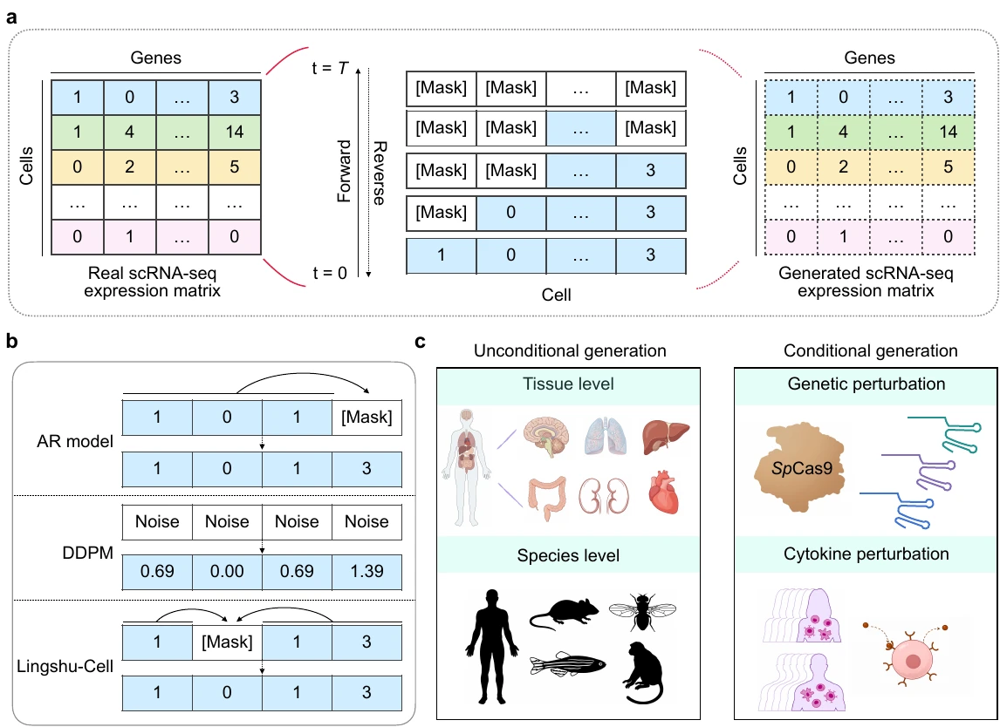
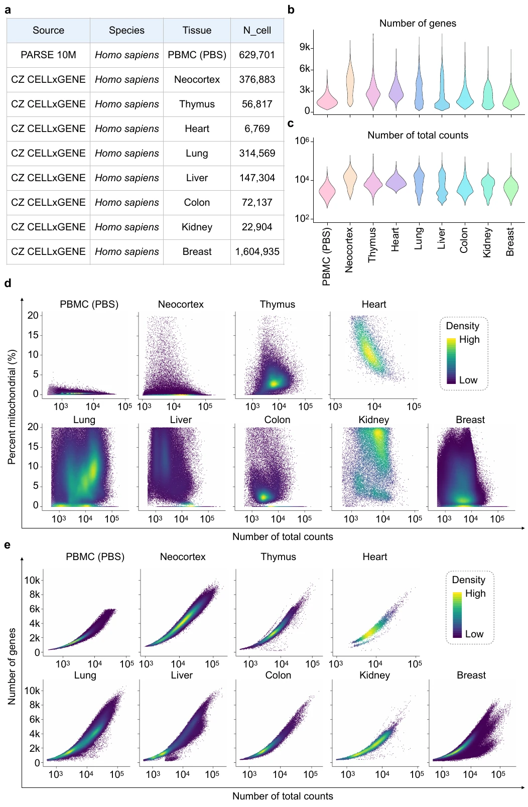
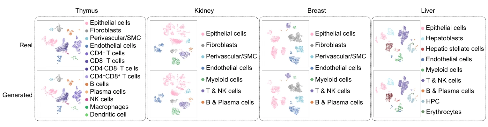
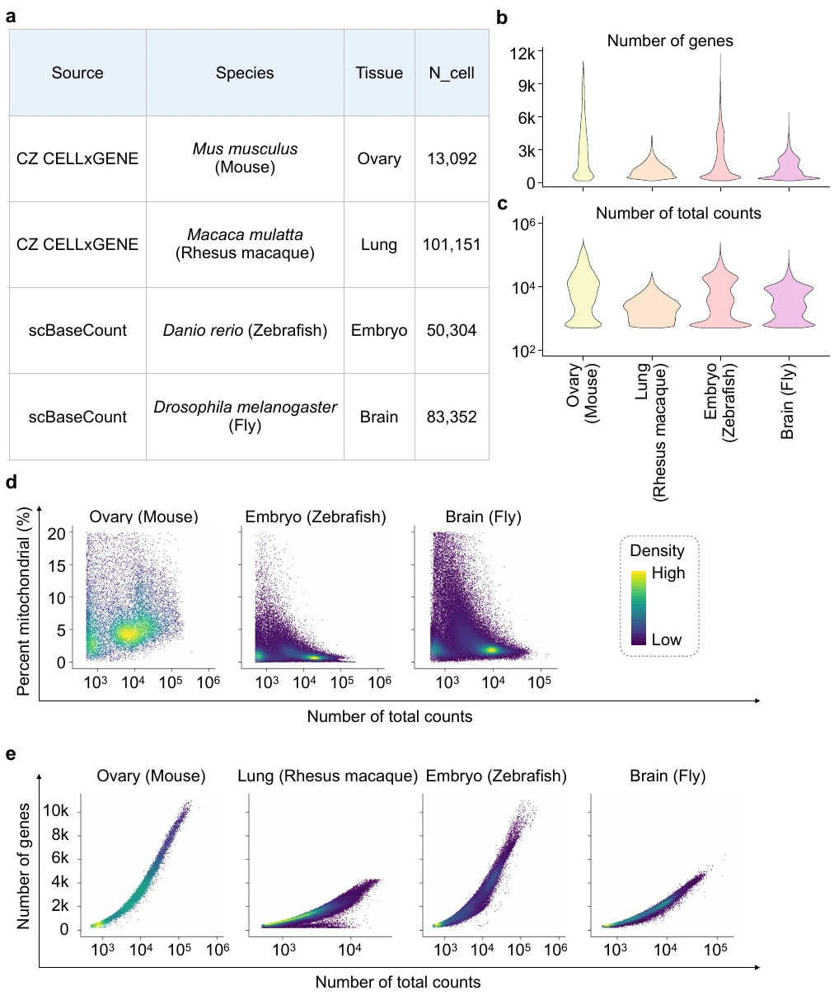

> **材料性质声明（2026-09-18 补记）。** 本文件是 Lingshu-Cell 论文的**机器转换中文阅读副本**（转述材料，不替代原文）。正文与数据以 [arXiv:2603.25240v1](https://arxiv.org/abs/2603.25240v1) 及出版方原文为准。
>
> `images/` 下的四张图取自论文公开页面，原为 PNG，已转 WebP q90 以控制仓库体积（1.2 MB → 484 KB）。`Figure_2` 与 `architecture-diagram` 两图在源页面未提供可下载副本，正文相应位置已注明；架构图按 `AGENTS.md`「教程图片」的分类应由本地 `drawio-skill` 按事实边界文件重绘，不沿用外部生成图。

【**摘要**】细胞状态建模及其扰动响应预测，是计算生物学和虚拟细胞开发中的核心挑战。**现有单细胞转录组基础模型能够提供强大的静态表征，却未显式建模细胞状态分布以支持生成式模拟。**

本文提出 Lingshu-Cell，一种**掩码离散扩散模型（masked discrete diffusion model, MDDM）**，用于**学习转录组状态分布并支持扰动条件下的条件模拟。**Lingshu-Cell 直接在离散词元空间中运行，与单细胞转录组数据稀疏、非序列化的特性相适配；它无需进行高变基因筛选或按表达量排序等先验基因选择，便能捕获约 18,000 个基因之间复杂的全转录组表达依赖关系。

在多种组织和物种上，Lingshu-Cell 均能准确复现转录组分布、标志基因表达模式和细胞亚型比例，表明其能够捕捉复杂的细胞异质性。此外，通过将细胞类型或供体身份与扰动联合嵌入，Lingshu-Cell 能够预测新的“身份-扰动”组合所产生的全转录组表达变化。该模型在 Virtual Cell Challenge 的 H1 遗传扰动基准上取得领先表现，并在人外周血单个核细胞（PBMC）的细胞因子诱导响应预测中表现出色。综上，Lingshu-Cell 是一种灵活的细胞世界模型，可用于细胞状态和扰动响应的计算机模拟，为生物学发现和扰动筛选的新范式奠定了基础。

# 引言
---

过去十年，大规模单细胞 RNA 测序（scRNA-seq）数据集迅速增长，使研究者得以在不同组织、物种和生理条件下越来越全面地刻画细胞状态。然而，基于这些图谱的大多数分析仍以描述为主，侧重注释、聚类和比较性表征，而非预测性建模。因此，**一个核心挑战是开发能够捕获细胞状态分布、生成逼真的细胞异质性，并模拟细胞如何响应扰动的计算框架。**这类生成能力将带来重要的生物学应用，使研究者能够开展大规模计算机实验，以解析疾病机制、筛选潜在治疗方案并描绘复杂的发育轨迹。

为概括这一总体目标，我们正式提出**“细胞世界模型”（cellular world model）**这一综合框架概念。类似于人工智能中学习环境紧凑表征并支持条件模拟的世界模型，**细胞世界模型旨在表征转录组状态分布及其条件动态**。通过显式建模这一内在状态空间，此类系统可推动单细胞生物学从静态编目迈向能够高保真模拟细胞状态及干预响应的计算机环境。

受自然语言处理基础模型成功经验的启发，近期用于转录组的大规模自监督学习方法，包括 scGPT、Geneformer、scFoundation 和 CellFM，已经证明预训练基础模型能够捕获基因表达中的可迁移结构，并在不同数据集间将细胞组织到共享表征空间中（Cui et al., 2024；Theodoris et al., 2023；Hao et al., 2024；Zeng et al., 2025）。然而，这些模型主要针对静态表征学习进行优化，而不是生成式模拟。scDiffusion 和 scVI 等现有生成方法虽在转录组生成和扰动建模方面展现潜力，但其性能受限于连续数据假设，而这一假设与单细胞转录组数据稀疏、离散且非序列化的特性并不匹配（Luo et al., 2024；Lopez et al., 2018）。与此同时，STATE、CellFlow、scDFM 和 AlphaCell 等专注扰动的方法通常学习从对照状态和扰动条件到扰动结果的直接映射（Adduri et al., 2025；Klein et al., 2025；Yu et al., 2026；Chuai et al., 2026）。这些方法对特定预测任务有效，却不建模转录组状态的底层分布及其条件动态。这些局限共同表明，我们需要一种能够显式表征转录组状态空间并支持扰动条件模拟的细胞世界模型。

本文提出 Lingshu-Cell，**一种用于细胞状态全转录组生成建模的掩码离散扩散模型。**Lingshu-Cell 以离散基因表达词元为对象，通过“掩码-预测”目标进行训练。该设计能够以非自回归、双向迭代方式优化整个转录组表达谱，同时适配 scRNA-seq 数据稀疏、非序列化的特点。Lingshu-Cell 无需进行高变基因筛选或按表达量排序等先验基因选择，即可直接建模约 18,000 个基因的全转录组表达，并捕获细胞异质性背后复杂的组合式基因表达模式。

在涵盖 9 种组织和 5 个物种的大规模单细胞数据集上，Lingshu-Cell 能够复现真实 scRNA-seq 数据的转录组分布、标志基因表达模式和细胞亚型比例，从而逼真地模拟异质性细胞群。此外，Lingshu-Cell 将细胞类型或供体身份与扰动背景（例如遗传扰动或细胞因子扰动）嵌入同一潜在空间，以建模扰动引起的全转录组表达变化。模型仅使用约 60 万个训练细胞，便在 Virtual Cell Challenge H1 遗传扰动基准上取得领先表现，并在人 PBMC 的细胞因子扰动预测中展现出强劲结果。总体而言，Lingshu-Cell 是一种灵活的细胞世界模型，可跨多种生物学背景开展虚拟细胞建模和计算机扰动分析，为生物学发现和扰动筛选的新范式奠定基础。

# 结果
---

## Lingshu-Cell 框架概览

为在单细胞分辨率下全面建模基因表达并刻画细胞状态，我们开发了 Lingshu-Cell：一种基于掩码离散扩散模型架构的单细胞转录组数据生成框架。给定真实 scRNA-seq 表达矩阵，Lingshu-Cell 通过两个耦合过程运行：在正向过程中，每个细胞的基因表达值从原始观测状态（$ t=0 $）逐步被掩码，直至完全掩码状态（$ t=T $）；在反向过程中，模型迭代预测被掩码的基因表达值，最终生成符合生物学规律的 scRNA-seq 表达谱（图 1a 和补充图 1）。

这种“掩码-预测”范式使 Lingshu-Cell 能够学习复杂的基因调控依赖关系，同时自然适应基因表达谱的无序结构。因此，它既不需要自回归（AR）模型所要求的任意生成顺序，也避开了去噪扩散概率模型（DDPM）使用的全局连续噪声破坏过程（Ho et al., 2020；图 1b）；后者与原始 scRNA-seq 计数离散且通常高度稀疏的特性并不匹配。借助这一设计，我们将 Lingshu-Cell 用于无条件生成，以模拟不同人体组织和物种的转录组表达谱；也将其用于条件生成，以预测细胞对遗传扰动和细胞因子扰动的响应（图 1c），从而向实用的虚拟细胞模型迈进。

> **图 1｜Lingshu-Cell 框架概览。** **a，** Lingshu-Cell 使用掩码离散扩散模型学习并生成单细胞转录组数据。正向过程中，基因表达值从 $ t=0 $ 到 $ t=T $ 逐步被掩码；反向过程中，模型迭代预测被掩码的值，以生成逼真的 scRNA-seq 表达谱。**b，** 生成范式比较。自回归模型依赖固定的顺序，DDPM 则用连续噪声破坏所有位置；与二者不同，Lingshu-Cell 以不依赖顺序的方式随机掩码和预测基因表达值，这与基因表达数据的无序结构天然兼容。**c，** Lingshu-Cell 的应用场景，包括跨人体组织和物种的无条件生成，以及遗传扰动和细胞因子扰动响应预测的条件生成。
>

## Lingshu-Cell 可跨物种、跨组织准确模拟细胞状态

为验证 Lingshu-Cell 对细胞基因表达建模的基础能力，我们首先在 PARSE 10M PBMC 数据集的 PBS 对照子集（629,701 个细胞）上训练模型，随后随机生成 10,000 个细胞，这一规模与典型 scRNA-seq 实验相当。比较真实数据与生成数据后，我们发现 Lingshu-Cell 忠实复现了 PBMC 五大谱系，即 T 细胞、NK 细胞、B 细胞、单核细胞和树突状细胞的标志基因表达模式（图 2a）。生成数据的细胞类型比例也与真实数据高度一致（图 2b）。

> **图 2｜Lingshu-Cell 跨物种和组织的无条件细胞状态生成。** **a，** PARSE-PBMC 数据集中真实与生成细胞（各随机抽取 10,000 个）的 UMAP 可视化，分别按细胞类型注释（左）和各细胞类型经典标志基因的归一化表达量（log1p）着色。**b，** 真实数据与生成数据的细胞类型比例比较。**c，** 在 PARSE-PBMC 数据集上使用 Pearson 相关、Spearman 相关、MMD、1-WD 和 iLISI 五项指标，对 Lingshu-Cell、scDiffusion 与 scVI 进行定量基准比较。**d，** 人体组织的无条件生成结果，包括新皮层、心脏、肺和结肠；UMAP 图展示按细胞类型着色的真实细胞（上）和生成细胞（下）。**e，** 小鼠、恒河猴、斑马鱼和果蝇等多个物种的无条件生成结果。
>

为减少生成细胞数量较少可能带来的采样变异，我们进一步将生成规模扩大到 200,000 个细胞。正如预期，标志基因表达模式（补充图 2a）和细胞类型比例（补充图 2b）仍与真实数据高度一致。在这一更大规模上，我们进行了更高分辨率的注释，将 PBMC 进一步划分为 17 个亚型（补充图 2c）。生成数据与真实数据仍然紧密吻合，说明 Lingshu-Cell 在标准规模和超大规模下均能稳健模拟细胞基因表达。

> （此处原引用 `images/Figure_2.png`，源文档未提供可下载副本，已移除死链；对应数据见表 1。）

> **表 1｜Lingshu-Cell 在人体组织和非人物种上的无条件生成性能。** ↑ 表示越高越好，↓ 表示越低越好。
>

| **类别** | **组织** | **Pearson ↑** | **Spearman ↑** | **MMD ↓** | **iLISI ↑** | **1-WD ↓** |
| --- | --- | ---: | ---: | ---: | ---: | ---: |
| 人体组织（CZ CELLxGENE） | 新皮层 | 0.9995 | 0.9991 | 0.0128 | 0.9053 | 0.0105 |
| 人体组织（CZ CELLxGENE） | 心脏 | 0.9992 | 0.9987 | 0.0196 | 0.8972 | 0.0096 |
| 人体组织（CZ CELLxGENE） | 肺 | 0.9967 | 0.9970 | 0.0314 | 0.8906 | 0.0159 |
| 人体组织（CZ CELLxGENE） | 结肠 | 0.9966 | 0.9960 | 0.0376 | 0.8815 | 0.0152 |
| 非人物种 | 小鼠 - 卵巢 | 0.9996 | 0.9989 | 0.0116 | 0.9011 | 0.0077 |
| 非人物种 | 恒河猴 - 肺 | 0.9985 | 0.9970 | 0.0218 | 0.8926 | 0.0149 |
| 非人物种 | 斑马鱼 - 胚胎 | 0.9983 | 0.9974 | 0.0143 | 0.9035 | 0.0089 |
| 非人物种 | 果蝇 - 脑 | 0.9984 | 0.9929 | 0.0163 | 0.8876 | 0.0107 |

我们使用五项互补指标，在 PBMC 数据集上将 Lingshu-Cell 与 scDiffusion 和 scVI 进行了量化比较（Luo et al., 2024；Lopez et al., 2018）：Pearson 和 Spearman 相关用于评估表达一致性；最大均值差异（MMD）、基因平均 1-Wasserstein 距离（1-WD）和整合局部逆 Simpson 指数（iLISI）用于评估分布相似性与整合质量（图 2c）。三种方法的基因表达相关性均很高，说明它们都能捕获全局基因表达模式。相比之下，MMD、1-WD 和 iLISI 更清楚地揭示了生成质量差异。Lingshu-Cell 的 MMD 最低，为 0.0088，而 scDiffusion 和 scVI 分别为 0.0178 和 0.0343，表明其生成表达分布与真实分布整体最为接近；这一结论也与细胞级 UMAP 可视化和细胞类型比例分析的趋势一致。Lingshu-Cell 在全部五项指标上表现最佳，进一步说明其对 PBMC scRNA-seq 数据集的建模最为忠实。

为进一步评估跨组织泛化能力并降低数据集特异性影响，我们从 CZ CELLxGENE 数据库汇集了 2,602,318 个细胞，覆盖 8 种人体组织：新皮层、胸腺、心脏、肺、肝、结肠、肾和乳腺（CZI Cell Science Program et al., 2025）。质量控制和汇总统计显示，不同组织和批次之间存在显著异质性，包括细胞数量、检出基因数、总计数和线粒体读段比例上的巨大差异（补充图 3）。尽管如此，Lingshu-Cell 在每种组织中都能稳定生成高质量样本，准确捕获主要细胞类型以及组织特异性细胞类型（图 2d、补充图 4 和表 1）。

此外，我们将 Lingshu-Cell 扩展到另外 4 个物种的单细胞数据集，共计 247,899 个细胞，覆盖小鼠卵巢、恒河猴肺、斑马鱼胚胎和果蝇脑等不同组织。尽管这些数据集的质量控制指标和数据分布也存在显著差异（补充图 5），Lingshu-Cell 仍能高保真地生成相应细胞类型（图 2e 和表 1）。综上，Lingshu-Cell 在跨组织、跨物种的无条件生成场景中表现出可靠的泛化能力，为进一步评估受控扰动条件下的性能奠定了基础。

## Lingshu-Cell 可准确预测细胞系中遗传扰动引起的单细胞转录组响应

鉴于 Lingshu-Cell 在无条件场景下对细胞基因表达分布表现出强大的建模能力，我们进一步考察同一框架能否支持遗传扰动响应的条件生成（图 3a）。Lingshu-Cell 直接在离散词元空间中运行，因此可以把细胞类型身份和扰动靶点信息作为附加词元，置于表达序列之前，从而在统一建模框架内实现条件生成（图 3b）。这种设计使模型能够利用不同细胞类型间共享的扰动响应模式，并泛化到此前未见过的“细胞类型-扰动靶点”组合。

> **图 3｜Lingshu-Cell 准确预测细胞系中遗传扰动引起的单细胞转录组响应。** **a，** 基于 CRISPR 的遗传扰动及其引起的转录组变化示意图。**b，** 扰动预测的条件生成框架。细胞类型和扰动靶点作为条件输入，掩码扩散模型迭代预测基因表达值，生成扰动特异性表达谱。**c，** Lingshu-Cell 的三个设计组件：无分类器引导（CFG）、序列压缩和生物学先验注入（见方法）。**d，** CFG 引导权重的消融实验。柱状图展示 H1 测试集（$ n=100 $ 个扰动靶点）上八项指标的预测性能：DES、PDS、MAE、Spearman #DEG、Spearman LFC、AUPRC、Pearson-$ \Delta $ 和平均得分。**e，** 序列压缩消融实验，对比未压缩输入以及大小为 8 和 32 的分块。**f，** 生物学先验注入消融实验，对比有无先验注入时的预测性能。在 **d-f** 中，红色指标表示相较对应消融基线有所改善。
>

我们在 Virtual Cell Challenge（VCC）的 H1 遗传扰动数据集上评估条件生成（Roohani et al., 2025）。训练数据包括外部细胞系中与 H1 数据集所定义的 300 个扰动靶点重叠的全部扰动表达谱（$ n=323,913 $ 个细胞），以及针对 150 个训练靶点的 H1 细胞（$ n=183,097 $）。训练集还纳入未扰动对照细胞，以支持无分类器引导（classifier-free guidance, CFG；Ho & Salimans, 2021；详见第 4.4 节和补充材料第 7.2 节）。模型在 H1 细胞中的 50 个验证靶点（$ n=60,751 $）和 100 个测试靶点（$ n=132,670 $）上评估；这些靶点在训练期间均被留出。

为提高预测准确性，我们加入了三种针对条件生成不同方面的互补策略。第一，使用 CFG 将采样引导至与扰动条件更一致的转录组状态，从而提高生成扰动响应的保真度（图 3c 左）。第二，使用序列压缩，将高维基因表达序列转化为更短、信息密度更高的嵌入序列；这不仅提高建模效率，也有利于捕获全局表达模式（图 3c 中）。第三，引入生物学先验投影：先在各外部细胞系中识别受影响基因，再取并集形成扰动特异性先验基因集。在生成开始时，优先用该先验集初始化被掩码的位置，从而向采样过程注入有生物学依据的先验知识（图 3c 右）。

> **表 2｜VCC 排行榜上的遗传扰动预测。** 队伍按最终名次排列；平均排名为前 25 支队伍各指标排名的平均值；每列最佳结果加粗。完整前 25 名见补充表 1。
>

| **队伍** | **平均排名 ↓** | **DES ↑** | **PDS ↑** | **MAE ↓** | **Sp. #DEG ↑** | **Sp. LFC ↑** | **AUPRC ↑** | **Pearson-**$ \Delta $** ↑** |
| --- | ---: | ---: | ---: | ---: | ---: | ---: | ---: | ---: |
| Lingshu-Cell | **8.7** | 0.216 | 0.748 | **0.052** | 0.394 | 0.331 | 0.272 | **0.306** |
| cleopatra | 9.1 | 0.228 | 0.747 | 0.086 | 0.473 | **0.396** | 0.266 | 0.203 |
| xBio | 10.7 | 0.305 | **0.811** | 0.770 | **0.564** | 0.087 | 0.252 | 0.217 |
| Cellock Holmes | 10.9 | **0.356** | 0.679 | 0.239 | 0 | 0.238 | 0.576 | 0.125 |
| Shippers | 11.0 | 0.354 | 0.699 | 0.231 | 0 | 0.227 | 0.576 | 0.123 |
| Mean Predictors | 11.4 | 0.305 | 0.741 | 6.723 | 0.294 | 0.213 | **0.582** | 0.217 |

我们随后逐一进行消融实验，以量化每个组件的贡献。正如预期，三种策略都带来了可测量的性能提升。其中，移除 CFG 会使结果变差，尤其是在扰动方向相似度和基于相关性的指标上；这与 CFG 将生成过程偏向扰动表达流形的作用一致。在测试的引导强度中，$ \mathrm{CFG}=2 $ 的整体表现最佳（图 3d）。序列压缩也有显著影响：大小为 32 的分块在平均得分和 Spearman #DEG 相关上均优于更小分块，其 Spearman #DEG 达到 0.405，而分块大小为 8 时仅为 0.292（图 3e）。这表明适度压缩有助于表征高维基因表达信号。加入生物学先验还进一步改善了扰动方向相似度和 Pearson-$ \Delta $ 相关（图 3f），支持将跨外部细胞系汇总的扰动先验引入生成过程。

整合全部三种策略后，Lingshu-Cell 在 VCC H1 测试集上取得最佳整体性能。我们进一步将完整模型与 Virtual Cell Challenge 中表现最好的已发表方法进行比较（见方法）。在七项评估指标上，Lingshu-Cell 的平均排名最佳（表 2），说明它在全部比较方法中表现最为稳定。其 MAE 最低（0.052），Pearson-$ \Delta $ 相关最高（0.306）。虽然其他方法在个别指标上排名第一，但 Lingshu-Cell 在七项评估标准间实现了最佳整体平衡。

这些结果表明，作为通用生成模型，Lingshu-Cell 能够有效预测遗传扰动引起的转录组响应，并在标准基准上超越任务专用预测模型。

## Lingshu-Cell 可准确预测 PBMC 中细胞因子扰动引起的单细胞转录组响应

在细胞系系统的遗传扰动预测中取得强劲表现后，我们进一步考察 Lingshu-Cell 能否外推到另一种扰动模态和更高层次的生物复杂性。为此，我们在 PARSE 10M PBMC 数据集上评估细胞因子驱动的转录组扰动。该数据集包含 12 名供体的 PBMC，每名供体均接受 90 种不同细胞因子条件以及未扰动 PBS 对照（图 4a）。与遗传扰动场景相同，条件生成通过在表达序列前添加条件词元来实现；在这里，供体身份和细胞因子条件作为附加词元，使模型能在供体背景和刺激类型的联合条件下生成转录组响应（图 4b）。与前述基于细胞系遗传扰动的基准不同，这一任务要求对不同个体来源免疫细胞中的信号诱导响应进行建模。为评估泛化能力，我们从 12 名供体中随机选择 4 名，并对每名供体留出 70% 的细胞因子条件（90 种中的 63 种）作为测试集。

> **图 4｜Lingshu-Cell 准确预测 PBMC 中细胞因子扰动引起的单细胞转录组响应。** **a，** 细胞因子诱导转录组扰动示意图。**b，** 细胞因子扰动预测的条件生成框架。供体身份和细胞因子条件作为条件输入，掩码扩散过程迭代预测基因表达值，以生成扰动特异性表达谱。**c，** Lingshu-Cell、PertMean、STATE、scGPT 和 scVI 在 PARSE 10M PBMC 数据集上的预测性能，使用图 3d 所定义的八项指标进行评估。测试集包含 12 名供体中的 4 名，每名供体留出 70% 的细胞因子条件（90 种中的 63 种）。柱表示供体间平均性能；误差线表示四分位距（Q1-Q3）；点表示各供体的单独数值。Lingshu-Cell 在所有方法中表现最佳的指标以红色标出。
>

Lingshu-Cell 在所有评估方法中取得最高平均得分（图 4c）。在整体表达谱层面，它的 PDS 和 Pearson-$ \Delta $ 相关均排名第一，说明预测转录组既保留了各细胞因子条件的独特身份，也准确捕获了细胞因子诱导表达变化的方向和幅度。在差异表达层面，Lingshu-Cell 的跨扰动 Spearman #DEG 相关同样最高，表明它正确恢复了不同细胞因子所诱导转录响应的相对强度。结合 DES、Spearman LFC 和 AUPRC 上的良好表现，这些结果说明 Lingshu-Cell 不仅识别出各细胞因子的响应基因，也捕获了其转录效应的总体尺度和结构。

这些发现表明，Lingshu-Cell 能从细胞系中的遗传扰动泛化到供体来源 PBMC 中的细胞因子刺激，支持其跨扰动模态和生物学背景的适用性。尽管遗传扰动和细胞因子刺激的作用机制根本不同，Lingshu-Cell 在两种场景中均达到领先水平（图 3、图 4）。这一一致性凸显了条件生成框架作为统一方法预测不同实验背景下多种扰动细胞响应的潜力。

# 讨论
---

Lingshu-Cell 表明，掩码离散扩散模型可以作为统一的单细胞转录组生成框架，为细胞世界模型奠定计算基础。Lingshu-Cell 无需依据高变性或表达水平进行先验基因选择，即可直接建模约 18,000 个基因的全转录组表达，从而推动单细胞基础模型由静态表征学习走向生成式模拟。在同一架构内，它既能跨多种组织和物种进行高保真细胞生成、捕获真实细胞异质性，也能成功预测遗传扰动（VCC）和细胞因子扰动（PARSE）的响应。这些结果共同标志着向交互式虚拟细胞迈出的关键一步。

这一成功源于计算范式与生物数据物理属性之间的匹配。掩码离散扩散模型在离散表达空间中运行，避免了自回归模型人为引入的基因顺序偏置（Austin et al., 2021；Nie et al., 2025）、变分自编码器的信息瓶颈（Alemi et al., 2017），以及连续噪声过程与稀疏离散计数数据之间的分布不匹配（Risso et al., 2018；Vignac et al., 2023），因而天然契合转录组测量固有的置换不变性与零膨胀稀疏性。

尽管实证结果强劲，仍有若干局限值得讨论。第一，目前的评估依赖群体层面的分布指标（如 MMD、iLISI）和伪批量相关性，无法充分评估单细胞层面的生物学合理性，也无法判断极稀有状态是否得以保留。更根本地说，高保真生成并不等同于生物学因果性：对表达分布的忠实复现，不一定反映产生这些分布的因果调控机制。因此，目前应将 Lingshu-Cell 视为一种强大的概率性假设生成工具，其预测仍需严格的湿实验验证。最后，当前模型仅处理转录组数据；更完整的虚拟细胞还应整合表观基因组、蛋白质组、代谢组和空间模态（Hao et al., 2021；Argelaguet et al., 2020；Dries et al., 2021）。

本研究自然引出了若干值得探索的方向。一个重要的下一步，是将当前框架从单基因扰动扩展到更复杂的干预，包括药物诱导、多靶点和组合干预；在这些场景中，剂量依赖性和时间动态可能发挥关键作用（Lotfollahi et al., 2019；Hetzel et al., 2022；Bergen et al., 2020）。更广泛地说，我们设想在同一离散扩散框架内联合建模染色质可及性、蛋白质丰度和空间分辨转录组，并引入时间结构以模拟细胞分化和疾病进展等动态轨迹。最终，最具吸引力的应用之一可能是闭环实验：模型预测指导有针对性的扰动，而新生成的数据又迭代改进模型本身。这一框架将超越静态数据拟合，成为生物学发现的自适应平台。从这个意义上说，Lingshu-Cell 证明了 MDDM 是一种很有前景的细胞行为建模范式，为真正具有预测能力的细胞世界模型铺平了道路。

# 方法
---

我们首先介绍 Lingshu-Cell 所依据的一般掩码扩散形式，然后说明如何将单细胞表达谱表示为离散词元序列，用于模型训练与生成。随后介绍框架的主要方法组件，包括嵌入空间序列压缩、条件生成，以及推理阶段的生物学先验注入。

## 预备知识

本节介绍构成 Lingshu-Cell 基础的掩码离散扩散模型（MDDM）概念。

设 $ x_0=[x_0^1,x_0^2,\dots,x_0^L] $ 为长度为 $ L $ 的完全观测离散序列，其中每个词元 $ x_0^i $ 均属于预定义词表 $ \mathcal{V} $。为在不引入自回归模型从左到右归纳偏置的情况下建模联合分布 $ p_{\text{data}}(x_0) $，MDDM 引入一个正向掩码过程和一个可学习的反向生成过程。

### 正向过程

正向过程沿连续时间变量 $ t\in[0,1] $，逐步且独立地掩码 $ x_0 $ 中的词元。当 $ t=0 $ 时，序列完全干净；当 $ t=1 $ 时，序列完全被掩码，即成为由特殊掩码词元 $ M\notin\mathcal{V} $ 构成的序列。在任意中间时刻 $ t $，部分掩码序列 $ x_t $ 中的每个词元 $ x_t^i $ 都以概率 $ t $ 被独立替换为 $ M $，或以概率 $ 1-t $ 保持为原词元。形式化地，转移概率定义为：

$ q_{t|0}(x_t^i|x_0^i)=
\begin{cases}
1-t, & x_t^i=x_0^i,\\
t, & x_t^i=M.
\end{cases}
\tag{1} $

### 反向过程与训练目标

反向过程旨在随着 $ t $ 从 1 过渡回 0，通过迭代预测被掩码的词元来恢复真实数据分布。该过程的核心是参数化掩码预测神经网络 $ p_\theta(\cdot|x_t) $；它以部分掩码序列 $ x_t $ 为输入，同时预测所有掩码位置上的原始词元。

模型仅使用掩码词元上计算的交叉熵损失进行优化：

$ \mathcal{L}(\theta)\triangleq-\mathbb{E}_{t,x_0,x_t}\left[\frac{1}{t}\sum_{i=1}^{L}\mathbb{I}[x_t^i=M]\log p_\theta(x_0^i|x_t)\right],
\tag{2} $

其中 $ t\sim\mathcal{U}(0,1) $，$ \mathbb{I}[\cdot] $ 为示性函数。该目标为真实数据分布负对数似然提供了有理论依据的变分上界。

### 推理与采样

推理时，生成从长度为 $ L $ 的全掩码序列 $ x_1 $ 开始。反向过程被离散为 $ N $ 步。当某个中间步骤从时间 $ t\in(0,1] $ 过渡到 $ s\in[0,t) $ 时，掩码预测器 $ p_\theta(\cdot|x_t) $ 会估计所有掩码词元。随后，将预测词元中的一部分重新掩码（其期望比例为 $ s/t $）以构造 $ x_s $，从而确保该转移与正向过程的动力学一致。

## 将单细胞数据表示为离散序列

MDDM 在离散词元序列上运行。本节说明如何将每个细胞以 UMI 计数测得的基因表达谱映射为这种离散序列，从而定义训练和生成共用的建模空间。

### 单细胞数据准备

设 $ \mathbf{X}\in\mathbb{Z}_{\geq0}^{N\times G} $ 为“细胞 × 基因”UMI 计数矩阵，其中 $ N $ 为细胞数，$ G $ 为基因数。第 $ i $ 个细胞在固定基因列表上的表达由计数向量 $ \mathbf{x}^{(i)}=(x_1^{(i)},\dots,x_G^{(i)})\in\mathbb{Z}_{\geq0}^{G} $ 表示。UMI 计数矩阵使用标准单细胞分析流程预处理，详见补充材料。

### 量化

尽管 UMI 计数是离散的，但其动态范围宽且具有重尾，直接按精确计数进行词元化效率很低。因此，我们将每个基因的计数量化为有限个表达水平，在保留低计数区分辨率的同时缩小离散状态空间。定义一个共享量化函数，包含 $ B $ 个非溢出区间和一个统一溢出词元 $ \text{OVF} $：

$ q:\mathbb{Z}_{\geq0}\rightarrow\{0,1,\dots,B-1\}\cup\{\text{OVF}\},
\tag{3} $

并将每个元素映射为区间索引 $ z_g^{(i)}=q(x_g^{(i)}) $。建模范围的上限为 $ C $，具体定义为：

$ q(x)=
\begin{cases}
x, & 0\leq x<100,\\
100+90\cdot\max(0,k(x)-2)+r(x), & 100\leq x\leq C,\\
\text{OVF}, & x>C,
\end{cases}
\tag{4} $

其中

$ k(x)=\left\lfloor\log_{10}(\max(x,1))\right\rfloor,
\tag{5} $

且当 $ x\geq100 $ 时，

$ r(x)=\left\lfloor\frac{x-10^{k(x)}}{\Delta(x)}\right\rfloor,
\qquad
\Delta(x)=10^{k(x)-1}.
\tag{6} $

这里，$ k(x) $ 表示 $ x $ 的十进数量级索引，$ r(x) $ 表示该十进区间内的偏移量，$ \Delta(x) $ 是相应尺度上的自适应步长。这种构造为 $ [0,99] $ 提供 100 个区间，并为每个 $ [10^k,10^{k+1}) $（$ k\geq2 $）提供 90 个区间。因此，该量化大致保留 $ x $ 的前两位有效数字。

除非另有说明，全文使用 $ C=9999 $。此时非溢出词表大小为 $ B=100+90+90=280 $，加入溢出词元后 $ |\mathcal{V}|=281 $；这不包括 MDDM 训练设置中的 `[MASK]` 等特殊词元。

### 离散序列表示

最后，将量化函数逐元素应用于每个细胞，得到离散序列 $ \mathbf{z}^{(i)}\in\mathbb{Z}_{\geq0}^{G} $：

$ \mathbf{z}^{(i)}=\left(q(x_1^{(i)}),q(x_2^{(i)}),\dots,q(x_G^{(i)})\right),
\tag{7} $

该序列即为 MDDM 将单细胞数据建模为离散序列时的输入和输出空间。

## 嵌入空间序列压缩

单细胞表达谱建立在较大的固定基因集上，因此输入序列很长，完整序列的 Transformer 建模计算成本高昂。为在不改变词元级建模目标的情况下减少成本，我们引入了在嵌入空间中运行的序列压缩模块。该模块缩短 Transformer 内部处理的序列，同时保持模型原有的输入和输出接口。

设 $ \mathbf{E}\in\mathbb{R}^{G\times D} $ 为某个细胞的词元嵌入序列，其中 $ G $ 为基因数，$ D $ 为嵌入维度。模型初始化时，我们在基因位置上采样并固定一个随机置换 $ \pi $，将其应用于 $ \mathbf{E} $，再把重排后的序列划分为大小为 $ S $ 的连续分组，必要时在末尾填充。令 $ G_{\mathrm{c}}=\lceil G/S\rceil $ 为压缩序列长度，每个分组后的嵌入块 $ \mathbf{E}^{\pi}_{(i)}\in\mathbb{R}^{S\times D} $ 被展平，并通过共享线性映射 $ W_{\mathrm{down}}\in\mathbb{R}^{D\times(SD)} $ 投影为一个 $ D $ 维向量：

$ \mathbf{H}_i=W_{\mathrm{down}}\,\mathrm{vec}\!\left(\mathbf{E}^{\pi}_{(i)}\right),
\qquad i=1,\dots,G_{\mathrm{c}},
\tag{8} $

其中 $ \mathbf{E}^{\pi}=\pi(\mathbf{E}) $。得到的压缩序列 $ \mathbf{H}=[\mathbf{H}_1,\dots,\mathbf{H}_{G_{\mathrm{c}}}]^\top\in\mathbb{R}^{G_{\mathrm{c}}\times D} $ 随后由 MDDM 的 Transformer 主干处理。

经过 Transformer 模块后，在输出投影层之前，使用共享线性上投影 $ W_{\mathrm{up}}\in\mathbb{R}^{(SD)\times D} $ 将嵌入序列恢复到完整长度。每个压缩表征被映射回 $ S\times D $ 的块，在各分组间拼接，再通过 $ \pi^{-1} $ 重排以恢复原始基因顺序：

$ \begin{aligned}
\widehat{\mathbf{E}}^{\pi}_{(i)}&=\mathrm{unvec}\!\left(W_{\mathrm{up}}\mathbf{H}_i\right),\qquad i=1,\dots,G_{\mathrm{c}},\\
\widehat{\mathbf{E}}&=\pi^{-1}\!\left(\mathrm{concat}\left(\widehat{\mathbf{E}}^{\pi}_{(1)},\dots,\widehat{\mathbf{E}}^{\pi}_{(G_{\mathrm{c}})}\right)\right).
\end{aligned}
\tag{9} $

因此，压缩仅应用于模型内部计算，词元级预测空间保持不变。实践中，这显著减少了训练和推理计算量。此外，随机分组与线性投影对多基因信号进行了简单的线性混合，从而降低单基因噪声的影响，并提高扰动条件下的稳健性。

## 条件生成
### 条件编码

在扰动响应预测中，Lingshu-Cell 以背景 $ c $ 为条件生成单细胞表达词元序列。在本文设置中，$ c $ 包含两个组成部分：一是指定细胞背景的来源条件（如细胞系或供体），二是指定所施加干预的扰动身份（如靶基因或细胞因子）。每个条件值由一个专用离散词元表示，并加入表达词元词表 $ \mathcal{V} $；因此，条件词元与表达序列使用相同的离散词元空间编码。

两个条件词元被置于表达词元序列之前，形成完整模型输入。在整个正向破坏过程中，这些条件词元不参与掩码，从而使条件信号在每个扩散步骤都保持可用。在这一形式下，掩码预测器由无条件分布 $ p_\theta(x_0|x_t) $ 扩展为条件分布 $ p_\theta(x_0|x_t,c) $。

### 训练过程

无条件模型按照式（2）学习 $ p(\mathbf{x}) $；条件变体则在输入中增加不被掩码的条件词元，并使用相同目标建模 $ p(\mathbf{x}|c) $。

训练条件模型时，同时纳入扰动细胞和对照细胞。没有扰动特异性靶点条件的细胞被赋予生物学中性的对照标签 $ c_{nt} $（例如 `non-targeting` 条件），而非视为缺失条件的输入。由此，条件模型可在同一组参数内同时学习扰动特异性生成和对照状态生成。

### 使用无分类器引导进行采样

推理时，我们使用 CFG 增强扰动特异性生成。在每个去噪步骤，均分别在目标条件 $ c $ 和上述对照条件 $ c_{nt} $ 下评估条件模型。

设 $ a_\theta(v|x_t,c) $ 表示条件 $ c $ 下某个掩码位置对词表词元 $ v $ 的 logits，$ \tilde{a}_\theta(v|x_t,c) $ 表示相应的 CFG 引导 logits，则：

$ \tilde{a}_\theta(v|x_t,c)=a_\theta(v|x_t,c_{nt})+(w+1)\left(a_\theta(v|x_t,c)-a_\theta(v|x_t,c_{nt})\right),
\tag{10} $

其中 $ w\geq0 $ 为引导尺度。$ w=0 $ 时恢复标准条件生成；$ w $ 越大，相对于对照条件，扰动特异性信号受到的强调越强。在每个去噪步骤，通过 softmax 将引导后的 logits 转换为采样概率。

## 推理阶段的生物学先验注入

扰动诱导的转录变化相对于背景变异往往较为细微，因此扰动响应预测十分困难。为此，我们在推理阶段引入轻量级生物学先验：利用其他人细胞系中测试集目标扰动的表达谱。对于每种扰动，我们构建下调基因集合 $ G_{\downarrow} $，其中包括扰动靶基因，以及在各参考细胞系中识别出的下调基因；最终先验集合取所有可用参考细胞系的并集。数据来源与筛选标准详见补充材料。

采样初始化时，将 $ g\in G_{\downarrow} $ 对应位置赋予较低的初始表达值 $ \mu=1 $，其他位置保持掩码：

$ \tilde{x}_g=
\begin{cases}
\mu, & g\in G_{\downarrow},\\
\text{MASK}, & g\notin G_{\downarrow}.
\end{cases}
\tag{11} $

随后，通过 $ q(\cdot) $ 将 $ \tilde{x} $ 映射到离散词元空间，得到反向扩散的初始状态。生物学先验指定的位置在采样期间保持固定，其余位置由模型生成。该策略利用其他细胞系提供定向下调信号，但不假定其定量效应可在不同细胞系统间直接迁移。

# 补充材料：数据集
---

## 数据处理
### 无条件生成的数据处理

**人体数据集。** 用于无条件生成的人单细胞 RNA-seq 数据来自两个来源：PARSE 10M PBMC 数据集（Parse Biosciences, 2024）和 CZ CELLxGENE 资源（CZI Cell Science Program et al., 2025）。PARSE 数据仅保留 PBS 对照条件下的细胞。CZ CELLxGENE 数据纳入 8 种人体组织：新皮层、肺、乳腺、胸腺、肝、结肠、肾和心脏；样本须注释为正常，使用 10x Genomics 3' v3 测序，并来源于完整细胞。

对于人 CZ CELLxGENE 数据，在细胞和基因两个层面进行质量控制。保留检出基因数至少为 200、总计数至少为 500，且线粒体转录本比例 $ \leq20\% $ 的细胞；剔除在少于 3 个细胞中检出的基因。使用 Scrublet 识别疑似双细胞并从下游分析中移除，参数为：预期双细胞率 0.06、30 个主成分、模拟双细胞比例 2.0（Wolock et al., 2019）。

为统一所有人体数据集的特征，将基因表达矩阵对齐至 Virtual Cell Challenge H1 遗传扰动数据集使用的 18,080 个参考基因（Roohani et al., 2025）。对于 PARSE 数据集，在基因对齐后重新计算细胞级质量控制指标，包括总计数、检出基因数和线粒体转录本比例。由于 PARSE 规模庞大且整体质量较高，除保留 PBS 对照细胞并对齐参考基因集外，不再进行额外过滤。

**非人数据集。** 非人单细胞 RNA-seq 数据来自两个来源。小鼠和恒河猴数据取自 CZ CELLxGENE，斑马鱼和果蝇数据取自 scBaseCount（Youngblut et al., 2025）。

小鼠和恒河猴样本使用与人 CZ CELLxGENE 数据相似的标准过滤：仅保留注释为正常、使用 10x Genomics 3' v3 测序且来源于完整细胞的样本。下游实验分别使用小鼠卵巢和恒河猴肺数据。

对于斑马鱼和果蝇，我们保留没有明确疾病或扰动证据的样本。具体要求包括：疾病注释表明无疾病，扰动注释表明未接受处理或遗传操作，文库类型为 10x 3' 基因表达，细胞制备注释为单细胞。下游实验分别使用斑马鱼胚胎和果蝇脑数据。

所有非人数据集的质量控制均遵循 CZ CELLxGENE 数据的一般流程：保留检出基因至少 200 个、总计数至少 500，且线粒体转录本比例不超过 20% 的细胞；剔除在少于 3 个细胞中检出的基因。使用 Scrublet 识别疑似双细胞，参数为预期双细胞率 0.06、30 个主成分和 2.0 的模拟双细胞比例，并在下游分析前将其剔除。

非人物种的基因注释由 Ensembl BioMart 获取，使用 Ensembl 基因标识符、外部基因名和基因生物型（Kinsella et al., 2011）。仅保留注释为蛋白质编码且具有有效基因名的基因。这些注释表用于统一不同数据集的基因标识符，并将每个数据集限制在蛋白质编码基因范围内。

### 条件生成的数据处理

条件生成实验包含两个不同场景：遗传扰动生成和细胞因子扰动生成。

**遗传扰动数据集。** 遗传扰动生成以 Virtual Cell Challenge（VCC）H1 细胞系数据集作为主要基准（Roohani et al., 2025）。该数据集将扰动靶点划分为 150 个训练靶点、50 个验证靶点和 100 个测试靶点，可用于评估模型在同一细胞背景中对未见扰动的泛化能力。

为增加训练时的扰动多样性，我们还纳入多个公开的单细胞 CRISPR 扰动数据集：Replogle et al.（2022）在 K562 中的全基因组 CRISPRi 数据集，以及 K562 和 RPE1 的必需基因扰动数据集；Nadig et al.（2025）在 HepG2 和 Jurkat 中的必需基因 Perturb-seq 数据集；Jiang et al.（2025）在 A549、MCF7、HT29、HAP1、BxPC3 和 K562 中的多细胞系 Perturb-seq 数据集；以及 X-Atlas/Orion 的 HCT116 和 HEK293T CRISPRi 数据集（Huang et al., 2025）。从这些外部数据中，仅保留靶基因与 H1 基准定义的 300 个靶点重叠的扰动，使辅助训练数据与评估所用靶点空间保持一致。

在全部遗传扰动数据集中，模型训练前将基因表达矩阵统一到共享特征空间。合并不同来源的数据时，按靶基因身份统一扰动标签，仅保留扰动注释明确的细胞用于下游分析。

**细胞因子扰动数据集。** 细胞因子扰动生成使用 PARSE 10M PBMC 细胞因子扰动数据集（Parse Biosciences, 2024），其中扰动条件由细胞因子注释定义，PBS 为对照。细胞因子标签不是 PBS 的细胞视为扰动样本，PBS 细胞则保留为对照。

基因表达特征对齐至无条件场景所用的同一组 18,080 个参考基因。对齐后，重新计算细胞级质量控制指标，包括总计数、检出基因数和线粒体转录本比例。由于该数据集规模大、整体质量高，未进行额外质量控制过滤。

为同时评估模型跨供体和跨扰动条件的泛化能力，按供体划分训练、验证和测试子集。训练集包含随机选择的 6 名供体的全部细胞因子扰动，以及所有供体的全部 PBS 对照细胞。验证集随机选择 2 名供体：对每名供体，将 70% 的细胞因子扰动条件纳入训练，其余 30% 留作验证；同时保留这些供体的 PBS 对照细胞。测试集选择另外 4 名供体：对每名供体，将 30% 的细胞因子扰动条件纳入训练，其余 70% 留作测试；同样保留其 PBS 对照细胞。

# 补充材料：评估指标
---

## 无条件生成指标

我们使用五项指标评估无条件生成质量，衡量真实细胞与生成细胞之间基因级表达保真度和分布相似性。设 $ \mathbf{X}_{\mathrm{real}}\in\mathbb{R}^{N_r\times G} $ 与 $ \mathbf{X}_{\mathrm{gen}}\in\mathbb{R}^{N_g\times G} $ 分别表示 $ N_r $ 个真实细胞和 $ N_g $ 个生成细胞在 $ G $ 个基因上的 log1p 归一化表达矩阵。除非另有说明，所有指标均在 log1p 归一化表达值上计算。

### 基因表达相关性

这些指标衡量生成数据复现真实数据中基因级表达模式的程度。

**Pearson 相关。** 对每个基因，分别计算真实细胞群和生成细胞群中的平均表达量，得到平均表达向量 $ \bar{\mathbf{x}}_{\mathrm{real}},\bar{\mathbf{x}}_{\mathrm{gen}}\in\mathbb{R}^G $。二者的 Pearson 相关衡量基因级一致性：

$ r_{\mathrm{Pearson}}=\mathrm{corr}\!\left(\bar{\mathbf{x}}_{\mathrm{real}},\bar{\mathbf{x}}_{\mathrm{gen}}\right).
\tag{12} $

****

**Spearman 相关。** 对相同的平均表达向量计算 Spearman 秩相关，以衡量基因表达排序之间的单调一致性：

$ r_{\mathrm{Spearman}}=\rho_{\mathrm{rank}}\!\left(\bar{\mathbf{x}}_{\mathrm{real}},\bar{\mathbf{x}}_{\mathrm{gen}}\right).
\tag{13} $

### 分布保真度

这些指标评估生成细胞群与真实数据在表达空间中的整体分布是否匹配。

**最大均值差异（MMD）。** MMD 通过比较两个分布在再生核希尔伯特空间中的均值嵌入来衡量分布距离。我们首先对真实细胞和生成细胞进行联合 PCA 嵌入，再在该 PCA 空间中计算 MMD。给定 PCA 投影后的真实样本 $ \{\mathbf{x}_i\}_{i=1}^{N_r} $、生成样本 $ \{\mathbf{y}_j\}_{j=1}^{N_g} $ 和核函数 $ k(\cdot,\cdot) $：

$ \mathrm{MMD}^2=\frac{1}{N_r^2}\sum_{i,i'}k(\mathbf{x}_i,\mathbf{x}_{i'})-\frac{2}{N_rN_g}\sum_{i,j}k(\mathbf{x}_i,\mathbf{y}_j)+\frac{1}{N_g^2}\sum_{j,j'}k(\mathbf{y}_j,\mathbf{y}_{j'}).
\tag{14} $

我们使用多尺度高斯核 $ k(\mathbf{x},\mathbf{y})=\sum_{s=1}^{S}\exp(-\|\mathbf{x}-\mathbf{y}\|^2/\sigma_s) $。其中设置 $ S=5 $ 个尺度；基础带宽 $ \sigma_0 $ 等于两两距离平方的均值，再以乘数 $ \alpha=2 $ 生成带宽 $ \sigma_s=\sigma_0\cdot\alpha^{s-\lceil S/2\rceil} $，$ s=1,\dots,S $。数值越低表示分布一致性越好。

**基因平均 1-Wasserstein 距离（1-WD）。** 对每个基因分别计算 1-Wasserstein 距离（推土机距离），再报告所有基因的平均值：

$ \text{1-WD}=\frac{1}{G}\sum_{g=1}^{G}W_1\!\left(P_{\mathrm{real}}^{(g)},P_{\mathrm{gen}}^{(g)}\right),
\tag{15} $

其中 $ P_{\mathrm{real}}^{(g)} $ 和 $ P_{\mathrm{gen}}^{(g)} $ 分别是基因 $ g $ 在真实和生成细胞群中的边缘分布。对于单变量分布，$ W_1 $ 等于两个累积分布函数绝对差的积分。需要注意，这是逐基因距离的平均值，而非完整 $ G $ 维表达空间上的多变量 Wasserstein 距离。数值越低表示一致性越好。

**整合局部逆 Simpson 指数（iLISI）。** iLISI 衡量真实细胞与生成细胞在共享嵌入空间中的混合程度。对每个细胞，局部逆 Simpson 指数衡量其 $ k $ 近邻中组别（真实与生成）的有效数量。iLISI 为 2 表示完全混合，即邻域中真实与生成细胞比例相等；iLISI 为 1 表示完全分离。遵循 Korsunsky et al.（2019）的流程，我们在真实和生成细胞的联合 PCA 嵌入上计算 iLISI。数值越高表示分布重叠越好。

## 扰动预测指标

我们采用 Cell-Eval 工具包实现的七项互补指标评估扰动预测性能（Adduri et al., 2025）。所有指标均在伪批量表达谱上计算，即对具有相同扰动条件的细胞取平均。设 $ T $ 为不同扰动的数量，$ \bar{p}_t $ 和 $ \hat{p}_t $ 分别为扰动 $ t $ 的观测与预测伪批量表达向量，$ \bar{c} $ 为对照（未扰动）伪批量。定义表达差值为 $ \Delta_t=|\bar{p}_t-\bar{c}| $（观测）和 $ \hat{\Delta}_t=|\hat{p}_t-\bar{c}| $（预测）。除非另有说明，差异表达（DE）基因使用 Wilcoxon 秩和检验识别，并进行 Benjamini-Hochberg 校正，阈值为 $ p_{\mathrm{adj}}<0.05 $。

七项指标分为两类：**全转录组准确度**评估所有建模基因的整体表达保真度；**差异表达恢复度**评估扰动响应基因的识别与排序。

### 全转录组准确度

这些指标从表达模式和扰动可区分性两方面，评估预测伪批量表达谱与观测表达谱在全部基因上的接近程度。

**平均绝对误差（MAE）。** 对所有扰动，预测与观测伪批量之间 $ \ell_1 $ 距离的平均值：

$ \mathrm{MAE}=\frac{1}{T}\sum_{t=1}^{T}\|\hat{p}_t-\bar{p}_t\|_1.
\tag{16} $

****

**Pearson 差值相关（Pearson-**$ \Delta $**）。** 对所有基因逐元素计算预测表达差值与观测表达差值之间的 Pearson 相关，再跨扰动汇总：

$ \mathrm{Pearson}\text{-}\Delta=\mathrm{corr}(\hat{\Delta},\Delta).
\tag{17} $

该指标衡量模型在基因层面捕获扰动诱导表达变化方向和幅度的能力。

**扰动判别得分（PDS）。** PDS 改编自 Wu et al.（2024），评估模型能否区分不同扰动效应。对于每个扰动 $ t $，令 $ r_t $ 为满足以下条件的其他扰动真值数量：它们与预测表达谱 $ \hat{p}_t $ 的 Manhattan 距离小于正确真值 $ \bar{p}_t $ 与 $ \hat{p}_t $ 的距离。归一化得分为：

$ \mathrm{PDS}=1-\frac{2}{T}\sum_{t=1}^{T}\frac{r_t}{T},
\tag{18} $

其中 $ \mathrm{PDS}=1 $ 表示完全正确的判别，$ \mathrm{PDS}=0 $ 对应随机表现。

### 差异表达恢复度

这些指标评估模型恢复每种扰动响应中显著差异表达基因集合的能力，以及恢复不同扰动相对效应大小的能力。

**DE 重叠准确率（DES）。** 对每种扰动，分别在真值和预测中识别显著 DE 基因（$ p_{\mathrm{adj}}<0.05 $），并按 log 倍数变化的绝对值排序。令 $ \mathcal{G}_{t,\mathrm{true}}^{(N)} $ 和 $ \mathcal{G}_{t,\mathrm{pred}}^{(N)} $ 分别为排名前 $ N $ 的 DE 基因，其中 $ N $ 等于真值中显著 DE 基因总数。重叠准确率为：

$ \mathrm{DES}_t=\frac{|\mathcal{G}_{t,\mathrm{true}}^{(N)}\cap\mathcal{G}_{t,\mathrm{pred}}^{(N)}|}{N}.
\tag{19} $

****

**Spearman 效应大小相关（Spearman #DEG）。** 对所有扰动，计算预测与真值中显著 DE 基因数量之间的 Spearman 秩相关，以评估模型能否捕获扰动效应的相对大小：

$ \mathrm{Spearman\ \#DEG}=\rho_{\mathrm{rank}}\!\left((n_t)_{t=1}^{T},(\hat{n}_t)_{t=1}^{T}\right),
\tag{20} $

其中 $ n_t=|\mathcal{G}_{t,\mathrm{true}}^{(\mathrm{DE})}| $，$ \hat{n}_t=|\mathcal{G}_{t,\mathrm{pred}}^{(\mathrm{DE})}| $。

****

**Spearman log 倍数变化相关（Spearman LFC）。** 仅在真值中显著差异表达的基因上，计算预测与观测 log 倍数变化的 Spearman 秩相关：

$ \mathrm{Spearman\ LFC}_t=\rho_{\mathrm{rank}}\!\left(\hat{\Delta}_{t,\mathcal{G}_t^*},\Delta_{t,\mathcal{G}_t^*}\right),
\tag{21} $

其中 $ \mathcal{G}_t^* $ 为扰动 $ t $ 的显著 DE 基因集合。

**精确率-召回率曲线下面积（AUPRC）。** 为衡量模型高精确率识别显著 DE 基因的能力，我们为每个基因赋予二元标签：若真值中 $ p_{\mathrm{adj}}<0.05 $ 则为 1，否则为 0；并使用预测的 $ -\log_{10}(p_{\mathrm{adj}}) $ 作为置信度得分。AUPRC 为精确率-召回率曲线下的面积：

$ \mathrm{AUPRC}_t=\int_0^1\mathrm{Precision}_t(r)\,\mathrm{d}\,\mathrm{Recall}.
\tag{22} $

****

**平均得分。** 为汇总七项扰动预测指标的整体表现，我们定义一个平均得分，衡量某方法相对于“细胞均值基线”在该基线剩余提升空间内的改进幅度。细胞均值基线将每种扰动都预测为对照伪批量，即对所有 $ t $ 均令 $ \hat{p}_t=\bar{c} $。

对于每项指标 $ m\in\{\text{MAE},\text{Pearson-}\Delta,\text{PDS},\text{DES},\text{Spearman \#DEG},\text{Spearman LFC},\text{AUPRC}\} $，设 $ s_{\text{method}}^{(m)} $ 和 $ s_{\text{base}}^{(m)} $ 分别为待评方法与细胞均值基线的得分。指标 $ m $ 的相对改进定义为：

$ r^{(m)}=
\begin{cases}
\max\left\{\dfrac{s_{\text{base}}^{(m)}-s_{\text{method}}^{(m)}}{s_{\text{base}}^{(m)}},0\right\}, & m=\text{MAE},\\[1.2ex]
\max\left\{\dfrac{s_{\text{method}}^{(m)}-s_{\text{base}}^{(m)}}{1-s_{\text{base}}^{(m)}},0\right\}, & \text{其他指标}.
\end{cases}
\tag{23} $

MAE 越小越好；其余六项指标越大越好，且上界为 1。平均得分为七项相对改进的算术平均：

$ \mathrm{Average\ score}=\frac{1}{7}\sum_m r^{(m)}.
\tag{24} $

得分为 0 表示所有指标均未优于细胞均值基线；得分为 1 表示所有指标均达到完美表现。

## VCC 通用赛道完整排行榜

补充表 1 展示 Virtual Cell Challenge 通用赛道排行榜全部 26 个条目的详细结果，其中包括赛后评估的 Lingshu-Cell。每项扰动预测指标均同时列出原始数值和在所有条目中的单项排名，条目按平均排名升序排列。Lingshu-Cell 的平均排名最佳（8.7），并在七项指标中的两项（MAE 和 Pearson-$ \Delta $）排名第一。原始排行榜见 [https://virtualcellchallenge.org/leaderboard](https://virtualcellchallenge.org/leaderboard)。

****

> **补充表 1｜VCC 通用赛道完整排行榜。** `值` 为指标值，`名` 为 26 个条目中的单项排名。粗体表示每项指标的最佳结果。
>

| **队伍** | **平均排名** | **DES 值/名** | **PDS 值/名** | **MAE 值/名** | **Sp. #DEG 值/名** | **Sp. LFC 值/名** | **AUPRC 值/名** | **Pear.-**$ \Delta $** 值/名** |
| --- | ---: | ---: | ---: | ---: | ---: | ---: | ---: | ---: |
| Lingshu-Cell | **8.7** | 0.216 / 25 | 0.748 / 9 | **0.052 / 1** | 0.394 / 12 | 0.331 / 3 | 0.272 / 10 | **0.306 / 1** |
| cleopatra | 9.1 | 0.228 / 24 | 0.747 / 10 | 0.086 / 3 | 0.473 / 9 | **0.396 / 1** | 0.266 / 11 | 0.203 / 6 |
| xBio | 10.7 | 0.305 / 13 | 0.811 / 6 | 0.770 / 13 | 0.564 / 4 | 0.087 / 20 | 0.252 / 16 | 0.217 / 3 |
| Cellock Holmes | 10.9 | 0.356 / 3 | 0.679 / 26 | 0.239 / 7 | 0.000 / 19 | 0.238 / 6 | 0.576 / 4 | 0.125 / 11 |
| Shippers | 11.0 | 0.354 / 6 | 0.699 / 22 | 0.231 / 6 | 0.000 / 19 | 0.227 / 8 | 0.576 / 4 | 0.123 / 12 |
| Mean Predictors | 11.4 | 0.305 / 13 | 0.741 / 11 | 6.72 / 26 | 0.294 / 15 | 0.213 / 11 | **0.582 / 1** | 0.217 / 3 |
| rdbs | 12.1 | 0.332 / 8 | 0.696 / 24 | 0.536 / 10 | 0.000 / 19 | 0.233 / 7 | 0.576 / 4 | 0.119 / 13 |
| WIND | 12.7 | 0.305 / 13 | 0.735 / 13 | 0.621 / 11 | 0.141 / 16 | 0.280 / 4 | 0.165 / 22 | 0.127 / 10 |
| vegansnail | 12.9 | 0.330 / 9 | 0.687 / 25 | 0.526 / 9 | 0.000 / 19 | 0.222 / 10 | 0.576 / 4 | 0.117 / 14 |
| Nathan LaPierre | 13.1 | 0.246 / 21 | 0.710 / 18 | 0.121 / 4 | 0.444 / 10 | 0.114 / 18 | 0.225 / 19 | 0.218 / 2 |
| Outlier | 13.3 | 0.361 / 2 | 0.845 / 3 | 4.22 / 25 | 0.354 / 13 | 0.083 / 21 | 0.572 / 8 | 0.098 / 21 |
| BM_xTVCBM | 13.3 | 0.349 / 7 | **0.872 / 1** | 1.03 / 15 | 0.000 / 19 | 0.046 / 24 | **0.582 / 1** | 0.045 / 26 |
| LIUtest | 13.6 | 0.273 / 19 | 0.698 / 23 | 0.084 / 2 | 0.305 / 14 | 0.208 / 12 | 0.245 / 18 | 0.187 / 7 |
| BioCai | 13.7 | **0.366 / 1** | 0.799 / 7 | 1.45 / 18 | 0.000 / 19 | 0.045 / 25 | **0.582 / 1** | 0.047 / 25 |
| XLearning Lab | 13.9 | 0.356 / 3 | 0.851 / 2 | 1.07 / 16 | 0.042 / 18 | 0.056 / 23 | 0.263 / 12 | 0.055 / 23 |
| NetPhar | 14.1 | 0.269 / 20 | 0.736 / 12 | 1.53 / 19 | 0.582 / 3 | 0.129 / 16 | 0.262 / 13 | 0.109 / 16 |
| Xcompass | 14.3 | 0.318 / 10 | 0.812 / 5 | 4.21 / 24 | 0.135 / 17 | 0.108 / 19 | 0.182 / 20 | 0.212 / 5 |
| Turtle | 14.6 | 0.239 / 23 | 0.723 / 15 | 2.18 / 22 | 0.669 / 2 | 0.239 / 5 | 0.261 / 15 | 0.099 / 20 |
| xinheng | 14.7 | 0.310 / 11 | 0.702 / 21 | 0.687 / 12 | 0.511 / 6 | 0.139 / 15 | 0.165 / 22 | 0.109 / 16 |
| 4vcc | 14.7 | 0.121 / 26 | 0.760 / 8 | 0.124 / 5 | -0.112 / 26 | 0.367 / 2 | 0.166 / 21 | 0.113 / 15 |
| Gavin | 15.0 | 0.241 / 22 | 0.721 / 16 | 2.18 / 22 | **0.684 / 1** | 0.226 / 9 | 0.262 / 13 | 0.093 / 22 |
| SIMON | 15.0 | 0.355 / 5 | 0.818 / 4 | 1.11 / 17 | -0.049 / 25 | 0.059 / 22 | 0.278 / 9 | 0.055 / 23 |
| VCC | 15.1 | 0.303 / 16 | 0.703 / 20 | 0.409 / 8 | 0.511 / 6 | 0.141 / 14 | 0.164 / 24 | 0.107 / 18 |
| TF_Boys | 15.9 | 0.296 / 17 | 0.719 / 17 | 1.73 / 21 | 0.443 / 11 | 0.163 / 13 | 0.164 / 24 | 0.161 / 8 |
| Anyone | 16.0 | 0.309 / 12 | 0.705 / 19 | 0.835 / 14 | 0.562 / 5 | 0.124 / 17 | 0.163 / 26 | 0.106 / 19 |
| dpdg3157 | 16.0 | 0.294 / 18 | 0.730 / 14 | 1.67 / 20 | 0.506 / 8 | 0.041 / 26 | 0.249 / 17 | 0.156 / 9 |

# 补充材料：Lingshu-Cell 细节
---

## 模型架构

Lingshu-Cell 的掩码预测网络是在压缩词元序列上运行的双向 Transformer（补充图 1）。给定由 $ G=18,080 $ 个基因表达词元和一个较短条件前缀构成的输入序列，模型首先通过共享嵌入层将所有词元映射为 $ D $ 维嵌入。

随后，使用第 4.3 节所述序列压缩模块，将基因词元嵌入的长度从 $ G $ 压缩为 $ G_{\mathrm{c}}=\lceil G/S\rceil $。默认分组大小为 $ S=8 $（$ G_{\mathrm{c}}=2,260 $）；遗传扰动预测使用 $ S=32 $（$ G_{\mathrm{c}}=565 $），因为消融实验表明，该压缩比例不仅降低计算成本，也能改善预测性能。条件前缀词元绕过压缩模块，在进入 Transformer 主干前与压缩词元拼接。

Transformer 主干采用 LLaMA 风格架构，由 $ L=13 $ 个相同模块组成。每个模块使用预归一化和残差连接，并应用两个子层：

$ \mathbf{x}\leftarrow\mathbf{x}+\mathrm{Attn}(\mathrm{RMSNorm}(\mathbf{x})),\qquad
\mathbf{x}\leftarrow\mathbf{x}+\mathrm{FFN}(\mathrm{RMSNorm}(\mathbf{x})).
\tag{25} $

自注意力子层使用 $ n_{\mathrm{h}}=10 $ 个头的多头注意力（每个头的维度 $ d_{\mathrm{h}}=64 $），并在每个模块中对查询向量和键向量应用旋转位置嵌入（RoPE）。注意力是双向的，不使用因果掩码，这与掩码扩散模型不依赖顺序的特性一致。前馈子层使用 SwiGLU 激活，中间维度为 $ d_{\mathrm{ff}}=2,560 $。所有线性层均不使用偏置。

经过最后一个 Transformer 模块后，模型应用最终 RMSNorm；随后，解压缩模块（压缩的逆过程，见第 4.3 节）将序列恢复到原始基因级长度。最后，线性输出头将每个位置映射为表达词表上的 logits。

> （此处原引用 `images/architecture-diagram.png`。按 `AGENTS.md`「教程图片」的分类，模型架构图应由本地 `drawio-skill` 按事实边界文件重绘，不沿用外部生成图；本页正文已逐部件描述该架构。）

**补充图 1｜Lingshu-Cell 模型架构。** **a，** 整体网络架构。输入词元先被嵌入，再经过压缩模块缩短基因词元序列。压缩序列由 13 个 Transformer 模块组成的堆栈处理；每个模块包含 RMSNorm、采用旋转位置嵌入（RoPE）的双向自注意力和 SwiGLU 前馈网络，每个子层外围均有残差连接。最终 RMSNorm 之后，解压缩模块恢复原始基因级分辨率，线性头输出每个词元在表达词表上的 logits。**b，** 压缩模块。基因词元嵌入通过固定随机置换 $ \pi $ 重排，划分为连续分组，并由 $ W_{\mathrm{down}} $ 线性投影成较短的压缩词元序列。条件前缀和尾部词元绕过该模块。**c，** 解压缩模块，即压缩的逆过程：压缩词元由 $ W_{\mathrm{up}} $ 线性投影、解除分组，再以逆置换 $ \pi^{-1} $ 重排，从而恢复基因级表征。

> **补充表 2｜Lingshu-Cell 的架构超参数。**
>

| **超参数** | **数值** |
| --- | --- |
| 嵌入维度（$ D $） | 640 |
| Transformer 模块数（$ L $） | 13 |
| 注意力头数（$ n_{\mathrm{h}} $） | 10 |
| 单头维度（$ d_{\mathrm{h}} $） | 64 |
| 前馈维度（$ d_{\mathrm{ff}} $） | 2,560 |
| 位置编码 | RoPE |
| 注意力类型 | 双向 |
| 归一化 | RMSNorm |
| 激活函数 | SwiGLU |
| 压缩分组大小（$ S $） | 8（遗传扰动预测为 32） |
| 基因序列长度（$ G $） | 18,080 |

****

> **补充表 3｜不同实验设置的训练配置。**
>

| **设置** | **无条件：PARSE** | **无条件：各组织** | **条件：遗传扰动** | **条件：细胞因子扰动** |
| --- | --- | --- | --- | --- |
| 数据集 | PARSE PBS | CZ CELLxGENE / scBaseCount | VCC H1 + 辅助数据 | PARSE 10M |
| GPU 数 | 8 | 2-4 | 16 | 8 |
| 峰值学习率 | $ 1\times10^{-4} $ | $ 2\times10^{-4} $ | $ 2\times10^{-4} $ | $ 2\times10^{-4} $ |
| 预热步数 | 100 | 100 | 1,000 | 1,000 |

****

> **补充表 4｜条件生成任务的训练数据组成。**
>

| **任务** | **数据集** | **扰动细胞数** | **原始对照细胞数** | **下采样后对照细胞数** |
| --- | --- | ---: | ---: | ---: |
| 遗传扰动 | H1 | 221,273 | 38,176 | 20,344 |
| 遗传扰动 | 外部数据 | 323,913 | 583,377 | 35,990 |
| 细胞因子扰动 | PARSE 10M | 6,499,077 | 629,701 | 629,701 |

## 训练与推理细节

**训练。** 所有模型均使用 AdamW 训练，参数为 $ \beta_1=0.9 $、$ \beta_2=0.95 $、权重衰减 0.1（Loshchilov & Hutter, 2019）。梯度最大范数裁剪为 1.0。学习率采用带线性预热的余弦退火计划，从峰值衰减至最小值 $ 2\times10^{-5} $。训练使用 bfloat16 混合精度，并在 NVIDIA A800 GPU 上采用分布式数据并行（DDP）。我们使用幂函数 EMA 计划维护两份模型权重的指数移动平均副本，相关标准差为 $ \sigma_{\mathrm{rel}}\in\{0.050,0.100\} $（Karras et al., 2024）；所有报告结果均使用 $ \sigma_{\mathrm{rel}}=0.050 $ 的检查点。

所有设置的全局批大小均为 256。补充表 3 汇总了其他训练配置。遗传扰动预测模型在 H1 训练集与外部扰动数据集的组合数据上训练（见第 5 节），对照细胞比例上限为 10%。PARSE 10M 数据集上的细胞因子扰动预测使用相同的对照比例。所得训练集大小见补充表 4。无条件模型针对每种组织或物种数据集分别独立训练。

**推理。** 使用余弦时间步计划将反向扩散过程离散为 $ N $ 步。采样开始前，根据该计划预先计算并固定每一步要解除掩码的词元数。在每一步中，从剩余掩码词元中均匀随机选择待解除掩码的位置，再从模型预测的分类分布中抽取这些位置的词元值，不使用温度缩放或 top-$ k $ 截断。

无条件生成使用 $ N=256 $ 步，不使用 CFG。条件生成使用 $ N=3 $ 步并采用 CFG；遗传扰动预测的引导权重为 $ w=2 $，细胞因子扰动预测为 $ w=3 $。

## 扰动特异性先验基因的识别

为向条件生成注入有生物学依据的先验，我们使用 `pdex` Python 包，从外部单细胞 CRISPR 扰动数据中推导扰动特异性先验基因（Adduri et al., 2025）。对每个外部数据集，在共享的 18,080 基因特征空间中，将每个扰动组与对应的非靶向对照组进行比较，执行差异表达分析。我们使用 `pdex` 实现的默认差异表达流程：以 Mann-Whitney U 检验计算逐基因统计量，再进行错误发现率（FDR）校正。

对于每个扰动靶点和每个基因，`pdex` 报告扰动细胞平均表达（`target_mean`）、对应非靶向对照细胞平均表达（`reference_mean`）、倍数变化和 FDR。我们将满足以下条件的基因定义为扰动特异性先验基因：

$ \begin{aligned}
\mathrm{FDR}&<0.05,\\
|\mathrm{target\_mean}-\mathrm{reference\_mean}|&>1,\\
|\log_2(\mathrm{fold\_change})|&>1,\\
\mathrm{reference\_mean}&>2,\\
\mathrm{target\_mean}&<1.
\end{aligned}
\tag{26} $

因此，保留的基因均显著差异表达、效应量较大，并且从非靶向对照状态到扰动状态发生强烈下调。

当同一扰动靶点出现在多个外部细胞系中时，取各细胞系对应先验基因集的并集，构建统一的扰动特异性先验。在条件生成开始时，优先用这些先验基因初始化掩码位置，从而向采样过程注入有生物学依据的扰动信号。

# 补充图
---

> **补充图 1｜将无条件生成扩展到更大的细胞群。** 
>
> **a，** PARSE 10M PBMC 数据集中真实与生成细胞的 UMAP 可视化，分别按细胞类型注释（左）和经典标志基因的归一化表达量（log1p）着色。
>
> **b，** 真实与生成数据中主要细胞类型比例的比较。
>
> **c，** 更高分辨率的 UMAP 可视化，表明生成细胞准确复现了真实数据的细胞亚型结构。
>
> **d，** 真实与生成数据中细胞亚型比例的比较，显示更高分辨率下仍具有稳健一致性。
>

> **补充图 2｜人体无条件生成数据集的质量控制。** 
>
> **a，** 无条件生成所用数据集概览，包括数据来源、物种、组织类型和细胞数。
>
> **b、c，** 各组织中检出基因数（b）和总计数（c）的分布。
>
> **d，** 各组织线粒体基因比例与总计数之间的密度散点图。
>
> **e，** 各组织检出基因数与总计数之间的密度散点图。
>

> **补充图 3｜其他人体组织的无条件生成结果。** 胸腺、肾、乳腺和肝的真实细胞（上）与生成细胞（下）UMAP 可视化，按细胞类型注释着色。
>

> **补充图 4｜非人物种无条件生成数据集的质量控制。** 
>
> **a，** 非人物种无条件生成所用数据集概览，包括数据来源、物种、组织类型和细胞数。
>
> **b、c，** 各物种中检出基因数（b）和总计数（c）的分布。
>
> **d，** 各物种线粒体基因比例与总计数之间的密度散点图。由于缺少线粒体基因注释，未展示恒河猴肺数据集。
>
> **e，** 各物种检出基因数与总计数之间的密度散点图。
>

# 参考文献
---

1. Adduri, A. K., Gautam, D., Bevilacqua, B., et al. Predicting cellular responses to perturbation across diverse contexts with state. _bioRxiv_, 2025.
2. Alemi, A. A., Fischer, I., Dillon, J. V., & Murphy, K. Deep variational information bottleneck. _International Conference on Learning Representations_, 2017. [https://openreview.net/forum?id=HyxQzBceg](https://openreview.net/forum?id=HyxQzBceg).
3. Argelaguet, R., Arnol, D., Bredikhin, D., et al. MOFA+: a statistical framework for comprehensive integration of multi-modal single-cell data. _Genome Biology_, 21(1):111, 2020.
4. Austin, J., Johnson, D. D., Ho, J., Tarlow, D., & Van Den Berg, R. Structured denoising diffusion models in discrete state-spaces. _Advances in Neural Information Processing Systems_, 34:17981-17993, 2021.
5. Bergen, V., Lange, M., Peidli, S., Wolf, F. A., & Theis, F. J. Generalizing RNA velocity to transient cell states through dynamical modeling. _Nature Biotechnology_, 38(12):1408-1414, 2020.
6. Parse Biosciences. Parse 10M PBMC 12donor 90cytokines dataset, 2024. [https://www.parsebiosciences.com/datasets/10-million-human-pbmcs-in-a-single-experiment](https://www.parsebiosciences.com/datasets/10-million-human-pbmcs-in-a-single-experiment).
7. Chuai, G., Chen, X., Yang, X., et al. Towards building a world model to simulate perturbation-induced cellular dynamics by AlphaCell. _bioRxiv_, 2026.
8. Cui, H., Wang, C., Maan, H., Pang, K., Luo, F., Duan, N., & Wang, B. scGPT: toward building a foundation model for single-cell multi-omics using generative AI. _Nature Methods_, 21(8):1470-1480, 2024.
9. Dries, R., Zhu, Q., Dong, R., et al. Giotto: a toolbox for integrative analysis and visualization of spatial expression data. _Genome Biology_, 22(1):78, 2021.
10. Hao, M., Gong, J., Zeng, X., et al. Large-scale foundation model on single-cell transcriptomics. _Nature Methods_, 21(8):1481-1491, 2024.
11. Hao, Y., Hao, S., Andersen-Nissen, E., et al. Integrated analysis of multimodal single-cell data. _Cell_, 184(13):3573-3587, 2021.
12. Hetzel, L., Boehm, S., Kilbertus, N., Günnemann, S., & Theis, F. Predicting cellular responses to novel drug perturbations at a single-cell resolution. _Advances in Neural Information Processing Systems_, 35:26711-26722, 2022.
13. Ho, J., & Salimans, T. Classifier-free diffusion guidance. _NeurIPS 2021 Workshop on Deep Generative Models and Downstream Applications_, 2021. [https://openreview.net/forum?id=qw8AKxfYbI](https://openreview.net/forum?id=qw8AKxfYbI).
14. Ho, J., Jain, A., & Abbeel, P. Denoising diffusion probabilistic models. _Advances in Neural Information Processing Systems_, 33:6840-6851, 2020.
15. Huang, A. C., Hsieh, T.-H. S., Zhu, J., et al. X-Atlas/Orion: Genome-wide Perturb-seq datasets via a scalable fix-cryopreserve platform for training dose-dependent biological foundation models. _bioRxiv_, 2025.
16. Jiang, L., Dalgarno, C., Papalexi, E., et al. Systematic reconstruction of molecular pathway signatures using scalable single-cell perturbation screens. _Nature Cell Biology_, 27(3):505-517, 2025.
17. Karras, T., Aittala, M., Lehtinen, J., Hällström, J., Aila, T., & Laine, S. Analyzing and improving the training dynamics of diffusion models. _Proceedings of the IEEE/CVF Conference on Computer Vision and Pattern Recognition_, 24174-24184, 2024.
18. Kinsella, R. J., Kähäri, A., Haider, S., et al. Ensembl BioMarts: a hub for data retrieval across taxonomic space. _Database_, 2011:bar030, 2011.
19. Klein, D., Fleck, J. S., Bobrovskiy, D., et al. CellFlow enables generative single-cell phenotype modeling with flow matching. _bioRxiv_, 2025.
20. Korsunsky, I., Millard, N., Fan, J., et al. Fast, sensitive and accurate integration of single-cell data with Harmony. _Nature Methods_, 16(12):1289-1296, 2019.
21. Lopez, R., Regier, J., Cole, M. B., Jordan, M. I., & Yosef, N. Deep generative modeling for single-cell transcriptomics. _Nature Methods_, 15(12):1053-1058, 2018.
22. Loshchilov, I., & Hutter, F. Decoupled weight decay regularization. _International Conference on Learning Representations_, 2019. [https://openreview.net/forum?id=Bkg6RiCqY7](https://openreview.net/forum?id=Bkg6RiCqY7).
23. Lotfollahi, M., Wolf, F. A., & Theis, F. J. scGen predicts single-cell perturbation responses. _Nature Methods_, 16(8):715-721, 2019.
24. Luo, E., Hao, M., Wei, L., & Zhang, X. scDiffusion: conditional generation of high-quality single-cell data using diffusion model. _Bioinformatics_, 40(9):btae518, 2024.
25. Nadig, A., Replogle, J. M., Pogson, A. N., et al. Transcriptome-wide analysis of differential expression in perturbation atlases. _Nature Genetics_, 57(5):1228-1237, 2025.
26. Nie, S., Zhu, F., You, Z., et al. Large language diffusion models. _The Thirty-ninth Annual Conference on Neural Information Processing Systems_, 2025. [https://openreview.net/forum?id=KnqiC0znVF](https://openreview.net/forum?id=KnqiC0znVF).
27. CZI Cell Science Program, Abdulla, S., Aevermann, B., et al. CZ CELLxGENE Discover: a single-cell data platform for scalable exploration, analysis and modeling of aggregated data. _Nucleic Acids Research_, 53(D1):D886-D900, 2025.
28. Replogle, J. M., Saunders, R. A., Pogson, A. N., et al. Mapping information-rich genotype-phenotype landscapes with genome-scale Perturb-seq. _Cell_, 185(14):2559-2575, 2022.
29. Risso, D., Perraudeau, F., Gribkova, S., Dudoit, S., & Vert, J.-P. A general and flexible method for signal extraction from single-cell RNA-seq data. _Nature Communications_, 9(1):284, 2018.
30. Roohani, Y. H., Hua, T. J., Tung, P.-Y., et al. Virtual Cell Challenge: Toward a Turing test for the virtual cell. _Cell_, 188(13):3370-3374, 2025.
31. Theodoris, C. V., Xiao, L., Chopra, A., et al. Transfer learning enables predictions in network biology. _Nature_, 618(7965):616-624, 2023.
32. Vignac, C., Krawczuk, I., Siraudin, A., Wang, B., Cevher, V., & Frossard, P. DiGress: Discrete denoising diffusion for graph generation. _The Eleventh International Conference on Learning Representations_, 2023. [https://openreview.net/forum?id=UaAD-Nu86WX](https://openreview.net/forum?id=UaAD-Nu86WX).
33. Wolock, S. L., Lopez, R., & Klein, A. M. Scrublet: computational identification of cell doublets in single-cell transcriptomic data. _Cell Systems_, 8(4):281-291, 2019.
34. Wu, Y., Wershof, E., Schmon, S. M., et al. PerturBench: Benchmarking machine learning models for cellular perturbation analysis. _arXiv preprint arXiv:2408.10609_, 2024.
35. Youngblut, N. D., Carpenter, C., Prashar, J., et al. scBaseCount: an AI agent-curated, uniformly processed, and continually expanding single cell data repository. _bioRxiv_, 2025.
36. Yu, C., Wang, C., Liao, B., & Wu, T. scDFM: Distributional flow matching model for robust single-cell perturbation prediction. _The Fourteenth International Conference on Learning Representations_, 2026. [https://openreview.net/forum?id=QSGanMEcUV](https://openreview.net/forum?id=QSGanMEcUV).
37. Zeng, Y., Xie, J., Shangguan, N., et al. CellFM: a large-scale foundation model pre-trained on transcriptomics of 100 million human cells. _Nature Communications_, 16(1):4679, 2025.

