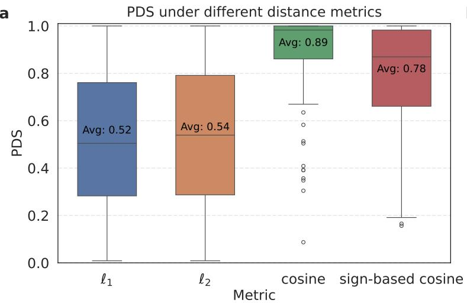
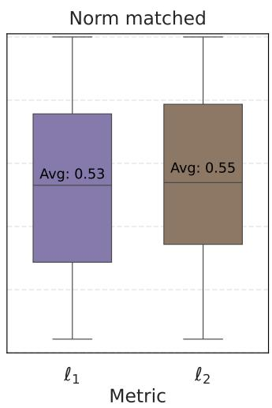
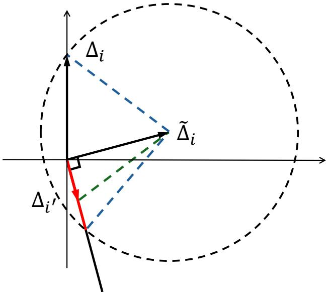
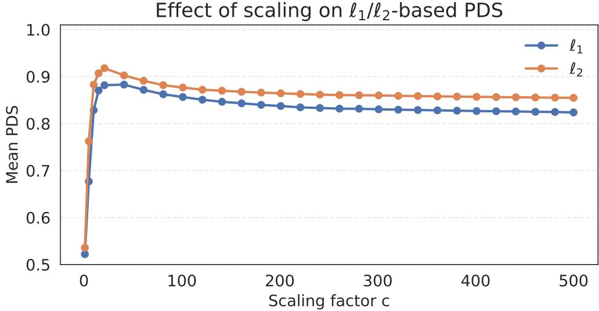
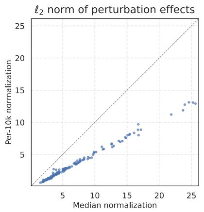
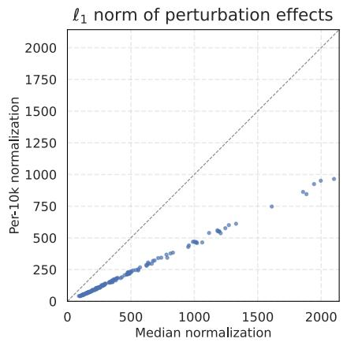
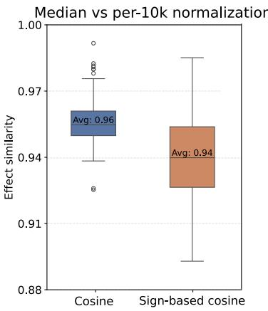

# Efects of Distance Metrics and Scaling on the Perturbation Discrimination Score

Qiyuan Liu1, Qirui Zhang2, Jinhong Du∗3, Siming Zhao∗2, and Jingshu Wang∗ 1

1Department of Statistics, University of Chicago, Chicago, IL, USA 2Department of Biomedical Data Science, Dartmouth College, Hanover, NH, USA; Dartmouth Cancer Center, Lebanon, NH, USA

3Institute of Data Science, The University of Hong Kong, Hong Kong SAR, China; Department of Statistics and Actuarial Science, The University of Hong Kong, Hong Kong SAR, China

## Abstract

The Perturbation Discrimination Score (PDS) is increasingly used to evaluate whether predicted perturbation efects remain distinguishable, including in Systema and the Virtual Cell Challenge. However, its behavior in high-dimensional gene-expression settings has not been examined in detail. We show that PDS is highly sensitive to the choice of similarity or distance measure and to the scale of predicted efects. Analysis of observed perturbation responses reveals that $\ell _ { 1 }$ and ℓ2-based PDS behave very diferently from cosine-based measures, even after norm matching. We provide geometric insight and discuss implications for future discrimination-based evaluation metrics.

## Introduction

A central goal in functional genomics is to understand how genetic perturbations change gene expression. When predicting perturbation efects, an important question is not only how close the predictions are on average, but also whether diferent perturbations remain distinguishable. The Perturbation Discrimination Score (PDS) formalizes this idea by evaluating whether a predicted perturbation-efect vector $\widehat { \Delta } _ { i }$ is closest to its true counterpart $\Delta _ { i }$ for perturbation i within a collection of perturbations. Metrics of this form have been used in several recent benchmarking eforts. For example, the Systema framework (Vi˜nas Torn´e et al., 2025) evaluates discriminability using centroid accuracy, which corresponds to PDS defined with the Euclidean $( \ell _ { 2 } )$ distance. The PerturbBench framework (Wu et al., 2024) develops a class of rank-based metrics including PDS under generic distance definitions, and the Virtual Cell Challenge (VCC; Roohani et al. (2025)) further adopts this PDS metric with the Manhattan $( \ell _ { 1 } )$ distance for large-scale benchmarking.

Although discrimination-based metrics are motivated by clear biological considerations and are increasingly used in benchmarking studies, they remain relatively new in prediction problems, and their behavior under diferent distance or similarity definitions has not been systematically examined. Understanding these properties is important for interpreting benchmark results and for designing robust metrics for future perturbation-prediction studies. In our analysis, we find that the behavior of PDS depends strongly on the choice of similarity or distance measure. In particular, PDS defined using $\ell _ { 1 } / \ell _ { 2 }$ distance is highly sensitive to the scale of predicted efects, whereas cosine-based versions are not, leading to interactions between metric choice and scale that are not always intuitive.

In this commentary, we analyze how PDS behaves under diferent distance measures, with a focus on how directional agreement, magnitude, and scaling together influence discriminability. Our goal is to clarify how PDS behaves in practice and to provide insight that may guide the development of future discrimination-based evaluation metrics.

## Diferent distance metrics greatly change PDS performance

At its core, for each perturbation $i ,$ PDS ranks the true distance $d ( \widehat { \Delta } _ { i } , \Delta _ { i } )$ among the set of distances $d ( \widehat { \Delta } _ { i } , \Delta _ { i ^ { \prime } } )$ for all perturbation $i ^ { \prime } .$ , and linearly rescales that rank to the interval [0, 1]. A perfect match gives PDS = 1 and random guessing gives roughly 0.5, with the worst case giving 0.

Systema used the $\ell _ { 2 }$ distance:

$$
d _ {\ell_ {2}} (\widehat {\Delta} _ {i}, \Delta_ {i ^ {\prime}}) = \| \widehat {\Delta} _ {i} - \Delta_ {i ^ {\prime}} \| _ {2} = \sqrt {\sum_ {j} (\widehat {\Delta} _ {i j} - \Delta_ {i ^ {\prime} j}) ^ {2}},
$$

and VCC used the $\ell _ { 1 }$ distance:

$$
d _ {\ell_ {1}} (\widehat {\Delta} _ {i}, \Delta_ {i ^ {\prime}}) = \| \widehat {\Delta} _ {i} - \Delta_ {i ^ {\prime}} \| _ {1} = \sum_ {j} | \widehat {\Delta} _ {i j} - \Delta_ {i ^ {\prime} j} |.
$$

However, we find that PDS can vary dramatically depending on the choice of distance.

To illustrate this efect, we consider a simple prediction strategy: using the genome-wide CRISPR screen in the K562 cell line Replogle et al. (2022) to predict the mean perturbation efects in the hESC training set provided by the VCC. We restrict the comparison to the 115 perturbations and 7,581 genes shared between the two datasets. For each perturbation $i ,$ the predicted $\widehat { \Delta } _ { i }$ is defined as the mean diference between perturbed and control cells in the K562 data after standard preprocessing. The corresponding “true” efect $\Delta _ { i }$ is defined analogously using the VCC hESC training data, ensuring that both sets of efects are computed under the same preprocessing pipeline.

We then compute PDS under four definitions of distances:

b

a

(1) $\ell _ { 1 }$ distance,

(2) $\ell _ { 2 }$ distance,

(3) cosine dissimilarity $1 - \cos ( \widehat { \Delta } _ { i } , \Delta _ { i ^ { \prime } } )$ 2

(4) sign-based cosine dissimilarity $1 - \cos ( \mathrm { s i g n } ( \widehat { \Delta } _ { i } ) , \mathrm { s i g n } ( \Delta _ { i ^ { \prime } } ) )$

As shown in Figure 1a, a notable discrepancy emerges. When PDS is computed using $\ell _ { 1 }$ or $\ell _ { 2 }$ distance, the resulting scores are generally low, only marginally above 0.5, which is close to what one would expect from random guessing. In contrast, when cosine similarity or sign-based cosine similarity is used, the PDS increases substantially, approaching values near 0.8.

This contrast raises an immediate and interesting question: how can the very same set of predictions appear almost random under $\ell _ { 1 } / \ell _ { 2 }$ distances yet become highly discriminative when evaluated with cosine-based measures?

Figure 1: PDS varies substantially across distance metrics. (a) PDS for the prediction vectors $\widehat { \Delta } _ { i }$ computed under four diferent metrics. (b) PDS computed using $\ell _ { 1 } / \ell _ { 2 }$ distance after normalizing each prediction to match the corresponding true efect vector in total norm. In all analyses, the target gene is excluded from each perturbation-efect vector.

## Rescaling predicted vectors does not rescue $\ell _ { 1 } / \ell _ { 2 }$ -based PDS

One might reasonably suspect that the relatively low PDS values obtained under $\ell _ { 1 } / \ell _ { 2 }$ distance arise primarily from mismatched global scales of predicted and observed perturbation efects. To test this possibility, we considered rescaled predictions

$$
\widetilde {\Delta} _ {i} = c _ {i} \widehat {\Delta} _ {i},
$$

where $c _ { i }$ is chosen such that $\| \widetilde { \Delta } _ { i } \| _ { 1 } = \| \Delta _ { i } \|$ 1 (for $\ell _ { 1 } )$ or $\| \widetilde { \Delta } _ { i } \| _ { 2 } = \| \Delta _ { i } \| _ { 2 } \mathrm { ~ ( f o r ~ } \ell _ { 2 } \mathrm { ) }$ . This enforces exact norm matching between each prediction and its true perturbation efect.

However, as shown in Figure 1b, even after this normalization, the resulting PDS scores under $\ell _ { 1 }$ and $\ell _ { 2 }$ remain close to 0.5 on average. Thus, simply correcting the global scale does not substantially improve discriminability when PDS is defined using magnitude-sensitive metrics.

The underlying reason is geometric. Consider the $\ell _ { 2 }$ case. Even when the rescaled prediction has the correct length and is more directionally aligned with the true efect $\Delta _ { i }$ than with any other perturbation, the $\ell _ { 2 }$ distance to another perturbation $\Delta _ { i ^ { \prime } }$ may still be smaller if $\Delta _ { i ^ { \prime } }$ has a suficiently short norm. Figure 2 illustrates this in two dimensions: although $\Delta _ { i ^ { \prime } }$ is orthogonal to $\widetilde { \Delta } _ { i }$ , its shorter length creates a “red” segment that lies entirely within the circle of radius $d _ { \ell _ { 2 } } ( \widetilde { \Delta } _ { i } , \Delta _ { i } )$ . Points along this segment remain closer to the prediction in Euclidean distance despite having a larger angular deviation from it.

Figure 2: Geometric illustration of the sensitivity of ℓ -based PDS in two dimensions. Even though the rescaled predicted efect $\widetilde { \Delta } _ { i }$ is orthogonal to $\Delta _ { i ^ { \prime } }$ , the shorter magnitude of $\Delta _ { i ^ { \prime } }$ (red segment) places it closer in Euclidean distance to $\widetilde { \Delta } _ { i }$ than $\Delta _ { i }$ . This demonstrates how $\ell _ { 2 } \cdot$ -based rankings can favor vectors with smaller norms despite poorer directional alignment.

In this 2D setting, even if $\widetilde { \Delta } _ { i }$ is orthogonal to $\Delta _ { i ^ { \prime } }$ , we can guarantee that

$$
d _ {\ell_ {2}} (\widetilde {\Delta} _ {i}, \Delta_ {i}) <   d _ {\ell_ {2}} (\widetilde {\Delta} _ {i}, \Delta_ {i ^ {\prime}})
$$

for every $\Delta _ { i ^ { \prime } }$ (i.e., the circle around $\widetilde { \Delta } _ { i }$ does not intersect the ray in the direction of $\Delta _ { i ^ { \prime } } )$ only when

$$
\cos \left(\widetilde {\Delta} _ {i}, \Delta_ {i}\right) > \cos (6 0 ^ {\circ}) = 0. 5.
$$

In higher dimensions, this efect becomes even more pronounced: short vectors occupy an increasingly large region in which they are closer in $\ell _ { 1 } / \ell _ { 2 }$ distance, making magnitude-sensitive versions of PDS relatively insensitive to directional accuracy unless the cosine similarity is very high.

## Why $\ell _ { 1 } / \ell _ { 2 }$ -based PDS is scale-sensitive and why this behavior is intrinsic

Another striking feature of $\ell _ { 1 } / \ell _ { 2 } .$ -based PDS is its sensitivity to the overall scale of the predicted vectors. In practice, multiplying all predicted efects $\widehat { \Delta } _ { i }$ by a constant c can substantially change the resulting PDS values, even though scaling leaves all directional information unchanged. This behavior can be explained through simple asymptotic calculations.

The $\ell _ { 2 }$ case. Consider the squared $\ell _ { 2 }$ distance between a scaled prediction $c \widehat { \Delta } _ { i }$ and another perturbation efect $\Delta _ { i ^ { \prime } }$ :

$$
d _ {\ell_ {2}} \big (c \widehat {\Delta} _ {i}, \Delta_ {i ^ {\prime}} \big) ^ {2} = \| c \widehat {\Delta} _ {i} - \Delta_ {i ^ {\prime}} \| _ {2} ^ {2} = c ^ {2} \| \widehat {\Delta} _ {i} \| _ {2} ^ {2} + \| \Delta_ {i ^ {\prime}} \| _ {2} ^ {2} - 2 c \widehat {\Delta} _ {i} ^ {\top} \Delta_ {i ^ {\prime}}.
$$

The diference in squared distances between the true perturbation i and another perturbation $i ^ { \prime }$ is therefore

$$
d _ {\ell_ {2}} \big (c \widehat {\Delta} _ {i}, \Delta_ {i} \big) ^ {2} - d _ {\ell_ {2}} \big (c \widehat {\Delta} _ {i}, \Delta_ {i ^ {\prime}} \big) ^ {2} = \big (\| \Delta_ {i} \| _ {2} ^ {2} - \| \Delta_ {i ^ {\prime}} \| _ {2} ^ {2} \big) - 2 c \big (\widehat {\Delta} _ {i} ^ {\top} \Delta_ {i} - \widehat {\Delta} _ {i} ^ {\top} \Delta_ {i ^ {\prime}} \big).
$$

Dividing by c and taking $c \to \infty$ yields

$$
\lim _ {c \to \infty} \frac {d _ {\ell_ {2}} (c \widehat {\Delta} _ {i} , \Delta_ {i}) ^ {2} - d _ {\ell_ {2}} (c \widehat {\Delta} _ {i} , \Delta_ {i ^ {\prime}}) ^ {2}}{c} = - 2 (\widehat {\Delta} _ {i} ^ {\top} \Delta_ {i} - \widehat {\Delta} _ {i} ^ {\top} \Delta_ {i ^ {\prime}}).
$$

Using the identity

$$
\widehat {\Delta} _ {i} ^ {\top} \Delta_ {i ^ {\prime}} = \| \widehat {\Delta} _ {i} \| _ {2} \| \Delta_ {i ^ {\prime}} \| _ {2} \cos (\widehat {\Delta} _ {i}, \Delta_ {i ^ {\prime}}),
$$

the condition for the true perturbation i to be ranked closer than $i ^ { \prime }$ in the limit $c \to \infty$ becomes

$$
\cos \bigl (\widehat {\Delta} _ {i}, \Delta_ {i} \bigr) > \frac {\| \Delta_ {i} ^ {\prime} \| _ {2}}{\| \Delta_ {i} \| _ {2}} \cos \bigl (\widehat {\Delta} _ {i}, \Delta_ {i ^ {\prime}} \bigr).
$$

This inequality shows that the comparison becomes increasingly governed by directional alignment (cosine similarity) as scaling increases. In particular, if $\cos ( \widehat { \Delta } _ { i } , \Delta _ { i ^ { \prime } } ) = 0$ , meaning the prediction is orthogonal to the wrong perturbation, then the condition reduces to cos $( \widehat { \Delta } _ { i } , \Delta _ { i } ) > 0$ , regardless of the relative magnitudes $\| \Delta _ { i } \| _ { 2 }$ and $\| \Delta _ { i } ^ { \prime } \| _ { 2 }$ . More generally, when $\cos ( \widehat { \Delta } _ { i } , \Delta _ { i ^ { \prime } } )$ is near 0, which is common in high-dimensional settings, only modest positive cosine similarity with the true perturbation is needed to outrank many alternatives. Thus, scaling amplifies the directional term relative to magnitude diferences, causing the $\ell _ { \mathrm { 2 } } { \mathrm { - b a s e d } }$ ranking to behave increasingly like cosine similarity.

The $\ell _ { 1 }$ case. A similar limit arises for the $\ell _ { 1 }$ norm. For each coordinate $j ,$

$$
\big | c \widehat {\Delta} _ {i j} - \Delta_ {i ^ {\prime} j} \big | = c \big | \widehat {\Delta} _ {i j} \big | - \mathrm{sign} (\widehat {\Delta} _ {i j}) \mathrm{sign} (\Delta_ {i ^ {\prime} j}) \big | \Delta_ {i ^ {\prime} j} \big | (c \to \infty),
$$

so that

$$
\lim _ {c \to \infty} \left\{d _ {\ell_ {1}} \big (c \widehat {\Delta} _ {i}, \Delta_ {i} \big) - d _ {\ell_ {1}} \big (c \widehat {\Delta} _ {i}, \Delta_ {i ^ {\prime}} \big) \right\} = - \Big [ \sum_ {j = 1} ^ {p} \mathrm{sign} (\widehat {\Delta} _ {i j}) \mathrm{sign} (\Delta_ {i j}) \big | \Delta_ {i j} \big | - \sum_ {j = 1} ^ {p} \mathrm{sign} (\widehat {\Delta} _ {i j}) \mathrm{sign} (\Delta_ {i ^ {\prime} j}) \big | \Delta_ {i ^ {\prime} j} \big | \Big ].
$$

Thus, in this limit, $\ell _ { 1 } { \mathrm { - b a s e d } }$ PDS becomes driven by a weighted sign cosine similarity. This links $\ell _ { 1 } { \mathrm { - b a s e d } }$ PDS to a form of sign-based similarity, in which agreement in sign on large-magnitude coordinates contributes the most to the ranking.

These asymptotic results show that the scale dependence of $\ell _ { 1 } / \ell _ { 2 } { \mathrm { - b a s e d } }$ PDS is mathematically predictable. As predictions are globally rescaled, PDS rankings transition toward those determined by cosine or sign-based cosine similarities. Figure 3 illustrates this process: as the scaling factor c increases, $\ell _ { 1 } / \ell _ { 2 } { \mathrm { - b a s e d } }$ PDS values rise sharply and eventually plateau at a limiting value.

Importantly, this is not an artifact of “hacking” the scoring metric. Instead, it is an inherent property of magnitude-sensitive norms in multi-dimensional spaces, where distances combine both scale and direction. Scaling modifies the magnitude component while leaving direction unchanged, causing $\ell _ { 1 } / \ell _ { 2 } .$ -based PDS to interpolate toward cosine or sign-based behavior.

Effect of scaling on 1/ 2-based PDS

Figure 3: $\ell _ { 1 } / \ell _ { 2 } { \ - } { \bf - b a s e d }$ PDS metrics are sensitive to the magnitude of predicted efects. Mean PDS of scaled predictions $c \widehat { \Delta } _ { i }$ vary with scaling factor c. The blue and orange curves correspond to PDS computed with $\ell _ { 1 }$ and $\ell _ { 2 }$ distance, respectively.

## Implications for future PDS-style metrics

The analyses above suggest two potential directions for refining PDS in future perturbation-efect benchmarks.

A first option is to define PDS using cosine-based similarity measures. Because cosine similarity depends only on direction, these metrics are invariant to global rescaling and robust to diferences in normalization or preprocessing. Cosine-based PDS directly assesses whether predicted perturbation efects capture the correct pattern of up- and down-regulated genes, without being influenced by inconsistencies in total efect magnitude across studies or platforms.

A natural concern is that cosine-based PDS may be easier to score well on: achieving high discrimination does not necessarily require high correlation with the true efects, only that predictions outperform random guessing. A stricter alternative is therefore to retain $\ell _ { 1 } / \ell _ { 2 } \mathrm { - b a s e d }$ PDS, but to fix the norm of the predicted vectors – for example by enforcing $\| \widehat { \Delta } _ { i } \| _ { 1 } = \| \Delta _ { i } \| _ { 1 } \mathrm { ~ o r ~ } \| \widehat { \Delta } _ { i } \| _ { 2 } = \| \Delta _ { i } \| _ { 2 }$ before computing distances. This adjustment does not turn PDS into a measure of magnitude accuracy; instead, it removes the possibility of improving scores through arbitrary rescaling. Un der this “norm-matched” PDS, achieving high discrimination requires genuinely close directional alignment with the true perturbation efects, yielding a more stringent and interpretable metric.

## Why PDS should focus on directional accuracy rather than total magnitude

Neither of the refinements discussed above requires PDS to evaluate the total magnitude accuracy of the predicted perturbation efects, and in many settings, this is a desirable property. Total efect magnitudes are intrinsically dificult to predict: they depend on guide RNA eficiency, experimental design, noise levels in single-cell $\mathrm { R N A } { \cdot } \mathrm { s e q }$ , and even subtle preprocessing choices.

In practice, the total $\ell _ { 1 }$ and $\ell _ { 2 }$ norms of perturbation-efect vectors can vary dramatically under diferent normalization pipelines. For example, Figure 4 compares observed mean perturbation effects derived from the same raw counts of the VCC training data after two common preprocessing choices: (i) median library-size normalization and (ii) per-10k scaling followed by log1p transformation. Although these transformations yield perturbation efects with high cosine similarity, their total $\ell _ { 1 }$ and $\ell _ { 2 }$ norms difer substantially.

These observations suggest that direction-based metrics may provide more stable and meaningful comparisons across contexts, particularly when integrating data across experiments or platforms. In contrast, $\ell _ { 1 } / \ell _ { 2 } { \mathrm { - b a s e d } }$ PDS is sensitive to global scaling in a way that does not consistently reflect biological magnitude accuracy: increasing the scale of the predicted efects can artificially inflate the score, while incorrect magnitudes may be penalized or rewarded depending on their interaction with vector norms and angular relationships. Thus, even if one wished to evaluate total magnitude accuracy, $\ell _ { 1 } / \ell _ { 2 } { \mathrm { - b a s e d } }$ PDS would not be the appropriate tool. Focusing PDS on directional information avoids this instability and more directly evaluates the aspect of perturbation efects that is most reproducible across contexts.

## Conclusion

Our analysis clarifies how the Perturbation Discrimination Score behaves under diferent similarity measures and under global scaling of predictions. In particular, $\ell _ { 1 } / \ell _ { 2 } { \mathrm { - b a s e d } }$ PDS can be strongly influenced by the magnitude of predicted vectors, while cosine-based versions are more robust to these efects. These findings do not critique the use of PDS in benchmarking the prediction performance; rather, they illuminate the metric’s geometry and ofer guidance for designing future discriminability-based evaluations. As perturbation-prediction benchmarks continue to grow in scale and complexity, a deeper understanding of PDS-style metrics will help ensure that evaluation criteria reflect the biological and statistical goals of each task.

Figure 4: Perturbation-efect magnitudes depend strongly on preprocessing. The first two panels show the $\ell _ { 2 }$ and $\ell _ { 1 }$ norms of mean perturbation efects obtained using per-10k versus median normalization; each point corresponds to one perturbation. The third panel shows boxplots of the cosine and sign-based cosine similarities between the efects produced by the two preprocess ing pipelines.

## References

Replogle, J. M., Saunders, R. A., Pogson, A. N., Hussmann, J. A., Lenail, A., Guna, A., Mascibroda, L., Wagner, E. J., Adelman, K., Lithwick-Yanai, G., et al. (2022). Mapping information-rich genotype-phenotype landscapes with genome-scale perturb-seq. Cell, 185(14):2559–2575.

Roohani, Y. H., Hua, T. J., Tung, P.-Y., Bounds, L. R., Yu, F. B., Dobin, A., Teyssier, N., Adduri, A., Woodrow, A., Plosky, B. S., et al. (2025). Virtual cell challenge: Toward a turing test for the virtual cell. Cell, 188(13):3370–3374.

Vi˜nas Torn´e, R., Wiatrak, M., Piran, Z., Fan, S., Jiang, L., Teichmann, S. A., Nitzan, M., and Brbi´c, M. (2025). Systema: a framework for evaluating genetic perturbation response prediction beyond systematic variation. Nature Biotechnology, pages 1–10.

Wu, Y., Wershof, E., Schmon, S. M., Nassar, M., Osi´nski, B., Eksi, R., Zhang, K., and Graepel, T. (2024). Perturbench: Benchmarking machine learning models for cellular perturbation analysis. In NeurIPS 2024 Workshop on AI for New Drug Modalities.
