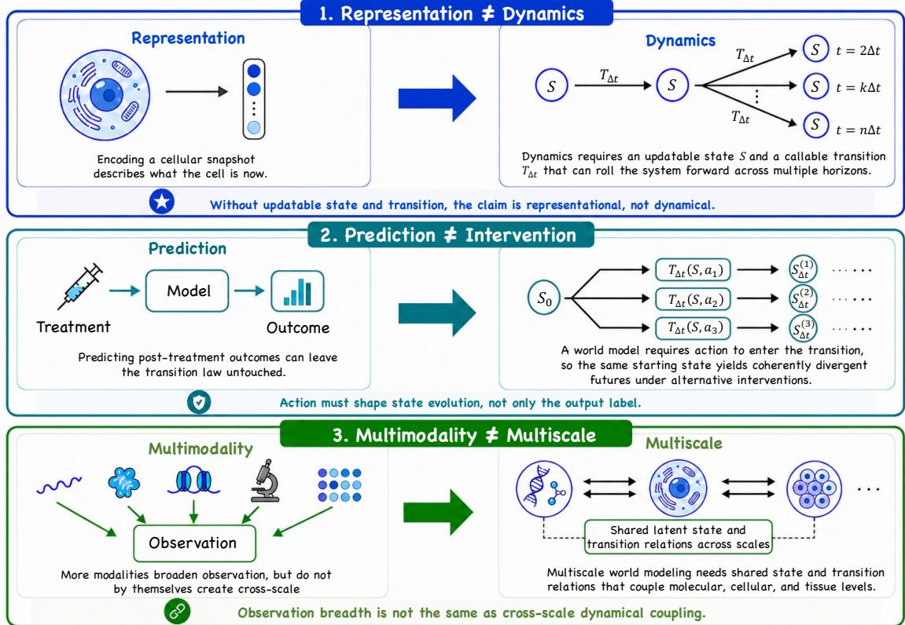
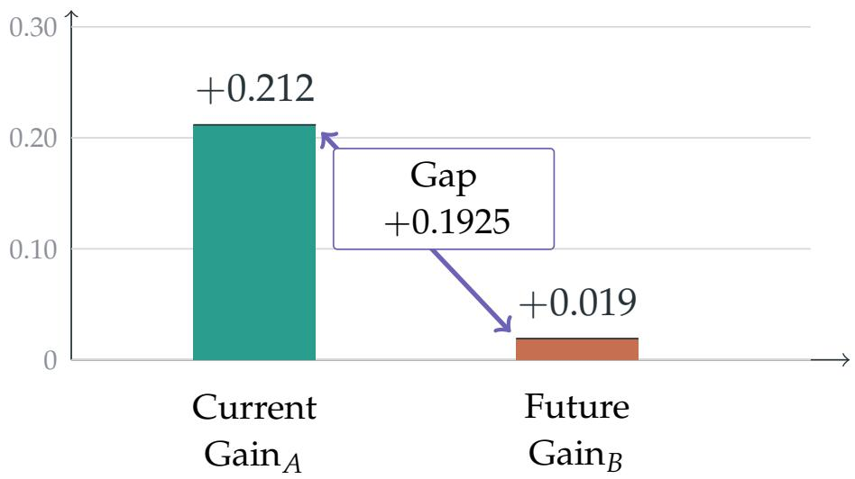
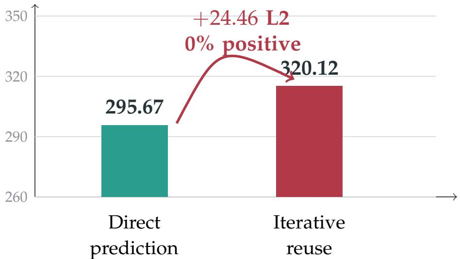
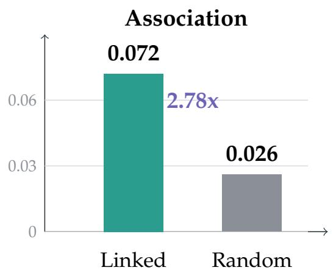
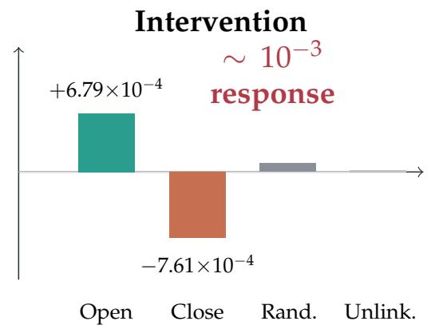
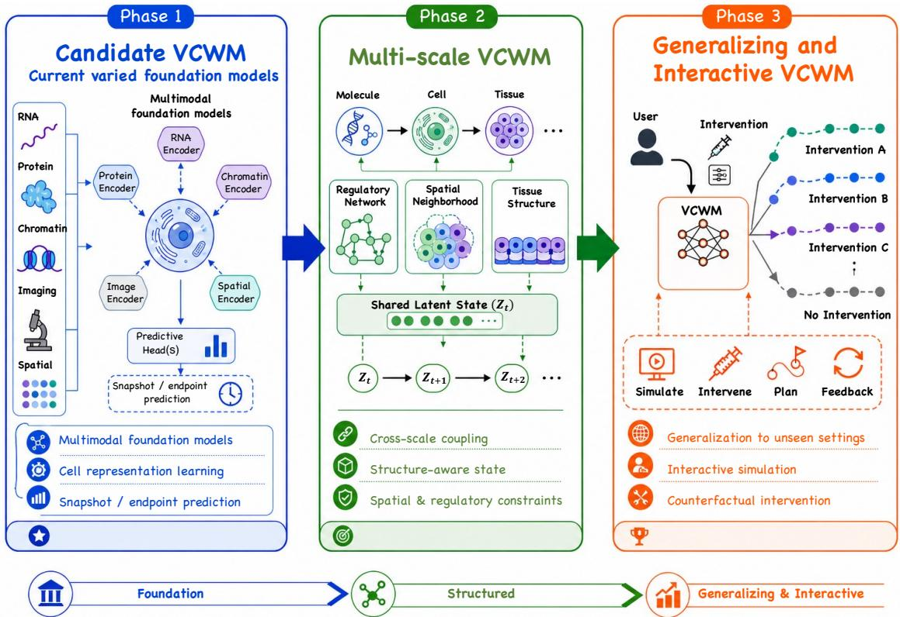

# What Makes a Virtual Cell a World Model? Three Gaps, Three Experiments, and a Roadmap

Chang Yu yuchang210126@gmai1.com

Nanjing University

Jingbo Zhou Westlake University

Cheng Tan Shanghai AI Laboratory

Stan Z. Li Westlake University

Xiaodong Liu Westlake University

Xiaoming Zhang BioMap Research

Zhaoxiang Zhang Institute of Automation, Chinese Academy of Sciences

Zhen Lei Institute of Automation, Chinese Academy of Sciences

Zhongqi Wang Jilin University

## Systematic Review

Keywords:

Posted Date: July 21st, 2026

DOI: https://doi.org/10.21203/rs.3.rs-10404367/v1

License:  This work is licensed under a Creative Commons Attribution 4.0 International License. Read Full License

Additional Declarations: The authors declare no competing interests.

# What Makes a Virtual Cell a World Model? Three Gaps, Three Experiments, and a Roadmap

VCWorldModel Team

Virtual-cell research increasingly combines mechanistic simulators, single-cell foundation models, perturbation predictors, and multimodal integrators. Yet world-model terminology is often applied to systems that support substantially different capabilities. We introduce virtual cell world models (VCWMs) as a structured framework for evaluation rather than as settled nomenclature. The framework isolates three recurring gaps: representation is not dynamics, prediction is not intervention, and multimodality is not multiscale world modeling. Starting from a working definition of general world models, we formalize a VCWM as a maintained cellular state with biological and observational context, intervention-conditioned transition, and time-varying structure. We present three motivation experiments that provide empirical evidence for these gaps in current systems: foundation-model representations can improve present-state readouts without comparable future-fate signal; a perturbation predictor can forecast endpoints while failing state-space closure under iteration; and a multimodal model can learn cross-modal association without producing appreciable chromatin-to-RNA intervention effects. These results motivate three diagnostic axes—dynamics, intervention, and scale—each with its own L0–L3 capability ladder, and a staged roadmap from candidate VCWMs to multiscale, interactive systems.

## 1 Introduction

## 1.1 Three lineages, one unresolved question

The virtual-cell goal is not only to encode cellular measurements, but to support progressively stronger capabilities: representing cellular state, forecasting how that state changes, and choosing interventions that alter future cellular trajectories. Bunne et al. systematized this ambition as the AI Virtual Cell (AIVC) agenda: an AI-enabled, multiscale and multimodal representation of cells and cellular systems intended to support virtual experimentation [8]. This formulation did not originate the broader historical term “virtual cell,” but it established a contemporary AI research program around it. Mechanistic whole-cell modeling showed that explicit cellular simulation is possible [19, 39, 36]; AI virtual-cell and foundation-model work scaled representation learning across assays and contexts [11, 16, 38]; and perturbation benchmarks made intervention claims more comparable [44, 10, 40, 28]. These lineages have also introduced terminological ambiguity, because representation learners, perturbation predictors, multimodal integrators, and simulators are sometimes described using equivalent world-model terminology despite supporting different capabilities.

From an application perspective, we view virtual cells as advancing across four increasingly demanding horizons: reproducing naturally occurring cellular states that are already experimentally attainable but remain inefficient to generate or maintain; applying virtual perturbations to naturally occurring target cell types whose states cannot yet be reliably captured or sustained; designing safe, effective, and controllable multifunctional cells with no natural or experimental precedent while partially recapitulating native cellular programs; and modeling or designing interacting cell communities. Progress across these horizons requires models that maintain cellular state, simulate intervention-conditioned transitions, evaluate novel but biologically constrained designs with calibrated uncertainty, and represent intercellular dynamics. These requirements motivate the VCWM formulation developed here. The three conceptual gaps underlying this formulation are summarized in Figure 1.

  
Figure 1: Three recurring gaps in virtual-cell world-model claims. Representation does not imply dynamics; endpoint prediction does not imply intervention-conditioned transition; and multimodal observation does not imply multiscale world modeling.

This paper examines the conditions under which world-model terminology is justified for cellular systems. Representational capacity, endpoint accuracy, and multimodal coverage are insufficient on their own; qualification requires explicit commitments concerning state, transition, intervention, context, uncertainty, and evaluation.

## 1.2 Three gaps

Representation ̸= dynamics. A model that encodes a cellular snapshot is not, by virtue of that encoding, a model of how the cell evolves. World modeling requires a maintained state that can be rolled forward by a callable transition operator. Without an updateable state and a reusable T∆t, single-cell foundation models are best read as representation models or encoder substrates rather than world models.

Prediction ̸= intervention. Forecasting a post-treatment endpoint is compatible with action acting only on an output head. A world model requires action to enter the transition itself, so that alternative interventions on the same starting state produce coherent and divergent futures rather than independently regressed labels [27, 29].

Multimodality ̸= multiscale world modeling. Stacking RNA, protein, chromatin, imaging, or spatial channels enriches the observation space [35, 25, 1, 2, 4]. It does not by itself couple biological levels. Multiscale world modeling requires shared state and transition relations in which lower-scale change can propagate upward and higher-scale context can constrain lower-scale futures.

## 1.3 From AIVC ambition to VCWM criteria

AIVC denotes the ambition to build simulation-ready virtual cells, whereas VCWM specifies the criteria under which a system qualifies as a world-model candidate. Distinguishing a candidate world model from an endpoint predictor therefore requires explicit evidence. This manuscript contributes a formal object and minimum conditions, three experiments demonstrating the relevance of the identified gaps, three diagnostic axes with independent capability ladders, and a staged roadmap for progress.

## 2 The Correspondence and Distinction Between General World Models and Virtual Cells

## 2.1 General world models: a working definition

There is no single universally accepted definition of a world model. Across model-based reinforcement learning, latent-dynamics learning, and predictive representation learning, however, a common operational core is visible: a model maintains an internal state, predicts how that state changes under an action, and connects the predicted state back to observable consequences [13, 21, 14, 15, 33]. We use this common core as a working reference rather than as a claim that the term has a settled boundary.

A generic world model can be written schematically as

$$
s _ {t + 1} \sim T (s _ {t}, a _ {t}),\tag{1}
$$

$$
o _ {t} \sim D (s _ {t}),\tag{2}
$$

where $s _ { t }$ is a maintained state, $a _ { t }$ is an action, T is a reusable transition, and D connects the internal state to an observable prediction. The defining commitment is not realistic output alone, but a state-transition object through which alternative actions can produce alternative futures.

## 2.2 Correspondences and distinctions in cellular systems

The general loop has direct cellular correspondences. Observations O become transcriptomic, proteomic, chromatin, spatial, imaging, or related assay readouts. State S becomes an updateable latent description of a cell or cell population. Actions A become genetic, chemical, environmental, or other realizable interventions. The transition $T _ { \Delta t }$ describes how cellular state changes over an elapsed interval $\Delta t .$ Cellular settings also require explicit context C, including cell type, tissue, species, developmental regime, microenvironment, assay, and protocol, and may require a time-indexed structure $G _ { t } ,$ such as a regulatory graph, spatial neighborhood, or cell–cell interaction scaffold.

The correspondence is useful but incomplete. Cellular change spans fast signaling, transcriptional response, cell-cycle progression, and tissue remodeling rather than a single homogeneous clock. Biological organization is nested across molecular, cellular, and tissue scales. Regulatory and spatial topology is heterogeneous and may itself change through time. Moreover, many assays destroy the measured cell, so trajectories are often learned from partial observations of matched populations rather than repeated observations of the same entity. These distinctions make cellular world modeling a partially observed, multiscale, and context-sensitive problem rather than a direct transplant of a video or control-system formulation.

## 2.3 A minimal VCWM formalization

Guided by these correspondences, we use the compact formal object

$$
\mathrm{VCWM} = (O, S, C, A, G _ {t}, T _ {\Delta t}).\tag{3}
$$

Here O is the cellular observation space, S is the maintained cellular state, C is context, A is the intervention space, $G _ { t }$ is time-indexed biological structure, and $T _ { \Delta t }$ is the transition operator. This tuple is deliberately minimal. Decoding is an implementation-dependent path between state and measurement rather than a defining tuple element, while uncertainty and falsifiability are requirements on how the model is evaluated and used rather than additional state variables.

The context split remains load-bearing:

$$
C = (C _ {\mathrm{bio}}, C _ {\mathrm{obs}}).
$$

$C _ { \mathrm { b i o } }$ includes cell type, tissue, species, developmental regime, or microenvironment when these variables primarily alter admissible biological dynamics. $C _ { \mathrm { o b s } }$ includes assay platform, batch, protocol, or imaging setup when these variables primarily alter how a state is measured. Some conditions affect both and should be reported as mixed rather than forced into a false binary. This split prevents robustness to a new assay from being overstated as transfer of the underlying biology.

The core cellular dynamics are

$$
(s _ {t + \Delta t}, G _ {t + \Delta t}) \sim T _ {\Delta t} (s _ {t}, G _ {t}, a _ {t}, c _ {t} ^ {\mathrm{bio}}).\tag{4}
$$

Equation equation 4 is where the central world-model commitment is tested: intervention, biological context, and structure must enter a reusable transition. Observation quality remains important, but accurate reconstruction of O does not by itself establish cellular dynamics.

## 2.4 Necessary conditions

The tuple alone is not enough. We use five necessary conditions for candidate status:

1. NC1: explicit state representation. The model maintains an updateable state object that can be reused for rollout and intervention.

2. NC2: explicit state transition mechanism. The model exposes a callable transition rule rather than inferring each endpoint independently.

3. NC3: intervention-conditioned transition. Actions modulate $T _ { \Delta t }$ itself, not only an output head.

4. NC4: future and counterfactual evaluation. The model supports comparison of alternative futures from a shared starting state.

5. NC5: uncertainty and failure boundaries. Evaluation reports calibrated uncertainty, abstention, or explicit non-coverage where predictions should not be trusted.

These conditions are necessary but not sufficient. Satisfying them establishes only candidate status: they provide a disciplined basis for evaluation but neither constitute a benchmark nor guarantee causal correctness. In particular, NC5 makes uncertainty and falsifiability operational without treating them as components of the model tuple.

## 3 Empirical Motivation: Three Gaps Are Observable

Because world-model status requires empirical support rather than terminology alone, we first assess whether the identified gaps are observable in current systems. The following demonstrations provide evidence that they are. These analyses are motivation experiments rather than a complete validation suite; comprehensive validation would require the probes described in Section 4. Table 1 summarizes the capability tested, the corresponding VCWM requirement not established, and the principal quantitative evidence for each experiment.

Table 1: Three motivation experiments. Each experiment demonstrates an observed capability that is insufficient to establish the corresponding VCWM requirement.

<table><tr><td>Experiment</td><td>Observed capability</td><td>Required capability not established</td><td>Key quantitative contrast</td><td>Evidence</td></tr><tr><td>Exp. 1: foundation-model representations</td><td>Current-state information improves after PEFT or pretrained embedding use.</td><td>Future-fate information does not improve comparably; representation does not imply dynamics.</td><td>Geneformer LoRA  $Gain_A$  = +0.2117,  $Gain_B$  = +0.0192, interaction +0.1925.</td><td>Instance-level evidence.</td></tr><tr><td>Exp. 2: perturbation prediction</td><td>GEARS predicts perturbation endpoints.</td><td>Predicted outputs are not closed, reusable states for iterated intervention.</td><td>Iterative L2 320.12 vs direct L2 295.67; delta +24.46; positive-combo rate 0%.</td><td>Iterative-closure evidence.</td></tr><tr><td>Exp. 3: multimodal integration</td><td>MultiVI learns RNA–ATAC association above distance-matched controls.</td><td>Association does not yield appreciable chromatin-to-RNA intervention response.</td><td>Linked association 2.78× controls; DORC intervention  $\Delta RNA \sim 10^{-3}$ .</td><td>Preliminary diagnostic evidence.</td></tr></table>

  
Figure 2: Representation gain is not dynamics gain. In the Weinreb LARRY hematopoiesis setting, matched linear probes test whether a Geneformer representation adapted on day-4 cells improves a current-state readout $( \operatorname { G a i n } _ { A } )$ and prediction of day-6 clonal fate (Gain ). The current-state gain is +0.212, whereas the future-fate gain is +0.019, yielding an interaction gap of +0.1925.

## 3.1 Experiment 1: representation does not encode future dynamics

The first experiment tests the belief that rich single-cell foundation-model representations contain the information needed for downstream dynamics. We use the Weinreb LARRY hematopoiesis lineagetracing setting [42], where day-4 cells have future fate information at day 6. The design deliberately avoids asking a foundation model to roll out. Instead, simple probes ask whether representations contain current-state information and future-fate information.

As shown in Figure 2, Geneformer with LoRA adaptation provides the clearest contrast. Adaptation substantially improves current-state linear-probe performance, with $\mathrm { G a i n } _ { A } = + 0 . 2 1 1 7$ and a bootstrap interval of [0.192, 0.231]. However, improvement in future-fate prediction is limited: $\mathrm { G a i n } _ { B } = + 0 . 0 1 9 \bar { 2 }$ with an interval of [0.005, 0.035]. The resulting interaction, $\mathrm { G a i n } _ { A } - \mathrm { G a i n } _ { B } = + 0 . 1 9 2 5$ , is substantially positive. This pattern is consistent with the Branch-Y criterion: adaptation improves current-state readout relative to raw-gene features but provides limited additional future-fate information. Under the dynamics ladder below, foundation encoders therefore remain L0 unless they expose a maintained state and transition.

  
Figure 3: Endpoint prediction does not guarantee state-space closure. In Norman K562 Perturb-seq, a direct GEARS prediction for a two-gene perturbation is compared with sequential application in which the first predicted endpoint is reused as the state for a second perturbation. Across three seeds and 15,000 chains, mean manifold L2 increases from 295.67 to 320.12 under iterative reuse, a +24.46 penalty, with a 0% positive-combination rate.

## 3.2 Experiment 2: prediction is not intervention-conditioned closure

The second experiment tests whether a perturbation predictor’s output can serve as the next state. Using Norman 2019 K562 Perturb-seq data [26], GEARS [31] predicts a first perturbed state $c _ { 1 } ^ { \prime } ,$ , then the experiment feeds $c _ { 1 } ^ { \prime }$ back as the initial state for a second perturbation. A transition operator should be empirically closed: its output should remain a plausible cellular state that can be acted on again.

As shown in Figure 3, across three seeds and 15,000 chains, iterative prediction performs worse than direct two-gene prediction: mean L2 increases from 295.67 to 320.12, a difference of +24.46, and the positive-combination rate is 0%. This result should not be interpreted as a general limitation of GEARS, which remains effective for endpoint response prediction. Rather, it indicates that predicting $c _ { 1 } ^ { \prime }$ does not ensure that $c _ { 1 } ^ { \prime }$ constitutes a valid state for subsequent intervention. This finding motivates the intervention axis, in which action must modulate transition rather than only condition endpoint output.

## 3.3 Experiment 3: multimodality is not multiscale coupling

The third experiment tests whether multimodal fusion learns an operational cross-scale relation. In SHARE-seq mouse skin [25], MultiVI [2] captures a measurable RNA–ATAC association: linked peakgene pairs have a mean absolute correlation of 0.072, approximately 2.78× that of distance-matched random pairs. This result confirms that the association task captures a non-trivial empirical signal.

As summarized in Figure 4, the intervention analysis evaluates whether opening or closing DORClinked chromatin alters RNA predictions. The linearized reconstruction produces changes in the expected direction but with small magnitude: linked opening yields a mean ∆RNA of $+ 6 . 7 9 \times 1 0 ^ { - 4 } ,$ whereas linked closing yields $- 7 . 6 1 \times 1 0 ^ { - 4 }$ . Control effects remain near zero. Thus, the learned association does not produce an appreciable chromatin-to-RNA intervention effect. Because the perturbation is linearized rather than applied directly to the decoder input, this analysis should be interpreted as a preliminary diagnostic rather than conclusive validation.

  
Figure 4: Cross-modal association does not imply cross-scale intervention. MultiVI is evaluated on paired RNA–ATAC SHARE-seq data. Linked peak–gene pairs show mean absolute association $0 . 0 7 2 ,$ 2.78× the distance-matched random control, but reconstructed-linearized opening and closing of DORC-linked chromatin change predicted RNA by only $+ 6 . 7 9 \times 1 0 ^ { - 4 } \mathrm { ~ a n d ~ } - 7 . 6 1 \times 1 0 ^ { - 4 }$ , respectively.

## 4 Three Diagnostic Axes

## 4.1 Axis-specific L0–L3 ladders

As summarized in Figure 5, dynamics, intervention, and scale answer different questions and therefore use separate L0–L3 ladders. A system is summarized by the capability vector

$$
(L _ {\mathrm{dyn}}, L _ {\mathrm{int}}, L _ {\mathrm{scale}}),
$$

not by a single overall grade. For example, a multimodal endpoint predictor can be L1 on dynamics, L1 on intervention, and L1 on scale, while an action-free trajectory model can reach L2 on dynamics but remain L0 on intervention. This vector representation prevents performance on one axis from obscuring a missing capability on another. The axis-specific criteria are detailed in Table 2.

## 4.2 Dynamics: from snapshots to rollout

The dynamics ladder asks whether a system maintains an updateable state S that can be rolled forward through a reusable $T _ { \Delta t }$ . L0 is snapshot representation without forecast; L1 predicts one future endpoint; L2 exposes a transition that can be called repeatedly; and L3 demonstrates calibrated long-horizon rollout with controlled error growth. Trajectory inference and dynamical-system approaches make parts of this commitment explicit [20, 3, 9, 43, 32, 46].

Here H denotes the rollout horizon: the number of discrete transition steps applied from the starting state. H = 1 is a one-step forecast, whereas $H > 1$ requires the output state to remain valid for subsequent calls to $T _ { \Delta t }$ . The diagnostic question is whether the same starting state can be rolled out for $H > 1$ with calibrated uncertainty and controlled error accumulation. Experiment 1 motivates this axis by showing that improved representations may still provide limited future-fate information.

<table><tr><td>Axis</td><td>L0</td><td>L1</td><td>L2</td><td>L3</td></tr><tr><td>Dynamics</td><td>Snapshot representation</td><td>One-step forecast</td><td>Reusable multi-step transition</td><td>Calibrated long-horizon rollout</td></tr><tr><td>Intervention</td><td>Action absent or metadata</td><td>Conditional endpoint</td><td>Action-conditioned transition</td><td>Validated unseen-action counterfactuals</td></tr><tr><td>Scale</td><td>Single-scale state</td><td>Multimodal observation</td><td>Explicit one-way coupling</td><td>Bidirectional cross-scale closure</td></tr></table>

Figure 5: Axis-specific L0–L3 diagnostic ladders. Dynamics grades the transition from snapshot representation to calibrated long-horizon rollout; intervention grades the role of action from absent metadata to validated counterfactual transition; and scale grades the transition from a single biological level to bidirectional cross-scale closure. The three levels are reported independently rather than collapsed into one overall grade.

Table 2: Independent L0–L3 ladders for the three VCWM diagnostic axes. Levels are assigned separately on each axis and reported as a capability vector rather than a single overall score. Here, H denotes the rollout horizon, measured as the number of discrete transition steps from the starting state.

<table><tr><td>Axis</td><td>L0</td><td>L1</td><td>L2</td><td>L3</td></tr><tr><td>Dynamics</td><td>Snapshot representation; no forecast.</td><td>One-step endpoint prediction.</td><td>Callable transition supports H &gt; 1 reuse.</td><td>Calibrated long-horizon rollout with controlled error growth.</td></tr><tr><td>Intervention</td><td>Action absent or metadata-like.</td><td>Action conditions an end-point prediction.</td><td>Action modulates a reusable transition and same-start futures.</td><td>Counterfactual rollout validated under unseen interventions with uncertainty.</td></tr><tr><td>Scale</td><td>State and transition remain at one biological scale.</td><td>Multiple modalities enrich observation at one scale.</td><td>Explicit partial or one-directional cross-scale coupling.</td><td>Bidirectional coupling and cross-scale closure are tested.</td></tr></table>

## 4.3 Intervention: from prediction to action-conditioned transition

The intervention ladder asks how an action enters the model. L0 omits action or treats it as descriptive metadata; L1 conditions a one-shot endpoint; L2 lets action modulate a reusable transition and produces coherent alternative futures from a shared start; and L3 validates such counterfactual rollouts under unseen interventions with explicit uncertainty. Perturbation predictors and causal-discovery methods cover this axis to different degrees [23, 24, 31, 7, 26, 34, 5, 49].

The diagnostic question is whether ablating, shuffling, or late-injecting action changes the rolled-out trajectory rather than only its decoded endpoint. Positive evidence requires distinct, coherent futures under different actions; failure is indicated when rollout remains nearly unchanged or produces outputs that cannot serve as valid next states. Structural priors strengthen this axis only when they enter $T _ { \Delta t }$ and constrain admissible futures. Experiment 2 motivates the ladder by showing that endpoint prediction can fail state-space closure under iteration.

## 4.4 Scale: from multimodal observation to cross-scale coupling

The scale ladder asks whether additional modalities correspond to coupled biological levels or merely enrich observation. L0 represents one scale; L1 integrates multiple modalities while remaining effectively at one biological level; L2 exposes an explicit but partial or one-directional cross-scale relation; and L3 tests bidirectional coupling, including fine-to-coarse propagation and coarse-tofine constraint. Multimodal fusion, spatial transcriptomics, and cell-communication models expand observation [2, 1, 4, 17, 22, 37, 47, 6, 18], whereas transition-level coupling remains less well established.

The diagnostic question is whether cross-scale state and transition improve rollout or counterfactual evaluation beyond single-scale models. Positive evidence requires coarse context to constrain fine-scale futures and fine-scale rollouts to coarse-grain consistently. Failure is indicated when RNA, protein, chromatin, imaging, or spatial channels are concatenated into a shared embedding while the modeled dynamics remain effectively single-scale. Experiment 3 motivates this axis by showing that learned cross-modal association need not produce cross-scale intervention effects.

## 5 Roadmap to Virtual Cell World Models

## 5.1 Emerging cellular world-model claims

The cellular literature has only recently begun to use the world-model label directly, and the term still covers substantially different objects. VCWorld describes a knowledge-guided, white-box simulator that combines structured biological knowledge with iterative language-model reasoning to reconstruct perturbation-induced signaling cascades [41]. Lingshu-Cell instead calls a masked discrete-diffusion model of transcriptomic state distributions a cellular world model; it supports unconditional state generation and conditional genetic or cytokine perturbation response [48]. Chreode focuses more narrowly on temporal transition, using a structured, action- and time-conditioned residual to make one-step cell-state predictions [30]. In parallel, Xing and Song propose an operational architecture in which a virtual-cell world model generates multimodal, multiscale cellular trajectories under interventions [45].

These studies demonstrate growing adoption of world-model terminology, but they do not establish a shared definition. Knowledge-guided mechanistic reasoning, conditional transcriptome generation, explicit temporal transition, and an end-to-end architectural proposal satisfy different commitments. The independent dynamics, intervention, and scale ladders in Section 4 enable those differences to be reported without assigning a single overall world-model grade.

## 5.2 A phased roadmap

Figure 6 organizes VCWM development into evidence-gated phases of staged capability acquisition. The roadmap is organized by the evidence required at each phase rather than by terminology alone.

Phase 1: candidate VCWM. The near-term goal is to move from modality-specific encoders and endpoint predictors toward shared state plus callable transition. A Phase 1 claim should identify the state object, expose the transition, test intervention-conditioned rollout, compare alternative futures, and report uncertainty or non-coverage. It should not claim multiscale closure, broad context transfer, or interactive experimental design.

Phase 2: multiscale and structure-aware VCWM. The intermediate goal is to advance independently on the scale and intervention ladders by coupling molecular, cellular, and tissue levels through structured transition. Regulatory graphs, spatial neighborhoods, and cell-communication priors matter only when they constrain $T _ { \Delta t }$ and change admissible futures. Phase 2 evidence should include ablations showing that cross-scale or structural constraints improve rollout, counterfactual consistency, or mechanism-sensitive evaluation.

Phase 3: generalizing and interactive VCWM. The long-term goal is an uncertainty-aware system that transfers to held-out biological contexts and participates in a closed scientific loop. In this setting, an agent or AI co-scientist can formulate hypotheses, query the VCWM for alternative interventionconditioned futures, use uncertainty to prioritize informative experiments, and propose the next action under human oversight [12]. The VCWM provides simulated consequences and explicit failure boundaries, whereas the agent performs sequential planning without substituting for the biological model.

  
Figure 6: Roadmap from current systems to full VCWMs. The phases define capability requirements and do not imply fixed development timelines. Each phase is organized by the evidence required to justify a stronger world-model claim.

The loop must ultimately incorporate prospective wet-lab experimentation: candidate interventions are simulated, a subset is prioritized and executed, resulting assays are observed, and the model and its calibration are updated iteratively. Prospective improvement over non-interactive selection therefore provides stronger Phase 3 evidence than retrospective fit alone. Evaluation on held-out $C _ { \mathrm { b i o } }$ provides stronger evidence than evaluation on held-out $C _ { \mathrm { o b s . } }$ , because it assesses transition transfer rather than measurement robustness. Human review, uncertainty-aware abstention, and explicit stopping criteria remain necessary wherever proposed interventions carry biological or safety risk.

The roadmap does not assume biology-verified causal closure, the current availability of a unified benchmark ecosystem, or a fixed timeline. Its purpose is to prevent useful components from being classified as world models before the relevant evidence has been established.

## 6 Conclusion

VCWM provides a structured framework for evaluating whether virtual-cell systems qualify as worldmodel candidates in a field without a shared definition. The minimal state-transition object and five necessary conditions specify requirements for explicit state, callable transition, interventionconditioned dynamics, future or counterfactual evaluation, and uncertainty or failure boundaries. The three motivation experiments demonstrate the practical relevance of these distinctions: improved representation need not encode future dynamics, perturbation prediction need not produce a reusable intervenable state, and multimodal association need not yield cross-scale coupling. Independent dynamics, intervention, and scale ladders report these capabilities without reducing them to a single grade. The staged roadmap connects candidate models to multiscale simulation, agent-assisted experimental planning, and ultimately a controlled wet-lab feedback loop. Explicit evaluation of these commitments distinguishes candidate world models from endpoint predictors.

## VCWorldModel

## References

[1] Ricard Argelaguet, Damien Arnol, Danila Bredikhin, et al. MOFA+: A statistical framework for comprehensive integration of multi-modal single-cell data. Genome Biology, 2020. doi: 10.1186/s13059-020-02015-1.

[2] Tal Ashuach, Mariano I. Gabitto, Rohan V. Koodli, Giuseppe-Antonio Saldi, Michael I. Jordan, and Nir Yosef. Multivi: deep generative model for the integration of multimodal data. Nature Methods, 2023. doi: 10.1038/s41592-023-02016-5.

[3] Volker Bergen, Marius Lange, Stefan Peidli, F. Alexander Wolf, and Fabian J. Theis. Generalizing rna velocity to transient cell states through dynamical modeling. Nature Biotechnology, 2020. doi: 10.1038/ s41587-020-0591-3.

[4] Tommaso Biancalani, Gabriele Scalia, Lorenzo Buffoni, Raghav Avasthi, Ziqing Lu, Aman Sanger, Neriman Tokcan, Charles R. Vanderburg, Asa Segerstolpe, Meng Zhang, Inbal Avraham-Davidi, Sanja Vickovic, Mor˚ Nitzan, Sai Ma, Ayshwarya Subramanian, Michal Lipinski, Jason Buenrostro, Nik Bear Brown, Duccio Fanelli, Xiaowei Zhuang, Evan Z. Macosko, and Aviv Regev. Deep learning and alignment of spatially resolved single-cell transcriptomes with tangram. Nature Methods, 2021. doi: 10.1038/s41592-021-01264-7.

[5] Philippe Brouillard, Sebastien Lachapelle, Alexandre Lacoste, Simon Lacoste-Julien, and Alexandre Drouin.´ Differentiable causal discovery from interventional data. In NeurIPS, 2020.

[6] Robin Browaeys, Wouter Saelens, and Yvan Saeys. Nichenet: modeling intercellular communication by linking ligands to target genes. Nature Methods, 2020. doi: 10.1038/s41592-019-0667-5.

[7] Charlotte Bunne, Stefan G. Stark, Gabriele Gut, Jacobo Sarabia del Castillo, Mitchell Levesque, Kjong-Van Lehmann, Lucas Pelkmans, Andreas Krause, and Gunnar Ratsch. Learning single-cell perturbation responses¨ using neural optimal transport. Nature Methods, 2023. doi: 10.1038/s41592-023-01969-x.

[8] Charlotte Bunne, Yusuf Roohani, Yanay Rosen, et al. How to build the virtual cell with artificial intelligence: Priorities and opportunities. Cell, 2024. doi: 10.1016/j.cell.2024.11.015.

[9] Junyue Cao, Malte Spielmann, Xiaojie Qiu, et al. The single-cell transcriptional landscape of mammalian organogenesis. Nature, 2019. doi: 10.1038/s41586-019-0969-x.

[10] Mathieu Chevalley, Yusuf Roohani, Arash Mehrjou, Jure Leskovec, and Patrick Schwab. Causalbench: A large-scale benchmark for network inference from single-cell perturbation data, 2022. arXiv:2210.17283.

[11] Haotian Cui, Chloe Wang, Hassaan Maan, Kuan Pang, Fengning Luo, Nan Duan, and Bo Wang. scGPT: toward building a foundation model for single-cell multi-omics using generative AI. Nature Methods, 2024. doi: 10.1038/s41592-024-02201-0.

[12] Juraj Gottweis, Wei-Hung Weng, Alexander Daryin, Tao Tu, Petar Sirkovic, Artiom Myaskovsky, Grzegorz Glowaty, Felix Weissenberger, Alessio Orlandi, et al. Accelerating scientific discovery with Co-Scientist. Nature, 655:487–496, 2026. doi: 10.1038/s41586-026-10644-y.

[13] David Ha and Jurgen Schmidhuber. World models, 2018. arXiv:1803.10122.

[14] Danijar Hafner, Timothy Lillicrap, Jimmy Ba, and Mohammad Norouzi. Dream to control: Learning behaviors by latent imagination, 2019. arXiv:1912.01603.

[15] Danijar Hafner, Jurgis Pasukonis, Jimmy Ba, and Timothy Lillicrap. Mastering diverse domains through world models. Nature, 2023. doi: 10.1038/s41586-023-06380-8.

[16] Minsheng Hao, Jing Gong, Xin Zeng, Chiming Liu, Yucheng Guo, Xingyi Cheng, Taifeng Wang, Jianzhu Ma, Xuegong Zhang, and Le Song. Large-scale foundation model on single-cell transcriptomics. Nature Methods, 2024. doi: 10.1038/s41592-024-02305-7.

[17] Jian Hu, Xiangjie Li, Kyle Coleman, et al. SpaGCN: Integrating gene expression, spatial location and histology to identify spatial domains and spatially variable genes by graph convolutional network. Nature Methods, 2021. doi: 10.1038/s41592-021-01255-8.

[18] Suoqin Jin, Christian F. Guerrero-Juarez, Lihua Zhang, Ivan Chang, Raul Ramos, Chen-Hsiang Kuan, Peggy Myung, Maksim V. Plikus, and Qing Nie. Inference and analysis of cell-cell communication using cellchat. Nature Communications, 2021. doi: 10.1038/s41467-021-21246-9.

[19] Jonathan R. Karr, Jayodita C. Sanghvi, Derek N. Macklin, et al. A whole-cell computational model predicts phenotype from genotype. Cell, 2012. doi: 10.1016/j.cell.2012.05.044.

[20] Gioele La Manno, Ruslan Soldatov, Amit Zeisel, Emelie Braun, Hannah Hochgerner, Viktor Petukhov, Katja Lidschreiber, Maria E. Kastriti, Peter Lonnerberg, Alessandro Furlan, Jean Fan, Lars E. Borm, Zehua Liu,¨ David van Bruggen, Jimin Guo, Xiaoling He, Roger Barker, Erik Sundstrom, Gon ¨ c¸alo Castelo-Branco, Patrick Cramer, Igor Adameyko, Sten Linnarsson, and Peter V. Kharchenko. Rna velocity of single cells. Nature, 2018. doi: 10.1038/s41586-018-0414-5.

[21] Yann LeCun. A path towards autonomous machine intelligence. OpenReview, 2022. Joint Embedding Predictive Architecture position paper.

[22] Yahui Long, Kok Siong Ang, Mengwei Li, et al. Spatially informed clustering, integration, and deconvolution of spatial transcriptomics with GraphST. Nature Communications, 2023. doi: 10.1038/s41467-023-36796-3.

[23] Mohammad Lotfollahi, Anna Klimovskaia Susmelj, Carlo De Donno, et al. Learning interpretable cellular responses to complex perturbations in high-throughput screens. bioRxiv, 2021. doi: 10.1101/2021.04.14. 439903.

[24] Mohammad Lotfollahi, Anna Klimovskaia Susmelj, Carlo De Donno, Leon Hetzel, Yuge Ji, Ignacio L. Ibarra, Sanjay R. Srivatsan, Mohsen Naghipourfar, Riza M. Daza, Beth Martin, Jay Shendure, Jose L. McFaline-Figueroa, Pierre Boyeau, F. Alexander Wolf, Nafissa Yakubova, Stephan Gunnemann, Cole Trapnell, David¨ Lopez-Paz, and Fabian J. Theis. Predicting cellular responses to complex perturbations in high-throughput screens. Molecular Systems Biology, 2023. doi: 10.15252/msb.202211517.

[25] Sai Ma, Bing Zhang, Lindsay M. LaFave, et al. Chromatin potential identified by shared single-cell profiling of RNA and chromatin. Cell, 2020. doi: 10.1016/j.cell.2020.09.056.

[26] Thomas M. Norman, Max A. Horlbeck, Joseph M. Replogle, Alex Y. Ge, Albert Xu, Marco Jost, Luke A. Gilbert, and Jonathan S. Weissman. Exploring genetic interaction manifolds constructed from rich single-cell phenotypes. Science, 2019. doi: 10.1126/science.aax4438.

[27] Judea Pearl. Causality: Models, Reasoning, and Inference. Cambridge University Press, 2nd edition, 2009.

[28] Stefan Peidli, Tessa D. Green, Ciyue Shen, et al. scPerturb: Harmonized single-cell perturbation data. Nature Methods, 2024. doi: 10.1038/s41592-023-02144-y

[29] Jonas Peters, Dominik Janzing, and Bernhard Scholkopf. ¨ Elements of Causal Inference: Foundations and Learning Algorithms. MIT Press, 2017.

[30] Mufan Qiu, Genhui Zheng, Yinuo Xu, Ruichen Zhang, Ying Ding, Qi Long, and Tianlong Chen. Chreode: A cell world model for one-step temporal dynamics and perturbation prediction, 2026. arXiv:2605.28111.

[31] Yusuf Roohani, Kexin Huang, Jure Leskovec, et al. GEARS: Predicting transcriptional outcomes of novel multigene perturbations. Nature Biotechnology, 2024. doi: 10.1038/s41587-023-01905-6.

[32] Geoffrey Schiebinger, Jian Shu, Marcin Tabaka, et al. Optimal-transport analysis of single-cell gene expression identifies developmental trajectories in reprogramming. Cell, 2019. doi: 10.1016/j.cell.2019.02.026.

[33] Julian Schrittwieser, Ioannis Antonoglou, Thomas Hubert, et al. Mastering Atari, Go, chess and shogi by planning with a learned model. Nature, 2020. doi: 10.1038/s41586-020-03051-4.

[34] Sanjay R. Srivatsan, Jose L. McFaline-Figueroa, Vijay Ramani, et al. Massively multiplex chemical transcrip-´ tomics at single-cell resolution. Science, 2020. doi: 10.1126/science.aax6234.

[35] Marlon Stoeckius, Christoph Hafemeister, William Stephenson, Brian Houck-Loomis, Pratip K. Chattopadhyay, Harold Swerdlow, Rahul Satija, and Peter Smibert. Simultaneous epitope and transcriptome measurement in single cells. Nature Methods, 2017. doi: 10.1038/nmeth.4380.

[36] Maciej H. Swat, Gilberto L. Thomas, Julio M. Belmonte, et al. Multi-scale modeling of tissues using CompuCell3D. Methods in Cell Biology, 2012. doi: 10.1016/B978-0-12-388403-9.00013-8.

## VCWorldModel

[37] Alejandro Tejada-Lapuerta, Anna C. Schaar, Robert Gutgesell, et al. Nicheformer: A foundation model for single-cell and spatial omics. Nature Methods, 2025. doi: 10.1038/s41592-025-02814-z.

[38] Christina V. Theodoris. Ling Xiao. Anant Chopra, Mark D. Chaffin. Zeina R. Al Saved, Matthew C. Hill Helene Mantineo, Elizabeth M. Brydon, Zexian Zeng, X. Shirley Liu, and Patrick T. Ellinor. Transfer learning enables predictions in network biology. Nature, 2023. doi: 10.1038/s41586-023-06139-9.

[39] Zane R Thornburg, Andrew Maytin, Jiwoong Kwon, Troy A Brier, Benjamin R Gilbert, Enguang Fu, Yang-Le Gao, Jordan Quenneville, Tianyu Wu, Henry Li, et al. Bringing the genetically minimal cell to life on a computer in 4d. Cell, 189(9):2582–2597, 2026.

[40] Ramon Vinas Torne, Maciej Wiatrak, Zoe Piran, et al. Systema: A framework for evaluating genetic perturbation response prediction beyond systematic variation. Nature Biotechnology, 2025. doi: 10.1038/ s41587-025-02777-8.

[41] Zhijian Wei, Runze Ma, Zichen Wang, Zhongmin Li, Shuotong Song, and Shuangjia Zheng. VCWorld: A biological world model for virtual cell simulation, 2025. arXiv:2512.00306.

[42] Caleb Weinreb, Alejo Rodriguez-Fraticelli, Fernando D. Camargo, and Allon M. Klein. Lineage tracing on transcriptional landscapes links state to fate during differentiation. Science, 367(6479):eaaw3381, 2020. doi: 10.1126/science.aaw3381.

[43] F. Alexander Wolf, Fiona K. Hamey, Mireya Plass, Jordi Solana, Joakim S. Dahlin, Berthold Gottgens,¨ Nikolaus Rajewsky, Lukas Simon, and Fabian J. Theis. Paga: graph abstraction reconciles clustering with trajectory inference through a topology preserving map of single cells. Genome Biology, 2019. doi: 10.1186/s13059-019-1663-x.

[44] Yan Wu, Esther Wershof, Sebastian M. Schmon, et al. Perturbench: Benchmarking machine learning models for cellular perturbation analysis, 2024. arXiv:2408.10609.

[45] Eric Xing and Le Song. A world model of the virtual cell, 2026. URL https://genbio.ai/research/ virtual-cell-may-3.pdf. Preprint, May 3, 2026.

[46] Grace Hui Ting Yeo, Sachit D. Saksena, and David K. Gifford. Generative modeling of single-cell time series with prescient enables prediction of cell trajectories with interventions. Nature Communications, 2021. doi: 10.1038/s41467-021-23518-w

[47] Yuansong Zeng, Jiancong Xie, Ningyuan Shangguan, Zhuoyi Wei, Wenbing Li, Yun Su, Shuangyu Yang, Chengyang Zhang, Jinbo Zhang, Nan Fang, et al. Cellfm: a large-scale foundation model pre-trained on transcriptomics of 100 million human cells. Nature Communications, 16(1):4679, 2025.

[48] Han Zhang, Guo-Hua Yuan, Chaohao Yuan, Tingyang Xu, Tian Bian, Hong Cheng, Wenbing Huang, Deli Zhao, and Yu Rong. Lingshu-Cell: A generative cellular world model for transcriptome modeling toward virtual cells, 2026. arXiv:2603.25240.

[49] Xun Zheng, Bryon Aragam, Pradeep Ravikumar, and Eric P. Xing. DAGs with NO TEARS: Continuous optimization for structure learning. In NeurIPS, 2018.

## Appendix

## A Notation and Minimal Tuple Semantics

The compact definition in Equation 3 is a discrimination interface. It names the model components that must be inspectable before a virtual-cell system can be judged as a candidate world model. Table 3 summarizes the operational semantics of each tuple component.

Table 3: Notation for the minimal VCWM tuple.

<table><tr><td>Symbol</td><td>Role</td><td>Operational semantics</td></tr><tr><td>VCWM</td><td>tuple</td><td>Formal object (O,S,C,A,Gt,TΔt) used to organize qualification claims.</td></tr><tr><td>O</td><td>observation space</td><td>Transcriptomic, proteomic, chromatin, spatial, imaging, or related assay readouts.</td></tr><tr><td>S</td><td>maintained state</td><td>The state object that is reused across rollout, intervention, and counter-factual comparison.</td></tr><tr><td>C</td><td>context</td><td>Explicit context split into Cbio and Cobs.</td></tr><tr><td>Cbio</td><td>biological context</td><td>Cell type, tissue, species, developmental regime, microenvironment, or related variables that primarily alter transition.</td></tr><tr><td>Cobs</td><td>observational context</td><td>Platform, batch, protocol, or imaging setup variables that primarily alter measurement.</td></tr><tr><td>A</td><td>intervention space</td><td>Genetic, chemical, environmental, or other actions applied to cellular state.</td></tr><tr><td>Gt</td><td>time-indexed structure</td><td>Regulatory graph, spatial neighborhood, module scaffold, or other constraint object that may evolve.</td></tr><tr><td>TΔt</td><td>transition operator</td><td>Callable update mapping current state, structure, action, and biological context to future state and structure.</td></tr></table>

The context split is essential. $C _ { \mathrm { b i o } }$ should enter $T _ { \Delta t } ,$ because it changes admissible biological transitions. $C _ { \mathrm { o b s } }$ should affect the measurement path between S and O, because it changes how state is observed. Mixed cases should be reported explicitly rather than collapsed into a single latent tag. A decoder may implement that measurement path, but it is not a defining element of the minimal tuple. Likewise, uncertainty, calibration, abstention, and falsification remain mandatory evaluation requirements rather than tuple variables.

## B Five Necessary Conditions Checklist

Table 4 translates NC1–NC5 into explicit verification and falsification criteria.

Passing NC1–NC5 is necessary but not sufficient. These checks make candidate status testable; they do not prove causal correctness, multiscale closure, or biological completeness.

## C Diagnostic Experiment Details

This appendix expands Section 3. The experiments motivate the three gaps; they are not a complete benchmark suite.

## C.1 Experiment 1: representation versus dynamics

Dataset. Weinreb 2020 LARRY mouse hematopoiesis lineage tracing, in vitro subset, with 48,498 day-4 anchor cells and day-6 fate labels [42].

Table 4: Verification checklist for VCWM candidate status.

<table><tr><td>Condition</td><td>What to check</td><td>What would falsify it</td></tr><tr><td>NC1: explicit state</td><td>Identify the maintained state object and show it being reused across rollout and intervention.</td><td>Future predictions are generated endpoint-by-endpoint with no persistent state object.</td></tr><tr><td>NC2: explicit transition</td><td>Show a callable, reusable  $T_{\Delta t}$  that can be iter-ated over more than one horizon.</td><td>The model predicts post-perturbation end-points but exposes no update rule.</td></tr><tr><td>NC3: intervention-conditioned transition</td><td>Test whether changing  $a_t$  at fixed starting state changes the rollout, not only the decoded endpoint.</td><td>Action labels can be shuffled, weakened, or appended late with little effect on rollout.</td></tr><tr><td>NC4: future / counterfactual evaluation</td><td>Compare alternative futures from a common or matched starting state.</td><td>Evaluation is limited to one observed end-point with no same-start comparison or hori-zon test.</td></tr><tr><td>NC5: uncertainty and failure bound-aries</td><td>Report calibration, abstention, predictive intervals, or declared non-coverage for decision-relevant outputs.</td><td>The model reports only point predictions on held-out perturbations or contexts.</td></tr></table>

Models and baselines. The analysis includes scGPT, Geneformer V2-316M, scFoundation, UCE, and raw-HVG baselines. The adaptation analysis uses scGPT encoder adapters and Geneformer LoRA trained only on task A.

Probe protocol. The experiment does not evaluate foundation-model rollout. Instead, linear and shallow-MLP probes assess whether representations contain present-state and future-fate information. Task A measures current-state signal, whereas task B measures future clone fate. An initial reference analysis establishes lower-bound, raw-HVG, and oracle baselines, confirming that task B is learnable.

Oracle baseline. Raw HVG occupies 64–82% of the measured floor-to-oracle signal space, and oracle probes reach approximately 0.87–0.92 mean clone Pearson depending on variant. This defends against the claim that future fate is impossible to predict.

Key result. Geneformer LoRA passes the current-state gate but not the future-fate gate: ${ \mathrm { G a i n } } _ { A } =$ +0.2117, Gain $\mathsf { \Omega } _ { \mathsf { B } } = + 0 . 0 1 9 2$ , interaction +0.1925. The same activated representation is informative about the present but weak for the future.

Falsification checks. The argument would weaken if PEFT raised both tasks comparably, if Geneformer failed to improve task A, or if task B were shown to be unlearnable. None of these failure conditions occurred.

Limitations and controls. The analysis accounts for cross-species gene-coverage limitations, corrected ortholog mapping, the risk of inadvertently selecting toy processed data, and reduced PEFT compute. These factors are considered when interpreting the results.

## C.2 Experiment 2: prediction versus intervention closure

Dataset. Norman 2019 K562 combinatorial Perturb-seq [26]. Control, single-perturbation, and doubleperturbation cells define the empirical K562 state manifold.

Model. GEARS is a graph-aware perturbation response model [31] and is evaluated here as a competitive perturbation-response baseline.

Paired-chain protocol. Starting from a real control cell $c _ { 0 } ,$ , the model predicts $c _ { 1 } ^ { \prime }$ under action $a _ { 1 }$ . The predicted state is then reused as input for a second action $a _ { 2 } ,$ , yielding $c _ { 2 } ^ { \prime } .$ . The direct baseline predicts the combined perturbation $\left( a _ { 1 } , a _ { 2 } \right)$ without using $c _ { 1 } ^ { \prime }$ as a reusable state.

Manifold and distance metric. State-space closure is assessed by comparing iterative predictions against real perturbed cells using L2 and nearest-neighbor-style manifold metrics summarized across three seeds.

Key result. Iterative prediction is worse than direct prediction: mean L2 320.12 versus 295.67, delta +24.46. Positive-combo rate is 0%. This indicates that the predicted endpoint is not a reliable next state for continued intervention.

Falsification checks. The closure argument would weaken if iterative prediction matched direct prediction, if a meaningful fraction of combinations improved, or if real double perturbations were outside the empirical manifold. The observed pattern is the opposite.

## C.3 Experiment 3: multimodality versus multiscale coupling

Dataset. SHARE-seq mouse skin late anagen with paired RNA and ATAC measurements [25]: 34,774 paired cells, 3,000 RNA HVGs, and 173,074 ENCODE SCREEN mm10 cCRE enhancer-like linked peaks.

Model. MultiVI [2], trained with three seeds.

Association protocol. Linked peak-gene pairs are compared against distance-matched random and unlinked-distal controls. This tests whether the model learned cross-modal association beyond genomic-distance confounding.

Intervention protocol. DORC genes, defined as genes with at least 10 associated regulatory peaks in the SHARE-seq framing, are subjected to reconstructed-linearized open and close perturbations. This is a favorable setting for chromatin-to-RNA directionality but remains an approximation.

Key result. Linked peak–gene pairs exhibit a mean absolute correlation of 0.072, compared with 0.026 for controls, a ratio of approximately 2.78. The DORC intervention response remains small: opening yields $+ 6 . 7 9 \times 1 0 ^ { - 4 }$ and closing yields $- 7 . 6 1 \times 1 0 ^ { - 4 }$ , with control effects near zero. Thus, the measured association does not translate into an appreciable cross-scale intervention effect.

Falsification checks. The argument would be weakened if linked association did not exceed controls, if the DORC effect had the opposite direction, if control effects were substantial, or if DORC intervention magnitude were commensurate with the association strength. The observed control effects remain near zero, whereas the intervention magnitude remains small.

## D Extended Axis-Specific Discriminative Matrix

Table 5 maps representative model families to the independent dynamics, intervention, and scale ladders.

The assignments are conservative and axis-specific. A range indicates heterogeneity within a model family, not an intermediate global score. Individual systems should be graded from demonstrated interfaces and evaluations rather than from family names.

## E Phased Roadmap Details

## E.1 Phase 1: candidate VCWM

Gate. A Phase 1 claim must satisfy NC1–NC5 in a narrow regime: maintained state, callable transition, intervention-conditioned rollout, future or counterfactual evaluation, and uncertainty or explicit non-coverage.

Probe checklist. State-reuse probe; transition-callability test; action ablation or shuffle; same-start counterfactual divergence; calibration or coverage diagnostic on held-out perturbations.

Table 5: Extended model-family matrix against the independent dynamics, intervention, and scale ladders. Assignments summarize typical family-level capability and should be replaced by modelspecific evidence when available.

<table><tr><td>Family</td><td>Examples</td><td>Dyn.</td><td>Interv.</td><td>Scale</td><td>Closest VCWM role</td></tr><tr><td>Foundation encoders</td><td>scGPT, Geneformer, sc-Foundation, UCE</td><td>L0</td><td>L0</td><td>L0</td><td>Encoder substrate; useful for  $O \rightarrow S$ , not sufficient for rollout.</td></tr><tr><td>Multimodal integrators</td><td>MultiVI, MOFA+</td><td>L0</td><td>L0</td><td>L1</td><td>Observation enrichment; cross-modal association does not prove cross-scale transition.</td></tr><tr><td>One-shot perturbation predictors</td><td>scGen, CPA, GEARS</td><td>L1</td><td>L1</td><td>L0</td><td>Response prediction without necessarily exposing reusable state.</td></tr><tr><td>Trajectory / velocity methods</td><td>RNA velocity, scVelo, Waddington-OT</td><td>L1–L2</td><td>L0</td><td>L0</td><td>Descriptive temporal scaffold with limited intervention semantics.</td></tr><tr><td>Explicit transition models</td><td>PRESCIENT, CellOT</td><td>L2</td><td>L1–L2</td><td>L0</td><td>Dynamics substrate with remaining intervention and calibration gaps.</td></tr><tr><td>Spatial / communication models</td><td>Tangram, CellChat, Nich-eNet</td><td>L0–L1</td><td>L0–L1</td><td>L1–L2</td><td>Context-rich scaffold whose VCWM relevance increases when structure constrains transition.</td></tr><tr><td>Mechanistic simulators</td><td>Karr model, Compu-Cell3D, minimal-cell models</td><td>L2–L3</td><td>L2–L3</td><td>L1–L3</td><td>Mechanistic precursor whose coverage depends on model scope.</td></tr><tr><td>Target VCWM</td><td>Future systems</td><td>L3</td><td>L3</td><td>L3</td><td>Calibrated intervention-conditioned, multi-scale rollout.</td></tr></table>

Must not claim. Multiscale closure, mechanism completeness, broad context transfer, or closed-loop experimental design.

## E.2 Phase 2: multiscale and structure-aware VCWM

Gate. A Phase 2 claim begins after Phase 1 and adds evidence that cross-scale or structural information changes rollout, counterfactual consistency, or mechanism-sensitive evaluation.

Probe checklist. Coarse-graining consistency; lifting or top-down-context sensitivity; structure ablation; dynamic versus frozen $G _ { t }$ comparison where relevant; mechanism-sensitive perturbation evaluation.

Must not claim. General biological transfer or active experimental design unless held-out $C _ { \mathrm { b i o } }$ and prospective decision gain are directly tested.

## E.3 Phase 3: generalizing and interactive VCWM

Gate. A Phase 3 claim requires cross-regime transfer and interactive value: uncertainty-aware predictions should transfer across held-out $\bar { C _ { \mathrm { b i o } } }$ and improve intervention choice in an agent- or scientistguided loop.

Probe checklist. Held-out cell type, tissue, species, or microenvironment split; separate $C _ { \mathrm { b i o } }$ versus $C _ { \mathrm { o b s } }$ evaluation; uncertainty-aware intervention ranking; prospective wet-lab feedback; and closedloop gain over non-interactive baselines.

Must not claim. Full causal closure, biological completeness, or universal simulation. Even Phase 3 systems remain scoped models under explicit uncertainty.