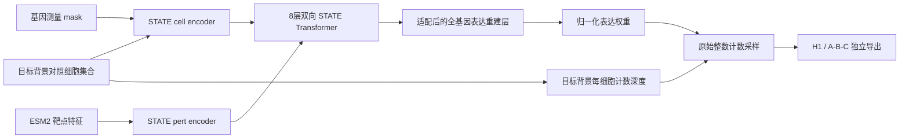

# VC2026：以 STATE 为基线的训练与提交方案

> **2026-09-25 已被新方案替代：**用户已授权重新制定并执行首投方案。新核查发现，原推荐权重的靶点词表与 A/B/C 300 个靶点的精确符号交集为 0，不能按旧文直接建立全部目标上的原模型基线。本文保留为历史设计；当前执行入口见[微调首投执行方案](state-finetuning-replan.md)。

> 修订日期：2026-09-14。用户要求：STATE 是基线；使用 GPU 训练神经模型，先完成有效提交，再逐步提分。
> 本文替代此前 Ridge-first / 无 GPU 首投方案。当前仍处于设计与源码核验阶段，尚未训练或提交；不把设计当作已取得的成绩。
> 执行入口以本文为准。旧分解式架构、容量调查中的模型顺序只保留为历史研究。

**确定路线：先核验并加载官方 STATE 检查点建立 S0 → 对不兼容的输入/输出层和必要主干做微调，完成 S1 原始计数首投 → S2 增量提分。** Ridge、均值和 NTC 只作诊断对照，不作为主模型。是否需要训练、训练哪些层，由检查点兼容性和离线结果决定；从零训练不是首投前置要求。

### 初始化策略补充：不必从头训练

2026-09-14 已直接核实 Arc 官方 Hugging Face 上存在 `ST-HVG-Replogle`、`ST-SE-Replogle`、`st-x-replogle-full`、`st-se-replogle-full` 的真实 checkpoint 与配套配置。先前只核验训练源码、未检查已发布权重，就默认安排随机初始化和 40k/80k steps，这一顺序已修正。

抽查的 `ST-HVG-Replogle/zeroshot/jurkat` 为 2,000 维输入/输出；`st-x-replogle-full/k562_0.99` 为 6,546 维输入/输出。两者均为 328 hidden、set 64、2,024 维 one-hot 靶点、batch encoder 开启，和当前源码默认的 768 宽 / ESM2 starter 不同。`full` 不能解释为已经覆盖比赛 18,533 genes。

先下载一个选定 checkpoint、config 和必要映射，检查许可、训练暴露、gene/target覆盖与加载版本，尝试本机 8 GB GPU 小批推理。可直接推理的部分保持冻结；需要支持新靶点或全基因时，优先保留可迁移主干并微调新编码/输出层。改变基因顺序必须按符号迁移相关权重，不能按数组位置硬加载。只有缺少可用初始化、架构不兼容或严格验证需要时，才启动下文完整重训分支。

**以下 A100 80 GB / 150 小时是完整训练与升级分支的资源上限规划，暂不作为加载现有权重的启动采购请求。** 推理/微调实际预算在小批加载和短程试跑后重新给出。证据见[权重核验补充](state-training-source-audit.md#已发布检查点补充不必从零训练)。

## 1. 用户提供的环境，以及我负责的工作

### 1.1 需要完整训练与升级时的 GPU 环境

| 项目 | 确定配置 | 原因 |
|---|---|---|
| GPU | **1 × NVIDIA A100 80 GB** | STATE 集合 Transformer、全基因输出和训练中间激活；单卡完成训练 |
| CPU | **32 vCPU** | 数据预处理、供数、H1 CPU 评分和打包 |
| 主机内存 | **128 GB RAM** | H5AD 处理、评价、完整稀疏预测文件及打包副本 |
| 存储 | **500 GB 可用、持久化 SSD** | 原始数据、canonical shards、多个 checkpoint、H5AD/VCC 临时文件 |
| 系统 | Ubuntu 22.04 LTS，x86_64 | 保持 CUDA/PyTorch 与 HDF5 工具链稳定 |
| GPU 环境 | 云平台已装兼容 NVIDIA 驱动，`nvidia-smi` 正常 | 我安装并锁定 PyTorch/CUDA 用户环境；不要求用户自己拼依赖 |
| Python | STATE 与 H1 scorer 分别使用 Python 3.12 环境 | 两者固定各自依赖，避免影响仓库现有 Python 3.13 |
| 网络 | 可访问 GitHub、PyPI、Zenodo、Figshare、GCS、比赛服务；建议 ≥100 Mbps | 下载约 39 GB 初始数据/资产，并上传预测 |
| 访问 | 当前工作区可达的 SSH 配置别名，或 host/port/user；本地 SSH key | 我部署、训练、评价、回收结果 |
| 运行方式 | 可持续运行训练任务，支持 tmux；磁盘可跨关机保留 | 避免会话断开丢失长任务 |

这是本项目选定的交付配置，不声称 A100 80 GB 是 STATE 的最低要求。作者 T4 notebook 证明较小 GPU 可以训练某些配置；这里为全基因模型和开发余量选择 80 GB。当前本机约 15.5 GiB RAM、RTX 3070 Ti Laptop 8 GiB，可用于编码和小型检查，不承担正式训练。

**先完成现有检查点兼容性与小批推理，再确认需使用的服务器资源。** 如需云端，用户提供连接入口与可用额度；环境、下载、代码适配、微调/训练、评价和提交文件由我完成。正式上传时使用已注册的比赛账号及执行环境中的登录状态。

### 1.2 算力与工期

如进入完整训练分支，按 **150 个 A100 单卡占用小时**做上限工程预算，按阶段启停；这不是当前已确定的必要开销。GPU 实例开着执行 CPU 任务也可能计费，费用记录按实例实际运行计。

首先做现成权重的小批推理；确认需要微调后再做短程 **2,000-step pilot**，记录吞吐、显存/RSS、损失与验证变化。40k/80k steps 是完整重训分支的上限，不直接套给微调。

```text
预计总训练小时 = 各 run 的 steps / 实测 steps_per_second / 3600
总预算另计：验证、数据处理、失败重跑与打包
```

计划 10–14 天完成 S1 首投。S2 提分在首投后继续，不等待所有候选完成才交第一个 STATE 结果。预算不足时先保证 S0/S1 的训练与提交链，减少 S2 实验数量，不退回统计模型来宣称完成这次目标。

## 2. 数据和资产：固定下载清单

| 文件 / 资源 | 大小约 GB | 用途 |
|---|---:|---|
| `ReplogleWeissman2022_K562_gwps.h5ad` | 8.805 | 广靶点 CRISPRi 训练 |
| `ReplogleWeissman2022_K562_essential.h5ad` | 1.547 | 与其他背景共享靶点的训练/评价 |
| `ReplogleWeissman2022_rpe1.h5ad` | 1.237 | RPE1 背景 |
| `NadigOConner2024_hepg2.h5ad` | 0.851 | HepG2 背景 |
| `NadigOConner2024_jurkat.h5ad` | 1.294 | Jurkat 背景 |
| Arc H1 `2025/train/adata_Training.h5ad` | 15.482 | 先作 H1 留出评价，结构冻结后可用于正式训练 |
| 作者 `competition_support_set.zip` | 8.717 | **只提取需要的 `ESM2_pert_features.pt` 等特征资产**，不用其中的 H1 模型/标签替代干净验证 |
| DepMap 24Q4 `CRISPRGeneEffect.csv` | 0.429 | S2 靶点先验 |
| A/B/C controls + gene/target CSV + manifest | 本机已有，zip 0.662 | 最终推理与提交合同 |

新增主要下载约 **38.36 GB**，迁移已有 controls 后约 39 GB；另计环境、H1 小型 benchmark asset 与缓存。ESM2 特征文件的独立大小和维度尚未读取；先下载/检查资产，再保存维度及覆盖清单，不能拿压缩包的总大小当作特征大小。选择性解压，不要求把 support ZIP 的所有约 48.7 GB 内容展开。

数据入口固定为：

- 五个训练 H5AD：[scPerturb / Zenodo 13350497](https://zenodo.org/records/13350497)，前轮已重新核实文件名、字节数与 checksum 字段。
- H1：由 [benchmark v0.2.0 registry](https://github.com/forrestsheldon/vcc2026-h1-benchmark/blob/d28dd0496cc9fbf1d0088ce171208c0deb54a268/assets/benchmark-v1.json)指定的 Arc 原件，SHA-256 验证后使用。
- 作者特征：[STATE support ZIP](https://storage.googleapis.com/vcc_data_prod/datasets/state/competition_support_set.zip)，入口由作者 [VCC Colab](https://colab.research.google.com/drive/1QKOtYP7bMpdgDJEipDxaJqOchv7oQ-_l)核实。
- DepMap：[24Q4 v1](https://doi.org/10.25452/figshare.plus.27993248.v1)，[corrected CSV](https://ndownloader.figshare.com/files/51064667)。

数据处理保留 source、context、batch、target、guide、原始 counts、基因测量 mask 和许可来源。训练单位是同条件细胞集合；对照与扰动细胞没有真实逐细胞配对。不同 screen 先按实验来源去重，同一个 K562 的两个 screen 在背景留出时一起移除。

Orion、CD4 screen、Jiang 等暂不扩大首投数据范围。后续新增时先确认 CRISPRi/KO 模态和背景增量；Ward 16 细胞系数据是 knockout，不能直接混成 CRISPRi。

## 3. 训练哪个 STATE：固定源码和真实配置

固定 [ArcInstitute/state commit `9bbfe78a`](https://github.com/ArcInstitute/state/tree/9bbfe78a434a55205e4de834e1ea99f85f7a3add)，包版本 0.11.3。使用 **State Transition（ST，状态转移模型）**。加载已发布权重时继承其实际结构与预处理，并处理旧版本兼容性；下表的 8 层/768 是当前源码默认及完整重训分支的参考配置，不能强加给已发布的 328 宽检查点。ESM2 蛋白特征和 SE 模型也可复用相应预训练资产。

| 配置 | 采用值 | 来源 / 说明 |
|---|---:|---|
| 模型 | `model=state` | 官方标准配置；不用 `state_sm` 替代 |
| Backbone | 双向 Llama Transformer | 不是自然语言生成，不使用细胞位置编码 |
| Transformer 层数 | **8** | 官方 `num_hidden_layers` |
| 隐藏维度 | **768** | 官方默认 |
| Attention heads | **12** | KV heads 同为 12，head dimension 64 |
| FFN intermediate | **3072** | 官方默认 |
| 细胞集合长度 | **512** | 官方 `cell_set_len`；集合内细胞来自同一条件 |
| 有效 batch | **16 个集合** | 单卡先 microbatch 4 × accumulation 4；与直接 batch 16 的差异记录在运行清单 |
| 靶点输入 | 作者提供的 **ESM2 连续向量** | VCC starter 已使用，不能声称这是我们新增的能力 |
| cell/pert encoder | 各 1 层配置，映射到 768 | 与 Transformer 的 8 层是不同参数 |
| Batch encoder | **false** | 不要求未见背景有已学习的身份 ID |
| 残差预测 | **true** | 保留 STATE 结构 |
| 主损失 | **Energy distance / MMD-family 集合分布损失** | 比较两组细胞，不强造配对 MSE 标签 |
| 优化器 | **Adam，lr=1e-4** | 当前实现实际调用 Adam；YAML 的 weight_decay 没有传入优化器 |
| 梯度裁剪 | **10** | 官方默认 |
| 主干 dropout | **0** | 官方默认 |
| S0/S1 单次开发训练 | **40,000 optimizer steps 上限** | 采用 starter 的步数预算；每 2,000 步验证/保存 |
| S1 最终训练 | **80,000 steps 上限** | 项目训练上限，步数由内部验证决定，不盲目跑满 |
| Precision | **bf16-mixed，FP32 计算敏感损失/统计** | 需要我新增 Trainer 配置，并先通过有限值/数值检查 |
| Seed | 首轮 42，最终候选复核 43/44 | 同一比较使用相同数据/模板/种子 |

注意三项已核实的实现事实：

1. 当前 STATE Trainer 默认 **FP32**，bf16 只在另一个 scGPT 分支出现；不能只在 YAML 写 `training.precision` 就声称启用了 bf16。本项目会实现该配置的实际传递并记录运行 dtype。
2. 完整基因路径还包含 `G → G//8 → G` 的重建层。全基因版的可训练参数是约 **2 亿量级**，精确值以实例化输出为准，不能只报 Transformer 主干参数。
3. `output_space=all` 表示输出所有训练基因，**不表示输出 raw counts**。官方 infer 仍写浮点表达并做范围裁剪，不能直接上传。

源码、作者 notebook 的原始值及可执行 CLI 骨架见 [STATE 源码审计](state-training-source-audit.md)。作者 Colab 是 2025 H1 starter，没有固定 Git commit；本方案固定源码与数据协议后重建基线，不承诺复制某个榜单 entry 的内部配置或历史分数。

## 4. 模型版本与改进范围

### S0：STATE 基线，先建立比较标准

先使用已发布 ST checkpoint 的原始主干、基因列表和靶点表示做基线推理。已有 one-hot 权重只在映射覆盖的目标上有定义；遇到未覆盖目标不能静默回退对照。若需自行训练一个与当前数据划分严格匹配的对照，才用上述标准主干在训练 fold 内选 2,000 HVG 并训练。**HVG** 是变化较明显的基因；不能因此将正式输出的其他基因计数清零。

这是官方 STATE 架构在本项目匹配协议下的基线变体，不能称为逐字复现 2025 Colab。HVG、标准化和超参数均只从允许的训练数据计算。输出经过 §5 的同一计数适配器，HVG 外保留目标对照基线，形成完整 H1 或 A/B/C 预测。

S0 要交付真实 checkpoint、训练曲线、H1 六指标、至少一个跨背景 fold 和完整输出样例。NTC/mean/Ridge 只用于检查数据与标签；即使它们跑通，也不算完成 S0。

### S1：首投模型——全基因、测量缺失感知的 STATE

**首个正式提交用 S1。** 优先保留选中检查点的 STATE 主干，补齐本赛合同与多来源训练；如输入靶点编码或输出基因维度变化，则训练新增/调整的层并按需解冻主干。从 328 扩到 768 是独立架构实验，不是复用权重的必需步骤。



具体增量：

- **统一全基因轴。** 本轮已用真实 CSV 复核：H1 18,080 与 VC2026 18,533 的并集为 **18,536**，交集为 18,077。内部 S1 输入/输出用这 18,536 个基因；分别按官方 CSV 导出 H1 和 A/B/C。H1 独有 `HSPA14-1`、`TBCE-1`、`TMSB15B-1` 不凭相似名字静默合并。
- **测量缺失 mask。** source 缺失的基因可在存储张量中占位，但不能作为真实零表达参加 loss。按 source/condition 的实测基因计算归一化和分布损失，并给 cell encoder 增加 mask 投影，让“未测”与“测得零”可区分；新增分支从零输出初始化。
- **全基因重建。** 使用 STATE 原生 full-gene 路径和重建层；输入、输出维度都按统一轴设置，避免把 2,000 维输入直接加到 18,536 维残差上。
- **靶点覆盖检查。** ESM2 字典覆盖全部训练/预测目标后才启动。上游对缺向量会静默给零向量或回退对照，本项目改为明确报缺口，补可核验特征后再运行，不能让未知 target 被悄悄当作 NTC。
- **分块推理。** 官方 infer 有全量加载/dense 路径；我们只按单个背景/靶点的小块调用模型，分块写完整稀疏 H5AD。

S1 第一版仍只用 masked Energy loss，先让全基因适配能与 S0 公平比较。新增分支和 mask 是本项目开发内容，尚未实现；不把它们说成现成 CLI 开关。

### S2：首投后的提分模型

在 S1 checkpoint 上继续训练，按下面顺序做独立消融：

1. **ESM2 + DepMap 靶点融合。** DepMap 在训练目标上标准化、PCA 到 50 维，通过 `50 → 256 → 768` 的 MLP 加到已有 ESM2 条件表示；末层零初始化。ESM2 表示蛋白序列相关特征，DepMap 表示跨细胞系功能依赖，两者提供不同信息。
2. **加入伪批量误差约束。** 保留集合 Energy loss，增加每条件群体表达的 Huber loss，初始权重 0.1，与关闭该项比较；计算方式对齐官方 bulk 归一化，而不是对任意配对细胞做监督。
3. **只用内部验证校准效应幅度。** 比较保守的幅度系数 `{0.5, 0.75, 1.0}`，模型和计数生成器固定后做扫描；不能按 A/B/C 多次提交来反推参数。

S2 必须在相同 split、数据、计数适配器和评价版本下超过 S1 才替换首投版本。不预先打包所有改动并宣称一定提升，不用“加 ESM2”重复计为新增能力。

## 5. 怎样把 STATE 输出变成可提交的 counts

STATE 学习的表达空间与提交格式不同，这一层是首投必须完成的工作。

1. 为每个 `(context, target)` 固定抽取对照模板；A/B/C 按 46 个 guide 平衡取 400 个。模型集合长度为 512，因此推理临时取 512 个模板并运行，按预定索引保留平衡的 400 个，剩余只作集合上下文；同一 seed 的候选共用全部模板和保留索引。
2. 模型输出 `z_i,g` 是 `log1p(CP10K)` 空间的非负浮点表达。将其转为非负线性权重 `u_i,g = expm1(z_i,g)`，再归一化为每细胞基因比例；**`expm1` 得到的仍不是 raw counts**。
3. 对模型没有任何扰动监督覆盖的基因，使用目标 NTC 的基线权重，并记录覆盖 mask。S0 的非 HVG 基因同样走这一路；缺失不能变成生物学零计数。
4. 从对应目标 NTC 模板取该细胞总计数 `L_i`，使用 `Multinomial(L_i, p_i)` 生成整数 counts。每个细胞有自己的 STATE 预测比例，不能把一个群体均值复制 400 次。
5. 去掉显式零，以 CSR 分块写出；基因顺序、行数、标签、每行总计数与 stored entries 在写出和打包时双重检查。

这是确定的首版计数生成器，S0/S1/S2 使用同一实现。多项式采样会引入抽样噪声，固定目标 NTC 深度也不模拟扰动导致的总 RNA 量变化；它们是需要通过 H1/跨背景六指标检查的模型假设。若均值好而 DE 指标差，再单独测试计数分布改进，不和主干/先验一起改。

## 6. 验证顺序与 H1 的两种用途

### 6.1 阶段 A：H1 是开发留出背景

训练只用五个 Replogle/Nadig 文件，H1 仅提供 NTC。H1 的全部扰动、reference DE、moments、anchors 都只供 evaluator；不用曾见过 H1 扰动的 STATE checkpoint。

运行 [H1 benchmark v0.2.0](h1-benchmark-audit.md)：126 targets ×400 cells、18,080 genes、38,176 NTC，固定 `cell-eval2 0.16.0` 和 `pdex 0.3.0`。先复现工具的 control baseline，再比较 S0/S1；作者 baseline 约 −0.04523 是待本机复现的参考值，不是 A/B/C 预期分数。

H1 可用于开发诊断和预先声明的有限配置选择，反复调过的 H1 得分不再称独立最终验证。

### 6.2 阶段 B：四个背景留出，验证提升是否稳定

模型结构和选择规则冻结后，分别完整留出 K562、RPE1、HepG2、Jurkat。每次从其他背景训练，内层负责参数选择，外层只评冻结结果；K562 的两个 screen 一起留出。补一组目标同时留出的实验，目标从所有训练背景中移除。

**此阶段可以把 H1 training 的 150 个扰动加入其余训练背景，前提是 S0/S1/S2 全部使用相同数据政策。** 这利用了已允许的公共干细胞/Flex 数据，也扩大全基因监督；此后模型在 H1 上的得分不能再称“未见 H1”。与旧方案把 H1 永久限制为评价数据不同，这是在开发协议冻结后的明确重训阶段。

公开 source 并非所有目标都有 400 个实测细胞。外层面板固定为有足够真实细胞的条件；不足时如实报告规模，不复制真实细胞来伪造 400 个独立参考样本，不私改 H1 canonical anchors。

### 6.3 阶段 C：拟合正式提交模型

用全部五个 source 文件与 H1 training 重新训练 S1；若 S2 通过晋级门，则训练 S2。保留阶段 A/B checkpoint 和分数，分开登记最终 checkpoint 的训练暴露。最终只读取 A/B/C NTC 与目标列表推理。

报告六项 raw/scaled、每背景得分、目标覆盖率、生成 seed 波动。S2 晋级初始门设为：相对 S1 至少 3/4 个背景改善，平均改善超过三种子波动，最差背景退化不超过 0.02 scaled score；这是预先固定的工程门槛，不根据外层结果反复修改。

STATE 基线与改进模型在本地代理任务的得分不能直接换算成榜单分数；当前没有证据可承诺名次。对照和 Ridge 的作用是定位问题，不是降低主基线标准。

## 7. 10–14 天的实施与验收

| 时间 | 工作 | 交付 / 验收 |
|---|---|---|
| 第 1–2 天 | 核验现有 ST checkpoint/config/映射/训练暴露，小批推理，建立 H1 工具基线 | 可加载资产、目标/基因覆盖表、实际推理内存；决定直接复用/微调范围 |
| 第 3 天 | 对需要的适配做短程微调 pilot；核对 normalization、损失、bf16、吞吐 | 曲线、GPU/host 峰值；重新给出资源预算，完整重训才参考150小时上限 |
| 第 4–5 天 | S0 现有权重评价；必要时微调；搭建计数适配器 | STATE 基线六指标与原生导出；自行重训只用于必要的干净对照 |
| 第 6–9 天 | S1 全基因/mask适配、40k-step开发训练、H1及跨背景比较 | 真实 S1 checkpoint、分布/覆盖诊断、必要修正；保留 S0 |
| 第 10–12 天 | 固定配置完成其余外层评价；按阶段 C 正式训练，复核生成种子 | 最终模型、训练清单、外层 scorecard |
| 第 13–14 天 | A/B/C 分块生成、完整预检、打包、上传 | `prediction.h5ad`、`prediction.vcc`、QC、提交记录 |
| 首投后 | S2 先验/辅助损失/幅度消融 | 与 S1 相同协议的晋级报告 |

若 S1 适配尚未通过验收，先保留已经过验证的 S0 STATE checkpoint 及合法全轴适配结果作为修复期间的可交付备份；报告其覆盖限制，不改用 Ridge 宣称达到 STATE 主线目标。GPU 实际吞吐、下载和评价耗时会影响日历安排。

第一批不同时运行几十组超参数。优先完成一套 S0 和一套 S1 的 checkpoint—六指标—提交闭环；多 seed 和 S2 的预算在 pilot 后明确分配。

## 8. 提交合同与可复现交付

A/B/C 输出必须是 **360,000×18,533**，每背景/靶点恰好 400 cells；`obs` 包含 `target_gene`、`context`，不含 NTC 行；有限非负整数，每细胞总数 ≤1,000,000，存储项 ≤4,750,000,000。CSR 在需要时使用 int64 行指针，不能把磁盘压缩体积当作内存需求。

```bash
mkdir -p output/submission-qc
/usr/bin/time -v -o output/submission-qc/preflight-time.txt \
  vcc prep prediction.h5ad -g gene_names.csv --perts pert_counts.csv \
  --contexts A,B,C --dry-run
/usr/bin/time -v -o output/submission-qc/pack-time.txt \
  vcc prep prediction.h5ad -g gene_names.csv --perts pert_counts.csv \
  --contexts A,B,C -o prediction.vcc
```

对完整文件实测生成、预检和打包 peak RSS；社区记录已撤回其 OOM 因果解释，稀疏生成成功不保证打包一定成功。[社区核验](participant-evidence-review.md)

最终交付：模型 checkpoint、源码 commit/patch、resolved config、环境锁、data/split/feature/gene-axis manifest、H1/跨背景 scorecard、生成 seed 与模板清单、两个预测文件、QC 和提交 ID。大文件放忽略目录/持久盘，Git 只保存代码、配置和紧凑报告。

10 月 22 日 D/E/F 发布后，按冻结流程换用新 NTC、目标及基因清单，打包显式设 `--contexts D,E,F`。最终截止为 **2026-11-05 23:59 UTC，即北京时间 11 月 6 日 07:59**；最后一次 final entry 参奖。[官方合同核验](submission-contract-check.md)

## 9. 已核验、需要实现和仍待测量的边界

| 状态 | 内容 |
|---|---|
| 已核验 | STATE标准架构/优化器/默认精度、ESM2条件输入、缺目标回退、浮点infer、full-gene额外重建层；官方提交合同；H1/2026并集18,536 |
| 需要我实现 | bf16实际配置、missing-target fail-fast、全基因mask数据/损失/编码、分块推理、原始计数采样、S2融合和辅助损失 |
| 需要实测 | checkpoint参数量、吞吐/显存/RSS、H1工具baseline、STATE及改进模型六指标、完整打包、最终线上分数 |
| 不作为事实 | 候选必胜STATE、直接复现作者榜单分数、T4时长等比例换算A100、已完成训练或提交 |

一手代码审计见 [state-training-source-audit.md](state-training-source-audit.md)。方法与来源仍沿 [论文索引](../references/INDEX.md)，重点使用 STATE；响应分解、AdaPert 等只支持后续组件假设。作者博客支持数据整合和分布输出的工程经验，不替代 STATE 基线或官方评分定义。

本轮使用 research 技能独立审阅官方 STATE/cell-load 源码及作者 VCC Colab；调用记录见源码审计。主代理另下载官方 H1 gene CSV 一次，与本地 2026 CSV 比较并核对 SHA-256，得到 18,536 并集。没有主题扩搜，没有下载大数据/权重、安装训练环境、租赁机器或运行训练。先前方案中的“无 GPU、Ridge 主模型、STATE 首投后再做”已明确撤销。
